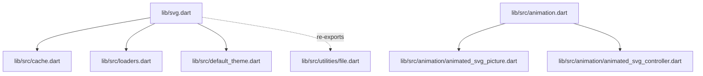
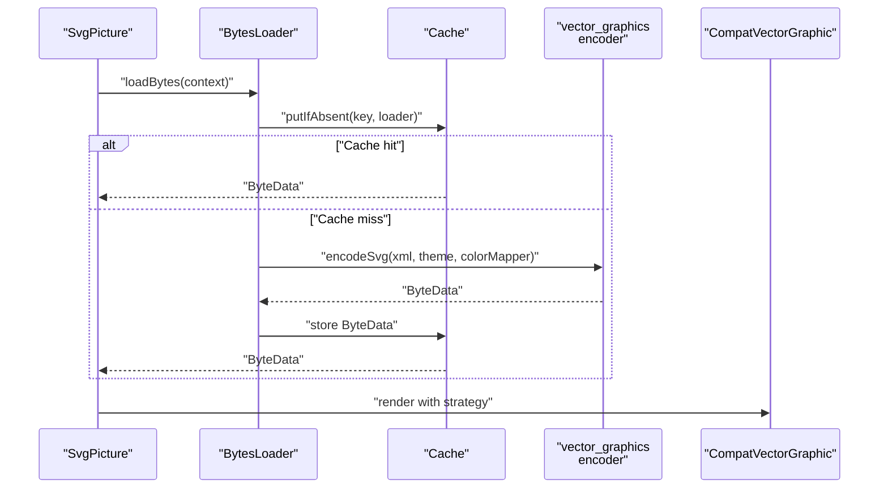
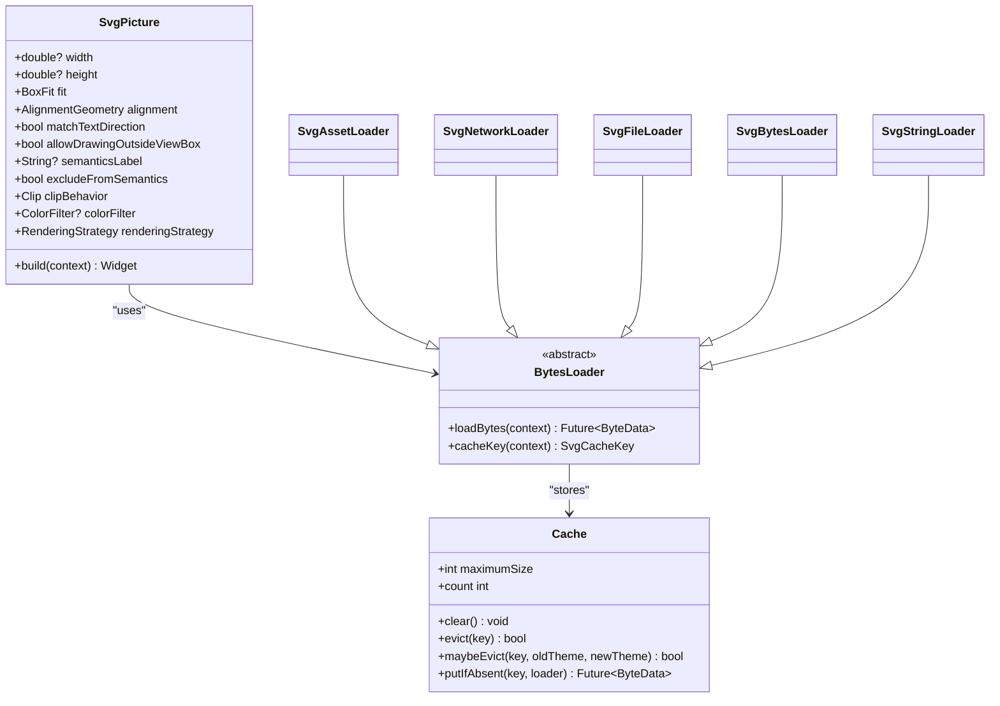
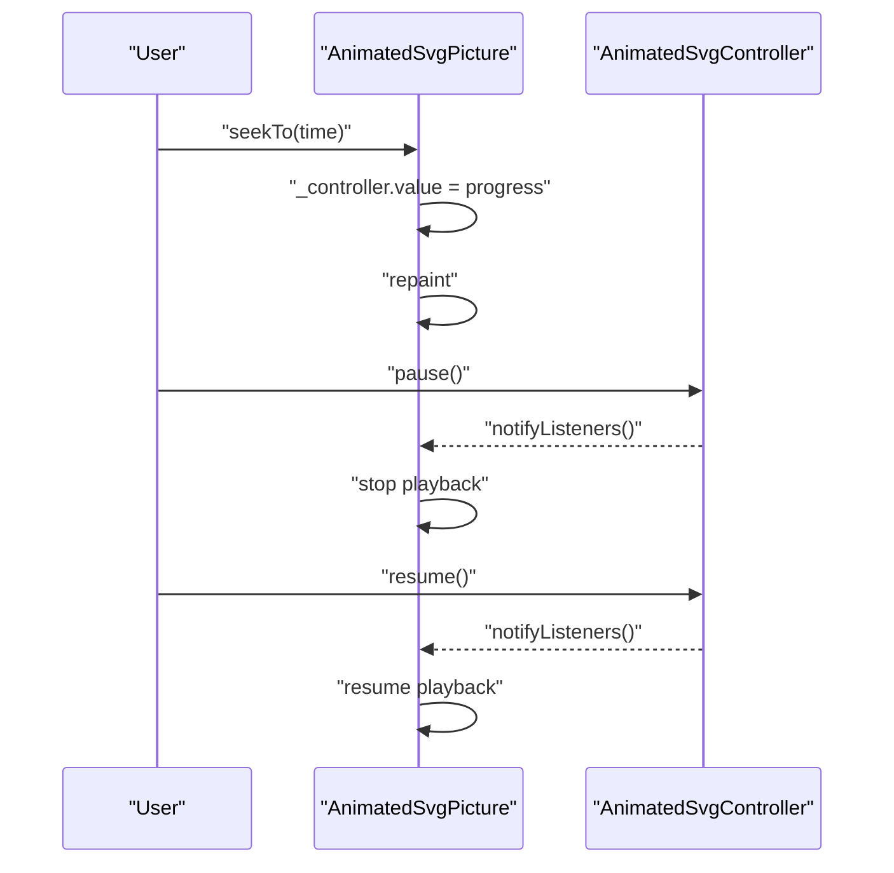
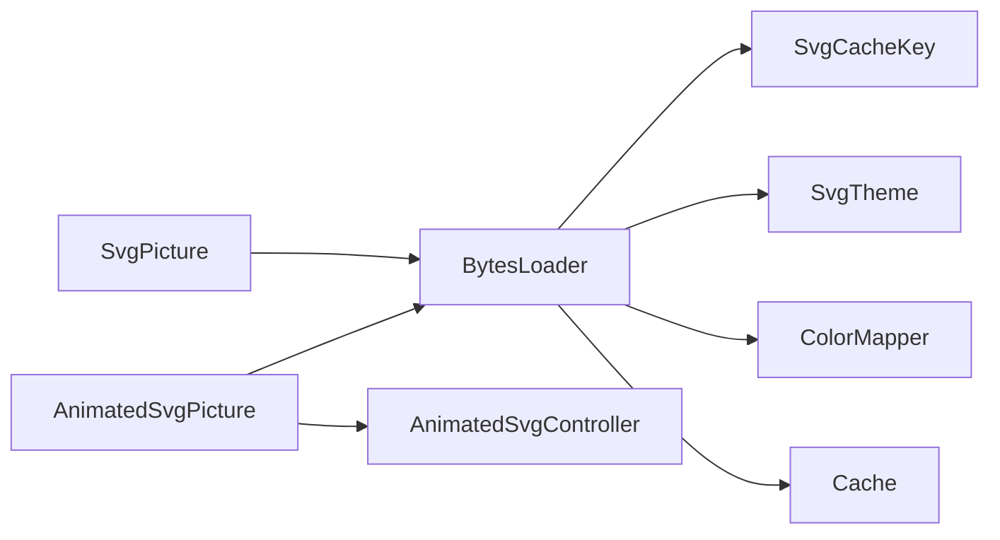

# API Reference

<cite>
**Referenced Files in This Document**
- [svg.dart](file://lib/svg.dart)
- [cache.dart](file://lib/src/cache.dart)
- [loaders.dart](file://lib/src/loaders.dart)
- [default_theme.dart](file://lib/src/default_theme.dart)
- [animated_svg_picture.dart](file://lib/src/animation/animated_svg_picture.dart)
- [animated_svg_controller.dart](file://lib/src/animation/animated_svg_controller.dart)
- [animation.dart](file://lib/src/animation.dart)
- [file.dart](file://lib/src/utilities/file.dart)
</cite>

## Table of Contents
1. [Introduction](#introduction)
2. [Project Structure](#project-structure)
3. [Core Components](#core-components)
4. [Architecture Overview](#architecture-overview)
5. [Detailed Component Analysis](#detailed-component-analysis)
6. [Dependency Analysis](#dependency-analysis)
7. [Performance Considerations](#performance-considerations)
8. [Troubleshooting Guide](#troubleshooting-guide)
9. [Conclusion](#conclusion)
10. [Appendices](#appendices)

## Introduction
This document provides a comprehensive API reference for the flutter_svg package. It covers public classes, widgets, enums, constants, and configuration options exposed by the library. It focuses on:
- SvgPicture widget constructors, properties, and rendering behavior
- Cache class for manual cache control
- BytesLoader hierarchy and ColorMapper interface for custom loading and color transformation
- AnimatedSvgPicture API, controller properties, and state management
- Public constants, enums, and configuration options
- Usage examples, error handling patterns, version compatibility, deprecations, migration notes, performance considerations, and best practices

## Project Structure
The library exposes a concise public API via a single export file and organizes internal functionality under src. Animation-specific APIs are grouped under a dedicated module.

**Diagram sources**
- [svg.dart:12-17](file://lib/svg.dart#L12-L17)
- [cache.dart:1-111](file://lib/src/cache.dart#L1-L111)
- [loaders.dart:1-467](file://lib/src/loaders.dart#L1-L467)
- [default_theme.dart:1-36](file://lib/src/default_theme.dart#L1-L36)
- [animation.dart:1-31](file://lib/src/animation.dart#L1-L31)
- [animated_svg_picture.dart:108-164](file://lib/src/animation/animated_svg_picture.dart#L108-L164)
- [animated_svg_controller.dart:25-131](file://lib/src/animation/animated_svg_controller.dart#L25-L131)
- [file.dart:1-2](file://lib/src/utilities/file.dart#L1-L2)

**Section sources**
- [svg.dart:12-17](file://lib/svg.dart#L12-L17)
- [animation.dart:1-31](file://lib/src/animation.dart#L1-L31)

## Core Components
- SvgPicture: A widget that renders SVGs from various sources (assets, network, file, memory, string) with flexible layout, semantics, and rendering strategies.
- Cache: A cache for decoded SVGs with manual eviction and size control.
- BytesLoader hierarchy: Pluggable loaders for assets, network, files, and raw bytes/strings with theme and color mapping support.
- ColorMapper: Interface for transforming colors during SVG parsing.
- AnimatedSvgPicture: Animated SVG renderer supporting SMIL/CSS animations with a controller for playback control and state management.
- DefaultSvgTheme: Provides default theme values to descendant SvgPicture widgets.

**Section sources**
- [svg.dart:56-627](file://lib/svg.dart#L56-L627)
- [cache.dart:4-111](file://lib/src/cache.dart#L4-L111)
- [loaders.dart:15-467](file://lib/src/loaders.dart#L15-L467)
- [default_theme.dart:5-36](file://lib/src/default_theme.dart#L5-L36)
- [animated_svg_picture.dart:108-295](file://lib/src/animation/animated_svg_picture.dart#L108-L295)
- [animated_svg_controller.dart:25-131](file://lib/src/animation/animated_svg_controller.dart#L25-L131)

## Architecture Overview
The rendering pipeline integrates Flutter’s vector graphics compatibility layer with a cache and pluggable loaders. SvgPicture delegates to a BytesLoader, which resolves data and produces a vector_graphics binary via an isolate-computed encoder. AnimatedSvgPicture builds upon the same pipeline and adds timeline-driven animation.

**Diagram sources**
- [svg.dart:543-560](file://lib/svg.dart#L543-L560)
- [loaders.dart:185-194](file://lib/src/loaders.dart#L185-L194)
- [cache.dart:65-93](file://lib/src/cache.dart#L65-L93)

## Detailed Component Analysis

### SvgPicture API
SvgPicture renders SVGs from multiple sources and supports layout, semantics, clipping, placeholder/error widgets, and rendering strategy selection.

- Constructors and parameters
  - From asset bundle: [SvgPicture.asset:180-211](file://lib/svg.dart#L180-L211)
  - From network: [SvgPicture.network:245-276](file://lib/svg.dart#L245-L276)
  - From file: [SvgPicture.file:308-335](file://lib/svg.dart#L308-L335)
  - From memory (Uint8List): [SvgPicture.memory:364-391](file://lib/svg.dart#L364-L391)
  - From string: [SvgPicture.string:420-447](file://lib/svg.dart#L420-L447)
  - Common constructor parameters include width, height, fit, alignment, semanticsLabel, excludeFromSemantics, clipBehavior, placeholderBuilder, errorBuilder, colorFilter, matchTextDirection, allowDrawingOutsideViewBox, renderingStrategy, and theme/colorMapper for loaders.

- Properties and behavior
  - bytesLoader: [SvgPicture.bytesLoader:495-496](file://lib/svg.dart#L495-L496)
  - Rendering strategy: [SvgPicture.renderingStrategy:534-540](file://lib/svg.dart#L534-L540)
  - Placeholder and error builders: [SvgPicture.placeholderBuilder:498-499](file://lib/svg.dart#L498-L499), [SvgPicture.errorBuilder:528-529](file://lib/svg.dart#L528-L529)
  - Layout and alignment: [SvgPicture.width:459-461](file://lib/svg.dart#L459-L461), [SvgPicture.height:462-466](file://lib/svg.dart#L462-L466), [SvgPicture.fit:467-469](file://lib/svg.dart#L467-L469), [SvgPicture.alignment:471-493](file://lib/svg.dart#L471-L493)
  - Semantics: [SvgPicture.semanticsLabel:508-512](file://lib/svg.dart#L508-L512), [SvgPicture.excludeFromSemantics:514-518](file://lib/svg.dart#L514-L518)
  - Clipping and RTL mirroring: [SvgPicture.clipBehavior:520-526](file://lib/svg.dart#L520-L526), [SvgPicture.matchTextDirection:501-502](file://lib/svg.dart#L501-L502)
  - Drawing outside viewBox: [SvgPicture.allowDrawingOutsideViewBox:504-506](file://lib/svg.dart#L504-L506)
  - Color filtering: [SvgPicture.colorFilter:531-532](file://lib/svg.dart#L531-L532)
  - Default placeholder: [SvgPicture.defaultPlaceholderBuilder:454-457](file://lib/svg.dart#L454-L457)

- Rendering strategy
  - RenderingStrategy is used to select the underlying rendering approach. See [SvgPicture.renderingStrategy:534-540](file://lib/svg.dart#L534-L540).

- Deprecations and compatibility
  - Theme parameter on asset/network/file/string constructors is deprecated in favor of setting theme on the loader. See [SvgPicture.asset:196-197](file://lib/svg.dart#L196-L197), [SvgPicture.network:265-266](file://lib/svg.dart#L265-L266), [SvgPicture.file:327-328](file://lib/svg.dart#L327-L328), [SvgPicture.string:440-441](file://lib/svg.dart#L440-L441).
  - cacheColorFilter is deprecated and has no effect. See [SvgPicture.cacheColorFilter:100-100](file://lib/svg.dart#L100-L100), [SvgPicture.asset:202-202](file://lib/svg.dart#L202-L202), [SvgPicture.network:264-264](file://lib/svg.dart#L264-L264), [SvgPicture.file:328-328](file://lib/svg.dart#L328-L328), [SvgPicture.string:440-440](file://lib/svg.dart#L440-L440).
  - Legacy color/blendMode parameters are deprecated in favor of colorFilter. See [SvgPicture.asset:199-201](file://lib/svg.dart#L199-L201), [SvgPicture.network:257-259](file://lib/svg.dart#L257-L259), [SvgPicture.file:318-321](file://lib/svg.dart#L318-L321), [SvgPicture.string:374-377](file://lib/svg.dart#L374-L377).

- Usage examples
  - Basic asset usage: [SvgPicture.asset:180-211](file://lib/svg.dart#L180-L211)
  - Network usage with headers and theme: [SvgPicture.network:245-276](file://lib/svg.dart#L245-L276)
  - File usage with theme and colorMapper: [SvgPicture.file:308-335](file://lib/svg.dart#L308-L335)
  - Memory usage with colorFilter: [SvgPicture.memory:364-391](file://lib/svg.dart#L364-L391)
  - String usage with theme and colorMapper: [SvgPicture.string:420-447](file://lib/svg.dart#L420-L447)

- Error handling patterns
  - Provide an errorBuilder to display a fallback widget on load failures. See [SvgPicture.errorBuilder:528-529](file://lib/svg.dart#L528-L529).
  - PlaceholderBuilder can be used to indicate loading state. See [SvgPicture.placeholderBuilder:498-499](file://lib/svg.dart#L498-L499).

- Best practices
  - Specify width and height or constrain layout to avoid layout shifts during load. See [SvgPicture documentation:57-71](file://lib/svg.dart#L57-L71).
  - Prefer colorFilter over legacy color/blendMode parameters. See [SvgPicture._getColorFilter:449-452](file://lib/svg.dart#L449-L452).

**Section sources**
- [svg.dart:56-627](file://lib/svg.dart#L56-L627)

#### Class Diagram: SvgPicture and Loaders

**Diagram sources**
- [svg.dart:56-627](file://lib/svg.dart#L56-L627)
- [loaders.dart:121-194](file://lib/src/loaders.dart#L121-L194)
- [cache.dart:4-111](file://lib/src/cache.dart#L4-L111)

### Cache API
The Cache class provides a thread-safe, LRU-style cache for decoded SVG ByteData keyed by SvgCacheKey.

- Properties and methods
  - maximumSize: [Cache.maximumSize:9-36](file://lib/src/cache.dart#L9-L36)
  - clear(): [Cache.clear:38-44](file://lib/src/cache.dart#L38-L44)
  - evict(key): [Cache.evict:46-49](file://lib/src/cache.dart#L46-L49)
  - maybeEvict(key, oldTheme, newTheme): [Cache.maybeEvict:51-58](file://lib/src/cache.dart#L51-L58)
  - putIfAbsent(key, loader): [Cache.putIfAbsent:60-93](file://lib/src/cache.dart#L60-L93)
  - count: [Cache.count:108-109](file://lib/src/cache.dart#L108-L109)

- Usage examples
  - Manual eviction after theme changes: [Cache.maybeEvict:51-58](file://lib/src/cache.dart#L51-L58)
  - Clear cache on asset bundle updates: [Cache.clear:38-44](file://lib/src/cache.dart#L38-L44)

- Best practices
  - Tune maximumSize based on memory budget and usage patterns. See [Cache.maximumSize:9-36](file://lib/src/cache.dart#L9-L36).
  - Evict selectively when themes or color mappers change to ensure correctness. See [Cache.maybeEvict:51-58](file://lib/src/cache.dart#L51-L58).

**Section sources**
- [cache.dart:4-111](file://lib/src/cache.dart#L4-L111)

### BytesLoader and ColorMapper APIs
The BytesLoader hierarchy encapsulates loading strategies and integrates with the cache and vector_graphics encoder.

- Classes and interfaces
  - SvgTheme: [SvgTheme:15-74](file://lib/src/loaders.dart#L15-L74)
  - ColorMapper: [ColorMapper:76-94](file://lib/src/loaders.dart#L76-L94)
  - SvgLoader<T>: [SvgLoader:121-194](file://lib/src/loaders.dart#L121-L194)
  - SvgAssetLoader: [SvgAssetLoader:343-413](file://lib/src/loaders.dart#L343-L413)
  - SvgNetworkLoader: [SvgNetworkLoader:417-466](file://lib/src/loaders.dart#L417-L466)
  - SvgFileLoader: [SvgFileLoader:284-307](file://lib/src/loaders.dart#L284-L307)
  - SvgBytesLoader: [SvgBytesLoader:260-280](file://lib/src/loaders.dart#L260-L280)
  - SvgStringLoader: [SvgStringLoader:234-255](file://lib/src/loaders.dart#L234-L255)
  - SvgCacheKey: [SvgCacheKey:196-230](file://lib/src/loaders.dart#L196-L230)

- Key behaviors
  - Theme propagation: [SvgLoader.getTheme:143-154](file://lib/src/loaders.dart#L143-L154)
  - Color mapping delegation: [SvgLoader.loadBytes:185-187](file://lib/src/loaders.dart#L185-L187)
  - Asset bundle resolution: [SvgAssetLoader._resolveBundle:362-370](file://lib/src/loaders.dart#L362-L370)
  - Network request handling: [SvgNetworkLoader.prepareMessage:435-446](file://lib/src/loaders.dart#L435-L446)

- Usage examples
  - Custom color mapping: Implement [ColorMapper.substitute:85-93](file://lib/src/loaders.dart#L85-L93) and pass to loaders.
  - Asset-based loading with theme: [SvgAssetLoader:343-413](file://lib/src/loaders.dart#L343-L413)
  - Network loading with headers: [SvgNetworkLoader:417-466](file://lib/src/loaders.dart#L417-L466)
  - File-based loading: [SvgFileLoader:284-307](file://lib/src/loaders.dart#L284-L307)
  - Memory/string loading: [SvgBytesLoader:260-280](file://lib/src/loaders.dart#L260-L280), [SvgStringLoader:234-255](file://lib/src/loaders.dart#L234-L255)

- Best practices
  - Keep ColorMapper immutable for cache correctness. See [ColorMapper contract:80-83](file://lib/src/loaders.dart#L80-L83).
  - Pass theme via loader rather than deprecated widget parameters. See [SvgPicture.asset:196-197](file://lib/svg.dart#L196-L197).

**Section sources**
- [loaders.dart:15-467](file://lib/src/loaders.dart#L15-L467)
- [svg.dart:196-197](file://lib/svg.dart#L196-L197)

### AnimatedSvgPicture API
AnimatedSvgPicture renders animated SVGs with SMIL/CSS animation support and a controller for playback control.

- Constructors and parameters
  - From string: [AnimatedSvgPicture.string:109-124](file://lib/src/animation/animated_svg_picture.dart#L109-L124)

- Playback control methods
  - play(): [AnimatedSvgPicture.play:271-274](file://lib/src/animation/animated_svg_picture.dart#L271-L274)
  - pause(): [AnimatedSvgPicture.pause:276-279](file://lib/src/animation/animated_svg_picture.dart#L276-L279)
  - reset(): [AnimatedSvgPicture.reset:282-285](file://lib/src/animation/animated_svg_picture.dart#L282-L285)
  - seekTo(time): [AnimatedSvgPicture.seekTo:287-294](file://lib/src/animation/animated_svg_picture.dart#L287-L294)

- Properties and state
  - width, height, fit, alignment, backgroundColor, playbackRate, autoPlay, initialTime, controller, onTrace, traceFrameTicks. See [AnimatedSvgPicture:108-164](file://lib/src/animation/animated_svg_picture.dart#L108-L164).

- Lifecycle and event handling
  - Gesture handling for pointer and hover events is integrated when animations are present. See [AnimatedSvgPicture.build:235-269](file://lib/src/animation/animated_svg_picture.dart#L235-L269).

- Usage examples
  - Basic animated SVG from string: [AnimatedSvgPicture.string:109-124](file://lib/src/animation/animated_svg_picture.dart#L109-L124)
  - Controlled playback with AnimatedSvgController: [AnimatedSvgController:25-131](file://lib/src/animation/animated_svg_controller.dart#L25-L131)

- Best practices
  - Use controller for programmatic control and responsive UI integration. See [AnimatedSvgController:25-131](file://lib/src/animation/animated_svg_controller.dart#L25-L131).
  - Limit traceFrameTicks to reduce overhead in production. See [AnimatedSvgPicture.traceFrameTicks:159-160](file://lib/src/animation/animated_svg_picture.dart#L159-L160).

**Section sources**
- [animated_svg_picture.dart:108-295](file://lib/src/animation/animated_svg_picture.dart#L108-L295)
- [animated_svg_controller.dart:25-131](file://lib/src/animation/animated_svg_controller.dart#L25-L131)

#### Sequence Diagram: AnimatedSvgPicture Playback Control

**Diagram sources**
- [animated_svg_picture.dart:287-294](file://lib/src/animation/animated_svg_picture.dart#L287-L294)
- [animated_svg_controller.dart:43-66](file://lib/src/animation/animated_svg_controller.dart#L43-L66)

### Enums, Constants, and Configuration Options
- RenderingStrategy: Selects the rendering approach used by SvgPicture. See [SvgPicture.renderingStrategy:534-540](file://lib/svg.dart#L534-L540).
- Clip: Controls clipping behavior. See [SvgPicture.clipBehavior:520-526](file://lib/svg.dart#L520-L526).
- BoxFit: Controls how the SVG fits into allocated space. See [SvgPicture.fit:467-469](file://lib/svg.dart#L467-L469).
- AlignmentGeometry: Controls alignment within the layout bounds. See [SvgPicture.alignment:471-493](file://lib/svg.dart#L471-L493).
- SvgTraceLevel: Severity levels for runtime tracing. See [SvgTraceLevel:37-50](file://lib/src/animation/animated_svg_picture.dart#L37-L50).
- SvgTraceEvent: Structured trace event for diagnostics. See [SvgTraceEvent:52-86](file://lib/src/animation/animated_svg_picture.dart#L52-L86).

**Section sources**
- [svg.dart:534-540](file://lib/svg.dart#L534-L540)
- [svg.dart:520-526](file://lib/svg.dart#L520-L526)
- [svg.dart:467-469](file://lib/svg.dart#L467-L469)
- [svg.dart:471-493](file://lib/svg.dart#L471-L493)
- [animated_svg_picture.dart:37-86](file://lib/src/animation/animated_svg_picture.dart#L37-L86)

### Version Compatibility, Deprecations, and Migration
- Deprecated parameters
  - cacheColorFilter on SvgPicture constructors is deprecated and has no effect. Migrate to using colorFilter. See [SvgPicture.cacheColorFilter:100-100](file://lib/svg.dart#L100-L100).
  - Legacy color and colorBlendMode parameters are deprecated; use colorFilter instead. See [SvgPicture.asset:199-201](file://lib/svg.dart#L199-L201), [SvgPicture.network:257-259](file://lib/svg.dart#L257-L259), [SvgPicture.file:318-321](file://lib/svg.dart#L318-L321), [SvgPicture.string:374-377](file://lib/svg.dart#L374-L377).
  - Theme parameter on asset/network/file/string constructors is deprecated; set theme on the loader. See [SvgPicture.asset:196-197](file://lib/svg.dart#L196-L197), [SvgPicture.network:265-266](file://lib/svg.dart#L265-L266), [SvgPicture.file:327-328](file://lib/svg.dart#L327-L328), [SvgPicture.string:440-441](file://lib/svg.dart#L440-L441).

- Migration guidance
  - Replace color and colorBlendMode with colorFilter. See [SvgPicture._getColorFilter:449-452](file://lib/svg.dart#L449-L452).
  - Move theme from widget to loader (SvgTheme on SvgAssetLoader/SvgNetworkLoader/SvgFileLoader/SvgBytesLoader/SvgStringLoader).

**Section sources**
- [svg.dart:95-101](file://lib/svg.dart#L95-L101)
- [svg.dart:198-202](file://lib/svg.dart#L198-L202)
- [svg.dart:256-264](file://lib/svg.dart#L256-L264)
- [svg.dart:317-328](file://lib/svg.dart#L317-L328)
- [svg.dart:373-384](file://lib/svg.dart#L373-L384)
- [svg.dart:449-452](file://lib/svg.dart#L449-L452)

## Dependency Analysis
SvgPicture depends on BytesLoader implementations, which in turn depend on the vector_graphics encoder and the Cache. AnimatedSvgPicture depends on the animation subsystem and shares the same cache-backed loader pipeline.

**Diagram sources**
- [svg.dart:56-627](file://lib/svg.dart#L56-L627)
- [loaders.dart:121-194](file://lib/src/loaders.dart#L121-L194)
- [cache.dart:4-111](file://lib/src/cache.dart#L4-L111)
- [animated_svg_picture.dart:108-164](file://lib/src/animation/animated_svg_picture.dart#L108-L164)
- [animated_svg_controller.dart:25-131](file://lib/src/animation/animated_svg_controller.dart#L25-L131)

**Section sources**
- [svg.dart:56-627](file://lib/svg.dart#L56-L627)
- [loaders.dart:121-194](file://lib/src/loaders.dart#L121-L194)
- [cache.dart:4-111](file://lib/src/cache.dart#L4-L111)
- [animated_svg_picture.dart:108-164](file://lib/src/animation/animated_svg_picture.dart#L108-L164)
- [animated_svg_controller.dart:25-131](file://lib/src/animation/animated_svg_controller.dart#L25-L131)

## Performance Considerations
- Prefer colorFilter over legacy color/blendMode parameters to avoid redundant recomputation. See [SvgPicture._getColorFilter:449-452](file://lib/svg.dart#L449-L452).
- Specify fixed width/height or tight layout constraints to prevent layout shifts during load. See [SvgPicture documentation:57-71](file://lib/svg.dart#L57-L71).
- Use Cache.maximumSize judiciously to balance memory usage and cache hit rates. See [Cache.maximumSize:9-36](file://lib/src/cache.dart#L9-L36).
- For animated content, limit traceFrameTicks in production to reduce overhead. See [AnimatedSvgPicture.traceFrameTicks:159-160](file://lib/src/animation/animated_svg_picture.dart#L159-L160).
- Network-loaded SVGs are cached regardless of HTTP headers; consider preloading frequently used assets. See [SvgPicture.network:239-242](file://lib/svg.dart#L239-L242).

[No sources needed since this section provides general guidance]

## Troubleshooting Guide
- Layout shifts during load
  - Cause: Not specifying width/height and relying on intrinsic size.
  - Fix: Provide explicit dimensions or constrain the parent. See [SvgPicture documentation:57-71](file://lib/svg.dart#L57-L71).

- Fallback UI on load failure
  - Use errorBuilder to display a custom widget when decoding fails. See [SvgPicture.errorBuilder:528-529](file://lib/svg.dart#L528-L529).

- Loading delays
  - Use placeholderBuilder to indicate progress. See [SvgPicture.placeholderBuilder:498-499](file://lib/svg.dart#L498-L499).

- Cache-related issues
  - Clear or evict entries when assets or themes change. See [Cache.clear:38-44](file://lib/src/cache.dart#L38-L44), [Cache.maybeEvict:51-58](file://lib/src/cache.dart#L51-L58).

**Section sources**
- [svg.dart:57-71](file://lib/svg.dart#L57-L71)
- [svg.dart:498-499](file://lib/svg.dart#L498-L499)
- [svg.dart:528-529](file://lib/svg.dart#L528-L529)
- [cache.dart:38-44](file://lib/src/cache.dart#L38-L44)
- [cache.dart:51-58](file://lib/src/cache.dart#L51-L58)

## Conclusion
The flutter_svg package offers a robust, extensible API for rendering SVGs with flexible loading strategies, color transformations, and animation support. By leveraging Cache for performance, BytesLoader for customization, and AnimatedSvgController for playback control, applications can achieve efficient and maintainable SVG rendering across diverse use cases.

[No sources needed since this section summarizes without analyzing specific files]

## Appendices

### Public Exports and Utilities
- Public exports from svg.dart include Cache, default theme, loaders, and vector graphics utilities. See [svg.dart exports:12-17](file://lib/svg.dart#L12-L17).
- File utilities are platform-aware. See [file.dart:1-2](file://lib/src/utilities/file.dart#L1-L2).

**Section sources**
- [svg.dart:12-17](file://lib/svg.dart#L12-L17)
- [file.dart:1-2](file://lib/src/utilities/file.dart#L1-L2)