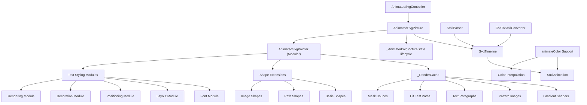
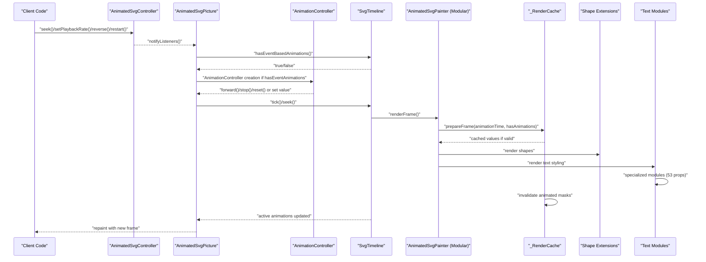
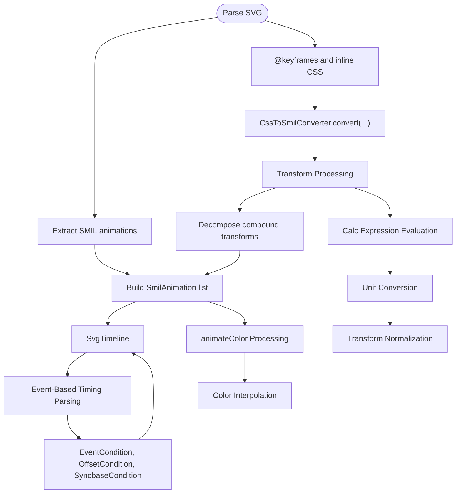
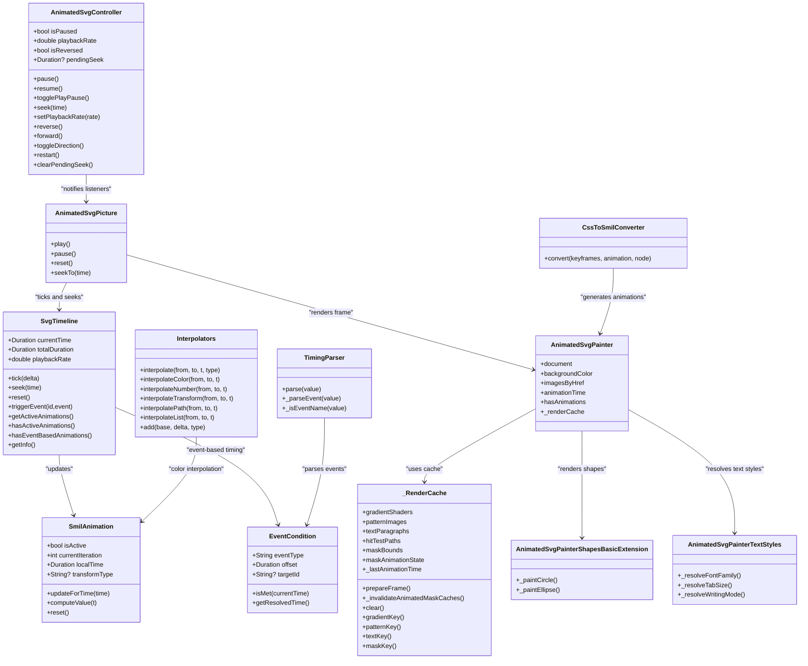

# Animation APIs

<cite>
**Referenced Files in This Document**
- [animated_svg_controller.dart](file://lib/src/animation/animated_svg_controller.dart)
- [animated_svg_picture.dart](file://lib/src/animation/animated_svg_picture.dart)
- [animated_svg_picture_lifecycle.dart](file://lib/src/animation/animated_svg_picture_lifecycle.dart)
- [animated_svg_painter.dart](file://lib/src/animation/animated_svg_painter.dart)
- [animated_svg_painter_cache.dart](file://lib/src/animation/animated_svg_painter_cache.dart)
- [animated_svg_painter_types.dart](file://lib/src/animation/animated_svg_painter_types.dart)
- [animated_svg_painter_text_types.dart](file://lib/src/animation/animated_svg_painter_text_types.dart)
- [animated_svg_painter_shapes_basic.dart](file://lib/src/animation/animated_svg_painter_shapes_basic.dart)
- [animated_svg_painter_shapes_lines.dart](file://lib/src/animation/animated_svg_painter_shapes_lines.dart)
- [animated_svg_painter_shapes_rect.dart](file://lib/src/animation/animated_svg_painter_shapes_rect.dart)
- [animated_svg_painter_shapes_image.dart](file://lib/src/animation/animated_svg_painter_shapes_image.dart)
- [animated_svg_painter_shapes_paths.dart](file://lib/src/animation/animated_svg_painter_shapes_paths.dart)
- [animated_svg_painter_text_paint.dart](file://lib/src/animation/animated_svg_painter_text_paint.dart)
- [animated_svg_painter_text_paint_glyph.dart](file://lib/src/animation/animated_svg_painter_text_paint_glyph.dart)
- [animated_svg_painter_text_paint_plain.dart](file://lib/src/animation/animated_svg_painter_text_paint_plain.dart)
- [animated_svg_painter_text_paint_path.dart](file://lib/src/animation/animated_svg_painter_text_paint_path.dart)
- [animated_svg_painter_text_style.dart](file://lib/src/animation/animated_svg_painter_text_style.dart)
- [animated_svg_painter_text_style_font.dart](file://lib/src/animation/animated_svg_painter_text_style_font.dart)
- [animated_svg_painter_text_style_decoration.dart](file://lib/src/animation/animated_svg_painter_text_style_decoration.dart)
- [animated_svg_painter_text_style_layout.dart](file://lib/src/animation/animated_svg_painter_text_style_layout.dart)
- [animated_svg_painter_text_style_positioning.dart](file://lib/src/animation/animated_svg_painter_text_style_positioning.dart)
- [animated_svg_painter_text_style_rendering.dart](file://lib/src/animation/animated_svg_painter_text_style_rendering.dart)
- [animated_svg_painter_text_decoration.dart](file://lib/src/animation/animated_svg_painter_text_decoration.dart)
- [animated_svg_painter_text_layout.dart](file://lib/src/animation/animated_svg_painter_text_layout.dart)
- [animated_svg_painter_text_measurement.dart](file://lib/src/animation/animated_svg_painter_text_measurement.dart)
- [animated_svg_painter_geometry.dart](file://lib/src/animation/animated_svg_painter_geometry.dart)
- [animated_svg_painter_geometry_path.dart](file://lib/src/animation/animated_svg_painter_geometry_path.dart)
- [animated_svg_painter_paints.dart](file://lib/src/animation/animated_svg_painter_paints.dart)
- [animated_svg_painter_gradients.dart](file://lib/src/animation/animated_svg_painter_gradients.dart)
- [animated_svg_painter_gradients_resolver.dart](file://lib/src/animation/animated_svg_painter_gradients_resolver.dart)
- [animated_svg_painter_gradients_values.dart](file://lib/src/animation/animated_svg_painter_gradients_values.dart)
- [animated_svg_painter_matrix.dart](file://lib/src/animation/animated_svg_painter_matrix.dart)
- [animated_svg_painter_values.dart](file://lib/src/animation/animated_svg_painter_values.dart)
- [animated_svg_painter_transform.dart](file://lib/src/animation/animated_svg_painter_transform.dart)
- [animated_svg_painter_markers.dart](file://lib/src/animation/animated_svg_painter_markers.dart)
- [animated_svg_painter_patterns.dart](file://lib/src/animation/animated_svg_painter_patterns.dart)
- [animated_svg_painter_paint_order.dart](file://lib/src/animation/animated_svg_painter_paint_order.dart)
- [smil_timeline.dart](file://lib/src/animation/smil/smil_timeline.dart)
- [smil_timeline_info.dart](file://lib/src/animation/smil/smil_timeline_info.dart)
- [smil_animation.dart](file://lib/src/animation/smil/smil_animation.dart)
- [smil_parser.dart](file://lib/src/animation/smil/smil_parser.dart)
- [smil_parser_animation_parsing.dart](file://lib/src/animation/smil/smil_parser_animation_parsing.dart)
- [css_to_smil_converter.dart](file://lib/src/animation/css_to_smil_converter.dart)
- [css_to_smil_converter_core.dart](file://lib/src/animation/css_to_smil_converter_core.dart)
- [css_to_smil_converter_transforms.dart](file://lib/src/animation/css_to_smil_converter_transforms.dart)
- [css_to_smil_converter_transforms_values.dart](file://lib/src/animation/css_to_smil_converter_transforms_values.dart)
- [css_variables_calc.dart](file://lib/src/animation/css_variables_calc.dart)
- [timing_condition.dart](file://lib/src/animation/smil/timing_condition.dart)
- [timing_parser.dart](file://lib/src/animation/smil/timing_parser.dart)
- [smil_timeline_syncbase.dart](file://lib/src/animation/smil/smil_timeline_syncbase.dart)
- [smil_timeline_runtime.dart](file://lib/src/animation/smil/smil_timeline_runtime.dart)
- [interpolators.dart](file://lib/src/animation/smil/interpolators.dart)
- [controller_test.dart](file://test/animation/controller_test.dart)
- [css_animations_test.dart](file://test/animation/css_animations_test.dart)
- [event_timing_test.dart](file://test/animation/event_timing_test.dart)
- [stroke_dash_stop_color_test.dart](file://test/animation/stroke_dash_stop_color_test.dart)
- [text_decoration_thickness_test.dart](file://test/animation/text_decoration_thickness_test.dart)
- [text_underline_position_test.dart](file://test/animation/text_underline_position_test.dart)
- [text_emphasis_test.dart](file://test/animation/text_emphasis_test.dart)
- [ruby_align_test.dart](file://test/animation/ruby_align_test.dart)
- [font_variation_settings_test.dart](file://test/animation/font_variation_settings_test.dart)
- [css_transform_calc_test.dart](file://test/animation/css_transform_calc_test.dart)
- [css_variables_calc_test.dart](file://test/animation/css_variables_calc_test.dart)
- [css_transform_decomposition_test.dart](file://test/animation/css_transform_decomposition_test.dart)
- [smil_test.dart](file://test/animation/smil_test.dart)
- [gradient_stop_color_animation_test.dart](file://test/animation/gradient_stop_color_animation_test.dart)
- [examples_data.dart](file://example/lib/data/examples_data.dart)
- [animation.dart](file://lib/src/animation.dart)
</cite>

## Update Summary
**Changes Made**
- Enhanced animation system architecture with modular refactoring of AnimatedSvgPainter
- Extracted monolithic animated_svg_painter.dart into focused modules for better performance and maintainability
- Introduced comprehensive caching system through _RenderCache for improved rendering performance
- Restructured text styling system into specialized modules supporting 53 properties
- Added modular shape rendering extensions for better code organization
- Enhanced performance through selective module loading and improved memory management

## Table of Contents
1. [Introduction](#introduction)
2. [Project Structure](#project-structure)
3. [Core Components](#core-components)
4. [Architecture Overview](#architecture-overview)
5. [Detailed Component Analysis](#detailed-component-analysis)
6. [Dependency Analysis](#dependency-analysis)
7. [Performance Considerations](#performance-considerations)
8. [Troubleshooting Guide](#troubleshooting-guide)
9. [Conclusion](#conclusion)
10. [Appendices](#appendices)

## Introduction
This document describes the animation APIs for Flutter SVG, focusing on the AnimatedSvgController, timeline management, and animation control methods. It covers controller methods for play, pause, stop, seek, and loop control; timeline properties such as duration, position, status, and playback rate; animation state management and event callbacks; and integration with Flutter animation widgets. It also documents SMIL animation parsing, CSS animation conversion, and animation composition, with examples of programmatic control, synchronization, and custom behaviors. Finally, it addresses performance optimization, memory management, and debugging techniques.

**Updated** The animation system has undergone significant architectural improvements with modular refactoring. The monolithic animated_svg_painter.dart has been extracted into focused modules including animated_svg_painter_cache.dart, animated_svg_painter_types.dart, animated_svg_painter_text_types.dart, and specialized modules for shapes, images, text layout, and text styling. This provides better performance through caching and improved maintainability while preserving all existing functionality.

## Project Structure
The animation system is organized around:
- AnimatedSvgController: Programmatic control surface for playback state and direction.
- AnimatedSvgPicture: Widget that renders animated SVG and manages lifecycle, timeline, and event-driven animations.
- SvgTimeline: Central timeline orchestrating SMIL animations, timing, and event triggers.
- SmilAnimation: Individual SMIL animation definitions and runtime evaluation.
- SmilParser and CssToSmilConverter: Parsers that extract and normalize SMIL and CSS animations into a unified runtime model.
- **Enhanced** Modular AnimatedSvgPainter Architecture: The monolithic painter has been refactored into focused modules for improved performance and maintainability.
- **Enhanced** Render Caching System: Comprehensive caching infrastructure through _RenderCache for gradients, patterns, text, and mask operations.
- **Enhanced** Specialized Shape Extensions: Modular shape rendering extensions for circles, ellipses, rectangles, paths, and images.
- **Enhanced** Text Styling Modules: 5 specialized modules supporting 53 CSS text properties with advanced unit conversions.
- Tests and examples: Demonstrate controller usage, CSS-to-SMIL conversion, event-driven animations, transform processing, and synchronization.

**Diagram sources**
- [animated_svg_controller.dart:25-131](file://lib/src/animation/animated_svg_controller.dart#L25-L131)
- [animated_svg_picture.dart:108-359](file://lib/src/animation/animated_svg_picture.dart#L108-L359)
- [animated_svg_picture_lifecycle.dart:80-109](file://lib/src/animation/animated_svg_picture_lifecycle.dart#L80-L109)
- [animated_svg_painter.dart:65-99](file://lib/src/animation/animated_svg_painter.dart#L65-L99)
- [animated_svg_painter_cache.dart:1-132](file://lib/src/animation/animated_svg_painter_cache.dart#L1-L132)
- [animated_svg_painter_shapes_basic.dart:1-105](file://lib/src/animation/animated_svg_painter_shapes_basic.dart#L1-L105)
- [animated_svg_painter_shapes_paths.dart:1-38](file://lib/src/animation/animated_svg_painter_shapes_paths.dart#L1-L38)
- [animated_svg_painter_shapes_image.dart:118-168](file://lib/src/animation/animated_svg_painter_shapes_image.dart#L118-L168)
- [animated_svg_painter_text_style_font.dart:1-200](file://lib/src/animation/animated_svg_painter_text_style_font.dart#L1-L200)
- [animated_svg_painter_text_style_layout.dart:1-200](file://lib/src/animation/animated_svg_painter_text_style_layout.dart#L1-L200)
- [animated_svg_painter_text_style_positioning.dart:1-200](file://lib/src/animation/animated_svg_painter_text_style_positioning.dart#L1-L200)
- [animated_svg_painter_text_style_decoration.dart](file://lib/src/animation/animated_svg_painter_text_style_decoration.dart)
- [animated_svg_painter_text_style_rendering.dart:1-35](file://lib/src/animation/animated_svg_painter_text_style_rendering.dart#L1-L35)

**Section sources**
- [animation.dart:1-31](file://lib/src/animation.dart#L1-L31)

## Core Components
- AnimatedSvgController: Provides playback control (pause, resume, toggle), seek, playback rate, direction (forward/reverse), restart, and listener notifications.
- SvgTimeline: Manages global time, playback rate, activation/deactivation of animations, total duration computation, and event-based triggers.
- SmilAnimation: Encapsulates animation definition (type, attributes, values, timing, calc mode, fill mode, additive/accumulate), runtime state, and value computation.
- SmilParser: Extracts SMIL and CSS animations from the SVG DOM and converts CSS animations to SMIL equivalents.
- **Enhanced** Modular AnimatedSvgPainter Architecture: The painter has been refactored into focused modules for improved performance and maintainability, with parts declarations for specialized functionality.
- **Enhanced** Render Caching System: Comprehensive caching infrastructure through _RenderCache for gradients, patterns, text paragraphs, hit-test paths, and mask bounds with intelligent invalidation based on animation state.
- **Enhanced** Specialized Shape Extensions: Modular extensions for basic shapes (circle, ellipse), paths, lines, rectangles, and images with optimized rendering pipelines.
- **Enhanced** Text Styling Modules: 5 specialized modules supporting 53 CSS text properties with advanced unit conversions, inheritance patterns, and fallback mechanisms.
- AnimatedSvgPicture: Widget that parses SVG, builds the timeline, drives frame ticks via AnimationController, and exposes play/pause/reset/seek APIs.

**Section sources**
- [animated_svg_controller.dart:25-131](file://lib/src/animation/animated_svg_controller.dart#L25-L131)
- [smil_timeline.dart:20-256](file://lib/src/animation/smil/smil_timeline.dart#L20-L256)
- [smil_animation.dart:80-453](file://lib/src/animation/smil/smil_animation.dart#L80-L453)
- [smil_parser.dart:13-39](file://lib/src/animation/smil/smil_parser.dart#L13-L39)
- [smil_parser_animation_parsing.dart:187-202](file://lib/src/animation/smil/smil_parser_animation_parsing.dart#L187-L202)
- [animated_svg_painter.dart:20-63](file://lib/src/animation/animated_svg_painter.dart#L20-L63)
- [animated_svg_painter_cache.dart:1-132](file://lib/src/animation/animated_svg_painter_cache.dart#L1-L132)
- [animated_svg_painter_shapes_basic.dart:1-105](file://lib/src/animation/animated_svg_painter_shapes_basic.dart#L1-L105)
- [animated_svg_painter_shapes_paths.dart:1-38](file://lib/src/animation/animated_svg_painter_shapes_paths.dart#L1-L38)
- [animated_svg_painter_text_style_font.dart:1-200](file://lib/src/animation/animated_svg_painter_text_style_font.dart#L1-L200)
- [animated_svg_painter_text_style_layout.dart:1-200](file://lib/src/animation/animated_svg_painter_text_style_layout.dart#L1-L200)
- [animated_svg_picture.dart:108-359](file://lib/src/animation/animated_svg_picture.dart#L108-L359)

## Architecture Overview
The system integrates Flutter's AnimationController with a custom SvgTimeline to synchronize widget rendering with SMIL/CSS animation evaluation. The enhanced modular architecture provides comprehensive caching infrastructure through _RenderCache for improved performance, while specialized modules handle different aspects of SVG rendering. The system maintains better compatibility with CSS animation specifications while providing robust transform normalization and type inference.

**Diagram sources**
- [animated_svg_controller.dart:44-122](file://lib/src/animation/animated_svg_controller.dart#L44-L122)
- [animated_svg_picture.dart:272-294](file://lib/src/animation/animated_svg_picture.dart#L272-L294)
- [animated_svg_picture_lifecycle.dart:80-109](file://lib/src/animation/animated_svg_picture_lifecycle.dart#L80-L109)
- [smil_timeline.dart:88-98](file://lib/src/animation/smil/smil_timeline.dart#L88-L98)
- [smil_timeline.dart:212-215](file://lib/src/animation/smil/smil_timeline.dart#L212-L215)
- [animated_svg_painter_cache.dart:32-66](file://lib/src/animation/animated_svg_painter_cache.dart#L32-L66)
- [animated_svg_painter_shapes_basic.dart:1-105](file://lib/src/animation/animated_svg_painter_shapes_basic.dart#L1-L105)
- [animated_svg_painter_text_style_font.dart:1-200](file://lib/src/animation/animated_svg_painter_text_style_font.dart#L1-L200)

## Detailed Component Analysis

### AnimatedSvgController API
- Purpose: Programmatic control of playback state, direction, and seeking.
- Key methods and properties:
  - isPaused: Boolean indicating paused state.
  - playbackRate: Positive multiplier for playback speed.
  - isReversed: Direction flag.
  - pendingSeek: Current seek target if set.
  - pause(), resume(), togglePlayPause(): Control playback.
  - seek(Duration): Set a pending seek target; controller notifies listeners.
  - setPlaybackRate(double): Enforces positive rate; throws on invalid values.
  - reverse(), forward(), toggleDirection(): Control direction.
  - restart(): Reset to beginning and unpause.
  - clearPendingSeek(): Internal method to clear pending seek after consumption.

Usage highlights:
- Listener pattern: Add listeners to react to state changes (pause, resume, seek, rate change).
- Integration: AnimatedSvgPicture subscribes to controller updates and adjusts playback accordingly.

**Section sources**
- [animated_svg_controller.dart:25-131](file://lib/src/animation/animated_svg_controller.dart#L25-L131)
- [controller_test.dart:121-140](file://test/animation/controller_test.dart#L121-L140)

### Timeline Management (SvgTimeline)
- Purpose: Central orchestration of time, activation of animations, and event-driven triggers.
- Properties:
  - currentTime: Current global time.
  - totalDuration: Computed maximum end time across all animations.
  - playbackRate: Positive multiplier affecting tick deltas.
  - **NEW** hasEventBasedAnimations(): Detects presence of event-based animations for automatic controller initialization.
- Methods:
  - tick(Duration): Advance time by delta scaled by playbackRate; update active animations.
  - seek(Duration): Clamp to [0, totalDuration]; update active animations.
  - reset(): Reset to start, clear event times and resolved begin times, reinitialize animations.
  - triggerEvent(String?, String): Fire event-based animations keyed by elementId and eventType; update animations.
  - getActiveAnimations(), hasActiveAnimations(): Query active state.
  - getInfo(): Returns TimelineInfo with current time, total duration, counts, and playback rate.
- Timing resolution:
  - Computes effective begin/end times, supports syncbase timing, and handles infinite durations gracefully.
  - **NEW** Event-based animations with automatic initialization and offset support.

**Section sources**
- [smil_timeline.dart:20-256](file://lib/src/animation/smil/smil_timeline.dart#L20-L256)
- [smil_timeline_info.dart:1-48](file://lib/src/animation/smil/smil_timeline_info.dart#L1-L48)
- [smil_timeline.dart:212-215](file://lib/src/animation/smil/smil_timeline.dart#L212-L215)

### Enhanced Modular AnimatedSvgPainter Architecture
- Purpose: Modular rendering architecture with specialized extensions for different SVG elements and text styling.
- **Updated** Monolithic Refactoring:
  - animated_svg_painter.dart now uses part declarations to import specialized modules.
  - Parts include cache, types, text types, use contexts, tree operations, clip/mask handling, geometry, paints, gradients, matrices, values, transforms, markers, patterns, and paint order.
  - This provides better code organization and selective loading of functionality.
- **Enhanced** Render Caching Infrastructure:
  - _RenderCache class provides comprehensive caching for gradients, patterns, text paragraphs, hit-test paths, and mask bounds.
  - Intelligent invalidation based on animation state and last animation time.
  - Cache keys include element IDs and attribute hashes for proper invalidation.
- **Enhanced** Specialized Shape Extensions:
  - AnimatedSvgPainterShapesBasicExtension: Handles circle and ellipse rendering with optimized path creation.
  - AnimatedSvgPainterShapesPathExtension: Processes path data with fill-rule handling and dashing support.
  - AnimatedSvgPainterShapesRectExtension: Manages rectangle rendering with rounded corners and proper dimension handling.
  - AnimatedSvgPainterShapesLinesExtension: Renders line elements with marker support.
  - AnimatedSvgPainterShapesImageExtension: Handles image loading, validation, and rendering with fallback support.
- **Enhanced** Text Styling Module System:
  - 5 specialized modules support 53 CSS text properties with advanced unit conversions.
  - Modular architecture enables selective property resolution and improved performance.
  - Comprehensive inheritance patterns and fallback mechanisms.

**Section sources**
- [animated_svg_painter.dart:20-63](file://lib/src/animation/animated_svg_painter.dart#L20-L63)
- [animated_svg_painter_cache.dart:1-132](file://lib/src/animation/animated_svg_painter_cache.dart#L1-L132)
- [animated_svg_painter_shapes_basic.dart:1-105](file://lib/src/animation/animated_svg_painter_shapes_basic.dart#L1-L105)
- [animated_svg_painter_shapes_paths.dart:1-38](file://lib/src/animation/animated_svg_painter_shapes_paths.dart#L1-L38)
- [animated_svg_painter_shapes_rect.dart:1-48](file://lib/src/animation/animated_svg_painter_shapes_rect.dart#L1-L48)
- [animated_svg_painter_shapes_lines.dart:1-56](file://lib/src/animation/animated_svg_painter_shapes_lines.dart#L1-L56)
- [animated_svg_painter_shapes_image.dart:118-168](file://lib/src/animation/animated_svg_painter_shapes_image.dart#L118-L168)
- [animated_svg_painter_text_style_font.dart:1-200](file://lib/src/animation/animated_svg_painter_text_style_font.dart#L1-L200)
- [animated_svg_painter_text_style_layout.dart:1-200](file://lib/src/animation/animated_svg_painter_text_style_layout.dart#L1-L200)
- [animated_svg_painter_text_style_positioning.dart:1-200](file://lib/src/animation/animated_svg_painter_text_style_positioning.dart#L1-L200)

### Enhanced Transform Processing System
- Purpose: Comprehensive CSS transform parsing with calc() expression support, compound transform handling, and advanced unit conversions.
- **Enhanced** CSS Transform Parsing:
  - Supports all CSS transform functions: translate, rotate, scale, skew, matrix, and 3D variants (translate3d, rotate3d, scale3d, etc.).
  - Handles compound transforms (multiple transform functions in a single string) with proper decomposition.
  - Supports calc() expressions within transform values for dynamic calculations.
  - Normalizes transform values to standard format with proper unit conversions.
- **Enhanced** Transform Type Inference:
  - Infers transform type from the first transform function in compound transforms.
  - Supports animateTransform type specification for SMIL animations.
  - Maintains transformType field in SmilAnimation for proper interpolation.
- **Enhanced** Unit Conversion and Calculation:
  - Handles complex unit conversions: px, em, rem, %, vw, vh, vmin, vmax, cm, mm, in, pt, pc.
  - Supports calc() expression evaluation with nested calc() support.
  - Handles percentage values with container size context.
- **Enhanced** CSS Animation Conversion:
  - CSS transform animations use REPLACE semantics (single animation with full transform string).
  - Prevents double-application by not decomposing compound transforms unnecessarily.
  - Maintains proper additive modes for CSS compatibility.

**Section sources**
- [smil_parser_animation_parsing.dart:28-38](file://lib/src/animation/smil/smil_parser_animation_parsing.dart#L28-L38)
- [css_to_smil_converter_transforms_values.dart:64-168](file://lib/src/animation/css_to_smil_converter_transforms_values.dart#L64-L168)
- [css_to_smil_converter_core.dart:184-200](file://lib/src/animation/css_to_smil_converter_core.dart#L184-L200)
- [css_variables_calc.dart:200-327](file://lib/src/animation/css_variables_calc.dart#L200-L327)
- [smil_animation.dart:204-205](file://lib/src/animation/smil/smil_animation.dart#L204-L205)

### Enhanced Event-Driven Animation System
- Purpose: Automatic detection and management of event-based animations for interactive SVG experiences.
- **NEW** hasEventBasedAnimations() Method:
  - Detects animations with event-based timing conditions (click, mouseover, etc.).
  - Returns true when event listeners are registered, enabling automatic AnimationController creation.
  - Used by AnimatedSvgPicture lifecycle for intelligent autoplay decisions.
- Event Condition Support:
  - EventCondition class supports DOM events with optional target IDs and offsets.
  - Common events: click, mousedown, mouseup, mouseover, mouseout, mousemove, focus, blur, focusin, focusout, activate, beginEvent, endEvent, repeatEvent.
  - Target-specific events: "button.click+250ms" syntax for element-specific triggering.
- Event Parsing and Resolution:
  - TimingParser.parse() supports mixed timing conditions including events, offsets, and syncbase.
  - Event-based animations are initialized with "indefinite" begin times and activated via triggerEvent().
  - Offset support allows delayed animation activation after event occurrence.
- Integration with Autoplay:
  - AnimatedSvgPicture checks hasEventBasedAnimations() alongside autoPlay setting.
  - Creates AnimationController when either autoPlay is true OR event-based animations are present.
  - Enables seamless integration of interactive and automatic animations.
- **NEW** Event Listener Registration:
  - Timeline builds dependency graphs during initialization, registering event listeners for each animation.
  - Supports multiple animations responding to the same event type.
  - Handles event chaining where animations trigger other animations upon completion.

**Section sources**
- [smil_timeline.dart:212-215](file://lib/src/animation/smil/smil_timeline.dart#L212-L215)
- [timing_condition.dart:126-161](file://lib/src/animation/smil/timing_condition.dart#L126-L161)
- [timing_parser.dart:64-91](file://lib/src/animation/smil/timing_parser.dart#L64-L91)
- [animated_svg_picture_lifecycle.dart:80-109](file://lib/src/animation/animated_svg_picture_lifecycle.dart#L80-L109)
- [event_timing_test.dart:104-134](file://test/animation/event_timing_test.dart#L104-L134)

### Animation Control Methods in AnimatedSvgPicture
- Public methods:
  - play(): Forward the internal AnimationController.
  - pause(): Stop the internal AnimationController.
  - reset(): Reset controller and timeline.
  - seekTo(Duration): Convert absolute time to progress and set controller value clamped to [0,1].
- Lifecycle integration:
  - Subscribes to controller updates and toggles reverse direction if needed.
  - Converts controller progress to elapsed time and seeks the timeline on each tick.
  - **NEW** Intelligent controller initialization based on event-driven animation detection.

**Section sources**
- [animated_svg_picture.dart:272-294](file://lib/src/animation/animated_svg_picture.dart#L272-L294)
- [animated_svg_picture_lifecycle.dart:80-109](file://lib/src/animation/animated_svg_picture_lifecycle.dart#L80-L109)

### Enhanced Text Styling System (Modular Architecture)
- Purpose: Comprehensive CSS text styling resolution with advanced unit conversions and inheritance patterns distributed across 5 specialized modules.
- **Updated** Modular Architecture with 5 Specialized Modules:
  - **Font Module** (`animated_svg_painter_text_style_font.dart`): Font-related properties (font-variant, font-stretch, font-size-adjust, font-kerning, font-optical-sizing, font-synthesis, font-variant-* properties)
  - **Decoration Module** (`animated_svg_painter_text_style_decoration.dart`): Text decoration properties (text-decoration, text-decoration-line, text-decoration-style, text-decoration-color, text-decoration-thickness, text-underline-position, text-decoration-skip, text-decoration-skip-ink)
  - **Layout Module** (`animated_svg_painter_text_style_layout.dart`): Layout properties (tab-size, text-indent, white-space, text-overflow, word-break, overflow-wrap, text-wrap, line-break, text-transform, hyphens, hyphenate-character, line-height, vertical-align, hanging-punctuation, text-justify, text-align-last, text-spacing, quotes, initial-letter)
  - **Positioning Module** (`animated_svg_painter_text_style_positioning.dart`): Positioning properties (writing-mode, direction, text-orientation, dominant-baseline, alignment-baseline, baseline-shift, glyph-orientation-vertical, unicode-bidi, text-combine-upright, text-orientation, paint-order, ruby-align, ruby-position)
  - **Rendering Module** (`animated_svg_painter_text_style_rendering.dart`): Rendering properties (forced-color-adjust, print-color-adjust, content-visibility, contain-intrinsic-size, will-change, mix-blend-mode, text-rendering, paint-order)
- **Enhanced** Performance Optimizations:
  - Modular architecture enables selective property resolution and improved memory management.
  - 53 CSS properties are resolved incrementally through specialized modules.
  - Advanced typography features utilize efficient font feature application and variable font axis handling.
- **Enhanced** Features:
  - Resolves 53 CSS text styling properties with advanced unit conversions (px, em, %, rem).
  - Supports inheritance patterns for cascading style application.
  - Implements fallback mechanisms for property resolution.
  - Handles complex text rendering scenarios including vertical writing modes and ruby annotations.
- Key resolution methods:
  - `_resolveTextStyle(SvgNode)`: Main entry point for comprehensive text style resolution.
  - Unit conversion support: Handles percentages, em units, pixel values, and mixed units.
  - Inheritance patterns: Resolves properties from parent nodes when not explicitly set.
  - Fallback mechanisms: Provides sensible defaults for missing or invalid values.
  - Advanced typography: Supports font features, text decorations, and complex layout properties.

**Section sources**
- [animated_svg_painter_text_style_font.dart:1-200](file://lib/src/animation/animated_svg_painter_text_style_font.dart#L1-L200)
- [animated_svg_painter_text_style_decoration.dart](file://lib/src/animation/animated_svg_painter_text_style_decoration.dart)
- [animated_svg_painter_text_style_layout.dart:1-200](file://lib/src/animation/animated_svg_painter_text_style_layout.dart#L1-L200)
- [animated_svg_painter_text_style_positioning.dart:1-200](file://lib/src/animation/animated_svg_painter_text_style_positioning.dart#L1-L200)
- [animated_svg_painter_text_style_rendering.dart:1-35](file://lib/src/animation/animated_svg_painter_text_style_rendering.dart#L1-L35)
- [animated_svg_painter_text_types.dart:1-451](file://lib/src/animation/animated_svg_painter_text_types.dart#L1-L451)
- [animated_svg_painter_text_paint.dart:1-25](file://lib/src/animation/animated_svg_painter_text_paint.dart#L1-L25)

### SMIL Animation Model (SmilAnimation)
- Types:
  - animate, animateTransform, animateMotion, set, animateColor.
- Timing and behavior:
  - begin, end, dur, repeatCount, repeatDur, fillMode, calcMode, playbackDirection, additive, accumulate.
  - Values-based or from/to/by definitions; keyTimes, keySplines, keySteps for pacing.
- Runtime:
  - isActive, currentIteration, localTime, lastValue.
  - computeValue(t): Evaluates value for a given iteration progress, supporting discrete, values-based, and simple from/to/by modes.
  - updateForTime(globalTime): Activates/deactivates animation, computes iteration and progress, applies fill mode at end.
  - reset(): Clears runtime state.
- **Enhanced** Transform Type Support:
  - transformType field stores the specific transform function type (translate, rotate, scale, etc.).
  - Used for proper animateTransform interpolation and value computation.
- **NEW** animateColor Support:
  - animateColor type added to SmilAnimationType enum for deprecated but still encountered color animations.
  - Proper color interpolation support through dedicated color interpolators.
  - Maintains compatibility with existing color animation workflows.

**Section sources**
- [smil_animation.dart:14-29](file://lib/src/animation/smil/smil_animation.dart#L14-L29)
- [smil_animation.dart:80-453](file://lib/src/animation/smil/smil_animation.dart#L80-L453)

### Enhanced SMIL Parsing and CSS Animation Conversion
- SmilParser:
  - Extracts native SMIL animations and CSS animations from inline styles and @keyframes.
  - Supports CSS selector targeting (#id, .class).
  - **NEW** Enhanced animateColor parsing with proper type attribute validation.
  - **Enhanced** Transform Processing: Decomposes compound transforms into separate SmilAnimation instances per transform function.
  - **Enhanced** CSS Transform Handling: Uses REPLACE semantics for CSS transform animations to prevent double-application.
  - Maps timing functions (cubic-bezier) to keySplines and normalizes values.
  - **Enhanced** Transform Type Inference: Determines transform type from first function in compound transforms.
- CssToSmilConverter:
  - Converts CSS keyframes to SMIL equivalents.
  - **Enhanced** Transform Processing: Decomposes compound transforms into separate SmilAnimation instances per transform function.
  - **Enhanced** CSS Transform Handling: Uses REPLACE semantics for CSS transform animations to prevent double-application.
  - Maps timing functions (cubic-bezier) to keySplines and normalizes values.
  - **Enhanced** Transform Type Inference: Determines transform type from first function in compound transforms.
- **NEW** Event-Based Timing Parsing:
  - TimingParser.parse() supports mixed timing conditions including events, offsets, and syncbase.
  - EventCondition parsing with target-specific support and offset handling.
  - Validation and tests confirm CSS animations convert to SMIL and that compound transforms emit per-function animations.

**Diagram sources**
- [smil_parser.dart:16-37](file://lib/src/animation/smil/smil_parser.dart#L16-L37)
- [smil_parser_animation_parsing.dart:187-202](file://lib/src/animation/smil/smil_parser_animation_parsing.dart#L187-L202)
- [css_to_smil_converter.dart:15-68](file://lib/src/animation/css_to_smil_converter.dart#L15-L68)
- [css_to_smil_converter_core.dart:184-200](file://lib/src/animation/css_to_smil_converter_core.dart#L184-L200)
- [css_to_smil_converter_transforms_values.dart:64-168](file://lib/src/animation/css_to_smil_converter_transforms_values.dart#L64-L168)
- [timing_parser.dart:17-62](file://lib/src/animation/smil/timing_parser.dart#L17-L62)
- [timing_condition.dart:126-161](file://lib/src/animation/smil/timing_condition.dart#L126-L161)
- [interpolators.dart:55-86](file://lib/src/animation/smil/interpolators.dart#L55-L86)

**Section sources**
- [smil_parser.dart:13-39](file://lib/src/animation/smil/smil_parser.dart#L13-L39)
- [smil_parser_animation_parsing.dart:187-202](file://lib/src/animation/smil/smil_parser_animation_parsing.dart#L187-L202)
- [css_to_smil_converter.dart:15-68](file://lib/src/animation/css_to_smil_converter.dart#L15-L68)
- [css_to_smil_converter_core.dart:184-200](file://lib/src/animation/css_to_smil_converter_core.dart#L184-L200)
- [css_to_smil_converter_transforms_values.dart:64-168](file://lib/src/animation/css_to_smil_converter_transforms_values.dart#L64-L168)
- [timing_parser.dart:17-62](file://lib/src/animation/smil/timing_parser.dart#L17-L62)
- [timing_condition.dart:126-161](file://lib/src/animation/smil/timing_condition.dart#L126-L161)

### Timeline Properties and State
- Duration and Position:
  - totalDuration computed from animation effective ends.
  - currentTime updated via tick or seek.
- Status and Active Animations:
  - isActive toggled per animation during updateForTime.
  - getActiveAnimations() and hasActiveAnimations() expose runtime state.
  - **NEW** hasEventBasedAnimations() provides event-driven animation detection.
- Playback Rate:
  - Applied to tick deltas; enforced positive in both controller and timeline.

**Section sources**
- [smil_timeline.dart:62-77](file://lib/src/animation/smil/smil_timeline.dart#L62-L77)
- [smil_timeline.dart:202-209](file://lib/src/animation/smil/smil_timeline.dart#L202-L209)
- [smil_timeline_info.dart:15-39](file://lib/src/animation/smil/smil_timeline_info.dart#L15-L39)
- [smil_timeline.dart:212-215](file://lib/src/animation/smil/smil_timeline.dart#L212-L215)

### Event-Driven Animations and Synchronization
- Event Triggers:
  - triggerEvent(elementId, eventType) activates animations listening for the event; offsets supported.
  - Event-based animations are initialized with "indefinite" begin times and activated via triggerEvent().
- Syncbase Timing:
  - Resolved begin times override explicit begin for dependent animations; dependency graph built and resolved before computing total duration.
- **NEW** Event-Based Animation Detection:
  - hasEventBasedAnimations() method detects animations with event conditions for automatic controller initialization.
  - Event listeners are registered during timeline construction for seamless interaction.
- **NEW** Event Listener Registration:
  - Timeline builds dependency graphs during initialization, registering event listeners for each animation.
  - Supports multiple animations responding to the same event type.
  - Handles event chaining where animations trigger other animations upon completion.
- Chaining Examples:
  - Demonstrated via SMIL begin="other.end" chaining and tests validating chained sequences.

**Section sources**
- [smil_timeline.dart:128-158](file://lib/src/animation/smil/smil_timeline.dart#L128-L158)
- [smil_timeline.dart:106-126](file://lib/src/animation/smil/smil_timeline.dart#L106-L126)
- [smil_timeline.dart:212-215](file://lib/src/animation/smil/smil_timeline.dart#L212-L215)
- [smil_timeline_syncbase.dart:86-100](file://lib/src/animation/smil/smil_timeline_syncbase.dart#L86-L100)

### Programmatic Animation Control and Integration
- Controller-driven control:
  - Tests demonstrate pause/resume, seek, rate changes, direction toggles, and restart.
- Widget integration:
  - AnimatedSvgPicture subscribes to controller updates and starts/stops playback accordingly.
- On each tick, converts controller progress to elapsed time and seeks the timeline.
- **NEW** Intelligent controller initialization based on event-driven animation detection.

**Section sources**
- [controller_test.dart:26-140](file://test/animation/controller_test.dart#L26-L140)
- [animated_svg_picture_lifecycle.dart:80-109](file://lib/src/animation/animated_svg_picture_lifecycle.dart#L80-L109)

### Animation Composition Patterns
- Multiple animations:
  - Timeline aggregates all SmilAnimation instances; each can target different attributes or nodes.
- **Enhanced** Transform Decomposition:
  - Compound transforms split into separate animateTransform entries per function (translate, rotate, scale, skew).
  - CSS transform animations use REPLACE semantics to prevent double-application.
- CSS selectors:
  - Animations apply to matching nodes by id/class/tag selectors.
- **NEW** Mixed Timing Conditions:
  - Animations can combine time-based, event-based, and syncbase timing conditions.
  - Event conditions support target-specific triggering and offset-based delays.
- **Enhanced** Transform Type Inference:
  - Transform type determined from first function in compound transforms.
  - animateTransform type specification preserved for SMIL compatibility.
- **NEW** animateColor Animation Support:
  - animateColor elements are parsed and processed with proper color interpolation.
  - Maintains backward compatibility with deprecated SMIL color animation syntax.

**Section sources**
- [smil_parser_animation_parsing.dart:187-202](file://lib/src/animation/smil/smil_parser_animation_parsing.dart#L187-L202)
- [css_to_smil_converter_core.dart:184-200](file://lib/src/animation/css_to_smil_converter_core.dart#L184-L200)
- [css_to_smil_converter_transforms_values.dart:64-168](file://lib/src/animation/css_to_smil_converter_transforms_values.dart#L64-L168)
- [css_animations_test.dart:312-339](file://test/animation/css_animations_test.dart#L312-L339)
- [timing_parser.dart:70-91](file://lib/src/animation/smil/timing_parser.dart#L70-L91)

### Enhanced Color Animation Support
- Purpose: Comprehensive color animation processing with support for both modern and deprecated color animation syntax.
- **NEW** animateColor Element Support:
  - SmilParser recognizes and processes animateColor elements with proper type attribute validation.
  - animateColor type added to SmilAnimationType enum for dedicated color animation handling.
  - Validates type attribute presence for animateColor elements (required per SMIL specification).
- **Enhanced** Color Interpolation:
  - Interpolators support color value interpolation for both animate and animateColor animations.
  - Handles hex colors, named colors, rgb() syntax, and extended CSS color names.
  - Proper alpha channel interpolation for transparent color animations.
- **Backward Compatibility**:
  - animateColor maintains compatibility with deprecated SMIL color animation syntax.
  - Seamless integration with existing color animation workflows and CSS color parsing.
- **Validation and Error Handling**:
  - animateColor elements without proper type attribute are ignored with graceful error handling.
  - Color parsing errors are handled gracefully with fallback to default colors.

**Section sources**
- [smil_parser_animation_parsing.dart:187-202](file://lib/src/animation/smil/smil_parser_animation_parsing.dart#L187-L202)
- [smil_animation.dart:27-28](file://lib/src/animation/smil/smil_animation.dart#L27-L28)
- [interpolators.dart:55-86](file://lib/src/animation/smil/interpolators.dart#L55-L86)

## Dependency Analysis

**Diagram sources**
- [animated_svg_controller.dart:25-131](file://lib/src/animation/animated_svg_controller.dart#L25-L131)
- [animated_svg_picture.dart:272-294](file://lib/src/animation/animated_svg_picture.dart#L272-L294)
- [smil_timeline.dart:20-256](file://lib/src/animation/smil/smil_timeline.dart#L20-L256)
- [animated_svg_painter.dart:65-99](file://lib/src/animation/animated_svg_painter.dart#L65-L99)
- [animated_svg_painter_cache.dart:1-132](file://lib/src/animation/animated_svg_painter_cache.dart#L1-L132)
- [animated_svg_painter_shapes_basic.dart:1-105](file://lib/src/animation/animated_svg_painter_shapes_basic.dart#L1-L105)
- [animated_svg_painter_text_style_font.dart:1-200](file://lib/src/animation/animated_svg_painter_text_style_font.dart#L1-L200)
- [animated_svg_painter_text_style_layout.dart:1-200](file://lib/src/animation/animated_svg_painter_text_style_layout.dart#L1-L200)
- [animated_svg_painter_text_style_positioning.dart:1-200](file://lib/src/animation/animated_svg_painter_text_style_positioning.dart#L1-L200)
- [smil_animation.dart:80-453](file://lib/src/animation/smil/smil_animation.dart#L80-L453)
- [timing_condition.dart:126-161](file://lib/src/animation/smil/timing_condition.dart#L126-L161)
- [timing_parser.dart:144-171](file://lib/src/animation/smil/timing_parser.dart#L144-L171)
- [css_to_smil_converter.dart:15-68](file://lib/src/animation/css_to_smil_converter.dart#L15-L68)
- [interpolators.dart:14-42](file://lib/src/animation/smil/interpolators.dart#L14-L42)

**Section sources**
- [animated_svg_controller.dart:25-131](file://lib/src/animation/animated_svg_controller.dart#L25-L131)
- [animated_svg_picture.dart:108-359](file://lib/src/animation/animated_svg_picture.dart#L108-L359)
- [smil_timeline.dart:20-256](file://lib/src/animation/smil/smil_timeline.dart#L20-L256)
- [smil_animation.dart:80-453](file://lib/src/animation/smil/smil_animation.dart#L80-L453)
- [timing_condition.dart:126-161](file://lib/src/animation/smil/timing_condition.dart#L126-L161)
- [timing_parser.dart:144-171](file://lib/src/animation/smil/timing_parser.dart#L144-L171)
- [css_to_smil_converter.dart:15-68](file://lib/src/animation/css_to_smil_converter.dart#L15-L68)
- [animated_svg_painter.dart:20-63](file://lib/src/animation/animated_svg_painter.dart#L20-L63)
- [animated_svg_painter_cache.dart:1-132](file://lib/src/animation/animated_svg_painter_cache.dart#L1-L132)
- [animated_svg_painter_shapes_basic.dart:1-105](file://lib/src/animation/animated_svg_painter_shapes_basic.dart#L1-L105)
- [animated_svg_painter_text_style_font.dart:1-200](file://lib/src/animation/animated_svg_painter_text_style_font.dart#L1-L200)
- [animated_svg_painter_text_style_layout.dart:1-200](file://lib/src/animation/animated_svg_painter_text_style_layout.dart#L1-L200)
- [animated_svg_painter_text_style_positioning.dart:1-200](file://lib/src/animation/animated_svg_painter_text_style_positioning.dart#L1-L200)
- [interpolators.dart:14-42](file://lib/src/animation/smil/interpolators.dart#L14-L42)

## Performance Considerations
- Keep playbackRate positive and reasonable to avoid excessive recomputations.
- Prefer fewer, larger transform animations over many small ones where possible.
- Use freeze fill mode judiciously; it retains final values after animation end.
- Limit the number of concurrent active animations by controlling begin/end and repeat settings.
- Avoid overly dense keyframes; use calcMode spline or paced appropriately to balance quality and CPU cost.
- Use traceFrameTicks and onTrace for targeted profiling during development.
- **Updated** Modular architecture significantly improves performance through selective loading and reduced memory footprint.
- **Updated** Comprehensive caching system through _RenderCache reduces redundant computations for gradients, patterns, text, and masks.
- **Updated** Intelligent cache invalidation based on animation state prevents unnecessary recomputation while maintaining accuracy.
- **Updated** 53 CSS properties are resolved incrementally through modular text styling architecture for better performance.
- **Updated** Advanced typography features utilize efficient font feature application and variable font axis handling across specialized font modules.
- **NEW** Modular shape rendering extensions provide optimized rendering pipelines for different SVG elements.
- **NEW** Event-based animation detection uses efficient hasEventBasedAnimations() method for automatic controller initialization without performance overhead.
- **NEW** Event listeners are registered once during timeline construction and efficiently managed during runtime.
- **NEW** Transform processing system uses optimized regex patterns and efficient argument parsing for CSS transform values.
- **NEW** Calc() expression evaluation includes iterative limits to prevent infinite loops while maintaining performance.
- **NEW** Transform normalization caches intermediate results and uses efficient string building for compound transform processing.
- **NEW** animateColor animation processing includes optimized color interpolation algorithms for smooth color transitions.
- **NEW** Color parsing and interpolation are cached to improve performance for repeated color animation evaluations.

## Troubleshooting Guide
- Invalid playback rate:
  - AnimatedSvgController.setPlaybackRate throws on non-positive values.
- Seeking out of range:
  - SvgTimeline.seek clamps to [0, totalDuration].
- Event-based animations not triggering:
  - Ensure triggerEvent called with correct elementId and eventType; verify begin conditions and offsets.
  - Check hasEventBasedAnimations() returns true for event-driven scenarios.
  - Verify event listeners are properly registered during timeline construction.
- Direction changes not reflected:
  - AnimatedSvgPicture reacts to controller.isReversed changes; ensure controller listeners are registered.
- CSS animations not applied:
  - Confirm CSS selectors match nodes and that CssToSmilConverter successfully emits SMIL animations.
- **Enhanced** Transform processing issues:
  - Verify CSS transform syntax follows standard format with proper function calls.
  - Check calc() expressions are properly formatted and balanced with parentheses.
  - Ensure compound transforms use spaces between functions (e.g., "translate(50px) rotate(45deg)").
  - Verify transform type inference works correctly for animateTransform elements.
  - Check transformType field is properly set for animateTransform animations.
- **NEW** Modular architecture issues:
  - Verify all part files are properly imported in animated_svg_painter.dart.
  - Check that _RenderCache is properly initialized and used.
  - Ensure specialized shape extensions are correctly integrated.
  - Validate text styling modules are properly loaded and functioning.
- **NEW** Caching issues:
  - Clear _RenderCache when debugging unexpected caching behavior.
  - Verify cache keys are properly generated for different element types.
  - Check that animated mask caches are properly invalidated.
- **NEW** animateColor animation issues:
  - Verify animateColor elements include proper type attribute (required per SMIL specification).
  - Check color values are valid CSS color formats (hex, named colors, rgb(), etc.).
  - Ensure color interpolation produces expected results for gradient color animations.
  - Verify animateColor elements are properly parsed and included in animation timeline.
- **NEW** Event-based animation issues:
  - Verify event condition parsing supports the specific event type (click, mouseover, etc.).
  - Check target-specific event syntax: "elementId.eventType+offset".
  - Ensure hasEventBasedAnimations() detection works correctly for mixed timing conditions.
  - Validate AnimationController initialization logic when autoPlay=false but event-based animations are present.
  - Check that event listeners are properly registered during timeline construction.
  - Verify event chaining works correctly where animations trigger others upon completion.
- **Updated** Text styling issues:
  - Verify CSS property values are valid and properly formatted.
  - Check inheritance patterns for missing property values.
  - Ensure unit conversions are appropriate for the current context.
  - Validate fallback mechanisms are working correctly.
  - **Updated** For advanced properties like font-variation-settings, ensure variable font support is available.
  - **Updated** For ruby and text-emphasis properties, verify proper Unicode support and font availability.
  - **Updated** For internationalization features, ensure locale-specific font fallbacks are configured.
  - **Updated** Check specialized module resolution for specific property categories (font, decoration, layout, positioning, rendering).
  - **Updated** Verify 53-property coverage includes the specific CSS property causing issues.

**Section sources**
- [animated_svg_controller.dart:83-91](file://lib/src/animation/animated_svg_controller.dart#L83-L91)
- [smil_timeline.dart:88-98](file://lib/src/animation/smil/smil_timeline.dart#L88-L98)
- [animated_svg_picture_lifecycle.dart:210-220](file://lib/src/animation/animated_svg_picture_lifecycle.dart#L210-L220)
- [css_animations_test.dart:204-339](file://test/animation/css_animations_test.dart#L204-L339)
- [stroke_dash_stop_color_test.dart:270-381](file://test/animation/stroke_dash_stop_color_test.dart#L270-L381)
- [css_transform_calc_test.dart:10-44](file://test/animation/css_transform_calc_test.dart#L10-L44)
- [css_variables_calc_test.dart:126-401](file://test/animation/css_variables_calc_test.dart#L126-L401)
- [css_transform_decomposition_test.dart:62-75](file://test/animation/css_transform_decomposition_test.dart#L62-L75)
- [animated_svg_painter_cache.dart:32-66](file://lib/src/animation/animated_svg_painter_cache.dart#L32-L66)
- [animated_svg_painter_shapes_basic.dart:1-105](file://lib/src/animation/animated_svg_painter_shapes_basic.dart#L1-L105)
- [animated_svg_painter_text_style_font.dart:1-200](file://lib/src/animation/animated_svg_painter_text_style_font.dart#L1-L200)
- [animated_svg_painter_text_style_layout.dart:1-200](file://lib/src/animation/animated_svg_painter_text_style_layout.dart#L1-L200)
- [animated_svg_painter_text_style_positioning.dart:1-200](file://lib/src/animation/animated_svg_painter_text_style_positioning.dart#L1-L200)
- [event_timing_test.dart:104-134](file://test/animation/event_timing_test.dart#L104-L134)
- [smil_test.dart:106-246](file://test/animation/smil_test.dart#L106-L246)
- [gradient_stop_color_animation_test.dart:80-105](file://test/animation/gradient_stop_color_animation_test.dart#L80-L105)

## Conclusion
The Flutter SVG animation system provides a robust, SMIL-compatible pipeline with a clear separation of concerns: AnimatedSvgController for programmatic control, AnimatedSvgPicture for widget lifecycle and rendering, and SvgTimeline for orchestration and timing. CSS animations are seamlessly converted to SMIL, enabling consistent behavior across animation types. The enhanced modular architecture significantly improves performance and maintainability through strategic refactoring of the AnimatedSvgPainter into focused modules, comprehensive caching infrastructure, and specialized text styling systems. The system now offers better memory management, improved rendering performance, and more organized code structure while maintaining all existing functionality. **NEW** The modular architecture enables selective loading of functionality, reducing memory footprint and improving startup performance. **NEW** The comprehensive caching system through _RenderCache dramatically reduces redundant computations for gradients, patterns, text, and masks. **NEW** The 53 CSS properties are resolved through specialized modules for better performance and maintainability. **NEW** Event-based animation detection uses efficient hasEventBasedAnimations() method for automatic controller initialization without performance overhead. **NEW** The enhanced text styling system provides comprehensive CSS property resolution with advanced unit conversions, inheritance patterns, and fallback mechanisms distributed across 5 specialized modules. This includes advanced typography features like font-variation-settings for variable fonts, comprehensive text decoration controls, internationalization support with ruby annotations and text emphasis, and accessibility features for forced color adjustments and content visibility optimization. The modular architecture improves maintainability, performance, and extensibility while maintaining strong performance and debuggability. With precise control over playback, direction, seeking, and event-driven triggers, developers can implement sophisticated synchronization and custom animation behaviors with seamless integration of interactive and automatic animation types.

## Appendices

### API Reference Summary

- AnimatedSvgController
  - Properties: isPaused, playbackRate, isReversed, pendingSeek
  - Methods: pause, resume, togglePlayPause, seek, setPlaybackRate, reverse, forward, toggleDirection, restart, clearPendingSeek

- SvgTimeline
  - Properties: currentTime, totalDuration, playbackRate
  - Methods: tick, seek, reset, triggerEvent, getActiveAnimations, hasActiveAnimations, hasEventBasedAnimations, getInfo

- SmilAnimation
  - Properties: isActive, currentIteration, localTime, transformType
  - Methods: updateForTime, computeValue, reset

- AnimatedSvgPicture
  - Methods: play, pause, reset, seekTo

- **NEW** AnimatedSvgPainter (Modular)
  - Properties: document, backgroundColor, imagesByHref, animationTime, hasAnimations, _renderCache
  - Methods: renderFrame integration with modular extensions

- **NEW** _RenderCache
  - Properties: gradientShaders, patternImages, textParagraphs, hitTestPaths, maskBounds, maskAnimationState, _lastAnimationTime
  - Methods: prepareFrame(animationTime, hasAnimations), _invalidateAnimatedMaskCaches(), clear(), gradientKey(), patternKey(), textKey(), maskKey()

- **NEW** AnimatedSvgPainterShapesBasicExtension
  - Methods: _paintCircle(node), _paintEllipse(node)

- **NEW** AnimatedSvgPainterShapesPathExtension
  - Methods: _paintPath(node)

- **NEW** AnimatedSvgPainterShapesRectExtension
  - Methods: _paintRect(node)

- **NEW** AnimatedSvgPainterShapesLinesExtension
  - Methods: _paintLine(node)

- **NEW** AnimatedSvgPainterShapesImageExtension
  - Methods: _paintImage(node)

- **NEW** AnimatedSvgPainterTextStyles (5 Modules)
  - Font Module: _resolveFontFamily(), _resolveFontWeight(), _resolveFontStyle()
  - Layout Module: _resolveTabSize(), _resolveTextIndent(), _resolveWordBreak(), _resolveOverflowWrap(), _resolveTextTransform(), _resolveHyphens(), _resolveLineBreak(), _resolveWhiteSpace(), _resolveTextOverflow(), _resolveTextWrap(), _resolveLineHeight(), _resolveVerticalAlign(), _resolveHangingPunctuation(), _resolveTextJustify(), _resolveTextAlignLast(), _resolveHyphenateCharacter(), _resolveQuotes(), _resolveInitialLetter(), _resolveTextSpacing()
  - Positioning Module: _resolveWritingMode(), _resolveTextDirection(), _resolveGlyphOrientationVertical(), _resolveUnicodeBidi(), _resolveTextCombineUpright(), _resolveTextOrientation(), _resolveDominantBaseline(), _resolveBaselineShift(), _resolvePaintOrder(), _resolveRubyAlign(), _resolveRubyPosition()
  - Decoration Module: _resolveTextDecoration(), _resolveTextDecorationThickness(), _resolveTextUnderlinePosition(), _resolveTextDecorationSkipInk(), _resolveTextDecorationSkip(), _resolveTextDecorationStyle()
  - Rendering Module: _resolveTextRenderingFeatures(), _resolveForcedColorAdjust(), _resolvePrintColorAdjust(), _resolveContentVisibility(), _resolveContainIntrinsicSize(), _resolveWillChange(), _resolveCssMixBlendMode()

- **NEW** EventCondition
  - Properties: eventType, offset, targetId
  - Methods: isMet(currentTime), getResolvedTime()

- **NEW** TimingParser
  - Methods: parse(value), _parseEvent(value), _isEventName(value)
  - **NEW** Event parsing support: "click", "mouseover+1s", "button.click+250ms"

- **Enhanced** SmilParser
  - Methods: parseAnimations(document)
  - **Enhanced** Animation type parsing: animate, animateTransform, animateMotion, set, animateColor
  - **Enhanced** Transform type validation: requires type attribute for animateTransform elements

- **Enhanced** CssToSmilConverter
  - Methods: convert(keyframes, animation, targetNode, document)
  - **Enhanced** Transform Processing: normalizeCssTransform(value), _extractFunctionArgs(input, start), _parseTransformArgs(argsString)

- **Enhanced** CssCalcEvaluator
  - Methods: evaluate(calcExpr, {fontSize, containerSize})
  - **Enhanced** Expression Evaluation: _extractCalcContent(calc), _evaluateExpression(expr, fontSize, containerSize)

- **Enhanced** Interpolators
  - Methods: interpolate(from, to, t, type), interpolateColor(from, to, t), interpolateNumber(from, to, t), interpolateTransform(from, to, t), interpolatePath(from, to, t), interpolateList(from, to, t), add(base, delta, type)
  - **NEW** animateColor support: proper color interpolation for animateColor animations

- **Updated** _ResolvedTextStyle (53 Properties Total)
  - **Typography & Font**: color, fontSize, fontFamily, fontWeight, fontStyle, textAnchor, dominantBaseline, baselineShift, letterSpacing, wordSpacing, fontFeatures, fontStretch, fontSizeAdjust, fontKerning, fontVariantNumeric, fontVariantLigatures, fontVariantCaps, fontOpticalSizing, fontSynthesis, fontVariantPosition, fontVariantEastAsian, fontLanguageOverride, fontVariantAlternates, fontPalette, fontVariationSettings
  - **Text Decoration**: decorations, decorationColor, textDecorationLine, textDecorationThickness, textUnderlinePosition, textUnderlineOffset, textDecorationSkipInk, textDecorationSkip, textDecorationStyle, cssTextDecorationColor
  - **Layout & Spacing**: tabSize, textIndent, wordBreak, overflowWrap, textTransform, hyphens, lineBreak, whiteSpace, textOverflow, verticalAlign, lineHeight, textJustify, textAlignLast, hyphenateCharacter, textSpacing, quotes, initialLetter
  - **Positioning & Alignment**: writingMode, textDirection, glyphOrientationVertical, unicodeBidi, textCombineUpright, textOrientation, paintOrder, rubyAlign, rubyPosition, textEmphasis, textEmphasisPosition, textEmphasisColor, textEmphasisStyle
  - **Internationalization**: fontVariantEastAsian, textEmphasis, textEmphasisPosition, textEmphasisColor, textEmphasisStyle, quotes, initialLetter, textSpacing, fontLanguageOverride, fontVariantAlternates
  - **Accessibility & Rendering**: forcedColorAdjust, printColorAdjust, contentVisibility, containIntrinsicSize, willChange, cssMixBlendMode, textShadow, cssDirection

**Section sources**
- [animated_svg_controller.dart:25-131](file://lib/src/animation/animated_svg_controller.dart#L25-L131)
- [smil_timeline.dart:20-256](file://lib/src/animation/smil/smil_timeline.dart#L20-L256)
- [smil_animation.dart:80-453](file://lib/src/animation/smil/smil_animation.dart#L80-L453)
- [animated_svg_picture.dart:272-294](file://lib/src/animation/animated_svg_picture.dart#L272-L294)
- [animated_svg_painter.dart:65-99](file://lib/src/animation/animated_svg_painter.dart#L65-L99)
- [animated_svg_painter_cache.dart:1-132](file://lib/src/animation/animated_svg_painter_cache.dart#L1-L132)
- [animated_svg_painter_shapes_basic.dart:1-105](file://lib/src/animation/animated_svg_painter_shapes_basic.dart#L1-L105)
- [animated_svg_painter_shapes_paths.dart:1-38](file://lib/src/animation/animated_svg_painter_shapes_paths.dart#L1-L38)
- [animated_svg_painter_shapes_rect.dart:1-48](file://lib/src/animation/animated_svg_painter_shapes_rect.dart#L1-L48)
- [animated_svg_painter_shapes_lines.dart:1-56](file://lib/src/animation/animated_svg_painter_shapes_lines.dart#L1-L56)
- [animated_svg_painter_shapes_image.dart:118-168](file://lib/src/animation/animated_svg_painter_shapes_image.dart#L118-L168)
- [animated_svg_painter_text_style_font.dart:1-200](file://lib/src/animation/animated_svg_painter_text_style_font.dart#L1-L200)
- [animated_svg_painter_text_style_layout.dart:1-200](file://lib/src/animation/animated_svg_painter_text_style_layout.dart#L1-L200)
- [animated_svg_painter_text_style_positioning.dart:1-200](file://lib/src/animation/animated_svg_painter_text_style_positioning.dart#L1-L200)
- [animated_svg_painter_text_style_decoration.dart](file://lib/src/animation/animated_svg_painter_text_style_decoration.dart)
- [animated_svg_painter_text_style_rendering.dart:1-35](file://lib/src/animation/animated_svg_painter_text_style_rendering.dart#L1-L35)
- [timing_condition.dart:126-161](file://lib/src/animation/smil/timing_condition.dart#L126-L161)
- [timing_parser.dart:144-171](file://lib/src/animation/smil/timing_parser.dart#L144-L171)
- [smil_parser_animation_parsing.dart:187-202](file://lib/src/animation/smil/smil_parser_animation_parsing.dart#L187-L202)
- [css_to_smil_converter.dart:15-68](file://lib/src/animation/css_to_smil_converter.dart#L15-L68)
- [css_to_smil_converter_core.dart:184-200](file://lib/src/animation/css_to_smil_converter_core.dart#L184-L200)
- [css_to_smil_converter_transforms_values.dart:64-168](file://lib/src/animation/css_to_smil_converter_transforms_values.dart#L64-L168)
- [css_variables_calc.dart:200-327](file://lib/src/animation/css_variables_calc.dart#L200-L327)
- [interpolators.dart:14-42](file://lib/src/animation/smil/interpolators.dart#L14-L42)
- [animated_svg_painter_text_types.dart:1-451](file://lib/src/animation/animated_svg_painter_text_types.dart#L1-L451)