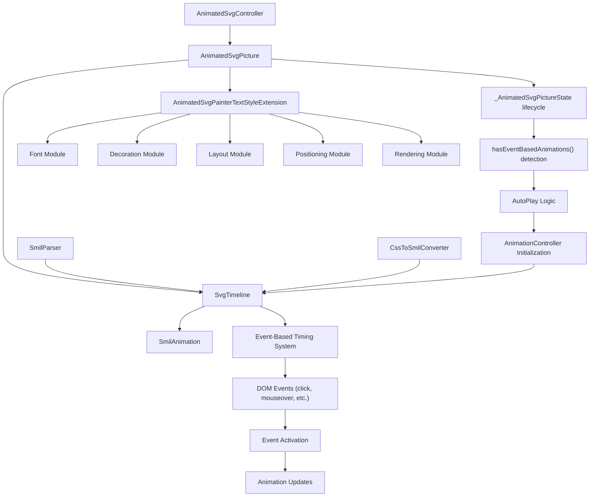
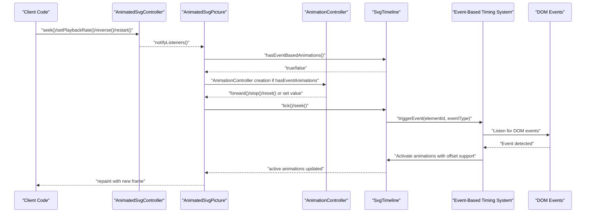
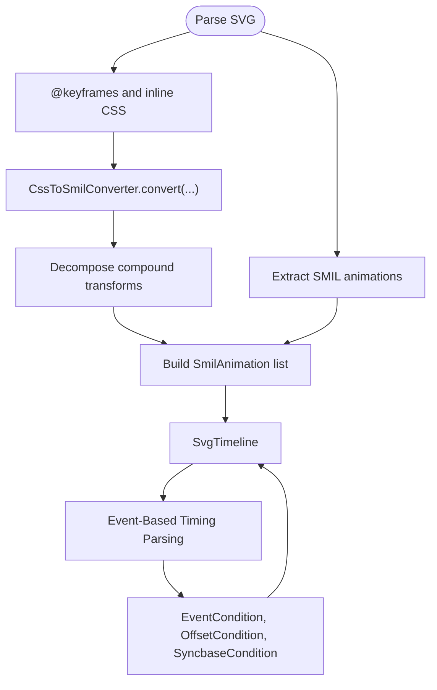
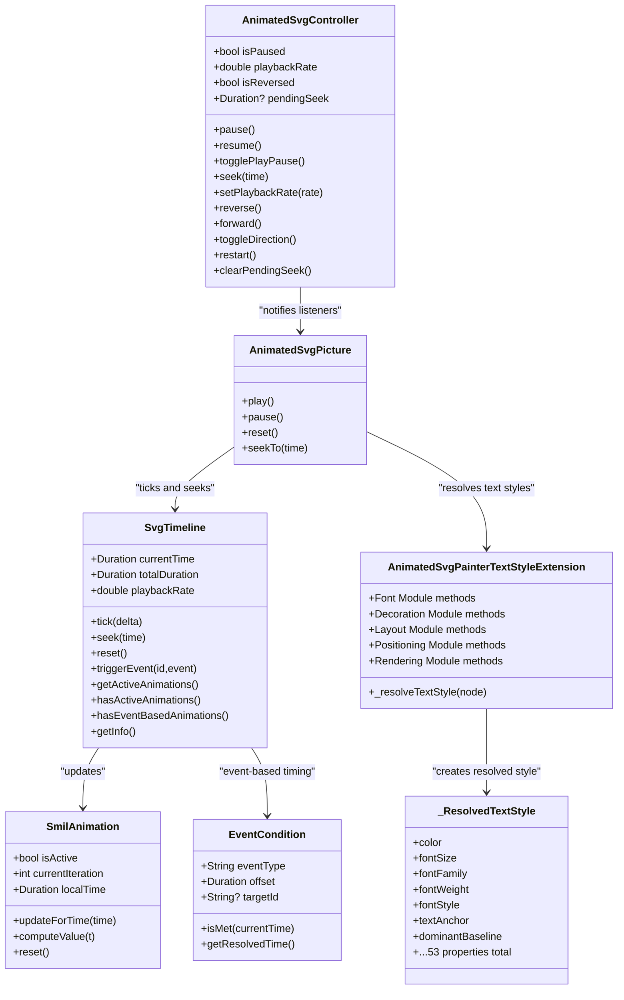

# Animation APIs

<cite>
**Referenced Files in This Document**
- [animated_svg_controller.dart](file://lib/src/animation/animated_svg_controller.dart)
- [animated_svg_picture.dart](file://lib/src/animation/animated_svg_picture.dart)
- [animated_svg_picture_lifecycle.dart](file://lib/src/animation/animated_svg_picture_lifecycle.dart)
- [animated_svg_painter_text_style.dart](file://lib/src/animation/animated_svg_painter_text_style.dart)
- [animated_svg_painter_text_style_font.dart](file://lib/src/animation/animated_svg_painter_text_style_font.dart)
- [animated_svg_painter_text_style_decoration.dart](file://lib/src/animation/animated_svg_painter_text_style_decoration.dart)
- [animated_svg_painter_text_style_layout.dart](file://lib/src/animation/animated_svg_painter_text_style_layout.dart)
- [animated_svg_painter_text_style_positioning.dart](file://lib/src/animation/animated_svg_painter_text_style_positioning.dart)
- [animated_svg_painter_text_style_rendering.dart](file://lib/src/animation/animated_svg_painter_text_style_rendering.dart)
- [animated_svg_painter_text_paint.dart](file://lib/src/animation/animated_svg_painter_text_paint.dart)
- [animated_svg_painter.dart](file://lib/src/animation/animated_svg_painter.dart)
- [smil_timeline.dart](file://lib/src/animation/smil/smil_timeline.dart)
- [smil_timeline_info.dart](file://lib/src/animation/smil/smil_timeline_info.dart)
- [smil_animation.dart](file://lib/src/animation/smil/smil_animation.dart)
- [smil_parser.dart](file://lib/src/animation/smil/smil_parser.dart)
- [css_to_smil_converter.dart](file://lib/src/animation/css_to_smil_converter.dart)
- [timing_condition.dart](file://lib/src/animation/smil/timing_condition.dart)
- [timing_parser.dart](file://lib/src/animation/smil/timing_parser.dart)
- [smil_timeline_syncbase.dart](file://lib/src/animation/smil/smil_timeline_syncbase.dart)
- [smil_timeline_runtime.dart](file://lib/src/animation/smil/smil_timeline_runtime.dart)
- [controller_test.dart](file://test/animation/controller_test.dart)
- [css_animations_test.dart](file://test/animation/css_animations_test.dart)
- [event_timing_test.dart](file://test/animation/event_timing_test.dart)
- [stroke_dash_stop_color_test.dart](file://test/animation/stroke_dash_stop_color_test.dart)
- [text_decoration_thickness_test.dart](file://test/animation/text_decoration_thickness_test.dart)
- [text_underline_position_test.dart](file://test/animation/text_underline_position_test.dart)
- [text_emphasis_test.dart](file://test/animation/text_emphasis_test.dart)
- [ruby_align_test.dart](file://test/animation/ruby_align_test.dart)
- [font_variation_settings_test.dart](file://test/animation/font_variation_settings_test.dart)
- [animation.dart](file://lib/src/animation.dart)
</cite>

## Update Summary
**Changes Made**
- Enhanced event-driven animation support with new `hasEventBasedAnimations()` method for automatic controller initialization
- Improved controller initialization logic that detects event-driven mode and creates AnimationController accordingly
- Added comprehensive event-based animation parsing and timing system with DOM event support
- Enhanced autoplay functionality with better integration for event-driven animations
- Added documentation for event-driven mode detection and repeat mode startup for event-driven animations

## Table of Contents
1. [Introduction](#introduction)
2. [Project Structure](#project-structure)
3. [Core Components](#core-components)
4. [Architecture Overview](#architecture-overview)
5. [Detailed Component Analysis](#detailed-component-analysis)
6. [Dependency Analysis](#dependency-analysis)
7. [Performance Considerations](#performance-considerations)
8. [Troubleshooting Guide](#troubleshooting-guide)
9. [Conclusion](#conclusion)
10. [Appendices](#appendices)

## Introduction
This document describes the animation APIs for Flutter SVG, focusing on the AnimatedSvgController, timeline management, and animation control methods. It covers controller methods for play, pause, stop, seek, and loop control; timeline properties such as duration, position, status, and playback rate; animation state management and event callbacks; and integration with Flutter animation widgets. It also documents SMIL animation parsing, CSS animation conversion, and animation composition, with examples of programmatic control, synchronization, and custom behaviors. Finally, it addresses performance optimization, memory management, and debugging techniques.

**Updated** Enhanced event-driven animation support now includes automatic detection of event-based animations through the `hasEventBasedAnimations()` method, improved controller initialization logic, and comprehensive DOM event integration for interactive SVG animations.

## Project Structure
The animation system is organized around:
- AnimatedSvgController: Programmatic control surface for playback state and direction.
- AnimatedSvgPicture: Widget that renders animated SVG and manages lifecycle, timeline, and event-driven animations.
- SvgTimeline: Central timeline orchestrating SMIL animations, timing, and event triggers.
- SmilAnimation: Individual SMIL animation definitions and runtime evaluation.
- SmilParser and CssToSmilConverter: Parsers that extract and normalize SMIL and CSS animations into a unified runtime model.
- **Enhanced** Event-Based Timing System: Comprehensive DOM event support with `hasEventBasedAnimations()` detection and automatic controller initialization.
- **Enhanced** AnimatedSvgPainterTextStyleExtension: Comprehensive CSS text styling resolution with 5 specialized modules supporting 53 properties and advanced unit conversions.
- Tests and examples: Demonstrate controller usage, CSS-to-SMIL conversion, event-driven animations, and synchronization.

**Diagram sources**
- [animated_svg_controller.dart:25-131](file://lib/src/animation/animated_svg_controller.dart#L25-L131)
- [animated_svg_picture.dart:108-359](file://lib/src/animation/animated_svg_picture.dart#L108-L359)
- [animated_svg_picture_lifecycle.dart:80-109](file://lib/src/animation/animated_svg_picture_lifecycle.dart#L80-L109)
- [animated_svg_painter_text_style.dart:3-342](file://lib/src/animation/animated_svg_painter_text_style.dart#L3-L342)
- [animated_svg_painter_text_style_font.dart:1-362](file://lib/src/animation/animated_svg_painter_text_style_font.dart#L1-L362)
- [animated_svg_painter_text_style_decoration.dart:1-32](file://lib/src/animation/animated_svg_painter_text_style_decoration.dart#L1-L32)
- [animated_svg_painter_text_style_layout.dart:1-451](file://lib/src/animation/animated_svg_painter_text_style_layout.dart#L1-L451)
- [animated_svg_painter_text_style_positioning.dart:1-335](file://lib/src/animation/animated_svg_painter_text_style_positioning.dart#L1-L335)
- [animated_svg_painter_text_style_rendering.dart:1-545](file://lib/src/animation/animated_svg_painter_text_style_rendering.dart#L1-L545)
- [animated_svg_painter.dart:412-857](file://lib/src/animation/animated_svg_painter.dart#L412-L857)
- [smil_timeline.dart:20-256](file://lib/src/animation/smil/smil_timeline.dart#L20-L256)
- [smil_animation.dart:80-453](file://lib/src/animation/smil/smil_animation.dart#L80-L453)
- [smil_parser.dart:13-39](file://lib/src/animation/smil/smil_parser.dart#L13-L39)
- [css_to_smil_converter.dart:15-68](file://lib/src/animation/css_to_smil_converter.dart#L15-L68)
- [timing_condition.dart:126-161](file://lib/src/animation/smil/timing_condition.dart#L126-L161)
- [timing_parser.dart:64-91](file://lib/src/animation/smil/timing_parser.dart#L64-L91)

**Section sources**
- [animation.dart:1-31](file://lib/src/animation.dart#L1-L31)

## Core Components
- AnimatedSvgController: Provides playback control (pause, resume, toggle), seek, playback rate, direction (forward/reverse), restart, and listener notifications.
- SvgTimeline: Manages global time, playback rate, activation/deactivation of animations, total duration computation, and event-based triggers.
- SmilAnimation: Encapsulates animation definition (type, attributes, values, timing, calc mode, fill mode, additive/accumulate), runtime state, and value computation.
- SmilParser: Extracts SMIL and CSS animations from the SVG DOM and converts CSS animations to SMIL equivalents.
- **Enhanced** Event-Based Timing System: Comprehensive DOM event support including click, mouseover, mouseout, focus, blur, and other common events with offset support and target-specific event handling.
- **Enhanced** AnimatedSvgPainterTextStyleExtension: Comprehensive CSS text styling resolution with 5 specialized modules supporting 53 properties with advanced unit conversions, inheritance patterns, and fallback mechanisms.
- AnimatedSvgPicture: Widget that parses SVG, builds the timeline, drives frame ticks via AnimationController, and exposes play/pause/reset/seek APIs.

**Section sources**
- [animated_svg_controller.dart:25-131](file://lib/src/animation/animated_svg_controller.dart#L25-L131)
- [smil_timeline.dart:20-256](file://lib/src/animation/smil/smil_timeline.dart#L20-L256)
- [smil_animation.dart:80-453](file://lib/src/animation/smil/smil_animation.dart#L80-L453)
- [smil_parser.dart:13-39](file://lib/src/animation/smil/smil_parser.dart#L13-L39)
- [timing_condition.dart:126-161](file://lib/src/animation/smil/timing_condition.dart#L126-L161)
- [timing_parser.dart:64-91](file://lib/src/animation/smil/timing_parser.dart#L64-L91)
- [animated_svg_painter_text_style.dart:3-342](file://lib/src/animation/animated_svg_painter_text_style.dart#L3-L342)
- [animated_svg_picture.dart:108-359](file://lib/src/animation/animated_svg_picture.dart#L108-L359)

## Architecture Overview
The system integrates Flutter's AnimationController with a custom SvgTimeline to synchronize widget rendering with SMIL/CSS animation evaluation. The enhanced event-driven animation system provides automatic detection of event-based animations through the `hasEventBasedAnimations()` method, enabling intelligent controller initialization and seamless DOM event integration for interactive SVG experiences.

**Diagram sources**
- [animated_svg_controller.dart:44-122](file://lib/src/animation/animated_svg_controller.dart#L44-L122)
- [animated_svg_picture.dart:272-294](file://lib/src/animation/animated_svg_picture.dart#L272-L294)
- [animated_svg_picture_lifecycle.dart:80-109](file://lib/src/animation/animated_svg_picture_lifecycle.dart#L80-L109)
- [smil_timeline.dart:88-98](file://lib/src/animation/smil/smil_timeline.dart#L88-L98)
- [smil_timeline.dart:212-215](file://lib/src/animation/smil/smil_timeline.dart#L212-L215)
- [timing_condition.dart:126-161](file://lib/src/animation/smil/timing_condition.dart#L126-L161)

## Detailed Component Analysis

### AnimatedSvgController API
- Purpose: Programmatic control of playback state, direction, and seeking.
- Key methods and properties:
  - isPaused: Boolean indicating paused state.
  - playbackRate: Positive multiplier for playback speed.
  - isReversed: Direction flag.
  - pendingSeek: Current seek target if set.
  - pause(), resume(), togglePlayPause(): Control playback.
  - seek(Duration): Set a pending seek target; controller notifies listeners.
  - setPlaybackRate(double): Enforces positive rate; throws on invalid values.
  - reverse(), forward(), toggleDirection(): Control direction.
  - restart(): Reset to beginning and unpause.
  - clearPendingSeek(): Internal method to clear pending seek after consumption.

Usage highlights:
- Listener pattern: Add listeners to react to state changes (pause, resume, seek, rate change).
- Integration: AnimatedSvgPicture subscribes to controller updates and adjusts playback accordingly.

**Section sources**
- [animated_svg_controller.dart:25-131](file://lib/src/animation/animated_svg_controller.dart#L25-L131)
- [controller_test.dart:121-140](file://test/animation/controller_test.dart#L121-L140)

### Timeline Management (SvgTimeline)
- Purpose: Central orchestration of time, activation of animations, and event-driven triggers.
- Properties:
  - currentTime: Current global time.
  - totalDuration: Computed maximum end time across all animations.
  - playbackRate: Positive multiplier affecting tick deltas.
  - **Enhanced** hasEventBasedAnimations(): Detects presence of event-based animations for automatic controller initialization.
- Methods:
  - tick(Duration): Advance time by delta scaled by playbackRate; update active animations.
  - seek(Duration): Clamp to [0, totalDuration]; update active animations.
  - reset(): Reset to start, clear event times and resolved begin times, reinitialize animations.
  - triggerEvent(String?, String): Fire event-based animations keyed by elementId and eventType; update animations.
  - getActiveAnimations(), hasActiveAnimations(): Query active state.
  - getInfo(): Returns TimelineInfo with current time, total duration, counts, and playback rate.
- Timing resolution:
  - Computes effective begin/end times, supports syncbase timing, and handles infinite durations gracefully.
  - **Enhanced** Event-based animations with automatic initialization and offset support.

**Section sources**
- [smil_timeline.dart:20-256](file://lib/src/animation/smil/smil_timeline.dart#L20-L256)
- [smil_timeline_info.dart:1-48](file://lib/src/animation/smil/smil_timeline_info.dart#L1-L48)
- [smil_timeline.dart:212-215](file://lib/src/animation/smil/smil_timeline.dart#L212-L215)

### Enhanced Event-Driven Animation System
- Purpose: Automatic detection and management of event-based animations for interactive SVG experiences.
- **New** hasEventBasedAnimations() Method:
  - Detects animations with event-based timing conditions (click, mouseover, etc.).
  - Returns true when event listeners are registered, enabling automatic AnimationController creation.
  - Used by AnimatedSvgPicture lifecycle for intelligent autoplay decisions.
- Event Condition Support:
  - EventCondition class supports DOM events with optional target IDs and offsets.
  - Common events: click, mousedown, mouseup, mouseover, mouseout, mousemove, focus, blur, focusin, focusout, activate, beginEvent, endEvent, repeatEvent.
  - Target-specific events: "button.click+250ms" syntax for element-specific triggering.
- Event Parsing and Resolution:
  - TimingParser.parse() supports mixed timing conditions including events, offsets, and syncbase.
  - Event-based animations are initialized with "indefinite" begin times and activated via triggerEvent().
  - Offset support allows delayed animation activation after event occurrence.
- Integration with Autoplay:
  - AnimatedSvgPicture checks hasEventBasedAnimations() alongside autoPlay setting.
  - Creates AnimationController when either autoPlay is true OR event-based animations are present.
  - Enables seamless integration of interactive and automatic animations.

**Section sources**
- [smil_timeline.dart:212-215](file://lib/src/animation/smil/smil_timeline.dart#L212-L215)
- [timing_condition.dart:126-161](file://lib/src/animation/smil/timing_condition.dart#L126-L161)
- [timing_parser.dart:64-91](file://lib/src/animation/smil/timing_parser.dart#L64-L91)
- [animated_svg_picture_lifecycle.dart:80-109](file://lib/src/animation/animated_svg_picture_lifecycle.dart#L80-L109)
- [event_timing_test.dart:104-134](file://test/animation/event_timing_test.dart#L104-L134)

### Animation Control Methods in AnimatedSvgPicture
- Public methods:
  - play(): Forward the internal AnimationController.
  - pause(): Stop the internal AnimationController.
  - reset(): Reset controller and timeline.
  - seekTo(Duration): Convert absolute time to progress and set controller value clamped to [0,1].
- Lifecycle integration:
  - Subscribes to controller updates and toggles reverse direction if needed.
  - Converts controller progress to elapsed time and seeks the timeline on each tick.
  - **Enhanced** Intelligent controller initialization based on event-driven animation detection.

**Section sources**
- [animated_svg_picture.dart:272-294](file://lib/src/animation/animated_svg_picture.dart#L272-L294)
- [animated_svg_picture_lifecycle.dart:80-109](file://lib/src/animation/animated_svg_picture_lifecycle.dart#L80-L109)

### Enhanced Text Styling System (AnimatedSvgPainterTextStyleExtension)
- Purpose: Comprehensive CSS text styling resolution with advanced unit conversions and inheritance patterns distributed across 5 specialized modules.
- **Updated** Restructured into 5 specialized modules:
  - **Font Module** (`animated_svg_painter_text_style_font.dart`): Font-related properties (font-variant, font-stretch, font-size-adjust, font-kerning, font-optical-sizing, font-synthesis, font-variant-* properties)
  - **Decoration Module** (`animated_svg_painter_text_style_decoration.dart`): Text decoration properties (text-decoration, text-decoration-line, text-decoration-style, text-decoration-color, text-decoration-thickness, text-underline-position, text-decoration-skip, text-decoration-skip-ink)
  - **Layout Module** (`animated_svg_painter_text_style_layout.dart`): Layout properties (tab-size, text-indent, white-space, text-overflow, word-break, overflow-wrap, text-wrap, line-break, text-transform, hyphens, hyphenate-character, line-height, vertical-align, hanging-punctuation, text-justify, text-align-last, text-spacing, quotes, initial-letter)
  - **Positioning Module** (`animated_svg_painter_text_style_positioning.dart`): Positioning properties (writing-mode, direction, text-orientation, dominant-baseline, alignment-baseline, baseline-shift, glyph-orientation-vertical, unicode-bidi, text-combine-upright, text-orientation, paint-order, ruby-align, ruby-position)
  - **Rendering Module** (`animated_svg_painter_text_style_rendering.dart`): Rendering properties (forced-color-adjust, print-color-adjust, content-visibility, contain-intrinsic-size, will-change, mix-blend-mode, text-rendering, paint-order)
- Features:
  - Resolves 53 CSS text styling properties with advanced unit conversions (px, em, %, rem).
  - Supports inheritance patterns for cascading style application.
  - Implements fallback mechanisms for property resolution.
  - Handles complex text rendering scenarios including vertical writing modes and ruby annotations.
- Key resolution methods:
  - `_resolveTextStyle(SvgNode)`: Main entry point for comprehensive text style resolution.
  - Unit conversion support: Handles percentages, em units, pixel values, and mixed units.
  - Inheritance patterns: Resolves properties from parent nodes when not explicitly set.
  - Fallback mechanisms: Provides sensible defaults for missing or invalid values.
  - Advanced typography: Supports font features, text decorations, and complex layout properties.

**Section sources**
- [animated_svg_painter_text_style.dart:3-342](file://lib/src/animation/animated_svg_painter_text_style.dart#L3-L342)
- [animated_svg_painter_text_style_font.dart:1-362](file://lib/src/animation/animated_svg_painter_text_style_font.dart#L1-L362)
- [animated_svg_painter_text_style_decoration.dart:1-32](file://lib/src/animation/animated_svg_painter_text_style_decoration.dart#L1-L32)
- [animated_svg_painter_text_style_layout.dart:1-451](file://lib/src/animation/animated_svg_painter_text_style_layout.dart#L1-L451)
- [animated_svg_painter_text_style_positioning.dart:1-335](file://lib/src/animation/animated_svg_painter_text_style_positioning.dart#L1-L335)
- [animated_svg_painter_text_style_rendering.dart:1-545](file://lib/src/animation/animated_svg_painter_text_style_rendering.dart#L1-L545)
- [animated_svg_painter_text_paint.dart:260-296](file://lib/src/animation/animated_svg_painter_text_paint.dart#L260-L296)
- [animated_svg_painter.dart:412-857](file://lib/src/animation/animated_svg_painter.dart#L412-L857)

### SMIL Animation Model (SmilAnimation)
- Types:
  - animate, animateTransform, animateMotion, set, animateColor.
- Timing and behavior:
  - begin, end, dur, repeatCount, repeatDur, fillMode, calcMode, playbackDirection, additive, accumulate.
  - Values-based or from/to/by definitions; keyTimes, keySplines, keySteps for pacing.
- Runtime:
  - isActive, currentIteration, localTime, lastValue.
  - computeValue(t): Evaluates value for a given iteration progress, supporting discrete, values-based, and simple from/to/by modes.
  - updateForTime(globalTime): Activates/deactivates animation, computes iteration and progress, applies fill mode at end.
  - reset(): Clears runtime state.

**Section sources**
- [smil_animation.dart:80-453](file://lib/src/animation/smil/smil_animation.dart#L80-L453)

### SMIL Parsing and CSS Animation Conversion
- SmilParser:
  - Extracts native SMIL animations and CSS animations from inline styles and @keyframes.
  - Supports CSS selector targeting (#id, .class).
- CssToSmilConverter:
  - Converts CSS keyframes to SMIL equivalents.
  - Decomposes compound transforms into separate SmilAnimation instances per transform function.
  - Maps timing functions (cubic-bezier) to keySplines and normalizes values.
- **Enhanced** Event-Based Timing Parsing:
  - TimingParser.parse() supports mixed timing conditions including events, offsets, and syncbase.
  - EventCondition parsing with target-specific support and offset handling.
  - Validation and tests confirm CSS animations convert to SMIL and that compound transforms emit per-function animations.

**Diagram sources**
- [smil_parser.dart:16-37](file://lib/src/animation/smil/smil_parser.dart#L16-L37)
- [css_to_smil_converter.dart:15-68](file://lib/src/animation/css_to_smil_converter.dart#L15-L68)
- [timing_parser.dart:17-62](file://lib/src/animation/smil/timing_parser.dart#L17-L62)
- [timing_condition.dart:126-161](file://lib/src/animation/smil/timing_condition.dart#L126-L161)

**Section sources**
- [smil_parser.dart:13-39](file://lib/src/animation/smil/smil_parser.dart#L13-L39)
- [css_to_smil_converter.dart:15-68](file://lib/src/animation/css_to_smil_converter.dart#L15-L68)
- [timing_parser.dart:17-62](file://lib/src/animation/smil/timing_parser.dart#L17-L62)
- [timing_condition.dart:126-161](file://lib/src/animation/smil/timing_condition.dart#L126-L161)

### Timeline Properties and State
- Duration and Position:
  - totalDuration computed from animation effective ends.
  - currentTime updated via tick or seek.
- Status and Active Animations:
  - isActive toggled per animation during updateForTime.
  - getActiveAnimations() and hasActiveAnimations() expose runtime state.
  - **Enhanced** hasEventBasedAnimations() provides event-driven animation detection.
- Playback Rate:
  - Applied to tick deltas; enforced positive in both controller and timeline.

**Section sources**
- [smil_timeline.dart:62-77](file://lib/src/animation/smil/smil_timeline.dart#L62-L77)
- [smil_timeline.dart:202-209](file://lib/src/animation/smil/smil_timeline.dart#L202-L209)
- [smil_timeline_info.dart:15-39](file://lib/src/animation/smil/smil_timeline_info.dart#L15-L39)
- [smil_timeline.dart:212-215](file://lib/src/animation/smil/smil_timeline.dart#L212-L215)

### Event-Driven Animations and Synchronization
- Event Triggers:
  - triggerEvent(elementId, eventType) activates animations listening for the event; offsets supported.
  - Event-based animations are initialized with "indefinite" begin times and activated via triggerEvent().
- Syncbase Timing:
  - Resolved begin times override explicit begin for dependent animations; dependency graph built and resolved before computing total duration.
- **Enhanced** Event-Based Animation Detection:
  - hasEventBasedAnimations() method detects animations with event conditions for automatic controller initialization.
  - Event listeners are registered during timeline construction for seamless interaction.
- Chaining Examples:
  - Demonstrated via SMIL begin="other.end" chaining and tests validating chained sequences.

**Section sources**
- [smil_timeline.dart:128-158](file://lib/src/animation/smil/smil_timeline.dart#L128-L158)
- [smil_timeline.dart:106-126](file://lib/src/animation/smil/smil_timeline.dart#L106-L126)
- [smil_timeline.dart:212-215](file://lib/src/animation/smil/smil_timeline.dart#L212-L215)
- [smil_timeline_syncbase.dart:86-100](file://lib/src/animation/smil/smil_timeline_syncbase.dart#L86-L100)

### Programmatic Animation Control and Integration
- Controller-driven control:
  - Tests demonstrate pause/resume, seek, rate changes, direction toggles, and restart.
- Widget integration:
  - AnimatedSvgPicture subscribes to controller updates and starts/stops playback accordingly.
  - On each tick, converts controller progress to elapsed time and seeks the timeline.
  - **Enhanced** Intelligent controller initialization based on event-driven animation detection.

**Section sources**
- [controller_test.dart:26-140](file://test/animation/controller_test.dart#L26-L140)
- [animated_svg_picture_lifecycle.dart:80-109](file://lib/src/animation/animated_svg_picture_lifecycle.dart#L80-L109)

### Animation Composition Patterns
- Multiple animations:
  - Timeline aggregates all SmilAnimation instances; each can target different attributes or nodes.
- Transform decomposition:
  - Compound transforms split into separate animateTransform entries per function (translate, rotate, scale, skew).
- CSS selectors:
  - Animations apply to matching nodes by id/class/tag selectors.
- **Enhanced** Mixed Timing Conditions:
  - Animations can combine time-based, event-based, and syncbase timing conditions.
  - Event conditions support target-specific triggering and offset-based delays.

**Section sources**
- [css_to_smil_converter.dart:35-48](file://lib/src/animation/css_to_smil_converter.dart#L35-L48)
- [css_animations_test.dart:312-339](file://test/animation/css_animations_test.dart#L312-L339)
- [timing_parser.dart:70-91](file://lib/src/animation/smil/timing_parser.dart#L70-L91)

## Dependency Analysis

**Diagram sources**
- [animated_svg_controller.dart:25-131](file://lib/src/animation/animated_svg_controller.dart#L25-L131)
- [animated_svg_picture.dart:272-294](file://lib/src/animation/animated_svg_picture.dart#L272-L294)
- [smil_timeline.dart:20-256](file://lib/src/animation/smil/smil_timeline.dart#L20-L256)
- [smil_animation.dart:80-453](file://lib/src/animation/smil/smil_animation.dart#L80-L453)
- [timing_condition.dart:126-161](file://lib/src/animation/smil/timing_condition.dart#L126-L161)
- [animated_svg_painter_text_style.dart:3-342](file://lib/src/animation/animated_svg_painter_text_style.dart#L3-L342)
- [animated_svg_painter_text_style_font.dart:1-362](file://lib/src/animation/animated_svg_painter_text_style_font.dart#L1-L362)
- [animated_svg_painter_text_style_decoration.dart:1-32](file://lib/src/animation/animated_svg_painter_text_style_decoration.dart#L1-L32)
- [animated_svg_painter_text_style_layout.dart:1-451](file://lib/src/animation/animated_svg_painter_text_style_layout.dart#L1-L451)
- [animated_svg_painter_text_style_positioning.dart:1-335](file://lib/src/animation/animated_svg_painter_text_style_positioning.dart#L1-L335)
- [animated_svg_painter_text_style_rendering.dart:1-545](file://lib/src/animation/animated_svg_painter_text_style_rendering.dart#L1-L545)
- [animated_svg_painter.dart:412-857](file://lib/src/animation/animated_svg_painter.dart#L412-L857)

**Section sources**
- [animated_svg_controller.dart:25-131](file://lib/src/animation/animated_svg_controller.dart#L25-L131)
- [animated_svg_picture.dart:108-359](file://lib/src/animation/animated_svg_picture.dart#L108-L359)
- [smil_timeline.dart:20-256](file://lib/src/animation/smil/smil_timeline.dart#L20-L256)
- [smil_animation.dart:80-453](file://lib/src/animation/smil/smil_animation.dart#L80-L453)
- [timing_condition.dart:126-161](file://lib/src/animation/smil/timing_condition.dart#L126-L161)
- [animated_svg_painter_text_style.dart:3-342](file://lib/src/animation/animated_svg_painter_text_style.dart#L3-L342)
- [animated_svg_painter_text_style_font.dart:1-362](file://lib/src/animation/animated_svg_painter_text_style_font.dart#L1-L362)
- [animated_svg_painter_text_style_decoration.dart:1-32](file://lib/src/animation/animated_svg_painter_text_style_decoration.dart#L1-L32)
- [animated_svg_painter_text_style_layout.dart:1-451](file://lib/src/animation/animated_svg_painter_text_style_layout.dart#L1-L451)
- [animated_svg_painter_text_style_positioning.dart:1-335](file://lib/src/animation/animated_svg_painter_text_style_positioning.dart#L1-L335)
- [animated_svg_painter_text_style_rendering.dart:1-545](file://lib/src/animation/animated_svg_painter_text_style_rendering.dart#L1-L545)
- [animated_svg_painter.dart:412-857](file://lib/src/animation/animated_svg_painter.dart#L412-L857)

## Performance Considerations
- Keep playbackRate positive and reasonable to avoid excessive recomputations.
- Prefer fewer, larger transform animations over many small ones where possible.
- Use freeze fill mode judiciously; it retains final values after animation end.
- Limit the number of concurrent active animations by controlling begin/end and repeat settings.
- Avoid overly dense keyframes; use calcMode spline or paced appropriately to balance quality and CPU cost.
- Use traceFrameTicks and onTrace for targeted profiling during development.
- **Updated** Text styling resolution is optimized with caching and efficient unit conversion algorithms distributed across 5 specialized modules.
- **Updated** The 53 CSS properties are resolved incrementally through modular architecture to minimize computational overhead.
- **Updated** Advanced typography features utilize efficient font feature application and variable font axis handling across specialized font modules.
- **Enhanced** Event-based animation detection uses efficient hasEventBasedAnimations() method for automatic controller initialization without performance overhead.
- **Enhanced** Event listeners are registered once during timeline construction and efficiently managed during runtime.
- **Updated** Modular architecture enables selective property resolution and improved memory management.

## Troubleshooting Guide
- Invalid playback rate:
  - AnimatedSvgController.setPlaybackRate throws on non-positive values.
- Seeking out of range:
  - SvgTimeline.seek clamps to [0, totalDuration].
- Event-based animations not triggering:
  - Ensure triggerEvent called with correct elementId and eventType; verify begin conditions and offsets.
  - Check hasEventBasedAnimations() returns true for event-driven scenarios.
  - Verify event listeners are properly registered during timeline construction.
- Direction changes not reflected:
  - AnimatedSvgPicture reacts to controller.isReversed changes; ensure controller listeners are registered.
- CSS animations not applied:
  - Confirm CSS selectors match nodes and that CssToSmilConverter successfully emits SMIL animations.
- **Enhanced** Event-based animation issues:
  - Verify event condition parsing supports the specific event type (click, mouseover, etc.).
  - Check target-specific event syntax: "elementId.eventType+offset".
  - Ensure hasEventBasedAnimations() detection works correctly for mixed timing conditions.
  - Validate AnimationController initialization logic when autoPlay=false but event-based animations are present.
- **Updated** Text styling issues:
  - Verify CSS property values are valid and properly formatted.
  - Check inheritance patterns for missing property values.
  - Ensure unit conversions are appropriate for the current context.
  - Validate fallback mechanisms are working correctly.
  - **Updated** For advanced properties like font-variation-settings, ensure variable font support is available.
  - **Updated** For ruby and text-emphasis properties, verify proper Unicode support and font availability.
  - **Updated** For internationalization features, ensure locale-specific font fallbacks are configured.
  - **Updated** Check specialized module resolution for specific property categories (font, decoration, layout, positioning, rendering).
  - **Updated** Verify 53-property coverage includes the specific CSS property causing issues.

**Section sources**
- [animated_svg_controller.dart:83-91](file://lib/src/animation/animated_svg_controller.dart#L83-L91)
- [smil_timeline.dart:88-98](file://lib/src/animation/smil/smil_timeline.dart#L88-L98)
- [animated_svg_picture_lifecycle.dart:210-220](file://lib/src/animation/animated_svg_picture_lifecycle.dart#L210-L220)
- [css_animations_test.dart:204-339](file://test/animation/css_animations_test.dart#L204-L339)
- [animated_svg_painter_text_style.dart:3-342](file://lib/src/animation/animated_svg_painter_text_style.dart#L3-L342)
- [event_timing_test.dart:104-134](file://test/animation/event_timing_test.dart#L104-L134)

## Conclusion
The Flutter SVG animation system provides a robust, SMIL-compatible pipeline with a clear separation of concerns: AnimatedSvgController for programmatic control, AnimatedSvgPicture for widget lifecycle and rendering, and SvgTimeline for orchestration and timing. CSS animations are seamlessly converted to SMIL, enabling consistent behavior across animation types. The enhanced event-driven animation system now provides automatic detection of event-based animations through the `hasEventBasedAnimations()` method, enabling intelligent controller initialization and seamless DOM event integration for interactive SVG experiences. The system supports comprehensive DOM event handling including click, mouseover, mouseout, focus, blur, and other common events with offset support and target-specific triggering. The enhanced text styling system now provides comprehensive CSS property resolution with advanced unit conversions, inheritance patterns, and fallback mechanisms distributed across 5 specialized modules supporting 53 text styling properties. This includes advanced typography features like font-variation-settings for variable fonts, comprehensive text decoration controls, internationalization support with ruby annotations and text emphasis, and accessibility features for forced color adjustments and content visibility optimization. The modular architecture improves maintainability, performance, and extensibility while maintaining strong performance and debuggability. With precise control over playback, direction, seeking, and event-driven triggers, developers can implement sophisticated synchronization and custom animation behaviors with seamless integration of interactive and automatic animation types.

## Appendices

### API Reference Summary

- AnimatedSvgController
  - Properties: isPaused, playbackRate, isReversed, pendingSeek
  - Methods: pause, resume, togglePlayPause, seek, setPlaybackRate, reverse, forward, toggleDirection, restart, clearPendingSeek

- SvgTimeline
  - Properties: currentTime, totalDuration, playbackRate
  - Methods: tick, seek, reset, triggerEvent, getActiveAnimations, hasActiveAnimations, hasEventBasedAnimations, getInfo

- SmilAnimation
  - Properties: isActive, currentIteration, localTime
  - Methods: updateForTime, computeValue, reset

- AnimatedSvgPicture
  - Methods: play, pause, reset, seekTo

- **Enhanced** EventCondition
  - Properties: eventType, offset, targetId
  - Methods: isMet(currentTime), getResolvedTime()

- **Updated** AnimatedSvgPainterTextStyleExtension
  - Methods: `_resolveTextStyle`, delegates to 5 specialized modules
  - **Updated** Font Module: `_resolveFontVariant`, `_resolveFontStretch`, `_resolveFontSizeAdjust`, `_resolveFontKerning`, `_resolveFontVariantNumeric`, `_resolveFontVariantLigatures`, `_resolveFontVariantCaps`, `_resolveFontOpticalSizing`, `_resolveFontSynthesis`, `_resolveFontVariantPosition`, `_resolveFontVariantEastAsian`, `_resolveFontLanguageOverride`, `_resolveFontVariantAlternates`, `_resolveFontPalette`, `_resolveFontVariationSettings`
  - **Updated** Decoration Module: `_resolveTextDecoration`, `_resolveTextDecorationThickness`, `_resolveTextUnderlinePosition`, `_resolveTextDecorationSkipInk`, `_resolveTextDecorationSkip`, `_resolveTextDecorationStyle`
  - **Updated** Layout Module: `_resolveTabSize`, `_resolveTextIndent`, `_resolveWordBreak`, `_resolveOverflowWrap`, `_resolveTextTransform`, `_resolveHyphens`, `_resolveLineBreak`, `_resolveWhiteSpace`, `_resolveTextOverflow`, `_resolveTextWrap`, `_resolveLineHeight`, `_resolveVerticalAlign`, `_resolveHangingPunctuation`, `_resolveTextJustify`, `_resolveTextAlignLast`, `_resolveHyphenateCharacter`, `_resolveQuotes`, `_resolveInitialLetter`, `_resolveTextSpacing`
  - **Updated** Positioning Module: `_resolveWritingMode`, `_resolveTextDirection`, `_resolveGlyphOrientationVertical`, `_resolveUnicodeBidi`, `_resolveTextCombineUpright`, `_resolveTextOrientation`, `_resolveDominantBaseline`, `_resolveBaselineShift`, `_resolvePaintOrder`, `_resolveRubyAlign`, `_resolveRubyPosition`
  - **Updated** Rendering Module: `_resolveTextRenderingFeatures`, `_resolveForcedColorAdjust`, `_resolvePrintColorAdjust`, `_resolveContentVisibility`, `_resolveContainIntrinsicSize`, `_resolveWillChange`, `_resolveCssMixBlendMode`

- **Updated** _ResolvedTextStyle (53 Properties Total)
  - **Typography & Font**: color, fontSize, fontFamily, fontWeight, fontStyle, textAnchor, dominantBaseline, baselineShift, letterSpacing, wordSpacing, fontFeatures, fontStretch, fontSizeAdjust, fontKerning, fontVariantNumeric, fontVariantLigatures, fontVariantCaps, fontOpticalSizing, fontSynthesis, fontVariantPosition, fontVariantEastAsian, fontLanguageOverride, fontVariantAlternates, fontPalette, fontVariationSettings
  - **Text Decoration**: decorations, decorationColor, textDecorationLine, textDecorationThickness, textUnderlinePosition, textUnderlineOffset, textDecorationSkipInk, textDecorationSkip, textDecorationStyle, cssTextDecorationColor
  - **Layout & Spacing**: tabSize, textIndent, wordBreak, overflowWrap, textTransform, hyphens, lineBreak, whiteSpace, textOverflow, verticalAlign, lineHeight, textJustify, textAlignLast, hyphenateCharacter, textSpacing, quotes, initialLetter
  - **Positioning & Alignment**: writingMode, textDirection, glyphOrientationVertical, unicodeBidi, textCombineUpright, textOrientation, paintOrder, rubyAlign, rubyPosition, textEmphasis, textEmphasisPosition, textEmphasisColor, textEmphasisStyle
  - **Internationalization**: fontVariantEastAsian, textEmphasis, textEmphasisPosition, textEmphasisColor, textEmphasisStyle, quotes, initialLetter, textSpacing, fontLanguageOverride, fontVariantAlternates
  - **Accessibility & Rendering**: forcedColorAdjust, printColorAdjust, contentVisibility, containIntrinsicSize, willChange, cssMixBlendMode, textShadow, cssDirection

**Section sources**
- [animated_svg_controller.dart:25-131](file://lib/src/animation/animated_svg_controller.dart#L25-L131)
- [smil_timeline.dart:20-256](file://lib/src/animation/smil/smil_timeline.dart#L20-L256)
- [smil_animation.dart:80-453](file://lib/src/animation/smil/smil_animation.dart#L80-L453)
- [animated_svg_picture.dart:272-294](file://lib/src/animation/animated_svg_picture.dart#L272-L294)
- [timing_condition.dart:126-161](file://lib/src/animation/smil/timing_condition.dart#L126-L161)
- [animated_svg_painter_text_style.dart:3-342](file://lib/src/animation/animated_svg_painter_text_style.dart#L3-L342)
- [animated_svg_painter_text_style_font.dart:1-362](file://lib/src/animation/animated_svg_painter_text_style_font.dart#L1-L362)
- [animated_svg_painter_text_style_decoration.dart:1-32](file://lib/src/animation/animated_svg_painter_text_style_decoration.dart#L1-L32)
- [animated_svg_painter_text_style_layout.dart:1-451](file://lib/src/animation/animated_svg_painter_text_style_layout.dart#L1-L451)
- [animated_svg_painter_text_style_positioning.dart:1-335](file://lib/src/animation/animated_svg_painter_text_style_positioning.dart#L1-L335)
- [animated_svg_painter_text_style_rendering.dart:1-545](file://lib/src/animation/animated_svg_painter_text_style_rendering.dart#L1-L545)
- [animated_svg_painter_text_paint.dart:260-296](file://lib/src/animation/animated_svg_painter_text_paint.dart#L260-L296)
- [animated_svg_painter.dart:412-857](file://lib/src/animation/animated_svg_painter.dart#L412-L857)