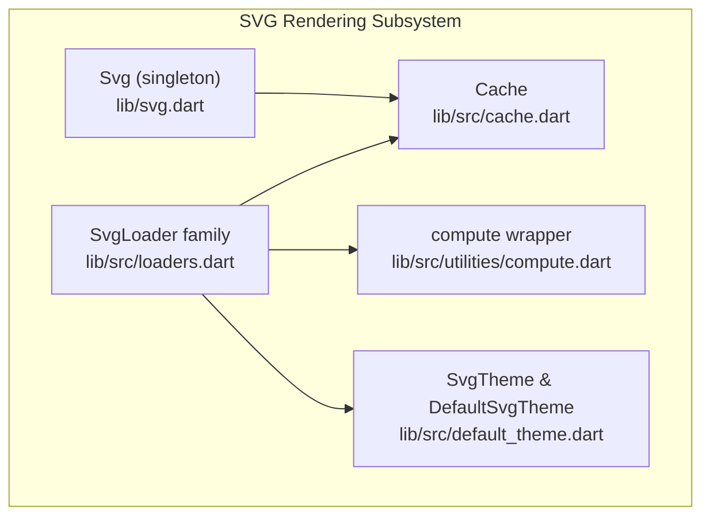
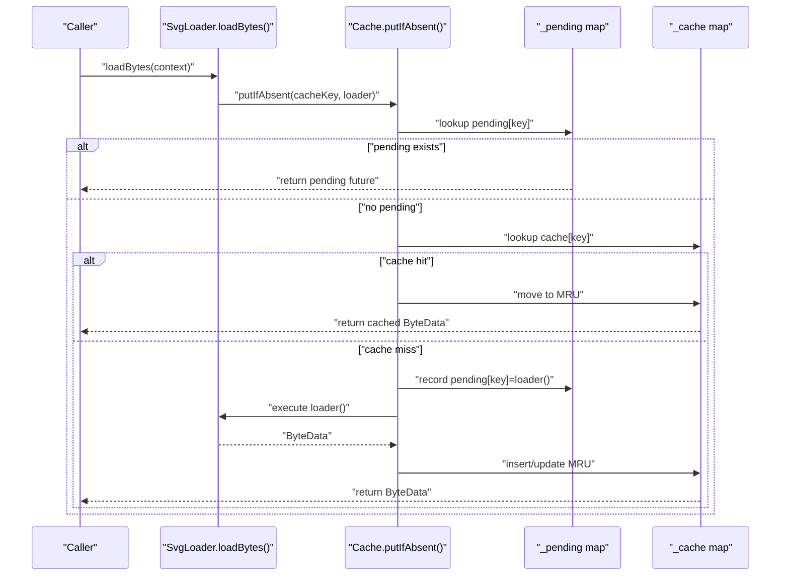
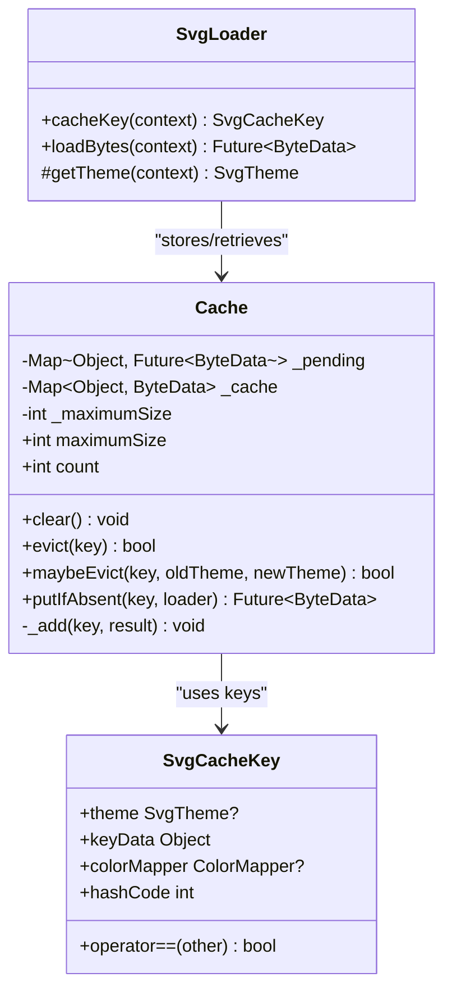
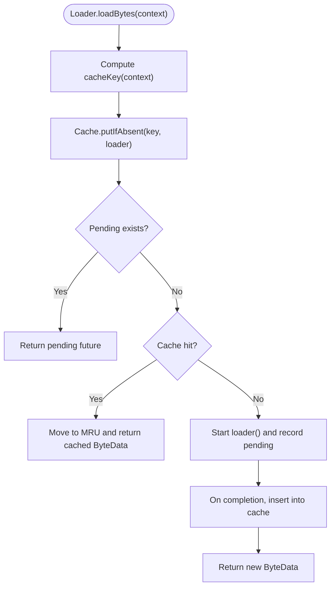
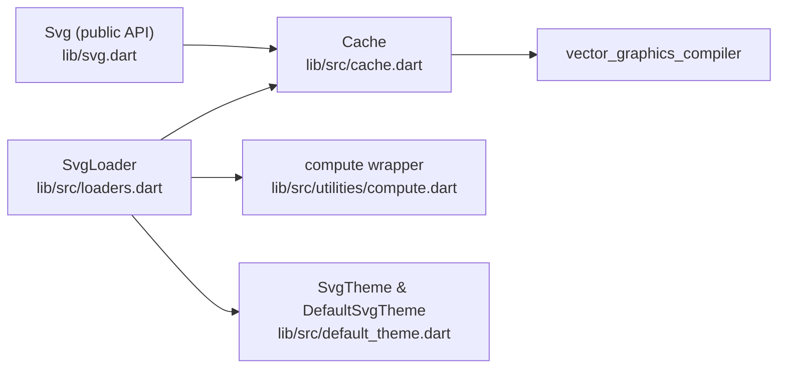

# Cache Management

<cite>
**Referenced Files in This Document**
- [cache.dart](file://lib/src/cache.dart)
- [loaders.dart](file://lib/src/loaders.dart)
- [svg.dart](file://lib/svg.dart)
- [cache_test.dart](file://test/cache_test.dart)
- [compute.dart](file://lib/src/utilities/compute.dart)
- [default_theme.dart](file://lib/src/default_theme.dart)
- [pubspec.yaml](file://pubspec.yaml)
</cite>

## Table of Contents
1. [Introduction](#introduction)
2. [Project Structure](#project-structure)
3. [Core Components](#core-components)
4. [Architecture Overview](#architecture-overview)
5. [Detailed Component Analysis](#detailed-component-analysis)
6. [Dependency Analysis](#dependency-analysis)
7. [Performance Considerations](#performance-considerations)
8. [Troubleshooting Guide](#troubleshooting-guide)
9. [Conclusion](#conclusion)
10. [Appendices](#appendices)

## Introduction
This document provides comprehensive API documentation for the Cache class and cache management functionality used by the SVG rendering pipeline. It covers cache configuration options, eviction policies, memory management, and operational APIs. It also documents cache key generation, automatic cleanup, thread safety considerations, and integration with different loading strategies. Guidance is provided for cache sizing, performance monitoring, invalidation, memory pressure handling, and troubleshooting.

## Project Structure
The cache is part of the SVG rendering subsystem and integrates with the loader infrastructure. The primary cache implementation resides in lib/src/cache.dart, while the cache is consumed by the loader classes in lib/src/loaders.dart. The public API surface exposes the cache via the Svg singleton in lib/svg.dart.

**Diagram sources**
- [svg.dart:26-45](file://lib/svg.dart#L26-L45)
- [cache.dart:5-111](file://lib/src/cache.dart#L5-L111)
- [loaders.dart:118-194](file://lib/src/loaders.dart#L118-L194)
- [compute.dart:21-26](file://lib/src/utilities/compute.dart#L21-L26)
- [default_theme.dart:7-35](file://lib/src/default_theme.dart#L7-L35)

**Section sources**
- [svg.dart:12-17](file://lib/svg.dart#L12-L17)
- [svg.dart:26-45](file://lib/svg.dart#L26-L45)
- [cache.dart:1-111](file://lib/src/cache.dart#L1-L111)
- [loaders.dart:118-194](file://lib/src/loaders.dart#L118-L194)

## Core Components
- Cache: A thread-safe in-memory cache for decoded SVG ByteData keyed by SvgCacheKey. It supports LRU eviction, size limits, and concurrent loaders.
- SvgCacheKey: A composite key that includes the loader identity, theme, and optional color mapper to ensure cache separation for theme-sensitive content.
- SvgLoader: Base class for all loaders that integrates with the cache via cacheKey() and loadBytes().
- Svg: Public API surface that exposes a global Cache instance.

Key capabilities:
- Size-limited LRU eviction policy
- Pending operation de-duplication
- Automatic cleanup on theme changes
- Thread-safe operations via internal maps and futures

**Section sources**
- [cache.dart:5-111](file://lib/src/cache.dart#L5-L111)
- [loaders.dart:196-230](file://lib/src/loaders.dart#L196-L230)
- [loaders.dart:118-194](file://lib/src/loaders.dart#L118-L194)
- [svg.dart:26-45](file://lib/svg.dart#L26-L45)

## Architecture Overview
The cache sits between SvgPicture/Svg loaders and the expensive decode/compile process. Loaders compute a cache key and delegate to the cache for ByteData. The cache ensures only one loader runs per key and maintains an LRU list up to a configurable maximum size.

**Diagram sources**
- [loaders.dart:185-187](file://lib/src/loaders.dart#L185-L187)
- [cache.dart:65-93](file://lib/src/cache.dart#L65-L93)

## Detailed Component Analysis

### Cache API Reference
- Class: Cache
- Purpose: In-memory cache for decoded SVG ByteData with LRU eviction and size limits.

Public properties and methods:
- maximumSize: int
  - Getter returns current limit.
  - Setter updates limit and evicts excess entries immediately if reduced.
  - Behavior: If set to 0, clears the cache immediately.
- clear(): void
  - Evicts all entries.
- evict(key): bool
  - Evicts a single entry by key; returns whether removal occurred.
- maybeEvict(key, oldTheme, newTheme): bool
  - Evicts entries when themes change; currently delegates to evict.
- putIfAbsent(key, loader): Future<ByteData>
  - If key exists, returns cached ByteData and moves to MRU.
  - If missing, starts loader, records pending, and inserts upon completion.
  - Concurrent requests for the same key share the pending future.
- count: int
  - Current number of entries in the cache.

Thread-safety and concurrency:
- Internal maps: _pending and _cache are separate and protected by Dart futures and synchronous returns.
- Pending de-duplication: Ensures only one loader executes per key.
- LRU updates: Move-to-MRU semantics via removal and re-insertion.

Key generation and invalidation:
- Keys are SvgCacheKey instances that include theme and optional color mapper.
- maybeEvict triggers eviction when theme changes.

Memory management:
- Evicts LRU entries when capacity is exceeded.
- Immediate eviction when maximumSize is reduced or set to 0.

**Section sources**
- [cache.dart:9-110](file://lib/src/cache.dart#L9-L110)

#### Class Diagram

**Diagram sources**
- [cache.dart:5-111](file://lib/src/cache.dart#L5-L111)
- [loaders.dart:196-230](file://lib/src/loaders.dart#L196-L230)
- [loaders.dart:118-194](file://lib/src/loaders.dart#L118-L194)

### Cache Key Generation
- SvgCacheKey combines:
  - theme: SvgTheme? (includes currentColor, fontSize, xHeight)
  - keyData: Object (typically the loader instance)
  - colorMapper: ColorMapper? (optional)
- SvgLoader.cacheKey(context) constructs SvgCacheKey using:
  - theme: resolved via getTheme(context) with fallback to default theme
  - keyData: depends on loader type (e.g., _AssetByteLoaderCacheKey for assets)
  - colorMapper: optional mapper passed to loader
- This ensures theme-sensitive content is cached separately.

Automatic cleanup:
- maybeEvict(key, oldTheme, newTheme) evicts entries when theme changes.
- Theme changes can occur due to DefaultSvgTheme updates or loader-provided theme.

**Section sources**
- [loaders.dart:196-230](file://lib/src/loaders.dart#L196-L230)
- [loaders.dart:143-154](file://lib/src/loaders.dart#L143-L154)
- [default_theme.dart:7-35](file://lib/src/default_theme.dart#L7-L35)
- [cache.dart:56-58](file://lib/src/cache.dart#L56-L58)

### Cache Operations and Behavior
- putIfAbsent(key, loader):
  - Checks _pending map for existing operation; returns shared future if present.
  - If cache hit, moves entry to MRU and returns cached ByteData.
  - If cache miss, starts loader, records pending, and inserts upon completion.
  - Synchronous futures are supported; insertion occurs immediately if loader completes synchronously.
- LRU eviction:
  - _add(key, result) removes existing entries, evicts LRU when capacity reached, and inserts at MRU.
  - maximumSize setter enforces immediate eviction if reduced.

Concurrency and thread safety:
- Pending de-duplication prevents redundant work.
- Futures ensure asynchronous completion without blocking.
- No explicit locks are used; thread safety relies on Dart futures and synchronous returns.

**Section sources**
- [cache.dart:65-106](file://lib/src/cache.dart#L65-L106)
- [cache_test.dart:8-30](file://test/cache_test.dart#L8-L30)

### Integration with Loading Strategies
- All SvgLoader subclasses integrate with the cache via loadBytes() and cacheKey().
- The compute wrapper (compute) is used to offload decode/compile work to isolates in production, while tests use a synchronous implementation.

**Diagram sources**
- [loaders.dart:185-187](file://lib/src/loaders.dart#L185-L187)
- [cache.dart:65-93](file://lib/src/cache.dart#L65-L93)

**Section sources**
- [loaders.dart:185-187](file://lib/src/loaders.dart#L185-L187)
- [compute.dart:21-26](file://lib/src/utilities/compute.dart#L21-L26)

## Dependency Analysis
- Cache depends on:
  - Flutter foundation for compute abstraction
  - vector_graphics_compiler for ByteData encoding
- Loaders depend on:
  - Cache for storage/retrieval
  - Compute wrapper for isolate-based decoding
  - SvgTheme and DefaultSvgTheme for theme resolution
- Public API:
  - Svg exposes a global Cache instance for manual control.

**Diagram sources**
- [cache.dart:1-2](file://lib/src/cache.dart#L1-L2)
- [loaders.dart:8-13](file://lib/src/loaders.dart#L8-L13)
- [compute.dart:21-26](file://lib/src/utilities/compute.dart#L21-L26)
- [default_theme.dart:1-3](file://lib/src/default_theme.dart#L1-L3)
- [svg.dart:26-45](file://lib/svg.dart#L26-L45)

**Section sources**
- [pubspec.yaml:12-19](file://pubspec.yaml#L12-L19)
- [cache.dart:1-2](file://lib/src/cache.dart#L1-L2)
- [loaders.dart:8-13](file://lib/src/loaders.dart#L8-L13)
- [svg.dart:26-45](file://lib/svg.dart#L26-L45)

## Performance Considerations
- Size limits:
  - Tune maximumSize based on memory budget and typical workload.
  - Lower sizes reduce memory footprint but increase cache misses.
  - Higher sizes improve hit rates but risk memory pressure.
- Eviction policy:
  - LRU minimizes stale content; ensure keys reflect theme changes to avoid stale caches.
- Pending de-duplication:
  - Reduces redundant work for concurrent requests to the same key.
- Isolate-based decoding:
  - Offloads CPU-intensive work; ensure loaders are lightweight to minimize overhead.
- Monitoring:
  - Use count to track occupancy and adjust maximumSize accordingly.
  - Observe cache miss rates to tune size and pre-warming strategies.

[No sources needed since this section provides general guidance]

## Troubleshooting Guide
Common issues and resolutions:
- Cache misses despite repeated loads:
  - Verify cacheKey includes theme and color mapper; ensure loaders pass identical parameters.
  - Confirm maximumSize is sufficient and not set to 0.
- Memory growth over time:
  - Reduce maximumSize or periodically call clear() during memory pressure.
  - Ensure maybeEvict is triggered on theme changes.
- Stale content after theme updates:
  - Call maybeEvict(key, oldTheme, newTheme) or clear() to force refresh.
- Concurrency spikes:
  - Pending de-duplication should prevent redundant work; verify keys are stable.
- Testing behavior differs from production:
  - compute uses a synchronous implementation in tests; behavior may differ under load.

**Section sources**
- [cache_test.dart:8-30](file://test/cache_test.dart#L8-L30)
- [cache_test.dart:32-72](file://test/cache_test.dart#L32-L72)
- [cache_test.dart:74-103](file://test/cache_test.dart#L74-L103)
- [cache_test.dart:105-131](file://test/cache_test.dart#L105-L131)

## Conclusion
The Cache class provides a robust, thread-safe mechanism for storing decoded SVG ByteData with LRU eviction and size limits. Its integration with SvgLoader ensures efficient reuse of decoded content, while cache keys capture theme and color mapper variations to prevent stale content. Proper sizing, monitoring, and invalidation strategies are essential for optimal performance and memory usage.

[No sources needed since this section summarizes without analyzing specific files]

## Appendices

### API Summary
- Cache
  - Properties: maximumSize (int), count (int)
  - Methods: clear(), evict(key), maybeEvict(key, oldTheme, newTheme), putIfAbsent(key, loader), count
- SvgCacheKey
  - Fields: theme, keyData, colorMapper
  - Equality and hashing based on all fields
- SvgLoader
  - Methods: cacheKey(context), loadBytes(context)

**Section sources**
- [cache.dart:9-110](file://lib/src/cache.dart#L9-L110)
- [loaders.dart:196-230](file://lib/src/loaders.dart#L196-L230)
- [loaders.dart:118-194](file://lib/src/loaders.dart#L118-L194)

### Example Scenarios
- Manual cache control:
  - Adjust maximumSize to balance memory and hit rate.
  - Call evict(key) to remove specific entries.
  - Call clear() to reset the cache.
- Cache warming:
  - Pre-load frequently used assets by calling loadBytes() with representative keys.
- Performance monitoring:
  - Track count to observe occupancy trends.
  - Measure cache miss ratio to evaluate sizing decisions.
- Invalidation:
  - Use maybeEvict when theme or color mapper changes.
  - Clear entire cache if asset bundles are updated.

[No sources needed since this section provides general guidance]