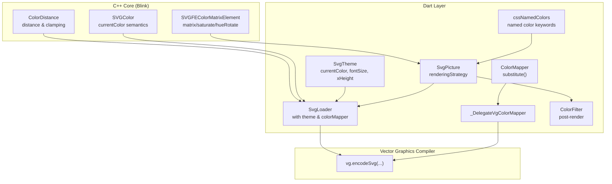
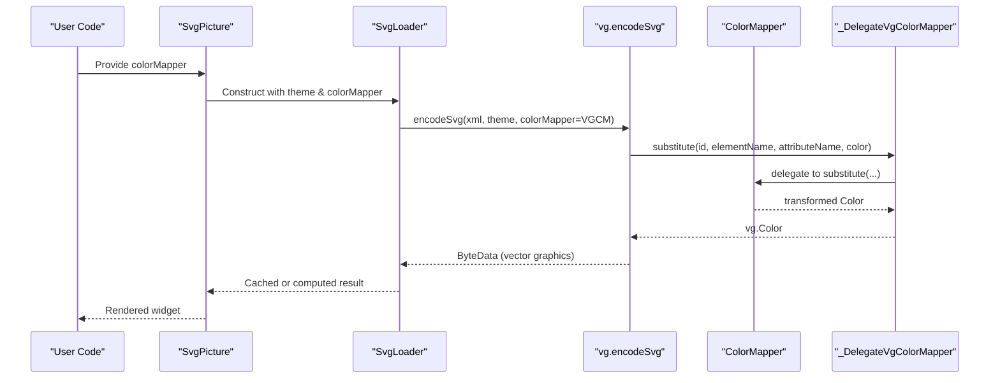
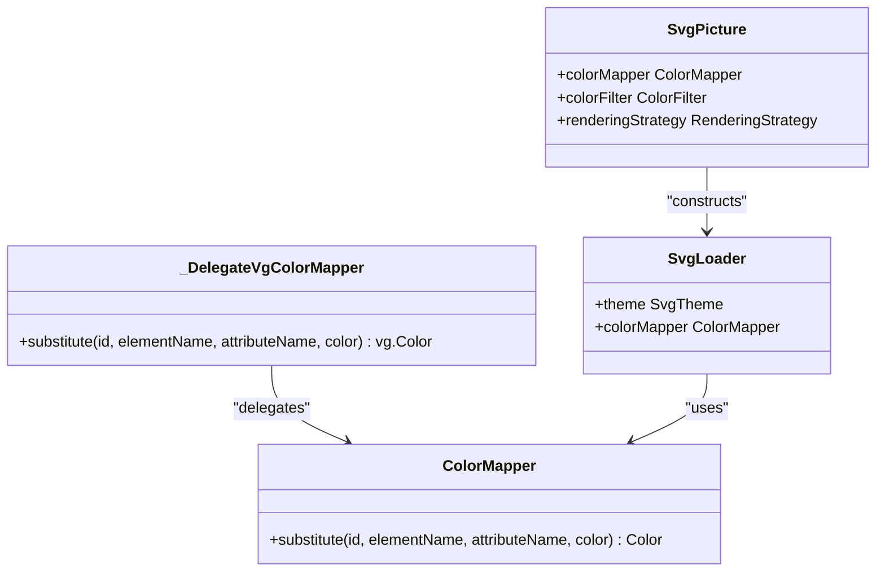
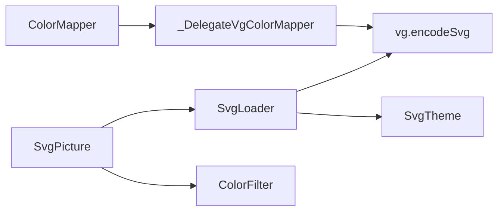

# Color Mapping System

<cite>
**Referenced Files in This Document**
- [loaders.dart](file://lib/src/loaders.dart)
- [svg.dart](file://lib/svg.dart)
- [readme_excerpts.dart](file://example/lib/readme_excerpts.dart)
- [widget_svg_test.dart](file://test/widget_svg_test.dart)
- [css_named_colors.dart](file://lib/src/animation/css_named_colors.dart)
- [svg_filters_color_matrix.dart](file://lib/src/animation/svg_filters_color_matrix.dart)
- [cache.dart](file://lib/src/cache.dart)
- [default_theme.dart](file://lib/src/default_theme.dart)
- [SVGColor.h](file://blink-b87d44f-Source-core-svg/SVGColor.h)
- [SVGColor.cpp](file://blink-b87d44f-Source-core-svg/SVGColor.cpp)
- [SVGFEColorMatrixElement.h](file://blink-b87d44f-Source-core-svg/SVGFEColorMatrixElement.h)
- [ColorDistance.cpp](file://blink-b87d44f-Source-core-svg/ColorDistance.cpp)
</cite>

## Table of Contents
1. [Introduction](#introduction)
2. [Project Structure](#project-structure)
3. [Core Components](#core-components)
4. [Architecture Overview](#architecture-overview)
5. [Detailed Component Analysis](#detailed-component-analysis)
6. [Dependency Analysis](#dependency-analysis)
7. [Performance Considerations](#performance-considerations)
8. [Troubleshooting Guide](#troubleshooting-guide)
9. [Conclusion](#conclusion)
10. [Appendices](#appendices)

## Introduction
This document describes the ColorMapper interface and the color transformation system used by the SVG rendering pipeline. It explains how colors are resolved and transformed during SVG parsing, how built-in strategies and theme-aware behavior integrate with the rendering process, and how to implement custom color mappers for brand theming, accessibility, and dynamic color schemes. It also covers color filter integration, performance characteristics, compatibility with different rendering strategies, color space handling, opacity management, and integration with SVG color attributes.

## Project Structure
The color mapping system spans Dart and C++ layers:
- Dart-side API and integration:
  - ColorMapper abstraction and delegation to vector graphics compiler
  - SvgPicture integration and rendering strategy selection
  - Theme-aware loaders and cache keys
  - Named color keyword support for animations
- C++-side SVG parsing and color model:
  - SVGColor type and currentColor semantics
  - Color distance utilities for color operations
  - Filter primitives for color matrix transformations

**Diagram sources**
- [loaders.dart:80-116](file://lib/src/loaders.dart#L80-L116)
- [svg.dart:57-627](file://lib/svg.dart#L57-L627)
- [css_named_colors.dart:1-155](file://lib/src/animation/css_named_colors.dart#L1-L155)
- [SVGColor.h:34-101](file://blink-b87d44f-Source-core-svg/SVGColor.h#L34-L101)
- [ColorDistance.cpp:49-91](file://blink-b87d44f-Source-core-svg/ColorDistance.cpp#L49-L91)
- [SVGFEColorMatrixElement.h:31-73](file://blink-b87d44f-Source-core-svg/SVGFEColorMatrixElement.h#L31-L73)

**Section sources**
- [loaders.dart:1-467](file://lib/src/loaders.dart#L1-L467)
- [svg.dart:1-627](file://lib/svg.dart#L1-L627)

## Core Components
- ColorMapper: An abstract class that defines a single method to transform parsed colors during SVG decoding. It is designed to be immutable to support caching.
- _DelegateVgColorMapper: Bridges the Dart ColorMapper to the vector graphics compiler’s ColorMapper interface.
- SvgLoader family: Encapsulates theme and colorMapper into cache keys and passes them to the vector graphics encoder.
- SvgPicture: Exposes colorMapper and colorFilter parameters and integrates with rendering strategies.
- SvgTheme: Provides currentColor and font-size-derived metrics used during parsing.
- cssNamedColors: Supplies named color keywords for animated pipelines.
- SVGColor (C++): Represents SVG color values including currentColor semantics.
- ColorDistance (C++): Utilities for color arithmetic and distance calculations.
- SVGFEColorMatrixElement (C++): Defines color matrix filter types supported by the pipeline.

**Section sources**
- [loaders.dart:80-116](file://lib/src/loaders.dart#L80-L116)
- [svg.dart:57-627](file://lib/svg.dart#L57-L627)
- [css_named_colors.dart:1-155](file://lib/src/animation/css_named_colors.dart#L1-L155)
- [SVGColor.h:34-101](file://blink-b87d44f-Source-core-svg/SVGColor.h#L34-L101)
- [ColorDistance.cpp:49-91](file://blink-b87d44f-Source-core-svg/ColorDistance.cpp#L49-L91)
- [SVGFEColorMatrixElement.h:31-73](file://blink-b87d44f-Source-core-svg/SVGFEColorMatrixElement.h#L31-L73)

## Architecture Overview
The color transformation pipeline operates in three stages:
1. Parsing-time substitution: The ColorMapper’s substitute method is invoked for each parsed color, enabling brand theming and dynamic color schemes.
2. Vector graphics encoding: The resulting colors are embedded into the vector graphics binary via the delegate mapper.
3. Rendering-time application: The final image may be further tinted using ColorFilter, and filters like color matrix can be applied.

**Diagram sources**
- [svg.dart:57-627](file://lib/svg.dart#L57-L627)
- [loaders.dart:156-180](file://lib/src/loaders.dart#L156-L180)
- [loaders.dart:96-116](file://lib/src/loaders.dart#L96-L116)

## Detailed Component Analysis

### ColorMapper API and Implementation Patterns
- Purpose: Replace parsed colors during SVG decoding to implement brand themes, accessibility palettes, or dynamic schemes.
- Contract: A single immutable method receives contextual metadata (id, element name, attribute name) plus the original color, and returns a replacement Color.
- Implementation patterns:
  - Identity mapping for passthrough behavior.
  - Conditional mapping based on exact color equality for targeted substitutions.
  - Dynamic mapping using theme-dependent logic (e.g., invert dark/light mode).
  - Accessibility mappings (e.g., high contrast, deuteranopia-safe palettes).

**Diagram sources**
- [loaders.dart:80-116](file://lib/src/loaders.dart#L80-L116)
- [svg.dart:57-627](file://lib/svg.dart#L57-L627)

**Section sources**
- [loaders.dart:80-116](file://lib/src/loaders.dart#L80-L116)
- [readme_excerpts.dart:104-123](file://example/lib/readme_excerpts.dart#L104-L123)
- [widget_svg_test.dart:44-69](file://test/widget_svg_test.dart#L44-L69)

### Theme-Based Color Resolution
- SvgTheme supplies currentColor and font-size-derived metrics (fontSize, xHeight) used during parsing. These influence how currentColor and length units are resolved.
- DefaultSvgTheme wraps SvgTheme for subtree-wide defaults.
- The vector graphics encoder consumes a vg-compatible theme variant.

Practical implications:
- currentColor resolves to the theme’s currentColor during parsing.
- Length units (em/ex) depend on theme-provided metrics.

**Section sources**
- [loaders.dart:17-74](file://lib/src/loaders.dart#L17-L74)
- [default_theme.dart:1-36](file://lib/src/default_theme.dart#L1-L36)
- [loaders.dart:48-54](file://lib/src/loaders.dart#L48-L54)

### Dynamic Color Substitution Examples
- Brand theming: Replace brand-specific colors with alternatives.
- Accessibility: Map colors to safer palettes.
- Dynamic schemes: Switch palettes based on time-of-day or user preference.

Example references:
- Example usage of a custom ColorMapper in the example app.
- Test mapper demonstrating targeted substitutions.

**Section sources**
- [readme_excerpts.dart:104-142](file://example/lib/readme_excerpts.dart#L104-L142)
- [widget_svg_test.dart:44-69](file://test/widget_svg_test.dart#L44-L69)

### Color Filter Integration
- Post-processing: SvgPicture supports a ColorFilter parameter that applies a Flutter ColorFilter to the final rendered image.
- Use cases: Global tinting, sepia, monochrome, or other effects after color substitution.
- Interaction with ColorMapper: ColorMapper runs during parsing; ColorFilter runs post-render.

Compatibility:
- Works with all rendering strategies exposed by SvgPicture.

**Section sources**
- [svg.dart:57-627](file://lib/svg.dart#L57-L627)

### Built-in Color Mapping Strategies
- Named color keywords: cssNamedColors provides a comprehensive map of CSS/SVG named colors for animated pipelines.
- Color matrix filters: SVGFEColorMatrixElement defines supported matrix types (matrix, saturate, hueRotate, luminanceToAlpha), enabling programmatic color adjustments.

Integration points:
- Named colors can be used alongside ColorMapper for consistent theming.
- Color matrix filters complement ColorMapper by applying additional transformations during rendering.

**Section sources**
- [css_named_colors.dart:1-155](file://lib/src/animation/css_named_colors.dart#L1-L155)
- [SVGFEColorMatrixElement.h:31-73](file://blink-b87d44f-Source-core-svg/SVGFEColorMatrixElement.h#L31-L73)
- [svg_filters_color_matrix.dart:56-202](file://lib/src/animation/svg_filters_color_matrix.dart#L56-L202)

### Color Space Handling and Opacity Management
- Parsing-time colors: Colors are represented as Flutter Color values. The vector graphics encoder converts them to its internal color representation.
- Opacity: Managed per-color and can be influenced by filter primitives (e.g., luminanceToAlpha) and ColorFilter.
- ColorDistance utilities: Provide arithmetic operations and distance calculations in the parsed color space.

**Section sources**
- [loaders.dart:96-116](file://lib/src/loaders.dart#L96-L116)
- [ColorDistance.cpp:49-91](file://blink-b87d44f-Source-core-svg/ColorDistance.cpp#L49-L91)
- [svg_filters_color_matrix.dart:191-200](file://lib/src/animation/svg_filters_color_matrix.dart#L191-L200)

### Compatibility with Rendering Strategies
- SvgPicture exposes a renderingStrategy parameter. ColorMapper and ColorFilter operate consistently across strategies, with ColorFilter applying after rasterization.

**Section sources**
- [svg.dart:57-627](file://lib/svg.dart#L57-L627)

## Dependency Analysis
The color mapping system exhibits clear separation of concerns:
- ColorMapper is a pure Dart abstraction with no runtime dependencies except Flutter’s Color.
- _DelegateVgColorMapper bridges to the vector graphics compiler’s ColorMapper interface.
- SvgLoader composes theme and colorMapper into cache keys to ensure correctness across different contexts.
- SvgPicture exposes both ColorMapper and ColorFilter, enabling layered color control.

**Diagram sources**
- [loaders.dart:80-116](file://lib/src/loaders.dart#L80-L116)
- [svg.dart:57-627](file://lib/svg.dart#L57-L627)

**Section sources**
- [loaders.dart:118-194](file://lib/src/loaders.dart#L118-L194)
- [cache.dart:1-111](file://lib/src/cache.dart#L1-L111)

## Performance Considerations
- Immutability: ColorMapper is annotated as immutable to enable safe caching. This reduces recomputation and improves performance.
- Cache keys: SvgCacheKey includes theme and colorMapper, ensuring that different themes or mappers do not share cached results unintentionally.
- Isolation: Encoding occurs in an isolate, keeping UI thread responsive.
- Filter cost: Color matrix filters and ColorFilter add GPU/CPU work; use judiciously and prefer targeted application.

Recommendations:
- Keep ColorMapper logic fast and deterministic.
- Prefer coarse-grained substitutions to minimize branching.
- Leverage theme-awareness to reduce repeated computations.

**Section sources**
- [loaders.dart:80-94](file://lib/src/loaders.dart#L80-L94)
- [loaders.dart:196-230](file://lib/src/loaders.dart#L196-L230)
- [cache.dart:1-111](file://lib/src/cache.dart#L1-L111)

## Troubleshooting Guide
Common issues and resolutions:
- Colors not changing:
  - Verify that ColorMapper.substitute returns a different color for the target inputs.
  - Confirm that the color attribute being mapped corresponds to the element/attribute name passed to substitute.
- Theme mismatch:
  - Ensure SvgTheme is provided at the loader level or via DefaultSvgTheme to match expectations.
- Unexpected caching:
  - Changing theme or ColorMapper affects cache keys; if nothing changes visually, confirm cache key composition includes both.
- Post-render tint not visible:
  - ColorFilter applies after rasterization; ensure it targets the intended paints and blending mode.

**Section sources**
- [loaders.dart:196-230](file://lib/src/loaders.dart#L196-L230)
- [default_theme.dart:1-36](file://lib/src/default_theme.dart#L1-L36)
- [widget_svg_test.dart:44-69](file://test/widget_svg_test.dart#L44-L69)

## Conclusion
The ColorMapper interface provides a flexible, immutable mechanism for transforming colors during SVG parsing, enabling robust theming, accessibility, and dynamic schemes. Combined with SvgTheme, SvgPicture’s ColorFilter, and filter primitives, developers can implement sophisticated color workflows that remain efficient and compatible across rendering strategies.

## Appendices

### API Reference Summary
- ColorMapper
  - Method: substitute(id, elementName, attributeName, color) -> Color
  - Notes: Immutable; used by SvgLoader and vector graphics encoder.
- SvgLoader
  - Fields: theme, colorMapper
  - Behavior: Includes theme and colorMapper in cache keys.
- SvgPicture
  - Parameters: colorMapper, colorFilter, renderingStrategy
  - Behavior: Applies ColorFilter post-render; delegates color substitution to ColorMapper.

**Section sources**
- [loaders.dart:80-116](file://lib/src/loaders.dart#L80-L116)
- [svg.dart:57-627](file://lib/svg.dart#L57-L627)