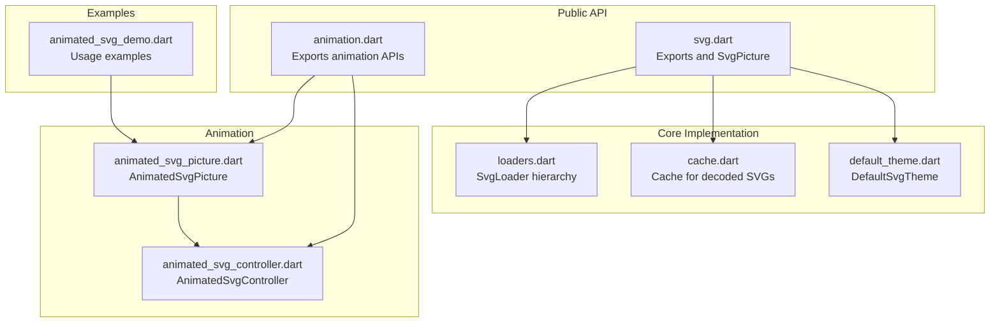
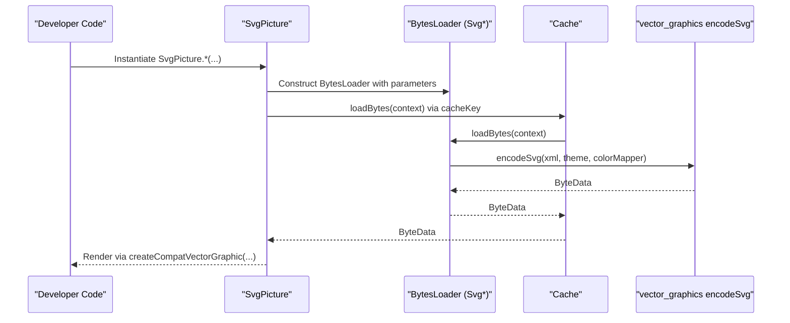
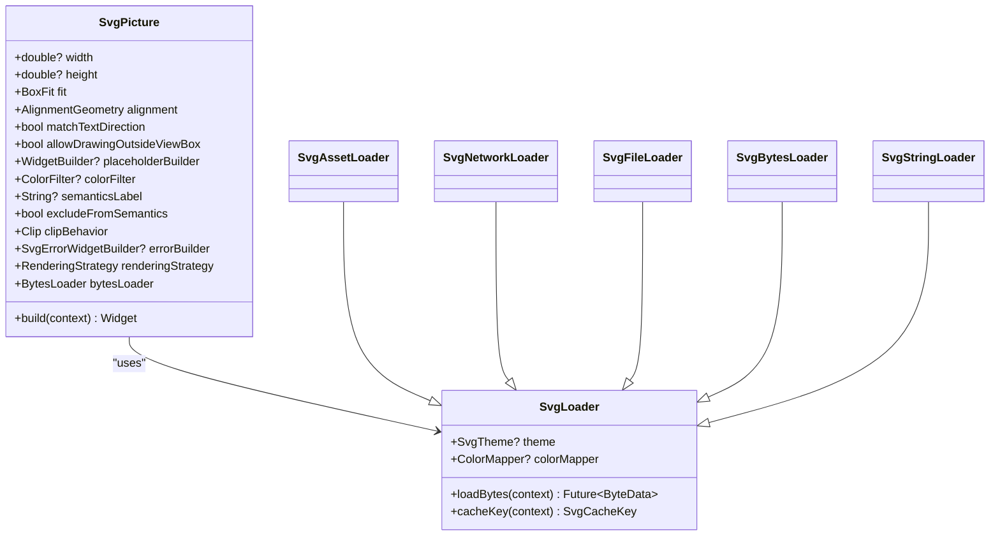
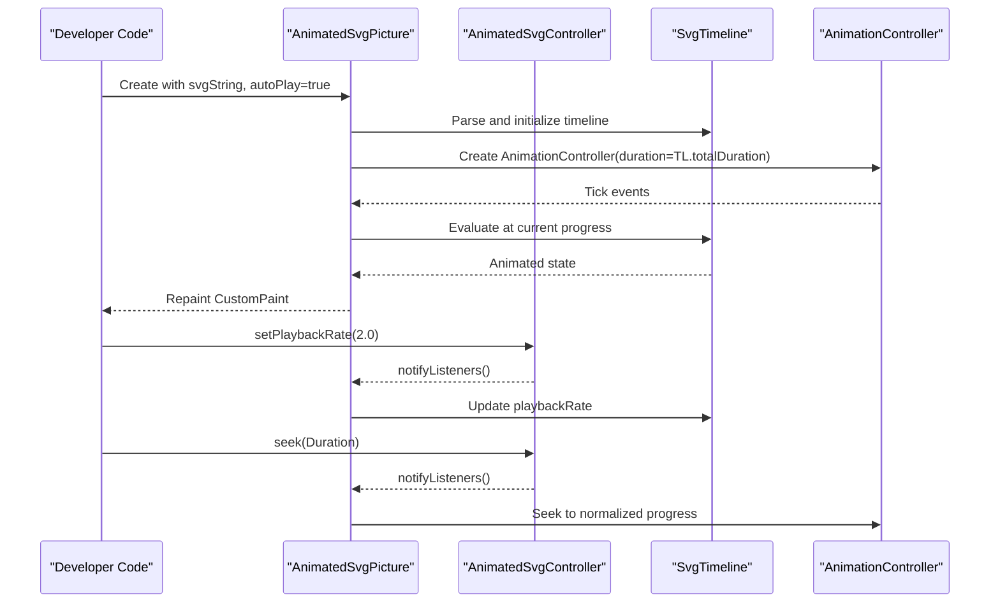
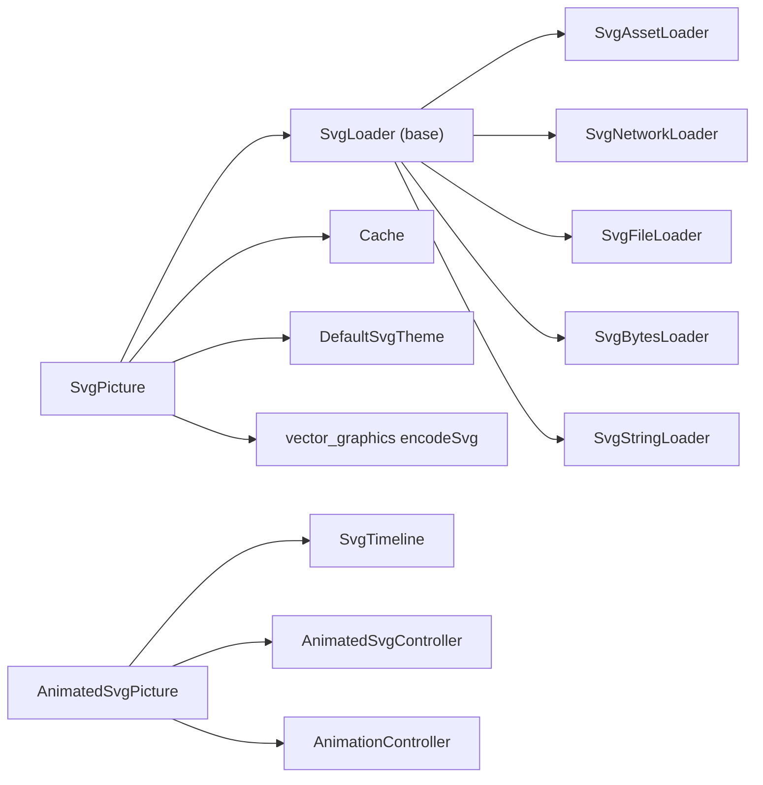

# Core Widgets

<cite>
**Referenced Files in This Document**
- [svg.dart](file://lib/svg.dart)
- [loaders.dart](file://lib/src/loaders.dart)
- [cache.dart](file://lib/src/cache.dart)
- [default_theme.dart](file://lib/src/default_theme.dart)
- [animated_svg_picture.dart](file://lib/src/animation/animated_svg_picture.dart)
- [animated_svg_controller.dart](file://lib/src/animation/animated_svg_controller.dart)
- [animation.dart](file://lib/src/animation.dart)
- [animated_svg_demo.dart](file://example/lib/animated_svg_demo.dart)
</cite>

## Table of Contents
1. [Introduction](#introduction)
2. [Project Structure](#project-structure)
3. [Core Components](#core-components)
4. [Architecture Overview](#architecture-overview)
5. [Detailed Component Analysis](#detailed-component-analysis)
6. [Dependency Analysis](#dependency-analysis)
7. [Performance Considerations](#performance-considerations)
8. [Troubleshooting Guide](#troubleshooting-guide)
9. [Conclusion](#conclusion)

## Introduction
This document provides API documentation for the core widgets that render SVG content in Flutter: SvgPicture and AnimatedSvgPicture. It covers all constructor variants for SvgPicture, including SvgPicture.asset(), SvgPicture.network(), SvgPicture.file(), SvgPicture.memory(), and SvgPicture.string(). It also documents SvgPicture properties, error handling, and rendering strategy. For AnimatedSvgPicture, it explains animation-specific properties, controller integration, playback controls, and runtime tracing. The goal is to help developers integrate SVG rendering efficiently and reliably across different data sources and animation scenarios.

## Project Structure
The core APIs live in the main library entry and supporting source modules:
- Main exports and SvgPicture class: [svg.dart](file://lib/svg.dart)
- Loader implementations and themes: [loaders.dart](file://lib/src/loaders.dart)
- Decoded SVG cache: [cache.dart](file://lib/src/cache.dart)
- Default theme mechanism: [default_theme.dart](file://lib/src/default_theme.dart)
- Animated widgets and controller: [animated_svg_picture.dart](file://lib/src/animation/animated_svg_picture.dart), [animated_svg_controller.dart](file://lib/src/animation/animated_svg_controller.dart)
- Animation module exports: [animation.dart](file://lib/src/animation.dart)
- Example usage of AnimatedSvgPicture: [animated_svg_demo.dart](file://example/lib/animated_svg_demo.dart)

**Diagram sources**
- [svg.dart:1-627](file://lib/svg.dart#L1-L627)
- [loaders.dart:1-467](file://lib/src/loaders.dart#L1-L467)
- [cache.dart:1-111](file://lib/src/cache.dart#L1-L111)
- [default_theme.dart:1-36](file://lib/src/default_theme.dart#L1-L36)
- [animated_svg_picture.dart:1-359](file://lib/src/animation/animated_svg_picture.dart#L1-L359)
- [animated_svg_controller.dart:1-131](file://lib/src/animation/animated_svg_controller.dart#L1-L131)
- [animation.dart:1-31](file://lib/src/animation.dart#L1-L31)
- [animated_svg_demo.dart:1-294](file://example/lib/animated_svg_demo.dart#L1-L294)

**Section sources**
- [svg.dart:1-627](file://lib/svg.dart#L1-L627)
- [loaders.dart:1-467](file://lib/src/loaders.dart#L1-L467)
- [cache.dart:1-111](file://lib/src/cache.dart#L1-L111)
- [default_theme.dart:1-36](file://lib/src/default_theme.dart#L1-L36)
- [animated_svg_picture.dart:1-359](file://lib/src/animation/animated_svg_picture.dart#L1-L359)
- [animated_svg_controller.dart:1-131](file://lib/src/animation/animated_svg_controller.dart#L1-L131)
- [animation.dart:1-31](file://lib/src/animation.dart#L1-L31)
- [animated_svg_demo.dart:1-294](file://example/lib/animated_svg_demo.dart#L1-L294)

## Core Components
This section focuses on the primary widgets and their core capabilities.

- SvgPicture
  - Purpose: Renders SVG content from various sources (asset, network, file, memory buffer, string).
  - Key constructor variants:
    - SvgPicture.asset(assetName, {bundle, package, ...})
    - SvgPicture.network(url, {headers, httpClient, ...})
    - SvgPicture.file(File, {...})
    - SvgPicture.memory(Uint8List, {...})
    - SvgPicture.string(String, {...})
  - Shared parameters include width, height, fit, alignment, colorFilter, placeholderBuilder, semanticsLabel, excludeFromSemantics, clipBehavior, errorBuilder, renderingStrategy, and flags like matchTextDirection and allowDrawingOutsideViewBox.
  - Rendering strategy is delegated to vector graphics compatibility layer via createCompatVectorGraphic.

- AnimatedSvgPicture
  - Purpose: Renders animated SVGs with SMIL/CSS animation support.
  - Constructor variants:
    - AnimatedSvgPicture.string(svgString, {...})
  - Animation controls: autoPlay, playbackRate, initialTime, controller (AnimatedSvgController), onTrace, traceFrameTicks.
  - Playback methods exposed by the widget: play(), pause(), reset(), seekTo(time).

- AnimatedSvgController
  - Purpose: Programmatic control over animation playback.
  - Capabilities: pause/resume, togglePlayPause, seek(time), setPlaybackRate(rate), reverse/forward, toggleDirection, restart, pendingSeek.

**Section sources**
- [svg.dart:57-627](file://lib/svg.dart#L57-L627)
- [animated_svg_picture.dart:108-295](file://lib/src/animation/animated_svg_picture.dart#L108-L295)
- [animated_svg_controller.dart:25-131](file://lib/src/animation/animated_svg_controller.dart#L25-L131)

## Architecture Overview
SvgPicture delegates to a BytesLoader subclass appropriate for the source. The loader prepares the SVG content and defers parsing to an isolate-backed encoder, producing a vector graphics binary stream cached by the Cache. AnimatedSvgPicture parses and executes SMIL/CSS animations using a timeline and an AnimationController when autoPlay is enabled or when a controller is supplied.

**Diagram sources**
- [svg.dart:543-560](file://lib/svg.dart#L543-L560)
- [loaders.dart:156-187](file://lib/src/loaders.dart#L156-L187)
- [cache.dart:65-93](file://lib/src/cache.dart#L65-L93)

**Section sources**
- [svg.dart:543-560](file://lib/svg.dart#L543-L560)
- [loaders.dart:156-187](file://lib/src/loaders.dart#L156-L187)
- [cache.dart:65-93](file://lib/src/cache.dart#L65-L93)

## Detailed Component Analysis

### SvgPicture API Reference
SvgPicture is a StatelessWidget that renders SVGs from multiple sources. It supports extensive customization via constructor parameters and properties.

- Constructors and parameters
  - SvgPicture.asset(assetName, {bundle, package, width, height, fit, alignment, matchTextDirection, allowDrawingOutsideViewBox, placeholderBuilder, semanticsLabel, excludeFromSemantics, clipBehavior, errorBuilder, theme, colorMapper, colorFilter, colorBlendMode, cacheColorFilter, renderingStrategy})
  - SvgPicture.network(url, {headers, width, height, fit, alignment, matchTextDirection, allowDrawingOutsideViewBox, placeholderBuilder, semanticsLabel, excludeFromSemantics, clipBehavior, errorBuilder, theme, colorMapper, httpClient, cacheColorFilter, renderingStrategy})
  - SvgPicture.file(File, {width, height, fit, alignment, matchTextDirection, allowDrawingOutsideViewBox, placeholderBuilder, semanticsLabel, excludeFromSemantics, clipBehavior, errorBuilder, theme, colorMapper, cacheColorFilter, renderingStrategy})
  - SvgPicture.memory(Uint8List, {width, height, fit, alignment, matchTextDirection, allowDrawingOutsideViewBox, placeholderBuilder, semanticsLabel, excludeFromSemantics, clipBehavior, errorBuilder, theme, colorMapper, cacheColorFilter, renderingStrategy})
  - SvgPicture.string(String, {width, height, fit, alignment, matchTextDirection, allowDrawingOutsideViewBox, placeholderBuilder, semanticsLabel, excludeFromSemantics, clipBehavior, errorBuilder, theme, colorMapper, cacheColorFilter, renderingStrategy})

- Properties
  - width: double? — Preferred width; if null, layout depends on parent constraints.
  - height: double? — Preferred height; if null, layout depends on parent constraints.
  - fit: BoxFit — How to inscribe the picture into the allocated space.
  - alignment: AlignmentGeometry — Alignment within the layout bounds.
  - matchTextDirection: bool — Flip horizontally in RTL contexts.
  - allowDrawingOutsideViewBox: bool — Controls clipping to viewBox.
  - placeholderBuilder: WidgetBuilder? — Placeholder during load/decode.
  - colorFilter: ColorFilter? — Applied to paints.
  - semanticsLabel: String? — Accessibility label.
  - excludeFromSemantics: bool — Exclude from semantics tree.
  - clipBehavior: Clip — Clipping behavior.
  - errorBuilder: SvgErrorWidgetBuilder? — Widget shown on load failure.
  - renderingStrategy: RenderingStrategy — Rendering strategy selection.
  - bytesLoader: BytesLoader — Underlying loader instance.

- Behavior
  - build() delegates to createCompatVectorGraphic(...) with the configured parameters.
  - debugFillProperties(...) adds diagnostics for inspection.

- Error handling patterns
  - errorBuilder is invoked when loading fails.
  - Network loader uses an http.Client (customizable) and closes it if created internally.
  - Asset resolution accounts for DefaultAssetBundle and package scoping.

- Performance considerations
  - All loaders defer parsing to an isolate-backed encoder and cache results keyed by theme and optional colorMapper.
  - Cache.maximumSize controls eviction; setting to zero clears the cache.
  - Using tight layout constraints (width/height) prevents layout shifts during load.

- Usage patterns
  - Asset: Provide assetName and optionally package/bundle.
  - Network: Provide url and optional headers; consider httpClient for reuse.
  - File: Provide a File handle; Android may require storage permissions.
  - Memory/String: Provide raw bytes or string; ensure proper encoding.

- Examples
  - Asset: [SvgPicture.asset(...):180-211](file://lib/svg.dart#L180-L211)
  - Network: [SvgPicture.network(...):245-276](file://lib/svg.dart#L245-L276)
  - File: [SvgPicture.file(...):308-335](file://lib/svg.dart#L308-L335)
  - Memory: [SvgPicture.memory(...):364-391](file://lib/svg.dart#L364-L391)
  - String: [SvgPicture.string(...):420-447](file://lib/svg.dart#L420-L447)

**Diagram sources**
- [svg.dart:57-627](file://lib/svg.dart#L57-L627)
- [loaders.dart:121-466](file://lib/src/loaders.dart#L121-L466)

**Section sources**
- [svg.dart:57-627](file://lib/svg.dart#L57-L627)
- [loaders.dart:121-466](file://lib/src/loaders.dart#L121-L466)
- [cache.dart:1-111](file://lib/src/cache.dart#L1-L111)
- [default_theme.dart:1-36](file://lib/src/default_theme.dart#L1-L36)

### AnimatedSvgPicture API Reference
AnimatedSvgPicture renders animated SVGs and exposes programmatic control.

- Constructors and parameters
  - AnimatedSvgPicture.string(svgString, {width, height, fit, alignment, backgroundColor, playbackRate, autoPlay, initialTime, controller, onTrace, traceFrameTicks})

- Properties and methods
  - width/height/fit/alignment: Layout and scaling.
  - backgroundColor: Canvas background color.
  - playbackRate: Speed multiplier (must be positive).
  - autoPlay: Automatically start playback.
  - initialTime: Initial seek time for testing/demo.
  - controller: AnimatedSvgController for external control.
  - onTrace: Optional callback for runtime diagnostics.
  - traceFrameTicks: Enable per-frame trace events (high volume).
  - Methods: play(), pause(), reset(), seekTo(time).

- Lifecycle and control
  - Initializes and parses the SVG document and timeline.
  - Subscribes to controller changes; updates playback accordingly.
  - Supports pointer and hover events for event-driven animations.

- Examples
  - Basic usage: [AnimatedSvgPicture.string(...):110-124](file://lib/src/animation/animated_svg_picture.dart#L110-L124)
  - Example app: [animated_svg_demo.dart:280-285](file://example/lib/animated_svg_demo.dart#L280-L285)

**Diagram sources**
- [animated_svg_picture.dart:166-295](file://lib/src/animation/animated_svg_picture.dart#L166-L295)
- [animated_svg_controller.dart:25-131](file://lib/src/animation/animated_svg_controller.dart#L25-L131)

**Section sources**
- [animated_svg_picture.dart:108-295](file://lib/src/animation/animated_svg_picture.dart#L108-L295)
- [animated_svg_controller.dart:25-131](file://lib/src/animation/animated_svg_controller.dart#L25-L131)
- [animated_svg_demo.dart:280-285](file://example/lib/animated_svg_demo.dart#L280-L285)

### Parameter Specifications and Return Types
- SvgPicture.asset
  - Parameters: assetName (String), bundle (AssetBundle?), package (String?), plus all shared SvgPicture parameters.
  - Returns: SvgPicture instance with bytesLoader of type SvgAssetLoader.
- SvgPicture.network
  - Parameters: url (String), headers (Map<String, String>?), httpClient (http.Client?), plus all shared SvgPicture parameters.
  - Returns: SvgPicture instance with bytesLoader of type SvgNetworkLoader.
- SvgPicture.file
  - Parameters: file (File), plus all shared SvgPicture parameters.
  - Returns: SvgPicture instance with bytesLoader of type SvgFileLoader.
- SvgPicture.memory
  - Parameters: bytes (Uint8List), plus all shared SvgPicture parameters.
  - Returns: SvgPicture instance with bytesLoader of type SvgBytesLoader.
- SvgPicture.string
  - Parameters: string (String), plus all shared SvgPicture parameters.
  - Returns: SvgPicture instance with bytesLoader of type SvgStringLoader.
- AnimatedSvgPicture.string
  - Parameters: svgString (String), plus backgroundColor, playbackRate, autoPlay, initialTime, controller, onTrace, traceFrameTicks.
  - Returns: StatefulWidget with internal state managing timeline and AnimationController.
- AnimatedSvgController
  - Methods: pause(), resume(), togglePlayPause(), seek(time), setPlaybackRate(rate), reverse(), forward(), toggleDirection(), restart(), clearPendingSeek().
  - Getters: isPaused, playbackRate, isReversed, pendingSeek.

**Section sources**
- [svg.dart:180-447](file://lib/svg.dart#L180-L447)
- [animated_svg_picture.dart:110-164](file://lib/src/animation/animated_svg_picture.dart#L110-L164)
- [animated_svg_controller.dart:25-131](file://lib/src/animation/animated_svg_controller.dart#L25-L131)

### Error Handling Patterns
- SvgPicture
  - errorBuilder: Provide a widget to display when loading or decoding fails.
  - Network loader: Uses http.Client; if an internal client is created, it is closed after the request.
  - Asset resolution: Respects DefaultAssetBundle and package scoping; missing assets will surface as errors.
- AnimatedSvgPicture
  - No dedicated errorBuilder; rely on higher-level error widgets or app-level error handling around the widget.
  - Tracing: onTrace callback receives structured events for diagnostics; traceFrameTicks enables high-volume frame ticks.

**Section sources**
- [svg.dart:528-529](file://lib/svg.dart#L528-L529)
- [loaders.dart:435-446](file://lib/src/loaders.dart#L435-L446)
- [animated_svg_picture.dart:156-160](file://lib/src/animation/animated_svg_picture.dart#L156-L160)

### Performance Considerations
- Caching
  - All loaders use Cache with a cacheKey that includes theme and optional colorMapper to avoid mixing incompatible caches.
  - Cache.maximumSize defaults to 100; adjust based on memory budget and usage patterns.
- Isolate-based parsing
  - Parsing occurs in an isolate to keep UI responsive; results are returned as ByteData.
- Rendering strategy
  - renderingStrategy balances flexibility and performance; defaults to picture mode.
- Layout stability
  - Specify width and height or rely on tight layout constraints to prevent layout shifts during load.

**Section sources**
- [cache.dart:65-93](file://lib/src/cache.dart#L65-L93)
- [loaders.dart:156-187](file://lib/src/loaders.dart#L156-L187)
- [svg.dart:534-540](file://lib/svg.dart#L534-L540)

### Usage Examples
- SvgPicture.asset
  - Example: [SvgPicture.asset(...):180-211](file://lib/svg.dart#L180-L211)
- SvgPicture.network
  - Example: [SvgPicture.network(...):245-276](file://lib/svg.dart#L245-L276)
- SvgPicture.file
  - Example: [SvgPicture.file(...):308-335](file://lib/svg.dart#L308-L335)
- SvgPicture.memory
  - Example: [SvgPicture.memory(...):364-391](file://lib/svg.dart#L364-L391)
- SvgPicture.string
  - Example: [SvgPicture.string(...):420-447](file://lib/svg.dart#L420-L447)
- AnimatedSvgPicture.string
  - Example: [animated_svg_demo.dart:280-285](file://example/lib/animated_svg_demo.dart#L280-L285)

**Section sources**
- [svg.dart:180-447](file://lib/svg.dart#L180-L447)
- [animated_svg_demo.dart:280-285](file://example/lib/animated_svg_demo.dart#L280-L285)

## Dependency Analysis
SvgPicture relies on a loader hierarchy that encapsulates source-specific logic and defers parsing to an isolate-backed encoder. The Cache ensures decoded results are reused across instances with compatible keys. AnimatedSvgPicture composes a timeline and AnimationController for playback, integrating with the controller for programmatic control.

**Diagram sources**
- [svg.dart:57-627](file://lib/svg.dart#L57-L627)
- [loaders.dart:121-466](file://lib/src/loaders.dart#L121-L466)
- [cache.dart:1-111](file://lib/src/cache.dart#L1-L111)
- [default_theme.dart:1-36](file://lib/src/default_theme.dart#L1-L36)
- [animated_svg_picture.dart:108-295](file://lib/src/animation/animated_svg_picture.dart#L108-L295)
- [animated_svg_controller.dart:25-131](file://lib/src/animation/animated_svg_controller.dart#L25-L131)

**Section sources**
- [svg.dart:57-627](file://lib/svg.dart#L57-L627)
- [loaders.dart:121-466](file://lib/src/loaders.dart#L121-L466)
- [cache.dart:1-111](file://lib/src/cache.dart#L1-L111)
- [default_theme.dart:1-36](file://lib/src/default_theme.dart#L1-L36)
- [animated_svg_picture.dart:108-295](file://lib/src/animation/animated_svg_picture.dart#L108-L295)
- [animated_svg_controller.dart:25-131](file://lib/src/animation/animated_svg_controller.dart#L25-L131)

## Performance Considerations
- Prefer tight layout constraints (width/height) to avoid layout shifts during load.
- Use SvgPicture.network with a shared http.Client to reduce connection overhead.
- Tune Cache.maximumSize to balance memory usage and hit rates.
- For AnimatedSvgPicture, avoid enabling traceFrameTicks in production due to high event volume.
- Use colorFilter judiciously; heavy filters can impact rendering performance.

[No sources needed since this section provides general guidance]

## Troubleshooting Guide
- Layout shifts during load
  - Cause: Missing width/height and dynamic SVG dimensions.
  - Fix: Set width and height or constrain the parent tightly.
- Network failures
  - Cause: Invalid URL, network errors, or server issues.
  - Fix: Provide errorBuilder; consider custom httpClient; verify headers.
- Asset not found
  - Cause: Incorrect assetName or package scoping.
  - Fix: Use package parameter for package assets; ensure pubspec includes the asset.
- Permission errors (Android file)
  - Cause: READ_EXTERNAL_STORAGE not granted.
  - Fix: Request permission at runtime if needed.
- Animation not playing
  - Cause: autoPlay disabled or controller paused.
  - Fix: Set autoPlay=true or call controller.resume(); ensure playbackRate > 0.
- Excessive tracing logs
  - Cause: traceFrameTicks enabled.
  - Fix: Disable traceFrameTicks in production.

**Section sources**
- [svg.dart:59-71](file://lib/svg.dart#L59-L71)
- [loaders.dart:435-446](file://lib/src/loaders.dart#L435-L446)
- [animated_svg_picture.dart:156-160](file://lib/src/animation/animated_svg_picture.dart#L156-L160)

## Conclusion
SvgPicture offers a flexible, high-performance way to render SVGs from multiple sources with robust caching and accessibility features. AnimatedSvgPicture extends this capability with SMIL/CSS animation support and a powerful controller for programmatic playback. By following the recommended patterns—tight layout constraints, appropriate caching, and controlled tracing—developers can deliver smooth, accessible SVG experiences across diverse Flutter applications.