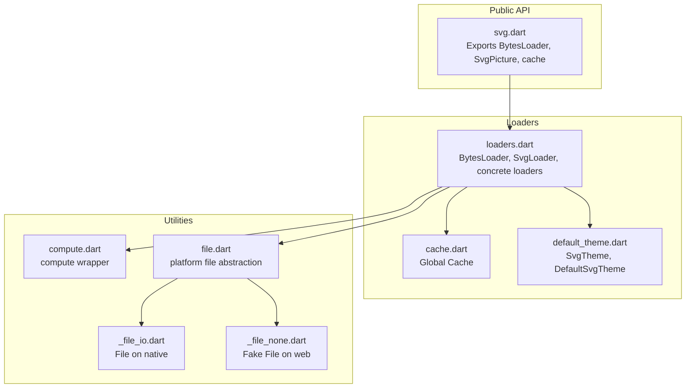
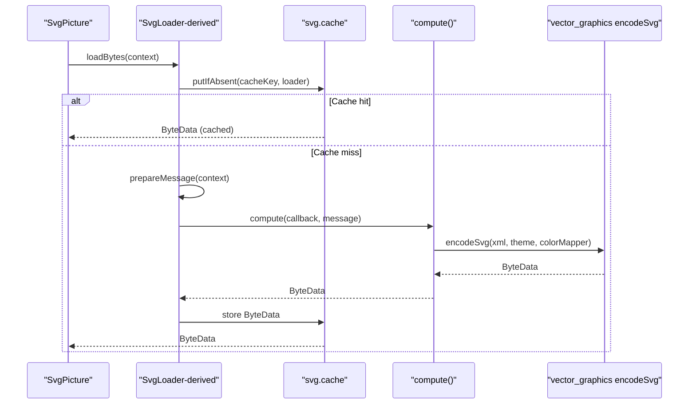
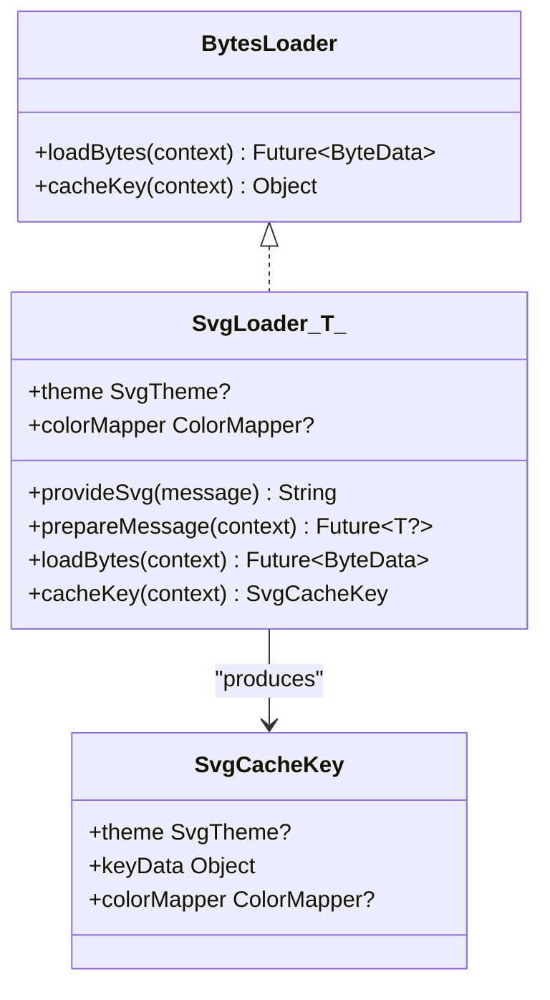
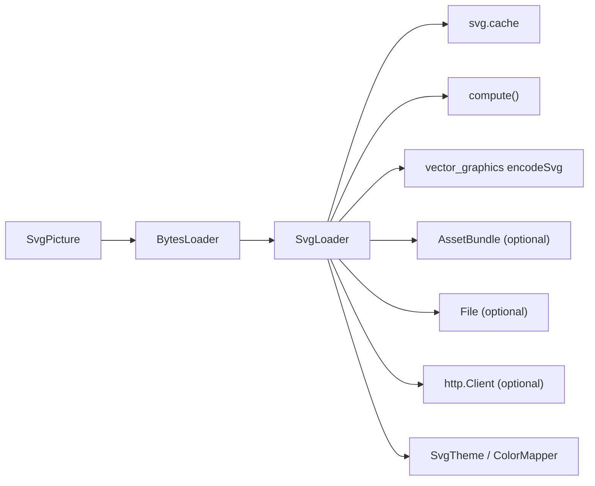

# Loading Strategies

<cite>
**Referenced Files in This Document**
- [loaders.dart](file://lib/src/loaders.dart)
- [cache.dart](file://lib/src/cache.dart)
- [svg.dart](file://lib/svg.dart)
- [compute.dart](file://lib/src/utilities/compute.dart)
- [file.dart](file://lib/src/utilities/file.dart)
- [_file_io.dart](file://lib/src/utilities/_file_io.dart)
- [_file_none.dart](file://lib/src/utilities/_file_none.dart)
- [default_theme.dart](file://lib/src/default_theme.dart)
- [loaders_test.dart](file://test/loaders_test.dart)
</cite>

## Table of Contents
1. [Introduction](#introduction)
2. [Project Structure](#project-structure)
3. [Core Components](#core-components)
4. [Architecture Overview](#architecture-overview)
5. [Detailed Component Analysis](#detailed-component-analysis)
6. [Dependency Analysis](#dependency-analysis)
7. [Performance Considerations](#performance-considerations)
8. [Troubleshooting Guide](#troubleshooting-guide)
9. [Conclusion](#conclusion)

## Introduction
This document describes the loading strategies for SVG content in the project, focusing on the BytesLoader abstraction and its concrete implementations. It explains how to choose the appropriate loader for different sources (assets, network, files, bytes, strings), how to configure themes and color mappers, and how caching works. It also covers performance characteristics, memory management, and platform-specific considerations for file access. Finally, it provides guidance for creating custom loaders and integrating with third-party storage systems.

## Project Structure
The loading strategy logic resides primarily in the src directory:
- loaders.dart defines the BytesLoader abstraction, the SvgLoader base class, and concrete loaders (SvgAssetLoader, SvgNetworkLoader, SvgFileLoader, SvgBytesLoader, SvgStringLoader).
- cache.dart implements the global cache used by loaders to avoid redundant work.
- svg.dart exposes the public API and integrates loaders into SvgPicture widgets.
- utilities/compute.dart provides a compute wrapper that runs heavy tasks in isolates except in tests/web.
- utilities/file.dart and platform-specific files abstract file operations across platforms.
- default_theme.dart provides SvgTheme and DefaultSvgTheme for inherited theming.
- test/loaders_test.dart validates caching behavior and loader specifics.

**Diagram sources**
- [svg.dart:12-17](file://lib/svg.dart#L12-L17)
- [loaders.dart:118-194](file://lib/src/loaders.dart#L118-L194)
- [cache.dart:4-110](file://lib/src/cache.dart#L4-L110)
- [default_theme.dart:5-35](file://lib/src/default_theme.dart#L5-L35)
- [compute.dart:21-26](file://lib/src/utilities/compute.dart#L21-L26)
- [file.dart:1-2](file://lib/src/utilities/file.dart#L1-L2)
- [_file_io.dart:1-2](file://lib/src/utilities/_file_io.dart#L1-L2)
- [_file_none.dart:3-16](file://lib/src/utilities/_file_none.dart#L3-L16)

**Section sources**
- [svg.dart:12-17](file://lib/svg.dart#L12-L17)
- [loaders.dart:118-194](file://lib/src/loaders.dart#L118-L194)
- [cache.dart:4-110](file://lib/src/cache.dart#L4-L110)
- [default_theme.dart:5-35](file://lib/src/default_theme.dart#L5-L35)
- [compute.dart:21-26](file://lib/src/utilities/compute.dart#L21-L26)
- [file.dart:1-2](file://lib/src/utilities/file.dart#L1-L2)
- [_file_io.dart:1-2](file://lib/src/utilities/_file_io.dart#L1-L2)
- [_file_none.dart:3-16](file://lib/src/utilities/_file_none.dart#L3-L16)

## Core Components
- BytesLoader: The interface used by SvgPicture to obtain decoded SVG bytes. It defines loadBytes and cacheKey methods.
- SvgLoader<T>: An abstract base class extending BytesLoader that:
  - Accepts optional SvgTheme and ColorMapper.
  - Uses compute to run encoding in an isolate.
  - Integrates with svg.cache via cacheKey to deduplicate work.
- Concrete loaders:
  - SvgStringLoader: loads from a String.
  - SvgBytesLoader: loads from UTF-8 encoded Uint8List.
  - SvgFileLoader: loads from a File (platform-aware).
  - SvgAssetLoader: loads from an AssetBundle (with optional package).
  - SvgNetworkLoader: loads from a URL with optional headers and optional httpClient.

Key configuration options:
- theme: SvgTheme for currentColor and font sizing.
- colorMapper: Optional ColorMapper for color substitution during parsing.
- assetBundle and packageName: For asset resolution.
- headers: HTTP headers for network requests.
- httpClient: Optional http.Client for network loader.

Usage scenarios:
- String/Bytes: in-memory content.
- File: local file access (permissions vary by platform).
- Asset: bundled assets with optional package scoping.
- Network: remote SVGs with optional custom headers and client.

**Section sources**
- [loaders.dart:118-194](file://lib/src/loaders.dart#L118-L194)
- [loaders.dart:232-280](file://lib/src/loaders.dart#L232-L280)
- [loaders.dart:282-307](file://lib/src/loaders.dart#L282-L307)
- [loaders.dart:341-413](file://lib/src/loaders.dart#L341-L413)
- [loaders.dart:415-466](file://lib/src/loaders.dart#L415-L466)
- [svg.dart:495-496](file://lib/svg.dart#L495-L496)

## Architecture Overview
The loading pipeline is designed around isolates and caching to maximize performance and minimize UI thread work.

**Diagram sources**
- [svg.dart:543-560](file://lib/svg.dart#L543-L560)
- [loaders.dart:156-187](file://lib/src/loaders.dart#L156-L187)
- [cache.dart:65-93](file://lib/src/cache.dart#L65-L93)
- [compute.dart:21-26](file://lib/src/utilities/compute.dart#L21-L26)

**Section sources**
- [svg.dart:543-560](file://lib/svg.dart#L543-L560)
- [loaders.dart:156-187](file://lib/src/loaders.dart#L156-L187)
- [cache.dart:65-93](file://lib/src/cache.dart#L65-L93)
- [compute.dart:21-26](file://lib/src/utilities/compute.dart#L21-L26)

## Detailed Component Analysis

### BytesLoader and SvgLoader
- Purpose: Provide a uniform way to obtain ByteData for an SVG picture.
- SvgLoader responsibilities:
  - Resolve theme via SvgTheme or DefaultSvgTheme.
  - Optionally prepare a message payload for compute.
  - Run encoding in an isolate using compute.
  - Cache results keyed by SvgCacheKey (includes theme and optional colorMapper).

**Diagram sources**
- [loaders.dart:118-194](file://lib/src/loaders.dart#L118-L194)
- [loaders.dart:196-230](file://lib/src/loaders.dart#L196-L230)

**Section sources**
- [loaders.dart:118-194](file://lib/src/loaders.dart#L118-L194)
- [loaders.dart:196-230](file://lib/src/loaders.dart#L196-L230)

### SvgStringLoader
- Constructor parameters:
  - svg: String containing UTF-8 SVG content.
  - theme: Optional SvgTheme.
  - colorMapper: Optional ColorMapper.
- Behavior:
  - provideSvg returns the raw String.
  - cacheKey includes theme and colorMapper.
- Usage scenario: In-memory SVG string.

**Section sources**
- [loaders.dart:232-255](file://lib/src/loaders.dart#L232-L255)

### SvgBytesLoader
- Constructor parameters:
  - bytes: Uint8List representing UTF-8 encoded SVG.
  - theme: Optional SvgTheme.
  - colorMapper: Optional ColorMapper.
- Behavior:
  - provideSvg decodes bytes to String.
  - cacheKey includes theme and colorMapper.
- Usage scenario: Preloaded or fetched bytes.

**Section sources**
- [loaders.dart:257-280](file://lib/src/loaders.dart#L257-L280)

### SvgFileLoader
- Constructor parameters:
  - file: File pointing to the SVG.
  - theme: Optional SvgTheme.
  - colorMapper: Optional ColorMapper.
- Behavior:
  - provideSvg reads bytes synchronously and decodes to String.
  - cacheKey includes theme and colorMapper.
- Platform considerations:
  - On native platforms, File is backed by dart:io.
  - On web, a fake File interface is used; actual file access depends on platform capabilities.
- Permissions:
  - On Android, accessing external files may require READ_EXTERNAL_STORAGE.
- Usage scenario: Local file access.

**Section sources**
- [loaders.dart:282-307](file://lib/src/loaders.dart#L282-L307)
- [file.dart:1-2](file://lib/src/utilities/file.dart#L1-L2)
- [_file_io.dart:1-2](file://lib/src/utilities/_file_io.dart#L1-L2)
- [_file_none.dart:3-16](file://lib/src/utilities/_file_none.dart#L3-L16)
- [svg.dart:304-306](file://lib/svg.dart#L304-L306)

### SvgAssetLoader
- Constructor parameters:
  - assetName: String asset name.
  - packageName: String? optional package.
  - assetBundle: AssetBundle? optional bundle.
  - theme: Optional SvgTheme.
  - colorMapper: Optional ColorMapper.
- Behavior:
  - prepareMessage loads ByteData from the resolved AssetBundle.
  - cacheKey includes theme, colorMapper, and the resolved AssetBundle (to handle per-widget bundle selection).
- Usage scenario: Bundled assets, optionally scoped to a package.

**Section sources**
- [loaders.dart:341-413](file://lib/src/loaders.dart#L341-L413)
- [svg.dart:180-211](file://lib/svg.dart#L180-L211)

### SvgNetworkLoader
- Constructor parameters:
  - url: String URL of the SVG.
  - headers: Map<String, String>? optional HTTP headers.
  - theme: Optional SvgTheme.
  - colorMapper: Optional ColorMapper.
  - httpClient: http.Client? optional client.
- Behavior:
  - prepareMessage fetches the URL using http.Client, respecting headers.
  - provideSvg decodes bytes to String.
  - cacheKey includes theme and colorMapper.
  - If httpClient is not provided, the loader closes the client after use.
- Network specifics:
  - HTTP headers are configurable.
  - Timeout is controlled by the underlying http.Client; pass a configured client to customize timeouts.
  - Error responses: The loader returns the raw bytes; callers should handle non-2xx responses as needed.
- Usage scenario: Remote SVGs.

**Section sources**
- [loaders.dart:415-466](file://lib/src/loaders.dart#L415-L466)
- [loaders_test.dart:93-124](file://test/loaders_test.dart#L93-L124)

### Factory Pattern and Integration with SvgPicture
- SvgPicture constructs loaders via convenience constructors:
  - asset: Uses SvgAssetLoader.
  - network: Uses SvgNetworkLoader.
  - file: Uses SvgFileLoader.
  - memory: Uses SvgBytesLoader.
  - string: Uses SvgStringLoader.
- Theme and colorMapper are passed through to the loader instances.

**Section sources**
- [svg.dart:180-211](file://lib/svg.dart#L180-L211)
- [svg.dart:245-276](file://lib/svg.dart#L245-L276)
- [svg.dart:308-335](file://lib/svg.dart#L308-L335)
- [svg.dart:364-391](file://lib/svg.dart#L364-L391)
- [svg.dart:420-447](file://lib/svg.dart#L420-L447)

### Custom Loader Creation
To implement a custom loader:
- Extend SvgLoader<T> and implement:
  - provideSvg(message): convert the prepared message to an SVG String.
  - prepareMessage(context) [optional]: return a message payload for compute.
  - cacheKey(context): define a cache key that uniquely identifies the loaded content and its configuration (including theme and colorMapper).
- Ensure the loader participates in caching by returning a stable cacheKey and using svg.cache.putIfAbsent.

Integration tips:
- Use compute for heavy work (parsing/encoding).
- Respect SvgTheme and ColorMapper for consistent rendering.
- Consider platform differences (e.g., file access) when implementing prepareMessage.

**Section sources**
- [loaders.dart:118-194](file://lib/src/loaders.dart#L118-L194)
- [loaders_test.dart:138-156](file://test/loaders_test.dart#L138-L156)

## Dependency Analysis
- SvgPicture depends on BytesLoader implementations to supply ByteData.
- SvgLoader depends on:
  - svg.cache for caching.
  - compute for isolate-based encoding.
  - vector_graphics encoder for binary conversion.
  - AssetBundle/File/http.Client depending on the loader type.
- Theming and color mapping are coordinated via SvgTheme and ColorMapper.

**Diagram sources**
- [svg.dart:543-560](file://lib/svg.dart#L543-L560)
- [loaders.dart:118-194](file://lib/src/loaders.dart#L118-L194)
- [cache.dart:65-93](file://lib/src/cache.dart#L65-L93)
- [compute.dart:21-26](file://lib/src/utilities/compute.dart#L21-L26)

**Section sources**
- [svg.dart:543-560](file://lib/svg.dart#L543-L560)
- [loaders.dart:118-194](file://lib/src/loaders.dart#L118-L194)
- [cache.dart:65-93](file://lib/src/cache.dart#L65-L93)
- [compute.dart:21-26](file://lib/src/utilities/compute.dart#L21-L26)

## Performance Considerations
- Isolate usage:
  - Heavy parsing and encoding run in isolates via compute, keeping the UI responsive.
  - In tests/web, compute falls back to synchronous execution to simplify testing.
- Caching:
  - svg.cache stores ByteData keyed by SvgCacheKey, which includes theme and optional colorMapper.
  - Cache eviction uses LRU with a configurable maximum size.
  - Emptying cache or changing maximum size clears or prunes entries accordingly.
- Memory management:
  - Encoded ByteData is stored in memory; prefer reusing loaders with identical keys to avoid recomputation.
  - For network loader, ensure httpClient is reused when possible to reduce overhead.
- Platform-specific:
  - File access on web is simulated; actual performance depends on platform APIs.
  - Asset loading resolves bundles per widget context, ensuring correctness across different bundles.

**Section sources**
- [compute.dart:21-26](file://lib/src/utilities/compute.dart#L21-L26)
- [cache.dart:4-110](file://lib/src/cache.dart#L4-L110)
- [loaders.dart:156-187](file://lib/src/loaders.dart#L156-L187)
- [svg.dart:304-306](file://lib/svg.dart#L304-L306)

## Troubleshooting Guide
Common issues and resolutions:
- Network errors:
  - Ensure headers are correctly set and httpClient is configured with appropriate timeouts.
  - The loader returns raw bytes; handle non-2xx responses in higher layers.
- Asset resolution:
  - When using packages, provide packageName and ensure the asset path matches the bundle’s expectations.
- File access:
  - On Android, external file access may require permissions.
  - On web, file capabilities are limited; verify platform support.
- Caching confusion:
  - Changing SvgTheme or ColorMapper produces different cache keys; expect cache misses.
  - Clearing svg.cache or setting maximumSize to 0 invalidates entries immediately.

Validation references:
- Cache behavior and key derivation are validated in tests.
- Network client lifecycle is verified in tests.

**Section sources**
- [loaders_test.dart:16-53](file://test/loaders_test.dart#L16-L53)
- [loaders_test.dart:55-91](file://test/loaders_test.dart#L55-L91)
- [loaders_test.dart:93-124](file://test/loaders_test.dart#L93-L124)
- [svg.dart:304-306](file://lib/svg.dart#L304-L306)

## Conclusion
The loading strategy leverages isolates and a robust cache to efficiently decode and render SVGs from diverse sources. By configuring SvgTheme and ColorMapper consistently and understanding platform constraints, you can achieve predictable performance and memory usage. For advanced needs, implement custom loaders by extending SvgLoader and carefully designing cache keys to integrate seamlessly with the existing pipeline.