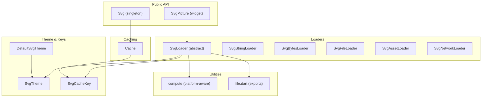
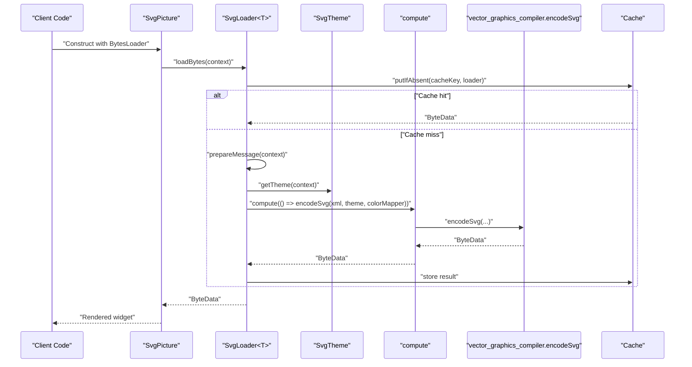
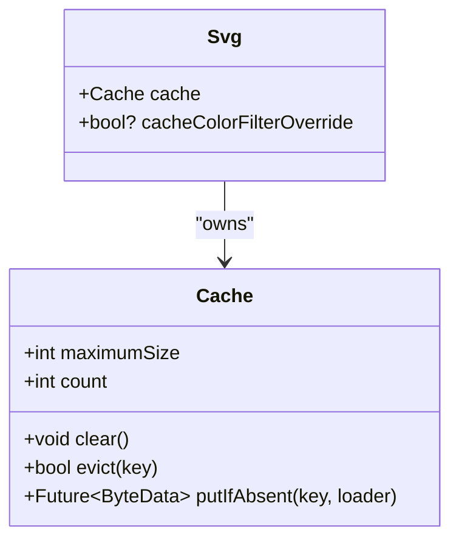
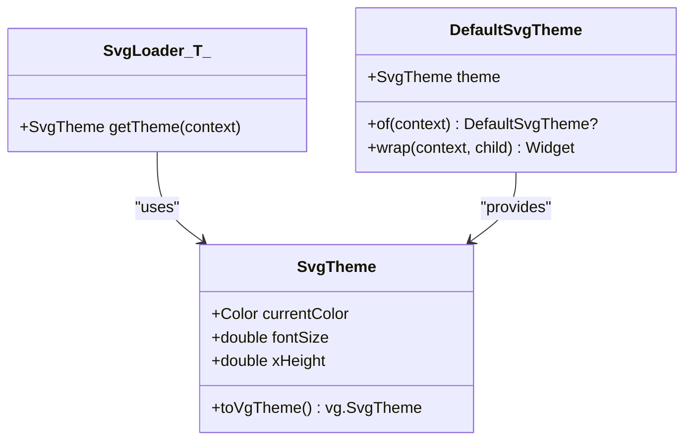
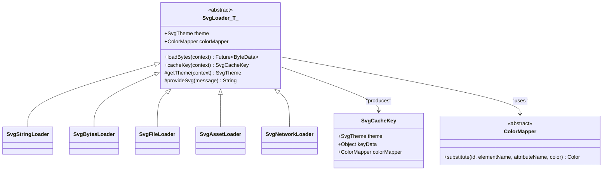
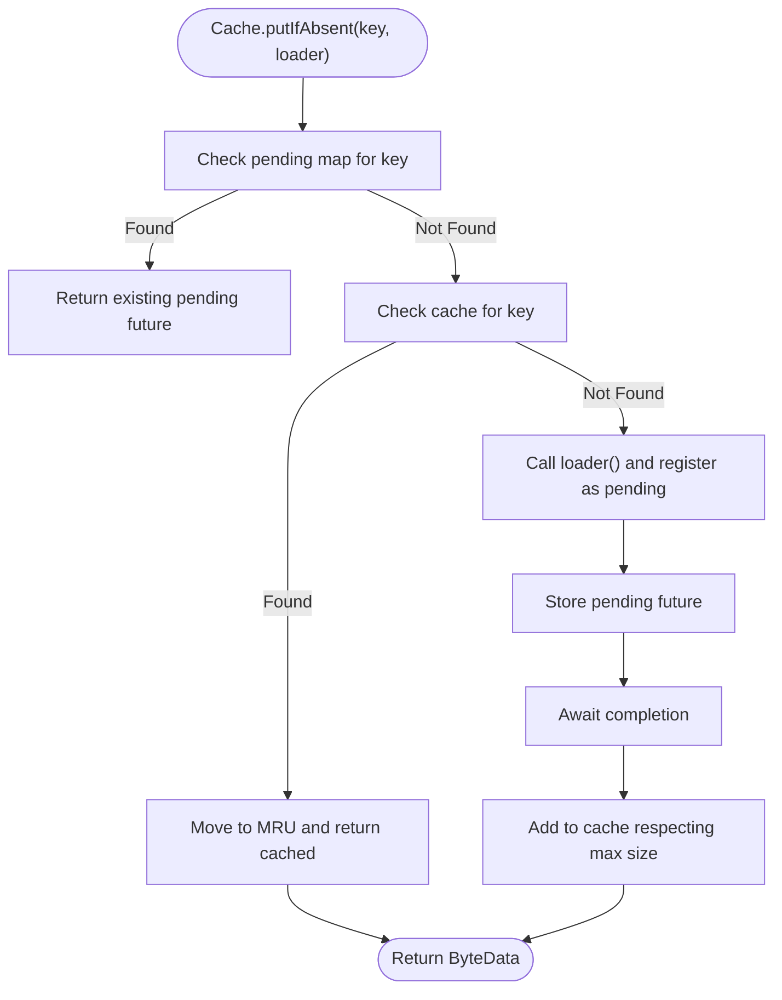
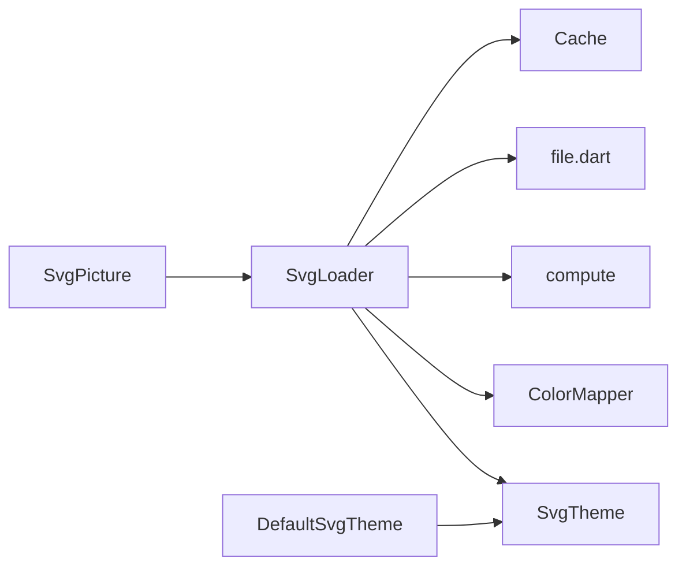

# Utility Classes

<cite>
**Referenced Files in This Document**
- [svg.dart](file://lib/svg.dart)
- [loaders.dart](file://lib/src/loaders.dart)
- [cache.dart](file://lib/src/cache.dart)
- [default_theme.dart](file://lib/src/default_theme.dart)
- [compute.dart](file://lib/src/utilities/compute.dart)
- [file.dart](file://lib/src/utilities/file.dart)
</cite>

## Table of Contents
1. [Introduction](#introduction)
2. [Project Structure](#project-structure)
3. [Core Components](#core-components)
4. [Architecture Overview](#architecture-overview)
5. [Detailed Component Analysis](#detailed-component-analysis)
6. [Dependency Analysis](#dependency-analysis)
7. [Performance Considerations](#performance-considerations)
8. [Troubleshooting Guide](#troubleshooting-guide)
9. [Conclusion](#conclusion)

## Introduction
This document describes the utility classes and helper functions that power SVG decoding and rendering in the project. It focuses on:
- The Svg utility class and its role in decoding SVG data to DrawableRoot or PictureInfo via the exported singleton.
- The SvgTheme configuration model and how it is applied to loaders and propagated through DefaultSvgTheme.
- Loader classes that transform various input sources (strings, bytes, files, assets, network) into vector_graphics-compatible binary data.
- Global configuration options exposed by Svg and the Cache utility.
- Utility types such as SvgErrorWidgetBuilder, ColorMapper, and the RenderingStrategy concept used by SvgPicture.
- Practical guidance on direct SVG manipulation, custom theme creation, and integration with vector graphics utilities.
- Performance considerations, memory usage, and best practices for efficient usage of these utilities.

## Project Structure
The relevant parts of the library are organized as follows:
- Public API surface: svg.dart exports the Svg singleton, SvgPicture widget, and related types.
- Loaders and themes: src/loaders.dart defines SvgTheme, ColorMapper, and the SvgLoader hierarchy.
- Caching: src/cache.dart provides a cache keyed by SvgCacheKey, including theme-aware invalidation.
- Default theme propagation: src/default_theme.dart provides DefaultSvgTheme for subtree-wide theme application.
- Utilities: src/utilities/compute.dart and src/utilities/file.dart provide platform-aware compute and file abstractions.

**Diagram sources**
- [svg.dart:24-45](file://lib/svg.dart#L24-L45)
- [loaders.dart:15-74](file://lib/src/loaders.dart#L15-L74)
- [loaders.dart:121-194](file://lib/src/loaders.dart#L121-L194)
- [loaders.dart:234-280](file://lib/src/loaders.dart#L234-L280)
- [loaders.dart:343-413](file://lib/src/loaders.dart#L343-L413)
- [loaders.dart:417-466](file://lib/src/loaders.dart#L417-L466)
- [cache.dart:5-110](file://lib/src/cache.dart#L5-L110)
- [default_theme.dart:7-35](file://lib/src/default_theme.dart#L7-L35)
- [compute.dart:21-26](file://lib/src/utilities/compute.dart#L21-L26)
- [file.dart:1-2](file://lib/src/utilities/file.dart#L1-L2)

**Section sources**
- [svg.dart:1-627](file://lib/svg.dart#L1-L627)
- [loaders.dart:1-467](file://lib/src/loaders.dart#L1-L467)
- [cache.dart:1-111](file://lib/src/cache.dart#L1-L111)
- [default_theme.dart:1-36](file://lib/src/default_theme.dart#L1-L36)
- [compute.dart:1-26](file://lib/src/utilities/compute.dart#L1-L26)
- [file.dart:1-2](file://lib/src/utilities/file.dart#L1-L2)

## Core Components
- Svg singleton
  - Provides a global Cache instance and a deprecated cacheColorFilterOverride flag.
  - Intended for direct decoding to DrawableRoot or PictureInfo via loaders and vector graphics utilities.
  - Exposed as a final singleton for convenience.

- SvgPicture widget
  - Renders SVGs from multiple sources (asset, network, file, memory, string).
  - Supports placeholder/error builders, semantics, clipping, and a rendering strategy selection.
  - Delegates to vector graphics utilities for rendering.

- SvgTheme
  - Encapsulates currentColor, fontSize, and xHeight used for unit calculations and color inheritance resolution.
  - Converts to the vector graphics theme type for encoding.

- DefaultSvgTheme
  - Propagates a default SvgTheme down the widget tree and notifies dependents when it changes.

- Cache
  - LRU cache keyed by SvgCacheKey, supporting eviction and size limits.
  - Evicts entries when themes change to ensure correctness.

- ColorMapper
  - Immutable abstraction to transform colors during SVG parsing; integrates with vector graphics compiler.

- SvgLoader<T> and concrete loaders
  - Abstract base for loaders with theme and color mapper support.
  - Concrete loaders handle string, bytes, file, asset, and network sources.
  - Uses compute for off-main-thread encoding to vector_graphics binary.

- RenderingStrategy
  - Concept used by SvgPicture to select rendering mode; defaults to picture.

**Section sources**
- [svg.dart:24-45](file://lib/svg.dart#L24-L45)
- [svg.dart:57-626](file://lib/svg.dart#L57-L626)
- [loaders.dart:15-74](file://lib/src/loaders.dart#L15-L74)
- [default_theme.dart:7-35](file://lib/src/default_theme.dart#L7-L35)
- [cache.dart:5-110](file://lib/src/cache.dart#L5-L110)
- [loaders.dart:76-94](file://lib/src/loaders.dart#L76-L94)
- [loaders.dart:121-194](file://lib/src/loaders.dart#L121-L194)
- [loaders.dart:234-280](file://lib/src/loaders.dart#L234-L280)
- [loaders.dart:343-413](file://lib/src/loaders.dart#L343-L413)
- [loaders.dart:417-466](file://lib/src/loaders.dart#L417-L466)
- [svg.dart:534-540](file://lib/svg.dart#L534-L540)

## Architecture Overview
The decoding pipeline converts SVG inputs into vector_graphics binary data using loaders and a compute-based encoder. Theme and color mapping are applied during encoding. The resulting data is consumed by vector graphics utilities for rendering.

**Diagram sources**
- [svg.dart:543-560](file://lib/svg.dart#L543-L560)
- [loaders.dart:156-187](file://lib/src/loaders.dart#L156-L187)
- [loaders.dart:143-154](file://lib/src/loaders.dart#L143-L154)
- [compute.dart:21-26](file://lib/src/utilities/compute.dart#L21-L26)
- [cache.dart:65-93](file://lib/src/cache.dart#L65-L93)

## Detailed Component Analysis

### Svg utility class
- Purpose
  - Provides a central entry point for decoding SVG data to vector_graphics binary via loaders and caching.
- Key aspects
  - Singleton instance exposes a Cache for decoded data.
  - Deprecated cacheColorFilterOverride remains for compatibility.
- Usage patterns
  - Direct decoding to PictureInfo or DrawableRoot is performed by loaders; Svg acts as a facade for cache access and global configuration.

**Diagram sources**
- [svg.dart:24-45](file://lib/svg.dart#L24-L45)
- [cache.dart:5-110](file://lib/src/cache.dart#L5-L110)

**Section sources**
- [svg.dart:24-45](file://lib/svg.dart#L24-L45)
- [cache.dart:5-110](file://lib/src/cache.dart#L5-L110)

### SvgTheme configuration
- Structure
  - currentColor: default color for currentColor keyword resolution.
  - fontSize: used for em/ex unit calculations.
  - xHeight: derived from fontSize if not provided.
- Application
  - Converted to vector graphics theme for encoding.
  - Used by SvgLoader.getTheme to resolve effective theme per widget.
- DefaultSvgTheme
  - Supplies subtree-wide theme via inherited widget mechanism.

**Diagram sources**
- [loaders.dart:15-74](file://lib/src/loaders.dart#L15-L74)
- [loaders.dart:143-154](file://lib/src/loaders.dart#L143-L154)
- [default_theme.dart:7-35](file://lib/src/default_theme.dart#L7-L35)

**Section sources**
- [loaders.dart:15-74](file://lib/src/loaders.dart#L15-L74)
- [default_theme.dart:7-35](file://lib/src/default_theme.dart#L7-L35)

### Loader hierarchy and decoding pipeline
- SvgLoader<T>
  - Abstract base with theme and colorMapper support.
  - Computes cache key including theme and color mapper.
  - Uses compute to encode SVG to vector_graphics binary.
- Concrete loaders
  - SvgStringLoader, SvgBytesLoader, SvgFileLoader, SvgAssetLoader, SvgNetworkLoader.
- ColorMapper integration
  - Delegates to vector graphics compiler via _DelegateVgColorMapper.

**Diagram sources**
- [loaders.dart:121-194](file://lib/src/loaders.dart#L121-L194)
- [loaders.dart:234-280](file://lib/src/loaders.dart#L234-L280)
- [loaders.dart:284-307](file://lib/src/loaders.dart#L284-L307)
- [loaders.dart:343-413](file://lib/src/loaders.dart#L343-L413)
- [loaders.dart:417-466](file://lib/src/loaders.dart#L417-L466)
- [loaders.dart:196-230](file://lib/src/loaders.dart#L196-L230)
- [loaders.dart:76-94](file://lib/src/loaders.dart#L76-L94)

**Section sources**
- [loaders.dart:121-194](file://lib/src/loaders.dart#L121-L194)
- [loaders.dart:234-280](file://lib/src/loaders.dart#L234-L280)
- [loaders.dart:284-307](file://lib/src/loaders.dart#L284-L307)
- [loaders.dart:343-413](file://lib/src/loaders.dart#L343-L413)
- [loaders.dart:417-466](file://lib/src/loaders.dart#L417-L466)
- [loaders.dart:196-230](file://lib/src/loaders.dart#L196-L230)
- [loaders.dart:76-94](file://lib/src/loaders.dart#L76-L94)

### Cache and cache keys
- Cache
  - Tracks pending and cached ByteData futures.
  - Enforces maximum size with LRU eviction.
  - Evicts entries when theme changes are detected.
- SvgCacheKey
  - Includes theme, color mapper, and loader-specific key data to ensure correctness across different configurations.

**Diagram sources**
- [cache.dart:65-93](file://lib/src/cache.dart#L65-L93)

**Section sources**
- [cache.dart:5-110](file://lib/src/cache.dart#L5-L110)
- [loaders.dart:196-230](file://lib/src/loaders.dart#L196-L230)

### Platform-aware compute and file utilities
- compute
  - Platform-aware wrapper around foundation.compute; uses immediate execution in tests/web to avoid isolate spawning.
- file
  - Conditional export selecting platform-specific file IO implementation.

**Section sources**
- [compute.dart:1-26](file://lib/src/utilities/compute.dart#L1-L26)
- [file.dart:1-2](file://lib/src/utilities/file.dart#L1-L2)

### Utility types and helpers
- SvgErrorWidgetBuilder
  - Signature for building error widgets when decoding fails.
- RenderingStrategy
  - Concept used by SvgPicture to select rendering mode; defaults to picture.
- ColorMapper
  - Immutable abstraction to transform colors during SVG parsing; integrates with vector graphics compiler.

**Section sources**
- [svg.dart:19-22](file://lib/svg.dart#L19-L22)
- [svg.dart:534-540](file://lib/svg.dart#L534-L540)
- [loaders.dart:76-94](file://lib/src/loaders.dart#L76-L94)

## Dependency Analysis
- SvgPicture depends on vector graphics utilities for rendering and uses SvgLoader implementations to obtain ByteData.
- SvgLoader depends on SvgTheme, ColorMapper, compute, and file utilities.
- Cache depends on SvgCacheKey and maintains LRU ordering.
- DefaultSvgTheme provides SvgTheme to loaders via context.

**Diagram sources**
- [svg.dart:543-560](file://lib/svg.dart#L543-L560)
- [loaders.dart:121-194](file://lib/src/loaders.dart#L121-L194)
- [loaders.dart:143-154](file://lib/src/loaders.dart#L143-L154)
- [cache.dart:5-110](file://lib/src/cache.dart#L5-L110)
- [default_theme.dart:7-35](file://lib/src/default_theme.dart#L7-L35)
- [compute.dart:21-26](file://lib/src/utilities/compute.dart#L21-L26)
- [file.dart:1-2](file://lib/src/utilities/file.dart#L1-L2)

**Section sources**
- [svg.dart:543-560](file://lib/svg.dart#L543-L560)
- [loaders.dart:121-194](file://lib/src/loaders.dart#L121-L194)
- [cache.dart:5-110](file://lib/src/cache.dart#L5-L110)
- [default_theme.dart:7-35](file://lib/src/default_theme.dart#L7-L35)
- [compute.dart:21-26](file://lib/src/utilities/compute.dart#L21-L26)
- [file.dart:1-2](file://lib/src/utilities/file.dart#L1-L2)

## Performance Considerations
- Off-main-thread encoding
  - Compute-based encoding prevents UI jank and leverages background threads.
- Caching
  - Cache reduces repeated decoding work; tune maximumSize to balance memory and speed.
  - Evict on theme changes to prevent stale results.
- Rendering strategy
  - Choose appropriate strategy based on use case; picture is the default and generally efficient.
- Memory usage
  - Large SVGs and frequent theme/color changes increase memory pressure; monitor Cache.count and adjust maximumSize accordingly.
- Network and assets
  - Network loads are cached; asset resolution considers DefaultAssetBundle and package scoping.

[No sources needed since this section provides general guidance]

## Troubleshooting Guide
- Theme mismatch after route transitions
  - If colors appear incorrect after navigation, ensure theme-dependent caches are invalidated; the cache supports maybeEvict for theme changes.
- Asset not found
  - Verify asset path and package scoping; SvgPicture.asset requires package for package assets.
- Network failures
  - Provide an errorBuilder to display a fallback widget; check headers and URL validity.
- Layout shifts
  - Specify width and height or constrain the parent to avoid layout thrashing during decode.
- Color filtering
  - Prefer colorFilter over deprecated color/blendMode parameters; they are applied consistently across paints.

**Section sources**
- [cache.dart:56-58](file://lib/src/cache.dart#L56-L58)
- [svg.dart:104-179](file://lib/svg.dart#L104-L179)
- [svg.dart:213-244](file://lib/svg.dart#L213-L244)
- [svg.dart:531-540](file://lib/svg.dart#L531-L540)

## Conclusion
The utility classes and helpers provide a robust, configurable pipeline for decoding and rendering SVGs efficiently. Svg and SvgTheme offer centralized configuration, loaders encapsulate diverse input sources, and Cache ensures repeatable performance. By understanding the decoding pipeline, cache keys, and rendering strategy, developers can integrate vector graphics seamlessly while maintaining responsiveness and memory efficiency.