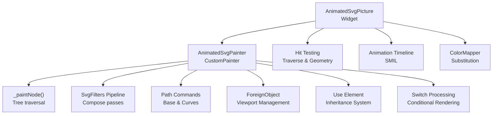
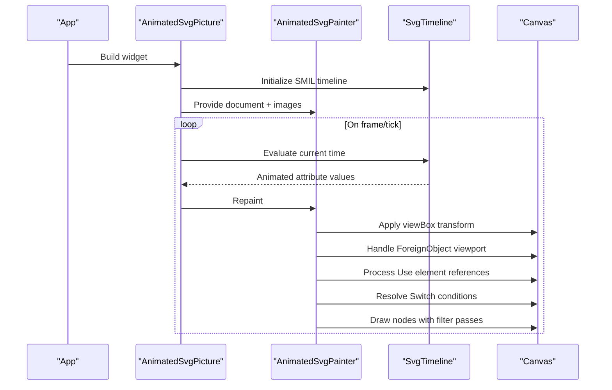
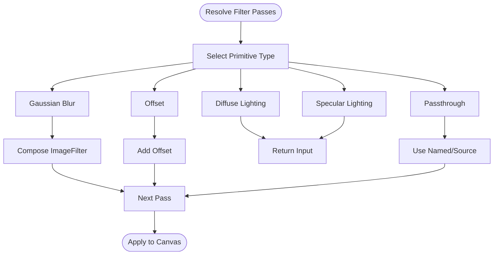
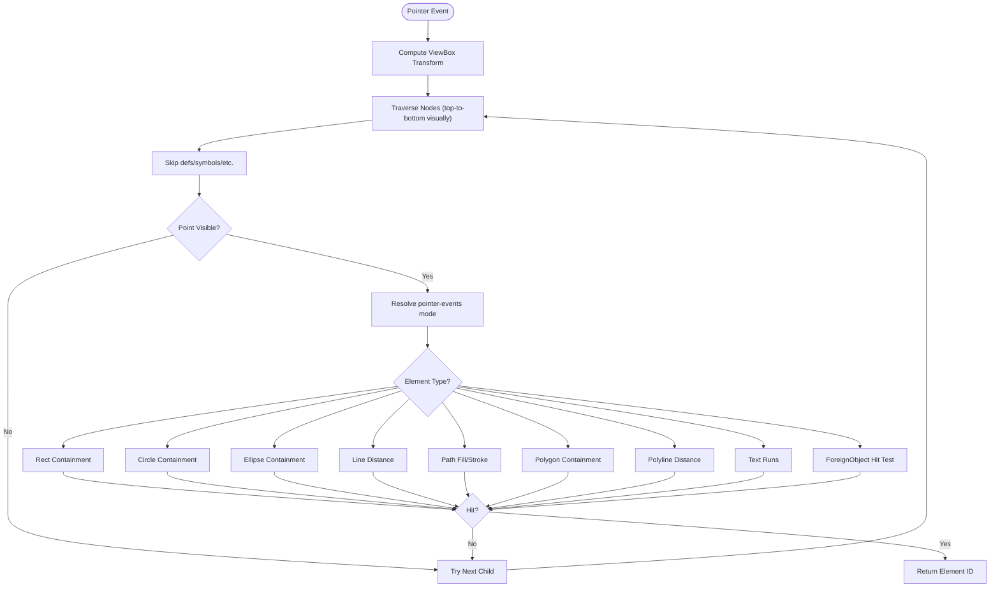
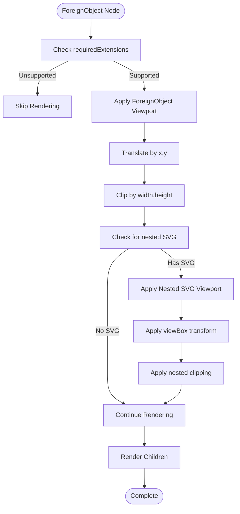
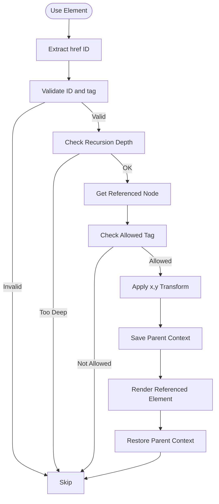
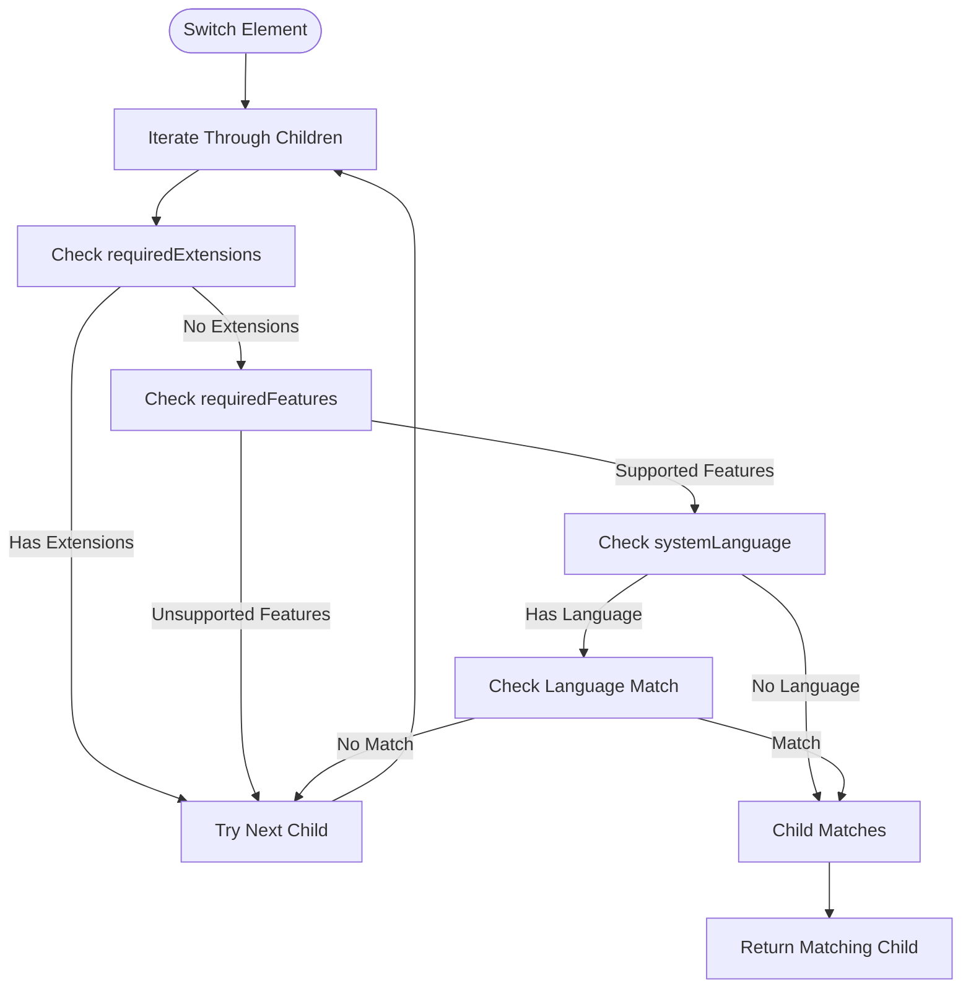
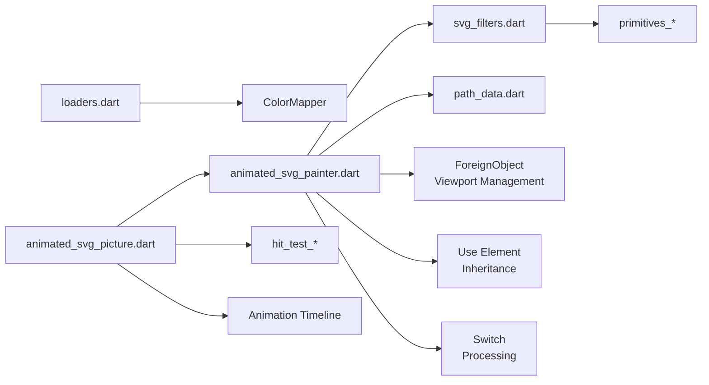

# Advanced Features

<cite>
**Referenced Files in This Document**
- [animated_svg_picture.dart](file://lib/src/animation/animated_svg_picture.dart)
- [animated_svg_painter.dart](file://lib/src/animation/animated_svg_painter.dart)
- [animated_svg_picture_hit_test_traversal.dart](file://lib/src/animation/animated_svg_picture_hit_test_traversal.dart)
- [animated_svg_picture_hit_test_geometry.dart](file://lib/src/animation/animated_svg_picture_hit_test_geometry.dart)
- [loaders.dart](file://lib/src/loaders.dart)
- [widget_svg_test.dart](file://test/widget_svg_test.dart)
- [animated_svg_picture_test.dart](file://test/animation/animated_svg_picture_test.dart)
- [path_data_base.dart](file://lib/src/animation/path_data_base.dart)
- [path_data_curves.dart](file://lib/src/animation/path_data_curves.dart)
- [path_integration_test.dart](file://test/animation/path_integration_test.dart)
- [path_morphing_correctness_test.dart](file://test/animation/path_morphing_correctness_test.dart)
- [svg_filters.dart](file://lib/src/animation/svg_filters.dart)
- [svg_filters_registry_pipeline_primitives.dart](file://lib/src/animation/svg_filters_registry_pipeline_primitives.dart)
- [svg_filters_registry_pipeline_primitives_effects.dart](file://lib/src/animation/svg_filters_registry_pipeline_primitives_effects.dart)
- [svg_filters_registry_pipeline_primitives_paint.dart](file://lib/src/animation/svg_filters_registry_pipeline_primitives_paint.dart)
- [svg_filters_primitives_lighting.dart](file://lib/src/animation/svg_filters_primitives_lighting.dart)
- [animated_svg_painter_tree.dart](file://lib/src/animation/animated_svg_painter_tree.dart)
- [animated_svg_painter_use.dart](file://lib/src/animation/animated_svg_painter_use.dart)
- [switch_processing.dart](file://lib/src/animation/switch_processing.dart)
- [SVGFEColorMatrixElement.h](file://blink-b87d44f-Source-core-svg/SVGFEColorMatrixElement.h)
- [SVGFilterBuilder.h](file://blink-b87d44f-Source-core-svg/graphics/filters/SVGFilterBuilder.h)
- [SVGFilterBuilder.cpp](file://blink-b87d44f-Source-core-svg/graphics/filters/SVGFilterBuilder.cpp)
- [SVGFilterPrimitiveStandardAttributes.cpp](file://blink-b87d44f-Source-core-svg/SVGFilterPrimitiveStandardAttributes.cpp)
- [SVGFESpecularLightingElement.cpp](file://blink-b87d44f-Source-core-svg/SVGFESpecularLightingElement.cpp)
- [ColorDistance.cpp](file://blink-b87d44f-Source-core-svg/ColorDistance.cpp)
- [SVGPathElement.idl](file://blink-b87d44f-Source-core-svg/SVGPathElement.idl)
- [SVGForeignObjectElement.cpp](file://blink-b87d44f-Source-core-svg/SVGForeignObjectElement.cpp)
- [SVGForeignObjectElement.h](file://blink-b87d44f-Source-core-svg/SVGForeignObjectElement.h)
- [SVGForeignObjectElement.idl](file://blink-b87d44f-Source-core-svg/SVGForeignObjectElement.idl)
</cite>

## Update Summary
**Changes Made**
- Added comprehensive ForeignObject semantics section with viewport management and nested SVG support
- Enhanced Use element inheritance system documentation with recursion depth control and viewport transforms
- Updated Switch element processing with requiredExtensions and requiredFeatures support
- Expanded architecture diagrams to reflect new rendering contexts and inheritance mechanisms

## Table of Contents
1. [Introduction](#introduction)
2. [Project Structure](#project-structure)
3. [Core Components](#core-components)
4. [Architecture Overview](#architecture-overview)
5. [Detailed Component Analysis](#detailed-component-analysis)
6. [Dependency Analysis](#dependency-analysis)
7. [Performance Considerations](#performance-considerations)
8. [Troubleshooting Guide](#troubleshooting-guide)
9. [Conclusion](#conclusion)
10. [Appendices](#appendices)

## Introduction
This document focuses on advanced features beyond basic SVG rendering, including the color mapping system, custom paint strategies, hit testing and pointer events, the filter effects system, path manipulation capabilities, and the newly enhanced ForeignObject semantics and Use element inheritance system. It explains how these systems integrate with the core rendering pipeline and animation framework, and provides configuration options, parameters, and return values for advanced components. Practical examples are drawn from the codebase to demonstrate advanced color transformation, custom rendering approaches, interactive SVG elements, visual effects, and sophisticated SVG compliance features. Guidance is included for performance optimization, debugging, and integration patterns.

## Project Structure
The advanced features span several modules:
- Rendering pipeline: AnimatedSvgPicture and AnimatedSvgPainter orchestrate painting and animation.
- Hit testing: Pointer events and hit testing traverse the DOM and compute containment per element type.
- Filters: A registry-driven pipeline composes image and color filters per filter primitive.
- Path manipulation: Path commands and conversion utilities enable morphing and interpolation.
- Color mapping: A pluggable ColorMapper transforms colors during parsing.
- ForeignObject semantics: Advanced viewport management and nested SVG support within foreignObject containers.
- Use element inheritance: Sophisticated symbol and SVG reference resolution with recursion protection.
- Switch processing: Conditional rendering based on feature detection and language preferences.

**Diagram sources**
- [animated_svg_picture.dart:108-164](file://lib/src/animation/animated_svg_picture.dart#L108-L164)
- [animated_svg_painter.dart:42-126](file://lib/src/animation/animated_svg_painter.dart#L42-L126)
- [animated_svg_picture_hit_test_traversal.dart:54-126](file://lib/src/animation/animated_svg_picture_hit_test_traversal.dart#L54-L126)
- [svg_filters.dart](file://lib/src/animation/svg_filters.dart)
- [path_data_base.dart:3-18](file://lib/src/animation/path_data_base.dart#L3-L18)
- [loaders.dart:85-138](file://lib/src/loaders.dart#L85-L138)
- [animated_svg_painter_use.dart:1-299](file://lib/src/animation/animated_svg_painter_use.dart#L1-299)
- [switch_processing.dart:1-105](file://lib/src/animation/switch_processing.dart#L1-105)

**Section sources**
- [animated_svg_picture.dart:108-164](file://lib/src/animation/animated_svg_picture.dart#L108-L164)
- [animated_svg_painter.dart:42-126](file://lib/src/animation/animated_svg_painter.dart#L42-L126)
- [animated_svg_picture_hit_test_traversal.dart:54-126](file://lib/src/animation/animated_svg_picture_hit_test_traversal.dart#L54-L126)
- [svg_filters.dart](file://lib/src/animation/svg_filters.dart)
- [path_data_base.dart:3-18](file://lib/src/animation/path_data_base.dart#L3-L18)
- [loaders.dart:85-138](file://lib/src/loaders.dart#L85-L138)
- [animated_svg_painter_use.dart:1-299](file://lib/src/animation/animated_svg_painter_use.dart#L1-299)
- [switch_processing.dart:1-105](file://lib/src/animation/switch_processing.dart#L1-105)

## Core Components
- ColorMapper interface and substitution pipeline
- Filter effects registry and paint pass composition
- Hit testing traversal and geometry evaluation
- Path command model and conversions for morphing
- AnimatedSvgPicture widget lifecycle and animation integration
- **New**: ForeignObject semantics with viewport management and nested SVG support
- **New**: Use element inheritance system with recursion depth control and viewport transforms
- **New**: Switch processing with conditional rendering based on features and languages

Key responsibilities:
- ColorMapper: Provides a hook to transform colors during parsing and rendering.
- SvgFilters: Resolves filter primitives into a list of paint passes with image/color filters and offsets.
- Hit testing: Computes pointer-event-aware containment checks for geometric primitives and text.
- Path commands: Defines a typed command model enabling normalization and interpolation for morphing.
- AnimatedSvgPicture: Integrates SMIL timelines, gestures, and repaint scheduling.
- **New**: ForeignObject: Manages viewport transforms, clipping, and nested SVG coordinate systems within foreignObject containers.
- **New**: Use element: Handles symbol and SVG reference resolution with inheritance preservation and recursion protection.
- **New**: Switch: Implements conditional rendering based on requiredExtensions, requiredFeatures, and systemLanguage.

**Section sources**
- [loaders.dart:85-138](file://lib/src/loaders.dart#L85-L138)
- [svg_filters_registry_pipeline_primitives.dart:75-112](file://lib/src/animation/svg_filters_registry_pipeline_primitives.dart#L75-L112)
- [animated_svg_picture_hit_test_geometry.dart:5-307](file://lib/src/animation/animated_svg_picture_hit_test_geometry.dart#L5-L307)
- [path_data_base.dart:3-281](file://lib/src/animation/path_data_base.dart#L3-L281)
- [animated_svg_picture.dart:166-295](file://lib/src/animation/animated_svg_picture.dart#L166-L295)
- [animated_svg_painter_use.dart:1-299](file://lib/src/animation/animated_svg_painter_use.dart#L1-299)
- [switch_processing.dart:1-105](file://lib/src/animation/switch_processing.dart#L1-105)

## Architecture Overview
The advanced rendering pipeline integrates parsing, animation, hit testing, filters, and the new ForeignObject and Use element systems:

**Diagram sources**
- [animated_svg_picture.dart:166-295](file://lib/src/animation/animated_svg_picture.dart#L166-L295)
- [animated_svg_painter.dart:64-126](file://lib/src/animation/animated_svg_painter.dart#L64-L126)
- [animated_svg_painter_use.dart:159-211](file://lib/src/animation/animated_svg_painter_use.dart#L159-L211)

## Detailed Component Analysis

### Color Mapping System
The color mapping system allows dynamic color substitution during parsing and rendering. The ColorMapper interface exposes a substitute method invoked by the loader delegate, which bridges to the vector graphics color mapper.

Key elements:
- ColorMapper interface with substitute(id, elementName, attributeName, color)
- Loader delegate wrapping ColorMapper into vector graphics color mapper
- Example test demonstrates substituting specific colors for assertions

Configuration options:
- theme: Theme context influencing currentColor resolution
- colorMapper: Optional ColorMapper instance for transformations

Parameters and return values:
- substitute receives: id (optional), element name, attribute name, original color
- Returns: transformed color

Integration:
- Applied during parsing to transform colors before rendering
- Used to implement theming, accessibility overrides, and dynamic palettes

**Section sources**
- [loaders.dart:85-138](file://lib/src/loaders.dart#L85-L138)
- [widget_svg_test.dart:44-96](file://test/widget_svg_test.dart#L44-L96)

### Custom Paint Strategies and Filter Effects
The filter system composes multiple primitives into a sequence of paint passes, each with optional image filters, color filters, and blend modes. The pipeline resolves inputs, composes filters, and applies offsets.

Core components:
- SvgFilters pipeline extension methods for resolving each primitive
- _paintWithFilterPassesImpl orchestrates saving/restoring and applying passes
- Registry methods for Gaussian blur, offset, passthrough, and lighting-like primitives

Configuration options:
- Primitive-specific attributes (e.g., dx/dy for offset, surfaceScale for lighting)
- Named results and sourceGraphic/sourceAlpha references
- Blend mode and color/image filters per pass

Parameters and return values:
- _resolveGaussianBlurOutput: takes blur primitive and previous passes; returns composed passes
- _resolveOffsetOutput: adds translation offset to each pass
- _resolvePassthroughOutput: returns input resolved to named results or source

Integration:
- AnimatedSvgPainter invokes filter passes per node
- Passes are applied in order with saved/restored canvas state

**Diagram sources**
- [svg_filters_registry_pipeline_primitives.dart:75-112](file://lib/src/animation/svg_filters_registry_pipeline_primitives.dart#L75-L112)
- [svg_filters_registry_pipeline_primitives_effects.dart:3-26](file://lib/src/animation/svg_filters_registry_pipeline_primitives_effects.dart#L3-L26)
- [svg_filters_registry_pipeline_primitives_paint.dart:3-41](file://lib/src/animation/svg_filters_registry_pipeline_primitives_paint.dart#L3-L41)
- [animated_svg_painter_tree.dart:279-304](file://lib/src/animation/animated_svg_painter_tree.dart#L279-L304)

**Section sources**
- [svg_filters_registry_pipeline_primitives.dart:75-112](file://lib/src/animation/svg_filters_registry_pipeline_primitives.dart#L75-L112)
- [svg_filters_registry_pipeline_primitives_effects.dart:3-26](file://lib/src/animation/svg_filters_registry_pipeline_primitives_effects.dart#L3-L26)
- [svg_filters_registry_pipeline_primitives_paint.dart:3-41](file://lib/src/animation/svg_filters_registry_pipeline_primitives_paint.dart#L3-L41)
- [animated_svg_painter_tree.dart:279-304](file://lib/src/animation/animated_svg_painter_tree.dart#L279-L304)

### Hit Testing and Pointer Events
The hit testing engine traverses the DOM in visual order, computes transforms, and evaluates pointer-event-aware containment for supported elements. It respects pointer-events modes and visibility.

Key elements:
- _hitTestElementId computes document-space point and traverses nodes
- _nodeContainsPoint evaluates containment per tag with pointer-events semantics
- Supports rect, circle, ellipse, line, image, foreignObject, path, polygon, polyline, text, tspan, textPath
- Stroke and fill hit-testing with tolerance and bounding-box mode

Configuration options:
- pointer-events attribute values: all, bounding-box, stroke, fill, none
- Visibility hidden affects whether fill/stroke are considered

Parameters and return values:
- _hitTestElementId: Offset -> String? (element id)
- _nodeContainsPoint: returns boolean for containment

Integration:
- AnimatedSvgPicture wraps with GestureDetector/MouseRegion for tap/hover
- Uses SMIL begin events to trigger animations on click

**Diagram sources**
- [animated_svg_picture_hit_test_traversal.dart:54-126](file://lib/src/animation/animated_svg_picture_hit_test_traversal.dart#L54-L126)
- [animated_svg_picture_hit_test_geometry.dart:5-307](file://lib/src/animation/animated_svg_picture_hit_test_geometry.dart#L5-L307)

**Section sources**
- [animated_svg_picture_hit_test_traversal.dart:54-126](file://lib/src/animation/animated_svg_picture_hit_test_traversal.dart#L54-L126)
- [animated_svg_picture_hit_test_geometry.dart:5-307](file://lib/src/animation/animated_svg_picture_hit_test_geometry.dart#L5-L307)
- [animated_svg_picture_test.dart:2087-2356](file://test/animation/animated_svg_picture_test.dart#L2087-L2356)

### Path Manipulation Capabilities
The path command model supports absolute and relative variants, conversions, and morphing-friendly normalization. Curves are represented as typed commands enabling interpolation.

Key elements:
- PathCommand base and concrete implementations (MoveTo, LineTo, Horizontal/Vertical LineTo, Arc, Cubic/Quadratic Bezier, Smooth variants)
- Absolute conversion helpers for relative commands
- Conversion to cubic/bezier equivalents for morphing

Parameters and return values:
- toAbsolute(currentX, currentY): returns absolute variant
- toCubicBezier(...) / toQuadraticBezier(...): converts curves to standard forms

Integration:
- Path morphing tests demonstrate parsing, normalization, and interpolation across shapes
- Used by animation system for morphing paths over time

**Diagram sources**
- [path_data_base.dart:3-281](file://lib/src/animation/path_data_base.dart#L3-L281)
- [path_data_curves.dart:3-285](file://lib/src/animation/path_data_curves.dart#L3-L285)

**Section sources**
- [path_data_base.dart:3-281](file://lib/src/animation/path_data_base.dart#L3-L281)
- [path_data_curves.dart:3-285](file://lib/src/animation/path_data_curves.dart#L3-L285)
- [path_integration_test.dart:1-35](file://test/animation/path_integration_test.dart#L1-L35)
- [path_morphing_correctness_test.dart:1-34](file://test/animation/path_morphing_correctness_test.dart#L1-L34)

### ForeignObject Semantics and Nested SVG Support
**Updated** Enhanced with comprehensive viewport management and nested SVG coordinate system support.

The ForeignObject element provides a bridge between SVG and non-SVG content, managing viewport transforms, clipping, and nested SVG coordinate systems. This system ensures proper rendering of HTML content within SVG while maintaining SVG compliance.

Key elements:
- _shouldRenderForeignObject: Checks requiredExtensions attribute and returns false for unsupported extensions
- _applyForeignObjectViewport: Applies translation and clipping based on x, y, width, height attributes
- _applyNestedSvgViewportInForeignObject: Handles nested SVG elements within foreignObject containers
- ForeignObject viewport clipping with overflow attribute support
- Nested SVG coordinate system with viewBox and preserveAspectRatio handling

Configuration options:
- x, y, width, height: Position and sizing attributes for ForeignObject viewport
- overflow: Controls clipping behavior (default: hidden)
- viewBox: Nested SVG coordinate system definition
- preserveAspectRatio: Aspect ratio preservation for nested SVG

Parameters and return values:
- _shouldRenderForeignObject: SvgNode -> bool (returns false for unsupported requiredExtensions)
- _applyForeignObjectViewport: Canvas, SvgNode -> void (applies transform and clipping)
- _applyNestedSvgViewportInForeignObject: Canvas, SvgNode, SvgNode? -> void (nested SVG transform)

Integration:
- Applied during tree traversal for foreignObject nodes
- Handles viewport transforms before child rendering
- Supports nested SVG elements with their own coordinate systems

**Diagram sources**
- [animated_svg_painter_use.dart:11-47](file://lib/src/animation/animated_svg_painter_use.dart#L11-L47)
- [animated_svg_painter_use.dart:49-144](file://lib/src/animation/animated_svg_painter_use.dart#L49-L144)
- [animated_svg_painter_tree.dart:25-35](file://lib/src/animation/animated_svg_painter_tree.dart#L25-L35)

**Section sources**
- [animated_svg_painter_use.dart:11-47](file://lib/src/animation/animated_svg_painter_use.dart#L11-L47)
- [animated_svg_painter_use.dart:49-144](file://lib/src/animation/animated_svg_painter_use.dart#L49-L144)
- [animated_svg_painter_tree.dart:25-35](file://lib/src/animation/animated_svg_painter_tree.dart#L25-L35)
- [SVGForeignObjectElement.cpp:83-116](file://blink-b87d44f-Source-core-svg/SVGForeignObjectElement.cpp#L83-L116)
- [SVGForeignObjectElement.h:40-57](file://blink-b87d44f-Source-core-svg/SVGForeignObjectElement.h#L40-L57)

### Use Element Inheritance System and Symbol Resolution
**Updated** Enhanced with recursion depth control, viewport transforms, and improved symbol resolution.

The Use element system handles symbol and SVG reference resolution with proper inheritance preservation and recursion protection. This system enables efficient reuse of SVG content while maintaining proper coordinate transformations.

Key elements:
- _paintUse: Main entry point for use element rendering with recursion protection
- _paintSymbolReference: Handles symbol element references with viewport transforms
- _paintSvgUseReference: Handles SVG element references with coordinate system inheritance
- _resolveUseViewportTransform: Computes viewport transforms for referenced elements
- Recursion depth limit (10 levels) matching Blink implementation
- Parent context preservation during reference rendering

Configuration options:
- x, y: Translation offsets for use element references
- href: Reference identifier for referenced element
- Recursion depth: Maximum 10 levels to prevent infinite loops
- Coordinate system inheritance: Preserves parent transforms and styling

Parameters and return values:
- _paintUse: Canvas, SvgNode, Set<String> -> void (renders referenced element)
- _paintSymbolReference: Canvas, SvgNode, SvgNode, Set<String> -> void (renders symbol with transforms)
- _paintSvgUseReference: Canvas, SvgNode, SvgNode, Set<String> -> void (renders SVG reference)
- _resolveUseViewportTransform: SvgNode, SvgNode -> ViewportTransform? (computes transform matrix and clip)

Integration:
- Applied during tree traversal for use elements
- Handles symbol and SVG references differently
- Preserves parent context during reference rendering
- Supports nested use elements with proper recursion tracking

**Diagram sources**
- [animated_svg_painter_use.dart:159-211](file://lib/src/animation/animated_svg_painter_use.dart#L159-L211)
- [animated_svg_painter_use.dart:213-253](file://lib/src/animation/animated_svg_painter_use.dart#L213-L253)

**Section sources**
- [animated_svg_painter_use.dart:159-211](file://lib/src/animation/animated_svg_painter_use.dart#L159-L211)
- [animated_svg_painter_use.dart:213-253](file://lib/src/animation/animated_svg_painter_use.dart#L213-L253)
- [animated_svg_painter_tree.dart:180-205](file://lib/src/animation/animated_svg_painter_tree.dart#L180-L205)

### Switch Processing and Conditional Rendering
**Updated** Enhanced with comprehensive requiredExtensions and requiredFeatures support.

The Switch element system implements conditional rendering based on feature detection, language preferences, and extension requirements. This system provides SVG 1.1 compliance for conditional content selection.

Key elements:
- resolveActiveSwitchChild: Main entry point for switch child resolution
- _matchesSwitchConditions: Evaluates child element conditions
- Feature support validation against known SVG features
- Language matching against system locale preferences
- Extension requirement checking for unsupported extensions

Configuration options:
- requiredExtensions: List of extension URIs that must be supported
- requiredFeatures: List of SVG feature identifiers that must be supported
- systemLanguage: List of language codes for content localization
- Feature support: Built-in support for SVG 1.1 feature identifiers

Parameters and return values:
- resolveActiveSwitchChild: SvgNode -> SvgNode? (returns first matching child or null)
- _matchesSwitchConditions: SvgNode, Set<String> -> bool (evaluates child conditions)
- _parseTokenList: Object?, Pattern? -> List<String> (parses token lists)

Integration:
- Applied during tree traversal for switch elements
- Resolves active child before rendering
- Supports fallback chains with multiple conditional children
- Handles edge cases where no children match

**Diagram sources**
- [switch_processing.dart:23-42](file://lib/src/animation/switch_processing.dart#L23-L42)
- [switch_processing.dart:44-76](file://lib/src/animation/switch_processing.dart#L44-L76)

**Section sources**
- [switch_processing.dart:1-105](file://lib/src/animation/switch_processing.dart#L1-L105)
- [animated_svg_painter_use.dart:255-265](file://lib/src/animation/animated_svg_painter_use.dart#L255-L265)
- [animated_svg_picture_test.dart:735-977](file://test/animation/animated_svg_picture_test.dart#L735-L977)

### Relationship with Core Rendering Pipeline and Animation System
- AnimatedSvgPicture initializes and manages the animation timeline, exposing playback controls and tracing callbacks.
- AnimatedSvgPainter computes viewBox transforms, saves/restores canvas state, and draws nodes with filter passes.
- Hit testing is integrated via GestureDetector/MouseRegion to trigger SMIL events and animations.
- **New**: ForeignObject viewport management is integrated into the main rendering pipeline.
- **New**: Use element processing is handled during tree traversal with recursion protection.
- **New**: Switch processing occurs during conditional rendering with feature detection.

Configuration options:
- width/height/fit/alignment/background color
- playbackRate/autoPlay/initialTime/controller
- onTrace/traceFrameTicks for diagnostics
- **New**: ForeignObject viewport attributes (x, y, width, height, overflow)
- **New**: Use element attributes (href, x, y) with recursion depth control
- **New**: Switch element conditions (requiredExtensions, requiredFeatures, systemLanguage)

Parameters and return values:
- play/pause/reset/seekTo manipulate playback
- shouldRepaint indicates repainting on attribute changes
- **New**: ForeignObject viewport transforms applied before child rendering
- **New**: Use element references resolved with coordinate system inheritance
- **New**: Switch children evaluated for conditional rendering

**Section sources**
- [animated_svg_picture.dart:108-164](file://lib/src/animation/animated_svg_picture.dart#L108-L164)
- [animated_svg_painter.dart:64-126](file://lib/src/animation/animated_svg_painter.dart#L64-L126)
- [animated_svg_painter_use.dart:1-299](file://lib/src/animation/animated_svg_painter_use.dart#L1-299)
- [switch_processing.dart:1-105](file://lib/src/animation/switch_processing.dart#L1-105)

## Dependency Analysis
The advanced features depend on:
- Loader and ColorMapper for color substitution
- Filter registry and paint passes for visual effects
- Hit testing extensions for interactivity
- Path command model for morphing
- Animation timeline for SMIL-driven interactions
- **New**: ForeignObject viewport management for HTML content integration
- **New**: Use element inheritance system for symbol and reference resolution
- **New**: Switch processing for conditional rendering

**Diagram sources**
- [loaders.dart:85-138](file://lib/src/loaders.dart#L85-L138)
- [animated_svg_picture.dart:108-164](file://lib/src/animation/animated_svg_picture.dart#L108-L164)
- [animated_svg_painter.dart:42-126](file://lib/src/animation/animated_svg_painter.dart#L42-L126)
- [svg_filters.dart](file://lib/src/animation/svg_filters.dart)
- [animated_svg_picture_hit_test_traversal.dart:54-126](file://lib/src/animation/animated_svg_picture_hit_test_traversal.dart#L54-L126)
- [path_data_base.dart:3-18](file://lib/src/animation/path_data_base.dart#L3-L18)
- [animated_svg_painter_use.dart:1-299](file://lib/src/animation/animated_svg_painter_use.dart#L1-299)
- [switch_processing.dart:1-105](file://lib/src/animation/switch_processing.dart#L1-105)

**Section sources**
- [loaders.dart:85-138](file://lib/src/loaders.dart#L85-L138)
- [animated_svg_picture.dart:108-164](file://lib/src/animation/animated_svg_picture.dart#L108-L164)
- [animated_svg_painter.dart:42-126](file://lib/src/animation/animated_svg_painter.dart#L42-L126)
- [svg_filters.dart](file://lib/src/animation/svg_filters.dart)
- [animated_svg_picture_hit_test_traversal.dart:54-126](file://lib/src/animation/animated_svg_picture_hit_test_traversal.dart#L54-L126)
- [path_data_base.dart:3-18](file://lib/src/animation/path_data_base.dart#L3-L18)
- [animated_svg_painter_use.dart:1-299](file://lib/src/animation/animated_svg_painter_use.dart#L1-299)
- [switch_processing.dart:1-105](file://lib/src/animation/switch_processing.dart#L1-105)

## Performance Considerations
- Filter passes: Each pass incurs save/restore and potential image filter operations; minimize the number of passes and avoid heavy filters on large canvases.
- Hit testing: Traversal is O(children) per node; keep DOM shallow and avoid excessive nested groups for frequent hover interactions.
- Path morphing: Normalization and interpolation cost scales with command counts; pre-process paths when possible.
- Repaint frequency: AnimatedSvgPicture forces repaints; throttle playbackRate and use appropriate fit/alignment to reduce layout churn.
- Images: Cache decoded images by href to avoid repeated decoding.
- **New**: ForeignObject viewport management: Each foreignObject introduces additional canvas operations; minimize nested foreignObject usage.
- **New**: Use element recursion: Recursion depth limit prevents infinite loops but still incurs overhead for deep hierarchies.
- **New**: Switch processing: Feature detection and language matching add computational overhead; cache results when possible.

## Troubleshooting Guide
Common issues and techniques:
- Colors not transforming: Verify ColorMapper is supplied to the loader and substitute logic matches expected ids/attributes.
- Filters not applied: Confirm filter primitives are properly connected and named results are referenced; check pass composition order.
- Hit testing not triggering: Ensure pointer-events is not "none" and element is visible; confirm coordinates are transformed via viewBox.
- Path morphing incorrect: Validate path normalization and ensure compatible shapes; inspect intermediate commands after conversion to cubic/bezier.
- Tracing: Use onTrace and traceFrameTicks to capture runtime diagnostics and stack traces for errors.
- **New**: ForeignObject not rendering: Check requiredExtensions attribute - unsupported extensions will cause foreignObject to be skipped.
- **New**: Use element not rendering: Verify href references valid elements and check recursion depth limits.
- **New**: Switch not selecting correct child: Review requiredExtensions, requiredFeatures, and systemLanguage attributes for proper matching.
- **New**: Nested SVG viewport issues: Ensure foreignObject has valid width/height and nested SVG has proper viewBox/preserveAspectRatio.

**Section sources**
- [loaders.dart:85-138](file://lib/src/loaders.dart#L85-L138)
- [animated_svg_picture_test.dart:2087-2356](file://test/animation/animated_svg_picture_test.dart#L2087-L2356)
- [path_morphing_correctness_test.dart:1-34](file://test/animation/path_morphing_correctness_test.dart#L1-L34)
- [animated_svg_painter_use.dart:11-25](file://lib/src/animation/animated_svg_painter_use.dart#L11-L25)
- [animated_svg_painter_use.dart:159-211](file://lib/src/animation/animated_svg_painter_use.dart#L159-L211)
- [switch_processing.dart:44-76](file://lib/src/animation/switch_processing.dart#L44-L76)

## Conclusion
The advanced features provide a robust foundation for sophisticated SVG experiences:
- ColorMapper enables dynamic color transformations during parsing.
- The filter pipeline composes visual effects efficiently through paint passes.
- Hit testing and pointer events support interactive animations driven by SMIL.
- Path command abstractions power morphing and interpolation for complex shape transitions.
- **New**: ForeignObject semantics enable seamless integration of HTML content within SVG while maintaining proper viewport management and nested coordinate systems.
- **New**: Use element inheritance system provides efficient symbol and reference resolution with recursion protection and coordinate system preservation.
- **New**: Switch processing implements comprehensive conditional rendering based on features, extensions, and language preferences.
Integrating these components requires careful attention to performance, filter composition, coordinate transforms, and the new rendering contexts, but yields powerful customization for advanced use cases.

## Appendices

### Color Transformation Example References
- ColorMapper substitute method usage in tests demonstrates replacing specific colors for assertions.
- Loader delegate bridges ColorMapper to vector graphics color mapper.

**Section sources**
- [widget_svg_test.dart:44-96](file://test/widget_svg_test.dart#L44-L96)
- [loaders.dart:85-138](file://lib/src/loaders.dart#L85-L138)

### Filter Effects Example References
- Registry methods resolve Gaussian blur, offset, and lighting-like primitives into paint passes.
- _paintWithFilterPassesImpl shows applying image filters, color filters, and offsets per pass.

**Section sources**
- [svg_filters_registry_pipeline_primitives.dart:75-112](file://lib/src/animation/svg_filters_registry_pipeline_primitives.dart#L75-L112)
- [svg_filters_registry_pipeline_primitives_effects.dart:3-26](file://lib/src/animation/svg_filters_registry_pipeline_primitives_effects.dart#L3-L26)
- [svg_filters_registry_pipeline_primitives_paint.dart:3-41](file://lib/src/animation/svg_filters_registry_pipeline_primitives_paint.dart#L3-L41)
- [animated_svg_painter_tree.dart:279-304](file://lib/src/animation/animated_svg_painter_tree.dart#L279-L304)

### Hit Testing Example References
- Pointer-events none disables target click hit-testing; child override restores click.
- pointer-events stroke hits only on stroke geometry.
- pointer-events bounding-box uses element bounds for circle hit-testing.

**Section sources**
- [animated_svg_picture_test.dart:2087-2356](file://test/animation/animated_svg_picture_test.dart#L2087-L2356)

### Path Manipulation Example References
- Square to circle morphing integration tests parse paths, normalize, and interpolate.
- Path command conversions to cubic/bezier enable morphing compatibility.

**Section sources**
- [path_integration_test.dart:1-35](file://test/animation/path_integration_test.dart#L1-L35)
- [path_morphing_correctness_test.dart:1-34](file://test/animation/path_morphing_correctness_test.dart#L1-L34)
- [path_data_curves.dart:176-194](file://lib/src/animation/path_data_curves.dart#L176-L194)

### ForeignObject Semantics Example References
- ForeignObject viewport management with translation and clipping.
- Nested SVG coordinate system handling within foreignObject containers.
- requiredExtensions attribute validation for conditional rendering.

**Section sources**
- [animated_svg_painter_use.dart:11-47](file://lib/src/animation/animated_svg_painter_use.dart#L11-L47)
- [animated_svg_painter_use.dart:49-144](file://lib/src/animation/animated_svg_painter_use.dart#L49-L144)
- [SVGForeignObjectElement.cpp:83-116](file://blink-b87d44f-Source-core-svg/SVGForeignObjectElement.cpp#L83-L116)

### Use Element Inheritance Example References
- Use element reference resolution with recursion depth control.
- Symbol reference rendering with viewport transforms.
- SVG reference handling with coordinate system inheritance.

**Section sources**
- [animated_svg_painter_use.dart:159-211](file://lib/src/animation/animated_svg_painter_use.dart#L159-L211)
- [animated_svg_painter_use.dart:213-253](file://lib/src/animation/animated_svg_painter_use.dart#L213-L253)
- [animated_svg_painter_tree.dart:180-205](file://lib/src/animation/animated_svg_painter_tree.dart#L180-L205)

### Switch Processing Example References
- Conditional rendering based on requiredExtensions and requiredFeatures.
- Language-based content selection with systemLanguage attribute.
- Fallback mechanism when no children match conditions.

**Section sources**
- [switch_processing.dart:1-105](file://lib/src/animation/switch_processing.dart#L1-L105)
- [animated_svg_painter_use.dart:255-265](file://lib/src/animation/animated_svg_painter_use.dart#L255-L265)
- [animated_svg_picture_test.dart:735-977](file://test/animation/animated_svg_picture_test.dart#L735-L977)

### Core Rendering and Animation Integration References
- AnimatedSvgPicture widget configuration and playback controls.
- AnimatedSvgPainter viewBox transform and filter pass application.

**Section sources**
- [animated_svg_picture.dart:108-164](file://lib/src/animation/animated_svg_picture.dart#L108-L164)
- [animated_svg_painter.dart:64-126](file://lib/src/animation/animated_svg_painter.dart#L64-L126)