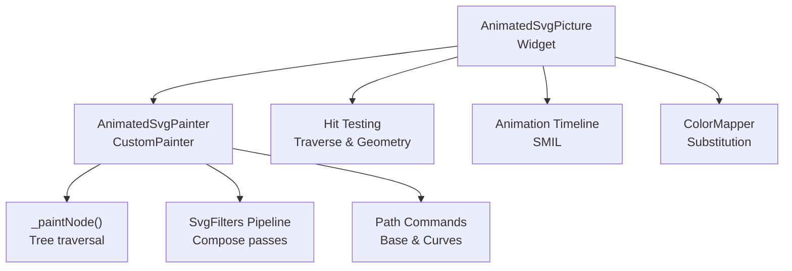
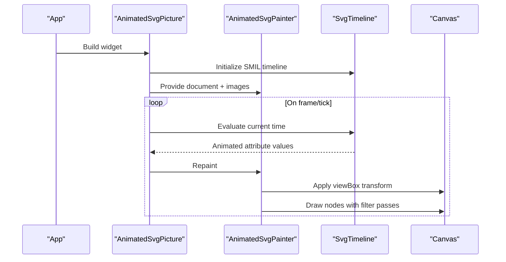
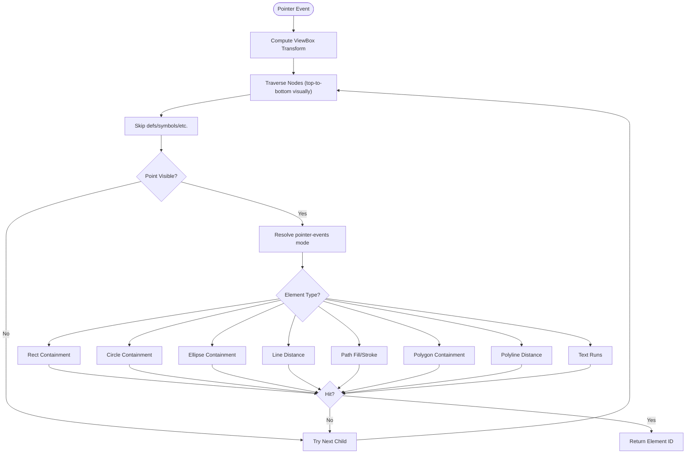
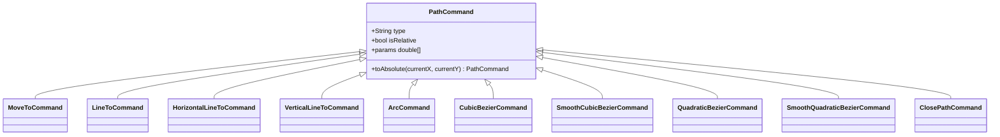
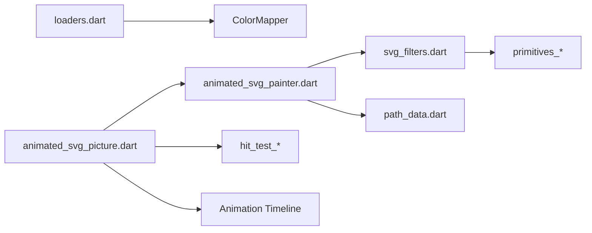

# Advanced Features

<cite>
**Referenced Files in This Document**
- [animated_svg_picture.dart](file://lib/src/animation/animated_svg_picture.dart)
- [animated_svg_painter.dart](file://lib/src/animation/animated_svg_painter.dart)
- [animated_svg_picture_hit_test_traversal.dart](file://lib/src/animation/animated_svg_picture_hit_test_traversal.dart)
- [animated_svg_picture_hit_test_geometry.dart](file://lib/src/animation/animated_svg_picture_hit_test_geometry.dart)
- [loaders.dart](file://lib/src/loaders.dart)
- [widget_svg_test.dart](file://test/widget_svg_test.dart)
- [animated_svg_picture_test.dart](file://test/animation/animated_svg_picture_test.dart)
- [path_data_base.dart](file://lib/src/animation/path_data_base.dart)
- [path_data_curves.dart](file://lib/src/animation/path_data_curves.dart)
- [path_integration_test.dart](file://test/animation/path_integration_test.dart)
- [path_morphing_correctness_test.dart](file://test/animation/path_morphing_correctness_test.dart)
- [svg_filters.dart](file://lib/src/animation/svg_filters.dart)
- [svg_filters_registry_pipeline_primitives.dart](file://lib/src/animation/svg_filters_registry_pipeline_primitives.dart)
- [svg_filters_registry_pipeline_primitives_effects.dart](file://lib/src/animation/svg_filters_registry_pipeline_primitives_effects.dart)
- [svg_filters_registry_pipeline_primitives_paint.dart](file://lib/src/animation/svg_filters_registry_pipeline_primitives_paint.dart)
- [svg_filters_primitives_lighting.dart](file://lib/src/animation/svg_filters_primitives_lighting.dart)
- [animated_svg_painter_tree.dart](file://lib/src/animation/animated_svg_painter_tree.dart)
- [SVGFEColorMatrixElement.h](file://blink-b87d44f-Source-core-svg/SVGFEColorMatrixElement.h)
- [SVGFilterBuilder.h](file://blink-b87d44f-Source-core-svg/graphics/filters/SVGFilterBuilder.h)
- [SVGFilterBuilder.cpp](file://blink-b87d44f-Source-core-svg/graphics/filters/SVGFilterBuilder.cpp)
- [SVGFilterPrimitiveStandardAttributes.cpp](file://blink-b87d44f-Source-core-svg/SVGFilterPrimitiveStandardAttributes.cpp)
- [SVGFESpecularLightingElement.cpp](file://blink-b87d44f-Source-core-svg/SVGFESpecularLightingElement.cpp)
- [ColorDistance.cpp](file://blink-b87d44f-Source-core-svg/ColorDistance.cpp)
- [SVGPathElement.idl](file://blink-b87d44f-Source-core-svg/SVGPathElement.idl)
</cite>

## Table of Contents
1. [Introduction](#introduction)
2. [Project Structure](#project-structure)
3. [Core Components](#core-components)
4. [Architecture Overview](#architecture-overview)
5. [Detailed Component Analysis](#detailed-component-analysis)
6. [Dependency Analysis](#dependency-analysis)
7. [Performance Considerations](#performance-considerations)
8. [Troubleshooting Guide](#troubleshooting-guide)
9. [Conclusion](#conclusion)
10. [Appendices](#appendices)

## Introduction
This document focuses on advanced features beyond basic SVG rendering, including the color mapping system, custom paint strategies, hit testing and pointer events, the filter effects system, and path manipulation capabilities. It explains how these systems integrate with the core rendering pipeline and animation framework, and provides configuration options, parameters, and return values for advanced components. Practical examples are drawn from the codebase to demonstrate advanced color transformation, custom rendering approaches, interactive SVG elements, and visual effects. Guidance is included for performance optimization, debugging, and integration patterns.

## Project Structure
The advanced features span several modules:
- Rendering pipeline: AnimatedSvgPicture and AnimatedSvgPainter orchestrate painting and animation.
- Hit testing: Pointer events and hit testing traverse the DOM and compute containment per element type.
- Filters: A registry-driven pipeline composes image and color filters per filter primitive.
- Path manipulation: Path commands and conversion utilities enable morphing and interpolation.
- Color mapping: A pluggable ColorMapper transforms colors during parsing.

**Diagram sources**
- [animated_svg_picture.dart:108-164](file://lib/src/animation/animated_svg_picture.dart#L108-L164)
- [animated_svg_painter.dart:42-126](file://lib/src/animation/animated_svg_painter.dart#L42-L126)
- [animated_svg_picture_hit_test_traversal.dart:54-126](file://lib/src/animation/animated_svg_picture_hit_test_traversal.dart#L54-L126)
- [svg_filters.dart](file://lib/src/animation/svg_filters.dart)
- [path_data_base.dart:3-18](file://lib/src/animation/path_data_base.dart#L3-L18)
- [loaders.dart:85-138](file://lib/src/loaders.dart#L85-L138)

**Section sources**
- [animated_svg_picture.dart:108-164](file://lib/src/animation/animated_svg_picture.dart#L108-L164)
- [animated_svg_painter.dart:42-126](file://lib/src/animation/animated_svg_painter.dart#L42-L126)
- [animated_svg_picture_hit_test_traversal.dart:54-126](file://lib/src/animation/animated_svg_picture_hit_test_traversal.dart#L54-L126)
- [svg_filters.dart](file://lib/src/animation/svg_filters.dart)
- [path_data_base.dart:3-18](file://lib/src/animation/path_data_base.dart#L3-L18)
- [loaders.dart:85-138](file://lib/src/loaders.dart#L85-L138)

## Core Components
- ColorMapper interface and substitution pipeline
- Filter effects registry and paint pass composition
- Hit testing traversal and geometry evaluation
- Path command model and conversions for morphing
- AnimatedSvgPicture widget lifecycle and animation integration

Key responsibilities:
- ColorMapper: Provides a hook to transform colors during parsing and rendering.
- SvgFilters: Resolves filter primitives into a list of paint passes with image/color filters and offsets.
- Hit testing: Computes pointer-event-aware containment checks for geometric primitives and text.
- Path commands: Defines a typed command model enabling normalization and interpolation for morphing.
- AnimatedSvgPicture: Integrates SMIL timelines, gestures, and repaint scheduling.

**Section sources**
- [loaders.dart:85-138](file://lib/src/loaders.dart#L85-L138)
- [svg_filters_registry_pipeline_primitives.dart:75-112](file://lib/src/animation/svg_filters_registry_pipeline_primitives.dart#L75-L112)
- [animated_svg_picture_hit_test_geometry.dart:5-307](file://lib/src/animation/animated_svg_picture_hit_test_geometry.dart#L5-L307)
- [path_data_base.dart:3-281](file://lib/src/animation/path_data_base.dart#L3-L281)
- [animated_svg_picture.dart:166-295](file://lib/src/animation/animated_svg_picture.dart#L166-L295)

## Architecture Overview
The advanced rendering pipeline integrates parsing, animation, hit testing, and filters:

**Diagram sources**
- [animated_svg_picture.dart:166-295](file://lib/src/animation/animated_svg_picture.dart#L166-L295)
- [animated_svg_painter.dart:64-126](file://lib/src/animation/animated_svg_painter.dart#L64-L126)

## Detailed Component Analysis

### Color Mapping System
The color mapping system allows dynamic color substitution during parsing and rendering. The ColorMapper interface exposes a substitute method invoked by the loader delegate, which bridges to the vector graphics color mapper.

Key elements:
- ColorMapper interface with substitute(id, elementName, attributeName, color)
- Loader delegate wrapping ColorMapper into vector graphics color mapper
- Example test demonstrates substituting specific colors for assertions

Configuration options:
- theme: Theme context influencing currentColor resolution
- colorMapper: Optional ColorMapper instance for transformations

Parameters and return values:
- substitute receives: id (optional), element name, attribute name, original color
- Returns: transformed color

Integration:
- Applied during parsing to transform colors before rendering
- Used to implement theming, accessibility overrides, and dynamic palettes

**Section sources**
- [loaders.dart:85-138](file://lib/src/loaders.dart#L85-L138)
- [widget_svg_test.dart:44-96](file://test/widget_svg_test.dart#L44-L96)

### Custom Paint Strategies and Filter Effects
The filter system composes multiple primitives into a sequence of paint passes, each with optional image filters, color filters, and blend modes. The pipeline resolves inputs, composes filters, and applies offsets.

Core components:
- SvgFilters pipeline extension methods for resolving each primitive
- _paintWithFilterPassesImpl orchestrates saving/restoring and applying passes
- Registry methods for Gaussian blur, offset, passthrough, and lighting-like primitives

Configuration options:
- Primitive-specific attributes (e.g., dx/dy for offset, surfaceScale for lighting)
- Named results and sourceGraphic/sourceAlpha references
- Blend mode and color/image filters per pass

Parameters and return values:
- _resolveGaussianBlurOutput: takes blur primitive and previous passes; returns composed passes
- _resolveOffsetOutput: adds translation offset to each pass
- _resolvePassthroughOutput: returns input resolved to named results or source

Integration:
- AnimatedSvgPainter invokes filter passes per node
- Passes are applied in order with saved/restored canvas state

**Diagram sources**
- [svg_filters_registry_pipeline_primitives.dart:75-112](file://lib/src/animation/svg_filters_registry_pipeline_primitives.dart#L75-L112)
- [svg_filters_registry_pipeline_primitives_effects.dart:3-26](file://lib/src/animation/svg_filters_registry_pipeline_primitives_effects.dart#L3-L26)
- [svg_filters_registry_pipeline_primitives_paint.dart:3-41](file://lib/src/animation/svg_filters_registry_pipeline_primitives_paint.dart#L3-L41)
- [animated_svg_painter_tree.dart:279-304](file://lib/src/animation/animated_svg_painter_tree.dart#L279-L304)

**Section sources**
- [svg_filters_registry_pipeline_primitives.dart:75-112](file://lib/src/animation/svg_filters_registry_pipeline_primitives.dart#L75-L112)
- [svg_filters_registry_pipeline_primitives_effects.dart:3-26](file://lib/src/animation/svg_filters_registry_pipeline_primitives_effects.dart#L3-L26)
- [svg_filters_registry_pipeline_primitives_paint.dart:3-41](file://lib/src/animation/svg_filters_registry_pipeline_primitives_paint.dart#L3-L41)
- [animated_svg_painter_tree.dart:279-304](file://lib/src/animation/animated_svg_painter_tree.dart#L279-L304)

### Hit Testing and Pointer Events
The hit testing engine traverses the DOM in visual order, computes transforms, and evaluates pointer-event-aware containment for supported elements. It respects pointer-events modes and visibility.

Key elements:
- _hitTestElementId computes document-space point and traverses nodes
- _nodeContainsPoint evaluates containment per tag with pointer-events semantics
- Supports rect, circle, ellipse, line, image, foreignObject, path, polygon, polyline, text, tspan, textPath
- Stroke and fill hit-testing with tolerance and bounding-box mode

Configuration options:
- pointer-events attribute values: all, bounding-box, stroke, fill, none
- Visibility hidden affects whether fill/stroke are considered

Parameters and return values:
- _hitTestElementId: Offset -> String? (element id)
- _nodeContainsPoint: returns boolean for containment

Integration:
- AnimatedSvgPicture wraps with GestureDetector/MouseRegion for tap/hover
- Uses SMIL begin events to trigger animations on click

**Diagram sources**
- [animated_svg_picture_hit_test_traversal.dart:54-126](file://lib/src/animation/animated_svg_picture_hit_test_traversal.dart#L54-L126)
- [animated_svg_picture_hit_test_geometry.dart:5-307](file://lib/src/animation/animated_svg_picture_hit_test_geometry.dart#L5-L307)

**Section sources**
- [animated_svg_picture_hit_test_traversal.dart:54-126](file://lib/src/animation/animated_svg_picture_hit_test_traversal.dart#L54-L126)
- [animated_svg_picture_hit_test_geometry.dart:5-307](file://lib/src/animation/animated_svg_picture_hit_test_geometry.dart#L5-L307)
- [animated_svg_picture_test.dart:2087-2356](file://test/animation/animated_svg_picture_test.dart#L2087-L2356)

### Path Manipulation Capabilities
The path command model supports absolute and relative variants, conversions, and morphing-friendly normalization. Curves are represented as typed commands enabling interpolation.

Key elements:
- PathCommand base and concrete implementations (MoveTo, LineTo, Horizontal/Vertical LineTo, Arc, Cubic/Quadratic Bezier, Smooth variants)
- Absolute conversion helpers for relative commands
- Conversion to cubic/bezier equivalents for morphing

Parameters and return values:
- toAbsolute(currentX, currentY): returns absolute variant
- toCubicBezier(...) / toQuadraticBezier(...): converts curves to standard forms

Integration:
- Path morphing tests demonstrate parsing, normalization, and interpolation across shapes
- Used by animation system for morphing paths over time

**Diagram sources**
- [path_data_base.dart:3-281](file://lib/src/animation/path_data_base.dart#L3-L281)
- [path_data_curves.dart:3-285](file://lib/src/animation/path_data_curves.dart#L3-L285)

**Section sources**
- [path_data_base.dart:3-281](file://lib/src/animation/path_data_base.dart#L3-L281)
- [path_data_curves.dart:3-285](file://lib/src/animation/path_data_curves.dart#L3-L285)
- [path_integration_test.dart:1-35](file://test/animation/path_integration_test.dart#L1-L35)
- [path_morphing_correctness_test.dart:1-34](file://test/animation/path_morphing_correctness_test.dart#L1-L34)

### Relationship with Core Rendering Pipeline and Animation System
- AnimatedSvgPicture initializes and manages the animation timeline, exposing playback controls and tracing callbacks.
- AnimatedSvgPainter computes viewBox transforms, saves/restores canvas state, and draws nodes with filter passes.
- Hit testing is integrated via GestureDetector/MouseRegion to trigger SMIL events and animations.

Configuration options:
- width/height/fit/alignment/background color
- playbackRate/autoPlay/initialTime/controller
- onTrace/traceFrameTicks for diagnostics

Parameters and return values:
- play/pause/reset/seekTo manipulate playback
- shouldRepaint indicates repainting on attribute changes

**Section sources**
- [animated_svg_picture.dart:108-164](file://lib/src/animation/animated_svg_picture.dart#L108-L164)
- [animated_svg_painter.dart:64-126](file://lib/src/animation/animated_svg_painter.dart#L64-L126)

## Dependency Analysis
The advanced features depend on:
- Loader and ColorMapper for color substitution
- Filter registry and paint passes for visual effects
- Hit testing extensions for interactivity
- Path command model for morphing
- Animation timeline for SMIL-driven interactions

**Diagram sources**
- [loaders.dart:85-138](file://lib/src/loaders.dart#L85-L138)
- [animated_svg_picture.dart:108-164](file://lib/src/animation/animated_svg_picture.dart#L108-L164)
- [animated_svg_painter.dart:42-126](file://lib/src/animation/animated_svg_painter.dart#L42-L126)
- [svg_filters.dart](file://lib/src/animation/svg_filters.dart)
- [animated_svg_picture_hit_test_traversal.dart:54-126](file://lib/src/animation/animated_svg_picture_hit_test_traversal.dart#L54-L126)
- [path_data_base.dart:3-18](file://lib/src/animation/path_data_base.dart#L3-L18)

**Section sources**
- [loaders.dart:85-138](file://lib/src/loaders.dart#L85-L138)
- [animated_svg_picture.dart:108-164](file://lib/src/animation/animated_svg_picture.dart#L108-L164)
- [animated_svg_painter.dart:42-126](file://lib/src/animation/animated_svg_painter.dart#L42-L126)
- [svg_filters.dart](file://lib/src/animation/svg_filters.dart)
- [animated_svg_picture_hit_test_traversal.dart:54-126](file://lib/src/animation/animated_svg_picture_hit_test_traversal.dart#L54-L126)
- [path_data_base.dart:3-18](file://lib/src/animation/path_data_base.dart#L3-L18)

## Performance Considerations
- Filter passes: Each pass incurs save/restore and potential image filter operations; minimize the number of passes and avoid heavy filters on large canvases.
- Hit testing: Traversal is O(children) per node; keep DOM shallow and avoid excessive nested groups for frequent hover interactions.
- Path morphing: Normalization and interpolation cost scales with command counts; pre-process paths when possible.
- Repaint frequency: AnimatedSvgPicture forces repaints; throttle playbackRate and use appropriate fit/alignment to reduce layout churn.
- Images: Cache decoded images by href to avoid repeated decoding.

[No sources needed since this section provides general guidance]

## Troubleshooting Guide
Common issues and techniques:
- Colors not transforming: Verify ColorMapper is supplied to the loader and substitute logic matches expected ids/attributes.
- Filters not applied: Confirm filter primitives are properly connected and named results are referenced; check pass composition order.
- Hit testing not triggering: Ensure pointer-events is not "none" and element is visible; confirm coordinates are transformed via viewBox.
- Path morphing incorrect: Validate path normalization and ensure compatible shapes; inspect intermediate commands after conversion to cubic/bezier.
- Tracing: Use onTrace and traceFrameTicks to capture runtime diagnostics and stack traces for errors.

**Section sources**
- [loaders.dart:85-138](file://lib/src/loaders.dart#L85-L138)
- [animated_svg_picture_test.dart:2087-2356](file://test/animation/animated_svg_picture_test.dart#L2087-L2356)
- [path_morphing_correctness_test.dart:1-34](file://test/animation/path_morphing_correctness_test.dart#L1-L34)

## Conclusion
The advanced features provide a robust foundation for sophisticated SVG experiences:
- ColorMapper enables dynamic color transformations during parsing.
- The filter pipeline composes visual effects efficiently through paint passes.
- Hit testing and pointer events support interactive animations driven by SMIL.
- Path command abstractions power morphing and interpolation for complex shape transitions.
Integrating these components requires careful attention to performance, filter composition, and coordinate transforms, but yields powerful customization for advanced use cases.

[No sources needed since this section summarizes without analyzing specific files]

## Appendices

### Color Transformation Example References
- ColorMapper substitute method usage in tests demonstrates replacing specific colors for assertions.
- Loader delegate bridges ColorMapper to vector graphics color mapper.

**Section sources**
- [widget_svg_test.dart:44-96](file://test/widget_svg_test.dart#L44-L96)
- [loaders.dart:85-138](file://lib/src/loaders.dart#L85-L138)

### Filter Effects Example References
- Registry methods resolve Gaussian blur, offset, and lighting-like primitives into paint passes.
- _paintWithFilterPassesImpl shows applying image filters, color filters, and offsets per pass.

**Section sources**
- [svg_filters_registry_pipeline_primitives.dart:75-112](file://lib/src/animation/svg_filters_registry_pipeline_primitives.dart#L75-L112)
- [svg_filters_registry_pipeline_primitives_effects.dart:3-26](file://lib/src/animation/svg_filters_registry_pipeline_primitives_effects.dart#L3-L26)
- [svg_filters_registry_pipeline_primitives_paint.dart:3-41](file://lib/src/animation/svg_filters_registry_pipeline_primitives_paint.dart#L3-L41)
- [animated_svg_painter_tree.dart:279-304](file://lib/src/animation/animated_svg_painter_tree.dart#L279-L304)

### Hit Testing Example References
- Pointer-events none disables target click hit-testing; child override restores click.
- pointer-events stroke hits only on stroke geometry.
- pointer-events bounding-box uses element bounds for circle hit-testing.

**Section sources**
- [animated_svg_picture_test.dart:2087-2356](file://test/animation/animated_svg_picture_test.dart#L2087-L2356)

### Path Manipulation Example References
- Square to circle morphing integration tests parse paths, normalize, and interpolate.
- Path command conversions to cubic/bezier enable morphing compatibility.

**Section sources**
- [path_integration_test.dart:1-35](file://test/animation/path_integration_test.dart#L1-L35)
- [path_morphing_correctness_test.dart:1-34](file://test/animation/path_morphing_correctness_test.dart#L1-L34)
- [path_data_curves.dart:176-194](file://lib/src/animation/path_data_curves.dart#L176-L194)

### Core Rendering and Animation Integration References
- AnimatedSvgPicture widget configuration and playback controls.
- AnimatedSvgPainter viewBox transform and filter pass application.

**Section sources**
- [animated_svg_picture.dart:108-164](file://lib/src/animation/animated_svg_picture.dart#L108-L164)
- [animated_svg_painter.dart:64-126](file://lib/src/animation/animated_svg_painter.dart#L64-L126)