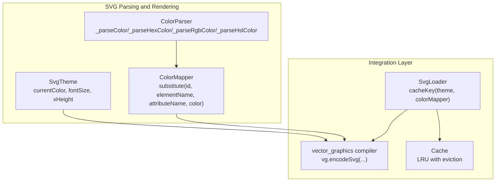
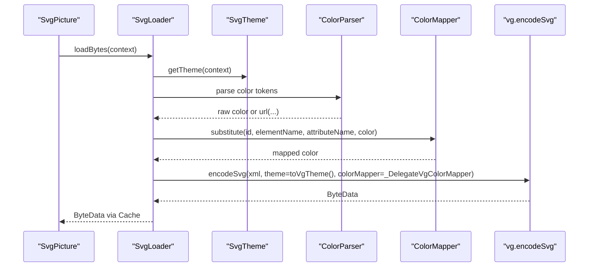
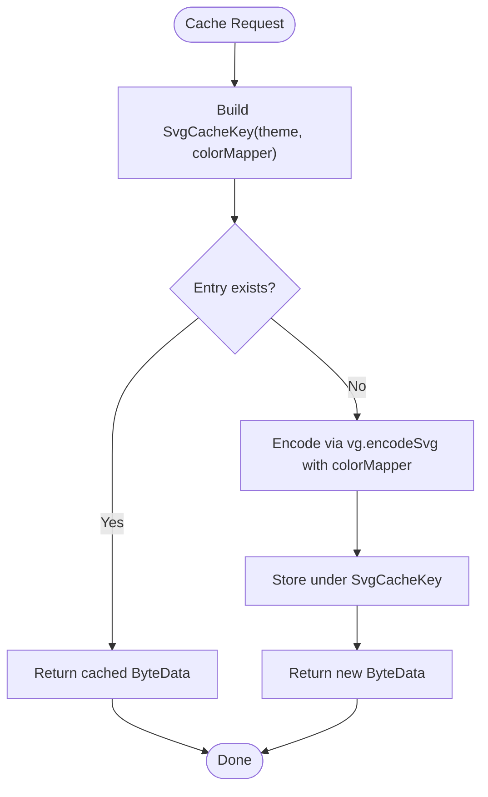
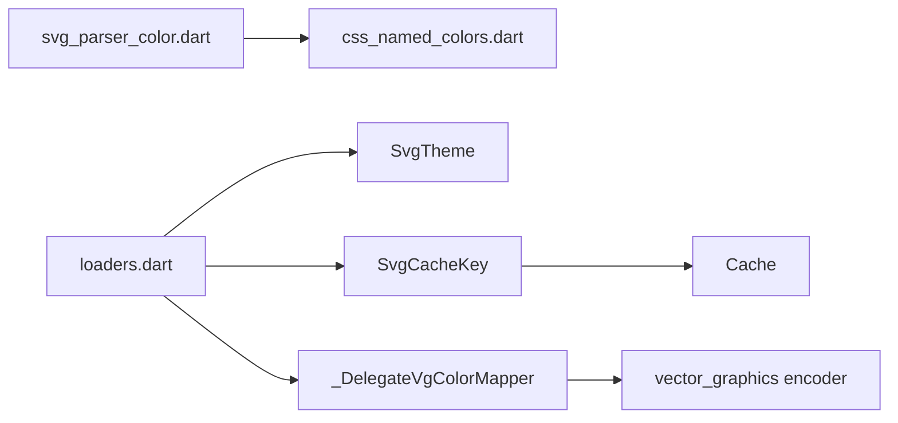

# Color Mapping System

<cite>
**Referenced Files in This Document**
- [loaders.dart](file://lib/src/loaders.dart)
- [svg_parser_color.dart](file://lib/src/animation/svg_parser_color.dart)
- [css_named_colors.dart](file://lib/src/animation/css_named_colors.dart)
- [svg_parser_constants.dart](file://lib/src/animation/svg_parser_constants.dart)
- [svg.dart](file://lib/svg.dart)
- [cache.dart](file://lib/src/cache.dart)
- [widget_svg_test.dart](file://test/widget_svg_test.dart)
- [loaders_test.dart](file://test/loaders_test.dart)
- [README.md](file://README.md)
</cite>

## Table of Contents
1. [Introduction](#introduction)
2. [Project Structure](#project-structure)
3. [Core Components](#core-components)
4. [Architecture Overview](#architecture-overview)
5. [Detailed Component Analysis](#detailed-component-analysis)
6. [Dependency Analysis](#dependency-analysis)
7. [Performance Considerations](#performance-considerations)
8. [Troubleshooting Guide](#troubleshooting-guide)
9. [Conclusion](#conclusion)

## Introduction
This document explains the color mapping system used during SVG parsing and rendering. It covers the ColorMapper interface, how color substitution works during SVG parsing, the parameters and return value of the substitute method, built-in color mapping patterns, and integration with SvgTheme. It also documents immutability requirements for color mappers, caching implications, and performance optimization techniques for large SVG collections.

## Project Structure
The color mapping system spans several modules:
- ColorMapper definition and integration with vector graphics encoding
- SVG theme support for currentColor and font sizing
- SVG color parsing utilities for hex, rgb, rgba, hsl, hsla, and named colors
- Cache integration keyed by theme and color mapper
- Tests demonstrating color mapping behavior and cache invalidation

**Diagram sources**
- [loaders.dart:81-116](file://lib/src/loaders.dart#L81-L116)
- [svg_parser_color.dart:4-281](file://lib/src/animation/svg_parser_color.dart#L4-L281)
- [css_named_colors.dart:4-155](file://lib/src/animation/css_named_colors.dart#L4-L155)
- [cache.dart:65-110](file://lib/src/cache.dart#L65-L110)

**Section sources**
- [loaders.dart:15-116](file://lib/src/loaders.dart#L15-L116)
- [svg_parser_color.dart:4-281](file://lib/src/animation/svg_parser_color.dart#L4-L281)
- [css_named_colors.dart:4-155](file://lib/src/animation/css_named_colors.dart#L4-L155)
- [cache.dart:1-111](file://lib/src/cache.dart#L1-L111)

## Core Components
- ColorMapper: An abstract, immutable interface that transforms parsed colors during SVG decoding. Its substitute method receives contextual metadata and returns a new color.
- SvgTheme: Encapsulates currentColor and font metrics used for resolving currentColor and em/ex units.
- Color parsing utilities: Parse hex (#RGB, #RGBA, #RRGGBB, #RRGGBBAA), rgb/rgba, hsl/hsla, named colors, and handle fallbacks.
- SvgLoader and cache key: Include theme and colorMapper in the cache key to ensure separate caches per mapper/theme combination.
- Integration: The vector graphics encoder accepts a color mapper delegate that wraps the Flutter ColorMapper.

Key responsibilities:
- ColorMapper.immutable: Required for safe caching.
- ColorMapper.substitute: Called for each color attribute encountered during parsing.
- SvgTheme.toVgTheme: Bridges Flutter theme to vector graphics theme.
- Cache.putIfAbsent: Uses SvgCacheKey(theme, colorMapper) to partition cache entries.

**Section sources**
- [loaders.dart:81-116](file://lib/src/loaders.dart#L81-L116)
- [loaders.dart:196-230](file://lib/src/loaders.dart#L196-L230)
- [cache.dart:65-110](file://lib/src/cache.dart#L65-L110)
- [svg.dart:26-45](file://lib/svg.dart#L26-L45)

## Architecture Overview
The color mapping pipeline integrates parsing, theme resolution, and vector graphics encoding:

**Diagram sources**
- [loaders.dart:156-187](file://lib/src/loaders.dart#L156-L187)
- [loaders.dart:47-54](file://lib/src/loaders.dart#L47-L54)
- [svg_parser_color.dart:4-42](file://lib/src/animation/svg_parser_color.dart#L4-L42)
- [loaders.dart:96-116](file://lib/src/loaders.dart#L96-L116)

## Detailed Component Analysis

### ColorMapper Interface and Implementation Patterns
- Definition: Immutable abstract class with a const constructor and a substitute method that takes contextual parameters and returns a new color.
- Delegate wrapper: _DelegateVgColorMapper adapts the Flutter ColorMapper to the vector graphics ColorMapper interface.
- Usage: SvgLoader passes the delegate to vg.encodeSvg when provided.

Implementation pattern highlights:
- Immutable contract: Ensures safe caching because the mapper is part of the cache key.
- Context-aware mapping: substitute receives id, elementName, attributeName, and the original color, enabling conditional transformations.
- Return value: The returned color replaces the original during decoding.

Practical examples (see tests):
- Conditional replacement based on exact color equality
- Dynamic mapping for testing and theme switching

**Section sources**
- [loaders.dart:81-94](file://lib/src/loaders.dart#L81-L94)
- [loaders.dart:96-116](file://lib/src/loaders.dart#L96-L116)
- [widget_svg_test.dart:44-69](file://test/widget_svg_test.dart#L44-L69)

### Color Parsing During SVG Parsing
The parser supports:
- Paint server references (url(...))
- none/transparent
- Named colors (CSS keywords)
- Hex formats (#RGB, #RGBA, #RRGGBB, #RRGGBBAA)
- rgb/rgba with percentage or absolute channels and optional alpha
- hsl/hsla with hue units (deg/rad/turn/gradians) and optional alpha

Fallback behavior:
- Unsupported formats fall back to a baseline color.

Constants:
- _colorAttributes enumerates attributes that carry color values (e.g., fill, stroke, stop-color).

**Section sources**
- [svg_parser_color.dart:4-42](file://lib/src/animation/svg_parser_color.dart#L4-L42)
- [svg_parser_color.dart:44-79](file://lib/src/animation/svg_parser_color.dart#L44-L79)
- [svg_parser_color.dart:81-119](file://lib/src/animation/svg_parser_color.dart#L81-L119)
- [svg_parser_color.dart:121-156](file://lib/src/animation/svg_parser_color.dart#L121-L156)
- [svg_parser_constants.dart:30-36](file://lib/src/animation/svg_parser_constants.dart#L30-L36)
- [css_named_colors.dart:4-155](file://lib/src/animation/css_named_colors.dart#L4-L155)

### Integration with SvgTheme
- SvgTheme holds currentColor, fontSize, and xHeight.
- toVgTheme bridges to vector graphics’ theme type.
- Theme affects currentColor resolution and em/ex unit calculations.
- Cache keys include theme to prevent cross-theme collisions.

**Section sources**
- [loaders.dart:17-74](file://lib/src/loaders.dart#L17-L74)
- [loaders.dart:196-230](file://lib/src/loaders.dart#L196-L230)
- [loaders_test.dart:25-36](file://test/loaders_test.dart#L25-L36)

### Built-in Color Mappers and Custom Implementations
- Built-in: None in the analyzed code; the system exposes the ColorMapper interface and delegates to vector graphics.
- Custom: Users implement ColorMapper.substitute with any mapping logic (e.g., theme switching, brand palette mapping).
- Example usage: README demonstrates a custom mapper passed to SvgPicture.

**Section sources**
- [loaders.dart:81-94](file://lib/src/loaders.dart#L81-L94)
- [README.md:46-78](file://README.md#L46-L78)

### Practical Examples

#### Color Theme Switching
- Use a ColorMapper to replace base colors with theme-appropriate variants.
- Example pattern: Replace primary palette colors with alternate palette colors depending on mode or brand.

**Section sources**
- [widget_svg_test.dart:163-184](file://test/widget_svg_test.dart#L163-L184)

#### Dynamic Color Replacement
- Apply conditional logic inside substitute to transform specific colors dynamically (e.g., invert dark mode, adjust transparency).

**Section sources**
- [widget_svg_test.dart:44-69](file://test/widget_svg_test.dart#L44-L69)

#### Conditional Color Transformations
- Use elementName and attributeName to restrict transformations to specific attributes (e.g., only fill, not stroke).
- Use id to target specific elements.

**Section sources**
- [loaders.dart:88-93](file://lib/src/loaders.dart#L88-L93)

### Immutable Requirement and Caching Implications
- ColorMapper is annotated immutable to ensure safe caching.
- SvgLoader includes colorMapper in SvgCacheKey, ensuring distinct cache entries per mapper.
- Cache.putIfAbsent uses the composite key (theme + colorMapper) to avoid collisions.
- Tests confirm that changing colorMapper or theme yields different cached entries.

**Diagram sources**
- [loaders.dart:196-230](file://lib/src/loaders.dart#L196-L230)
- [loaders.dart:156-187](file://lib/src/loaders.dart#L156-L187)
- [cache.dart:65-110](file://lib/src/cache.dart#L65-L110)

**Section sources**
- [loaders.dart:76-80](file://lib/src/loaders.dart#L76-L80)
- [loaders.dart:196-230](file://lib/src/loaders.dart#L196-L230)
- [loaders_test.dart:16-36](file://test/loaders_test.dart#L16-L36)
- [cache.dart:65-110](file://lib/src/cache.dart#L65-L110)

## Dependency Analysis
- ColorParser depends on cssNamedColors for named color keywords.
- SvgLoader composes SvgTheme and ColorMapper into SvgCacheKey.
- Vector graphics encoder consumes a delegate wrapper around ColorMapper.
- Cache stores ByteData keyed by SvgCacheKey.

**Diagram sources**
- [svg_parser_color.dart:4-42](file://lib/src/animation/svg_parser_color.dart#L4-L42)
- [css_named_colors.dart:4-155](file://lib/src/animation/css_named_colors.dart#L4-L155)
- [loaders.dart:17-116](file://lib/src/loaders.dart#L17-L116)
- [loaders.dart:196-230](file://lib/src/loaders.dart#L196-L230)
- [cache.dart:65-110](file://lib/src/cache.dart#L65-L110)

**Section sources**
- [svg_parser_color.dart:4-42](file://lib/src/animation/svg_parser_color.dart#L4-L42)
- [css_named_colors.dart:4-155](file://lib/src/animation/css_named_colors.dart#L4-L155)
- [loaders.dart:17-116](file://lib/src/loaders.dart#L17-L116)
- [loaders.dart:196-230](file://lib/src/loaders.dart#L196-L230)
- [cache.dart:65-110](file://lib/src/cache.dart#L65-L110)

## Performance Considerations
- Prefer immutable ColorMapper instances to leverage caching.
- Keep mapping logic efficient; avoid heavy computations per substitute call.
- Use cache.maximumSize appropriately for large collections of SVGs with different themes or mappers.
- Avoid frequent theme or mapper changes to minimize cache churn.

[No sources needed since this section provides general guidance]

## Troubleshooting Guide
Common issues and resolutions:
- Colors not changing: Ensure a ColorMapper is provided and substitute returns a different color for targeted inputs.
- Unexpected cache hits: Changing theme or colorMapper should invalidate entries; verify SvgCacheKey includes both.
- Incorrect currentColor usage: Confirm SvgTheme.currentColor is set and toVgTheme is used by the loader.

**Section sources**
- [loaders_test.dart:16-36](file://test/loaders_test.dart#L16-L36)
- [loaders.dart:196-230](file://lib/src/loaders.dart#L196-L230)
- [loaders.dart:47-54](file://lib/src/loaders.dart#L47-L54)

## Conclusion
The color mapping system provides a flexible, immutable mechanism to transform colors during SVG decoding. By integrating ColorMapper with SvgTheme and vector graphics encoding, it enables robust theme switching, dynamic replacements, and predictable caching. Following the immutable contract and carefully structuring mapping logic ensures optimal performance and correctness across large SVG collections.