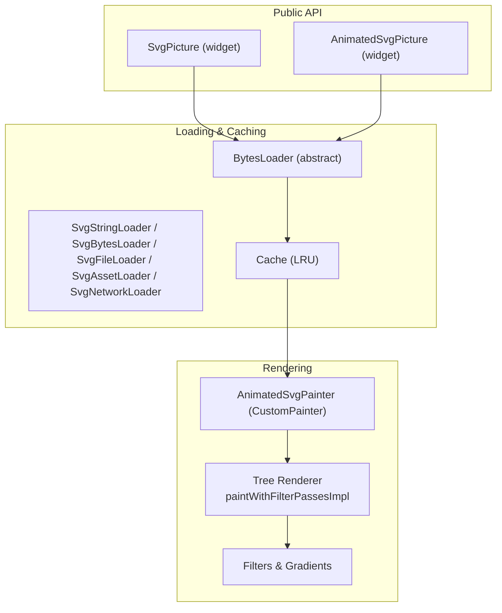
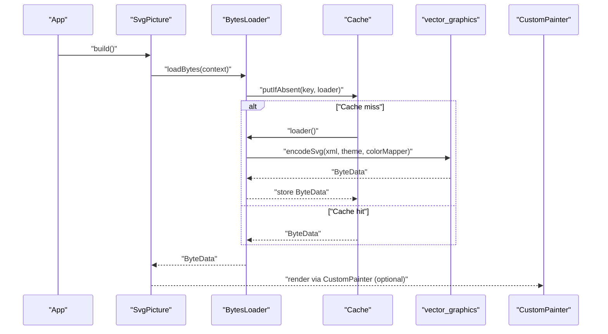
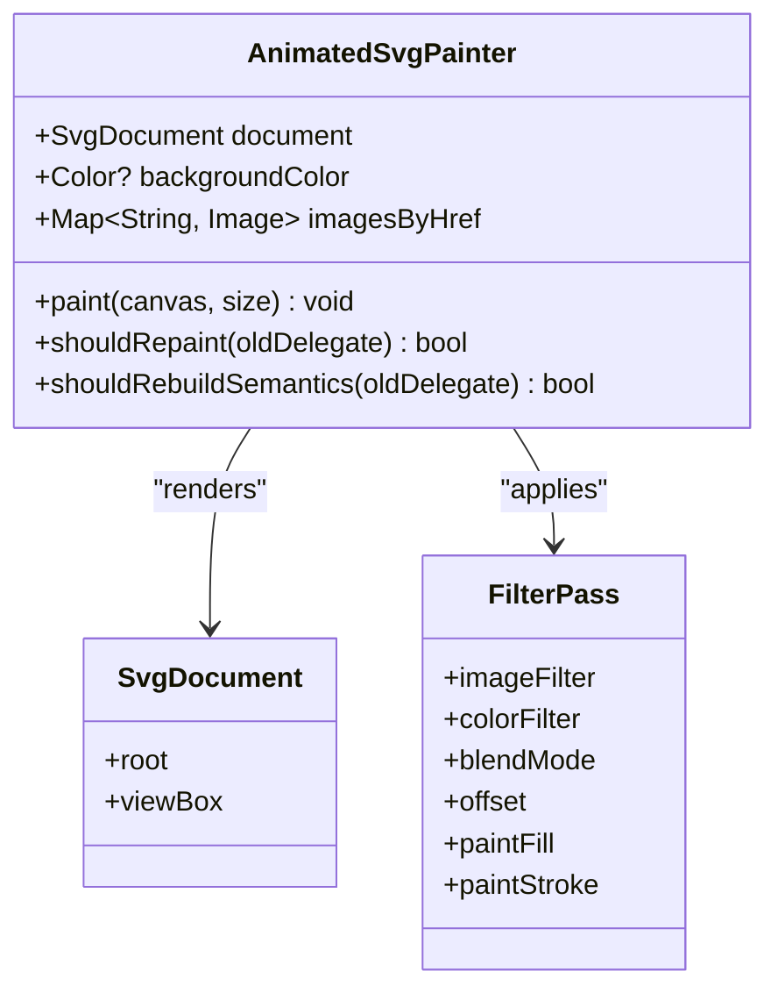
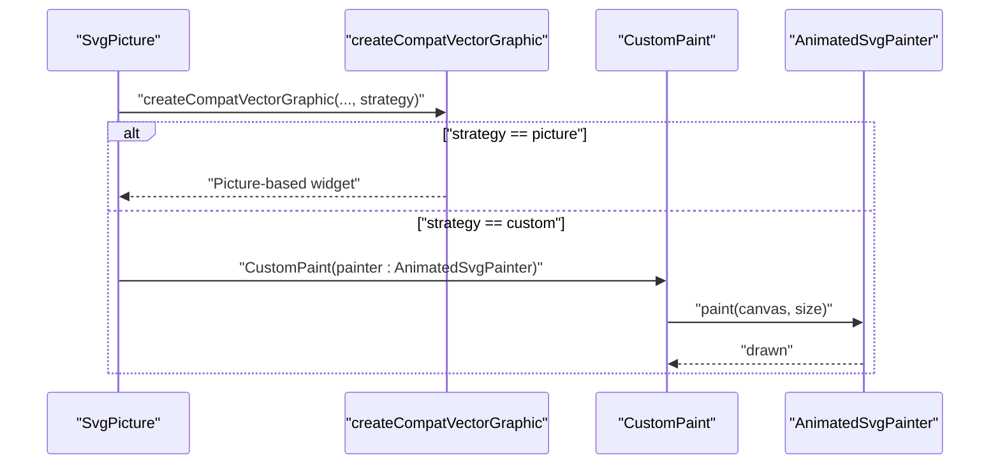
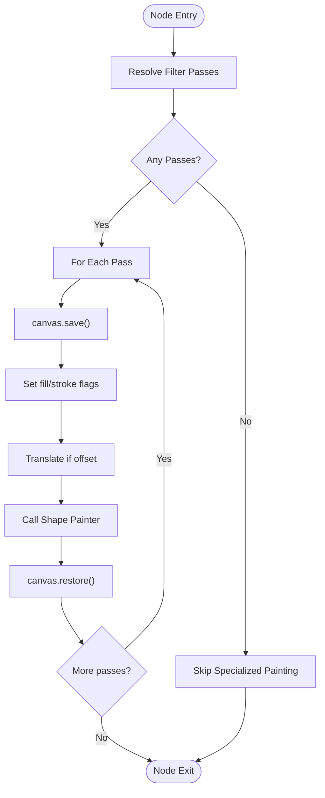
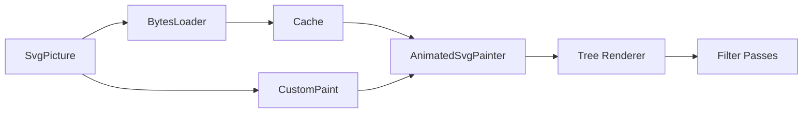

# Custom Paint Strategies

<cite>
**Referenced Files in This Document**
- [svg.dart](file://lib/svg.dart)
- [loaders.dart](file://lib/src/loaders.dart)
- [cache.dart](file://lib/src/cache.dart)
- [animated_svg_painter.dart](file://lib/src/animation/animated_svg_painter.dart)
- [animated_svg_painter_tree.dart](file://lib/src/animation/animated_svg_painter_tree.dart)
- [animated_svg_picture.dart](file://lib/src/animation/animated_svg_picture.dart)
- [animation.dart](file://lib/src/animation.dart)
- [vg.dart](file://lib/svg.dart)
</cite>

## Table of Contents
1. [Introduction](#introduction)
2. [Project Structure](#project-structure)
3. [Core Components](#core-components)
4. [Architecture Overview](#architecture-overview)
5. [Detailed Component Analysis](#detailed-component-analysis)
6. [Dependency Analysis](#dependency-analysis)
7. [Performance Considerations](#performance-considerations)
8. [Troubleshooting Guide](#troubleshooting-guide)
9. [Conclusion](#conclusion)
10. [Appendices](#appendices)

## Introduction
This document explains how to implement custom paint strategies for SVG rendering beyond standard picture-based rendering. It focuses on the painter interface, custom paint methods, and integration with Flutter’s painting system. It covers:
- The painter interface and how to extend it for custom rendering
- Custom paint delegates and how to integrate them with SvgPicture and standalone widgets
- Examples of custom SVG painters and filter-pass rendering
- Performance optimization techniques and memory management considerations
- Integration with existing SvgPicture widgets and standalone custom painting scenarios

## Project Structure
The repository provides a vector-graphics pipeline that decodes SVGs into a compact binary format and exposes a compatibility layer for Flutter widgets. Custom painting is supported via a dedicated CustomPainter and a tree traversal renderer that applies filters, gradients, and transforms.

**Diagram sources**
- [svg.dart:57-627](file://lib/svg.dart#L57-L627)
- [loaders.dart:118-194](file://lib/src/loaders.dart#L118-L194)
- [cache.dart:1-111](file://lib/src/cache.dart#L1-L111)
- [animated_svg_painter.dart:42-126](file://lib/src/animation/animated_svg_painter.dart#L42-L126)
- [animated_svg_painter_tree.dart:279-304](file://lib/src/animation/animated_svg_painter_tree.dart#L279-L304)

**Section sources**
- [svg.dart:57-627](file://lib/svg.dart#L57-L627)
- [loaders.dart:118-194](file://lib/src/loaders.dart#L118-L194)
- [cache.dart:1-111](file://lib/src/cache.dart#L1-L111)
- [animated_svg_painter.dart:42-126](file://lib/src/animation/animated_svg_painter.dart#L42-L126)
- [animated_svg_painter_tree.dart:279-304](file://lib/src/animation/animated_svg_painter_tree.dart#L279-L304)

## Core Components
- SvgPicture: A high-level widget that loads SVG data via BytesLoader implementations and renders via a compatibility vector-graphics pipeline. It supports multiple rendering strategies and integrates with Flutter’s semantics and clipping.
- AnimatedSvgPainter: A CustomPainter that traverses the parsed SVG DOM and paints shapes, text, images, and filters using Flutter’s Canvas API.
- BytesLoader hierarchy: Encapsulates loading from various sources (string, bytes, file, asset, network) and performs decoding in isolates to keep UI responsive.
- Cache: An LRU cache keyed by loader plus theme and color-mapper to avoid repeated decoding and improve performance.

Key responsibilities:
- Loading and decoding SVGs efficiently
- Providing a uniform Picture stream to the Flutter pipeline
- Enabling custom painting with filters, gradients, and transforms
- Managing memory and cache lifecycles

**Section sources**
- [svg.dart:57-627](file://lib/svg.dart#L57-L627)
- [animated_svg_painter.dart:42-126](file://lib/src/animation/animated_svg_painter.dart#L42-L126)
- [loaders.dart:118-194](file://lib/src/loaders.dart#L118-L194)
- [cache.dart:1-111](file://lib/src/cache.dart#L1-L111)

## Architecture Overview
The rendering pipeline converts SVGs into a vector-graphics binary format in an isolate, caches the result, and then either:
- Renders via the compatibility vector-graphics widget (standard path)
- Or uses a CustomPainter for advanced scenarios (custom paint strategies)

**Diagram sources**
- [svg.dart:542-560](file://lib/svg.dart#L542-L560)
- [loaders.dart:156-187](file://lib/src/loaders.dart#L156-L187)
- [cache.dart:65-93](file://lib/src/cache.dart#L65-L93)

**Section sources**
- [svg.dart:542-560](file://lib/svg.dart#L542-L560)
- [loaders.dart:156-187](file://lib/src/loaders.dart#L156-L187)
- [cache.dart:65-93](file://lib/src/cache.dart#L65-L93)

## Detailed Component Analysis

### Painter Interface and Custom Paint Methods
- AnimatedSvgPainter implements CustomPainter and drives the tree traversal renderer. It computes a viewBox-to-widget transform, optionally draws a background, and saves/restores canvas state around each node.
- The tree renderer dispatches to shape-specific methods and supports filter passes that apply image filters, color filters, and blend modes per node.

**Diagram sources**
- [animated_svg_painter.dart:42-126](file://lib/src/animation/animated_svg_painter.dart#L42-L126)
- [animated_svg_painter_tree.dart:279-304](file://lib/src/animation/animated_svg_painter_tree.dart#L279-L304)

**Section sources**
- [animated_svg_painter.dart:42-126](file://lib/src/animation/animated_svg_painter.dart#L42-L126)
- [animated_svg_painter_tree.dart:37-304](file://lib/src/animation/animated_svg_painter_tree.dart#L37-L304)

### Custom Paint Delegates and Integration with SvgPicture
- SvgPicture delegates rendering to a compatibility vector-graphics renderer and supports a renderingStrategy parameter. While the standard path uses picture-based rendering, the CustomPainter path enables advanced scenarios such as overlays, dynamic filters, or hybrid compositing.
- AnimatedSvgPicture wraps AnimatedSvgPainter inside a CustomPaint widget and adds gesture handling for event-driven animations.

**Diagram sources**
- [svg.dart:542-560](file://lib/svg.dart#L542-L560)
- [animated_svg_picture.dart:236-269](file://lib/src/animation/animated_svg_picture.dart#L236-L269)

**Section sources**
- [svg.dart:542-560](file://lib/svg.dart#L542-L560)
- [animated_svg_picture.dart:236-269](file://lib/src/animation/animated_svg_picture.dart#L236-L269)

### Custom SVG Painters and Filter Passes
- The tree renderer applies filter passes per node. Each pass can adjust fill/stroke painting flags, translate offsets, and apply image filters, color filters, and blend modes.
- This mechanism allows implementing advanced effects such as multi-pass filters, color adjustments, and masking without changing the underlying vector-graphics pipeline.

**Diagram sources**
- [animated_svg_painter_tree.dart:279-304](file://lib/src/animation/animated_svg_painter_tree.dart#L279-L304)

**Section sources**
- [animated_svg_painter_tree.dart:279-304](file://lib/src/animation/animated_svg_painter_tree.dart#L279-L304)

### Standalone Custom Painting Scenarios
- You can instantiate AnimatedSvgPainter directly and embed it in a CustomPaint widget to:
  - Compose multiple canvases (e.g., overlay effects)
  - Apply additional Flutter effects around the SVG
  - Integrate with gesture detectors or other interactive widgets
- AnimatedSvgPicture demonstrates this pattern by wrapping CustomPaint with GestureDetector and MouseRegion for pointer events.

**Section sources**
- [animated_svg_picture.dart:236-269](file://lib/src/animation/animated_svg_picture.dart#L236-L269)
- [animated_svg_painter.dart:42-126](file://lib/src/animation/animated_svg_painter.dart#L42-L126)

### Integration with Existing SvgPicture Widgets
- SvgPicture exposes a renderingStrategy parameter and forwards it to the compatibility vector-graphics creation function. When strategy is set to a custom path, you can supply a CustomPainter to achieve specialized rendering.
- The BytesLoader hierarchy ensures decoding happens off the UI thread and caches results for reuse.

**Section sources**
- [svg.dart:534-560](file://lib/svg.dart#L534-L560)
- [loaders.dart:118-194](file://lib/src/loaders.dart#L118-L194)

## Dependency Analysis
The following diagram shows key dependencies among components involved in custom paint strategies.

**Diagram sources**
- [svg.dart:57-627](file://lib/svg.dart#L57-L627)
- [loaders.dart:118-194](file://lib/src/loaders.dart#L118-L194)
- [cache.dart:1-111](file://lib/src/cache.dart#L1-L111)
- [animated_svg_painter.dart:42-126](file://lib/src/animation/animated_svg_painter.dart#L42-L126)
- [animated_svg_painter_tree.dart:279-304](file://lib/src/animation/animated_svg_painter_tree.dart#L279-L304)

**Section sources**
- [svg.dart:57-627](file://lib/svg.dart#L57-L627)
- [loaders.dart:118-194](file://lib/src/loaders.dart#L118-L194)
- [cache.dart:1-111](file://lib/src/cache.dart#L1-L111)
- [animated_svg_painter.dart:42-126](file://lib/src/animation/animated_svg_painter.dart#L42-L126)
- [animated_svg_painter_tree.dart:279-304](file://lib/src/animation/animated_svg_painter_tree.dart#L279-L304)

## Performance Considerations
- Off-the-main-thread decoding: BytesLoader.encodeSvg runs in an isolate to avoid blocking the UI thread. This improves responsiveness for large or complex SVGs.
- Caching: Cache stores decoded ByteData keyed by loader, theme, and color mapper. Adjust maximumSize to balance memory usage and hit rate.
- Filter passes: Applying multiple filter passes increases draw cost. Minimize the number of passes and reuse computed filters when possible.
- Repainting: AnimatedSvgPainter overrides shouldRepaint to return true, ensuring frames update with animations. For static scenes, consider a picture-based strategy to reduce per-frame work.
- Memory management: Clear or evict cache entries when themes or color mappers change. Avoid retaining large images in imagesByHref beyond their lifetime.

[No sources needed since this section provides general guidance]

## Troubleshooting Guide
- Unexpected layout shifts: Ensure fixed width/height or tight layout constraints when using SvgPicture to prevent layout thrashing during decode.
- Incorrect colors or inherited values: Verify SvgTheme and colorMapper settings. Theme changes invalidate cache entries; ensure cache eviction occurs when switching themes.
- Overdraw and performance regressions: Reduce filter passes and avoid unnecessary save/restore cycles. Prefer picture-based rendering for static content.
- Pointer events not firing: When wrapping CustomPaint with gesture detectors, ensure the hit-testing area matches the SVG geometry and that semantics are configured appropriately.

**Section sources**
- [svg.dart:58-102](file://lib/svg.dart#L58-L102)
- [loaders.dart:14-194](file://lib/src/loaders.dart#L14-L194)
- [cache.dart:42-58](file://lib/src/cache.dart#L42-L58)

## Conclusion
Custom paint strategies in this codebase center on AnimatedSvgPainter and the tree renderer that applies filter passes and transforms. By leveraging BytesLoader and Cache, you can implement efficient, customizable rendering paths that integrate seamlessly with SvgPicture and standalone widgets. For advanced scenarios—such as overlays, multi-pass filters, or hybrid compositing—use CustomPaint with AnimatedSvgPainter and carefully manage performance and memory.

[No sources needed since this section summarizes without analyzing specific files]

## Appendices

### Appendix A: Exported Vector Graphics Utilities
- The library re-exports vector graphics utilities and types to support advanced rendering and decoding workflows.

**Section sources**
- [vg.dart:12-13](file://lib/svg.dart#L12-L13)

### Appendix B: Animation and Painting Integration
- The animation module exports the painter and picture widgets, enabling SMIL-based animations with custom painting capabilities.

**Section sources**
- [animation.dart:21-31](file://lib/src/animation.dart#L21-L31)