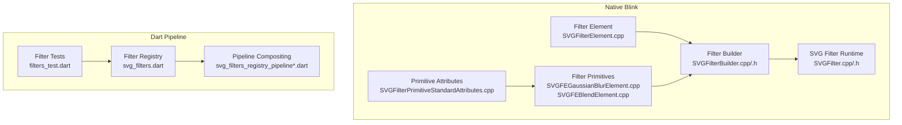
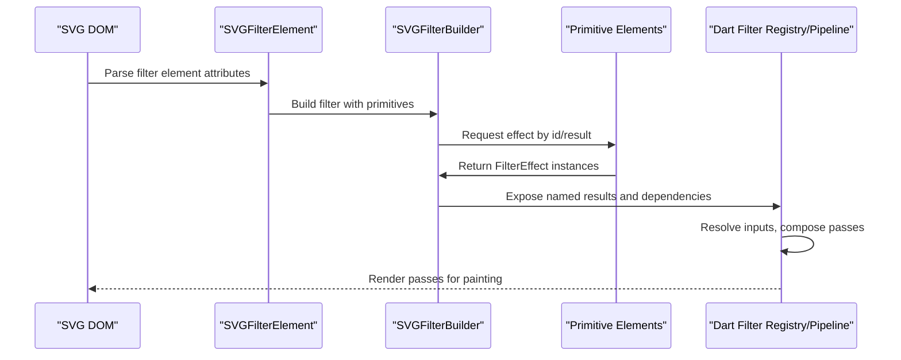
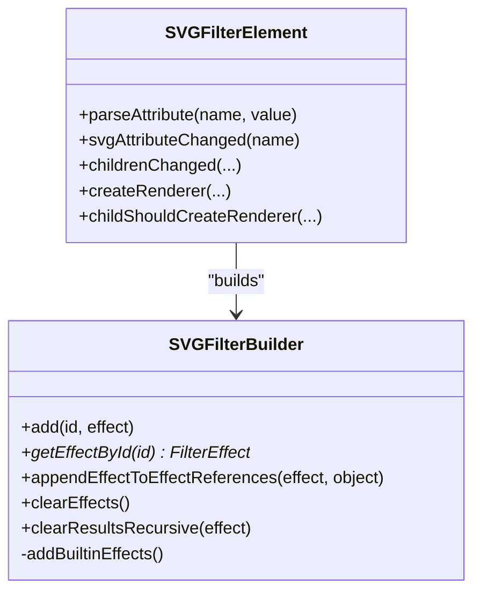
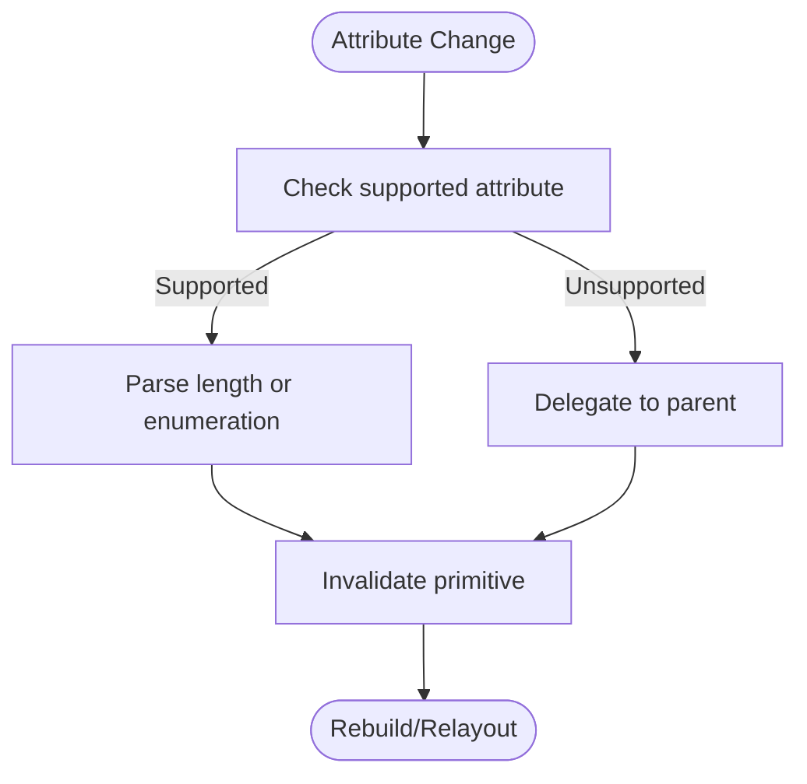
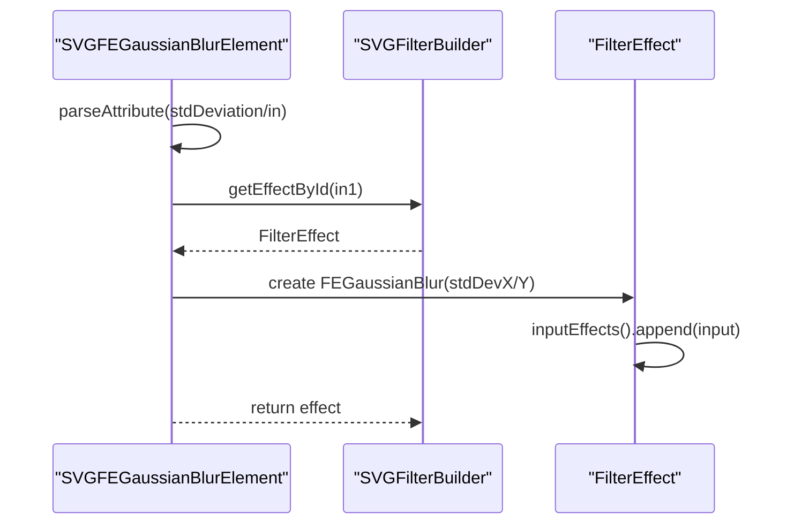
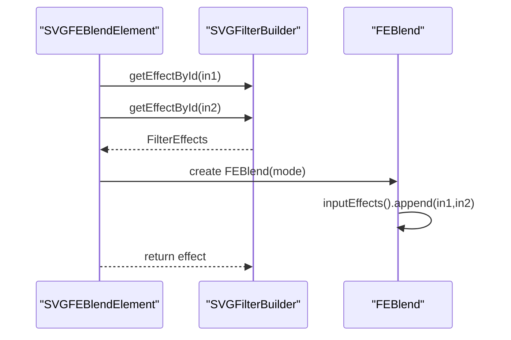
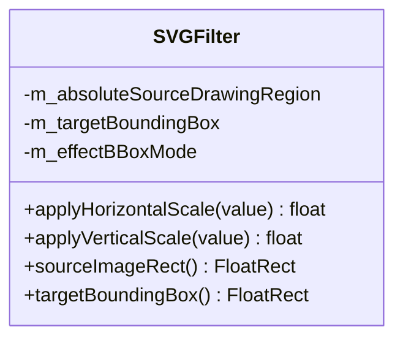
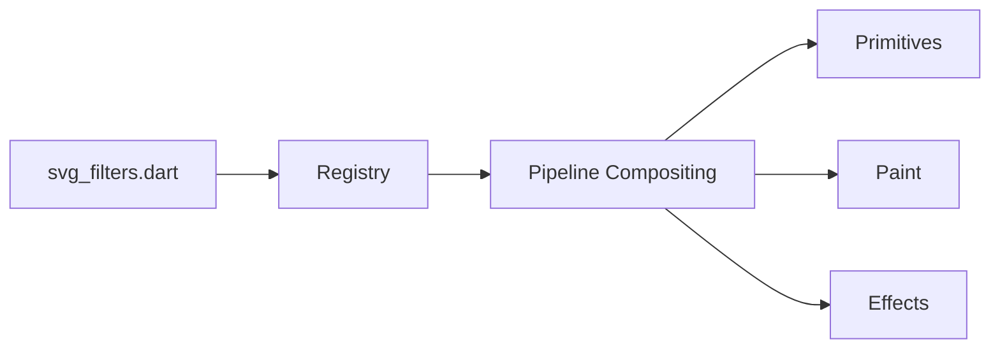
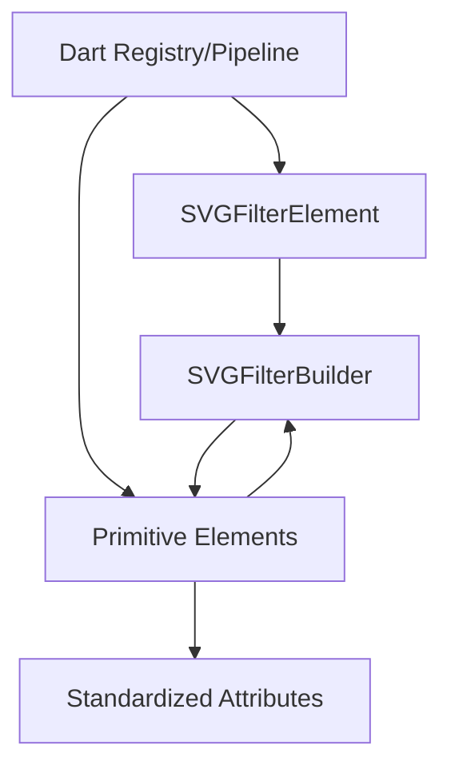

# Filter Effects System

<cite>
**Referenced Files in This Document**
- [SVGFilter.cpp](file://blink-b87d44f-Source-core-svg/graphics/filters/SVGFilter.cpp)
- [SVGFilter.h](file://blink-b87d44f-Source-core-svg/graphics/filters/SVGFilter.h)
- [SVGFilterBuilder.cpp](file://blink-b87d44f-Source-core-svg/graphics/filters/SVGFilterBuilder.cpp)
- [SVGFilterBuilder.h](file://blink-b87d44f-Source-core-svg/graphics/filters/SVGFilterBuilder.h)
- [SVGFilterElement.cpp](file://blink-b87d44f-Source-core-svg/SVGFilterElement.cpp)
- [SVGFilterPrimitiveStandardAttributes.cpp](file://blink-b87d44f-Source-core-svg/SVGFilterPrimitiveStandardAttributes.cpp)
- [SVGFEGaussianBlurElement.cpp](file://blink-b87d44f-Source-core-svg/SVGFEGaussianBlurElement.cpp)
- [SVGFEBlendElement.cpp](file://blink-b87d44f-Source-core-svg/SVGFEBlendElement.cpp)
- [SVGSMILElement.cpp](file://blink-b87d44f-Source-core-svg/animation/SVGSMILElement.cpp)
- [filters_test.dart](file://test/animation/filters_test.dart)
- [svg_filters.dart](file://lib/src/animation/svg_filters.dart)
</cite>

## Table of Contents
1. [Introduction](#introduction)
2. [Project Structure](#project-structure)
3. [Core Components](#core-components)
4. [Architecture Overview](#architecture-overview)
5. [Detailed Component Analysis](#detailed-component-analysis)
6. [Dependency Analysis](#dependency-analysis)
7. [Performance Considerations](#performance-considerations)
8. [Troubleshooting Guide](#troubleshooting-guide)
9. [Conclusion](#conclusion)
10. [Appendices](#appendices)

## Introduction
This document describes the SVG filter effects system implemented in the Blink-based engine and its Dart-side integration. It covers filter primitives, effect chaining, filter composition patterns, attribute handling, performance characteristics, GPU acceleration considerations, and animation integration. Practical examples demonstrate building custom filters, combining multiple effects, and applying filters to different SVG elements. Guidance is also provided on filter caching strategies and dynamic effects via the animation system.

## Project Structure
The filter system spans native Blink components and a Dart-side pipeline:
- Native Blink filter runtime: filter definition, primitive elements, and builder logic
- Dart-side filter registry and pipeline: parsing, composition, and rendering integration
- Animation integration: SMIL-based attribute updates driving filter changes

**Diagram sources**
- [SVGFilterElement.cpp:1-240](file://blink-b87d44f-Source-core-svg/SVGFilterElement.cpp#L1-L240)
- [SVGFilterBuilder.cpp:1-107](file://blink-b87d44f-Source-core-svg/graphics/filters/SVGFilterBuilder.cpp#L1-L107)
- [SVGFilter.cpp:1-58](file://blink-b87d44f-Source-core-svg/graphics/filters/SVGFilter.cpp#L1-L58)
- [SVGFEGaussianBlurElement.cpp:1-144](file://blink-b87d44f-Source-core-svg/SVGFEGaussianBlurElement.cpp#L1-L144)
- [SVGFEBlendElement.cpp:1-145](file://blink-b87d44f-Source-core-svg/SVGFEBlendElement.cpp#L1-L145)
- [SVGFilterPrimitiveStandardAttributes.cpp:1-176](file://blink-b87d44f-Source-core-svg/SVGFilterPrimitiveStandardAttributes.cpp#L1-L176)
- [svg_filters.dart:1-19](file://lib/src/animation/svg_filters.dart#L1-L19)
- [filters_test.dart:1-2165](file://test/animation/filters_test.dart#L1-L2165)

**Section sources**
- [SVGFilterElement.cpp:1-240](file://blink-b87d44f-Source-core-svg/SVGFilterElement.cpp#L1-L240)
- [SVGFilterBuilder.cpp:1-107](file://blink-b87d44f-Source-core-svg/graphics/filters/SVGFilterBuilder.cpp#L1-L107)
- [SVGFilter.cpp:1-58](file://blink-b87d44f-Source-core-svg/graphics/filters/SVGFilter.cpp#L1-L58)
- [SVGFEGaussianBlurElement.cpp:1-144](file://blink-b87d44f-Source-core-svg/SVGFEGaussianBlurElement.cpp#L1-L144)
- [SVGFEBlendElement.cpp:1-145](file://blink-b87d44f-Source-core-svg/SVGFEBlendElement.cpp#L1-L145)
- [SVGFilterPrimitiveStandardAttributes.cpp:1-176](file://blink-b87d44f-Source-core-svg/SVGFilterPrimitiveStandardAttributes.cpp#L1-L176)
- [svg_filters.dart:1-19](file://lib/src/animation/svg_filters.dart#L1-L19)
- [filters_test.dart:1-2165](file://test/animation/filters_test.dart#L1-L2165)

## Core Components
- Filter element: defines filter geometry, units, resolution, and hosts primitive children
- Filter builder: collects built effects, manages named results, and tracks dependencies
- SVG filter runtime: applies scaling and transforms, computes regions
- Primitive elements: blur, blend, and others expose standardized attributes and build filter effects
- Standardized primitive attributes: x, y, width, height, result, with length parsing and invalidation
- Dart filter registry and pipeline: parses SVG filter definitions, composes primitives, resolves inputs, and produces render passes

Key responsibilities:
- Attribute parsing and invalidation trigger revalidation of filter effects
- Named results enable chaining and composition across primitives
- Resolution and unit handling ensure predictable rasterization

**Section sources**
- [SVGFilterElement.cpp:37-102](file://blink-b87d44f-Source-core-svg/SVGFilterElement.cpp#L37-L102)
- [SVGFilterBuilder.cpp:31-91](file://blink-b87d44f-Source-core-svg/graphics/filters/SVGFilterBuilder.cpp#L31-L91)
- [SVGFilter.cpp:28-55](file://blink-b87d44f-Source-core-svg/graphics/filters/SVGFilter.cpp#L28-L55)
- [SVGFilterPrimitiveStandardAttributes.cpp:34-102](file://blink-b87d44f-Source-core-svg/SVGFilterPrimitiveStandardAttributes.cpp#L34-L102)
- [SVGFEGaussianBlurElement.cpp:33-109](file://blink-b87d44f-Source-core-svg/SVGFEGaussianBlurElement.cpp#L33-L109)
- [SVGFEBlendElement.cpp:32-104](file://blink-b87d44f-Source-core-svg/SVGFEBlendElement.cpp#L32-L104)

## Architecture Overview
The filter architecture integrates native Blink filter primitives with a Dart pipeline that resolves and composes filter chains into render passes. The native layer handles attribute parsing, effect construction, and region calculations. The Dart layer parses SVG filter definitions, builds a registry of primitives, resolves inputs and named results, and produces optimized rendering sequences.

**Diagram sources**
- [SVGFilterElement.cpp:176-190](file://blink-b87d44f-Source-core-svg/SVGFilterElement.cpp#L176-L190)
- [SVGFilterBuilder.cpp:38-65](file://blink-b87d44f-Source-core-svg/graphics/filters/SVGFilterBuilder.cpp#L38-L65)
- [SVGFEGaussianBlurElement.cpp:128-141](file://blink-b87d44f-Source-core-svg/SVGFEGaussianBlurElement.cpp#L128-L141)
- [SVGFEBlendElement.cpp:128-142](file://blink-b87d44f-Source-core-svg/SVGFEBlendElement.cpp#L128-L142)
- [svg_filters.dart:1-19](file://lib/src/animation/svg_filters.dart#L1-L19)

## Detailed Component Analysis

### Filter Element and Builder
- Filter element defines filter geometry, units, resolution, and validates children
- Builder maintains builtin effects (source graphic/alpha), named results, and references between dependent effects
- Clearing effects and recursive result clearing ensures clean rebuilds

**Diagram sources**
- [SVGFilterElement.cpp:104-190](file://blink-b87d44f-Source-core-svg/SVGFilterElement.cpp#L104-L190)
- [SVGFilterBuilder.h:35-79](file://blink-b87d44f-Source-core-svg/graphics/filters/SVGFilterBuilder.h#L35-L79)

**Section sources**
- [SVGFilterElement.cpp:104-190](file://blink-b87d44f-Source-core-svg/SVGFilterElement.cpp#L104-L190)
- [SVGFilterBuilder.cpp:31-104](file://blink-b87d44f-Source-core-svg/graphics/filters/SVGFilterBuilder.cpp#L31-L104)
- [SVGFilterBuilder.h:35-79](file://blink-b87d44f-Source-core-svg/graphics/filters/SVGFilterBuilder.h#L35-L79)

### Standardized Primitive Attributes
- Primitives inherit standardized attributes: x, y, width, height, result
- Length parsing supports percentages and units
- Attribute changes trigger invalidation and re-layout

**Diagram sources**
- [SVGFilterPrimitiveStandardAttributes.cpp:62-113](file://blink-b87d44f-Source-core-svg/SVGFilterPrimitiveStandardAttributes.cpp#L62-L113)

**Section sources**
- [SVGFilterPrimitiveStandardAttributes.cpp:62-113](file://blink-b87d44f-Source-core-svg/SVGFilterPrimitiveStandardAttributes.cpp#L62-L113)

### Blur Primitive
- Supports in/in2 semantics and std deviation attributes
- Validates non-negative deviations and constructs Gaussian blur effect
- Registers animated properties for std deviation and in

**Diagram sources**
- [SVGFEGaussianBlurElement.cpp:77-141](file://blink-b87d44f-Source-core-svg/SVGFEGaussianBlurElement.cpp#L77-L141)

**Section sources**
- [SVGFEGaussianBlurElement.cpp:77-141](file://blink-b87d44f-Source-core-svg/SVGFEGaussianBlurElement.cpp#L77-L141)

### Blend Primitive
- Supports two inputs and blend mode enumeration
- Sets blend mode on the underlying effect
- Animated properties include in1, in2, and mode

**Diagram sources**
- [SVGFEBlendElement.cpp:58-142](file://blink-b87d44f-Source-core-svg/SVGFEBlendElement.cpp#L58-L142)

**Section sources**
- [SVGFEBlendElement.cpp:58-142](file://blink-b87d44f-Source-core-svg/SVGFEBlendElement.cpp#L58-L142)

### Filter Runtime and Regions
- Applies horizontal/vertical scaling based on effect bounding box mode
- Computes absolute source drawing region and target bounding box
- Provides source image rectangle and target bounding box for downstream use

**Diagram sources**
- [SVGFilter.cpp:28-55](file://blink-b87d44f-Source-core-svg/graphics/filters/SVGFilter.cpp#L28-L55)
- [SVGFilter.h:35-51](file://blink-b87d44f-Source-core-svg/graphics/filters/SVGFilter.h#L35-L51)

**Section sources**
- [SVGFilter.cpp:28-55](file://blink-b87d44f-Source-core-svg/graphics/filters/SVGFilter.cpp#L28-L55)
- [SVGFilter.h:35-51](file://blink-b87d44f-Source-core-svg/graphics/filters/SVGFilter.h#L35-L51)

### Dart Filter Registry and Pipeline
- Exposes filter registry and pipeline parts for composing primitives
- Tests demonstrate parsing of multiple primitives, chaining, and resolving paint passes
- Supports named results, explicit inputs, and fallback behaviors

**Diagram sources**
- [svg_filters.dart:1-19](file://lib/src/animation/svg_filters.dart#L1-L19)

**Section sources**
- [svg_filters.dart:1-19](file://lib/src/animation/svg_filters.dart#L1-L19)
- [filters_test.dart:1-2165](file://test/animation/filters_test.dart#L1-L2165)

## Dependency Analysis
- Filter element depends on attribute parsing and renderer creation
- Builder depends on primitive elements and maintains effect references
- Primitives depend on standardized attributes and builder lookup
- Dart pipeline depends on registry and tests validate composition and pass resolution

**Diagram sources**
- [SVGFilterElement.cpp:176-229](file://blink-b87d44f-Source-core-svg/SVGFilterElement.cpp#L176-L229)
- [SVGFilterBuilder.cpp:31-91](file://blink-b87d44f-Source-core-svg/graphics/filters/SVGFilterBuilder.cpp#L31-L91)
- [SVGFilterPrimitiveStandardAttributes.cpp:123-142](file://blink-b87d44f-Source-core-svg/SVGFilterPrimitiveStandardAttributes.cpp#L123-L142)
- [SVGFEGaussianBlurElement.cpp:128-141](file://blink-b87d44f-Source-core-svg/SVGFEGaussianBlurElement.cpp#L128-L141)
- [SVGFEBlendElement.cpp:128-142](file://blink-b87d44f-Source-core-svg/SVGFEBlendElement.cpp#L128-L142)
- [svg_filters.dart:1-19](file://lib/src/animation/svg_filters.dart#L1-L19)

**Section sources**
- [SVGFilterElement.cpp:176-229](file://blink-b87d44f-Source-core-svg/SVGFilterElement.cpp#L176-L229)
- [SVGFilterBuilder.cpp:31-91](file://blink-b87d44f-Source-core-svg/graphics/filters/SVGFilterBuilder.cpp#L31-L91)
- [SVGFilterPrimitiveStandardAttributes.cpp:123-142](file://blink-b87d44f-Source-core-svg/SVGFilterPrimitiveStandardAttributes.cpp#L123-L142)
- [SVGFEGaussianBlurElement.cpp:128-141](file://blink-b87d44f-Source-core-svg/SVGFEGaussianBlurElement.cpp#L128-L141)
- [SVGFEBlendElement.cpp:128-142](file://blink-b87d44f-Source-core-svg/SVGFEBlendElement.cpp#L128-L142)
- [svg_filters.dart:1-19](file://lib/src/animation/svg_filters.dart#L1-L19)

## Performance Considerations
- Resolution and units: filter resolution and primitive units influence rasterization cost and quality
- Effect bounding box mode: scales parameters based on target bounding box dimensions
- Chaining and named results: minimize intermediate allocations by reusing named results
- GPU acceleration: prefer vector-friendly primitives (offset, tile) and avoid excessive blur radii
- Caching: reuse filter results when inputs and attributes are unchanged; clear results recursively when dependencies change

[No sources needed since this section provides general guidance]

## Troubleshooting Guide
Common issues and resolutions:
- Unresolved inputs: ensure named results exist and are declared before use; explicit “none” and “background” inputs are supported
- Attribute parsing errors: verify lengths and enumerations conform to spec; invalid values can prevent effect creation
- Invalidation loops: attribute changes trigger invalidation; avoid excessive churn by batching updates
- Animation-driven updates: SMIL animations update attributes; ensure targets are valid and referenced elements exist

**Section sources**
- [SVGFilterPrimitiveStandardAttributes.cpp:75-95](file://blink-b87d44f-Source-core-svg/SVGFilterPrimitiveStandardAttributes.cpp#L75-L95)
- [SVGFEBlendElement.cpp:106-126](file://blink-b87d44f-Source-core-svg/SVGFEBlendElement.cpp#L106-L126)
- [SVGFEGaussianBlurElement.cpp:111-126](file://blink-b87d44f-Source-core-svg/SVGFEGaussianBlurElement.cpp#L111-L126)
- [SVGSMILElement.cpp:480-510](file://blink-b87d44f-Source-core-svg/animation/SVGSMILElement.cpp#L480-L510)

## Conclusion
The SVG filter effects system combines a robust native Blink implementation with a flexible Dart pipeline. It supports standardized primitives, effect chaining, and dynamic attribute updates via SMIL. By leveraging named results, careful resolution handling, and appropriate caching, applications can achieve efficient and visually rich filter compositions across diverse SVG elements.

## Appendices

### Practical Examples Index
- Creating a blur filter and applying it to an element
- Combining blur and offset to produce a soft shadow
- Using blend and composite primitives for layered effects
- Applying filters to fill/stroke channels with background inputs
- Animating filter attributes for dynamic effects

**Section sources**
- [filters_test.dart:10-29](file://test/animation/filters_test.dart#L10-L29)
- [filters_test.dart:720-742](file://test/animation/filters_test.dart#L720-L742)
- [filters_test.dart:1106-1127](file://test/animation/filters_test.dart#L1106-L1127)
- [filters_test.dart:1928-1966](file://test/animation/filters_test.dart#L1928-L1966)
- [SVGSMILElement.cpp:480-510](file://blink-b87d44f-Source-core-svg/animation/SVGSMILElement.cpp#L480-L510)