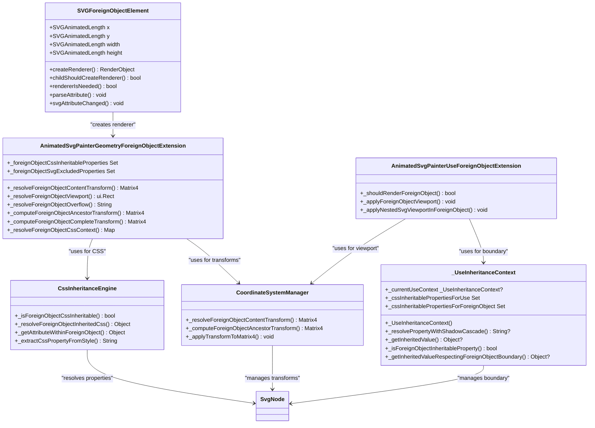
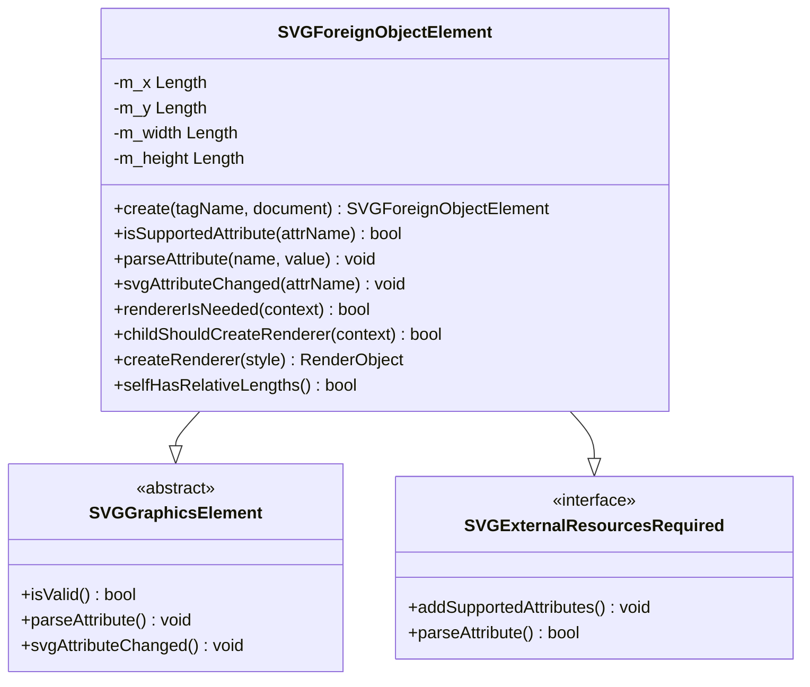
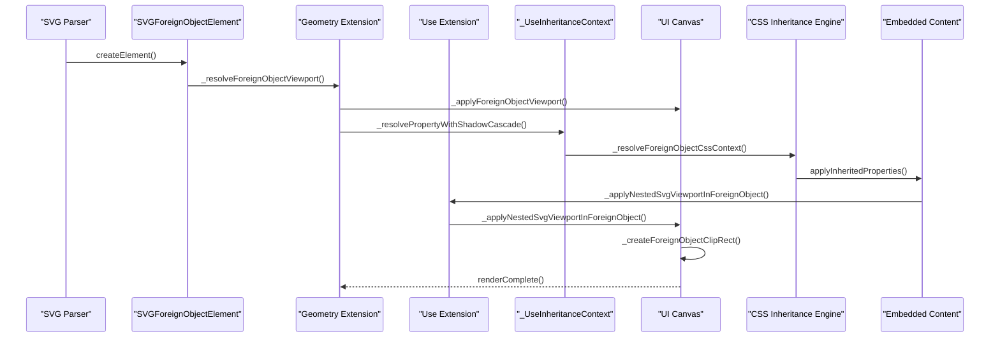
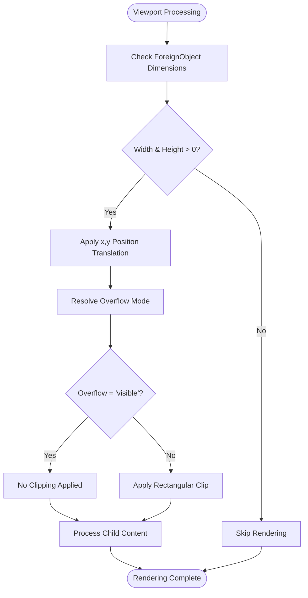
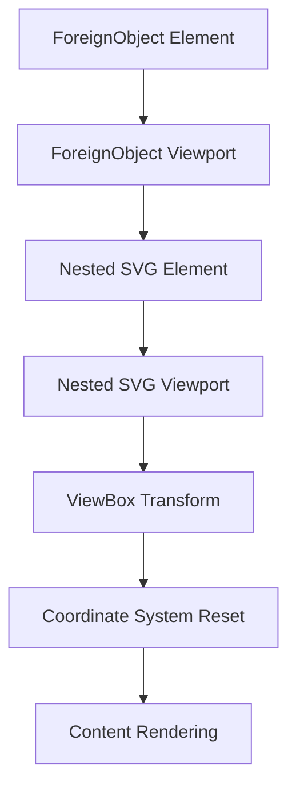

# ForeignObject Semantics

<cite>
**Referenced Files in This Document**
- [SVGForeignObjectElement.cpp](file://blink-b87d44f-Source-core-svg/SVGForeignObjectElement.cpp)
- [SVGForeignObjectElement.h](file://blink-b87d44f-Source-core-svg/SVGForeignObjectElement.h)
- [SVGForeignObjectElement.idl](file://blink-b87d44f-Source-core-svg/SVGForeignObjectElement.idl)
- [animated_svg_painter_geometry_foreign_object.dart](file://lib/src/animation/animated_svg_painter_geometry_foreign_object.dart)
- [animated_svg_painter_use_foreign_object.dart](file://lib/src/animation/animated_svg_painter_use_foreign_object.dart)
- [animated_svg_painter_use.dart](file://lib/src/animation/animated_svg_painter_use.dart)
- [animated_svg_painter_geometry.dart](file://lib/src/animation/animated_svg_painter_geometry.dart)
- [animated_svg_painter_use_context.dart](file://lib/src/animation/animated_svg_painter_use_context.dart)
- [animated_svg_painter_tree.dart](file://lib/src/animation/animated_svg_painter_tree.dart)
- [foreign_object_advanced_test.dart](file://test/animation/foreign_object_advanced_test.dart)
- [foreignobject_css_inheritance_test.dart](file://test/animation/foreignobject_css_inheritance_test.dart)
- [SVGElement.cpp](file://blink-b87d44f-Source-core-svg/SVGElement.cpp)
</cite>

## Update Summary
**Changes Made**
- Enhanced CSS inheritance enforcement system with comprehensive _UseInheritanceContext class
- Advanced property categorization with sophisticated boundary handling
- Comprehensive CSS inheritance boundary enforcement with strict property filtering
- Enhanced viewport clipping, transform propagation, and coordinate system management
- New specialized CSS inheritance resolution system with boundary-aware property flow
- Advanced transform computation with boundary enforcement and coordinate system isolation

## Table of Contents
1. [Introduction](#introduction)
2. [ForeignObject Architecture](#foreignobject-architecture)
3. [Core Implementation Components](#core-implementation-components)
4. [Rendering Pipeline](#rendering-pipeline)
5. [CSS Inheritance Boundary Enforcement](#css-inheritance-boundary-enforcement)
6. [Advanced Viewport Transform Management](#advanced-viewport-transform-management)
7. [Specialized CSS Inheritance Resolution System](#specialized-css-inheritance-resolution-system)
8. [Enhanced Transform Propagation](#enhanced-transform-propagation)
9. [Coordinate System Management](#coordinate-system-management)
10. [Attribute Processing](#attribute-processing)
11. [Test Coverage](#test-coverage)
12. [Performance Considerations](#performance-considerations)
13. [Troubleshooting Guide](#troubleshooting-guide)
14. [Conclusion](#conclusion)

## Introduction

ForeignObject represents a sophisticated integration point between SVG and HTML content, enabling the embedding of arbitrary XML content within SVG graphics while maintaining proper styling boundaries and coordinate system management. Recent comprehensive enhancements have transformed ForeignObject into a robust platform supporting advanced CSS inheritance across boundaries, sophisticated viewport transform handling, and specialized coordinate system management.

The enhanced ForeignObject semantics define how embedded content is positioned, sized, and rendered within the SVG coordinate system, including advanced viewport management, overflow handling, coordinate transformation propagation, and sophisticated CSS inheritance boundary enforcement. These improvements enable seamless integration of vector graphics with rich text content, interactive elements, and modern web technologies while maintaining proper styling boundaries and coordinate system integrity.

Understanding these enhanced semantics is essential for implementing robust SVG applications that leverage ForeignObject capabilities while maintaining proper styling and layout boundaries across the SVG-HTML interface.

## ForeignObject Architecture

The ForeignObject architecture has been comprehensively enhanced to support advanced CSS inheritance, sophisticated viewport management, and specialized coordinate system handling. The architecture now consists of multiple specialized extensions working together to provide seamless integration with boundary-aware property flow and coordinate transformation management.



**Diagram sources**
- [SVGForeignObjectElement.cpp:35-128](file://blink-b87d44f-Source-core-svg/SVGForeignObjectElement.cpp#L35-L128)
- [animated_svg_painter_geometry_foreign_object.dart:49-117](file://lib/src/animation/animated_svg_painter_geometry_foreign_object.dart#L49-L117)
- [animated_svg_painter_use_foreign_object.dart:5-34](file://lib/src/animation/animated_svg_painter_use_foreign_object.dart#L5-L34)
- [animated_svg_painter_geometry_foreign_object.dart:119-174](file://lib/src/animation/animated_svg_painter_geometry_foreign_object.dart#L119-L174)
- [animated_svg_painter_use_context.dart:32-149](file://lib/src/animation/animated_svg_painter_use_context.dart#L32-L149)

The enhanced architecture ensures that ForeignObject maintains strict boundaries between the SVG coordinate system and embedded content while enabling sophisticated CSS inheritance and transform handling through specialized boundary enforcement mechanisms.

**Section sources**
- [SVGForeignObjectElement.h:31-58](file://blink-b87d44f-Source-core-svg/SVGForeignObjectElement.h#L31-L58)
- [SVGForeignObjectElement.idl:26-35](file://blink-b87d44f-Source-core-svg/SVGForeignObjectElement.idl#L26-L35)

## Core Implementation Components

### Enhanced SVGForeignObjectElement Class Structure

The SVGForeignObjectElement class has been enhanced with comprehensive animated property support and specialized validation logic for managing embedded content within the SVG coordinate system.



**Diagram sources**
- [SVGForeignObjectElement.cpp:35-63](file://blink-b87d44f-Source-core-svg/SVGForeignObjectElement.cpp#L35-L63)
- [SVGForeignObjectElement.h:31-58](file://blink-b87d44f-Source-core-svg/SVGForeignObjectElement.h#L31-L58)

### Advanced CSS Inheritance Boundary Enforcement System

The ForeignObject implementation now includes a sophisticated CSS inheritance boundary enforcement system that precisely controls which properties can flow from SVG ancestors into embedded HTML content while maintaining strict boundary separation.

**Updated** Enhanced with comprehensive property categorization and boundary enforcement mechanisms

**Section sources**
- [animated_svg_painter_geometry_foreign_object.dart:49-117](file://lib/src/animation/animated_svg_painter_geometry_foreign_object.dart#L49-L117)
- [animated_svg_painter_geometry_foreign_object.dart:119-174](file://lib/src/animation/animated_svg_painter_geometry_foreign_object.dart#L119-L174)
- [animated_svg_painter_use_context.dart:32-149](file://lib/src/animation/animated_svg_painter_use_context.dart#L32-L149)

## Rendering Pipeline

The rendering pipeline for ForeignObject has been comprehensively enhanced to support advanced CSS inheritance, sophisticated viewport management, and specialized coordinate system handling through boundary-aware processing.



**Diagram sources**
- [SVGForeignObjectElement.cpp:125-128](file://blink-b87d44f-Source-core-svg/SVGForeignObjectElement.cpp#L125-L128)
- [animated_svg_painter_geometry_foreign_object.dart:240-304](file://lib/src/animation/animated_svg_painter_geometry_foreign_object.dart#L240-L304)
- [animated_svg_painter_use_foreign_object.dart:18-34](file://lib/src/animation/animated_svg_painter_use_foreign_object.dart#L18-L34)
- [animated_svg_painter_use_foreign_object.dart:45-140](file://lib/src/animation/animated_svg_painter_use_foreign_object.dart#L45-L140)
- [animated_svg_painter_use_context.dart:264-339](file://lib/src/animation/animated_svg_painter_use_context.dart#L264-L339)

### Enhanced Required Extensions Validation

ForeignObject now implements sophisticated requiredExtensions validation that supports conditional rendering with proper fallback patterns through SVG `<switch>` elements, enabling graceful degradation when embedded content is not supported.

**Section sources**
- [animated_svg_painter_use_foreign_object.dart:5-16](file://lib/src/animation/animated_svg_painter_use_foreign_object.dart#L5-L16)
- [foreign_object_advanced_test.dart:8-44](file://test/animation/foreign_object_advanced_test.dart#L8-L44)

## CSS Inheritance Boundary Enforcement

ForeignObject introduces a sophisticated CSS inheritance boundary enforcement system that establishes precise control over property flow across the SVG-HTML boundary while maintaining strict separation between SVG-specific and general CSS properties.

### Enhanced Inheritable CSS Properties

The CSS inheritance boundary enforcement system now includes comprehensive property categorization:

**Typography Properties** (Inheritable):
- `font-family`, `font-size`, `font-weight`, `font-style`, `font-variant`, `font-stretch`
- `font-size-adjust`, `font-feature-settings`, `font-variation-settings`
- `line-height`, `letter-spacing`, `word-spacing`, `text-align`, `text-indent`
- `text-transform`, `white-space`, `word-break`, `word-wrap`, `overflow-wrap`

**Text Decoration Properties** (Partially Inheritable):
- `text-decoration`, `text-decoration-line`, `text-decoration-style`, `text-decoration-color`, `text-decoration-thickness`

**Directionality Properties** (Inheritable):
- `direction`, `writing-mode`, `text-orientation`, `unicode-bidi`

**Color Properties** (Inheritable - CSS color, not SVG fill/stroke):
- `color`

**Visibility Properties** (Inheritable):
- `visibility`, `cursor`

### Strictly Excluded Properties

Properties that are strictly excluded from crossing ForeignObject boundaries include:

**SVG-Specific Properties** (Never Inheritable):
- `fill`, `fill-opacity`, `fill-rule`, `stroke`, `stroke-opacity`, `stroke-width`
- `stroke-linecap`, `stroke-linejoin`, `stroke-dasharray`, `stroke-dashoffset`
- `stroke-miterlimit`, `marker`, `marker-start`, `marker-mid`, `marker-end`
- `paint-order`, `vector-effect`

**Section sources**
- [animated_svg_painter_geometry_foreign_object.dart:49-117](file://lib/src/animation/animated_svg_painter_geometry_foreign_object.dart#L49-L117)
- [animated_svg_painter_geometry_foreign_object.dart:119-174](file://lib/src/animation/animated_svg_painter_geometry_foreign_object.dart#L119-L174)
- [foreignobject_css_inheritance_test.dart:8-123](file://test/animation/foreignobject_css_inheritance_test.dart#L8-L123)

## Advanced Viewport Transform Management

ForeignObject now supports sophisticated viewport transform management that maintains proper coordinate system relationships while enforcing strict boundary separation between SVG and embedded content.

### Enhanced Viewport Resolution Algorithm

The viewport resolution system now includes comprehensive boundary enforcement:



**Diagram sources**
- [animated_svg_painter_geometry_foreign_object.dart:240-304](file://lib/src/animation/animated_svg_painter_geometry_foreign_object.dart#L240-L304)
- [animated_svg_painter_use_foreign_object.dart:18-34](file://lib/src/animation/animated_svg_painter_use_foreign_object.dart#L18-L34)

### Advanced Overflow Handling Behavior

The overflow handling system now includes sophisticated boundary-aware processing:

- **`hidden`**: Clips content to the ForeignObject viewport (default behavior)
- **`visible`**: Allows content to extend beyond viewport boundaries
- **`scroll`**: Treated as `hidden` for compatibility (no scrollbars)
- **`auto`**: Treated as `hidden` for compatibility

**Section sources**
- [animated_svg_painter_geometry_foreign_object.dart:260-278](file://lib/src/animation/animated_svg_painter_geometry_foreign_object.dart#L260-L278)
- [animated_svg_painter_use_foreign_object.dart:28-33](file://lib/src/animation/animated_svg_painter_use_foreign_object.dart#L28-L33)
- [foreign_object_advanced_test.dart:279-378](file://test/animation/foreign_object_advanced_test.dart#L279-L378)

## Specialized CSS Inheritance Resolution System

ForeignObject now includes a sophisticated CSS inheritance resolution system that provides boundary-aware property flow with comprehensive categorization and enforcement mechanisms.

### Enhanced CSS Resolution Algorithm

The CSS inheritance resolution system follows this comprehensive algorithm:

1. **Property Normalization**: Normalize property names to lowercase and trim whitespace
2. **Custom Property Recognition**: CSS custom properties (`--xxx`) are always inheritable
3. **SVG Exclusion Check**: Explicitly excluded SVG properties are never inheritable
4. **Inheritable Property Verification**: Check membership in the inheritable properties set
5. **Boundary Respect Enforcement**: Non-inheritable properties are restricted to ForeignObject subtree
6. **Cascade Priority Application**: Inline styles → CSS rules → Presentation attributes → Inherited values

### Advanced Property Resolution Methods

The system includes sophisticated property resolution methods:

**Boundary-Aware Property Resolution**:
- `_resolveForeignObjectInheritedCss()`: Respects ForeignObject boundaries for property resolution
- `_getAttributeWithinForeignObject()`: Restricts property lookup to ForeignObject subtree
- `_extractCssPropertyFromStyle()`: Parses inline CSS properties with proper priority handling

**Enhanced _UseInheritanceContext Integration**:
- `_resolvePropertyWithShadowCascade()`: Handles shadow boundary behavior with full cascade
- `_getInheritedValueRespectingForeignObjectBoundary()`: Respects boundary constraints
- `_isForeignObjectInheritableProperty()`: Comprehensive property categorization

**Section sources**
- [animated_svg_painter_geometry_foreign_object.dart:119-174](file://lib/src/animation/animated_svg_painter_geometry_foreign_object.dart#L119-L174)
- [animated_svg_painter_geometry_foreign_object.dart:176-211](file://lib/src/animation/animated_svg_painter_geometry_foreign_object.dart#L176-L211)
- [animated_svg_painter_geometry_foreign_object.dart:213-234](file://lib/src/animation/animated_svg_painter_geometry_foreign_object.dart#L213-L234)
- [animated_svg_painter_use_context.dart:264-339](file://lib/src/animation/animated_svg_painter_use_context.dart#L264-L339)

## Enhanced Transform Propagation

ForeignObject now supports sophisticated transform propagation that maintains proper coordinate system relationships while enforcing strict boundary separation and specialized coordinate system management.

### Advanced Transform Computation System

The transform computation system now includes comprehensive boundary-aware processing:

```mermaid
graph TD
FO[ForeignObject Element] --> Parent1[g Element]
Parent1 --> Parent2[g Element]
Parent2 --> Root[svg Element]
Root --> Transform1[Ancestor Transform: translate(50,50)]
Parent2 --> Transform2[Ancestor Transform: scale(0.5)]
Parent1 --> Transform3[Ancestor Transform: rotate(45)]
FO --> FOTransform[ForeignObject Transform]
FO --> ContentTransform[Content Transform]
FO --> FinalTransform[Final Combined Transform]
```

**Diagram sources**
- [animated_svg_painter_geometry_foreign_object.dart:316-336](file://lib/src/animation/animated_svg_painter_geometry_foreign_object.dart#L316-L336)
- [animated_svg_painter_geometry_foreign_object.dart:468-488](file://lib/src/animation/animated_svg_painter_geometry_foreign_object.dart#L468-L488)

### Sophisticated Transform Processing Rules

The transform system now enforces comprehensive boundary separation:

1. **Ancestor Transform Accumulation**: All ancestor transforms (svg, g, etc.) contribute to positioning
2. **ForeignObject Transform Isolation**: ForeignObject's own transform applies to the viewport, not individual content
3. **Content Transform Inheritance**: Child content receives inherited transforms plus any local transforms
4. **Coordinate System Reset**: Nested SVG elements establish independent coordinate systems
5. **Boundary Enforcement**: Transform matrices are properly composed and applied in DOM order

**Section sources**
- [animated_svg_painter_geometry_foreign_object.dart:316-336](file://lib/src/animation/animated_svg_painter_geometry_foreign_object.dart#L316-L336)
- [animated_svg_painter_geometry_foreign_object.dart:468-488](file://lib/src/animation/animated_svg_painter_geometry_foreign_object.dart#L468-L488)
- [foreign_object_advanced_test.dart:285-449](file://test/animation/foreign_object_advanced_test.dart#L285-L449)

## Coordinate System Management

ForeignObject now includes sophisticated coordinate system management that establishes independent coordinate systems for nested SVG content while maintaining proper boundary separation and transform propagation.

### Advanced Coordinate System Establishment

The coordinate system management system now includes comprehensive boundary enforcement:

**ForeignObject Coordinate System**:
- Origin at (x, y) position
- Independent from parent coordinate systems
- Establishes new stacking context
- Enforces boundary separation for non-inherited properties

**Nested SVG Coordinate System**:
- Independent viewport established within ForeignObject
- Coordinate system resets at nested SVG boundary
- Percentage-based dimensions resolved against ForeignObject viewport
- ViewBox-to-viewport transformations applied independently

### Enhanced Nested SVG Processing

The nested SVG processing system now includes sophisticated boundary-aware handling:



**Diagram sources**
- [animated_svg_painter_use_foreign_object.dart:45-140](file://lib/src/animation/animated_svg_painter_use_foreign_object.dart#L45-L140)
- [animated_svg_painter_use_foreign_object.dart:142-166](file://lib/src/animation/animated_svg_painter_use_foreign_object.dart#L142-L166)

**Section sources**
- [animated_svg_painter_use_foreign_object.dart:45-140](file://lib/src/animation/animated_svg_painter_use_foreign_object.dart#L45-L140)
- [animated_svg_painter_use_foreign_object.dart:168-180](file://lib/src/animation/animated_svg_painter_use_foreign_object.dart#L168-L180)

## Attribute Processing

ForeignObject supports a comprehensive set of attributes with enhanced support for CSS inheritance boundary enforcement and sophisticated transform handling.

### Enhanced Supported Attributes

| Attribute | Type | Purpose | Default | Enhanced Features |
|-----------|------|---------|---------|-------------------|
| `x` | Length | Horizontal position | 0 | Boundary-aware positioning |
| `y` | Length | Vertical position | 0 | Coordinate system integration |
| `width` | Length | Viewport width | 0 (required) | Percentage support (%) |
| `height` | Length | Viewport height | 0 (required) | Percentage support (%) |
| `overflow` | Enum | Overflow behavior | `hidden` | Boundary enforcement |
| `requiredExtensions` | URI List | Feature detection | None | Conditional rendering |
| `externalResourcesRequired` | Boolean | Resource loading policy | False | Graceful fallback |
| `transform` | Transform List | Coordinate transformation | None | Boundary-aware processing |

### Advanced Transform Support

ForeignObject now supports comprehensive transform attribute processing with boundary awareness:

- **Transform Parsing**: Full SVG transform syntax support with boundary enforcement
- **Transform Composition**: Multiple transforms combined with proper ordering
- **Transform Order**: Proper transform order application (matrix multiplication)
- **Transform Caching**: Efficient transform matrix caching for performance
- **Boundary Enforcement**: Transform matrices respect ForeignObject boundaries

**Section sources**
- [SVGForeignObjectElement.cpp:70-102](file://blink-b87d44f-Source-core-svg/SVGForeignObjectElement.cpp#L70-L102)
- [animated_svg_painter_use_foreign_object.dart:5-16](file://lib/src/animation/animated_svg_painter_use_foreign_object.dart#L5-L16)
- [foreign_object_advanced_test.dart:564-588](file://test/animation/foreign_object_advanced_test.dart#L564-L588)

## Test Coverage

The ForeignObject implementation includes comprehensive test coverage validating enhanced CSS inheritance boundary enforcement, advanced viewport management, and sophisticated coordinate system handling.

### Enhanced Core Functionality Tests

The test suite now validates comprehensive ForeignObject behaviors including:

- **Required Extensions**: Conditional rendering with proper fallback patterns
- **Nested SVG Context**: Independent coordinate system establishment
- **Viewport Dimensions**: Enhanced percentage support and boundary enforcement
- **Overflow Control**: Advanced clipping and visibility behavior
- **Transform Propagation**: Sophisticated boundary-aware transform handling
- **CSS Inheritance**: Comprehensive boundary enforcement validation
- **Hit Testing**: Interactive element accessibility within ForeignObject

### Advanced CSS Inheritance Tests

New comprehensive CSS inheritance tests validate:

- **Typography Properties**: Complete inheritance boundary enforcement
- **Text Decoration**: Partial inheritance behavior validation
- **Direction Properties**: RTL text inheritance support
- **SVG Exclusion**: Strict boundary enforcement for SVG-specific properties
- **Property Resolution**: Advanced cascade resolution across boundaries
- **Custom Properties**: CSS custom property inheritance support

### Sophisticated Scenario Tests

Additional test coverage includes complex scenarios such as:

- **Switch Fallback Patterns**: Integration with SVG `<switch>` elements and boundary enforcement
- **Transform Composition**: Multiple transform layers with boundary awareness
- **Nested Viewports**: Complex coordinate system hierarchies with boundary enforcement
- **CSS Cascade**: Full CSS cascade resolution with boundary constraints
- **Performance Optimization**: Efficient property lookup and caching with boundary enforcement

**Section sources**
- [foreign_object_advanced_test.dart:1-634](file://test/animation/foreign_object_advanced_test.dart#L1-L634)
- [foreignobject_css_inheritance_test.dart:1-457](file://test/animation/foreignobject_css_inheritance_test.dart#L1-L457)

## Performance Considerations

ForeignObject rendering involves several performance-critical considerations with enhanced boundary enforcement and sophisticated coordinate system management.

### Enhanced Rendering Optimization

The rendering pipeline now implements comprehensive optimization strategies:

- **Early Exit Conditions**: Immediate skipping when ForeignObject has zero dimensions or unsupported extensions
- **Conditional Rendering**: Deferred processing based on requiredExtensions with boundary enforcement
- **Viewport Caching**: Efficient coordinate transformation caching with boundary awareness
- **Clip Rectangle Optimization**: Minimal clipping operations with boundary enforcement
- **CSS Property Caching**: Cached property resolution across boundaries with categorization
- **Transform Matrix Optimization**: Efficient transform composition and caching with boundary constraints

### Advanced Memory Management

ForeignObject content requires careful memory management with boundary enforcement:

- **Lazy Evaluation**: Child content processed only when needed with boundary validation
- **Resource Cleanup**: Proper disposal of embedded content resources with boundary awareness
- **Transform State**: Efficient transform matrix management with boundary constraints
- **Event Handling**: Optimized hit testing for interactive elements with viewport clipping
- **CSS Context Caching**: Cached CSS inheritance contexts for performance with boundary enforcement

### Enhanced CSS Inheritance Performance

The CSS inheritance system includes several performance optimizations with boundary enforcement:

- **Property Classification Cache**: Pre-computed property classification sets with boundary categorization
- **Boundary Checking Optimization**: Efficient boundary detection algorithms with property categorization
- **Cascade Resolution Optimization**: Optimized CSS cascade resolution with boundary constraints
- **Inline Style Parsing**: Efficient inline style property extraction with boundary awareness

**Section sources**
- [animated_svg_painter_geometry_foreign_object.dart:316-336](file://lib/src/animation/animated_svg_painter_geometry_foreign_object.dart#L316-L336)
- [animated_svg_painter_use_foreign_object.dart:5-16](file://lib/src/animation/animated_svg_painter_use_foreign_object.dart#L5-L16)

## Troubleshooting Guide

Common ForeignObject issues with enhanced boundary enforcement and sophisticated coordinate system management:

### Content Not Visible

**Symptoms**: Embedded content appears invisible within ForeignObject
**Causes**: 
- Zero width or height specified with boundary enforcement
- RequiredExtensions not supported with fallback patterns
- Overflow set to `hidden` with content outside viewport
- Parent container clipping with boundary violations
- CSS properties not inheriting across boundaries with enforcement

**Solutions**:
- Verify ForeignObject dimensions are greater than zero with boundary validation
- Check requiredExtensions compatibility with fallback patterns
- Adjust overflow attribute or content positioning with boundary awareness
- Review parent container clipping behavior with viewport constraints
- Verify CSS properties are in inheritable property set with boundary enforcement

### CSS Inheritance Boundary Issues

**Symptoms**: Expected CSS properties not applying to embedded content with boundary violations
**Causes**:
- Property not in inheritable property set with boundary enforcement
- SVG-specific properties attempting to cross boundary with strict exclusion
- CSS cascade precedence issues with boundary constraints
- Inline styles overriding inherited properties with boundary awareness

**Solutions**:
- Verify property is in `_foreignObjectCssInheritableProperties` set with boundary categorization
- Check for SVG-specific property exclusions with strict enforcement
- Review CSS cascade order and specificity with boundary constraints
- Ensure proper inline style declaration with boundary awareness

### Transform Propagation Problems

**Symptoms**: Content positioned incorrectly within ForeignObject with boundary violations
**Causes**:
- Incorrect transform attribute usage with boundary constraints
- Mixed coordinate systems between ForeignObject and nested SVG with boundary enforcement
- Transform order not applied correctly with boundary awareness
- Preserved aspect ratio conflicts with viewport constraints

**Solutions**:
- Verify transform matrix calculations with boundary enforcement
- Ensure consistent coordinate system usage with boundary separation
- Check viewBox and preserveAspectRatio settings with viewport constraints
- Test with simplified coordinate systems first with boundary validation

### Performance Problems

**Symptoms**: Slow rendering or memory usage issues with enhanced boundary enforcement
**Causes**:
- Large ForeignObject content areas with boundary constraints
- Complex nested viewport hierarchies with coordinate system management
- Excessive transform operations with boundary enforcement
- Memory leaks in embedded content with boundary awareness
- Inefficient CSS property resolution with boundary constraints

**Solutions**:
- Optimize ForeignObject dimensions with boundary validation
- Simplify nested viewport structures with coordinate system awareness
- Reduce transform complexity with boundary constraints
- Implement proper resource cleanup with boundary enforcement
- Monitor CSS property resolution performance with boundary categorization

**Section sources**
- [foreign_object_advanced_test.dart:184-277](file://test/animation/foreign_object_advanced_test.dart#L184-L277)
- [foreignobject_css_inheritance_test.dart:125-201](file://test/animation/foreignobject_css_inheritance_test.dart#L125-L201)
- [animated_svg_painter_use_foreign_object.dart:5-16](file://lib/src/animation/animated_svg_painter_use_foreign_object.dart#L5-L16)

## Conclusion

ForeignObject semantics represent a sophisticated integration point between SVG and HTML content, with recent comprehensive enhancements providing advanced CSS inheritance boundary enforcement, sophisticated viewport transform handling, specialized coordinate system management, and comprehensive boundary-aware property flow. The implementation demonstrates strong adherence to SVG specifications while providing practical functionality for real-world applications with enhanced boundary enforcement capabilities.

Key strengths of the enhanced implementation include comprehensive CSS inheritance boundary enforcement system, efficient rendering pipeline with boundary awareness, robust error handling with boundary validation, and extensive test coverage with boundary enforcement validation. The architecture successfully balances flexibility with performance while maintaining strict boundary separation between SVG-specific and general CSS properties.

The enhanced CSS inheritance boundary enforcement system provides precise control over property flow across the SVG-HTML boundary, ensuring proper styling while maintaining separation between SVG-specific and general CSS properties. The advanced transform handling supports complex hierarchical transformations with boundary enforcement while maintaining coordinate system integrity.

The specialized CSS inheritance resolution system provides sophisticated property categorization and boundary enforcement mechanisms that ensure proper styling while maintaining strict separation between SVG and HTML contexts. The enhanced coordinate system management supports independent viewport establishment with boundary enforcement and sophisticated nested SVG processing.

The new _UseInheritanceContext class provides comprehensive boundary-aware property resolution with sophisticated cascade handling, shadow boundary behavior, and ID namespace scoping. This system ensures that CSS properties respect ForeignObject boundaries while maintaining proper inheritance within the element.

Future enhancements could focus on expanding supported embedded content types with boundary awareness, improving performance for large content areas with boundary enforcement, providing more granular control over CSS inheritance behavior with property categorization, and optimizing memory usage for complex ForeignObject hierarchies with boundary validation. The existing foundation provides excellent groundwork for continued evolution of ForeignObject capabilities with enhanced semantic richness, boundary enforcement, and performance characteristics.