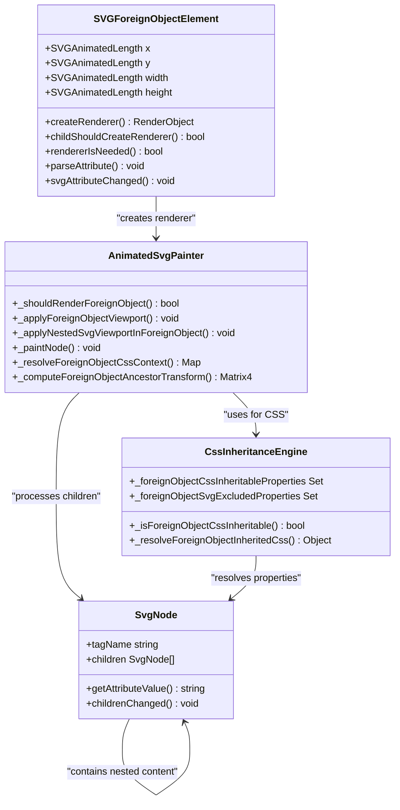
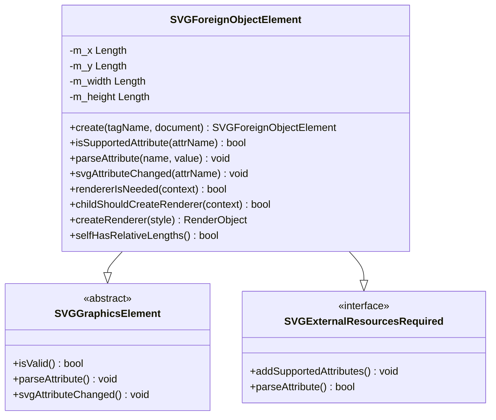
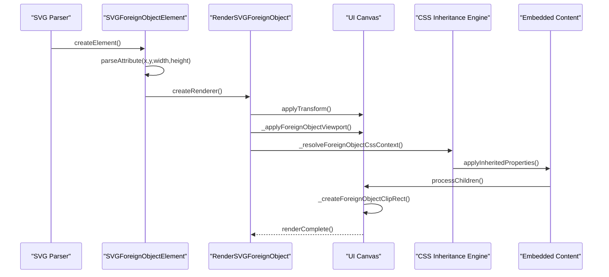
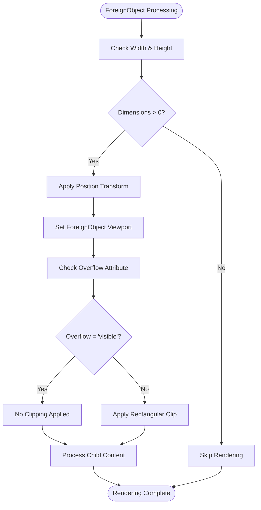

# ForeignObject Semantics

<cite>
**Referenced Files in This Document**
- [SVGForeignObjectElement.cpp](file://blink-b87d44f-Source-core-svg/SVGForeignObjectElement.cpp)
- [SVGForeignObjectElement.h](file://blink-b87d44f-Source-core-svg/SVGForeignObjectElement.h)
- [SVGForeignObjectElement.idl](file://blink-b87d44f-Source-core-svg/SVGForeignObjectElement.idl)
- [animated_svg_painter_tree.dart](file://lib/src/animation/animated_svg_painter_tree.dart)
- [animated_svg_painter_use.dart](file://lib/src/animation/animated_svg_painter_use.dart)
- [animated_svg_painter_geometry.dart](file://lib/src/animation/animated_svg_painter_geometry.dart)
- [animated_svg_painter_shapes_image.dart](file://lib/src/animation/animated_svg_painter_shapes_image.dart)
- [foreign_object_advanced_test.dart](file://test/animation/foreign_object_advanced_test.dart)
- [foreignobject_css_inheritance_test.dart](file://test/animation/foreignobject_css_inheritance_test.dart)
- [SVGElement.cpp](file://blink-b87d44f-Source-core-svg/SVGElement.cpp)
</cite>

## Update Summary
**Changes Made**
- Added comprehensive CSS inheritance support documentation for ForeignObject boundaries
- Enhanced viewport clipping and overflow handling documentation
- Expanded transform propagation and hierarchy handling sections
- Added detailed typography and CSS property inheritance documentation
- Updated test coverage references to include new CSS inheritance tests

## Table of Contents
1. [Introduction](#introduction)
2. [ForeignObject Architecture](#foreignobject-architecture)
3. [Core Implementation Components](#core-implementation-components)
4. [Rendering Pipeline](#rendering-pipeline)
5. [CSS Inheritance Across Boundaries](#css-inheritance-across-boundaries)
6. [Viewport Management](#viewport-management)
7. [Advanced Transform Handling](#advanced-transform-handling)
8. [Typography Propagation](#typography-propagation)
9. [Attribute Processing](#attribute-processing)
10. [Test Coverage](#test-coverage)
11. [Performance Considerations](#performance-considerations)
12. [Troubleshooting Guide](#troubleshooting-guide)
13. [Conclusion](#conclusion)

## Introduction

ForeignObject is a crucial SVG element that enables embedding arbitrary XML content, primarily HTML, within SVG graphics. This capability allows developers to combine vector graphics with rich text content, interactive elements, and modern web technologies while maintaining the scalability and resolution independence of SVG.

The ForeignObject semantics define how embedded content is positioned, sized, and rendered within the SVG coordinate system, including viewport management, overflow handling, and coordinate transformation propagation. Recent enhancements have significantly expanded ForeignObject support with comprehensive CSS inheritance across boundaries, advanced viewport clipping, CSS typography propagation, and sophisticated transform handling through foreignObject hierarchies.

Understanding these enhanced semantics is essential for implementing robust SVG applications that seamlessly integrate vector graphics with HTML content while maintaining proper styling and layout boundaries.

## ForeignObject Architecture

ForeignObject serves as a bridge between SVG and HTML content, creating a viewport boundary that controls how embedded content is rendered and interacted with. The architecture consists of several key components working together to provide seamless integration with enhanced CSS inheritance and transform handling capabilities.



**Diagram sources**
- [SVGForeignObjectElement.cpp:35-128](file://blink-b87d44f-Source-core-svg/SVGForeignObjectElement.cpp#L35-L128)
- [animated_svg_painter_tree.dart:184-231](file://lib/src/animation/animated_svg_painter_tree.dart#L184-L231)
- [animated_svg_painter_use.dart:99-100](file://lib/src/animation/animated_svg_painter_use.dart#L99-L100)
- [animated_svg_painter_geometry.dart:190-234](file://lib/src/animation/animated_svg_painter_geometry.dart#L190-L234)

The architecture ensures that ForeignObject maintains strict boundaries between the SVG coordinate system and embedded content, preventing content from escaping its designated viewport while allowing proper coordinate transformations and CSS inheritance to propagate through the hierarchy.

**Section sources**
- [SVGForeignObjectElement.h:31-58](file://blink-b87d44f-Source-core-svg/SVGForeignObjectElement.h#L31-L58)
- [SVGForeignObjectElement.idl:26-35](file://blink-b87d44f-Source-core-svg/SVGForeignObjectElement.idl#L26-L35)

## Core Implementation Components

### SVGForeignObjectElement Class Structure

The SVGForeignObjectElement class extends SVGGraphicsElement and implements specialized behavior for managing embedded content. It defines animated properties for positioning and sizing, along with validation and rendering logic.



**Diagram sources**
- [SVGForeignObjectElement.cpp:35-63](file://blink-b87d44f-Source-core-svg/SVGForeignObjectElement.cpp#L35-L63)
- [SVGForeignObjectElement.h:31-58](file://blink-b87d44f-Source-core-svg/SVGForeignObjectElement.h#L31-L58)

### Enhanced CSS Inheritance Engine

The ForeignObject implementation now includes a sophisticated CSS inheritance engine that manages property flow across the SVG-HTML boundary:

| Property Category | Inheritable Properties | Non-Inheritable Properties |
|-------------------|----------------------|---------------------------|
| Typography | font-family, font-size, font-weight, font-style, line-height, letter-spacing, word-spacing, text-align, text-indent, text-transform, white-space, word-break, word-wrap, overflow-wrap | font-size-adjust, font-feature-settings, font-variation-settings |
| Text Decoration | text-decoration, text-decoration-line, text-decoration-style, text-decoration-color, text-decoration-thickness | - |
| Directionality | direction, writing-mode, text-orientation, unicode-bidi | - |
| Color | color | fill, stroke, fill-opacity, stroke-opacity |
| Layout | visibility, cursor | transform, position, display, width, height, margin, padding, border |

**Section sources**
- [animated_svg_painter_geometry.dart:190-234](file://lib/src/animation/animated_svg_painter_geometry.dart#L190-L234)
- [animated_svg_painter_geometry.dart:236-256](file://lib/src/animation/animated_svg_painter_geometry.dart#L236-L256)
- [animated_svg_painter_shapes_image.dart:69-122](file://lib/src/animation/animated_svg_painter_shapes_image.dart#L69-L122)

## Rendering Pipeline

The rendering pipeline for ForeignObject involves multiple stages that ensure proper coordinate transformation, viewport management, CSS inheritance, and content validation.



**Diagram sources**
- [SVGForeignObjectElement.cpp:125-128](file://blink-b87d44f-Source-core-svg/SVGForeignObjectElement.cpp#L125-L128)
- [animated_svg_painter_tree.dart:3-231](file://lib/src/animation/animated_svg_painter_tree.dart#L3-L231)
- [animated_svg_painter_use.dart:627-647](file://lib/src/animation/animated_svg_painter_use.dart#L627-L647)
- [animated_svg_painter_geometry.dart:429-443](file://lib/src/animation/animated_svg_painter_geometry.dart#L429-L443)

### Required Extensions Validation

ForeignObject implements the `requiredExtensions` attribute for conditional rendering, following SVG specification patterns. When `requiredExtensions` is specified and unsupported, the ForeignObject is skipped during rendering, enabling graceful fallback patterns.

**Section sources**
- [animated_svg_painter_use.dart:616-625](file://lib/src/animation/animated_svg_painter_use.dart#L616-L625)
- [foreign_object_advanced_test.dart:8-44](file://test/animation/foreign_object_advanced_test.dart#L8-L44)

## CSS Inheritance Across Boundaries

ForeignObject introduces sophisticated CSS inheritance mechanisms that control which properties can flow from SVG ancestors into embedded HTML content. This system establishes a clear boundary between SVG-specific styling and general CSS properties.

### Inheritable CSS Properties

The following CSS properties are inheritable across ForeignObject boundaries:

- **Typography Properties**: font-family, font-size, font-weight, font-style, font-variant, font-stretch, font-size-adjust, font-feature-settings, font-variation-settings
- **Text Layout Properties**: line-height, letter-spacing, word-spacing, text-align, text-indent, text-transform, white-space, word-break, word-wrap, overflow-wrap
- **Text Decoration Properties**: text-decoration, text-decoration-line, text-decoration-style, text-decoration-color, text-decoration-thickness
- **Directionality Properties**: direction, writing-mode, text-orientation, unicode-bidi
- **Color Properties**: color (CSS color, not SVG fill/stroke)
- **Visibility Properties**: visibility, cursor

### Non-Inheritable Properties

Properties that do NOT cross ForeignObject boundaries include:

- **SVG-Specific Properties**: fill, stroke, fill-opacity, stroke-opacity, stroke-width, stroke-linecap, stroke-linejoin, stroke-dasharray, stroke-dashoffset, stroke-miterlimit, marker, marker-start, marker-mid, marker-end, paint-order, color-interpolation, color-interpolation-filters, color-rendering, shape-rendering, text-rendering, image-rendering, vector-effect
- **Transform Properties**: transform, transform-origin, transform-box, transform-style
- **Layout Properties**: display, position, top, left, right, bottom, z-index, width, height, min-width, min-height, max-width, max-height, margin, padding, border, outline, background, background-color, background-image
- **Clipping and Masking**: clip-path, clip, mask, mask-image, overflow, overflow-x, overflow-y
- **Opacity and Compositing**: opacity, mix-blend-mode, isolation
- **Filter Effects**: filter, backdrop-filter

### CSS Resolution Algorithm

The CSS inheritance engine follows this resolution algorithm:

1. **Property Classification**: Determine if property is inheritable across boundaries
2. **Boundary Respect**: For non-inheritable properties, only check within ForeignObject subtree
3. **Cascade Priority**: Inline styles → CSS rules → Presentation attributes → Inherited values
4. **SVG Exclusion**: Explicitly exclude SVG-specific properties from inheritance

**Section sources**
- [animated_svg_painter_geometry.dart:263-278](file://lib/src/animation/animated_svg_painter_geometry.dart#L263-L278)
- [animated_svg_painter_geometry.dart:291-313](file://lib/src/animation/animated_svg_painter_geometry.dart#L291-L313)
- [animated_svg_painter_geometry.dart:317-350](file://lib/src/animation/animated_svg_painter_geometry.dart#L317-L350)
- [foreignobject_css_inheritance_test.dart:8-123](file://test/animation/foreignobject_css_inheritance_test.dart#L8-L123)

## Viewport Management

ForeignObject creates a dedicated viewport boundary that controls how embedded content is positioned and clipped within the SVG coordinate system. This viewport management ensures proper isolation between SVG graphics and embedded content while supporting advanced clipping scenarios.



**Diagram sources**
- [animated_svg_painter_use.dart:627-647](file://lib/src/animation/animated_svg_painter_use.dart#L627-L647)
- [animated_svg_painter_geometry.dart:421-423](file://lib/src/animation/animated_svg_painter_geometry.dart#L421-L423)
- [animated_svg_painter_geometry.dart:429-443](file://lib/src/animation/animated_svg_painter_geometry.dart#L429-L443)

### Overflow Handling Behavior

ForeignObject implements SVG-compliant overflow handling with enhanced support for different overflow modes:

- **`hidden`**: Clips content to the ForeignObject viewport (default behavior)
- **`visible`**: Allows content to extend beyond viewport boundaries
- **`scroll`**: Treated as `hidden` for compatibility (no scrollbars)
- **`auto`**: Treated as `hidden` for compatibility

**Section sources**
- [animated_svg_painter_use.dart:642-646](file://lib/src/animation/animated_svg_painter_use.dart#L642-L646)
- [animated_svg_painter_geometry.dart:401-417](file://lib/src/animation/animated_svg_painter_geometry.dart#L401-L417)
- [foreign_object_advanced_test.dart:279-378](file://test/animation/foreign_object_advanced_test.dart#L279-L378)

## Advanced Transform Handling

ForeignObject now supports sophisticated transform propagation that maintains proper coordinate system relationships across the SVG-HTML boundary while respecting the established viewport boundaries.

### Ancestor Transform Computation

The transform computation system handles complex hierarchical transformations:

```mermaid
graph TD
FO[ForeignObject Element] --> Parent1[g Element]
Parent1 --> Parent2[g Element]
Parent2 --> Root[svg Element]
Root --> Transform1[Transform: translate(50,50)]
Parent2 --> Transform2[Transform: scale(0.5)]
Parent1 --> Transform3[Transform: rotate(45)]
FO --> FOTransform[ForeignObject Transform]
FO --> FinalTransform[Final Combined Transform]
```

**Diagram sources**
- [animated_svg_painter_geometry.dart:455-475](file://lib/src/animation/animated_svg_painter_geometry.dart#L455-L475)
- [animated_svg_painter_geometry.dart:479-499](file://lib/src/animation/animated_svg_painter_geometry.dart#L479-L499)

### Transform Propagation Rules

The transform system follows these rules:

1. **Ancestor Transforms**: All ancestor transforms (svg, g, etc.) contribute to positioning
2. **ForeignObject Transform**: ForeignObject's own transform applies to the viewport, not individual content
3. **Content Transforms**: Child content receives inherited transforms plus any local transforms
4. **Coordinate System**: Transforms are applied in DOM order (root to leaf) for positioning

**Section sources**
- [animated_svg_painter_geometry.dart:449-475](file://lib/src/animation/animated_svg_painter_geometry.dart#L449-L475)
- [animated_svg_painter_geometry.dart:477-499](file://lib/src/animation/animated_svg_painter_geometry.dart#L477-L499)
- [foreign_object_advanced_test.dart:285-449](file://test/animation/foreign_object_advanced_test.dart#L285-L449)

## Typography Propagation

ForeignObject provides comprehensive typography propagation that ensures text styling consistency across the SVG-HTML boundary. This includes font properties, text decoration, and directionality handling.

### Typography Property Flow

Typography properties that flow through ForeignObject boundaries include:

- **Font Properties**: font-family, font-size, font-weight, font-style, font-variant, font-stretch, font-size-adjust, font-feature-settings, font-variation-settings
- **Text Layout**: line-height, letter-spacing, word-spacing, text-align, text-indent, text-transform, white-space, word-break, word-wrap, overflow-wrap
- **Text Decoration**: text-decoration, text-decoration-line, text-decoration-style, text-decoration-color, text-decoration-thickness
- **Directionality**: direction, writing-mode, text-orientation, unicode-bidi

### Typography Resolution Process

The typography resolution follows this process:

1. **Property Detection**: Identify inheritable typography properties from SVG ancestors
2. **Boundary Respect**: Only apply properties that cross ForeignObject boundaries
3. **Cascade Application**: Apply CSS rules, presentation attributes, and inherited values
4. **Content Styling**: Apply resolved typography to embedded HTML content

**Section sources**
- [foreignobject_css_inheritance_test.dart:8-80](file://test/animation/foreignobject_css_inheritance_test.dart#L8-L80)
- [foreignobject_css_inheritance_test.dart:330-384](file://test/animation/foreignobject_css_inheritance_test.dart#L330-L384)
- [foreign_object_advanced_test.dart:527-561](file://test/animation/foreign_object_advanced_test.dart#L527-L561)

## Attribute Processing

ForeignObject supports a comprehensive set of attributes that control its behavior and appearance within the SVG document, with enhanced support for CSS inheritance and transform handling.

### Supported Attributes

| Attribute | Type | Purpose | Default |
|-----------|------|---------|---------|
| `x` | Length | Horizontal position | 0 |
| `y` | Length | Vertical position | 0 |
| `width` | Length | Viewport width | 0 (required) |
| `height` | Length | Viewport height | 0 (required) |
| `overflow` | Enum | Overflow behavior | `hidden` |
| `requiredExtensions` | URI List | Feature detection | None |
| `externalResourcesRequired` | Boolean | Resource loading policy | False |
| `transform` | Transform List | Coordinate transformation | None |

### Enhanced Transform Support

ForeignObject now supports comprehensive transform attribute processing:

- **Transform Parsing**: Full SVG transform syntax support (translate, rotate, scale, skew, matrix)
- **Transform Composition**: Multiple transforms combined in single attribute
- **Transform Order**: Proper transform order application (matrix multiplication)
- **Transform Caching**: Efficient transform matrix caching for performance

**Section sources**
- [SVGForeignObjectElement.cpp:70-102](file://blink-b87d44f-Source-core-svg/SVGForeignObjectElement.cpp#L70-L102)
- [animated_svg_painter_use.dart:42-46](file://lib/src/animation/animated_svg_painter_use.dart#L42-L46)
- [foreign_object_advanced_test.dart:564-588](file://test/animation/foreign_object_advanced_test.dart#L564-L588)

## Test Coverage

The ForeignObject implementation includes comprehensive test coverage validating various semantic behaviors and edge cases, with enhanced focus on CSS inheritance and advanced features.

### Core Functionality Tests

The test suite validates fundamental ForeignObject behaviors including:

- **Required Extensions**: Conditional rendering based on feature support
- **Nested SVG Context**: Proper coordinate system establishment
- **Viewport Dimensions**: Zero-width/height handling and default values
- **Overflow Control**: Clipping and visibility behavior
- **Transform Propagation**: Coordinate transformation inheritance
- **Hit Testing**: Interactive element accessibility within ForeignObject

### CSS Inheritance Tests

New comprehensive CSS inheritance tests validate:

- **Typography Properties**: font-family, font-size, font-weight inheritance
- **Text Decoration**: text-decoration inheritance and partial inheritance behavior
- **Direction Properties**: direction property inheritance for RTL text
- **SVG Exclusion**: fill, stroke, and other SVG-specific properties not crossing boundaries
- **Property Resolution**: Correct cascade resolution across boundaries

### Advanced Scenario Tests

Additional test coverage includes complex scenarios such as:

- **Switch Fallback Patterns**: Integration with SVG `<switch>` elements
- **Transform Composition**: Multiple transform layers and complex hierarchies
- **Nested Viewports**: Complex coordinate system hierarchies
- **CSS Cascade**: Full CSS cascade resolution across boundaries
- **Performance Optimization**: Efficient property lookup and caching

**Section sources**
- [foreign_object_advanced_test.dart:1-634](file://test/animation/foreign_object_advanced_test.dart#L1-L634)
- [foreignobject_css_inheritance_test.dart:1-457](file://test/animation/foreignobject_css_inheritance_test.dart#L1-L457)

## Performance Considerations

ForeignObject rendering involves several performance-critical considerations that impact overall SVG rendering efficiency, particularly with enhanced CSS inheritance and transform handling.

### Rendering Optimization

The rendering pipeline implements several optimization strategies:

- **Early Exit Conditions**: Immediate skipping when ForeignObject has zero dimensions
- **Conditional Rendering**: Deferred processing based on requiredExtensions
- **Viewport Caching**: Efficient coordinate transformation caching
- **Clip Rectangle Optimization**: Minimal clipping operations
- **CSS Property Caching**: Cached property resolution across boundaries
- **Transform Matrix Optimization**: Efficient transform composition and caching

### Memory Management

ForeignObject content requires careful memory management:

- **Lazy Evaluation**: Child content processed only when needed
- **Resource Cleanup**: Proper disposal of embedded content resources
- **Transform State**: Efficient transform matrix management
- **Event Handling**: Optimized hit testing for interactive elements
- **CSS Context Caching**: Cached CSS inheritance contexts for performance

### CSS Inheritance Performance

The CSS inheritance system includes several performance optimizations:

- **Property Classification Cache**: Pre-computed property classification sets
- **Boundary Checking Optimization**: Efficient boundary detection algorithms
- **Cascade Resolution Optimization**: Optimized CSS cascade resolution
- **Inline Style Parsing**: Efficient inline style property extraction

**Section sources**
- [animated_svg_painter_geometry.dart:455-475](file://lib/src/animation/animated_svg_painter_geometry.dart#L455-L475)
- [animated_svg_painter_use.dart:616-625](file://lib/src/animation/animated_svg_painter_use.dart#L616-L625)

## Troubleshooting Guide

Common ForeignObject issues and their solutions, with enhanced guidance for CSS inheritance and advanced features:

### Content Not Visible

**Symptoms**: Embedded content appears invisible within ForeignObject
**Causes**: 
- Zero width or height specified
- RequiredExtensions not supported
- Overflow set to `hidden` with content outside viewport
- Parent container clipping
- CSS properties not inheriting across boundaries

**Solutions**:
- Verify ForeignObject dimensions are greater than zero
- Check requiredExtensions compatibility
- Adjust overflow attribute or content positioning
- Review parent container clipping behavior
- Verify CSS properties are in inheritable property set

### CSS Inheritance Issues

**Symptoms**: Expected CSS properties not applying to embedded content
**Causes**:
- Property not in inheritable property set
- SVG-specific properties attempting to cross boundary
- CSS cascade precedence issues
- Inline styles overriding inherited properties

**Solutions**:
- Verify property is in `_foreignObjectCssInheritableProperties` set
- Check for SVG-specific property exclusions
- Review CSS cascade order and specificity
- Ensure proper inline style declaration

### Transform Propagation Problems

**Symptoms**: Content positioned incorrectly within ForeignObject
**Causes**:
- Incorrect transform attribute usage
- Mixed coordinate systems between ForeignObject and nested SVG
- Transform order not applied correctly
- Preserved aspect ratio conflicts

**Solutions**:
- Verify transform matrix calculations
- Ensure consistent coordinate system usage
- Check viewBox and preserveAspectRatio settings
- Test with simplified coordinate systems first

### Performance Problems

**Symptoms**: Slow rendering or memory usage issues
**Causes**:
- Large ForeignObject content areas
- Complex nested viewport hierarchies
- Excessive transform operations
- Memory leaks in embedded content
- Inefficient CSS property resolution

**Solutions**:
- Optimize ForeignObject dimensions
- Simplify nested viewport structures
- Reduce transform complexity
- Implement proper resource cleanup
- Monitor CSS property resolution performance

**Section sources**
- [foreign_object_advanced_test.dart:184-277](file://test/animation/foreign_object_advanced_test.dart#L184-L277)
- [foreignobject_css_inheritance_test.dart:125-201](file://test/animation/foreignobject_css_inheritance_test.dart#L125-L201)
- [animated_svg_painter_use.dart:616-625](file://lib/src/animation/animated_svg_painter_use.dart#L616-L625)

## Conclusion

ForeignObject semantics represent a sophisticated integration point between SVG and HTML content, with recent enhancements providing comprehensive CSS inheritance across boundaries, advanced viewport clipping, typography propagation, and sophisticated transform handling. The implementation demonstrates strong adherence to SVG specifications while providing practical functionality for real-world applications.

Key strengths of the enhanced implementation include comprehensive CSS inheritance engine, efficient rendering pipeline, robust error handling, and extensive test coverage. The architecture successfully balances flexibility with performance, enabling complex scenarios like nested SVG contexts, conditional rendering through requiredExtensions, and sophisticated CSS property flow across boundaries.

The enhanced CSS inheritance system provides precise control over which properties cross the SVG-HTML boundary, ensuring proper styling while maintaining separation between SVG-specific and general CSS properties. The advanced transform handling supports complex hierarchical transformations while maintaining coordinate system integrity.

Future enhancements could focus on expanding supported embedded content types, improving performance for large content areas, providing more granular control over CSS inheritance behavior, and optimizing memory usage for complex ForeignObject hierarchies. The existing foundation provides excellent groundwork for continued evolution of ForeignObject capabilities with enhanced semantic richness and performance characteristics.