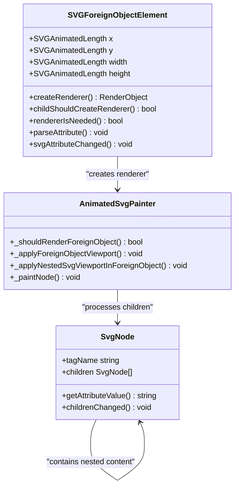
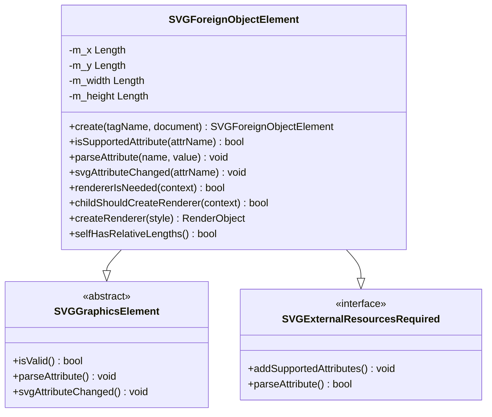
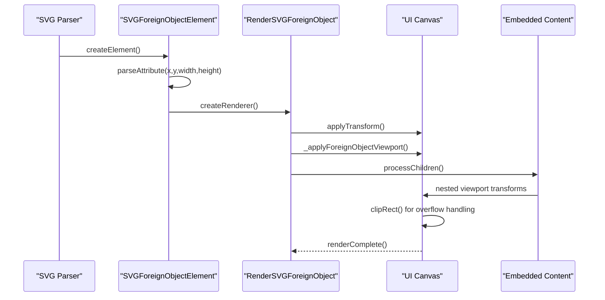

# ForeignObject Semantics

<cite>
**Referenced Files in This Document**
- [SVGForeignObjectElement.cpp](file://blink-b87d44f-Source-core-svg/SVGForeignObjectElement.cpp)
- [SVGForeignObjectElement.h](file://blink-b87d44f-Source-core-svg/SVGForeignObjectElement.h)
- [SVGForeignObjectElement.idl](file://blink-b87d44f-Source-core-svg/SVGForeignObjectElement.idl)
- [animated_svg_painter_tree.dart](file://lib/src/animation/animated_svg_painter_tree.dart)
- [animated_svg_painter_use.dart](file://lib/src/animation/animated_svg_painter_use.dart)
- [foreign_object_advanced_test.dart](file://test/animation/foreign_object_advanced_test.dart)
- [SVGElement.cpp](file://blink-b87d44f-Source-core-svg/SVGElement.cpp)
</cite>

## Table of Contents
1. [Introduction](#introduction)
2. [ForeignObject Architecture](#foreignobject-architecture)
3. [Core Implementation Components](#core-implementation-components)
4. [Rendering Pipeline](#rendering-pipeline)
5. [Viewport Management](#viewport-management)
6. [Attribute Processing](#attribute-processing)
7. [Test Coverage](#test-coverage)
8. [Performance Considerations](#performance-considerations)
9. [Troubleshooting Guide](#troubleshooting-guide)
10. [Conclusion](#conclusion)

## Introduction

ForeignObject is a crucial SVG element that enables embedding arbitrary XML content, primarily HTML, within SVG graphics. This capability allows developers to combine vector graphics with rich text content, interactive elements, and modern web technologies while maintaining the scalability and resolution independence of SVG.

The ForeignObject semantics define how embedded content is positioned, sized, and rendered within the SVG coordinate system, including viewport management, overflow handling, and coordinate transformation propagation. Understanding these semantics is essential for implementing robust SVG applications that seamlessly integrate vector graphics with HTML content.

## ForeignObject Architecture

ForeignObject serves as a bridge between SVG and HTML content, creating a viewport boundary that controls how embedded content is rendered and interacted with. The architecture consists of several key components working together to provide seamless integration.

**Diagram sources**
- [SVGForeignObjectElement.cpp:35-128](file://blink-b87d44f-Source-core-svg/SVGForeignObjectElement.cpp#L35-L128)
- [animated_svg_painter_tree.dart:184-231](file://lib/src/animation/animated_svg_painter_tree.dart#L184-L231)

The architecture ensures that ForeignObject maintains strict boundaries between the SVG coordinate system and embedded content, preventing content from escaping its designated viewport while allowing proper coordinate transformations to propagate through the hierarchy.

**Section sources**
- [SVGForeignObjectElement.h:31-58](file://blink-b87d44f-Source-core-svg/SVGForeignObjectElement.h#L31-L58)
- [SVGForeignObjectElement.idl:26-35](file://blink-b87d44f-Source-core-svg/SVGForeignObjectElement.idl#L26-L35)

## Core Implementation Components

### SVGForeignObjectElement Class Structure

The SVGForeignObjectElement class extends SVGGraphicsElement and implements specialized behavior for managing embedded content. It defines animated properties for positioning and sizing, along with validation and rendering logic.

**Diagram sources**
- [SVGForeignObjectElement.cpp:35-63](file://blink-b87d44f-Source-core-svg/SVGForeignObjectElement.cpp#L35-L63)
- [SVGForeignObjectElement.h:31-58](file://blink-b87d44f-Source-core-svg/SVGForeignObjectElement.h#L31-L58)

### Animated Property Definitions

ForeignObject supports four primary animated properties that control its positioning and sizing within the SVG coordinate system:

| Property | Type | Description | Default Value |
|----------|------|-------------|---------------|
| `x` | SVGAnimatedLength | Horizontal position offset | 0 |
| `y` | SVGAnimatedLength | Vertical position offset | 0 |
| `width` | SVGAnimatedLength | Viewport width | 0 (requires explicit value) |
| `height` | SVGAnimatedLength | Viewport height | 0 (requires explicit value) |

These properties enable dynamic resizing and positioning of ForeignObject content, supporting animations and responsive design scenarios.

**Section sources**
- [SVGForeignObjectElement.cpp:36-51](file://blink-b87d44f-Source-core-svg/SVGForeignObjectElement.cpp#L36-L51)
- [SVGForeignObjectElement.idl:27-31](file://blink-b87d44f-Source-core-svg/SVGForeignObjectElement.idl#L27-L31)

## Rendering Pipeline

The rendering pipeline for ForeignObject involves multiple stages that ensure proper coordinate transformation, viewport management, and content validation.

**Diagram sources**
- [SVGForeignObjectElement.cpp:125-128](file://blink-b87d44f-Source-core-svg/SVGForeignObjectElement.cpp#L125-L128)
- [animated_svg_painter_tree.dart:3-231](file://lib/src/animation/animated_svg_painter_tree.dart#L3-L231)

### Required Extensions Validation

ForeignObject implements the `requiredExtensions` attribute for conditional rendering, following SVG specification patterns. When `requiredExtensions` is specified and unsupported, the ForeignObject is skipped during rendering, enabling graceful fallback patterns.

**Section sources**
- [animated_svg_painter_use.dart:11-25](file://lib/src/animation/animated_svg_painter_use.dart#L11-L25)
- [foreign_object_advanced_test.dart:8-44](file://test/animation/foreign_object_advanced_test.dart#L8-L44)

## Viewport Management

ForeignObject creates a dedicated viewport boundary that controls how embedded content is positioned and clipped within the SVG coordinate system. This viewport management ensures proper isolation between SVG graphics and embedded content.

**Diagram sources**
- [animated_svg_painter_use.dart:27-47](file://lib/src/animation/animated_svg_painter_use.dart#L27-L47)
- [animated_svg_painter_tree.dart:184-205](file://lib/src/animation/animated_svg_painter_tree.dart#L184-L205)

### Nested SVG Context Switching

When ForeignObject contains an `<svg>` element, it establishes a secondary coordinate system that operates independently from the parent SVG context. This nested viewport follows SVG specification for coordinate transformation and clipping.

**Section sources**
- [animated_svg_painter_use.dart:49-144](file://lib/src/animation/animated_svg_painter_use.dart#L49-L144)
- [foreign_object_advanced_test.dart:117-182](file://test/animation/foreign_object_advanced_test.dart#L117-L182)

## Attribute Processing

ForeignObject supports a comprehensive set of attributes that control its behavior and appearance within the SVG document.

### Supported Attributes

| Attribute | Type | Purpose | Default |
|-----------|------|---------|---------|
| `x` | Length | Horizontal position | 0 |
| `y` | Length | Vertical position | 0 |
| `width` | Length | Viewport width | 0 (required) |
| `height` | Length | Viewport height | 0 (required) |
| `overflow` | Enum | Overflow behavior | `hidden` |
| `requiredExtensions` | URI List | Feature detection | None |
| `externalResourcesRequired` | Boolean | Resource loading policy | False |

### Overflow Handling Behavior

ForeignObject implements SVG-compliant overflow handling with `hidden` as the default behavior:

- **`hidden`**: Clips content to the ForeignObject viewport
- **`visible`**: Allows content to extend beyond viewport boundaries
- **Other values**: Treated as `hidden` for compatibility

**Section sources**
- [SVGForeignObjectElement.cpp:70-102](file://blink-b87d44f-Source-core-svg/SVGForeignObjectElement.cpp#L70-L102)
- [animated_svg_painter_use.dart:42-46](file://lib/src/animation/animated_svg_painter_use.dart#L42-L46)
- [foreign_object_advanced_test.dart:279-378](file://test/animation/foreign_object_advanced_test.dart#L279-L378)

## Test Coverage

The ForeignObject implementation includes comprehensive test coverage validating various semantic behaviors and edge cases.

### Core Functionality Tests

The test suite validates fundamental ForeignObject behaviors including:

- **Required Extensions**: Conditional rendering based on feature support
- **Nested SVG Context**: Proper coordinate system establishment
- **Viewport Dimensions**: Zero-width/height handling and default values
- **Overflow Control**: Clipping and visibility behavior
- **Transform Propagation**: Coordinate transformation inheritance
- **Hit Testing**: Interactive element accessibility within ForeignObject

### Advanced Scenarios

Additional test coverage includes complex scenarios such as:

- **Switch Fallback Patterns**: Integration with SVG `<switch>` elements
- **CSS Cascade**: Presentation attribute inheritance
- **Transform Composition**: Multiple transform layers
- **Nested Viewports**: Complex coordinate system hierarchies

**Section sources**
- [foreign_object_advanced_test.dart:1-634](file://test/animation/foreign_object_advanced_test.dart#L1-L634)

## Performance Considerations

ForeignObject rendering involves several performance-critical considerations that impact overall SVG rendering efficiency.

### Rendering Optimization

The rendering pipeline implements several optimization strategies:

- **Early Exit Conditions**: Immediate skipping when ForeignObject has zero dimensions
- **Conditional Rendering**: Deferred processing based on requiredExtensions
- **Viewport Caching**: Efficient coordinate transformation caching
- **Clip Rectangle Optimization**: Minimal clipping operations

### Memory Management

ForeignObject content requires careful memory management:

- **Lazy Evaluation**: Child content processed only when needed
- **Resource Cleanup**: Proper disposal of embedded content resources
- **Transform State**: Efficient transform matrix management
- **Event Handling**: Optimized hit testing for interactive elements

## Troubleshooting Guide

Common ForeignObject issues and their solutions:

### Content Not Visible

**Symptoms**: Embedded content appears invisible within ForeignObject
**Causes**: 
- Zero width or height specified
- RequiredExtensions not supported
- Overflow set to `hidden` with content outside viewport
- Parent container clipping

**Solutions**:
- Verify ForeignObject dimensions are greater than zero
- Check requiredExtensions compatibility
- Adjust overflow attribute or content positioning
- Review parent container clipping behavior

### Coordinate Transformation Issues

**Symptoms**: Content positioned incorrectly within ForeignObject
**Causes**:
- Incorrect transform attribute usage
- Mixed coordinate systems between ForeignObject and nested SVG
- Preserved aspect ratio conflicts

**Solutions**:
- Verify transform matrix calculations
- Ensure consistent coordinate system usage
- Check viewBox and preserveAspectRatio settings
- Test with simplified coordinate systems first

### Performance Problems

**Symptoms**: Slow rendering or memory usage issues
**Causes**:
- Large ForeignObject content areas
- Complex nested viewport hierarchies
- Excessive transform operations
- Memory leaks in embedded content

**Solutions**:
- Optimize ForeignObject dimensions
- Simplify nested viewport structures
- Reduce transform complexity
- Implement proper resource cleanup

**Section sources**
- [foreign_object_advanced_test.dart:184-277](file://test/animation/foreign_object_advanced_test.dart#L184-L277)
- [animated_svg_painter_use.dart:11-25](file://lib/src/animation/animated_svg_painter_use.dart#L11-L25)

## Conclusion

ForeignObject semantics represent a sophisticated integration point between SVG and HTML content, requiring careful consideration of viewport management, coordinate transformation, and rendering optimization. The implementation demonstrates strong adherence to SVG specifications while providing practical functionality for real-world applications.

Key strengths of the implementation include comprehensive test coverage, efficient rendering pipeline, and robust error handling. The architecture successfully balances flexibility with performance, enabling complex scenarios like nested SVG contexts and conditional rendering through requiredExtensions.

Future enhancements could focus on expanding supported embedded content types, improving performance for large content areas, and providing more granular control over coordinate system behavior. The existing foundation provides excellent groundwork for continued evolution of ForeignObject capabilities.