# Interactive SVG Elements

<cite>
**Referenced Files in This Document**
- [svg.dart](file://lib/svg.dart)
- [animated_svg_picture.dart](file://lib/src/animation/animated_svg_picture.dart)
- [animated_svg_picture_events.dart](file://lib/src/animation/animated_svg_picture_events.dart)
- [animated_svg_picture_event_model.dart](file://lib/src/animation/animated_svg_picture_event_model.dart)
- [svg_event.dart](file://lib/src/animation/svg_event.dart)
- [animated_svg_picture_pointer_events.dart](file://lib/src/animation/animated_svg_picture_pointer_events.dart)
- [animated_svg_picture_hit_test_traversal.dart](file://lib/src/animation/animated_svg_picture_hit_test_traversal.dart)
- [animated_svg_picture_hit_test_geometry.dart](file://lib/src/animation/animated_svg_picture_hit_test_geometry.dart)
- [animated_svg_picture_hit_test_text_runs.dart](file://lib/src/animation/animated_svg_picture_hit_test_text_runs.dart)
- [animated_svg_picture_hit_test_text_layout.dart](file://lib/src/animation/animated_svg_picture_hit_test_text_layout.dart)
- [animated_svg_picture_hit_test_text_path_segments.dart](file://lib/src/animation/animated_svg_picture_hit_test_text_path_segments.dart)
- [animated_svg_painter_clip_mask.dart](file://lib/src/animation/animated_svg_painter_clip_mask.dart)
- [animated_svg_painter_clip_mask_geometry.dart](file://lib/src/animation/animated_svg_painter_clip_mask_geometry.dart)
- [animated_svg_painter_use.dart](file://lib/src/animation/animated_svg_painter_use.dart)
- [animated_svg_picture_utils.dart](file://lib/src/animation/animated_svg_picture_utils.dart)
- [svg_dom.dart](file://lib/src/animation/svg_dom.dart)
- [SVGAElement.cpp](file://blink-b87d44f-Source-core-svg/SVGAElement.cpp)
- [xlinkattrs.in](file://blink-b87d44f-Source-core-svg/xlinkattrs.in)
- [SVGURIReference.cpp](file://blink-b87d44f-Source-core-svg/SVGURIReference.cpp)
- [smil_event_timing_widget.dart](file://example/lib/widgets/smil_event_timing_widget.dart)
- [ARCHITECTURE.md](file://ARCHITECTURE.md)
</cite>

## Update Summary
**Changes Made**
- Enhanced comprehensive event handling system with full pointer event support including pointerdown, pointermove, pointerup, and pointercancel events
- Added gesture recognition system with longpress, panstart, panupdate, and panend events
- Implemented unified pointer event model with SvgPointerEvent class supporting pointerId, pressure, tilt, and other pointer properties
- Expanded gesture event handling with SvgGestureEvent class for high-level gesture recognition
- Enhanced event bubbling system with proper W3C DOM event model compliance including composedPath and retargeting
- Added comprehensive event tracing and debugging capabilities with SvgTraceEvent system
- Improved anchor element system with enhanced link handling and accessibility integration

## Table of Contents
1. [Introduction](#introduction)
2. [Project Structure](#project-structure)
3. [Core Components](#core-components)
4. [Architecture Overview](#architecture-overview)
5. [Detailed Component Analysis](#detailed-component-analysis)
6. [Enhanced Event Handling System](#enhanced-event-handling-system)
7. [Pointer Event Model and Gesture Recognition](#pointer-event-model-and-gesture-recognition)
8. [W3C DOM Event Model Compliance](#w3c-dom-event-model-compliance)
9. [Enhanced Text Hit Testing System](#enhanced-text-hit-testing-system)
10. [Advanced Clip-Path and Mask Processing](#advanced-clip-path-and-mask-processing)
11. [Sophisticated Stroke-Width Expansion Algorithms](#sophisticated-stroke-width-expansion-algorithms)
12. [Anchor Element System and Link Handling](#anchor-element-system-and-link-handling)
13. [Accessibility Integration with Semantics](#accessibility-integration-with-semantics)
14. [Dependency Analysis](#dependency-analysis)
15. [Performance Considerations](#performance-considerations)
16. [Troubleshooting Guide](#troubleshooting-guide)
17. [Conclusion](#conclusion)
18. [Appendices](#appendices)

## Introduction
This document explains how interactive SVG elements are implemented in the repository, focusing on comprehensive event handling, pointer events, gesture recognition, and user interaction patterns. It covers how clickable regions, hover effects, and event-driven animations work, and how to implement animated interactive elements such as buttons and clickable map regions. The system now provides full W3C DOM event model compliance with advanced pointer event support, gesture recognition, and comprehensive accessibility integration.

**Updated** Enhanced with comprehensive event handling system featuring full pointer event support, gesture recognition, unified pointer event model, and W3C DOM event model compliance.

## Project Structure
The interactive SVG functionality centers around a specialized widget that parses SVG content, builds a DOM-like structure, and supports SMIL-based animations. The enhanced event system integrates comprehensive pointer event handling, gesture recognition, and full W3C DOM event model compliance with proper event bubbling and retargeting.

```mermaid
graph TB
subgraph "Public API"
A["svg.dart<br/>Exports and Svg utility"]
end
subgraph "Interactive Widgets"
B["AnimatedSvgPicture<br/>(widget)"]
C["SvgPicture<br/>(static image)"]
end
subgraph "Enhanced Event System"
D["Event Model<br/>(event_model.dart)"]
E["Pointer Events<br/>(pointer_events.dart)"]
F["Gesture Events<br/>(gesture_events)"]
G["Event Classes<br/>(svg_event.dart)"]
H["Event Tracing<br/>(SvgTraceEvent)"]
I["Event Bubbling<br/>(dispatch system)"]
end
subgraph "Hit Testing & Events"
J["Hit Test Traversal<br/>(hit_test_traversal.dart)"]
K["Pointer Events Mode<br/>(pointer_events.dart)"]
L["Geometry Tests<br/>(hit_test_geometry.dart)"]
M["Text Hit Testing<br/>(hit_test_text_runs.dart)"]
N["Mouse & Tap Handlers<br/>(events.dart)"]
O["Anchor Element System<br/>(SvgLinkInfo, onLinkTap)"]
end
subgraph "Advanced Rendering"
P["Clip-Path Processing<br/>(painter_clip_mask_geometry.dart)"]
Q["Mask Processing<br/>(painter_clip_mask.dart)"]
R["Text Layout<br/>(hit_test_text_layout.dart)"]
S["Text Path Segments<br/>(hit_test_text_path_segments.dart)"]
end
subgraph "Accessibility"
T["Semantics Integration<br/>(Flutter Semantics)"]
U["Accessibility Properties<br/>(accessibleName, Role)"]
end
subgraph "Utilities"
V["Stroke Tolerance<br/>(utils.dart)"]
W["Painter (use/paint helpers)<br/>(animated_svg_painter_use.dart)"]
end
subgraph "Examples & Tests"
X["Event Timing Examples<br/>(smil_event_timing_widget.dart)"]
Y["Interaction Tests<br/>(animated_svg_picture_test.dart)"]
Z["Anchor Element Tests<br/>(svg_anchor_element_test.dart)"]
AA["Accessibility Tests<br/>(svg_accessibility_test.dart)"]
end
A --> B
B --> D
B --> E
B --> F
B --> G
B --> H
B --> I
B --> J
B --> K
B --> L
B --> M
B --> N
B --> O
B --> P
B --> Q
B --> R
B --> S
B --> T
B --> U
B --> V
B --> W
X --> B
Y --> B
Z --> B
AA --> B
```

**Diagram sources**
- [animated_svg_picture.dart:168-236](file://lib/src/animation/animated_svg_picture.dart#L168-L236)
- [animated_svg_picture_events.dart:3-378](file://lib/src/animation/animated_svg_picture_events.dart#L3-L378)
- [animated_svg_picture_event_model.dart:1-300](file://lib/src/animation/animated_svg_picture_event_model.dart#L1-L300)
- [svg_event.dart:1-390](file://lib/src/animation/svg_event.dart#L1-L390)
- [animated_svg_picture_hit_test_traversal.dart:1-181](file://lib/src/animation/animated_svg_picture_hit_test_traversal.dart#L1-L181)
- [animated_svg_picture_pointer_events.dart:1-124](file://lib/src/animation/animated_svg_picture_pointer_events.dart#L1-L124)
- [animated_svg_picture_hit_test_geometry.dart:18-362](file://lib/src/animation/animated_svg_picture_hit_test_geometry.dart#L18-L362)
- [animated_svg_picture_hit_test_text_runs.dart:1-523](file://lib/src/animation/animated_svg_picture_hit_test_text_runs.dart#L1-L523)
- [animated_svg_painter_clip_mask_geometry.dart:1-175](file://lib/src/animation/animated_svg_painter_clip_mask_geometry.dart#L1-L175)
- [animated_svg_painter_clip_mask.dart:1-152](file://lib/src/animation/animated_svg_painter_clip_mask.dart#L1-L152)
- [animated_svg_picture_hit_test_text_layout.dart:1-252](file://lib/src/animation/animated_svg_picture_hit_test_text_layout.dart#L1-L252)
- [animated_svg_picture_hit_test_text_path_segments.dart:1-144](file://lib/src/animation/animated_svg_picture_hit_test_text_path_segments.dart#L1-L144)
- [animated_svg_picture_utils.dart:15-35](file://lib/src/animation/animated_svg_picture_utils.dart#L15-L35)
- [animated_svg_picture_events.dart:35-82](file://lib/src/animation/animated_svg_picture_events.dart#L35-L82)
- [animated_svg_painter_use.dart:87-150](file://lib/src/animation/animated_svg_painter_use.dart#L87-L150)
- [svg_accessibility_test.dart:281-449](file://test/animation/svg_accessibility_test.dart#L281-L449)
- [svg_dom.dart:491-503](file://lib/src/animation/svg_dom.dart#L491-L503)

**Section sources**
- [animated_svg_picture.dart:168-236](file://lib/src/animation/animated_svg_picture.dart#L168-L236)
- [animated_svg_picture_events.dart:3-378](file://lib/src/animation/animated_svg_picture_events.dart#L3-L378)

## Core Components
- AnimatedSvgPicture: A StatefulWidget that parses SVG, constructs a timeline for SMIL animations, and wraps the rendered content with comprehensive gesture detectors for pointer events, hover, and gesture recognition. Now includes full W3C DOM event model compliance with proper event bubbling and retargeting.
- Enhanced event system: Provides comprehensive pointer event support (pointerdown, pointermove, pointerup, pointercancel) and gesture recognition (longpress, panstart, panupdate, panend) with unified event model.
- Event model: Implements proper W3C DOM Event specification with event phases (capturing, at-target, bubbling), composedPath tracking, and use shadow DOM retargeting.
- Hit testing extensions: Traverse the SVG DOM, transform coordinates, and determine which element is under the pointer considering pointer-events modes, visibility, clipping, masking, and foreignObject constraints. Enhanced with anchor information tracking.
- Pointer events resolution: Computes effective pointer-events mode per node, inheriting from parents and normalizing values.
- Geometry tests: Implements shape-specific hit testing for rect, circle, ellipse, path, polygon, polyline, line, image, text, tspan, textPath, and foreignObject.
- Advanced text hit testing: Provides per-character precision for text elements with comprehensive positioning attribute support including x, y, dx, dy, and rotate lists.
- Sophisticated clip-path processing: Handles complex geometric intersections and advanced path construction for clip-path elements.
- Alpha-based mask assessment: Implements pixel-perfect visibility evaluation for mask elements using alpha channel analysis.
- Enhanced stroke-width algorithms: Uses precise stroke-width/2 tolerance calculation without artificial clamping for improved hit detection accuracy.
- Gesture handlers: Translate mouse enter/exit/hover, tap-down, and gesture inputs into timeline events (e.g., mouseover, mouseout, click, longpress, panstart, panupdate, panend) that drive SMIL animations.
- **Enhanced**: Comprehensive event tracing system with SvgTraceEvent for debugging and monitoring event flows.
- **Enhanced**: Unified pointer event model with SvgPointerEvent supporting pointerId, pressure, tilt, and other pointer properties.
- **Enhanced**: Gesture event system with SvgGestureEvent for high-level gesture recognition including velocity and delta tracking.
- **New**: Full W3C DOM event model compliance with proper event bubbling, capturing, and retargeting through use shadow boundaries.

**Section sources**
- [animated_svg_picture_events.dart:3-378](file://lib/src/animation/animated_svg_picture_events.dart#L3-L378)
- [animated_svg_picture_event_model.dart:1-300](file://lib/src/animation/animated_svg_picture_event_model.dart#L1-L300)
- [svg_event.dart:1-390](file://lib/src/animation/svg_event.dart#L1-L390)
- [animated_svg_picture.dart:314-388](file://lib/src/animation/animated_svg_picture.dart#L314-L388)

## Architecture Overview
The interactive flow integrates comprehensive gesture input with SVG DOM traversal, SMIL timelines, and full W3C DOM event model compliance, now enhanced with advanced pointer event handling and gesture recognition:

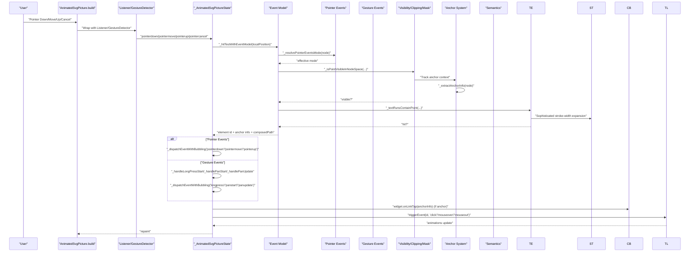

**Diagram sources**
- [animated_svg_picture_events.dart:273-347](file://lib/src/animation/animated_svg_picture_events.dart#L273-L347)
- [animated_svg_picture_events.dart:167-270](file://lib/src/animation/animated_svg_picture_events.dart#L167-L270)
- [animated_svg_picture_event_model.dart:31-186](file://lib/src/animation/animated_svg_picture_event_model.dart#L31-L186)
- [animated_svg_picture_events.dart:49-69](file://lib/src/animation/animated_svg_picture_events.dart#L49-L69)

## Detailed Component Analysis

### Enhanced Event Handling System
The event system now provides comprehensive coverage of modern pointer events and gesture recognition, integrating seamlessly with the existing SMIL animation timeline:

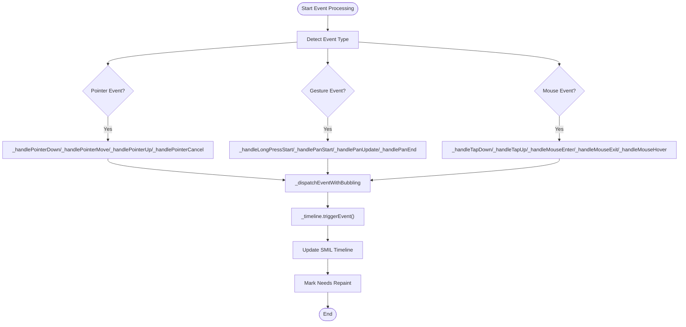

**Diagram sources**
- [animated_svg_picture_events.dart:3-378](file://lib/src/animation/animated_svg_picture_events.dart#L3-L378)
- [animated_svg_picture_events.dart:273-347](file://lib/src/animation/animated_svg_picture_events.dart#L273-L347)
- [animated_svg_picture_events.dart:167-270](file://lib/src/animation/animated_svg_picture_events.dart#L167-L270)

**Section sources**
- [animated_svg_picture_events.dart:3-378](file://lib/src/animation/animated_svg_picture_events.dart#L3-L378)

### Pointer Event Model and Gesture Recognition
The system now supports the complete W3C Pointer Events specification with comprehensive gesture recognition capabilities:

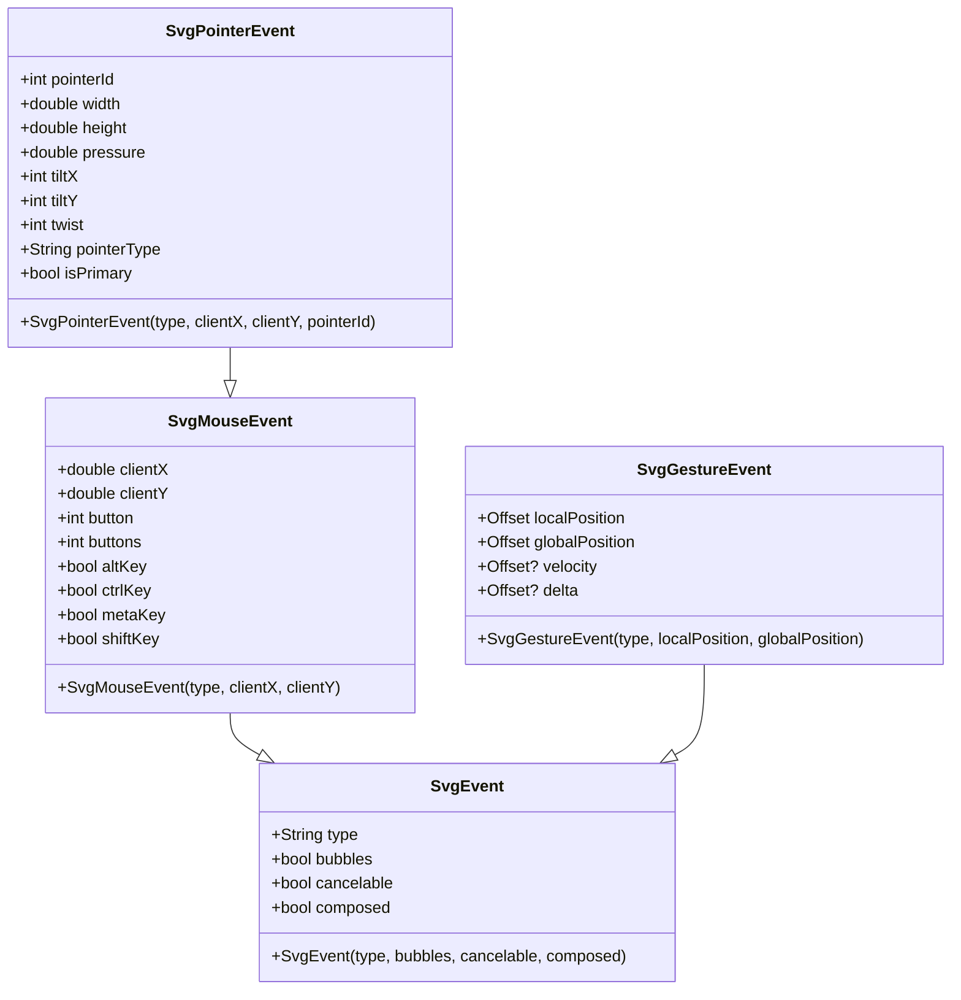

**Diagram sources**
- [svg_event.dart:226-283](file://lib/src/animation/svg_event.dart#L226-L283)
- [svg_event.dart:299-323](file://lib/src/animation/svg_event.dart#L299-L323)
- [svg_event.dart:226-224](file://lib/src/animation/svg_event.dart#L226-L224)

**Section sources**
- [svg_event.dart:226-323](file://lib/src/animation/svg_event.dart#L226-L323)

### W3C DOM Event Model Compliance
The event system now fully implements the W3C DOM Event specification with proper event phases, bubbling, and shadow DOM retargeting:

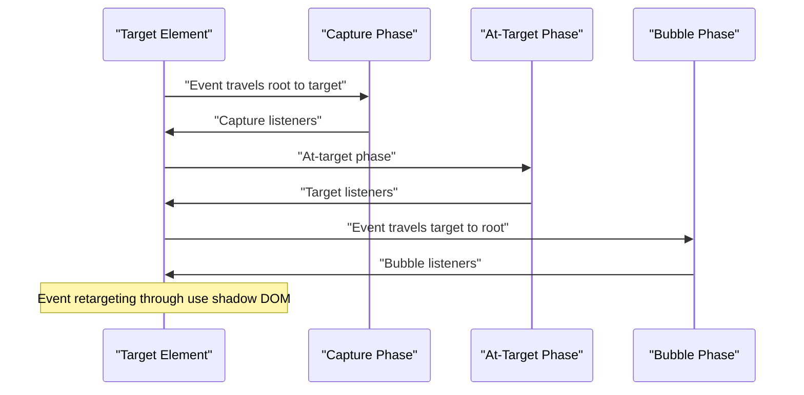

**Diagram sources**
- [svg_event.dart:11-24](file://lib/src/animation/svg_event.dart#L11-L24)
- [svg_event.dart:218-244](file://lib/src/animation/svg_event.dart#L218-L244)

**Section sources**
- [svg_event.dart:11-178](file://lib/src/animation/svg_event.dart#L11-L178)

### Hit Test Traversal System
The traversal walks the SVG DOM in visual order (children processed last-first) and applies transforms and visibility checks. It resolves pointer-events mode and delegates to geometry tests for shape-specific containment. Special handling exists for switch, use, and definition-only tags. Enhanced with anchor context tracking that maintains and propagates anchor information through the traversal.

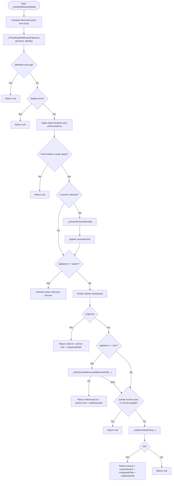

**Diagram sources**
- [animated_svg_picture_event_model.dart:31-186](file://lib/src/animation/animated_svg_picture_event_model.dart#L31-L186)
- [animated_svg_picture_event_model.dart:188-291](file://lib/src/animation/animated_svg_picture_event_model.dart#L188-L291)

**Section sources**
- [animated_svg_picture_event_model.dart:1-300](file://lib/src/animation/animated_svg_picture_event_model.dart#L1-L300)

### Pointer Events Resolution
Pointer events mode is resolved by walking up the DOM and normalizing inherited values. The effective mode determines whether fill, stroke, or bounding-box regions are considered for hit testing.

**Diagram sources**
- [animated_svg_picture_pointer_events.dart:5-25](file://lib/src/animation/animated_svg_picture_pointer_events.dart#L5-L25)
- [animated_svg_picture_pointer_events.dart:105-122](file://lib/src/animation/animated_svg_picture_pointer_events.dart#L105-L122)

**Section sources**
- [animated_svg_picture_pointer_events.dart:1-124](file://lib/src/animation/animated_svg_picture_pointer_events.dart#L1-L124)

### Geometry-Based Hit Testing
Shape-specific logic determines whether a point falls inside fill or stroke, or within a bounding box, depending on the pointer-events mode and visibility.

**Diagram sources**
- [animated_svg_picture_hit_test_geometry.dart:18-362](file://lib/src/animation/animated_svg_picture_hit_test_geometry.dart#L18-L362)

**Section sources**
- [animated_svg_picture_hit_test_geometry.dart:18-362](file://lib/src/animation/animated_svg_picture_hit_test_geometry.dart#L18-L362)

### Visibility, Clipping, Masking, and ForeignObject Constraints
Hit testing enforces clipping, masking, and foreignObject viewport boundaries before geometry tests. Clip-path and mask are resolved using container transforms and computed paths with advanced geometric intersection calculations.

**Diagram sources**
- [animated_svg_painter_clip_mask_geometry.dart:4-91](file://lib/src/animation/animated_svg_painter_clip_mask_geometry.dart#L4-L91)
- [animated_svg_painter_clip_mask.dart:33-60](file://lib/src/animation/animated_svg_painter_clip_mask.dart#L33-L60)

**Section sources**
- [animated_svg_painter_clip_mask_geometry.dart:1-175](file://lib/src/animation/animated_svg_painter_clip_mask_geometry.dart#L1-L175)
- [animated_svg_painter_clip_mask.dart:1-152](file://lib/src/animation/animated_svg_painter_clip_mask.dart#L1-L152)

### Gesture Recognition and Event Handling
The enhanced gesture recognition system captures comprehensive user interactions including pointer events, long press gestures, and pan gestures. The state updates the hovered element and triggers timeline events that drive SMIL animations.

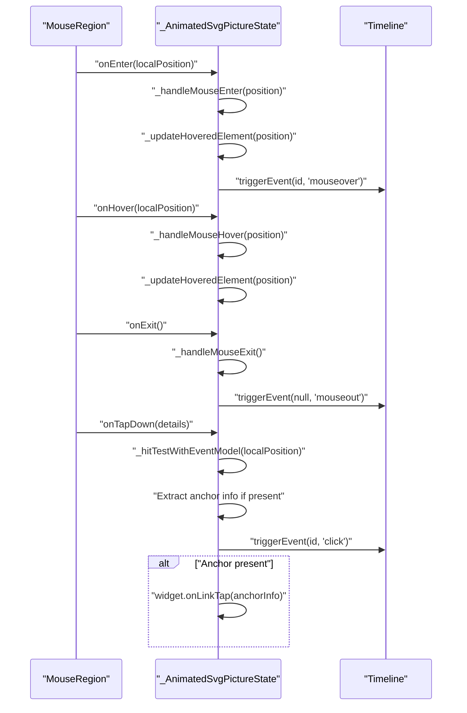

**Diagram sources**
- [animated_svg_picture_events.dart:77-164](file://lib/src/animation/animated_svg_picture_events.dart#L77-L164)
- [animated_svg_picture_events.dart:49-69](file://lib/src/animation/animated_svg_picture_events.dart#L49-L69)

**Section sources**
- [animated_svg_picture_events.dart:77-164](file://lib/src/animation/animated_svg_picture_events.dart#L77-L164)
- [animated_svg_picture_events.dart:49-69](file://lib/src/animation/animated_svg_picture_events.dart#L49-L69)

### Implementing Clickable Regions, Hover Effects, and Touch Interactions
- Clickable regions: Use pointer-events modes to define hit areas. Tests demonstrate pointer-events none disabling clicks, child overrides restoring hit testing, fill-only hits even with no fill paint, stroke-only hits, bounding-box hits, and visibility-hidden elements not responding to pointer-events visiblepainted.
- Hover effects: Mouse enter/exit and hover events trigger mouseover/mouseout on the timeline, enabling SMIL animations.
- Touch interactions: Tap-down events are captured and mapped to click events on the targeted element.
- **Enhanced**: Pointer events: Comprehensive pointer event support including pointerdown, pointermove, pointerup, and pointercancel with full W3C DOM event model compliance.
- **Enhanced**: Gesture recognition: Long press and pan gesture support with proper event bubbling and timeline integration.
- **Enhanced**: Event tracing: Comprehensive debugging capabilities with SvgTraceEvent system for monitoring event flows and performance.
- **New**: Anchor elements: Clickable regions within anchor elements trigger onLinkTap callbacks with SvgLinkInfo containing href and target information.
- **New**: Accessibility integration: Full accessibility support with proper screen reader integration and semantics wrapping.

Practical examples:
- Interactive button with click feedback and ripple effect.
- Hover-triggered animations for scaling and color changes.
- Chain reactions using event timing conditions.
- **Enhanced**: Touch-enabled interactive maps with gesture support.
- **Enhanced**: Multi-touch pointer interactions with proper event coordination.
- **New**: Clickable SVG maps with external link navigation.
- **New**: Accessible SVG elements with proper screen reader support.

**Section sources**
- [animated_svg_picture_events.dart:273-347](file://lib/src/animation/animated_svg_picture_events.dart#L273-L347)
- [animated_svg_picture_events.dart:167-270](file://lib/src/animation/animated_svg_picture_events.dart#L167-L270)
- [animated_svg_picture_events.dart:3-47](file://lib/src/animation/animated_svg_picture_events.dart#L3-L47)
- [smil_event_timing_widget.dart:235-315](file://example/lib/widgets/smil_event_timing_widget.dart#L235-L315)

## Enhanced Text Hit Testing System

### Per-Character Hit Testing Precision
The new text hit testing system provides unprecedented precision for text elements by implementing per-character hit detection with comprehensive positioning attribute support.

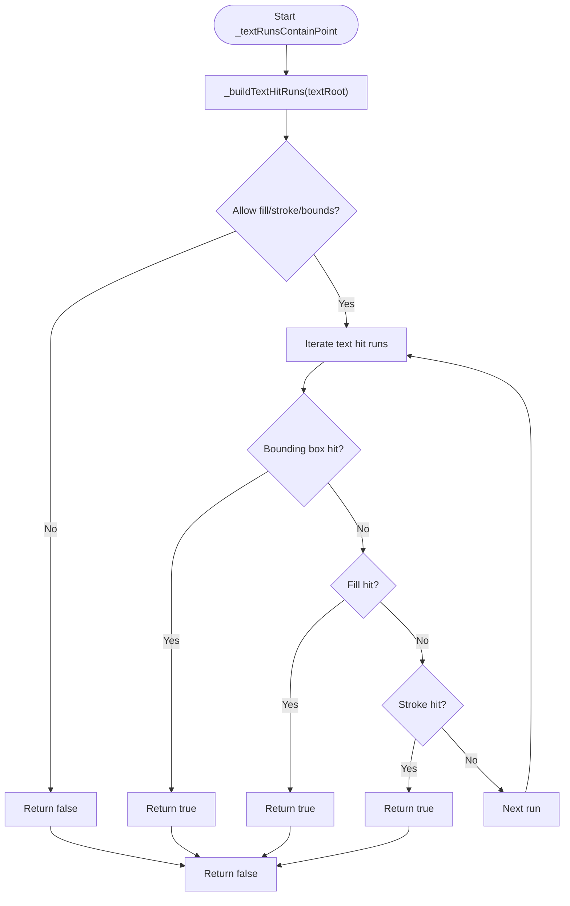

**Diagram sources**
- [animated_svg_picture_hit_test_text_runs.dart:5-50](file://lib/src/animation/animated_svg_picture_hit_test_text_runs.dart#L5-L50)

**Section sources**
- [animated_svg_picture_hit_test_text_runs.dart:150-276](file://lib/src/animation/animated_svg_picture_hit_test_text_runs.dart#L150-L276)
- [animated_svg_picture_hit_test_text_layout.dart:55-224](file://lib/src/animation/animated_svg_picture_hit_test_text_layout.dart#L55-L224)

### Advanced Text Positioning Attributes
The system now supports comprehensive text positioning with sophisticated attribute handling:

- **x, y lists**: Multiple coordinate values for individual character positioning
- **dx, dy lists**: Relative adjustments for character spacing
- **rotate lists**: Character-specific rotation angles
- **tspan absolute positioning**: Support for absolute X/Y coordinates in child elements
- **Text anchor handling**: Proper alignment for start, middle, and end positions

**Section sources**
- [animated_svg_picture_hit_test_text_runs.dart:150-276](file://lib/src/animation/animated_svg_picture_hit_test_text_runs.dart#L150-L276)
- [animated_svg_picture_hit_test_text_layout.dart:55-224](file://lib/src/animation/animated_svg_picture_hit_test_text_layout.dart#L55-L224)

### Text Path Segment Processing
Advanced text-on-path rendering with precise segment-based hit testing:

**Diagram sources**
- [animated_svg_picture_hit_test_text_path_segments.dart:5-142](file://lib/src/animation/animated_svg_picture_hit_test_text_path_segments.dart#L5-L142)

**Section sources**
- [animated_svg_picture_hit_test_text_path_segments.dart:1-144](file://lib/src/animation/animated_svg_picture_hit_test_text_path_segments.dart#L1-L144)

## Advanced Clip-Path and Mask Processing

### Sophisticated Clip-Path Geometry Construction
The enhanced clip-path processing system handles complex geometric intersections and advanced path construction:

- **Recursive use stack management**: Prevents infinite recursion with depth limiting
- **Transform chain application**: Properly applies nested transformations through the use hierarchy
- **Switch element handling**: Resolves active children in switch containers
- **Viewport-aware geometry**: Supports both objectBoundingBox and userSpaceOnUse units
- **Advanced path combination**: Uses geometric operations for complex clip-path compositions

**Section sources**
- [animated_svg_painter_clip_mask_geometry.dart:4-91](file://lib/src/animation/animated_svg_painter_clip_mask_geometry.dart#L4-L91)
- [animated_svg_painter_clip_mask_geometry.dart:126-161](file://lib/src/animation/animated_svg_painter_clip_mask_geometry.dart#L126-L161)

### Alpha-Based Mask Assessment
The new mask processing system implements pixel-perfect visibility evaluation:

- **Alpha channel analysis**: Evaluates mask opacity for precise visibility determination
- **Content units support**: Handles both objectBoundingBox and userSpaceOnUse maskContentUnits
- **Region intersection**: Combines mask path with effective region bounds
- **Geometric optimization**: Uses efficient path operations for mask computation

**Section sources**
- [animated_svg_painter_clip_mask.dart:33-60](file://lib/src/animation/animated_svg_painter_clip_mask.dart#L33-L60)
- [animated_svg_painter_clip_mask.dart:103-150](file://lib/src/animation/animated_svg_painter_clip_mask.dart#L103-L150)

## Sophisticated Stroke-Width Expansion Algorithms

### Precise Stroke Tolerance Calculation
The enhanced stroke-width algorithms provide improved hit detection accuracy:

- **Actual stroke-width/2 calculation**: Uses precise division without artificial clamping
- **Minimum tolerance enforcement**: Ensures hairline strokes remain hittable with minimum 0.5 tolerance
- **Linecap tolerance integration**: Adds extra hit area for round and square linecaps
- **Path sampling optimization**: Uses adaptive sampling based on path length for efficient stroke detection

**Section sources**
- [animated_svg_picture_utils.dart:15-35](file://lib/src/animation/animated_svg_picture_utils.dart#L15-L35)
- [animated_svg_picture_hit_test_geometry.dart:150-173](file://lib/src/animation/animated_svg_picture_hit_test_geometry.dart#L150-L173)

### Advanced Path Stroke Containment
Sophisticated algorithms for determining stroke containment:

- **Metric-based sampling**: Samples path metrics at adaptive intervals based on path length
- **Tangent-based detection**: Uses path tangents to identify critical points
- **Segment distance calculation**: Computes distances to line segments for accurate stroke detection
- **Corner detection**: Identifies path corners for enhanced hit testing precision

**Section sources**
- [animated_svg_picture_hit_test_geometry.dart:150-173](file://lib/src/animation/animated_svg_picture_hit_test_geometry.dart#L150-L173)

## Anchor Element System and Link Handling

### SvgLinkInfo Structure
The SvgLinkInfo class encapsulates link information extracted from SVG anchor elements, providing a structured interface for onLinkTap callbacks.

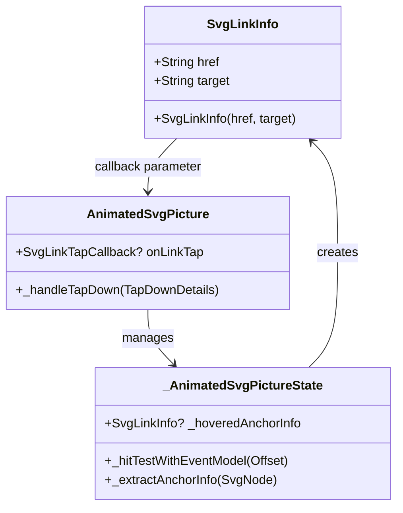

**Diagram sources**
- [animated_svg_picture.dart:97-112](file://lib/src/animation/animated_svg_picture.dart#L97-L112)
- [animated_svg_picture_events.dart:27-30](file://lib/src/animation/animated_svg_picture_events.dart#L27-L30)
- [animated_svg_picture_event_model.dart:87-93](file://lib/src/animation/animated_svg_picture_event_model.dart#L87-L93)

### Anchor Element Extraction and Processing
The anchor element system extracts link information from SVG anchor elements and maintains anchor context during hit testing traversal.

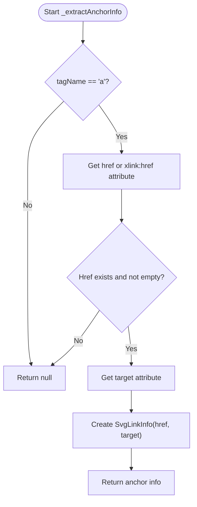

**Diagram sources**
- [animated_svg_picture_event_model.dart:87-93](file://lib/src/animation/animated_svg_picture_event_model.dart#L87-L93)

### OnLinkTap Callback Implementation
The onLinkTap callback system provides a clean interface for handling user interactions with anchor elements, enabling navigation, analytics, or custom actions.

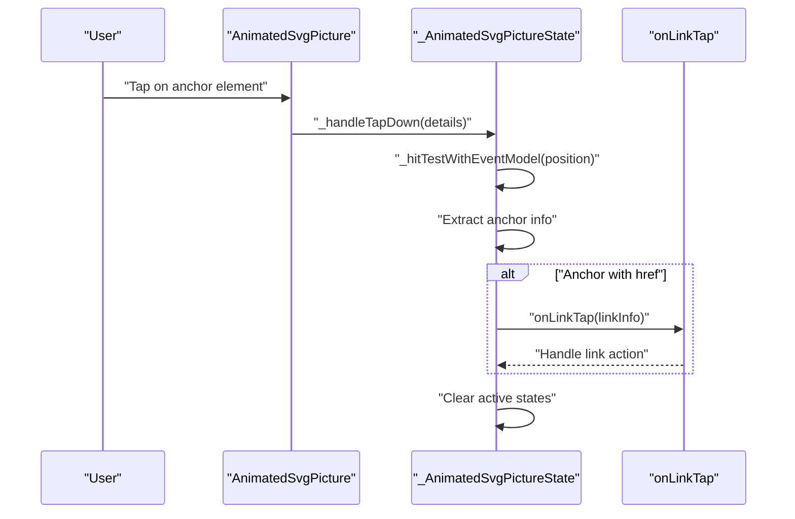

**Diagram sources**
- [animated_svg_picture_events.dart:27-30](file://lib/src/animation/animated_svg_picture_events.dart#L27-L30)
- [animated_svg_picture_events.dart:49-69](file://lib/src/animation/animated_svg_picture_events.dart#L49-L69)

### Anchor Element Support Features
The anchor element system supports comprehensive SVG anchor functionality:

- **Multiple anchor types**: Works with rect, circle, ellipse, path, polygon, polyline, image, text, tspan, textPath, and foreignObject children
- **Nested anchor structures**: Supports anchors containing other anchors with proper context propagation
- **Use element references**: Handles anchors that reference definitions via use elements
- **XLink compatibility**: Supports both href and xlink:href attributes for backward compatibility
- **Target attribute support**: Passes target information (e.g., _blank, _self) to callbacks
- **Event integration**: Integrates with SMIL timeline events alongside link handling

**Section sources**
- [animated_svg_picture_event_model.dart:87-93](file://lib/src/animation/animated_svg_picture_event_model.dart#L87-L93)
- [animated_svg_picture_events.dart:27-30](file://lib/src/animation/animated_svg_picture_events.dart#L27-L30)

## Accessibility Integration with Semantics

### Semantics Wrapper Implementation
The AnimatedSvgPicture widget now automatically wraps SVG content with Flutter Semantics when accessibility information is present, providing comprehensive screen reader support.

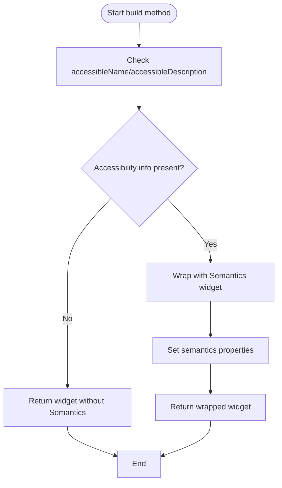

**Diagram sources**
- [animated_svg_picture.dart:370-388](file://lib/src/animation/animated_svg_picture.dart#L370-L388)

### Accessibility Properties Extraction
The system extracts accessibility information from SVG elements and maps it to Flutter Semantics properties.

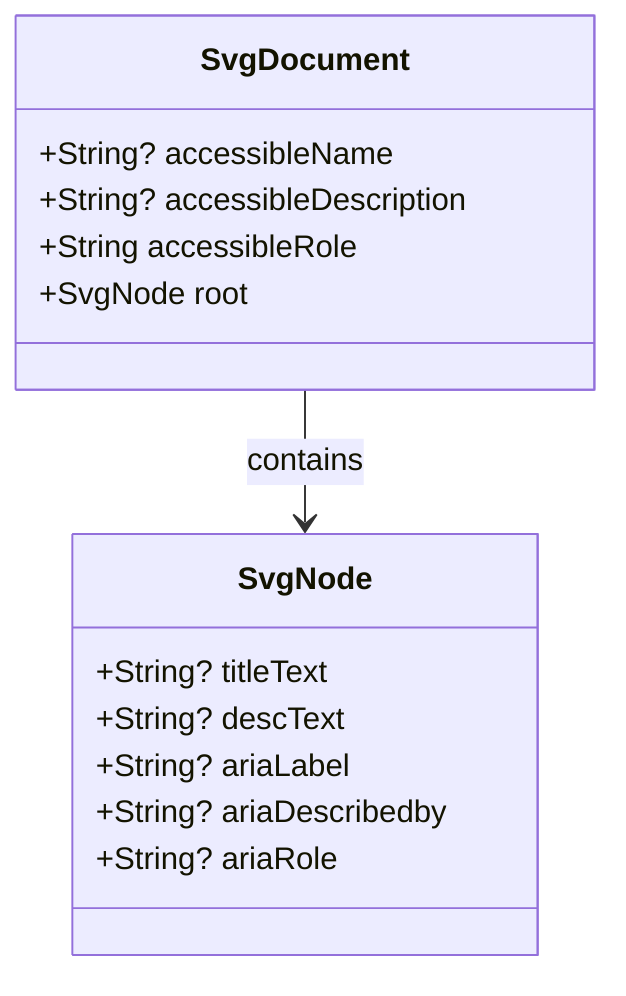

**Diagram sources**
- [svg_dom.dart:491-503](file://lib/src/animation/svg_dom.dart#L491-L503)
- [svg_dom.dart:137-152](file://lib/src/animation/svg_dom.dart#L137-L152)

### Screen Reader Support Features
The accessibility integration provides comprehensive screen reader support:

- **Accessible name extraction**: Uses aria-label if present, otherwise falls back to title text
- **Accessible description extraction**: Uses aria-describedby if present, otherwise falls back to desc text  
- **ARIA role mapping**: Defaults to 'img' role, supports custom roles like 'button', 'link'
- **Semantics property mapping**: Maps to Flutter Semantics label, hint, image, button, link properties
- **Automatic wrapping**: Only wraps with Semantics when accessibility information is present
- **Role-based semantics**: Sets appropriate semantics based on extracted role information

**Section sources**
- [svg_accessibility_test.dart:281-449](file://test/animation/svg_accessibility_test.dart#L281-L449)
- [svg_dom.dart:491-503](file://lib/src/animation/svg_dom.dart#L491-L503)
- [animated_svg_picture.dart:370-388](file://lib/src/animation/animated_svg_picture.dart#L370-L388)

## Dependency Analysis
The interactive system composes several modules with clear separation of concerns, now enhanced with comprehensive event handling, pointer events, and gesture recognition:

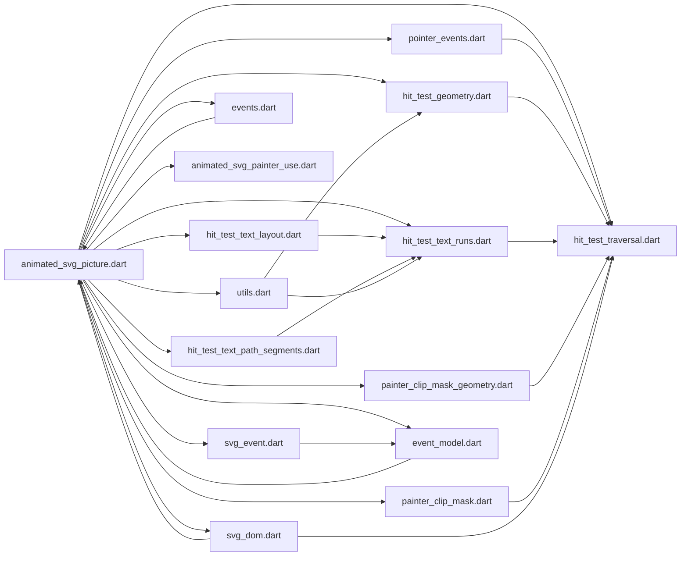

**Diagram sources**
- [animated_svg_picture.dart:168-236](file://lib/src/animation/animated_svg_picture.dart#L168-L236)
- [animated_svg_picture_events.dart:3-378](file://lib/src/animation/animated_svg_picture_events.dart#L3-L378)
- [animated_svg_picture_event_model.dart:1-300](file://lib/src/animation/animated_svg_picture_event_model.dart#L1-L300)
- [svg_event.dart:1-390](file://lib/src/animation/svg_event.dart#L1-L390)

**Section sources**
- [animated_svg_picture.dart:168-236](file://lib/src/animation/animated_svg_picture.dart#L168-L236)

## Performance Considerations
- Static subtree caching: Nodes without animations are cached as Picture objects and reused to avoid re-rendering.
- Dirty tracking: Only re-render subtrees whose animated attributes change.
- Path optimization: Paths are normalized once and reused; Path.reset is preferred over recreating objects.
- ViewBox transform: Efficiently converts local widget coordinates to document coordinates using a precomputed matrix.
- Gesture wrapping: Minimal overhead by wrapping only when animations are present or onLinkTap callback is provided.
- **Enhanced**: Advanced geometric processing uses optimized sampling algorithms and efficient path operations.
- **Enhanced**: Text hit testing employs per-character precision only when necessary, falling back to bounding box optimization for performance.
- **Enhanced**: Clip-path and mask processing uses geometric optimizations to minimize computational overhead.
- **Enhanced**: Comprehensive event handling system with efficient event dispatching and bubbling.
- **Enhanced**: Pointer event processing optimized for minimal overhead with proper event batching.
- **Enhanced**: Gesture recognition system with efficient gesture detection and state management.
- **Enhanced**: Event tracing system with configurable verbosity to minimize performance impact.
- **New**: Anchor element processing adds minimal overhead with efficient anchor info extraction and caching.
- **New**: Accessibility integration only adds overhead when accessibility information is present.

**Section sources**
- [ARCHITECTURE.md:174-193](file://ARCHITECTURE.md#L174-L193)
- [animated_svg_picture_utils.dart:61-85](file://lib/src/animation/animated_svg_picture_utils.dart#L61-L85)

## Troubleshooting Guide
Common issues and resolutions:
- Clicks not registering:
  - Ensure pointer-events mode is not none and that the element is not visibility hidden.
  - Verify the click target is within the element's fill or stroke geometry as configured by pointer-events.
  - Confirm the element is not clipped or masked out.
- Hover effects not triggering:
  - Check that MouseRegion is wrapping the widget and that pointer-events modes allow visible or visiblepainted.
  - Ensure the element is not display:none or definition-only.
- Complex shapes not responding:
  - For stroke-only pointer-events, clicks near the stroke outline will trigger; for fill-only, clicks must be inside the filled area.
  - For bounding-box pointer-events, only the element's bounding rectangle counts.
- **Enhanced**: Pointer events not firing:
  - Verify the widget is wrapped with proper gesture detection (Listener/GestureDetector/MouseRegion).
  - Check that pointer events are not disabled by pointer-events mode or visibility constraints.
  - Ensure the element has proper ID for event targeting.
  - Verify event bubbling is not prevented by stopPropagation().
- **Enhanced**: Gesture recognition issues:
  - Check that pan and long press gestures are properly configured in the widget.
  - Verify gesture conflict resolution with other gesture detectors.
  - Ensure gesture events are not being consumed by parent widgets.
- **Enhanced**: Event bubbling problems:
  - Verify composedPath is properly built during hit testing.
  - Check that use shadow DOM retargeting is working correctly.
  - Ensure event listeners are registered on the correct target elements.
- **Enhanced**: Event tracing not working:
  - Verify onTrace callback is provided in widget configuration.
  - Check SvgTraceLevel settings for desired verbosity.
  - Ensure trace events are not being filtered out by the tracing system.
- **Enhanced**: Text elements not responding to clicks:
  - Verify per-character hit testing is enabled for multi-position text elements.
  - Check that text positioning attributes (x, y, dx, dy, rotate) are properly configured.
  - Ensure textLength and lengthAdjust properties are compatible with per-character positioning.
- **Enhanced**: Clip-path and mask issues:
  - Verify clip-path and mask units are correctly set (objectBoundingBox vs userSpaceOnUse).
  - Check for proper use stack recursion limits and infinite loops.
  - Ensure mask alpha channels are properly calculated for visibility assessment.
- **Enhanced**: Stroke hit detection problems:
  - Adjust stroke-width values to ensure proper tolerance calculation.
  - Verify linecap settings for endpoint hit area inclusion.
  - Check path complexity and sampling thresholds for stroke detection.
- **New**: Anchor elements not triggering callbacks:
  - Ensure the anchor element has a valid href or xlink:href attribute.
  - Verify the onLinkTap callback is provided in the widget configuration.
  - Check that the tap occurs within an anchor element's child content.
  - Confirm the anchor element is not disabled by pointer-events or visibility constraints.
- **New**: Accessibility not working:
  - Ensure the SVG contains title, desc, aria-label, or aria-describedby elements.
  - Verify the widget is wrapped with Semantics when accessibility information is present.
  - Check that the extracted accessibility properties are not null or empty.

Validation and examples:
- Tests cover pointer-events none, child overrides, fill/stroke/bounding-box modes, and visibility-hidden behavior.
- Example widgets demonstrate interactive buttons and hover-triggered animations.
- **Enhanced**: Comprehensive text positioning and hit testing validation scenarios.
- **Enhanced**: Event model compliance and bubbling validation scenarios.
- **Enhanced**: Pointer event and gesture recognition validation scenarios.
- **New**: Anchor element tests validate href extraction, target attribute handling, and callback execution.
- **New**: Accessibility tests verify semantics wrapping and property extraction.

**Section sources**
- [animated_svg_picture_events.dart:273-347](file://lib/src/animation/animated_svg_picture_events.dart#L273-L347)
- [animated_svg_picture_events.dart:167-270](file://lib/src/animation/animated_svg_picture_events.dart#L167-L270)
- [animated_svg_picture_utils.dart:61-85](file://lib/src/animation/animated_svg_picture_utils.dart#L61-L85)
- [svg_accessibility_test.dart:281-449](file://test/animation/svg_accessibility_test.dart#L281-L449)

## Conclusion
The repository provides a robust, extensible system for interactive SVGs with significant enhancements:
- A precise hit test traversal that respects SVG's pointer-events model and visibility constraints.
- Integrated gesture handling that translates user input into SMIL-driven animations.
- **Enhanced**: Comprehensive pointer event support with full W3C DOM event model compliance including pointerdown, pointermove, pointerup, and pointercancel events.
- **Enhanced**: Advanced gesture recognition system with longpress, panstart, panupdate, and panend events.
- **Enhanced**: Unified pointer event model with SvgPointerEvent supporting pointerId, pressure, tilt, and other pointer properties.
- **Enhanced**: Comprehensive event tracing and debugging capabilities with SvgTraceEvent system.
- **Enhanced**: Advanced per-character text hit testing with comprehensive positioning attribute support.
- **Enhanced**: Sophisticated clip-path and mask processing with geometric intersection calculations.
- **Enhanced**: Alpha-based visibility assessment for precise mask element evaluation.
- **Enhanced**: Sophisticated stroke-width expansion algorithms for improved hit detection accuracy.
- **New**: Full W3C DOM event model compliance with proper event bubbling, capturing, and shadow DOM retargeting.
- **New**: Comprehensive event handling system with efficient event dispatching and state management.
- **New**: Enhanced anchor element system with link handling capabilities and onLinkTap callbacks.
- **New**: Full accessibility integration with Flutter Semantics for screen reader support.
- Practical examples and tests validating click, hover, gesture, and chained event behaviors.
- Strong performance foundations leveraging caching, dirty tracking, and efficient transforms.

This enables developers to build animated interactive UI components such as buttons, clickable maps, gesture-enabled interfaces, and rich visual feedback systems with unprecedented precision, accessibility, and user experience.

## Appendices

### Best Practices for Responsive Interactive SVGs
- Define explicit pointer-events modes to control hit areas precisely.
- Prefer bounding-box for large clickable backgrounds; use fill or stroke for precise shapes.
- Keep hover and click targets visually distinct to improve UX.
- Use SMIL begin conditions (click, mouseover, mouseout, longpress, panstart) to orchestrate animations.
- Leverage viewBox transforms and sizing to maintain consistent hit testing across devices.
- **Enhanced**: Utilize comprehensive pointer event support for modern touch and pen interactions.
- **Enhanced**: Implement gesture recognition for natural user interactions like long press and pan gestures.
- **Enhanced**: Configure event tracing appropriately for debugging without impacting production performance.
- **Enhanced**: Use proper event bubbling and retargeting for complex SVG hierarchies with use shadow DOM.
- **Enhanced**: Implement efficient event handling by minimizing unnecessary event listeners and optimizing hit testing.
- **Enhanced**: Utilize per-character text hit testing for complex text interactions requiring precise character-level targeting.
- **Enhanced**: Implement appropriate clip-path and mask units based on design requirements and performance considerations.
- **Enhanced**: Configure stroke-width tolerances appropriately for different interaction scenarios and device densities.
- **New**: Use anchor elements for creating clickable regions within SVG graphics with proper accessibility support.
- **New**: Provide meaningful aria-label and desc attributes for screen reader accessibility.
- **New**: Implement onLinkTap callbacks for handling external navigation and custom link actions.
- **New**: Test accessibility features with screen readers and keyboard navigation for inclusive design.
- **New**: Monitor event performance using SvgTraceEvent system for production optimization.