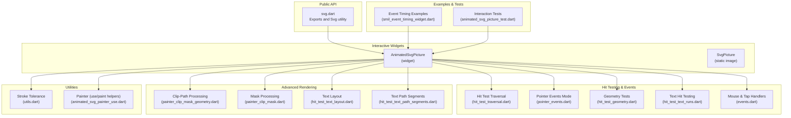
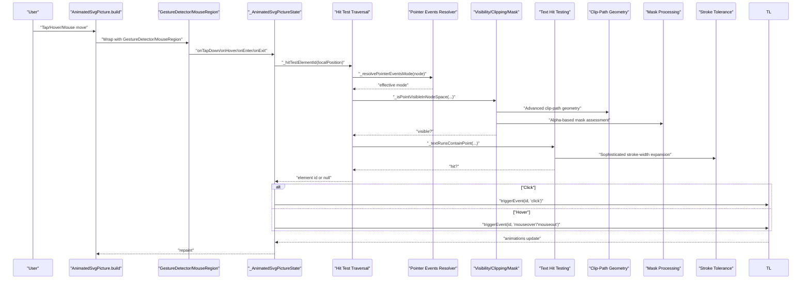
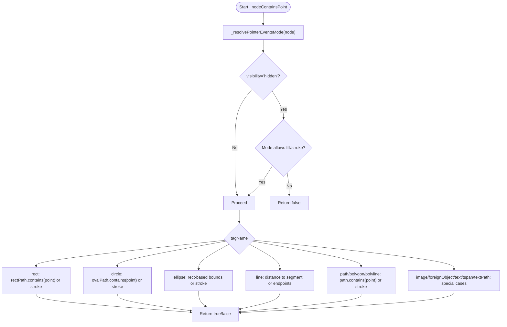
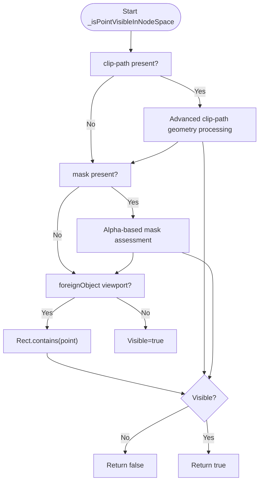
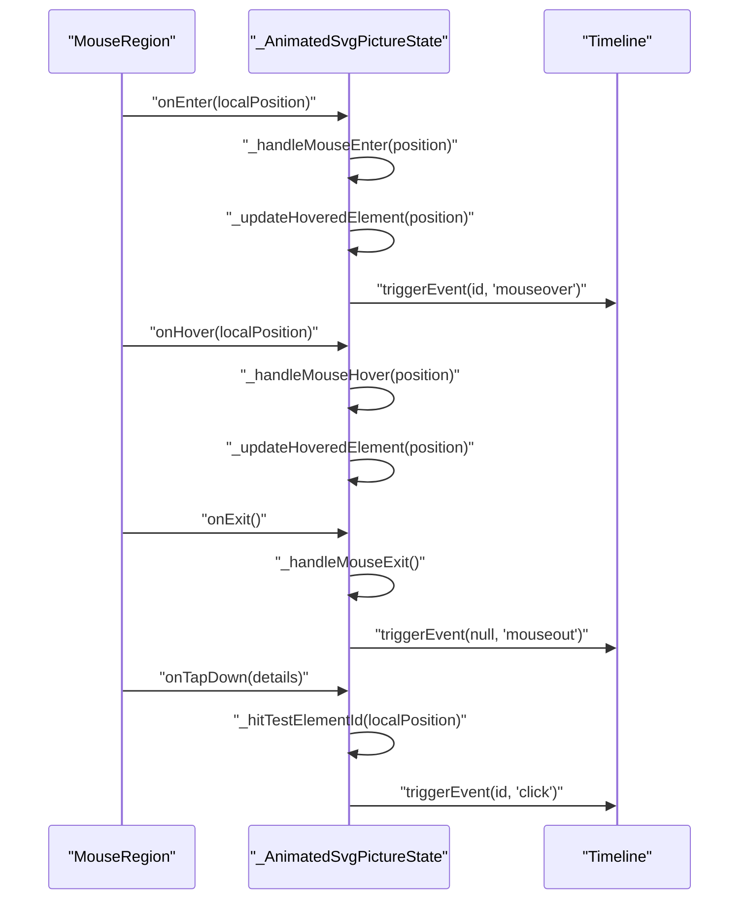
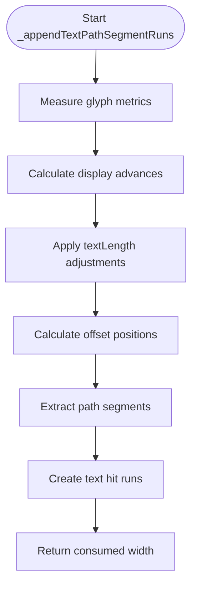
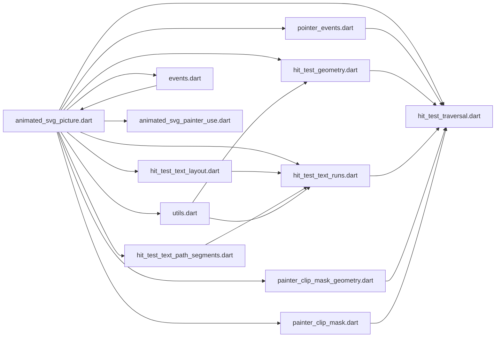

# Interactive SVG Elements

<cite>
**Referenced Files in This Document**
- [svg.dart](file://lib/svg.dart)
- [animated_svg_picture.dart](file://lib/src/animation/animated_svg_picture.dart)
- [animated_svg_picture_pointer_events.dart](file://lib/src/animation/animated_svg_picture_pointer_events.dart)
- [animated_svg_picture_hit_test_traversal.dart](file://lib/src/animation/animated_svg_picture_hit_test_traversal.dart)
- [animated_svg_picture_hit_test_geometry.dart](file://lib/src/animation/animated_svg_picture_hit_test_geometry.dart)
- [animated_svg_picture_hit_test_text_runs.dart](file://lib/src/animation/animated_svg_picture_hit_test_text_runs.dart)
- [animated_svg_picture_hit_test_text_layout.dart](file://lib/src/animation/animated_svg_picture_hit_test_text_layout.dart)
- [animated_svg_picture_hit_test_text_path_segments.dart](file://lib/src/animation/animated_svg_picture_hit_test_text_path_segments.dart)
- [animated_svg_painter_clip_mask.dart](file://lib/src/animation/animated_svg_painter_clip_mask.dart)
- [animated_svg_painter_clip_mask_geometry.dart](file://lib/src/animation/animated_svg_painter_clip_mask_geometry.dart)
- [animated_svg_picture_events.dart](file://lib/src/animation/animated_svg_picture_events.dart)
- [animated_svg_picture_utils.dart](file://lib/src/animation/animated_svg_picture_utils.dart)
- [animated_svg_painter_use.dart](file://lib/src/animation/animated_svg_painter_use.dart)
- [animated_svg_picture_test.dart](file://test/animation/animated_svg_picture_test.dart)
- [smil_event_timing_widget.dart](file://example/lib/widgets/smil_event_timing_widget.dart)
- [ARCHITECTURE.md](file://ARCHITECTURE.md)
</cite>

## Update Summary
**Changes Made**
- Enhanced text hit testing with per-character precision using advanced positioning attributes
- Added sophisticated clip-path and mask geometry processing with advanced intersection calculations
- Implemented alpha-based visibility assessment for mask elements
- Introduced advanced stroke-width expansion algorithms for improved hit detection
- Added comprehensive documentation for new text positioning attributes and tspan absolute positioning handling

## Table of Contents
1. [Introduction](#introduction)
2. [Project Structure](#project-structure)
3. [Core Components](#core-components)
4. [Architecture Overview](#architecture-overview)
5. [Detailed Component Analysis](#detailed-component-analysis)
6. [Enhanced Text Hit Testing System](#enhanced-text-hit-testing-system)
7. [Advanced Clip-Path and Mask Processing](#advanced-clip-path-and-mask-processing)
8. [Sophisticated Stroke-Width Expansion Algorithms](#sophisticated-stroke-width-expansion-algorithms)
9. [Dependency Analysis](#dependency-analysis)
10. [Performance Considerations](#performance-considerations)
11. [Troubleshooting Guide](#troubleshooting-guide)
12. [Conclusion](#conclusion)
13. [Appendices](#appendices)

## Introduction
This document explains how interactive SVG elements are implemented in the repository, focusing on hit testing, pointer events, and user interaction patterns. It covers how clickable regions, hover effects, and event-driven animations work, and how to implement animated interactive elements such as buttons and clickable map regions. It also documents the hit test traversal system, pointer event handling, gesture recognition, and performance considerations for complex interactive SVGs.

**Updated** Enhanced with advanced geometric intersection calculations for clip-path elements, alpha-based visibility assessment for mask elements, sophisticated stroke-width expansion algorithms, and per-character hit-testing for text runs with comprehensive text positioning attribute support.

## Project Structure
The interactive SVG functionality centers around a specialized widget that parses SVG content, builds a DOM-like structure, and supports SMIL-based animations. Pointer events and hit testing are integrated via a traversal system that respects SVG's pointer-events model and visibility constraints.

**Diagram sources**
- [svg.dart:1-627](file://lib/svg.dart#L1-L627)
- [animated_svg_picture.dart:108-295](file://lib/src/animation/animated_svg_picture.dart#L108-L295)
- [animated_svg_picture_hit_test_traversal.dart:1-181](file://lib/src/animation/animated_svg_picture_hit_test_traversal.dart#L1-L181)
- [animated_svg_picture_pointer_events.dart:1-124](file://lib/src/animation/animated_svg_picture_pointer_events.dart#L1-L124)
- [animated_svg_picture_hit_test_geometry.dart:18-362](file://lib/src/animation/animated_svg_picture_hit_test_geometry.dart#L18-L362)
- [animated_svg_picture_hit_test_text_runs.dart:1-523](file://lib/src/animation/animated_svg_picture_hit_test_text_runs.dart#L1-L523)
- [animated_svg_painter_clip_mask_geometry.dart:1-175](file://lib/src/animation/animated_svg_painter_clip_mask_geometry.dart#L1-L175)
- [animated_svg_painter_clip_mask.dart:1-152](file://lib/src/animation/animated_svg_painter_clip_mask.dart#L1-L152)
- [animated_svg_picture_hit_test_text_layout.dart:1-252](file://lib/src/animation/animated_svg_picture_hit_test_text_layout.dart#L1-L252)
- [animated_svg_picture_hit_test_text_path_segments.dart:1-144](file://lib/src/animation/animated_svg_picture_hit_test_text_path_segments.dart#L1-L144)
- [animated_svg_picture_utils.dart:15-35](file://lib/src/animation/animated_svg_picture_utils.dart#L15-L35)
- [animated_svg_picture_events.dart:35-82](file://lib/src/animation/animated_svg_picture_events.dart#L35-L82)
- [animated_svg_painter_use.dart:87-150](file://lib/src/animation/animated_svg_painter_use.dart#L87-L150)
- [smil_event_timing_widget.dart:235-315](file://example/lib/widgets/smil_event_timing_widget.dart#L235-L315)
- [animated_svg_picture_test.dart:2056-2442](file://test/animation/animated_svg_picture_test.dart#L2056-L2442)

**Section sources**
- [svg.dart:1-627](file://lib/svg.dart#L1-L627)
- [animated_svg_picture.dart:108-295](file://lib/src/animation/animated_svg_picture.dart#L108-L295)

## Core Components
- AnimatedSvgPicture: A StatefulWidget that parses SVG, constructs a timeline for SMIL animations, and wraps the rendered content with gesture detectors for pointer events and hover.
- Hit testing extensions: Traverse the SVG DOM, transform coordinates, and determine which element is under the pointer considering pointer-events modes, visibility, clipping, masking, and foreignObject constraints.
- Pointer events resolution: Computes effective pointer-events mode per node, inheriting from parents and normalizing values.
- Geometry tests: Implements shape-specific hit testing for rect, circle, ellipse, path, polygon, polyline, line, image, text, tspan, textPath, and foreignObject.
- Advanced text hit testing: Provides per-character precision for text elements with comprehensive positioning attribute support including x, y, dx, dy, and rotate lists.
- Sophisticated clip-path processing: Handles complex geometric intersections and advanced path construction for clip-path elements.
- Alpha-based mask assessment: Implements pixel-perfect visibility evaluation for mask elements using alpha channel analysis.
- Enhanced stroke-width algorithms: Uses precise stroke-width/2 tolerance calculation without artificial clamping for improved hit detection accuracy.
- Gesture handlers: Translate mouse enter/exit/hover and tap-down into timeline events (e.g., mouseover, mouseout, click) that drive SMIL animations.

**Section sources**
- [animated_svg_picture.dart:108-295](file://lib/src/animation/animated_svg_picture.dart#L108-L295)
- [animated_svg_picture_pointer_events.dart:1-124](file://lib/src/animation/animated_svg_picture_pointer_events.dart#L1-L124)
- [animated_svg_picture_hit_test_traversal.dart:1-181](file://lib/src/animation/animated_svg_picture_hit_test_traversal.dart#L1-L181)
- [animated_svg_picture_hit_test_geometry.dart:18-362](file://lib/src/animation/animated_svg_picture_hit_test_geometry.dart#L18-L362)
- [animated_svg_picture_hit_test_text_runs.dart:1-523](file://lib/src/animation/animated_svg_picture_hit_test_text_runs.dart#L1-L523)
- [animated_svg_painter_clip_mask_geometry.dart:1-175](file://lib/src/animation/animated_svg_painter_clip_mask_geometry.dart#L1-L175)
- [animated_svg_painter_clip_mask.dart:1-152](file://lib/src/animation/animated_svg_painter_clip_mask.dart#L1-L152)
- [animated_svg_picture_utils.dart:15-35](file://lib/src/animation/animated_svg_picture_utils.dart#L15-L35)
- [animated_svg_picture_events.dart:35-82](file://lib/src/animation/animated_svg_picture_events.dart#L35-L82)

## Architecture Overview
The interactive flow integrates gesture input with SVG DOM traversal and SMIL timelines, now enhanced with advanced geometric processing:

**Diagram sources**
- [animated_svg_picture.dart:246-269](file://lib/src/animation/animated_svg_picture.dart#L246-L269)
- [animated_svg_picture_events.dart:35-82](file://lib/src/animation/animated_svg_picture_events.dart#L35-L82)
- [animated_svg_picture_hit_test_traversal.dart:54-151](file://lib/src/animation/animated_svg_picture_hit_test_traversal.dart#L54-L151)
- [animated_svg_picture_pointer_events.dart:5-25](file://lib/src/animation/animated_svg_picture_pointer_events.dart#L5-L25)
- [animated_svg_painter_clip_mask_geometry.dart:4-91](file://lib/src/animation/animated_svg_painter_clip_mask_geometry.dart#L4-L91)
- [animated_svg_painter_clip_mask.dart:33-60](file://lib/src/animation/animated_svg_painter_clip_mask.dart#L33-L60)
- [animated_svg_picture_hit_test_text_runs.dart:5-50](file://lib/src/animation/animated_svg_picture_hit_test_text_runs.dart#L5-L50)
- [animated_svg_picture_utils.dart:15-20](file://lib/src/animation/animated_svg_picture_utils.dart#L15-L20)

## Detailed Component Analysis

### Hit Test Traversal System
The traversal walks the SVG DOM in visual order (children processed last-first) and applies transforms and visibility checks. It resolves pointer-events mode and delegates to geometry tests for shape-specific containment. Special handling exists for switch, use, and definition-only tags.

**Diagram sources**
- [animated_svg_picture_hit_test_traversal.dart:55-151](file://lib/src/animation/animated_svg_picture_hit_test_traversal.dart#L55-L151)

**Section sources**
- [animated_svg_picture_hit_test_traversal.dart:1-181](file://lib/src/animation/animated_svg_picture_hit_test_traversal.dart#L1-L181)

### Pointer Events Resolution
Pointer events mode is resolved by walking up the DOM and normalizing inherited values. The effective mode determines whether fill, stroke, or bounding-box regions are considered for hit testing.

**Diagram sources**
- [animated_svg_picture_pointer_events.dart:5-25](file://lib/src/animation/animated_svg_picture_pointer_events.dart#L5-L25)
- [animated_svg_picture_pointer_events.dart:105-122](file://lib/src/animation/animated_svg_picture_pointer_events.dart#L105-L122)

**Section sources**
- [animated_svg_picture_pointer_events.dart:1-124](file://lib/src/animation/animated_svg_picture_pointer_events.dart#L1-L124)

### Geometry-Based Hit Testing
Shape-specific logic determines whether a point falls inside fill or stroke, or within a bounding box, depending on the pointer-events mode and visibility.

**Diagram sources**
- [animated_svg_picture_hit_test_geometry.dart:18-362](file://lib/src/animation/animated_svg_picture_hit_test_geometry.dart#L18-L362)

**Section sources**
- [animated_svg_picture_hit_test_geometry.dart:18-362](file://lib/src/animation/animated_svg_picture_hit_test_geometry.dart#L18-L362)

### Visibility, Clipping, Masking, and ForeignObject Constraints
Hit testing enforces clipping, masking, and foreignObject viewport boundaries before geometry tests. Clip-path and mask are resolved using container transforms and computed paths with advanced geometric intersection calculations.

**Diagram sources**
- [animated_svg_painter_clip_mask_geometry.dart:4-91](file://lib/src/animation/animated_svg_painter_clip_mask_geometry.dart#L4-L91)
- [animated_svg_painter_clip_mask.dart:33-60](file://lib/src/animation/animated_svg_painter_clip_mask.dart#L33-L60)

**Section sources**
- [animated_svg_painter_clip_mask_geometry.dart:1-175](file://lib/src/animation/animated_svg_painter_clip_mask_geometry.dart#L1-L175)
- [animated_svg_painter_clip_mask.dart:1-152](file://lib/src/animation/animated_svg_painter_clip_mask.dart#L1-L152)

### Gesture Recognition and Event Handling
MouseRegion and GestureDetector capture hover, enter/exit, and tap-down events. The state updates the hovered element and triggers timeline events that drive SMIL animations.

**Diagram sources**
- [animated_svg_picture.dart:246-269](file://lib/src/animation/animated_svg_picture.dart#L246-L269)
- [animated_svg_picture_events.dart:35-82](file://lib/src/animation/animated_svg_picture_events.dart#L35-L82)

**Section sources**
- [animated_svg_picture_events.dart:35-82](file://lib/src/animation/animated_svg_picture_events.dart#L35-L82)
- [animated_svg_picture.dart:246-269](file://lib/src/animation/animated_svg_picture.dart#L246-L269)

### Implementing Clickable Regions, Hover Effects, and Touch Interactions
- Clickable regions: Use pointer-events modes to define hit areas. Tests demonstrate pointer-events none disabling clicks, child overrides restoring hit testing, fill-only hits even with no fill paint, stroke-only hits, bounding-box hits, and visibility-hidden elements not responding to pointer-events visiblepainted.
- Hover effects: Mouse enter/exit and hover events trigger mouseover/mouseout on the timeline, enabling SMIL animations.
- Touch interactions: Tap-down events are captured and mapped to click events on the targeted element.

Practical examples:
- Interactive button with click feedback and ripple effect.
- Hover-triggered animations for scaling and color changes.
- Chain reactions using event timing conditions.

**Section sources**
- [animated_svg_picture_test.dart:2090-2442](file://test/animation/animated_svg_picture_test.dart#L2090-L2442)
- [smil_event_timing_widget.dart:235-315](file://example/lib/widgets/smil_event_timing_widget.dart#L235-L315)
- [smil_event_timing_widget.dart:510-534](file://example/lib/widgets/smil_event_timing_widget.dart#L510-L534)

## Enhanced Text Hit Testing System

### Per-Character Hit Testing Precision
The new text hit testing system provides unprecedented precision for text elements by implementing per-character hit detection with comprehensive positioning attribute support.

**Diagram sources**
- [animated_svg_picture_hit_test_text_runs.dart:5-50](file://lib/src/animation/animated_svg_picture_hit_test_text_runs.dart#L5-L50)

### Advanced Text Positioning Attributes
The system now supports comprehensive text positioning with sophisticated attribute handling:

- **x, y lists**: Multiple coordinate values for individual character positioning
- **dx, dy lists**: Relative adjustments for character spacing
- **rotate lists**: Character-specific rotation angles
- **tspan absolute positioning**: Support for absolute X/Y coordinates in child elements
- **Text anchor handling**: Proper alignment for start, middle, and end positions

**Section sources**
- [animated_svg_picture_hit_test_text_runs.dart:150-276](file://lib/src/animation/animated_svg_picture_hit_test_text_runs.dart#L150-L276)
- [animated_svg_picture_hit_test_text_layout.dart:55-224](file://lib/src/animation/animated_svg_picture_hit_test_text_layout.dart#L55-L224)

### Text Path Segment Processing
Advanced text-on-path rendering with precise segment-based hit testing:

**Diagram sources**
- [animated_svg_picture_hit_test_text_path_segments.dart:5-142](file://lib/src/animation/animated_svg_picture_hit_test_text_path_segments.dart#L5-L142)

**Section sources**
- [animated_svg_picture_hit_test_text_path_segments.dart:1-144](file://lib/src/animation/animated_svg_picture_hit_test_text_path_segments.dart#L1-L144)

## Advanced Clip-Path and Mask Processing

### Sophisticated Clip-Path Geometry Construction
The enhanced clip-path processing system handles complex geometric intersections and advanced path construction:

- **Recursive use stack management**: Prevents infinite recursion with depth limiting
- **Transform chain application**: Properly applies nested transformations through the use hierarchy
- **Switch element handling**: Resolves active children in switch containers
- **Viewport-aware geometry**: Supports both objectBoundingBox and userSpaceOnUse units
- **Advanced path combination**: Uses geometric operations for complex clip-path compositions

**Section sources**
- [animated_svg_painter_clip_mask_geometry.dart:4-91](file://lib/src/animation/animated_svg_painter_clip_mask_geometry.dart#L4-L91)
- [animated_svg_painter_clip_mask_geometry.dart:126-161](file://lib/src/animation/animated_svg_painter_clip_mask_geometry.dart#L126-L161)

### Alpha-Based Mask Assessment
The new mask processing system implements pixel-perfect visibility evaluation:

- **Alpha channel analysis**: Evaluates mask opacity for precise visibility determination
- **Content units support**: Handles both objectBoundingBox and userSpaceOnUse maskContentUnits
- **Region intersection**: Combines mask path with effective region bounds
- **Geometric optimization**: Uses efficient path operations for mask computation

**Section sources**
- [animated_svg_painter_clip_mask.dart:33-60](file://lib/src/animation/animated_svg_painter_clip_mask.dart#L33-L60)
- [animated_svg_painter_clip_mask.dart:103-150](file://lib/src/animation/animated_svg_painter_clip_mask.dart#L103-L150)

## Sophisticated Stroke-Width Expansion Algorithms

### Precise Stroke Tolerance Calculation
The enhanced stroke-width algorithms provide improved hit detection accuracy:

- **Actual stroke-width/2 calculation**: Uses precise division without artificial clamping
- **Minimum tolerance enforcement**: Ensures hairline strokes remain hittable with minimum 0.5 tolerance
- **Linecap tolerance integration**: Adds extra hit area for round and square linecaps
- **Path sampling optimization**: Uses adaptive sampling based on path length for efficient stroke detection

**Section sources**
- [animated_svg_picture_utils.dart:15-35](file://lib/src/animation/animated_svg_picture_utils.dart#L15-L35)
- [animated_svg_picture_hit_test_geometry.dart:150-173](file://lib/src/animation/animated_svg_picture_hit_test_geometry.dart#L150-L173)

### Advanced Path Stroke Containment
Sophisticated algorithms for determining stroke containment:

- **Metric-based sampling**: Samples path metrics at adaptive intervals based on path length
- **Tangent-based detection**: Uses path tangents to identify critical points
- **Segment distance calculation**: Computes distances to line segments for accurate stroke detection
- **Corner detection**: Identifies path corners for enhanced hit testing precision

**Section sources**
- [animated_svg_picture_hit_test_geometry.dart:150-173](file://lib/src/animation/animated_svg_picture_hit_test_geometry.dart#L150-L173)

## Dependency Analysis
The interactive system composes several modules with clear separation of concerns, now enhanced with advanced geometric processing:

**Diagram sources**
- [animated_svg_picture.dart:108-295](file://lib/src/animation/animated_svg_picture.dart#L108-L295)
- [animated_svg_picture_hit_test_traversal.dart:1-181](file://lib/src/animation/animated_svg_picture_hit_test_traversal.dart#L1-L181)
- [animated_svg_picture_pointer_events.dart:1-124](file://lib/src/animation/animated_svg_picture_pointer_events.dart#L1-L124)
- [animated_svg_picture_hit_test_geometry.dart:18-362](file://lib/src/animation/animated_svg_picture_hit_test_geometry.dart#L18-L362)
- [animated_svg_picture_hit_test_text_runs.dart:1-523](file://lib/src/animation/animated_svg_picture_hit_test_text_runs.dart#L1-L523)
- [animated_svg_picture_hit_test_text_layout.dart:1-252](file://lib/src/animation/animated_svg_picture_hit_test_text_layout.dart#L1-L252)
- [animated_svg_picture_hit_test_text_path_segments.dart:1-144](file://lib/src/animation/animated_svg_picture_hit_test_text_path_segments.dart#L1-L144)
- [animated_svg_painter_clip_mask_geometry.dart:1-175](file://lib/src/animation/animated_svg_painter_clip_mask_geometry.dart#L1-L175)
- [animated_svg_painter_clip_mask.dart:1-152](file://lib/src/animation/animated_svg_painter_clip_mask.dart#L1-L152)
- [animated_svg_picture_utils.dart:15-35](file://lib/src/animation/animated_svg_picture_utils.dart#L15-L35)
- [animated_svg_picture_events.dart:35-82](file://lib/src/animation/animated_svg_picture_events.dart#L35-L82)
- [animated_svg_painter_use.dart:87-150](file://lib/src/animation/animated_svg_painter_use.dart#L87-L150)

**Section sources**
- [animated_svg_picture.dart:108-295](file://lib/src/animation/animated_svg_picture.dart#L108-L295)

## Performance Considerations
- Static subtree caching: Nodes without animations are cached as Picture objects and reused to avoid re-rendering.
- Dirty tracking: Only re-render subtrees whose animated attributes change.
- Path optimization: Paths are normalized once and reused; Path.reset is preferred over recreating objects.
- ViewBox transform: Efficiently converts local widget coordinates to document coordinates using a precomputed matrix.
- Gesture wrapping: Minimal overhead by wrapping only when animations are present.
- **Enhanced**: Advanced geometric processing uses optimized sampling algorithms and efficient path operations.
- **Enhanced**: Text hit testing employs per-character precision only when necessary, falling back to bounding box optimization for performance.
- **Enhanced**: Clip-path and mask processing uses geometric optimizations to minimize computational overhead.

**Section sources**
- [ARCHITECTURE.md:174-193](file://ARCHITECTURE.md#L174-L193)
- [animated_svg_picture.dart:35-86](file://lib/src/animation/animated_svg_picture.dart#L35-L86)

## Troubleshooting Guide
Common issues and resolutions:
- Clicks not registering:
  - Ensure pointer-events mode is not none and that the element is not visibility hidden.
  - Verify the click target is within the element's fill or stroke geometry as configured by pointer-events.
  - Confirm the element is not clipped or masked out.
- Hover effects not triggering:
  - Check that MouseRegion is wrapping the widget and that pointer-events modes allow visible or visiblepainted.
  - Ensure the element is not display:none or definition-only.
- Complex shapes not responding:
  - For stroke-only pointer-events, clicks near the stroke outline will trigger; for fill-only, clicks must be inside the filled area.
  - For bounding-box pointer-events, only the element's bounding rectangle counts.
- **Enhanced**: Text elements not responding to clicks:
  - Verify per-character hit testing is enabled for multi-position text elements.
  - Check that text positioning attributes (x, y, dx, dy, rotate) are properly configured.
  - Ensure textLength and lengthAdjust properties are compatible with per-character positioning.
- **Enhanced**: Clip-path and mask issues:
  - Verify clip-path and mask units are correctly set (objectBoundingBox vs userSpaceOnUse).
  - Check for proper use stack recursion limits and infinite loops.
  - Ensure mask alpha channels are properly calculated for visibility assessment.
- **Enhanced**: Stroke hit detection problems:
  - Adjust stroke-width values to ensure proper tolerance calculation.
  - Verify linecap settings for endpoint hit area inclusion.
  - Check path complexity and sampling thresholds for stroke detection.

Validation and examples:
- Tests cover pointer-events none, child overrides, fill/stroke/bounding-box modes, and visibility-hidden behavior.
- Example widgets demonstrate interactive buttons and hover-triggered animations.
- **Enhanced**: Comprehensive text positioning and hit testing validation scenarios.

**Section sources**
- [animated_svg_picture_test.dart:2090-2442](file://test/animation/animated_svg_picture_test.dart#L2090-L2442)
- [animated_svg_picture_pointer_events.dart:27-103](file://lib/src/animation/animated_svg_picture_pointer_events.dart#L27-L103)
- [animated_svg_painter_clip_mask_geometry.dart:4-91](file://lib/src/animation/animated_svg_painter_clip_mask_geometry.dart#L4-L91)
- [animated_svg_painter_clip_mask.dart:33-60](file://lib/src/animation/animated_svg_painter_clip_mask.dart#L33-L60)
- [animated_svg_picture_utils.dart:15-35](file://lib/src/animation/animated_svg_picture_utils.dart#L15-L35)

## Conclusion
The repository provides a robust, extensible system for interactive SVGs with significant enhancements:
- A precise hit test traversal that respects SVG's pointer-events model and visibility constraints.
- Integrated gesture handling that translates user input into SMIL-driven animations.
- **Enhanced**: Advanced per-character text hit testing with comprehensive positioning attribute support.
- **Enhanced**: Sophisticated clip-path and mask processing with geometric intersection calculations.
- **Enhanced**: Alpha-based visibility assessment for precise mask element evaluation.
- **Enhanced**: Sophisticated stroke-width expansion algorithms for improved hit detection accuracy.
- Practical examples and tests validating click, hover, and chained event behaviors.
- Strong performance foundations leveraging caching, dirty tracking, and efficient transforms.

This enables developers to build animated interactive UI components such as buttons, clickable maps, and rich visual feedback systems with unprecedented precision and performance.

## Appendices

### Best Practices for Responsive Interactive SVGs
- Define explicit pointer-events modes to control hit areas precisely.
- Prefer bounding-box for large clickable backgrounds; use fill or stroke for precise shapes.
- Keep hover and click targets visually distinct to improve UX.
- Use SMIL begin conditions (click, mouseover, mouseout) to orchestrate animations.
- Leverage viewBox transforms and sizing to maintain consistent hit testing across devices.
- **Enhanced**: Utilize per-character text hit testing for complex text interactions requiring precise character-level targeting.
- **Enhanced**: Implement appropriate clip-path and mask units based on design requirements and performance considerations.
- **Enhanced**: Configure stroke-width tolerances appropriately for different interaction scenarios and device densities.