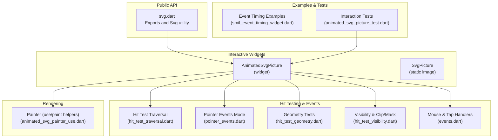
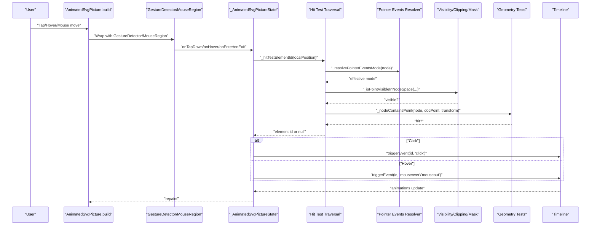
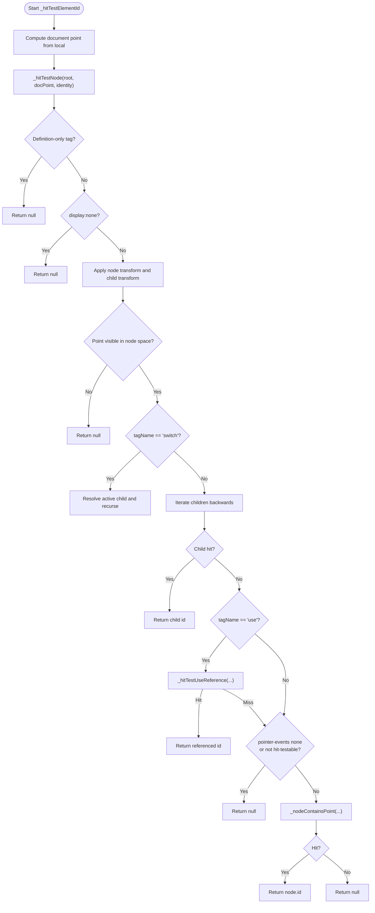
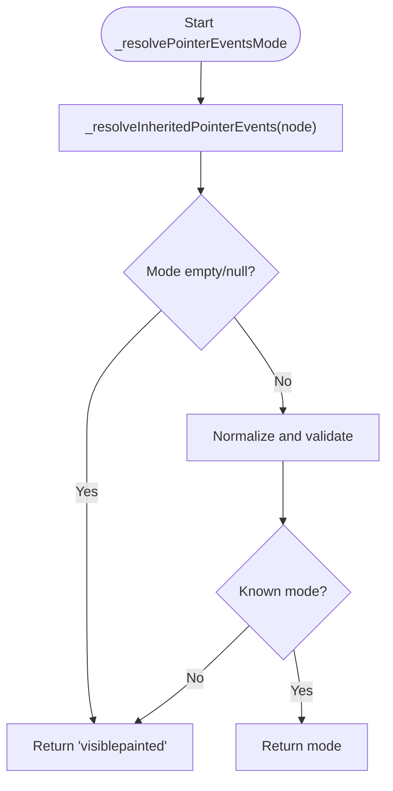
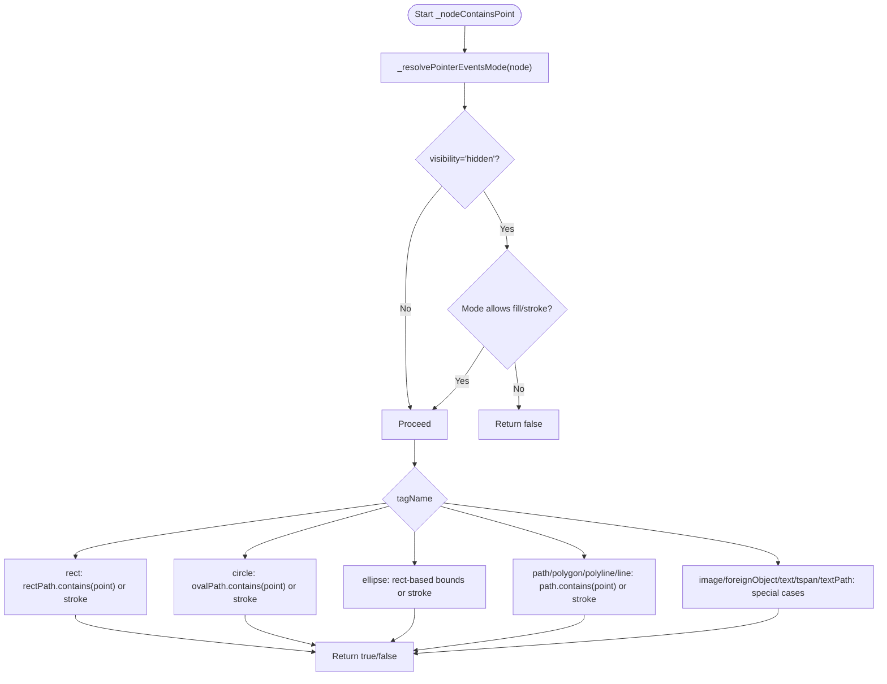
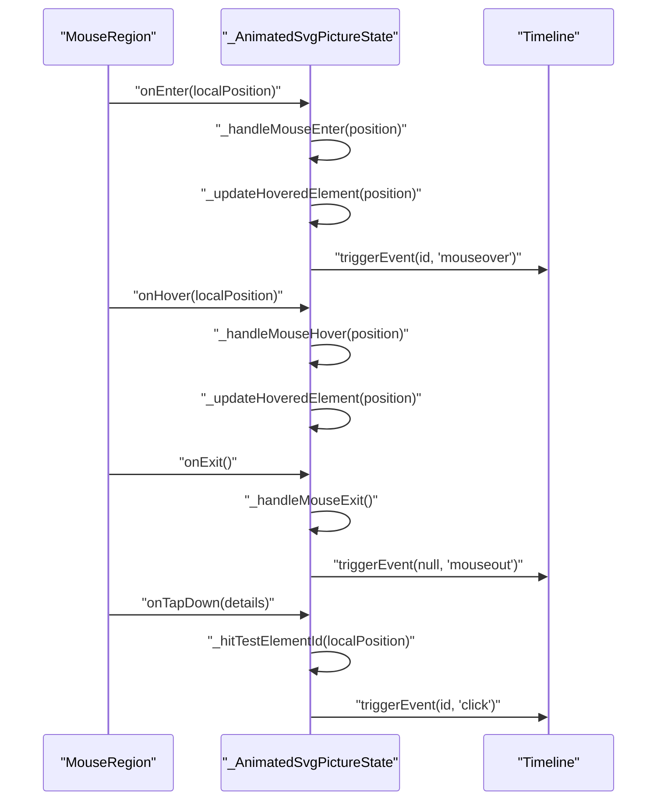
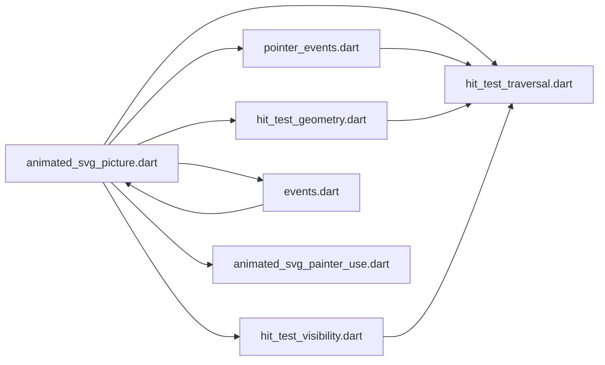

# Interactive SVG Elements

<cite>
**Referenced Files in This Document**
- [svg.dart](file://lib/svg.dart)
- [animated_svg_picture.dart](file://lib/src/animation/animated_svg_picture.dart)
- [animated_svg_picture_pointer_events.dart](file://lib/src/animation/animated_svg_picture_pointer_events.dart)
- [animated_svg_picture_hit_test_traversal.dart](file://lib/src/animation/animated_svg_picture_hit_test_traversal.dart)
- [animated_svg_picture_hit_test_geometry.dart](file://lib/src/animation/animated_svg_picture_hit_test_geometry.dart)
- [animated_svg_picture_events.dart](file://lib/src/animation/animated_svg_picture_events.dart)
- [animated_svg_picture_visibility.dart](file://lib/src/animation/animated_svg_picture_hit_test_visibility.dart)
- [animated_svg_painter_use.dart](file://lib/src/animation/animated_svg_painter_use.dart)
- [animated_svg_picture_test.dart](file://test/animation/animated_svg_picture_test.dart)
- [smil_event_timing_widget.dart](file://example/lib/widgets/smil_event_timing_widget.dart)
- [ARCHITECTURE.md](file://ARCHITECTURE.md)
</cite>

## Table of Contents
1. [Introduction](#introduction)
2. [Project Structure](#project-structure)
3. [Core Components](#core-components)
4. [Architecture Overview](#architecture-overview)
5. [Detailed Component Analysis](#detailed-component-analysis)
6. [Dependency Analysis](#dependency-analysis)
7. [Performance Considerations](#performance-considerations)
8. [Troubleshooting Guide](#troubleshooting-guide)
9. [Conclusion](#conclusion)
10. [Appendices](#appendices)

## Introduction
This document explains how interactive SVG elements are implemented in the repository, focusing on hit testing, pointer events, and user interaction patterns. It covers how clickable regions, hover effects, and event-driven animations work, and how to implement animated interactive elements such as buttons and clickable map regions. It also documents the hit test traversal system, pointer event handling, gesture recognition, and performance considerations for complex interactive SVGs.

## Project Structure
The interactive SVG functionality centers around a specialized widget that parses SVG content, builds a DOM-like structure, and supports SMIL-based animations. Pointer events and hit testing are integrated via a traversal system that respects SVG’s pointer-events model and visibility constraints.

**Diagram sources**
- [svg.dart:1-627](file://lib/svg.dart#L1-L627)
- [animated_svg_picture.dart:108-295](file://lib/src/animation/animated_svg_picture.dart#L108-L295)
- [animated_svg_picture_hit_test_traversal.dart:1-155](file://lib/src/animation/animated_svg_picture_hit_test_traversal.dart#L1-L155)
- [animated_svg_picture_pointer_events.dart:1-124](file://lib/src/animation/animated_svg_picture_pointer_events.dart#L1-L124)
- [animated_svg_picture_hit_test_geometry.dart:18-229](file://lib/src/animation/animated_svg_picture_hit_test_geometry.dart#L18-L229)
- [animated_svg_picture_visibility.dart:1-289](file://lib/src/animation/animated_svg_picture_visibility.dart#L1-L289)
- [animated_svg_picture_events.dart:35-82](file://lib/src/animation/animated_svg_picture_events.dart#L35-L82)
- [animated_svg_painter_use.dart:87-150](file://lib/src/animation/animated_svg_painter_use.dart#L87-L150)
- [smil_event_timing_widget.dart:235-315](file://example/lib/widgets/smil_event_timing_widget.dart#L235-L315)
- [animated_svg_picture_test.dart:2056-2442](file://test/animation/animated_svg_picture_test.dart#L2056-L2442)

**Section sources**
- [svg.dart:1-627](file://lib/svg.dart#L1-L627)
- [animated_svg_picture.dart:108-295](file://lib/src/animation/animated_svg_picture.dart#L108-L295)

## Core Components
- AnimatedSvgPicture: A StatefulWidget that parses SVG, constructs a timeline for SMIL animations, and wraps the rendered content with gesture detectors for pointer events and hover.
- Hit testing extensions: Traverse the SVG DOM, transform coordinates, and determine which element is under the pointer considering pointer-events modes, visibility, clipping, masking, and foreignObject constraints.
- Pointer events resolution: Computes effective pointer-events mode per node, inheriting from parents and normalizing values.
- Geometry tests: Implements shape-specific hit testing for rect, circle, ellipse, path, polygon, polyline, line, image, text, tspan, textPath, and foreignObject.
- Visibility and clipping: Enforces clip-path, mask, and foreignObject viewport boundaries for hit testing.
- Gesture handlers: Translate mouse enter/exit/hover and tap-down into timeline events (e.g., mouseover, mouseout, click) that drive SMIL animations.

**Section sources**
- [animated_svg_picture.dart:108-295](file://lib/src/animation/animated_svg_picture.dart#L108-L295)
- [animated_svg_picture_pointer_events.dart:1-124](file://lib/src/animation/animated_svg_picture_pointer_events.dart#L1-L124)
- [animated_svg_picture_hit_test_traversal.dart:1-155](file://lib/src/animation/animated_svg_picture_hit_test_traversal.dart#L1-L155)
- [animated_svg_picture_hit_test_geometry.dart:18-229](file://lib/src/animation/animated_svg_picture_hit_test_geometry.dart#L18-L229)
- [animated_svg_picture_visibility.dart:1-289](file://lib/src/animation/animated_svg_picture_visibility.dart#L1-L289)
- [animated_svg_picture_events.dart:35-82](file://lib/src/animation/animated_svg_picture_events.dart#L35-L82)

## Architecture Overview
The interactive flow integrates gesture input with SVG DOM traversal and SMIL timelines:

**Diagram sources**
- [animated_svg_picture.dart:246-269](file://lib/src/animation/animated_svg_picture.dart#L246-L269)
- [animated_svg_picture_events.dart:35-82](file://lib/src/animation/animated_svg_picture_events.dart#L35-L82)
- [animated_svg_picture_hit_test_traversal.dart:54-126](file://lib/src/animation/animated_svg_picture_hit_test_traversal.dart#L54-L126)
- [animated_svg_picture_pointer_events.dart:5-25](file://lib/src/animation/animated_svg_picture_pointer_events.dart#L5-L25)
- [animated_svg_picture_visibility.dart:18-29](file://lib/src/animation/animated_svg_picture_visibility.dart#L18-L29)
- [animated_svg_picture_hit_test_geometry.dart:18-229](file://lib/src/animation/animated_svg_picture_hit_test_geometry.dart#L18-L229)

## Detailed Component Analysis

### Hit Test Traversal System
The traversal walks the SVG DOM in visual order (children processed last-first) and applies transforms and visibility checks. It resolves pointer-events mode and delegates to geometry tests for shape-specific containment. Special handling exists for switch, use, and definition-only tags.

**Diagram sources**
- [animated_svg_picture_hit_test_traversal.dart:54-126](file://lib/src/animation/animated_svg_picture_hit_test_traversal.dart#L54-L126)
- [animated_svg_picture_hit_test_traversal.dart:128-155](file://lib/src/animation/animated_svg_picture_hit_test_traversal.dart#L128-L155)

**Section sources**
- [animated_svg_picture_hit_test_traversal.dart:1-155](file://lib/src/animation/animated_svg_picture_hit_test_traversal.dart#L1-L155)

### Pointer Events Resolution
Pointer events mode is resolved by walking up the DOM and normalizing inherited values. The effective mode determines whether fill, stroke, or bounding-box regions are considered for hit testing.

**Diagram sources**
- [animated_svg_picture_pointer_events.dart:5-25](file://lib/src/animation/animated_svg_picture_pointer_events.dart#L5-L25)
- [animated_svg_picture_pointer_events.dart:105-122](file://lib/src/animation/animated_svg_picture_pointer_events.dart#L105-L122)

**Section sources**
- [animated_svg_picture_pointer_events.dart:1-124](file://lib/src/animation/animated_svg_picture_pointer_events.dart#L1-L124)

### Geometry-Based Hit Testing
Shape-specific logic determines whether a point falls inside fill or stroke, or within a bounding box, depending on the pointer-events mode and visibility.

**Diagram sources**
- [animated_svg_picture_hit_test_geometry.dart:18-229](file://lib/src/animation/animated_svg_picture_hit_test_geometry.dart#L18-L229)

**Section sources**
- [animated_svg_picture_hit_test_geometry.dart:18-229](file://lib/src/animation/animated_svg_picture_hit_test_geometry.dart#L18-L229)

### Visibility, Clipping, Masking, and ForeignObject Constraints
Hit testing enforces clipping, masking, and foreignObject viewport boundaries before geometry tests. Clip-path and mask are resolved using container transforms and computed paths.

**Diagram sources**
- [animated_svg_picture_visibility.dart:18-29](file://lib/src/animation/animated_svg_picture_visibility.dart#L18-L29)
- [animated_svg_picture_visibility.dart:31-94](file://lib/src/animation/animated_svg_picture_visibility.dart#L31-L94)
- [animated_svg_picture_visibility.dart:260-272](file://lib/src/animation/animated_svg_picture_visibility.dart#L260-L272)

**Section sources**
- [animated_svg_picture_visibility.dart:1-289](file://lib/src/animation/animated_svg_picture_visibility.dart#L1-L289)

### Gesture Recognition and Event Handling
MouseRegion and GestureDetector capture hover, enter/exit, and tap-down events. The state updates the hovered element and triggers timeline events that drive SMIL animations.

**Diagram sources**
- [animated_svg_picture.dart:246-269](file://lib/src/animation/animated_svg_picture.dart#L246-L269)
- [animated_svg_picture_events.dart:35-82](file://lib/src/animation/animated_svg_picture_events.dart#L35-L82)

**Section sources**
- [animated_svg_picture_events.dart:35-82](file://lib/src/animation/animated_svg_picture_events.dart#L35-L82)
- [animated_svg_picture.dart:246-269](file://lib/src/animation/animated_svg_picture.dart#L246-L269)

### Implementing Clickable Regions, Hover Effects, and Touch Interactions
- Clickable regions: Use pointer-events modes to define hit areas. Tests demonstrate pointer-events none disabling clicks, child overrides restoring hit testing, fill-only hits even with no fill paint, stroke-only hits, bounding-box hits, and visibility-hidden elements not responding to pointer-events visiblepainted.
- Hover effects: Mouse enter/exit and hover events trigger mouseover/mouseout on the timeline, enabling SMIL animations.
- Touch interactions: Tap-down events are captured and mapped to click events on the targeted element.

Practical examples:
- Interactive button with click feedback and ripple effect.
- Hover-triggered animations for scaling and color changes.
- Chain reactions using event timing conditions.

**Section sources**
- [animated_svg_picture_test.dart:2090-2442](file://test/animation/animated_svg_picture_test.dart#L2090-L2442)
- [smil_event_timing_widget.dart:235-315](file://example/lib/widgets/smil_event_timing_widget.dart#L235-L315)
- [smil_event_timing_widget.dart:510-534](file://example/lib/widgets/smil_event_timing_widget.dart#L510-L534)

## Dependency Analysis
The interactive system composes several modules with clear separation of concerns:

**Diagram sources**
- [animated_svg_picture.dart:108-295](file://lib/src/animation/animated_svg_picture.dart#L108-L295)
- [animated_svg_picture_hit_test_traversal.dart:1-155](file://lib/src/animation/animated_svg_picture_hit_test_traversal.dart#L1-L155)
- [animated_svg_picture_pointer_events.dart:1-124](file://lib/src/animation/animated_svg_picture_pointer_events.dart#L1-L124)
- [animated_svg_picture_hit_test_geometry.dart:18-229](file://lib/src/animation/animated_svg_picture_hit_test_geometry.dart#L18-L229)
- [animated_svg_picture_visibility.dart:1-289](file://lib/src/animation/animated_svg_picture_visibility.dart#L1-L289)
- [animated_svg_picture_events.dart:35-82](file://lib/src/animation/animated_svg_picture_events.dart#L35-L82)
- [animated_svg_painter_use.dart:87-150](file://lib/src/animation/animated_svg_painter_use.dart#L87-L150)

**Section sources**
- [animated_svg_picture.dart:108-295](file://lib/src/animation/animated_svg_picture.dart#L108-L295)

## Performance Considerations
- Static subtree caching: Nodes without animations are cached as Picture objects and reused to avoid re-rendering.
- Dirty tracking: Only re-render subtrees whose animated attributes change.
- Path optimization: Paths are normalized once and reused; Path.reset is preferred over recreating objects.
- ViewBox transform: Efficiently converts local widget coordinates to document coordinates using a precomputed matrix.
- Gesture wrapping: Minimal overhead by wrapping only when animations are present.

These strategies are documented in the architecture guide and directly influence the interactive widget’s rendering loop.

**Section sources**
- [ARCHITECTURE.md:174-193](file://ARCHITECTURE.md#L174-L193)
- [animated_svg_picture.dart:35-86](file://lib/src/animation/animated_svg_picture.dart#L35-L86)

## Troubleshooting Guide
Common issues and resolutions:
- Clicks not registering:
  - Ensure pointer-events mode is not none and that the element is not visibility hidden.
  - Verify the click target is within the element’s fill or stroke geometry as configured by pointer-events.
  - Confirm the element is not clipped or masked out.
- Hover effects not triggering:
  - Check that MouseRegion is wrapping the widget and that pointer-events modes allow visible or visiblepainted.
  - Ensure the element is not display:none or definition-only.
- Complex shapes not responding:
  - For stroke-only pointer-events, clicks near the stroke outline will trigger; for fill-only, clicks must be inside the filled area.
  - For bounding-box pointer-events, only the element’s bounding rectangle counts.
- Nested references:
  - For use elements, ensure the referenced symbol is painted and not clipped; the traversal supports recursive use stacks.

Validation and examples:
- Tests cover pointer-events none, child overrides, fill/stroke/bounding-box modes, and visibility-hidden behavior.
- Example widgets demonstrate interactive buttons and hover-triggered animations.

**Section sources**
- [animated_svg_picture_test.dart:2090-2442](file://test/animation/animated_svg_picture_test.dart#L2090-L2442)
- [animated_svg_picture_pointer_events.dart:27-103](file://lib/src/animation/animated_svg_picture_pointer_events.dart#L27-L103)
- [animated_svg_picture_visibility.dart:31-94](file://lib/src/animation/animated_svg_picture_visibility.dart#L31-L94)
- [animated_svg_painter_use.dart:87-150](file://lib/src/animation/animated_svg_painter_use.dart#L87-L150)

## Conclusion
The repository provides a robust, extensible system for interactive SVGs:
- A precise hit test traversal that respects SVG’s pointer-events model and visibility constraints.
- Integrated gesture handling that translates user input into SMIL-driven animations.
- Practical examples and tests validating click, hover, and chained event behaviors.
- Strong performance foundations leveraging caching, dirty tracking, and efficient transforms.

This enables developers to build animated interactive UI components such as buttons, clickable maps, and rich visual feedback systems.

## Appendices

### Best Practices for Responsive Interactive SVGs
- Define explicit pointer-events modes to control hit areas precisely.
- Prefer bounding-box for large clickable backgrounds; use fill or stroke for precise shapes.
- Keep hover and click targets visually distinct to improve UX.
- Use SMIL begin conditions (click, mouseover, mouseout) to orchestrate animations.
- Leverage viewBox transforms and sizing to maintain consistent hit testing across devices.

[No sources needed since this section provides general guidance]