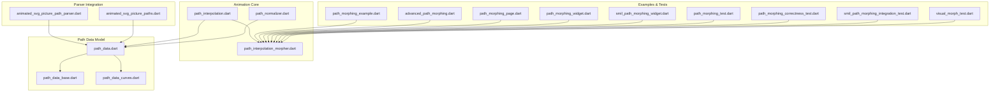
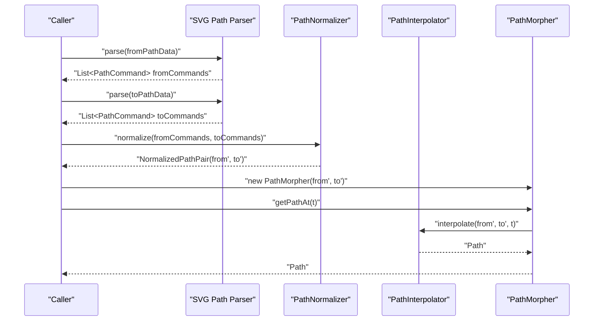
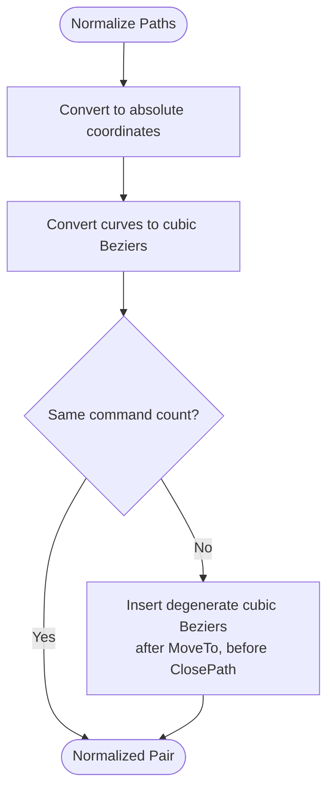
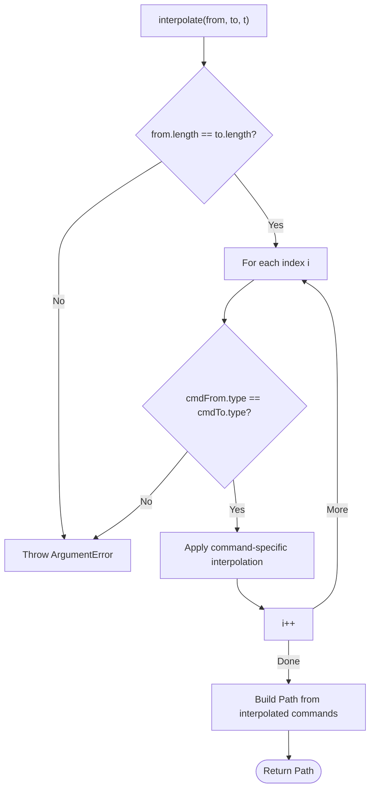
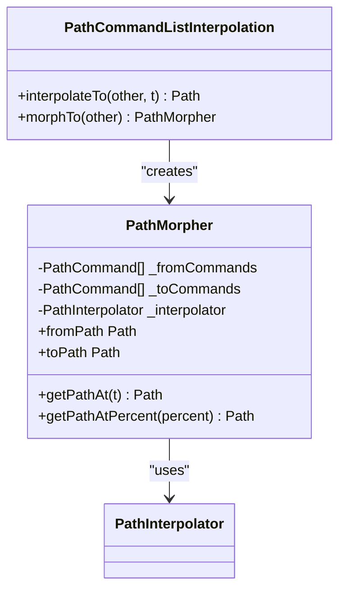
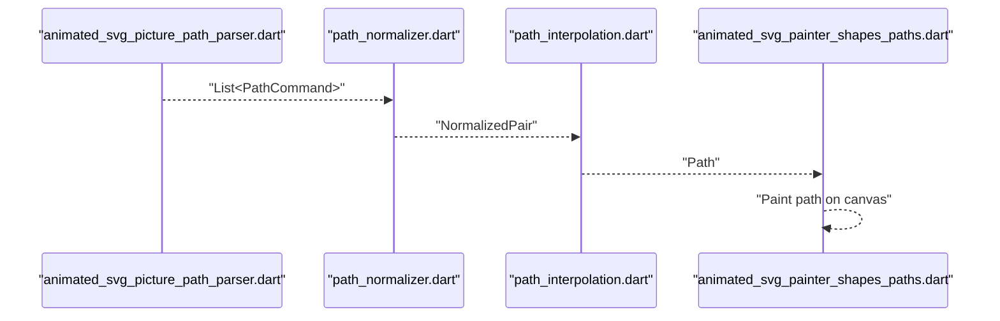
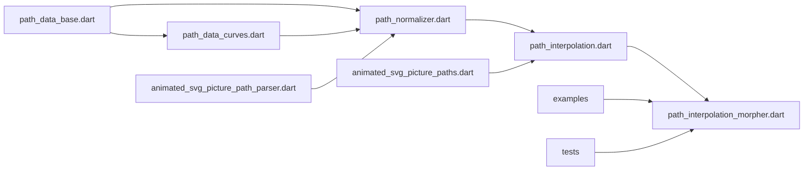

# Path Manipulation and Morphing

<cite>
**Referenced Files in This Document**
- [svg.dart](file://lib/svg.dart)
- [path_interpolation.dart](file://lib/src/animation/path_interpolation.dart)
- [path_interpolation_morpher.dart](file://lib/src/animation/path_interpolation_morpher.dart)
- [path_data.dart](file://lib/src/animation/path_data.dart)
- [path_data_base.dart](file://lib/src/animation/path_data_base.dart)
- [path_data_curves.dart](file://lib/src/animation/path_data_curves.dart)
- [path_normalizer.dart](file://lib/src/animation/path_normalizer.dart)
- [path_normalizer_alignment.dart](file://lib/src/animation/path_normalizer_alignment.dart)
- [path_normalizer_curves.dart](file://lib/src/animation/path_normalizer_curves.dart)
- [animated_svg_picture_paths.dart](file://lib/src/animation/animated_svg_picture_paths.dart)
- [animated_svg_picture_path_parser.dart](file://lib/src/animation/animated_svg_picture_path_parser.dart)
- [animated_svg_painter_shapes_paths.dart](file://lib/src/animation/animated_svg_painter_shapes_paths.dart)
- [path_morphing_example.dart](file://example/lib/path_morphing_example.dart)
- [advanced_path_morphing.dart](file://example/lib/advanced_path_morphing.dart)
- [path_morphing_page.dart](file://example/lib/pages/path_morphing_page.dart)
- [path_morphing_widget.dart](file://example/lib/widgets/path_morphing_widget.dart)
- [smil_path_morphing_widget.dart](file://example/lib/widgets/smil_path_morphing_widget.dart)
- [path_morphing_test.dart](file://test/animation/path_morphing_test.dart)
- [path_morphing_correctness_test.dart](file://test/animation/path_morphing_correctness_test.dart)
- [smil_path_morphing_integration_test.dart](file://test/animation/smil_path_morphing_integration_test.dart)
- [visual_morph_test.dart](file://test/animation/visual_morph_test.dart)
</cite>

## Table of Contents
1. [Introduction](#introduction)
2. [Project Structure](#project-structure)
3. [Core Components](#core-components)
4. [Architecture Overview](#architecture-overview)
5. [Detailed Component Analysis](#detailed-component-analysis)
6. [Dependency Analysis](#dependency-analysis)
7. [Performance Considerations](#performance-considerations)
8. [Troubleshooting Guide](#troubleshooting-guide)
9. [Conclusion](#conclusion)
10. [Appendices](#appendices)

## Introduction
This document explains the path manipulation and morphing capabilities of the project with a focus on SVG path data processing, interpolation algorithms, and smooth transformations. It covers:
- Path parsing and representation via structured path commands
- Segment manipulation and normalization for compatibility
- Interpolation between normalized paths and morphing algorithms
- Animation timing and integration with the broader animation system
- Practical examples for smooth path animations and real-time modifications
- Performance optimization strategies and best practices

## Project Structure
The path morphing system is implemented primarily under the animation module and integrated with the SVG rendering pipeline. Key areas:
- Animation core: path interpolation, morphing helpers, and normalization
- Path data model: base commands and curve variants
- Parser integration: conversion from SVG path strings to internal command lists
- Example widgets and tests: practical demonstrations and validation

**Diagram sources**
- [path_interpolation.dart:1-96](file://lib/src/animation/path_interpolation.dart#L1-L96)
- [path_interpolation_morpher.dart:1-53](file://lib/src/animation/path_interpolation_morpher.dart#L1-L53)
- [path_normalizer.dart:1-56](file://lib/src/animation/path_normalizer.dart#L1-L56)
- [path_data.dart:1-9](file://lib/src/animation/path_data.dart#L1-L9)
- [path_data_base.dart:1-281](file://lib/src/animation/path_data_base.dart#L1-L281)
- [path_data_curves.dart:1-285](file://lib/src/animation/path_data_curves.dart#L1-L285)
- [animated_svg_picture_path_parser.dart](file://lib/src/animation/animated_svg_picture_path_parser.dart)
- [animated_svg_picture_paths.dart](file://lib/src/animation/animated_svg_picture_paths.dart)
- [path_morphing_example.dart](file://example/lib/path_morphing_example.dart)
- [advanced_path_morphing.dart](file://example/lib/advanced_path_morphing.dart)
- [path_morphing_page.dart](file://example/lib/pages/path_morphing_page.dart)
- [path_morphing_widget.dart](file://example/lib/widgets/path_morphing_widget.dart)
- [smil_path_morphing_widget.dart](file://example/lib/widgets/smil_path_morphing_widget.dart)
- [path_morphing_test.dart](file://test/animation/path_morphing_test.dart)
- [path_morphing_correctness_test.dart](file://test/animation/path_morphing_correctness_test.dart)
- [smil_path_morphing_integration_test.dart](file://test/animation/smil_path_morphing_integration_test.dart)
- [visual_morph_test.dart](file://test/animation/visual_morph_test.dart)

**Section sources**
- [path_interpolation.dart:1-96](file://lib/src/animation/path_interpolation.dart#L1-L96)
- [path_interpolation_morpher.dart:1-53](file://lib/src/animation/path_interpolation_morpher.dart#L1-L53)
- [path_normalizer.dart:1-56](file://lib/src/animation/path_normalizer.dart#L1-L56)
- [path_data.dart:1-9](file://lib/src/animation/path_data.dart#L1-L9)
- [path_data_base.dart:1-281](file://lib/src/animation/path_data_base.dart#L1-L281)
- [path_data_curves.dart:1-285](file://lib/src/animation/path_data_curves.dart#L1-L285)

## Core Components
- PathCommand hierarchy: abstract base and concrete commands (MoveTo, LineTo, Horizontal/Vertical LineTo, Arc, ClosePath, Cubic/Quadratic/Spline Bezier variants)
- PathNormalizer: converts paths to absolute coordinates, flattens curves to cubic Beziers, and aligns command counts
- PathInterpolator: performs interpolation between normalized paths by linearly interpolating numeric parameters per command type
- PathMorpher: a convenience wrapper that caches normalized paths and exposes timeline queries (t=0..1 or percent)
- Parser integration: bridges SVG path strings to internal command lists for interpolation

Key responsibilities:
- Parsing: convert SVG path data strings into structured PathCommand lists
- Normalization: ensure both paths share the same command types and counts
- Interpolation: compute intermediate paths at arbitrary time steps
- Rendering: feed interpolated paths into the vector graphics pipeline

**Section sources**
- [path_data_base.dart:3-281](file://lib/src/animation/path_data_base.dart#L3-L281)
- [path_data_curves.dart:3-285](file://lib/src/animation/path_data_curves.dart#L3-L285)
- [path_normalizer.dart:16-55](file://lib/src/animation/path_normalizer.dart#L16-L55)
- [path_interpolation.dart:15-95](file://lib/src/animation/path_interpolation.dart#L15-L95)
- [path_interpolation_morpher.dart:6-52](file://lib/src/animation/path_interpolation_morpher.dart#L6-L52)

## Architecture Overview
The morphing pipeline transforms SVG path strings into a normalized form and then interpolates between them smoothly. The following diagram maps the actual components involved in a typical morphing operation.

**Diagram sources**
- [path_interpolation_morpher.dart:6-39](file://lib/src/animation/path_interpolation_morpher.dart#L6-L39)
- [path_interpolation.dart:26-65](file://lib/src/animation/path_interpolation.dart#L26-L65)
- [path_normalizer.dart:41-54](file://lib/src/animation/path_normalizer.dart#L41-L54)

## Detailed Component Analysis

### Path Command Model
The path command model defines a strongly typed representation of SVG path primitives suitable for interpolation. It includes:
- Absolute vs relative command distinction
- Parameter extraction for interpolation
- Conversion to absolute coordinates
- Equality/hash for identity checks

```mermaid
classDiagram
class PathCommand {
+String type
+bool isRelative
+toAbsolute(currentX, currentY) PathCommand
+params double[]
}
class MoveToCommand {
+double x
+double y
+bool isRelative
+params double[]
}
class LineToCommand {
+double x
+double y
+bool isRelative
+params double[]
}
class HorizontalLineToCommand {
+double x
+bool isRelative
+toLineTo(currentY) LineToCommand
+params double[]
}
class VerticalLineToCommand {
+double y
+bool isRelative
+toLineTo(currentX) LineToCommand
+params double[]
}
class ArcCommand {
+double rx
+double ry
+double rotation
+bool largeArc
+bool sweep
+double x
+double y
+bool isRelative
+params double[]
}
class ClosePathCommand {
+bool isRelative
+params double[]
}
class CubicBezierCommand {
+double x1
+double y1
+double x2
+double y2
+double x
+double y
+bool isRelative
+params double[]
}
class SmoothCubicBezierCommand {
+double x2
+double y2
+double x
+double y
+bool isRelative
+toCubicBezier(currentX, currentY, previousCommand) CubicBezierCommand
+params double[]
}
class QuadraticBezierCommand {
+double x1
+double y1
+double x
+double y
+bool isRelative
+toCubicBezier(currentX, currentY) CubicBezierCommand
+params double[]
}
class SmoothQuadraticBezierCommand {
+double x
+double y
+bool isRelative
+toQuadraticBezier(currentX, currentY, previousCommand) QuadraticBezierCommand
+params double[]
}
PathCommand <|-- MoveToCommand
PathCommand <|-- LineToCommand
PathCommand <|-- HorizontalLineToCommand
PathCommand <|-- VerticalLineToCommand
PathCommand <|-- ArcCommand
PathCommand <|-- ClosePathCommand
PathCommand <|-- CubicBezierCommand
PathCommand <|-- SmoothCubicBezierCommand
PathCommand <|-- QuadraticBezierCommand
PathCommand <|-- SmoothQuadraticBezierCommand
```

**Diagram sources**
- [path_data_base.dart:3-281](file://lib/src/animation/path_data_base.dart#L3-L281)
- [path_data_curves.dart:3-285](file://lib/src/animation/path_data_curves.dart#L3-L285)

**Section sources**
- [path_data_base.dart:3-281](file://lib/src/animation/path_data_base.dart#L3-L281)
- [path_data_curves.dart:3-285](file://lib/src/animation/path_data_curves.dart#L3-L285)

### Path Normalization
Normalization ensures both paths are compatible for interpolation:
- Convert all commands to absolute coordinates
- Convert curves to cubic Beziers (including arcs via subdivision)
- Align command counts by padding the shorter path with degenerate cubic Beziers

**Diagram sources**
- [path_normalizer_curves.dart:3-155](file://lib/src/animation/path_normalizer_curves.dart#L3-L155)
- [path_normalizer_alignment.dart:3-67](file://lib/src/animation/path_normalizer_alignment.dart#L3-L67)

**Section sources**
- [path_normalizer.dart:16-55](file://lib/src/animation/path_normalizer.dart#L16-L55)
- [path_normalizer_curves.dart:3-155](file://lib/src/animation/path_normalizer_curves.dart#L3-L155)
- [path_normalizer_alignment.dart:3-67](file://lib/src/animation/path_normalizer_alignment.dart#L3-L67)

### Path Interpolation
Interpolation operates on normalized command lists:
- Validates equal lengths and matching command types
- Linearly interpolates numeric parameters per command type
- Supports string-based convenience interpolation (parses and normalizes automatically)

**Diagram sources**
- [path_interpolation.dart:26-65](file://lib/src/animation/path_interpolation.dart#L26-L65)

**Section sources**
- [path_interpolation.dart:15-95](file://lib/src/animation/path_interpolation.dart#L15-L95)

### Path Morphing Helpers
PathMorpher encapsulates normalized paths and provides timeline accessors:
- Enforces pre-normalized paths
- Exposes getPathAt(t) and convenience percent-based access
- Extension methods simplify morph creation and interpolation

**Diagram sources**
- [path_interpolation_morpher.dart:6-52](file://lib/src/animation/path_interpolation_morpher.dart#L6-L52)

**Section sources**
- [path_interpolation_morpher.dart:6-52](file://lib/src/animation/path_interpolation_morpher.dart#L6-L52)

### Parser Integration and Rendering Pipeline
Integration with the SVG rendering pipeline involves:
- Converting SVG path strings to internal command lists
- Using normalized paths for interpolation
- Producing Flutter Path objects for rendering

**Diagram sources**
- [animated_svg_picture_path_parser.dart](file://lib/src/animation/animated_svg_picture_path_parser.dart)
- [path_normalizer.dart:41-54](file://lib/src/animation/path_normalizer.dart#L41-L54)
- [path_interpolation.dart:74-94](file://lib/src/animation/path_interpolation.dart#L74-L94)
- [animated_svg_painter_shapes_paths.dart](file://lib/src/animation/animated_svg_painter_shapes_paths.dart)

**Section sources**
- [animated_svg_picture_path_parser.dart](file://lib/src/animation/animated_svg_picture_path_parser.dart)
- [animated_svg_painter_shapes_paths.dart](file://lib/src/animation/animated_svg_painter_shapes_paths.dart)
- [animated_svg_picture_paths.dart](file://lib/src/animation/animated_svg_picture_paths.dart)

### Examples and Integration
Practical examples demonstrate:
- Basic morphing between two path data strings
- Advanced morphing with easing and timing controls
- Integration with page-level widgets and SMIL-style morphing

Example references:
- [path_morphing_example.dart](file://example/lib/path_morphing_example.dart)
- [advanced_path_morphing.dart](file://example/lib/advanced_path_morphing.dart)
- [path_morphing_page.dart](file://example/lib/pages/path_morphing_page.dart)
- [path_morphing_widget.dart](file://example/lib/widgets/path_morphing_widget.dart)
- [smil_path_morphing_widget.dart](file://example/lib/widgets/smil_path_morphing_widget.dart)

**Section sources**
- [path_morphing_example.dart](file://example/lib/path_morphing_example.dart)
- [advanced_path_morphing.dart](file://example/lib/advanced_path_morphing.dart)
- [path_morphing_page.dart](file://example/lib/pages/path_morphing_page.dart)
- [path_morphing_widget.dart](file://example/lib/widgets/path_morphing_widget.dart)
- [smil_path_morphing_widget.dart](file://example/lib/widgets/smil_path_morphing_widget.dart)

## Dependency Analysis
The morphing system exhibits low coupling and high cohesion:
- PathCommand types are decoupled from interpolation logic
- Normalizer depends on curve conversion utilities
- Interpolator depends only on normalized command parameters
- Examples and tests depend on public APIs without accessing internals

**Diagram sources**
- [path_data_base.dart:1-281](file://lib/src/animation/path_data_base.dart#L1-L281)
- [path_data_curves.dart:1-285](file://lib/src/animation/path_data_curves.dart#L1-L285)
- [path_normalizer.dart:1-56](file://lib/src/animation/path_normalizer.dart#L1-L56)
- [path_interpolation.dart:1-96](file://lib/src/animation/path_interpolation.dart#L1-L96)
- [path_interpolation_morpher.dart:1-53](file://lib/src/animation/path_interpolation_morpher.dart#L1-L53)
- [animated_svg_picture_path_parser.dart](file://lib/src/animation/animated_svg_picture_path_parser.dart)
- [animated_svg_picture_paths.dart](file://lib/src/animation/animated_svg_picture_paths.dart)
- [path_morphing_example.dart](file://example/lib/path_morphing_example.dart)
- [path_morphing_test.dart](file://test/animation/path_morphing_test.dart)

**Section sources**
- [path_interpolation.dart:1-96](file://lib/src/animation/path_interpolation.dart#L1-L96)
- [path_interpolation_morpher.dart:1-53](file://lib/src/animation/path_interpolation_morpher.dart#L1-L53)
- [path_normalizer.dart:1-56](file://lib/src/animation/path_normalizer.dart#L1-L56)
- [path_data_base.dart:1-281](file://lib/src/animation/path_data_base.dart#L1-L281)
- [path_data_curves.dart:1-285](file://lib/src/animation/path_data_curves.dart#L1-L285)

## Performance Considerations
- Parse and normalize once: reuse normalized command lists for repeated interpolation to avoid repeated parsing and subdivision
- Prefer batched updates: animate multiple paths in sync to minimize redundant computations
- Minimize command count: reduce the number of segments by simplifying paths before normalization
- Use degenerate curves judiciously: padding introduces extra commands; keep padding minimal and localized
- Leverage caching: PathMorpher caches normalized inputs; reuse instances for the same shape pair
- Avoid excessive recomputation: clamp t to [0,1] and reuse computed intermediate values when possible

[No sources needed since this section provides general guidance]

## Troubleshooting Guide
Common issues and resolutions:
- Incompatible paths: ensure both paths are normalized before interpolation; mismatched command types or lengths cause errors
- Degenerate arcs: very small or zero radii are converted to straight lines; verify arc parameters if unexpected straight segments appear
- Padding artifacts: when paths differ in length, degenerate cubic Beziers are inserted; check alignment logic if morphing appears jerky near padding points
- Timing mismatches: ensure consistent timing across animation frames; interpolate at uniform t steps for smooth motion

Validation references:
- [path_morphing_test.dart](file://test/animation/path_morphing_test.dart)
- [path_morphing_correctness_test.dart](file://test/animation/path_morphing_correctness_test.dart)
- [smil_path_morphing_integration_test.dart](file://test/animation/smil_path_morphing_integration_test.dart)
- [visual_morph_test.dart](file://test/animation/visual_morph_test.dart)

**Section sources**
- [path_interpolation.dart:26-65](file://lib/src/animation/path_interpolation.dart#L26-L65)
- [path_normalizer_alignment.dart:3-67](file://lib/src/animation/path_normalizer_alignment.dart#L3-L67)
- [path_morphing_test.dart](file://test/animation/path_morphing_test.dart)
- [path_morphing_correctness_test.dart](file://test/animation/path_morphing_correctness_test.dart)
- [smil_path_morphing_integration_test.dart](file://test/animation/smil_path_morphing_integration_test.dart)
- [visual_morph_test.dart](file://test/animation/visual_morph_test.dart)

## Conclusion
The path morphing system provides a robust foundation for smooth SVG path transformations:
- A clear command model supports precise interpolation
- Normalization ensures compatibility across diverse path structures
- Interpolation and morphing helpers enable flexible animation workflows
- Integration with the rendering pipeline allows real-time, high-performance morphing

By following the best practices and leveraging the provided components, developers can create compelling, smooth path animations and morph effects.

[No sources needed since this section summarizes without analyzing specific files]

## Appendices

### API Surface Summary
- PathCommand: base abstraction for path primitives
- PathNormalizer: normalization to absolute coordinates and cubic Beziers
- PathInterpolator: interpolation between normalized paths
- PathMorpher: timeline-based morphing with caching
- Parser integration: conversion from SVG path strings to command lists

**Section sources**
- [path_data_base.dart:3-281](file://lib/src/animation/path_data_base.dart#L3-L281)
- [path_data_curves.dart:3-285](file://lib/src/animation/path_data_curves.dart#L3-L285)
- [path_normalizer.dart:16-55](file://lib/src/animation/path_normalizer.dart#L16-L55)
- [path_interpolation.dart:15-95](file://lib/src/animation/path_interpolation.dart#L15-L95)
- [path_interpolation_morpher.dart:6-52](file://lib/src/animation/path_interpolation_morpher.dart#L6-L52)
- [animated_svg_picture_path_parser.dart](file://lib/src/animation/animated_svg_picture_path_parser.dart)
- [animated_svg_painter_shapes_paths.dart](file://lib/src/animation/animated_svg_painter_shapes_paths.dart)