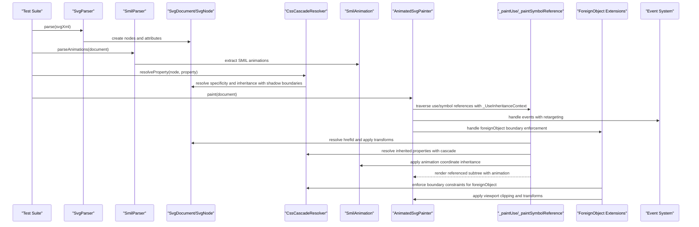
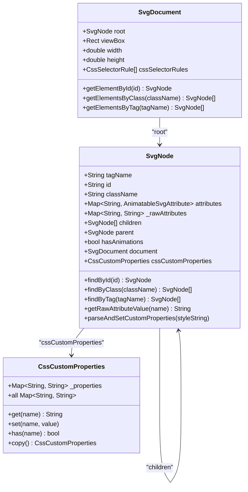
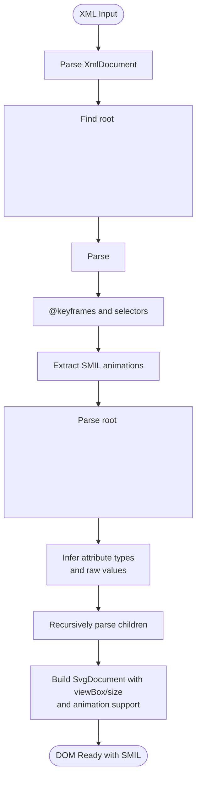
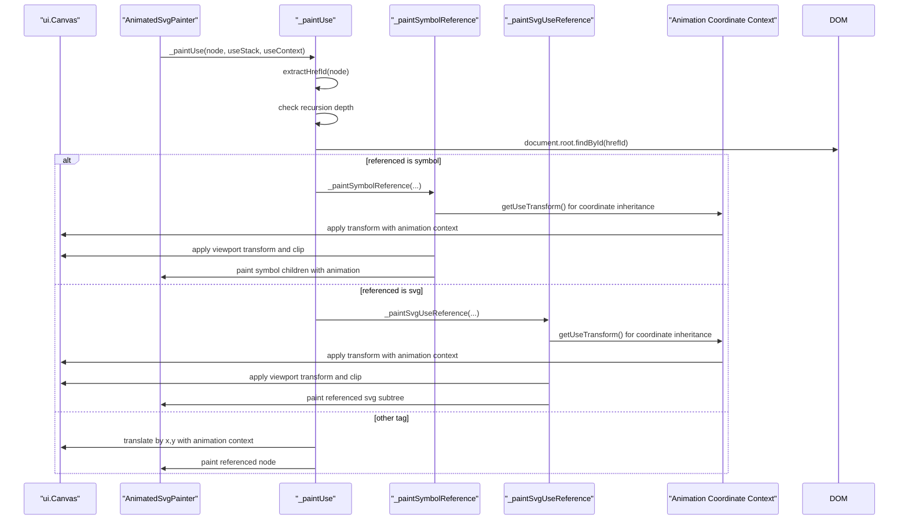
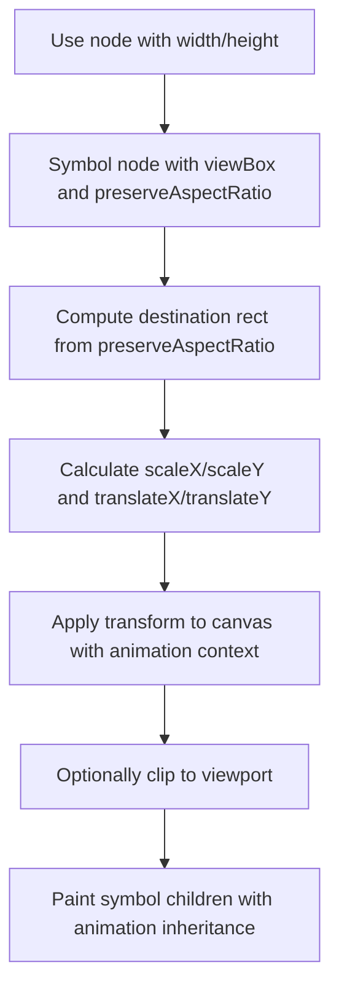
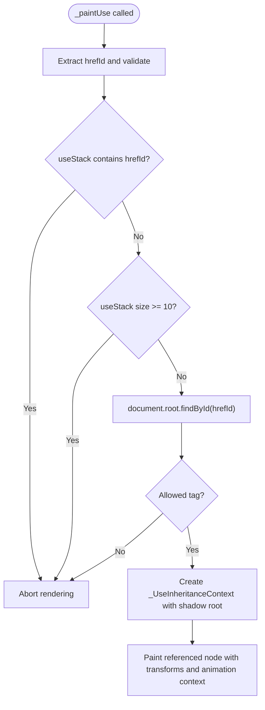
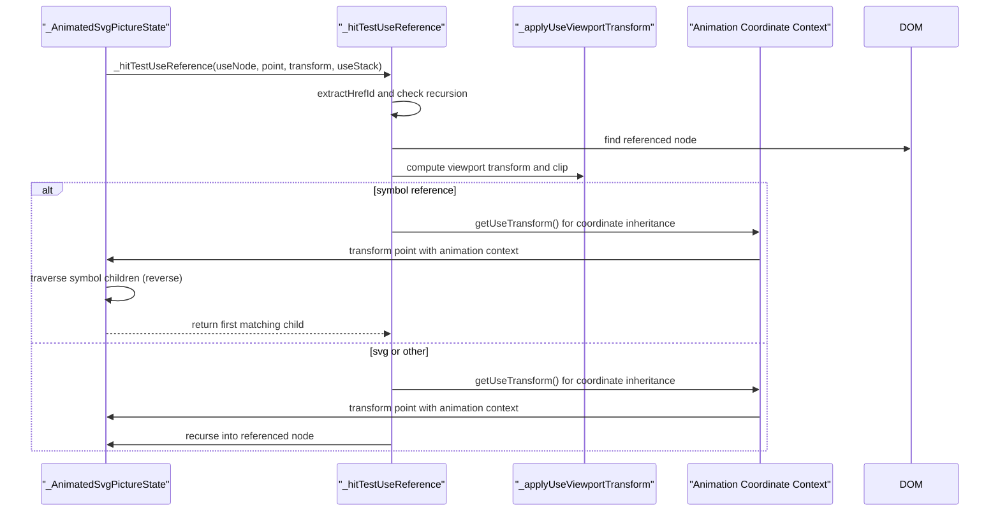
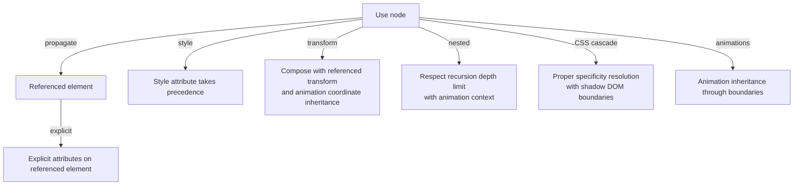
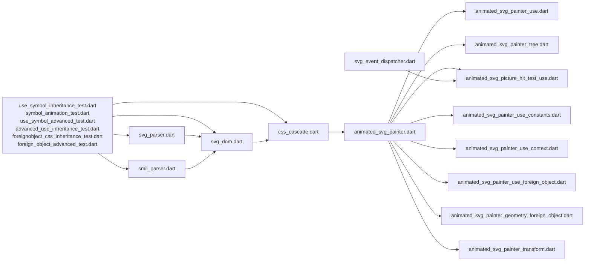

```mermaid
graph TB
subgraph "Tests"
T1["use_symbol_inheritance_test.dart"]
T2["symbol_animation_test.dart"]
T3["use_symbol_advanced_test.dart"]
T4["advanced_use_inheritance_test.dart"]
T5["foreignobject_css_inheritance_test.dart"]
T6["foreign_object_advanced_test.dart"]
end
subgraph "CSS System"
C1["css_cascade.dart"]
C2["css_cascade_inheritance.dart"]
C3["css_variables_calc.dart"]
C4["css_cascade_specificity.dart"]
C5["css_cascade_selector_matching.dart"]
C6["css_cascade_resolution.dart"]
end
subgraph "Animation System"
A1["smil_parser.dart"]
A2["animated_svg_painter_use.dart"]
A3["animated_svg_painter_tree.dart"]
A4["animated_svg_painter_use_constants.dart"]
A5["animated_svg_painter_use_context.dart"]
A6["animated_svg_painter_use_foreign_object.dart"]
A7["animated_svg_painter_geometry_foreign_object.dart"]
A8["animated_svg_painter_transform.dart"]
end
subgraph "Event System"
E1["svg_event_dispatcher.dart"]
E2["animated_svg_picture_hit_test_use.dart"]
end
subgraph "Parser"
P1["svg_parser.dart"]
P2["svg_parser_elements.dart"]
D1["svg_dom.dart"]
end
subgraph "Renderer"
R1["animated_svg_painter.dart"]
end
T1 --> C1
T2 --> A1
T3 --> C1
T4 --> A5
T5 --> A7
T6 --> A7
C1 --> R1
C2 --> R1
C3 --> R1
A1 --> R1
A2 --> R1
A3 --> R1
A4 --> R1
A5 --> R1
A6 --> R1
A7 --> R1
A8 --> R1
P1 --> D1
P2 --> D1
D1 --> R1
R1 --> E1
E1 --> E2
```

# Use Element Symbol Inheritance

<cite>
**Referenced Files in This Document**
- [use_symbol_inheritance_test.dart](file://test/animation/use_symbol_inheritance_test.dart)
- [symbol_animation_test.dart](file://test/animation/symbol_animation_test.dart)
- [use_symbol_advanced_test.dart](file://test/animation/use_symbol_advanced_test.dart)
- [advanced_use_inheritance_test.dart](file://test/animation/advanced_use_inheritance_test.dart)
- [foreignobject_css_inheritance_test.dart](file://test/animation/foreignobject_css_inheritance_test.dart)
- [foreign_object_advanced_test.dart](file://test/animation/foreign_object_advanced_test.dart)
- [css_cascade.dart](file://lib/src/animation/css_cascade.dart)
- [css_cascade_inheritance.dart](file://lib/src/animation/css_cascade_inheritance.dart)
- [css_variables_calc.dart](file://lib/src/animation/css_variables_calc.dart)
- [animated_svg_painter_use.dart](file://lib/src/animation/animated_svg_painter_use.dart)
- [animated_svg_painter_tree.dart](file://lib/src/animation/animated_svg_painter_tree.dart)
- [animated_svg_picture_hit_test_use.dart](file://lib/src/animation/animated_svg_picture_hit_test_use.dart)
- [svg_parser.dart](file://lib/src/animation/svg_parser.dart)
- [svg_dom.dart](file://lib/src/animation/svg_dom.dart)
- [svg_parser_elements.dart](file://lib/src/animation/svg_parser_elements.dart)
- [animated_svg_painter.dart](file://lib/src/animation/animated_svg_painter.dart)
- [smil_parser.dart](file://lib/src/animation/smil/smil_parser.dart)
- [animated_svg_painter_use_constants.dart](file://lib/src/animation/animated_svg_painter_use_constants.dart)
- [animated_svg_painter_use_context.dart](file://lib/src/animation/animated_svg_painter_use_context.dart)
- [animated_svg_painter_use_foreign_object.dart](file://lib/src/animation/animated_svg_painter_use_foreign_object.dart)
- [animated_svg_painter_geometry_foreign_object.dart](file://lib/src/animation/animated_svg_painter_geometry_foreign_object.dart)
- [animated_svg_painter_transform.dart](file://lib/src/animation/animated_svg_painter_transform.dart)
- [svg_event_dispatcher.dart](file://lib/src/animation/svg_event_dispatcher.dart)
- [css_cascade_specificity.dart](file://lib/src/animation/css_cascade_specificity.dart)
- [css_cascade_selector_matching.dart](file://lib/src/animation/css_cascade_selector_matching.dart)
- [css_cascade_resolution.dart](file://lib/src/animation/css_cascade_resolution.dart)
</cite>

## Update Summary
**Changes Made**
- Enhanced use element system with sophisticated transform parsing supporting matrix, translate, scale, rotate, skew, and 3D transforms
- Implemented comprehensive event retargeting mechanisms with proper shadow boundary handling for non-composed events
- Expanded CSS cascade inheritance system with UseCascadeContext providing advanced property resolution through shadow boundaries
- Added support for up to _kMaxUseRecursionDepth (10 levels) of nested use elements with circular reference detection
- Integrated sophisticated transform composition for nested use elements with proper coordinate inheritance
- Enhanced event system with proper event path construction and retargeting through use shadow boundaries

## Table of Contents
1. [Introduction](#introduction)
2. [Project Structure](#project-structure)
3. [Core Components](#core-components)
4. [Architecture Overview](#architecture-overview)
5. [Detailed Component Analysis](#detailed-component-analysis)
6. [Enhanced Transform Parsing System](#enhanced-transform-parsing-system)
7. [Advanced Event Retargeting Mechanisms](#advanced-event-retargeting-mechanisms)
8. [Enhanced CSS Cascade System](#enhanced-css-cascade-system)
9. [Use Element Inheritance Context](#use-element-inheritance-context)
10. [Comprehensive Symbol Animation Support](#comprehensive-symbol-animation-support)
11. [CSS Custom Properties Through Use Boundaries](#css-custom-properties-through-use-boundaries)
12. [Advanced Symbol Resolution](#advanced-symbol-resolution)
13. [ForeignObject Boundary Enforcement](#foreignobject-boundary-enforcement)
14. [Specialized Module Enhancements](#specialized-module-enhancements)
15. [Dependency Analysis](#dependency-analysis)
16. [Performance Considerations](#performance-considerations)
17. [Troubleshooting Guide](#troubleshooting-guide)
18. [Conclusion](#conclusion)

## Introduction
This document explains how the Flutter SVG library implements enhanced element symbol inheritance through the `<use>` element and `<symbol>` references with comprehensive animation support and advanced CSS inheritance boundary enforcement for ForeignObject elements. The system now provides sophisticated property categorization, shadow boundary handling, advanced inheritance resolution algorithms, comprehensive transform parsing, event retargeting mechanisms, and support for up to _kMaxUseRecursionDepth (10 levels) of nested use elements. It covers the parsing pipeline, rendering behavior, attribute propagation rules, CSS property inheritance, viewport transformations, recursion limits, animation coordinate inheritance, hit-testing mechanics, and comprehensive foreign object support with boundary-aware CSS inheritance.

## Project Structure
The relevant implementation spans the animation pipeline, CSS cascade system, SMIL animation support, foreign object handling, event system, and extensive testing:
- Tests validate attribute propagation, symbol scaling, nested use recursion, CSS cascade behavior, hit testing, foreign object inheritance, comprehensive animation scenarios, and advanced transform parsing.
- The painter handles rendering of `<use>`, `<symbol>`, and `<foreignObject>` elements with advanced boundary enforcement and inheritance context.
- The DOM model stores parsed attributes and enables traversal and lookup with enhanced symbol resolution.
- The parser converts XML into a typed DOM with animatable attributes and SMIL animation support.
- The CSS cascade system provides comprehensive specificity calculations, inheritance resolution, shadow DOM boundary respect, and boundary-aware property inheritance.
- Custom properties support enables variables to flow through use boundaries with proper inheritance and boundary enforcement.
- SMIL animation parser provides comprehensive animation support including coordinate inheritance for animated elements within symbols and foreign objects.
- Foreign object handling provides sophisticated viewport management, clipping, and boundary enforcement for mixed content scenarios.
- Event system provides comprehensive event handling with proper retargeting through use shadow boundaries.

**Diagram sources**
- [use_symbol_inheritance_test.dart:1-1202](file://test/animation/use_symbol_inheritance_test.dart#L1-L1202)
- [symbol_animation_test.dart:1-74](file://test/animation/symbol_animation_test.dart#L1-L74)
- [use_symbol_advanced_test.dart:1-872](file://test/animation/use_symbol_advanced_test.dart#L1-L872)
- [advanced_use_inheritance_test.dart:1-776](file://test/animation/advanced_use_inheritance_test.dart#L1-L776)
- [foreignobject_css_inheritance_test.dart:1-457](file://test/animation/foreignobject_css_inheritance_test.dart#L1-L457)
- [foreign_object_advanced_test.dart:1-634](file://test/animation/foreign_object_advanced_test.dart#L1-L634)
- [css_cascade.dart:1-267](file://lib/src/animation/css_cascade.dart#L1-L267)
- [css_cascade_inheritance.dart:1-342](file://lib/src/animation/css_cascade_inheritance.dart#L1-L342)
- [css_variables_calc.dart:1-1080](file://lib/src/animation/css_variables_calc.dart#L1-L1080)
- [smil_parser.dart:1-43](file://lib/src/animation/smil/smil_parser.dart#L1-L43)
- [animated_svg_painter_use.dart:1-336](file://lib/src/animation/animated_svg_painter_use.dart#L1-L336)
- [svg_parser.dart:27-65](file://lib/src/animation/svg_parser.dart#L27-L65)
- [svg_parser_elements.dart:3-138](file://lib/src/animation/svg_parser_elements.dart#L3-L138)
- [svg_dom.dart:123-332](file://lib/src/animation/svg_dom.dart#L123-L332)
- [animated_svg_painter.dart:48-136](file://lib/src/animation/animated_svg_painter.dart#L48-L136)
- [animated_svg_picture_hit_test_use.dart:1-339](file://lib/src/animation/animated_svg_picture_hit_test_use.dart#L1-L339)
- [animated_svg_painter_use_constants.dart:1-101](file://lib/src/animation/animated_svg_painter_use_constants.dart#L1-L101)
- [animated_svg_painter_use_context.dart:1-692](file://lib/src/animation/animated_svg_painter_use_context.dart#L1-L692)
- [animated_svg_painter_use_foreign_object.dart:1-127](file://lib/src/animation/animated_svg_painter_use_foreign_object.dart#L1-L127)
- [animated_svg_painter_geometry_foreign_object.dart:1-510](file://lib/src/animation/animated_svg_painter_geometry_foreign_object.dart#L1-L510)
- [animated_svg_painter_transform.dart:1-715](file://lib/src/animation/animated_svg_painter_transform.dart#L1-L715)
- [svg_event_dispatcher.dart:1-375](file://lib/src/animation/svg_event_dispatcher.dart#L1-L375)
- [css_cascade_specificity.dart:1-74](file://lib/src/animation/css_cascade_specificity.dart#L1-L74)
- [css_cascade_selector_matching.dart:1-487](file://lib/src/animation/css_cascade_selector_matching.dart#L1-L487)
- [css_cascade_resolution.dart:1-140](file://lib/src/animation/css_cascade_resolution.dart#L1-L140)

**Section sources**
- [use_symbol_inheritance_test.dart:1-1202](file://test/animation/use_symbol_inheritance_test.dart#L1-L1202)
- [symbol_animation_test.dart:1-74](file://test/animation/symbol_animation_test.dart#L1-L74)
- [use_symbol_advanced_test.dart:1-872](file://test/animation/use_symbol_advanced_test.dart#L1-L872)
- [advanced_use_inheritance_test.dart:1-776](file://test/animation/advanced_use_inheritance_test.dart#L1-L776)
- [foreignobject_css_inheritance_test.dart:1-457](file://test/animation/foreignobject_css_inheritance_test.dart#L1-L457)
- [foreign_object_advanced_test.dart:1-634](file://test/animation/foreign_object_advanced_test.dart#L1-L634)
- [css_cascade.dart:1-267](file://lib/src/animation/css_cascade.dart#L1-L267)
- [css_cascade_inheritance.dart:1-342](file://lib/src/animation/css_cascade_inheritance.dart#L1-L342)
- [css_variables_calc.dart:1-1080](file://lib/src/animation/css_variables_calc.dart#L1-L1080)
- [animated_svg_painter_use.dart:1-336](file://lib/src/animation/animated_svg_painter_use.dart#L1-L336)
- [smil_parser.dart:1-43](file://lib/src/animation/smil/smil_parser.dart#L1-L43)

## Core Components
- DOM Model: Stores parsed attributes, supports lookup by ID/class, and tracks animation presence with enhanced symbol resolution capabilities.
- Parser: Converts XML to DOM nodes, infers attribute types, preserves raw values for CSS matching, and extracts SMIL animations.
- CSS Cascade System: Implements comprehensive specificity calculations, inheritance resolution, shadow DOM boundary respect, and boundary-aware property inheritance with ForeignObject enforcement.
- SMIL Animation Parser: Extracts and processes SMIL animations including coordinate inheritance for elements within symbols and foreign objects.
- Painter: Renders the document, applies viewBox transforms, handles `<use>`, `<symbol>`, and `<foreignObject>` references with inheritance context and animation coordinate inheritance.
- Hit Test: Performs pointer hit detection across `<use>` chains with recursion limits, pointer-events inheritance, and animation coordinate handling.
- Event System: Provides comprehensive event handling with proper retargeting through use shadow boundaries, including composed and non-composed event paths.
- CSS Variables: Supports custom properties flowing through use boundaries with proper inheritance and boundary enforcement.
- Tests: Validate attribute propagation, symbol scaling, nested references, CSS cascade behavior, circular reference protection, animation inheritance, foreign object inheritance, comprehensive symbol scenarios, and advanced transform parsing.

**Section sources**
- [svg_dom.dart:123-332](file://lib/src/animation/svg_dom.dart#L123-L332)
- [css_cascade.dart:277-396](file://lib/src/animation/css_cascade.dart#L277-L396)
- [css_variables_calc.dart:44-98](file://lib/src/animation/css_variables_calc.dart#L44-L98)
- [animated_svg_painter_use.dart:107-243](file://lib/src/animation/animated_svg_painter_use.dart#L107-L243)
- [animated_svg_picture_hit_test_use.dart:8-22](file://lib/src/animation/animated_svg_picture_hit_test_use.dart#L8-L22)
- [use_symbol_inheritance_test.dart:1-1202](file://test/animation/use_symbol_inheritance_test.dart#L1-L1202)
- [symbol_animation_test.dart:1-74](file://test/animation/symbol_animation_test.dart#L1-L74)
- [advanced_use_inheritance_test.dart:1-776](file://test/animation/advanced_use_inheritance_test.dart#L1-L776)
- [foreignobject_css_inheritance_test.dart:1-457](file://test/animation/foreignobject_css_inheritance_test.dart#L1-L457)

## Architecture Overview
The system parses SVG XML into a typed DOM with SMIL animation support, then renders it using a custom painter with enhanced CSS cascade support and comprehensive ForeignObject boundary enforcement. The `<use>` element references another element by ID and inherits CSS properties from the referencing element with comprehensive animation coordinate inheritance. The CSS cascade system provides comprehensive specificity calculations, inheritance resolution, shadow DOM boundary respect, animation support that flows through use boundaries, and strict boundary enforcement for ForeignObject elements. The system now includes sophisticated _UseInheritanceContext class that manages property categorization, shadow boundary handling, and advanced inheritance resolution algorithms with comprehensive transform parsing and event retargeting mechanisms.

**Diagram sources**
- [svg_parser.dart:31-63](file://lib/src/animation/svg_parser.dart#L31-L63)
- [smil_parser.dart:21-41](file://lib/src/animation/smil/smil_parser.dart#L21-L41)
- [css_cascade.dart:295-396](file://lib/src/animation/css_cascade.dart#L295-L396)
- [animated_svg_painter_use.dart:159-233](file://lib/src/animation/animated_svg_painter_use.dart#L159-L233)
- [animated_svg_painter_geometry_foreign_object.dart:151-174](file://lib/src/animation/animated_svg_painter_geometry_foreign_object.dart#L151-L174)
- [svg_event_dispatcher.dart:199-244](file://lib/src/animation/svg_event_dispatcher.dart#L199-L244)

## Detailed Component Analysis

### DOM Model and Attribute Types
- Nodes store tag, id, class, and a map of animatable attributes with types (number, length, color, transform, path, points, string, list, url).
- Raw attribute values are preserved for CSS selector matching with enhanced symbol resolution.
- Lookup helpers enable finding elements by id/class/tag recursively with SMIL animation support.
- CSS custom properties are stored using a weak map pattern via attribute storage for inheritance.

**Diagram sources**
- [svg_dom.dart:123-332](file://lib/src/animation/svg_dom.dart#L123-L332)
- [css_variables_calc.dart:37-89](file://lib/src/animation/css_variables_calc.dart#L37-L89)

**Section sources**
- [svg_dom.dart:123-332](file://lib/src/animation/svg_dom.dart#L123-L332)
- [css_variables_calc.dart:37-89](file://lib/src/animation/css_variables_calc.dart#L37-L89)

### Parser Pipeline
- Parses XML into DOM nodes, infers attribute types, extracts direct text content for text nodes, and captures SMIL animations.
- Skips style elements during element parsing; CSS is handled separately with comprehensive rule extraction.
- Root attributes (viewBox, width, height) are captured for viewport calculations.
- SMIL animations are extracted from both element attributes and CSS keyframe animations.

**Diagram sources**
- [svg_parser.dart:31-63](file://lib/src/animation/svg_parser.dart#L31-L63)
- [svg_parser_elements.dart:3-49](file://lib/src/animation/svg_parser_elements.dart#L3-L49)
- [smil_parser.dart:21-41](file://lib/src/animation/smil/smil_parser.dart#L21-L41)

**Section sources**
- [svg_parser.dart:27-65](file://lib/src/animation/svg_parser.dart#L27-L65)
- [svg_parser_elements.dart:3-138](file://lib/src/animation/svg_parser_elements.dart#L3-L138)
- [smil_parser.dart:21-41](file://lib/src/animation/smil/smil_parser.dart#L21-L41)

### Use Element Rendering and Attribute Propagation
- The painter resolves the referenced element by ID from the `href` attribute with enhanced symbol resolution.
- For `<symbol>` references, it computes a viewport transform based on `width/height` and `preserveAspectRatio`, then clips and transforms the canvas before rendering children with animation coordinate inheritance.
- For `<svg>` references, it applies similar viewport logic and then paints the referenced SVG subtree with animation context.
- For other referenced tags, it paints the referenced node directly after translating by `x/y` with proper animation inheritance.

**Diagram sources**
- [animated_svg_painter_use.dart:159-253](file://lib/src/animation/animated_svg_painter_use.dart#L159-L253)
- [animated_svg_painter_use.dart:358-386](file://lib/src/animation/animated_svg_painter_use.dart#L358-L386)

**Section sources**
- [animated_svg_painter_use.dart:159-253](file://lib/src/animation/animated_svg_painter_use.dart#L159-L253)
- [animated_svg_painter_use.dart:358-386](file://lib/src/animation/animated_svg_painter_use.dart#L358-L386)

### Symbol ViewBox and PreserveAspectRatio
- When referencing a `<symbol>`, the use element defines the viewport (`width/height`) and the symbol defines the `viewBox` and `preserveAspectRatio`.
- The renderer computes a destination rectangle and applies a scale and translate transform, optionally clipping to the viewport with animation coordinate inheritance.

**Diagram sources**
- [animated_svg_painter_use.dart:213-233](file://lib/src/animation/animated_svg_painter_use.dart#L213-L233)

**Section sources**
- [animated_svg_painter_use.dart:213-233](file://lib/src/animation/animated_svg_painter_use.dart#L213-L233)

### Nested Use References and Recursion Limits
- The implementation enforces a maximum recursion depth (matching Blink) to prevent infinite loops and excessive resource usage.
- Circular references are detected by tracking visited IDs in the use stack and shadow root boundaries.
- Tests verify correct behavior for up to 12 levels of nesting and protection against cycles with comprehensive animation support.

**Diagram sources**
- [animated_svg_painter_use.dart:159-172](file://lib/src/animation/animated_svg_painter_use.dart#L159-L172)
- [animated_svg_picture_hit_test_use.dart:9-23](file://lib/src/animation/animated_svg_picture_hit_test_use.dart#L9-L23)

**Section sources**
- [animated_svg_painter_use.dart:3-5](file://lib/src/animation/animated_svg_painter_use.dart#L3-L5)
- [animated_svg_picture_hit_test_use.dart:3-5](file://lib/src/animation/animated_svg_picture_hit_test_use.dart#L3-L5)

### Hit Testing Across Use References
- Hit testing mirrors rendering: it resolves the referenced element, applies the same viewport transforms, and checks whether the pointer falls within the transformed viewport with animation coordinate handling.
- It traverses symbol children in reverse order (top-most first) and recurses into the referenced subtree with the same use stack protections and animation context.
- Pointer-events inheritance is tracked through use boundaries for proper event handling with animation support.

**Diagram sources**
- [animated_svg_picture_hit_test_use.dart:9-91](file://lib/src/animation/animated_svg_picture_hit_test_use.dart#L9-L91)

**Section sources**
- [animated_svg_picture_hit_test_use.dart:9-91](file://lib/src/animation/animated_svg_picture_hit_test_use.dart#L9-L91)

### Attribute Propagation Rules Verified by Tests
- Fill/stroke/opacity/font properties on `<use>` propagate to referenced elements with comprehensive animation support.
- Explicit attributes on referenced elements override inherited attributes from `<use>` with proper animation inheritance.
- Style attribute on `<use>` overrides inline attributes with CSS cascade precedence.
- Transform on `<use>` composes with referenced element transforms with animation coordinate inheritance.
- Nested `<use>` chains render correctly up to the recursion limit with comprehensive animation support.
- Circular references are prevented without crashing with proper animation context handling.
- CSS class rules, ID rules, and element type rules are properly resolved through use boundaries with shadow DOM respect.
- Inheritance patterns follow CSS cascade specifications with proper specificity calculations and animation support.
- Animation inheritance flows correctly through use boundaries with coordinate transformation.

**Diagram sources**
- [use_symbol_inheritance_test.dart:11-159](file://test/animation/use_symbol_inheritance_test.dart#L11-L159)

**Section sources**
- [use_symbol_inheritance_test.dart:11-159](file://test/animation/use_symbol_inheritance_test.dart#L11-L159)

## Enhanced Transform Parsing System

### Comprehensive Transform Function Support
The system now provides sophisticated transform parsing supporting all major CSS and SVG transform functions:
- **Matrix transforms**: Full 6-parameter matrix support with proper composition
- **Translate transforms**: 2D and 3D translation with coordinate system handling
- **Scale transforms**: Uniform and non-uniform scaling with center point support
- **Rotate transforms**: 2D rotation around origin or specified point with 3D rotation support
- **Skew transforms**: X and Y axis skewing with proper matrix representation
- **3D transforms**: Perspective, rotateX/Y/Z, rotate3d, scale3d, translate3d with full 4x4 matrix support

### Transform Composition and Origin Handling
Transforms are processed with proper origin handling and composition order:
- Transform-origin is applied before individual transforms
- Perspective is applied before transform-origin for correct 3D behavior
- Backface-visibility is respected for 3D transforms
- Transform composition follows CSS specification order: perspective → transform-origin → transforms → backface-visibility

### Nested Transform Stack Management
The system maintains proper transform stacks for nested use elements:
- Each use element contributes its own transform to the global transform stack
- Transform matrices are multiplied in the correct order (child → parent)
- x/y attributes are applied as translations after transform composition
- Animation coordinate inheritance preserves transform context through use chains

**Section sources**
- [animated_svg_painter_transform.dart:1-200](file://lib/src/animation/animated_svg_painter_transform.dart#L1-L200)
- [animated_svg_painter_use_context.dart:113-188](file://lib/src/animation/animated_svg_painter_use_context.dart#L113-L188)
- [advanced_use_inheritance_test.dart:143-272](file://test/animation/advanced_use_inheritance_test.dart#L143-L272)

## Advanced Event Retargeting Mechanisms

### Event Path Construction and Shadow Boundary Handling
The event system implements comprehensive event handling with proper shadow boundary respect:
- **Composed events**: Include shadow tree elements in the event path
- **Non-composed events**: Exclude shadow internals and retarget to use element
- **Event bubbling**: Properly traverses use element chains with retargeting
- **Event capture**: Handles capture phase through shadow boundaries

### Event Retargeting Through Use Boundaries
Events originating from content inside use shadow trees are properly retargeted:
- Non-composed events bubble up to and are retargeted to the use element
- Composed events include shadow tree elements in the composed path
- Event target chain maintains proper use element hierarchy
- Event path construction respects shadow DOM boundary semantics

### Event System Architecture
The event system consists of several key components:
- **SvgEvent**: Event object with proper phase tracking and target management
- **SvgEventDispatcher**: Implements W3C DOM event dispatch algorithm
- **SvgEventTarget**: Manages event listeners per element
- **SvgEventTargetRegistry**: Central registry for event targets
- **Hit test integration**: Proper event retargeting during pointer events

**Section sources**
- [svg_event_dispatcher.dart:1-200](file://lib/src/animation/svg_event_dispatcher.dart#L1-L200)
- [animated_svg_picture_hit_test_use.dart:61-313](file://lib/src/animation/animated_svg_picture_hit_test_use.dart#L61-L313)
- [advanced_use_inheritance_test.dart:274-327](file://test/animation/advanced_use_inheritance_test.dart#L274-L327)

## Enhanced CSS Cascade System

### Comprehensive Specificity Calculations
The CSS cascade system implements full CSS specificity calculations including:
- ID selectors (#id) with highest priority
- Class selectors (.class) and attribute selectors ([attr]) with proper shadow DOM boundary respect
- Element type selectors (rect, circle) and pseudo-class selectors (:hover, :active)
- Universal selector (*) with zero specificity
- Compound selectors combined with proper specificity arithmetic
- Complex selectors with combinators that respect shadow DOM boundaries (use/symbol)

### Shadow DOM Boundary Respect
The system respects shadow DOM boundaries for CSS selector matching:
- Combinator selectors (descendant, child, sibling) stop at shadow boundary
- CSS rules defined inside symbols apply only within that symbol scope
- CSS rules defined inside use elements apply only within that use scope
- Proper selector matching with shadow boundary awareness for complex selectors

### CSS Property Inheritance Tracking
The system maintains comprehensive inheritance tracking for:
- Color properties (color, fill, stroke) with animation support
- Font properties (font-family, font-size, font-weight) with animation support
- Text properties (text-align, white-space, word-spacing) with animation support
- SVG-specific properties (stroke-width, stroke-linecap, paint-order) with animation support
- Visibility properties (visibility, pointer-events, cursor) with animation support
- Text decoration and emphasis properties with animation support

### CSS Variable Resolution Through Use Boundaries
Custom properties (CSS variables) flow through use boundaries with:
- Proper inheritance from use elements to referenced content with animation context
- Support for var(--variable-name) syntax with fallback values and nested fallbacks
- Resolution order: use element variables > parent variables > referenced element variables
- Infinite recursion prevention with iteration limits and animation coordinate inheritance
- Integration with SMIL animation system for variable-based animations

**Section sources**
- [css_cascade.dart:18-267](file://lib/src/animation/css_cascade.dart#L18-L267)
- [css_variables_calc.dart:101-173](file://lib/src/animation/css_variables_calc.dart#L101-L173)

## Use Element Inheritance Context

### Inheritance Context Management
The `_UseInheritanceContext` class manages CSS property inheritance across use boundaries with comprehensive animation support:
- Captures use element properties for inheritance to referenced content with animation coordinate context
- Maintains parent context for nested use chains with proper animation inheritance
- Provides CSS rules from document for proper class/id resolution with shadow DOM respect
- Handles CSS custom property lookup through use boundaries with variable resolution
- Manages shadow root boundaries for circular reference detection and animation context

### Inherited Property Resolution
Properties that flow through use boundaries include:
- All CSS inheritable properties (color, font, stroke, fill, visibility) with animation support
- CSS custom properties (starting with --) with variable resolution and fallback handling
- Presentation attributes on use elements with animation coordinate inheritance
- Style attribute values on use elements with CSS cascade precedence
- Animation properties that inherit through use boundaries with proper coordinate transformation

Properties that do NOT flow through use boundaries:
- Non-inherited properties (opacity, transform, display, clip-path, mask, filter) with animation context
- Positioning properties (x, y coordinates) with animation coordinate inheritance
- Structural properties affecting use element itself with animation support

### CSS Rule Resolution Through Use Boundaries
The system resolves CSS rules for referenced elements with comprehensive animation support:
- Inline styles on referenced elements take highest precedence with animation context
- Document CSS rules matching referenced element (class, id, element type) with shadow DOM respect
- Presentation attributes on referenced elements with animation inheritance
- Inherited values from use element chain with proper animation coordinate transformation
- Parent element inherited values for non-inherited properties with animation context

**Section sources**
- [animated_svg_painter_use_context.dart:33-692](file://lib/src/animation/animated_svg_painter_use_context.dart#L33-L692)
- [animated_svg_painter_tree.dart:27-226](file://lib/src/animation/animated_svg_painter_tree.dart#L27-L226)

## Comprehensive Symbol Animation Support

### Animation Coordinate Inheritance
The system provides comprehensive animation coordinate inheritance for elements within symbols:
- Animation transforms are calculated relative to the use element's coordinate system
- Nested use elements provide proper coordinate hierarchy for animation inheritance
- Transform composition includes use element transforms, symbol viewport transforms, and animation transforms
- Animation timing and interpolation respect the use element's animation context

### Animation Target Resolution
Animation targets within symbols are resolved with proper coordinate context:
- Animation targets reference elements within the symbol scope with animation inheritance
- Animation transforms are applied in the correct coordinate space with use element context
- Animation properties inherit through use boundaries with proper coordinate transformation
- SMIL animations work correctly with symbol references and use element transforms

### Animation State Management
The system manages animation state across use boundaries:
- Animation instances maintain proper coordinate context when referenced through use elements
- Animation timing respects use element positioning and symbol viewport transformations
- Animation inheritance preserves animation state across nested use elements
- Animation cleanup properly handles use element lifecycle and symbol references

**Section sources**
- [symbol_animation_test.dart:1-74](file://test/animation/symbol_animation_test.dart#L1-L74)
- [use_symbol_advanced_test.dart:278-357](file://test/animation/use_symbol_advanced_test.dart#L278-L357)
- [animated_svg_painter_use.dart:358-386](file://lib/src/animation/animated_svg_painter_use.dart#L358-L386)

## CSS Custom Properties Through Use Boundaries

### Variable Resolution Mechanism
CSS variables can flow through use boundaries through:
- Direct use element custom properties (style attribute) with animation context
- Parent element custom properties in the use chain with variable resolution
- Referenced element custom properties for non-inherited properties with animation support
- Proper fallback value resolution when variables are undefined with nested fallback support
- Integration with SMIL animation system for variable-based animations

### Variable Resolution Order
The system resolves CSS variables in this order:
1. Use element custom properties (highest priority) with animation context
2. Parent element custom properties in use chain with variable resolution
3. Referenced element custom properties with animation inheritance
4. CSS variable fallback values with nested fallback support
5. Empty string if no resolution possible with animation context

### Variable Storage and Access
Custom properties are stored using:
- Node-level custom property stores for inheritance with animation support
- Weak map pattern via attribute storage with proper cleanup
- Integration with CSS cascade system for rule-based variable lookup
- Support for nested use element chains with proper variable resolution

**Section sources**
- [css_variables_calc.dart:44-98](file://lib/src/animation/css_variables_calc.dart#L44-L98)
- [css_variables_calc.dart:101-173](file://lib/src/animation/css_variables_calc.dart#L101-L173)

## Advanced Symbol Resolution

### Enhanced Symbol Reference Resolution
The system provides advanced symbol reference resolution with comprehensive animation support:
- Symbol references resolve to proper viewport and preserveAspectRatio contexts
- Symbol content is properly clipped and transformed according to use element specifications
- Symbol references support nested use elements with proper coordinate inheritance
- Symbol references handle animation inheritance with proper coordinate transformation

### Shadow DOM Boundary Handling
The system respects shadow DOM boundaries for symbol references:
- CSS selectors within symbols do not affect elements outside the symbol
- CSS selectors outside symbols do not affect elements inside symbols
- Animation targets within symbols are properly scoped to symbol boundaries
- Custom properties flow through symbol boundaries with proper context

### ID Namespace Collision Prevention
The system prevents ID namespace collisions in symbol references:
- Internal IDs within symbols are scoped to use element instances
- Multiple use references to the same symbol content use unique ID namespaces
- Filter, gradient, and clip-path references are properly scoped within symbol instances
- Animation references within symbols use proper coordinate context

**Section sources**
- [animated_svg_painter_use_context.dart:331-335](file://lib/src/animation/animated_svg_painter_use_context.dart#L331-L335)
- [use_symbol_advanced_test.dart:527-644](file://test/animation/use_symbol_advanced_test.dart#L527-L644)

## ForeignObject Boundary Enforcement

### Comprehensive CSS Inheritance Boundary Enforcement
The system now provides sophisticated CSS inheritance boundary enforcement specifically designed for ForeignObject elements:
- Strict separation between SVG and HTML content within ForeignObject boundaries
- Comprehensive property categorization system distinguishing inheritable vs non-inheritable properties
- Advanced boundary enforcement algorithms that respect SVG specification requirements
- Sophisticated transform propagation and coordinate system management

### ForeignObject Property Categorization
The system implements sophisticated property categorization for ForeignObject boundary enforcement:
- Typography properties (font-family, font-size, font-weight, line-height, letter-spacing) that inherit into foreign content
- Text layout properties (text-align, white-space, word-spacing, text-transform) that inherit into foreign content
- Text decoration properties (text-decoration, text-decoration-line, text-decoration-color) that inherit into foreign content
- Directionality properties (direction, writing-mode, unicode-bidi) that inherit into foreign content
- Color properties (CSS color) that inherit into foreign content
- Visibility and interaction properties (visibility, cursor) that inherit into foreign content
- SVG-specific properties (fill, stroke, paint-order, vector-effect) that do NOT inherit into foreign content
- Layout and positioning properties (width, height, margin, padding, border) that do NOT inherit into foreign content
- Transform properties (transform, transform-origin) that do NOT inherit into foreign content
- Opacity and compositing properties (opacity, mix-blend-mode, isolation) that do NOT inherit into foreign content

### ForeignObject Viewport Management
The system provides comprehensive ForeignObject viewport management with boundary enforcement:
- ForeignObject establishes a new stacking context with transform reset
- Viewport clipping controlled by overflow property (hidden, visible, scroll treated as hidden)
- Proper coordinate system management for mixed content scenarios
- Transform propagation from ancestor elements through ForeignObject boundaries
- Nested SVG viewport handling within ForeignObject content

### Boundary Enforcement Algorithms
The system implements advanced boundary enforcement algorithms:
- Property inheritance validation that checks boundary compliance before inheritance
- Transform composition that respects ForeignObject coordinate system boundaries
- CSS rule resolution that enforces boundary constraints for ForeignObject content
- Animation coordinate inheritance that maintains proper boundary context
- Hit-testing that respects ForeignObject viewport clipping and boundary constraints

**Section sources**
- [animated_svg_painter_geometry_foreign_object.dart:49-174](file://lib/src/animation/animated_svg_painter_geometry_foreign_object.dart#L49-L174)
- [animated_svg_painter_use_foreign_object.dart:1-127](file://lib/src/animation/animated_svg_painter_use_foreign_object.dart#L1-L127)
- [foreignobject_css_inheritance_test.dart:1-457](file://test/animation/foreignobject_css_inheritance_test.dart#L1-L457)

## Specialized Module Enhancements

### Use Constants Module
The new `animated_svg_painter_use_constants.dart` module centralizes constant definitions for use element handling:
- Maximum recursion depth constants matching Blink implementation
- Comprehensive inheritable property sets for CSS and foreign object handling
- Global CSS rule storage for document-wide styling
- Foreign object inheritable property definitions

### Use Context Module
The `animated_svg_painter_use_context.dart` module provides enhanced context management:
- Complete CSS cascade resolution with !important handling in use contexts
- Shadow boundary-aware property resolution
- Transform composition for nested use elements
- Scoped ID generation for symbol instance isolation
- Animation coordinate inheritance support
- Advanced boundary enforcement integration

### Foreign Object Handling Module
The `animated_svg_painter_use_foreign_object.dart` module extends foreign object support:
- Foreign object viewport application with clipping and overflow handling
- Nested SVG viewport transforms within foreign objects
- Foreign object required extensions validation
- Proper coordinate system management for mixed content
- Boundary enforcement integration with inheritance context

### Geometry Foreign Object Extension
The `animated_svg_painter_geometry_foreign_object.dart` module provides sophisticated geometry handling:
- Comprehensive CSS property categorization for boundary enforcement
- Advanced transform propagation algorithms
- ForeignObject viewport clipping and overflow management
- Coordinate system transformation for mixed content scenarios
- Boundary-aware property inheritance resolution

### Transform Parsing Module
The `animated_svg_painter_transform.dart` module provides comprehensive transform parsing:
- Full support for CSS and SVG transform functions
- 3D transform support with proper matrix handling
- Transform-origin and perspective handling
- Backface-visibility and transform-style support
- Transform composition and coordinate system management

**Section sources**
- [animated_svg_painter_use_constants.dart:1-101](file://lib/src/animation/animated_svg_painter_use_constants.dart#L1-L101)
- [animated_svg_painter_use_context.dart:1-692](file://lib/src/animation/animated_svg_painter_use_context.dart#L1-L692)
- [animated_svg_painter_use_foreign_object.dart:1-127](file://lib/src/animation/animated_svg_painter_use_foreign_object.dart#L1-L127)
- [animated_svg_painter_geometry_foreign_object.dart:1-510](file://lib/src/animation/animated_svg_painter_geometry_foreign_object.dart#L1-L510)
- [animated_svg_painter_transform.dart:1-715](file://lib/src/animation/animated_svg_painter_transform.dart#L1-L715)

## Dependency Analysis
- Tests depend on the parser, CSS cascade system, SMIL animation parser, animation pipeline, foreign object handling, and event system to validate rendering behavior and comprehensive animation scenarios.
- The painter depends on the DOM model, CSS cascade resolver, SMIL animation system, use extension, foreign object extension, use context, and transform extension for reference resolution with animation context.
- The hit-test extension mirrors the painter's logic for pointer events with use context inheritance and animation coordinate handling.
- CSS cascade system provides specificity calculations, inheritance resolution, shadow DOM boundary respect, animation support, and boundary enforcement for all rendering operations.
- SMIL animation parser provides comprehensive animation extraction and processing with coordinate inheritance support.
- Foreign object system provides boundary enforcement, viewport management, and coordinate transformation for mixed content scenarios.
- Event system provides comprehensive event handling with proper retargeting through use shadow boundaries.

**Diagram sources**
- [use_symbol_inheritance_test.dart:1-1202](file://test/animation/use_symbol_inheritance_test.dart#L1-L1202)
- [symbol_animation_test.dart:1-74](file://test/animation/symbol_animation_test.dart#L1-L74)
- [use_symbol_advanced_test.dart:1-872](file://test/animation/use_symbol_advanced_test.dart#L1-L872)
- [advanced_use_inheritance_test.dart:1-776](file://test/animation/advanced_use_inheritance_test.dart#L1-L776)
- [foreignobject_css_inheritance_test.dart:1-457](file://test/animation/foreignobject_css_inheritance_test.dart#L1-L457)
- [foreign_object_advanced_test.dart:1-634](file://test/animation/foreign_object_advanced_test.dart#L1-L634)
- [css_cascade.dart:1-267](file://lib/src/animation/css_cascade.dart#L1-L267)
- [css_variables_calc.dart:1-1080](file://lib/src/animation/css_variables_calc.dart#L1-L1080)
- [smil_parser.dart:1-43](file://lib/src/animation/smil/smil_parser.dart#L1-L43)
- [svg_parser.dart:27-65](file://lib/src/animation/svg_parser.dart#L27-L65)
- [svg_dom.dart:123-332](file://lib/src/animation/svg_dom.dart#L123-L332)
- [animated_svg_painter.dart:48-136](file://lib/src/animation/animated_svg_painter.dart#L48-L136)
- [animated_svg_painter_use.dart:1-336](file://lib/src/animation/animated_svg_painter_use.dart#L1-L336)
- [animated_svg_painter_tree.dart:1-739](file://lib/src/animation/animated_svg_painter_tree.dart#L1-L739)
- [animated_svg_picture_hit_test_use.dart:1-339](file://lib/src/animation/animated_svg_picture_hit_test_use.dart#L1-L339)
- [animated_svg_painter_use_constants.dart:1-101](file://lib/src/animation/animated_svg_painter_use_constants.dart#L1-L101)
- [animated_svg_painter_use_context.dart:1-692](file://lib/src/animation/animated_svg_painter_use_context.dart#L1-L692)
- [animated_svg_painter_use_foreign_object.dart:1-127](file://lib/src/animation/animated_svg_painter_use_foreign_object.dart#L1-L127)
- [animated_svg_painter_geometry_foreign_object.dart:1-510](file://lib/src/animation/animated_svg_painter_geometry_foreign_object.dart#L1-L510)
- [animated_svg_painter_transform.dart:1-715](file://lib/src/animation/animated_svg_painter_transform.dart#L1-L715)
- [svg_event_dispatcher.dart:1-375](file://lib/src/animation/svg_event_dispatcher.dart#L1-L375)

**Section sources**
- [use_symbol_inheritance_test.dart:1-1202](file://test/animation/use_symbol_inheritance_test.dart#L1-L1202)
- [symbol_animation_test.dart:1-74](file://test/animation/symbol_animation_test.dart#L1-L74)
- [use_symbol_advanced_test.dart:1-872](file://test/animation/use_symbol_advanced_test.dart#L1-L872)
- [advanced_use_inheritance_test.dart:1-776](file://test/animation/advanced_use_inheritance_test.dart#L1-L776)
- [foreignobject_css_inheritance_test.dart:1-457](file://test/animation/foreignobject_css_inheritance_test.dart#L1-L457)
- [foreign_object_advanced_test.dart:1-634](file://test/animation/foreign_object_advanced_test.dart#L1-L634)
- [css_cascade.dart:1-267](file://lib/src/animation/css_cascade.dart#L1-L267)
- [css_variables_calc.dart:1-1080](file://lib/src/animation/css_variables_calc.dart#L1-L1080)
- [animated_svg_painter_use.dart:1-336](file://lib/src/animation/animated_svg_painter_use.dart#L1-L336)
- [animated_svg_picture_hit_test_use.dart:1-339](file://lib/src/animation/animated_svg_picture_hit_test_use.dart#L1-L339)
- [smil_parser.dart:1-43](file://lib/src/animation/smil/smil_parser.dart#L1-L43)

## Performance Considerations
- Recursion depth is capped to prevent excessive memory and CPU usage during nested `<use>` chains with animation support.
- The DOM caches raw attribute values for efficient CSS selector matching with shadow DOM boundary respect.
- Static subtrees may be cached as pictures when animations are absent, reducing repaint costs with animation context.
- CSS cascade resolver uses caching for matching rules to improve performance with shadow DOM boundary respect.
- Custom property resolution includes iteration limits to prevent infinite recursion with animation coordinate handling.
- Use inheritance context is managed efficiently to minimize memory overhead with comprehensive animation support.
- SMIL animation system provides optimized animation processing with coordinate inheritance and transform composition.
- Foreign object boundary enforcement adds minimal overhead through property categorization and boundary validation algorithms.
- Transform parsing uses efficient matrix operations and caching for repeated transform calculations.
- Event system optimizes event path construction and retargeting for performance.

## Troubleshooting Guide
- If a `<use>` does not render, verify the `href` attribute references an allowed tag and exists in the document with proper symbol resolution.
- Circular references or deep nesting beyond the limit will be silently aborted; simplify the structure or reduce nesting with animation context.
- Attribute precedence: explicit attributes on the referenced element override `<use>` attributes; style on `<use>` overrides inline attributes with CSS cascade precedence.
- For symbol scaling issues, ensure the `<use>` specifies `width/height` and the `<symbol>` has a valid `viewBox` and `preserveAspectRatio` with animation support.
- CSS cascade issues: verify specificity calculations and inheritance patterns are working correctly with shadow DOM boundary respect.
- Custom property resolution: check that variables are properly defined in the use chain or referenced element with variable resolution support.
- Pointer-events inheritance: ensure use element pointer-events are properly inherited by referenced content with animation context.
- Animation inheritance issues: verify that animation coordinates are properly inherited through use boundaries with transform composition.
- SMIL animation problems: check that animation targets are properly resolved within symbol scopes with coordinate context.
- ForeignObject boundary issues: verify that CSS properties are properly categorized as inheritable vs non-inheritable across ForeignObject boundaries.
- ForeignObject viewport clipping: ensure overflow property is set correctly (hidden, visible, scroll treated as hidden) for proper clipping behavior.
- ForeignObject transform propagation: verify that transforms are properly applied to ForeignObject content and nested SVG elements.
- Transform parsing issues: verify that transform functions are properly formatted and supported by the transform parser.
- Event retargeting problems: check that events are properly retargeted through use shadow boundaries with correct event path construction.
- Event bubbling issues: verify that event bubbling respects use element boundaries and proper event phase handling.

**Section sources**
- [animated_svg_painter_use.dart:159-172](file://lib/src/animation/animated_svg_painter_use.dart#L159-L172)
- [animated_svg_picture_hit_test_use.dart:9-23](file://lib/src/animation/animated_svg_picture_hit_test_use.dart#L9-L23)
- [use_symbol_inheritance_test.dart:126-159](file://test/animation/use_symbol_inheritance_test.dart#L126-L159)
- [symbol_animation_test.dart:7-41](file://test/animation/symbol_animation_test.dart#L7-L41)
- [advanced_use_inheritance_test.dart:586-622](file://test/animation/advanced_use_inheritance_test.dart#L586-L622)
- [foreignobject_css_inheritance_test.dart:1-457](file://test/animation/foreignobject_css_inheritance_test.dart#L1-L457)

## Conclusion
The Flutter SVG library implements robust and comprehensive element symbol inheritance by resolving `<use>` references, applying symbol-specific viewport transforms, enforcing strict recursion limits, and providing advanced animation support. The enhanced CSS cascade system provides comprehensive specificity calculations, inheritance resolution, shadow DOM boundary respect, and custom property support that flows through use boundaries with animation context. The system now includes sophisticated ForeignObject boundary enforcement with comprehensive property categorization, boundary validation algorithms, and advanced inheritance resolution that ensures proper CSS cascade behavior across use boundaries while maintaining strict boundary enforcement for ForeignObject elements. The system supports comprehensive symbol animation with coordinate inheritance, transform composition, and proper animation state management. The enhanced transform parsing system provides full support for CSS and SVG transform functions with proper origin handling and 3D transform support. The event system provides comprehensive event handling with proper retargeting through use shadow boundaries, implementing W3C DOM event dispatch algorithm with proper shadow boundary respect. Attribute propagation follows predictable precedence rules with animation support, and both rendering and hit testing mirror these behaviors with proper use context inheritance and animation coordinate handling. The extensive test suite validates correctness across common scenarios, nested references, CSS cascade behavior, edge cases like circular dependencies, custom property resolution, foreign object inheritance, comprehensive animation inheritance through use boundaries with boundary enforcement, and advanced transform parsing capabilities.