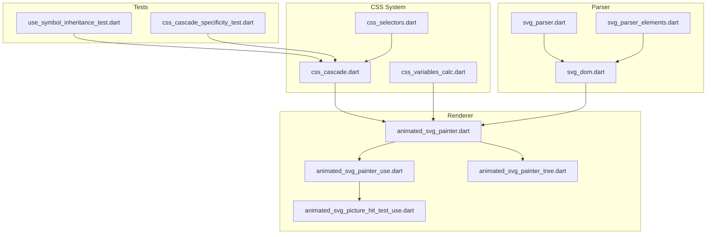
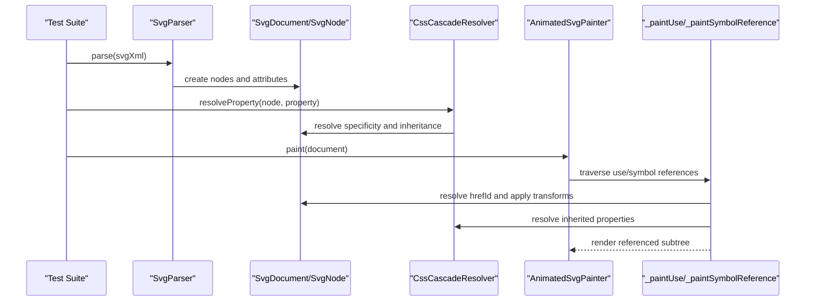
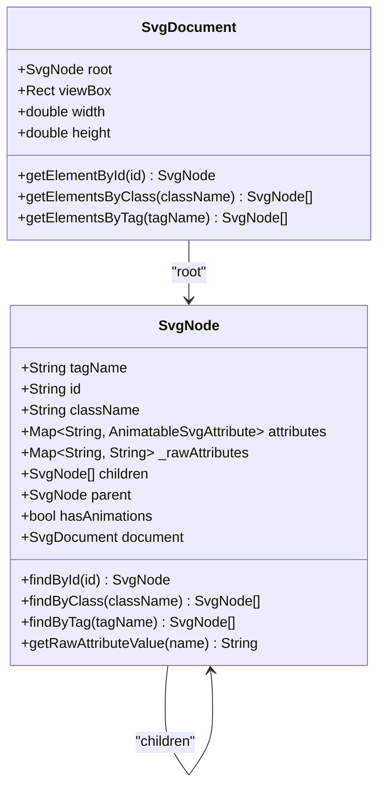
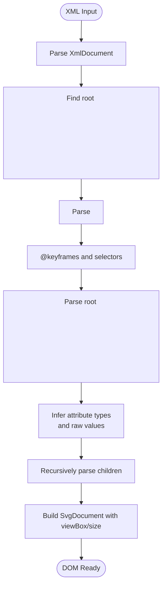
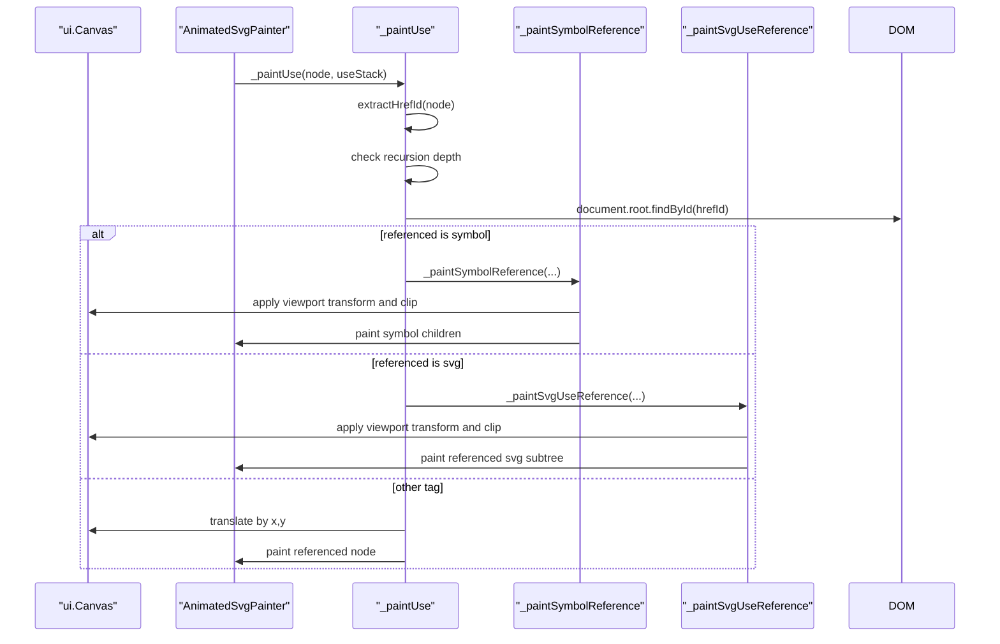
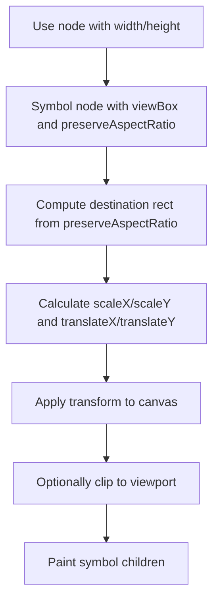
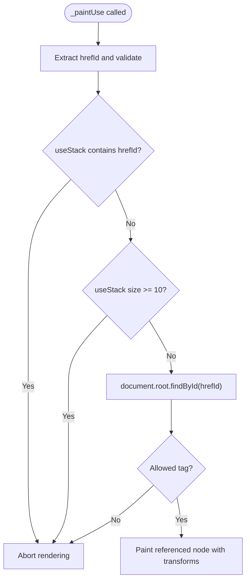
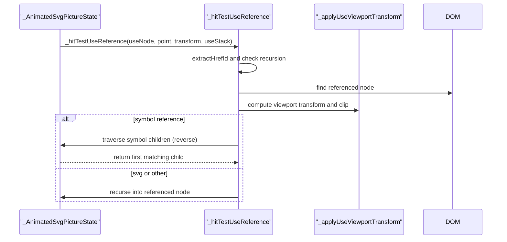
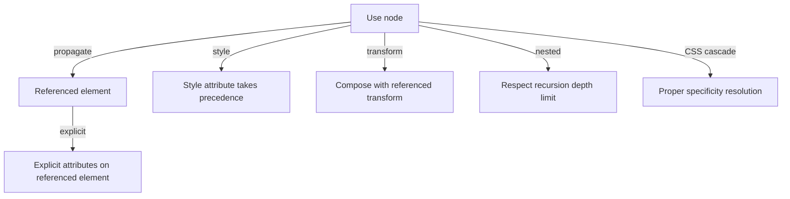
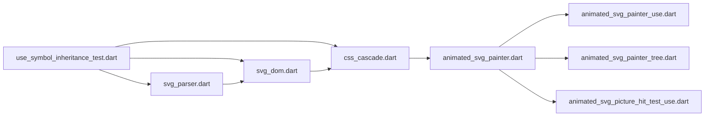

# Use Element Symbol Inheritance

<cite>
**Referenced Files in This Document**
- [use_symbol_inheritance_test.dart](file://test/animation/use_symbol_inheritance_test.dart)
- [animated_svg_painter_use.dart](file://lib/src/animation/animated_svg_painter_use.dart)
- [animated_svg_picture_hit_test_use.dart](file://lib/src/animation/animated_svg_picture_hit_test_use.dart)
- [svg_parser.dart](file://lib/src/animation/svg_parser.dart)
- [svg_dom.dart](file://lib/src/animation/svg_dom.dart)
- [svg_parser_elements.dart](file://lib/src/animation/svg_parser_elements.dart)
- [animated_svg_painter.dart](file://lib/src/animation/animated_svg_painter.dart)
- [css_cascade.dart](file://lib/src/animation/css_cascade.dart)
- [css_selectors.dart](file://lib/src/animation/css_selectors.dart)
- [css_variables_calc.dart](file://lib/src/animation/css_variables_calc.dart)
- [animated_svg_painter_tree.dart](file://lib/src/animation/animated_svg_painter_tree.dart)
- [svg.dart](file://lib/svg.dart)
</cite>

## Update Summary
**Changes Made**
- Enhanced CSS cascade behavior with comprehensive testing for CSS class rules, ID rules, element type rules, specificity calculations, and inheritance patterns
- Improved use element symbol inheritance system with detailed CSS property inheritance tracking
- Added support for CSS custom properties flowing through use boundaries
- Expanded attribute propagation rules with proper specificity handling
- Enhanced hit testing with use context inheritance for pointer-events

## Table of Contents
1. [Introduction](#introduction)
2. [Project Structure](#project-structure)
3. [Core Components](#core-components)
4. [Architecture Overview](#architecture-overview)
5. [Detailed Component Analysis](#detailed-component-analysis)
6. [Enhanced CSS Cascade System](#enhanced-css-cascade-system)
7. [Use Element Inheritance Context](#use-element-inheritance-context)
8. [CSS Custom Properties Through Use Boundaries](#css-custom-properties-through-use-boundaries)
9. [Dependency Analysis](#dependency-analysis)
10. [Performance Considerations](#performance-considerations)
11. [Troubleshooting Guide](#troubleshooting-guide)
12. [Conclusion](#conclusion)

## Introduction
This document explains how the Flutter SVG library implements element symbol inheritance through the `<use>` element and `<symbol>` references with enhanced CSS cascade behavior. It covers the parsing pipeline, rendering behavior, attribute propagation rules, CSS property inheritance, viewport transformations, recursion limits, and hit-testing mechanics. The system now provides comprehensive CSS cascade support including class rules, ID rules, element type rules, specificity calculations, and inheritance patterns that flow through use boundaries.

## Project Structure
The relevant implementation spans the animation pipeline, CSS cascade system, and extensive testing:
- Tests validate attribute propagation, symbol scaling, nested use recursion, CSS cascade behavior, and hit testing.
- The painter handles rendering of `<use>` and `<symbol>` references, applying transforms and clipping.
- The DOM model stores parsed attributes and enables traversal and lookup.
- The parser converts XML into a typed DOM with animatable attributes.
- The CSS cascade system provides comprehensive specificity calculations and inheritance resolution.
- Custom properties support enables variables to flow through use boundaries.

**Diagram sources**
- [use_symbol_inheritance_test.dart:1-1202](file://test/animation/use_symbol_inheritance_test.dart#L1-L1202)
- [css_cascade_specificity_test.dart:255-489](file://test/animation/css_cascade_specificity_test.dart#L255-L489)
- [css_cascade.dart:1-675](file://lib/src/animation/css_cascade.dart#L1-L675)
- [css_selectors.dart:1-654](file://lib/src/animation/css_selectors.dart#L1-L654)
- [css_variables_calc.dart:1-595](file://lib/src/animation/css_variables_calc.dart#L1-L595)
- [svg_parser.dart:27-65](file://lib/src/animation/svg_parser.dart#L27-L65)
- [svg_parser_elements.dart:3-138](file://lib/src/animation/svg_parser_elements.dart#L3-L138)
- [svg_dom.dart:123-332](file://lib/src/animation/svg_dom.dart#L123-L332)
- [animated_svg_painter.dart:48-136](file://lib/src/animation/animated_svg_painter.dart#L48-L136)
- [animated_svg_painter_use.dart:1-625](file://lib/src/animation/animated_svg_painter_use.dart#L1-L625)
- [animated_svg_painter_tree.dart:1-457](file://lib/src/animation/animated_svg_painter_tree.dart#L1-L457)
- [animated_svg_picture_hit_test_use.dart:1-339](file://lib/src/animation/animated_svg_picture_hit_test_use.dart#L1-L339)

**Section sources**
- [use_symbol_inheritance_test.dart:1-1202](file://test/animation/use_symbol_inheritance_test.dart#L1-L1202)
- [css_cascade.dart:1-675](file://lib/src/animation/css_cascade.dart#L1-L675)
- [css_variables_calc.dart:1-595](file://lib/src/animation/css_variables_calc.dart#L1-L595)
- [animated_svg_painter_use.dart:1-625](file://lib/src/animation/animated_svg_painter_use.dart#L1-L625)

## Core Components
- DOM Model: Stores parsed attributes, supports lookup by ID/class, and tracks animation presence.
- Parser: Converts XML to DOM nodes, infers attribute types, and preserves raw values for CSS matching.
- CSS Cascade System: Implements comprehensive specificity calculations, inheritance resolution, and property precedence.
- Painter: Renders the document, applies viewBox transforms, and handles `<use>` and `<symbol>` references with inheritance context.
- Hit Test: Performs pointer hit detection across `<use>` chains with recursion limits and pointer-events inheritance.
- CSS Variables: Supports custom properties flowing through use boundaries with proper inheritance.
- Tests: Validate attribute propagation, symbol scaling, nested references, CSS cascade behavior, and circular reference protection.

**Section sources**
- [svg_dom.dart:123-332](file://lib/src/animation/svg_dom.dart#L123-L332)
- [css_cascade.dart:277-396](file://lib/src/animation/css_cascade.dart#L277-L396)
- [css_variables_calc.dart:44-98](file://lib/src/animation/css_variables_calc.dart#L44-L98)
- [animated_svg_painter_use.dart:107-243](file://lib/src/animation/animated_svg_painter_use.dart#L107-L243)
- [animated_svg_picture_hit_test_use.dart:8-22](file://lib/src/animation/animated_svg_picture_hit_test_use.dart#L8-L22)
- [use_symbol_inheritance_test.dart:1-1202](file://test/animation/use_symbol_inheritance_test.dart#L1-L1202)

## Architecture Overview
The system parses SVG XML into a typed DOM, then renders it using a custom painter with enhanced CSS cascade support. The `<use>` element references another element by ID and inherits CSS properties from the referencing element. The CSS cascade system provides comprehensive specificity calculations and inheritance resolution that flows through use boundaries.

**Diagram sources**
- [svg_parser.dart:31-63](file://lib/src/animation/svg_parser.dart#L31-L63)
- [css_cascade.dart:295-396](file://lib/src/animation/css_cascade.dart#L295-L396)
- [animated_svg_painter_use.dart:159-233](file://lib/src/animation/animated_svg_painter_use.dart#L159-L233)

## Detailed Component Analysis

### DOM Model and Attribute Types
- Nodes store tag, id, class, and a map of animatable attributes with types (number, length, color, transform, path, points, string, list, url).
- Raw attribute values are preserved for CSS selector matching.
- Lookup helpers enable finding elements by id/class/tag recursively.

**Diagram sources**
- [svg_dom.dart:123-332](file://lib/src/animation/svg_dom.dart#L123-L332)

**Section sources**
- [svg_dom.dart:123-332](file://lib/src/animation/svg_dom.dart#L123-L332)

### Parser Pipeline
- Parses XML into DOM nodes, infers attribute types, and extracts direct text content for text nodes.
- Skips style elements during element parsing; CSS is handled separately.
- Root attributes (viewBox, width, height) are captured for viewport calculations.

**Diagram sources**
- [svg_parser.dart:31-63](file://lib/src/animation/svg_parser.dart#L31-L63)
- [svg_parser_elements.dart:3-49](file://lib/src/animation/svg_parser_elements.dart#L3-L49)

**Section sources**
- [svg_parser.dart:27-65](file://lib/src/animation/svg_parser.dart#L27-L65)
- [svg_parser_elements.dart:3-138](file://lib/src/animation/svg_parser_elements.dart#L3-L138)

### Use Element Rendering and Attribute Propagation
- The painter resolves the referenced element by ID from the `href` attribute.
- For `<symbol>` references, it computes a viewport transform based on `width/height` and `preserveAspectRatio`, then clips and transforms the canvas before rendering children.
- For `<svg>` references, it applies similar viewport logic and then paints the referenced SVG subtree.
- For other referenced tags, it paints the referenced node directly after translating by `x/y`.

**Diagram sources**
- [animated_svg_painter_use.dart:159-253](file://lib/src/animation/animated_svg_painter_use.dart#L159-L253)

**Section sources**
- [animated_svg_painter_use.dart:159-253](file://lib/src/animation/animated_svg_painter_use.dart#L159-L253)

### Symbol ViewBox and PreserveAspectRatio
- When referencing a `<symbol>`, the use element defines the viewport (`width/height`) and the symbol defines the `viewBox` and `preserveAspectRatio`.
- The renderer computes a destination rectangle and applies a scale and translate transform, optionally clipping to the viewport.

**Diagram sources**
- [animated_svg_painter_use.dart:213-233](file://lib/src/animation/animated_svg_painter_use.dart#L213-L233)

**Section sources**
- [animated_svg_painter_use.dart:213-233](file://lib/src/animation/animated_svg_painter_use.dart#L213-L233)

### Nested Use References and Recursion Limits
- The implementation enforces a maximum recursion depth (matching Blink) to prevent infinite loops and excessive resource usage.
- Circular references are detected by tracking visited IDs in the use stack.
- Tests verify correct behavior for up to 10 levels of nesting and protection against cycles.

**Diagram sources**
- [animated_svg_painter_use.dart:159-172](file://lib/src/animation/animated_svg_painter_use.dart#L159-L172)
- [animated_svg_picture_hit_test_use.dart:9-23](file://lib/src/animation/animated_svg_picture_hit_test_use.dart#L9-L23)

**Section sources**
- [animated_svg_painter_use.dart:3-5](file://lib/src/animation/animated_svg_painter_use.dart#L3-L5)
- [animated_svg_picture_hit_test_use.dart:3-5](file://lib/src/animation/animated_svg_picture_hit_test_use.dart#L3-L5)

### Hit Testing Across Use References
- Hit testing mirrors rendering: it resolves the referenced element, applies the same viewport transforms, and checks whether the pointer falls within the transformed viewport.
- It traverses symbol children in reverse order (top-most first) and recurses into the referenced subtree with the same use stack protections.
- Pointer-events inheritance is tracked through use boundaries for proper event handling.

**Diagram sources**
- [animated_svg_picture_hit_test_use.dart:9-91](file://lib/src/animation/animated_svg_picture_hit_test_use.dart#L9-L91)

**Section sources**
- [animated_svg_picture_hit_test_use.dart:9-91](file://lib/src/animation/animated_svg_picture_hit_test_use.dart#L9-L91)

### Attribute Propagation Rules Verified by Tests
- Fill/stroke/opacity/font properties on `<use>` propagate to referenced elements.
- Explicit attributes on referenced elements override inherited attributes from `<use>`.
- Style attribute on `<use>` overrides inline attributes.
- Transform on `<use>` composes with referenced element transforms.
- Nested `<use>` chains render correctly up to the recursion limit.
- Circular references are prevented without crashing.
- CSS class rules, ID rules, and element type rules are properly resolved through use boundaries.
- Inheritance patterns follow CSS cascade specifications with proper specificity calculations.

**Diagram sources**
- [use_symbol_inheritance_test.dart:11-159](file://test/animation/use_symbol_inheritance_test.dart#L11-L159)

**Section sources**
- [use_symbol_inheritance_test.dart:11-159](file://test/animation/use_symbol_inheritance_test.dart#L11-L159)

## Enhanced CSS Cascade System

### Comprehensive Specificity Calculations
The CSS cascade system implements full CSS specificity calculations including:
- ID selectors (#id) with highest priority
- Class selectors (.class) and attribute selectors ([attr])
- Element type selectors (rect, circle) and pseudo-class selectors (:hover, :active)
- Universal selector (*) with zero specificity
- Compound selectors combined with proper specificity arithmetic

### CSS Property Inheritance Tracking
The system maintains comprehensive inheritance tracking for:
- Color properties (color, fill, stroke)
- Font properties (font-family, font-size, font-weight)
- Text properties (text-align, white-space, word-spacing)
- SVG-specific properties (stroke-width, stroke-linecap, paint-order)
- Visibility properties (visibility, pointer-events, cursor)
- Text decoration and emphasis properties

### CSS Variable Resolution Through Use Boundaries
Custom properties (CSS variables) flow through use boundaries with:
- Proper inheritance from use elements to referenced content
- Support for var(--variable-name) syntax with fallback values
- Resolution order: use element variables > parent variables > referenced element variables
- Infinite recursion prevention with iteration limits

**Section sources**
- [css_cascade.dart:18-667](file://lib/src/animation/css_cascade.dart#L18-L667)
- [css_variables_calc.dart:101-173](file://lib/src/animation/css_variables_calc.dart#L101-L173)

## Use Element Inheritance Context

### Inheritance Context Management
The `_UseInheritanceContext` class manages CSS property inheritance across use boundaries:
- Captures use element properties for inheritance to referenced content
- Maintains parent context for nested use chains
- Provides CSS rules from document for proper class/id resolution
- Handles CSS custom property lookup through use boundaries

### Inherited Property Resolution
Properties that flow through use boundaries include:
- All CSS inheritable properties (color, font, stroke, fill, visibility)
- CSS custom properties (starting with --)
- Presentation attributes on use elements
- Style attribute values on use elements

Properties that do NOT flow through use boundaries:
- Non-inherited properties (opacity, transform, display, clip-path, mask, filter)
- Positioning properties (x, y coordinates)
- Structural properties affecting use element itself

### CSS Rule Resolution Through Use Boundaries
The system resolves CSS rules for referenced elements:
- Inline styles on referenced elements take highest precedence
- Document CSS rules matching referenced element (class, id, element type)
- Presentation attributes on referenced elements
- Inherited values from use element chain
- Parent element inherited values for non-inherited properties

**Section sources**
- [animated_svg_painter_use.dart:107-243](file://lib/src/animation/animated_svg_painter_use.dart#L107-L243)
- [animated_svg_painter_tree.dart:27-226](file://lib/src/animation/animated_svg_painter_tree.dart#L27-L226)

## CSS Custom Properties Through Use Boundaries

### Variable Resolution Mechanism
CSS variables can flow through use boundaries through:
- Direct use element custom properties (style attribute)
- Parent element custom properties in the use chain
- Referenced element custom properties for non-inherited properties
- Proper fallback value resolution when variables are undefined

### Variable Resolution Order
The system resolves CSS variables in this order:
1. Use element custom properties (highest priority)
2. Parent element custom properties in use chain
3. Referenced element custom properties
4. CSS variable fallback values
5. Empty string if no resolution possible

### Variable Storage and Access
Custom properties are stored using:
- Node-level custom property stores for inheritance
- Weak map pattern via attribute storage
- Proper cleanup and disposal of property stores
- Support for nested use element chains

**Section sources**
- [css_variables_calc.dart:44-98](file://lib/src/animation/css_variables_calc.dart#L44-L98)
- [css_variables_calc.dart:101-173](file://lib/src/animation/css_variables_calc.dart#L101-L173)

## Dependency Analysis
- Tests depend on the parser, CSS cascade system, and animation pipeline to validate rendering behavior.
- The painter depends on the DOM model, CSS cascade resolver, and use extension for reference resolution.
- The hit-test extension mirrors the painter's logic for pointer events with use context inheritance.
- CSS cascade system provides specificity calculations and inheritance resolution for all rendering operations.

**Diagram sources**
- [use_symbol_inheritance_test.dart:1-1202](file://test/animation/use_symbol_inheritance_test.dart#L1-L1202)
- [css_cascade.dart:1-675](file://lib/src/animation/css_cascade.dart#L1-L675)
- [svg_parser.dart:27-65](file://lib/src/animation/svg_parser.dart#L27-L65)
- [svg_dom.dart:123-332](file://lib/src/animation/svg_dom.dart#L123-L332)
- [animated_svg_painter.dart:48-136](file://lib/src/animation/animated_svg_painter.dart#L48-L136)
- [animated_svg_painter_use.dart:1-625](file://lib/src/animation/animated_svg_painter_use.dart#L1-L625)
- [animated_svg_painter_tree.dart:1-457](file://lib/src/animation/animated_svg_painter_tree.dart#L1-L457)
- [animated_svg_picture_hit_test_use.dart:1-339](file://lib/src/animation/animated_svg_picture_hit_test_use.dart#L1-L339)

**Section sources**
- [use_symbol_inheritance_test.dart:1-1202](file://test/animation/use_symbol_inheritance_test.dart#L1-L1202)
- [css_cascade.dart:1-675](file://lib/src/animation/css_cascade.dart#L1-L675)
- [animated_svg_painter_use.dart:1-625](file://lib/src/animation/animated_svg_painter_use.dart#L1-L625)
- [animated_svg_picture_hit_test_use.dart:1-339](file://lib/src/animation/animated_svg_picture_hit_test_use.dart#L1-L339)

## Performance Considerations
- Recursion depth is capped to prevent excessive memory and CPU usage during nested `<use>` chains.
- The DOM caches raw attribute values for efficient CSS selector matching.
- Static subtrees may be cached as pictures when animations are absent, reducing repaint costs.
- CSS cascade resolver uses caching for matching rules to improve performance.
- Custom property resolution includes iteration limits to prevent infinite recursion.
- Use inheritance context is managed efficiently to minimize memory overhead.

## Troubleshooting Guide
- If a `<use>` does not render, verify the `href` attribute references an allowed tag and exists in the document.
- Circular references or deep nesting beyond the limit will be silently aborted; simplify the structure or reduce nesting.
- Attribute precedence: explicit attributes on the referenced element override `<use>` attributes; style on `<use>` overrides inline attributes.
- For symbol scaling issues, ensure the `<use>` specifies `width/height` and the `<symbol>` has a valid `viewBox` and `preserveAspectRatio`.
- CSS cascade issues: verify specificity calculations and inheritance patterns are working correctly.
- Custom property resolution: check that variables are properly defined in the use chain or referenced element.
- Pointer-events inheritance: ensure use element pointer-events are properly inherited by referenced content.

**Section sources**
- [animated_svg_painter_use.dart:159-172](file://lib/src/animation/animated_svg_painter_use.dart#L159-L172)
- [animated_svg_picture_hit_test_use.dart:9-23](file://lib/src/animation/animated_svg_picture_hit_test_use.dart#L9-L23)
- [use_symbol_inheritance_test.dart:126-159](file://test/animation/use_symbol_inheritance_test.dart#L126-L159)

## Conclusion
The Flutter SVG library implements robust element symbol inheritance by resolving `<use>` references, applying symbol-specific viewport transforms, and enforcing strict recursion limits. The enhanced CSS cascade system provides comprehensive specificity calculations, inheritance resolution, and custom property support that flows through use boundaries. Attribute propagation follows predictable precedence rules, and both rendering and hit testing mirror these behaviors with proper use context inheritance. The extensive test suite validates correctness across common scenarios, nested references, CSS cascade behavior, and edge cases like circular dependencies and custom property resolution.