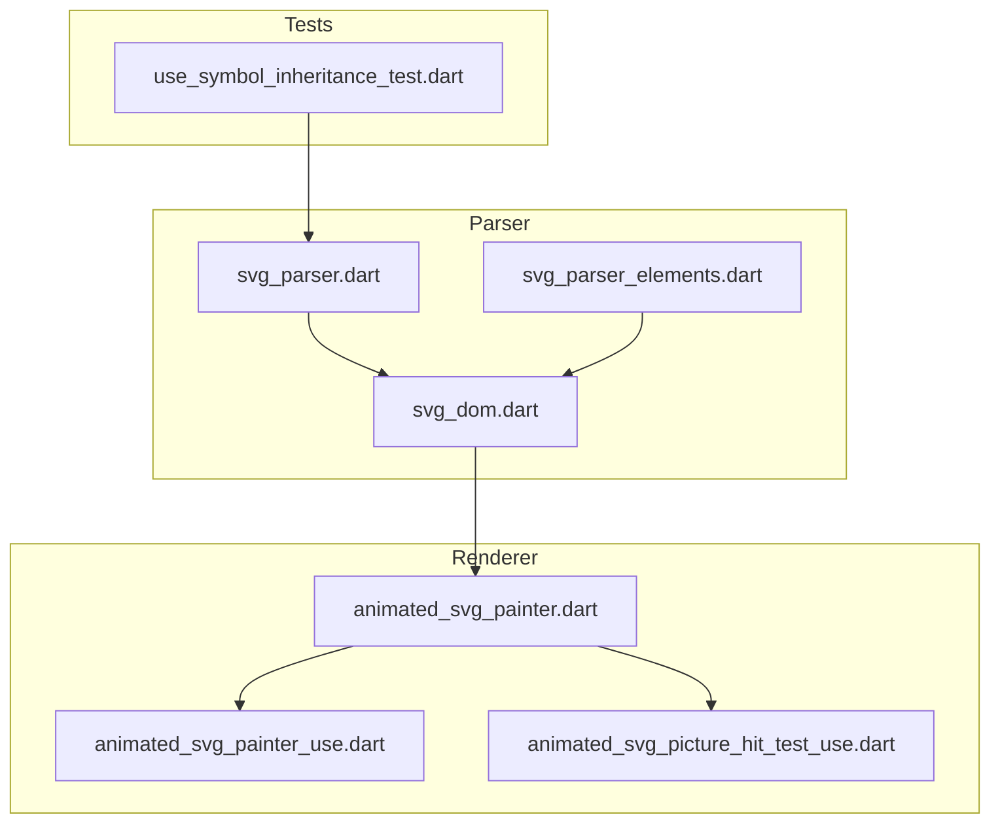
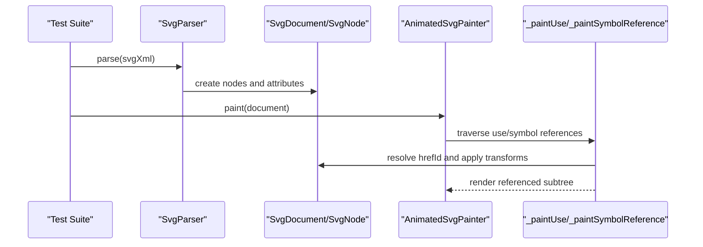
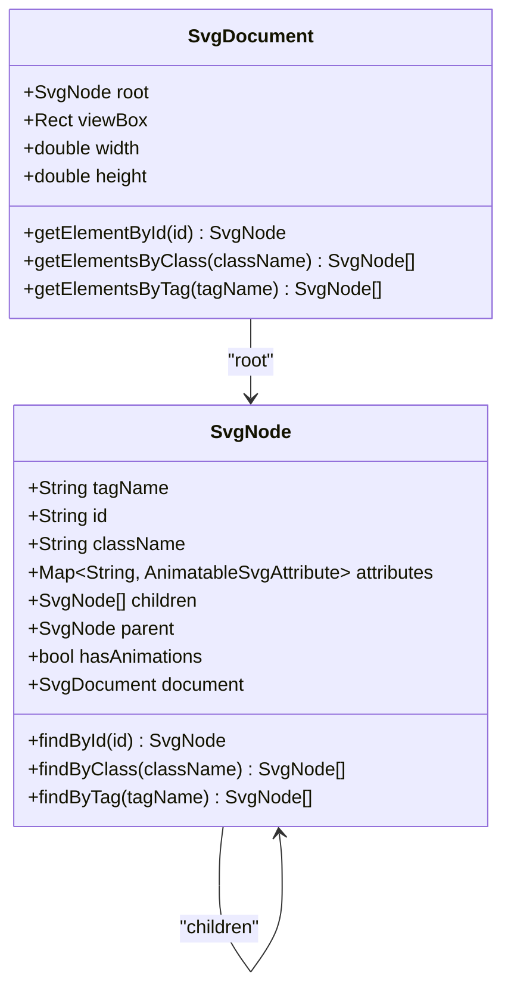
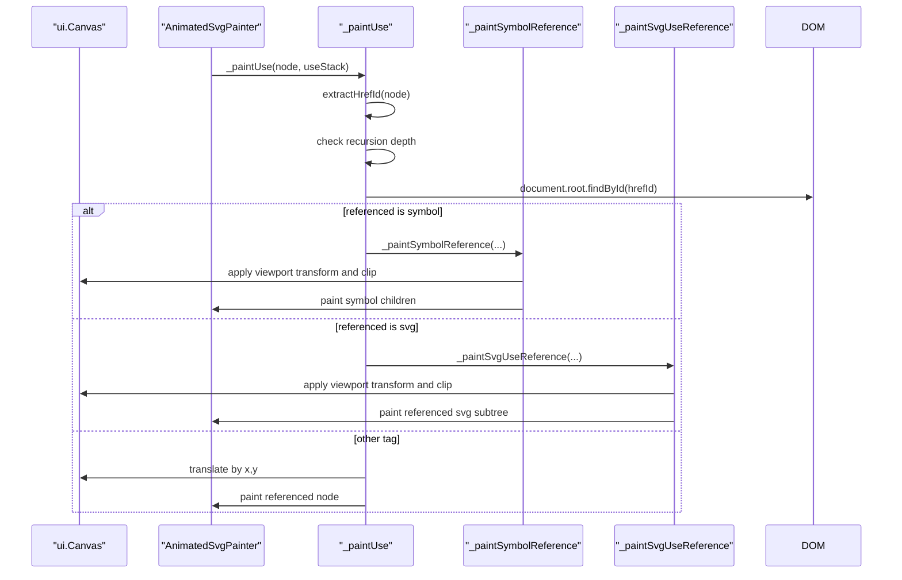
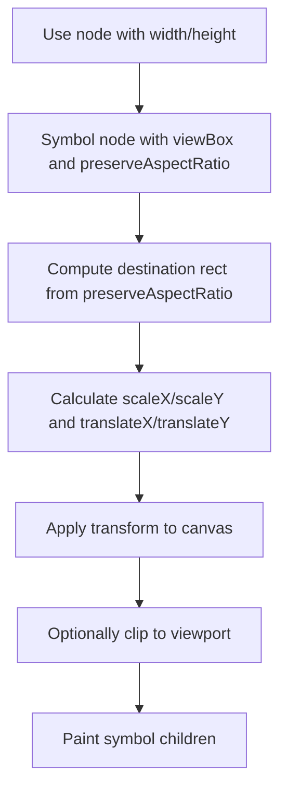
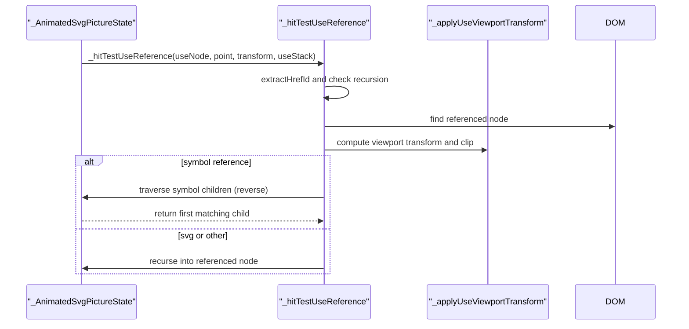
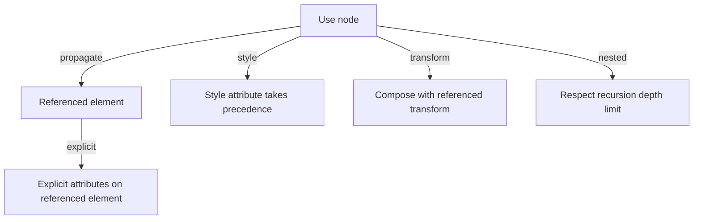
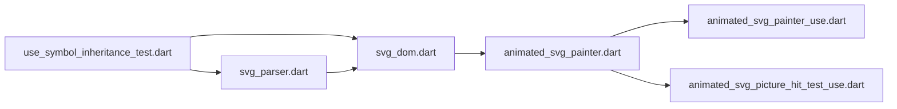

# Use Element Symbol Inheritance

<cite>
**Referenced Files in This Document**
- [use_symbol_inheritance_test.dart](file://test/animation/use_symbol_inheritance_test.dart)
- [animated_svg_painter_use.dart](file://lib/src/animation/animated_svg_painter_use.dart)
- [animated_svg_picture_hit_test_use.dart](file://lib/src/animation/animated_svg_picture_hit_test_use.dart)
- [svg_parser.dart](file://lib/src/animation/svg_parser.dart)
- [svg_dom.dart](file://lib/src/animation/svg_dom.dart)
- [svg_parser_elements.dart](file://lib/src/animation/svg_parser_elements.dart)
- [animated_svg_painter.dart](file://lib/src/animation/animated_svg_painter.dart)
- [svg.dart](file://lib/svg.dart)
</cite>

## Table of Contents
1. [Introduction](#introduction)
2. [Project Structure](#project-structure)
3. [Core Components](#core-components)
4. [Architecture Overview](#architecture-overview)
5. [Detailed Component Analysis](#detailed-component-analysis)
6. [Dependency Analysis](#dependency-analysis)
7. [Performance Considerations](#performance-considerations)
8. [Troubleshooting Guide](#troubleshooting-guide)
9. [Conclusion](#conclusion)

## Introduction
This document explains how the Flutter SVG library implements element symbol inheritance through the `<use>` element and `<symbol>` references. It covers the parsing pipeline, rendering behavior, attribute propagation rules, viewport transformations, recursion limits, and hit-testing mechanics. The goal is to help developers understand how attributes, transforms, and styling cascade from a `<use>` element to its referenced content, including nested references and symbol-specific scaling rules.

## Project Structure
The relevant implementation spans the animation pipeline and tests:
- Tests validate attribute propagation, symbol scaling, nested use recursion, and hit testing.
- The painter handles rendering of `<use>` and `<symbol>` references, applying transforms and clipping.
- The DOM model stores parsed attributes and enables traversal and lookup.
- The parser converts XML into a typed DOM with animatable attributes.

**Diagram sources**
- [use_symbol_inheritance_test.dart:1-627](file://test/animation/use_symbol_inheritance_test.dart#L1-L627)
- [svg_parser.dart:27-65](file://lib/src/animation/svg_parser.dart#L27-L65)
- [svg_parser_elements.dart:3-138](file://lib/src/animation/svg_parser_elements.dart#L3-L138)
- [svg_dom.dart:123-332](file://lib/src/animation/svg_dom.dart#L123-L332)
- [animated_svg_painter.dart:48-136](file://lib/src/animation/animated_svg_painter.dart#L48-L136)
- [animated_svg_painter_use.dart:1-299](file://lib/src/animation/animated_svg_painter_use.dart#L1-L299)
- [animated_svg_picture_hit_test_use.dart:1-192](file://lib/src/animation/animated_svg_picture_hit_test_use.dart#L1-L192)

**Section sources**
- [use_symbol_inheritance_test.dart:1-627](file://test/animation/use_symbol_inheritance_test.dart#L1-L627)
- [svg_parser.dart:27-65](file://lib/src/animation/svg_parser.dart#L27-L65)
- [svg_parser_elements.dart:3-138](file://lib/src/animation/svg_parser_elements.dart#L3-L138)
- [svg_dom.dart:123-332](file://lib/src/animation/svg_dom.dart#L123-L332)
- [animated_svg_painter.dart:48-136](file://lib/src/animation/animated_svg_painter.dart#L48-L136)
- [animated_svg_painter_use.dart:1-299](file://lib/src/animation/animated_svg_painter_use.dart#L1-L299)
- [animated_svg_picture_hit_test_use.dart:1-192](file://lib/src/animation/animated_svg_picture_hit_test_use.dart#L1-L192)

## Core Components
- DOM Model: Stores parsed attributes, supports lookup by ID/class, and tracks animation presence.
- Parser: Converts XML to DOM nodes, infers attribute types, and preserves raw values for CSS matching.
- Painter: Renders the document, applies viewBox transforms, and handles `<use>` and `<symbol>` references.
- Hit Test: Performs pointer hit detection across `<use>` chains with recursion limits.
- Tests: Validate attribute propagation, symbol scaling, nested references, and circular reference protection.

**Section sources**
- [svg_dom.dart:123-332](file://lib/src/animation/svg_dom.dart#L123-L332)
- [svg_parser_elements.dart:3-138](file://lib/src/animation/svg_parser_elements.dart#L3-L138)
- [animated_svg_painter_use.dart:159-211](file://lib/src/animation/animated_svg_painter_use.dart#L159-L211)
- [animated_svg_picture_hit_test_use.dart:9-91](file://lib/src/animation/animated_svg_picture_hit_test_use.dart#L9-L91)
- [use_symbol_inheritance_test.dart:1-627](file://test/animation/use_symbol_inheritance_test.dart#L1-L627)

## Architecture Overview
The system parses SVG XML into a typed DOM, then renders it using a custom painter. The `<use>` element references another element by ID and inherits attributes from the referencing element. Symbols introduce a viewport and preserveAspectRatio behavior that scales the referenced content.

**Diagram sources**
- [svg_parser.dart:31-63](file://lib/src/animation/svg_parser.dart#L31-L63)
- [svg_dom.dart:280-332](file://lib/src/animation/svg_dom.dart#L280-L332)
- [animated_svg_painter_use.dart:159-233](file://lib/src/animation/animated_svg_painter_use.dart#L159-L233)

## Detailed Component Analysis

### DOM Model and Attribute Types
- Nodes store tag, id, class, and a map of animatable attributes with types (number, length, color, transform, path, points, string, list, url).
- Raw attribute values are preserved for CSS selector matching.
- Lookup helpers enable finding elements by id/class/tag recursively.

**Diagram sources**
- [svg_dom.dart:123-332](file://lib/src/animation/svg_dom.dart#L123-L332)

**Section sources**
- [svg_dom.dart:123-332](file://lib/src/animation/svg_dom.dart#L123-L332)

### Parser Pipeline
- Parses XML into DOM nodes, infers attribute types, and extracts direct text content for text nodes.
- Skips style elements during element parsing; CSS is handled separately.
- Root attributes (viewBox, width, height) are captured for viewport calculations.

**Diagram sources**
- [svg_parser.dart:31-63](file://lib/src/animation/svg_parser.dart#L31-L63)
- [svg_parser_elements.dart:3-49](file://lib/src/animation/svg_parser_elements.dart#L3-L49)

**Section sources**
- [svg_parser.dart:27-65](file://lib/src/animation/svg_parser.dart#L27-L65)
- [svg_parser_elements.dart:3-138](file://lib/src/animation/svg_parser_elements.dart#L3-L138)

### Use Element Rendering and Attribute Propagation
- The painter resolves the referenced element by ID from the `href` attribute.
- For `<symbol>` references, it computes a viewport transform based on `width/height` and `preserveAspectRatio`, then clips and transforms the canvas before rendering children.
- For `<svg>` references, it applies similar viewport logic and then paints the referenced SVG subtree.
- For other referenced tags, it paints the referenced node directly after translating by `x/y`.

**Diagram sources**
- [animated_svg_painter_use.dart:159-253](file://lib/src/animation/animated_svg_painter_use.dart#L159-L253)

**Section sources**
- [animated_svg_painter_use.dart:159-253](file://lib/src/animation/animated_svg_painter_use.dart#L159-L253)

### Symbol ViewBox and PreserveAspectRatio
- When referencing a `<symbol>`, the use element defines the viewport (`width/height`) and the symbol defines the `viewBox` and `preserveAspectRatio`.
- The renderer computes a destination rectangle and applies a scale and translate transform, optionally clipping to the viewport.

**Diagram sources**
- [animated_svg_painter_use.dart:213-233](file://lib/src/animation/animated_svg_painter_use.dart#L213-L233)

**Section sources**
- [animated_svg_painter_use.dart:213-233](file://lib/src/animation/animated_svg_painter_use.dart#L213-L233)

### Nested Use References and Recursion Limits
- The implementation enforces a maximum recursion depth (matching Blink) to prevent infinite loops and excessive resource usage.
- Circular references are detected by tracking visited IDs in the use stack.
- Tests verify correct behavior for up to 10 levels of nesting and protection against cycles.

**Diagram sources**
- [animated_svg_painter_use.dart:159-172](file://lib/src/animation/animated_svg_painter_use.dart#L159-L172)
- [animated_svg_picture_hit_test_use.dart:9-23](file://lib/src/animation/animated_svg_picture_hit_test_use.dart#L9-L23)

**Section sources**
- [animated_svg_painter_use.dart:3-5](file://lib/src/animation/animated_svg_painter_use.dart#L3-L5)
- [animated_svg_picture_hit_test_use.dart:3-5](file://lib/src/animation/animated_svg_picture_hit_test_use.dart#L3-L5)

### Hit Testing Across Use References
- Hit testing mirrors rendering: it resolves the referenced element, applies the same viewport transforms, and checks whether the pointer falls within the transformed viewport.
- It traverses symbol children in reverse order (top-most first) and recurses into the referenced subtree with the same use stack protections.

**Diagram sources**
- [animated_svg_picture_hit_test_use.dart:9-91](file://lib/src/animation/animated_svg_picture_hit_test_use.dart#L9-L91)

**Section sources**
- [animated_svg_picture_hit_test_use.dart:9-91](file://lib/src/animation/animated_svg_picture_hit_test_use.dart#L9-L91)

### Attribute Propagation Rules Verified by Tests
- Fill/stroke/opacity/font properties on `<use>` propagate to referenced elements.
- Explicit attributes on referenced elements override inherited attributes from `<use>`.
- Style attribute on `<use>` overrides inline attributes.
- Transform on `<use>` composes with referenced element transforms.
- Nested `<use>` chains render correctly up to the recursion limit.
- Circular references are prevented without crashing.

**Diagram sources**
- [use_symbol_inheritance_test.dart:11-159](file://test/animation/use_symbol_inheritance_test.dart#L11-L159)

**Section sources**
- [use_symbol_inheritance_test.dart:11-159](file://test/animation/use_symbol_inheritance_test.dart#L11-L159)

## Dependency Analysis
- Tests depend on the parser and the animation pipeline to validate rendering behavior.
- The painter depends on the DOM model and the use extension for reference resolution.
- The hit-test extension mirrors the painter’s logic for pointer events.

**Diagram sources**
- [use_symbol_inheritance_test.dart:1-627](file://test/animation/use_symbol_inheritance_test.dart#L1-L627)
- [svg_parser.dart:27-65](file://lib/src/animation/svg_parser.dart#L27-L65)
- [svg_dom.dart:123-332](file://lib/src/animation/svg_dom.dart#L123-L332)
- [animated_svg_painter.dart:48-136](file://lib/src/animation/animated_svg_painter.dart#L48-L136)
- [animated_svg_painter_use.dart:1-299](file://lib/src/animation/animated_svg_painter_use.dart#L1-L299)
- [animated_svg_picture_hit_test_use.dart:1-192](file://lib/src/animation/animated_svg_picture_hit_test_use.dart#L1-L192)

**Section sources**
- [use_symbol_inheritance_test.dart:1-627](file://test/animation/use_symbol_inheritance_test.dart#L1-L627)
- [svg_parser.dart:27-65](file://lib/src/animation/svg_parser.dart#L27-L65)
- [svg_dom.dart:123-332](file://lib/src/animation/svg_dom.dart#L123-L332)
- [animated_svg_painter.dart:48-136](file://lib/src/animation/animated_svg_painter.dart#L48-L136)
- [animated_svg_painter_use.dart:1-299](file://lib/src/animation/animated_svg_painter_use.dart#L1-L299)
- [animated_svg_picture_hit_test_use.dart:1-192](file://lib/src/animation/animated_svg_picture_hit_test_use.dart#L1-L192)

## Performance Considerations
- Recursion depth is capped to prevent excessive memory and CPU usage during nested `<use>` chains.
- The DOM caches raw attribute values for efficient CSS selector matching.
- Static subtrees may be cached as pictures when animations are absent, reducing repaint costs.

## Troubleshooting Guide
- If a `<use>` does not render, verify the `href` attribute references an allowed tag and exists in the document.
- Circular references or deep nesting beyond the limit will be silently aborted; simplify the structure or reduce nesting.
- Attribute precedence: explicit attributes on the referenced element override `<use>` attributes; style on `<use>` overrides inline attributes.
- For symbol scaling issues, ensure the `<use>` specifies `width/height` and the `<symbol>` has a valid `viewBox` and `preserveAspectRatio`.

**Section sources**
- [animated_svg_painter_use.dart:159-172](file://lib/src/animation/animated_svg_painter_use.dart#L159-L172)
- [animated_svg_picture_hit_test_use.dart:9-23](file://lib/src/animation/animated_svg_picture_hit_test_use.dart#L9-L23)
- [use_symbol_inheritance_test.dart:126-159](file://test/animation/use_symbol_inheritance_test.dart#L126-L159)

## Conclusion
The Flutter SVG library implements robust element symbol inheritance by resolving `<use>` references, applying symbol-specific viewport transforms, and enforcing strict recursion limits. Attribute propagation follows predictable precedence rules, and both rendering and hit testing mirror these behaviors. The test suite validates correctness across common scenarios, nested references, and edge cases like circular dependencies.