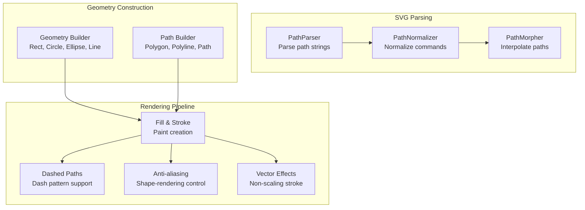
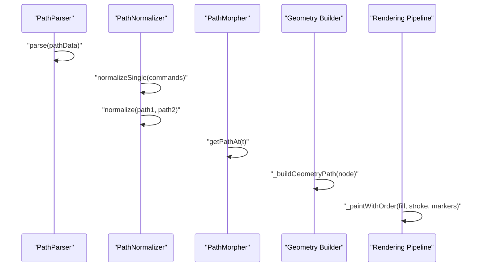
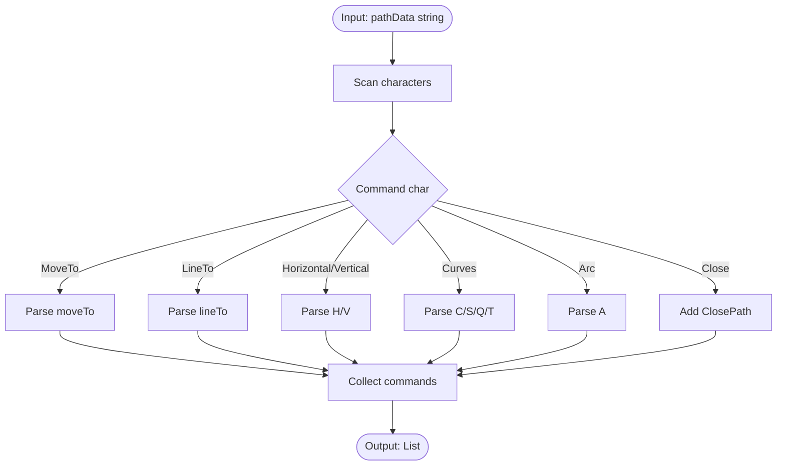
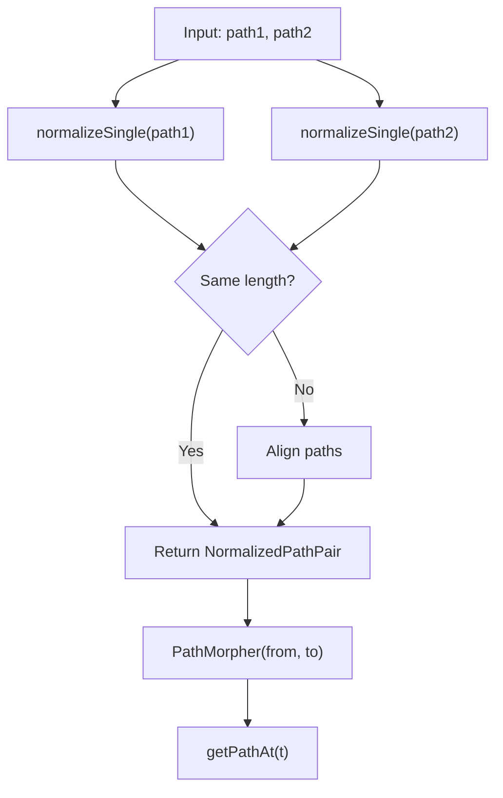
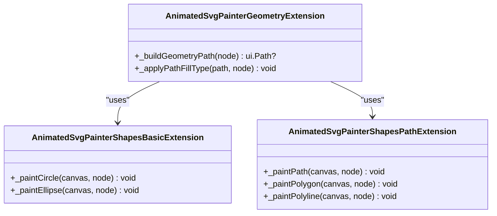
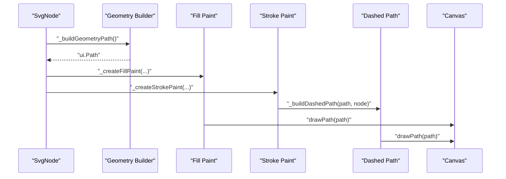
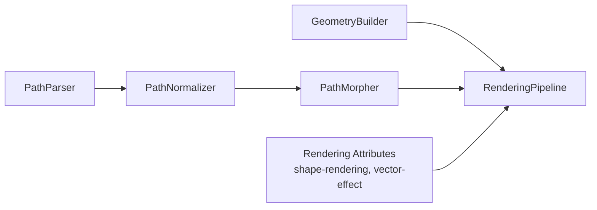

# Advanced Shape Rendering

<cite>
**Referenced Files in This Document**
- [svg.dart](file://lib/svg.dart)
- [animated_svg_painter_shapes_paths.dart](file://lib/src/animation/animated_svg_painter_shapes_paths.dart)
- [animated_svg_painter_shapes_basic.dart](file://lib/src/animation/animated_svg_painter_shapes_basic.dart)
- [animated_svg_painter_geometry.dart](file://lib/src/animation/animated_svg_painter_geometry.dart)
- [path_interpolation_morpher.dart](file://lib/src/animation/path_interpolation_morpher.dart)
- [path_normalizer.dart](file://lib/src/animation/path_normalizer.dart)
- [path_parser.dart](file://lib/src/animation/path_parser.dart)
- [advanced_path_morphing.dart](file://example/lib/advanced_path_morphing.dart)
- [path_morphing_example.dart](file://example/lib/path_morphing_example.dart)
- [rendering_attributes_test.dart](file://test/animation/rendering_attributes_test.dart)
- [vector_effect_test.dart](file://test/animation/vector_effect_test.dart)
- [animated_svg_painter_values.dart](file://lib/src/animation/animated_svg_painter_values.dart)
</cite>

## Table of Contents
1. [Introduction](#introduction)
2. [Project Structure](#project-structure)
3. [Core Components](#core-components)
4. [Architecture Overview](#architecture-overview)
5. [Detailed Component Analysis](#detailed-component-analysis)
6. [Dependency Analysis](#dependency-analysis)
7. [Performance Considerations](#performance-considerations)
8. [Troubleshooting Guide](#troubleshooting-guide)
9. [Conclusion](#conclusion)

## Introduction
This document explains the advanced shape rendering capabilities of the Flutter SVG library, focusing on how SVG shapes are parsed, optimized, and rendered efficiently. It covers the path parsing pipeline, shape geometry construction, stroke and fill rendering, and advanced features such as path morphing, anti-aliasing controls, and vector effects. The goal is to help developers understand how complex SVG shapes are transformed into Flutter Canvas operations and how to leverage advanced rendering features for high-quality visuals.

## Project Structure
The advanced shape rendering system is organized around three primary areas:
- SVG parsing and geometry construction: Converts SVG path strings and shape attributes into Flutter Path objects.
- Rendering pipeline: Applies fills, strokes, dashing, markers, and paint order to Canvas.
- Path morphing and interpolation: Normalizes paths and interpolates between shapes for smooth animations.

**Diagram sources**
- [path_parser.dart:19-96](file://lib/src/animation/path_parser.dart#L19-L96)
- [path_normalizer.dart:22-55](file://lib/src/animation/path_normalizer.dart#L22-L55)
- [path_interpolation_morpher.dart:6-39](file://lib/src/animation/path_interpolation_morpher.dart#L6-L39)
- [animated_svg_painter_geometry.dart:4-143](file://lib/src/animation/animated_svg_painter_geometry.dart#L4-L143)
- [animated_svg_painter_shapes_paths.dart:4-189](file://lib/src/animation/animated_svg_painter_shapes_paths.dart#L4-L189)
- [animated_svg_painter_shapes_basic.dart:5-104](file://lib/src/animation/animated_svg_painter_shapes_basic.dart#L5-L104)
- [animated_svg_painter_values.dart:389-421](file://lib/src/animation/animated_svg_painter_values.dart#L389-L421)

**Section sources**
- [svg.dart:57-627](file://lib/svg.dart#L57-L627)
- [path_parser.dart:19-96](file://lib/src/animation/path_parser.dart#L19-L96)
- [animated_svg_painter_geometry.dart:4-143](file://lib/src/animation/animated_svg_painter_geometry.dart#L4-L143)

## Core Components
- PathParser: Converts SVG path data strings into structured PathCommand objects, supporting all SVG path commands (M, L, H, V, C, S, Q, T, A, Z) and both absolute and relative forms.
- PathNormalizer: Transforms paths into a canonical form suitable for interpolation—absolute coordinates, cubic Beziers only, and aligned command sequences.
- PathMorpher: Provides path interpolation between normalized paths, enabling smooth animations between shapes.
- Geometry Builders: Construct Flutter Path objects for rectangles, circles, ellipses, lines, polygons, polylines, and paths.
- Rendering Pipeline: Applies fills, strokes, dashes, markers, and respects shape-rendering and vector-effect attributes.

**Section sources**
- [path_parser.dart:19-96](file://lib/src/animation/path_parser.dart#L19-L96)
- [path_normalizer.dart:22-55](file://lib/src/animation/path_normalizer.dart#L22-L55)
- [path_interpolation_morpher.dart:6-39](file://lib/src/animation/path_interpolation_morpher.dart#L6-L39)
- [animated_svg_painter_geometry.dart:4-143](file://lib/src/animation/animated_svg_painter_geometry.dart#L4-L143)
- [animated_svg_painter_shapes_paths.dart:4-189](file://lib/src/animation/animated_svg_painter_shapes_paths.dart#L4-L189)
- [animated_svg_painter_shapes_basic.dart:5-104](file://lib/src/animation/animated_svg_painter_shapes_basic.dart#L5-L104)
- [animated_svg_painter_values.dart:389-421](file://lib/src/animation/animated_svg_painter_values.dart#L389-L421)

## Architecture Overview
The advanced shape rendering pipeline integrates parsing, normalization, geometry building, and rendering with careful attention to performance and visual fidelity.

**Diagram sources**
- [path_parser.dart:28-95](file://lib/src/animation/path_parser.dart#L28-L95)
- [path_normalizer.dart:31-54](file://lib/src/animation/path_normalizer.dart#L31-L54)
- [path_interpolation_morpher.dart:25-38](file://lib/src/animation/path_interpolation_morpher.dart#L25-L38)
- [animated_svg_painter_geometry.dart:4-143](file://lib/src/animation/animated_svg_painter_geometry.dart#L4-L143)
- [animated_svg_painter_shapes_paths.dart:4-189](file://lib/src/animation/animated_svg_painter_shapes_paths.dart#L4-L189)

## Detailed Component Analysis

### Path Parsing Pipeline
The path parsing pipeline converts SVG path strings into a sequence of commands that can be normalized and interpolated.

**Diagram sources**
- [path_parser.dart:28-95](file://lib/src/animation/path_parser.dart#L28-L95)

**Section sources**
- [path_parser.dart:19-96](file://lib/src/animation/path_parser.dart#L19-L96)

### Path Normalization and Interpolation
Normalization ensures paths are compatible for interpolation by converting to absolute coordinates and cubic Beziers, then aligning command counts.

**Diagram sources**
- [path_normalizer.dart:31-54](file://lib/src/animation/path_normalizer.dart#L31-L54)
- [path_interpolation_morpher.dart:25-38](file://lib/src/animation/path_interpolation_morpher.dart#L25-L38)

**Section sources**
- [path_normalizer.dart:22-55](file://lib/src/animation/path_normalizer.dart#L22-L55)
- [path_interpolation_morpher.dart:6-39](file://lib/src/animation/path_interpolation_morpher.dart#L6-L39)

### Geometry Construction for Shapes
Geometry builders construct Flutter Path objects from SVG shape attributes, handling special cases like rounded rectangles and fill rules.

**Diagram sources**
- [animated_svg_painter_geometry.dart:4-143](file://lib/src/animation/animated_svg_painter_geometry.dart#L4-L143)
- [animated_svg_painter_shapes_basic.dart:5-104](file://lib/src/animation/animated_svg_painter_shapes_basic.dart#L5-L104)
- [animated_svg_painter_shapes_paths.dart:4-189](file://lib/src/animation/animated_svg_painter_shapes_paths.dart#L4-L189)

**Section sources**
- [animated_svg_painter_geometry.dart:4-143](file://lib/src/animation/animated_svg_painter_geometry.dart#L4-L143)
- [animated_svg_painter_shapes_basic.dart:5-104](file://lib/src/animation/animated_svg_painter_shapes_basic.dart#L5-L104)
- [animated_svg_painter_shapes_paths.dart:4-189](file://lib/src/animation/animated_svg_painter_shapes_paths.dart#L4-L189)

### Rendering Pipeline and Visual Controls
The rendering pipeline applies fills, strokes, dashes, markers, and respects shape-rendering and vector-effect attributes for optimal visual quality.

**Diagram sources**
- [animated_svg_painter_shapes_paths.dart:4-189](file://lib/src/animation/animated_svg_painter_shapes_paths.dart#L4-L189)
- [animated_svg_painter_values.dart:389-421](file://lib/src/animation/animated_svg_painter_values.dart#L389-L421)

**Section sources**
- [animated_svg_painter_shapes_paths.dart:4-189](file://lib/src/animation/animated_svg_painter_shapes_paths.dart#L4-L189)
- [animated_svg_painter_values.dart:389-421](file://lib/src/animation/animated_svg_painter_values.dart#L389-L421)

### Practical Examples
- Advanced Path Morphing Demo: Demonstrates morphing between predefined shapes (star, heart, triangle, square, circle, hexagon) with interactive controls and color interpolation.
- Basic Path Morphing Example: Shows a minimal implementation of path parsing, normalization, and interpolation for square-to-circle morphing.

**Section sources**
- [advanced_path_morphing.dart:1-317](file://example/lib/advanced_path_morphing.dart#L1-L317)
- [path_morphing_example.dart:1-46](file://example/lib/path_morphing_example.dart#L1-L46)

## Dependency Analysis
The shape rendering system exhibits clear separation of concerns:
- Path parsing depends on command-specific parsers and scanners.
- Normalization depends on curve conversion and path alignment logic.
- Geometry building depends on attribute extraction and fill rule resolution.
- Rendering depends on paint creation and dash pattern computation.

**Diagram sources**
- [path_parser.dart:28-95](file://lib/src/animation/path_parser.dart#L28-L95)
- [path_normalizer.dart:31-54](file://lib/src/animation/path_normalizer.dart#L31-L54)
- [path_interpolation_morpher.dart:25-38](file://lib/src/animation/path_interpolation_morpher.dart#L25-L38)
- [animated_svg_painter_geometry.dart:4-143](file://lib/src/animation/animated_svg_painter_geometry.dart#L4-L143)
- [animated_svg_painter_shapes_paths.dart:4-189](file://lib/src/animation/animated_svg_painter_shapes_paths.dart#L4-L189)
- [animated_svg_painter_values.dart:389-421](file://lib/src/animation/animated_svg_painter_values.dart#L389-L421)

**Section sources**
- [path_parser.dart:19-96](file://lib/src/animation/path_parser.dart#L19-L96)
- [path_normalizer.dart:22-55](file://lib/src/animation/path_normalizer.dart#L22-L55)
- [path_interpolation_morpher.dart:6-39](file://lib/src/animation/path_interpolation_morpher.dart#L6-L39)
- [animated_svg_painter_geometry.dart:4-143](file://lib/src/animation/animated_svg_painter_geometry.dart#L4-L143)
- [animated_svg_painter_shapes_paths.dart:4-189](file://lib/src/animation/animated_svg_painter_shapes_paths.dart#L4-L189)
- [animated_svg_painter_values.dart:389-421](file://lib/src/animation/animated_svg_painter_values.dart#L389-L421)

## Performance Considerations
- Anti-aliasing control: The shape-rendering attribute influences whether anti-aliasing is enabled, trading speed for visual smoothness.
- Image rendering quality: The image-rendering attribute maps to Flutter FilterQuality, affecting scaling performance and quality.
- Vector effects: Non-scaling stroke ensures consistent stroke width under transforms, avoiding expensive recalculations.
- Path normalization: Converting to cubic Beziers and aligning command counts reduces interpolation overhead and improves stability.

[No sources needed since this section provides general guidance]

## Troubleshooting Guide
Common issues and resolutions:
- Empty or invalid path data: Ensure path strings are non-empty and valid; invalid commands raise parsing exceptions.
- Unequal path lengths: Always normalize paths before interpolation; mismatched lengths cause errors.
- Stroke thickness inconsistencies: Apply vector-effect non-scaling-stroke for consistent stroke widths under scaling.
- Rendering quality trade-offs: Adjust shape-rendering and image-rendering attributes to balance visual quality and performance.

**Section sources**
- [path_parser.dart:88-91](file://lib/src/animation/path_parser.dart#L88-L91)
- [path_interpolation_morpher.dart:12-18](file://lib/src/animation/path_interpolation_morpher.dart#L12-L18)
- [rendering_attributes_test.dart:6-40](file://test/animation/rendering_attributes_test.dart#L6-L40)
- [vector_effect_test.dart:6-42](file://test/animation/vector_effect_test.dart#L6-L42)
- [animated_svg_painter_values.dart:389-421](file://lib/src/animation/animated_svg_painter_values.dart#L389-L421)

## Conclusion
The advanced shape rendering system combines robust path parsing, normalization, and interpolation with a flexible rendering pipeline that respects SVG attributes for high-quality visuals. By leveraging path morphing, anti-aliasing controls, and vector effects, developers can achieve smooth animations and precise rendering across diverse SVG content.