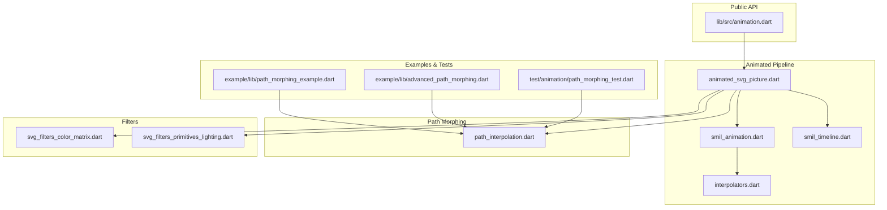
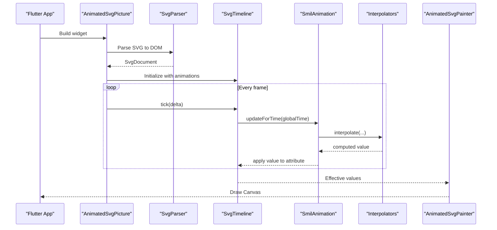
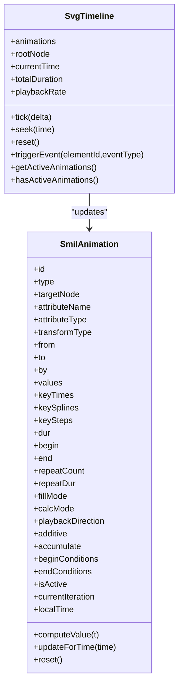
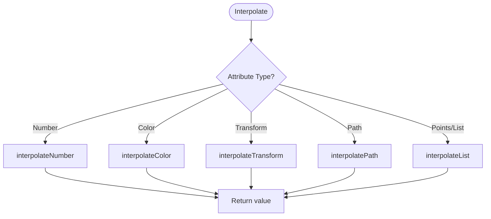
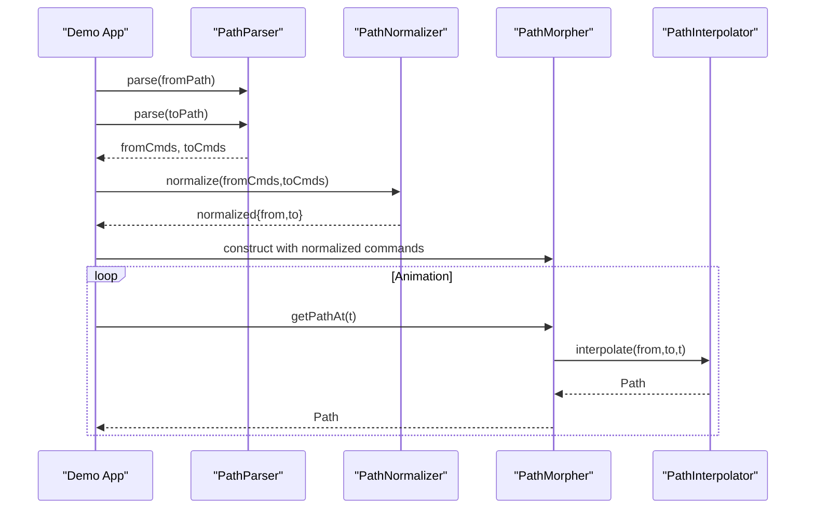
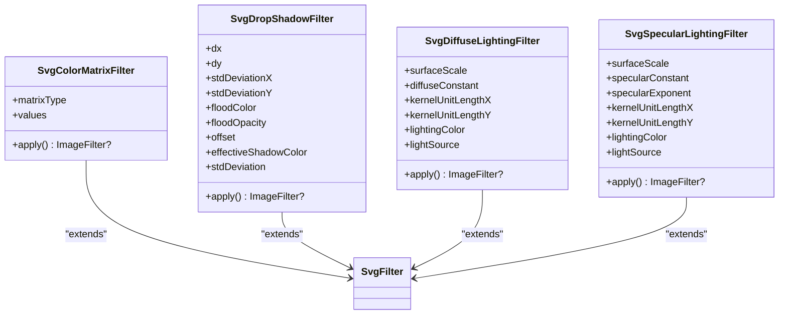
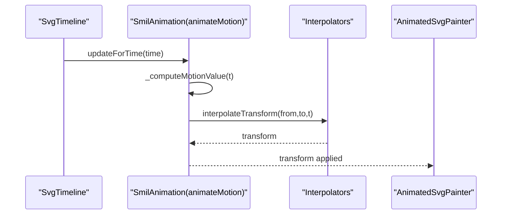
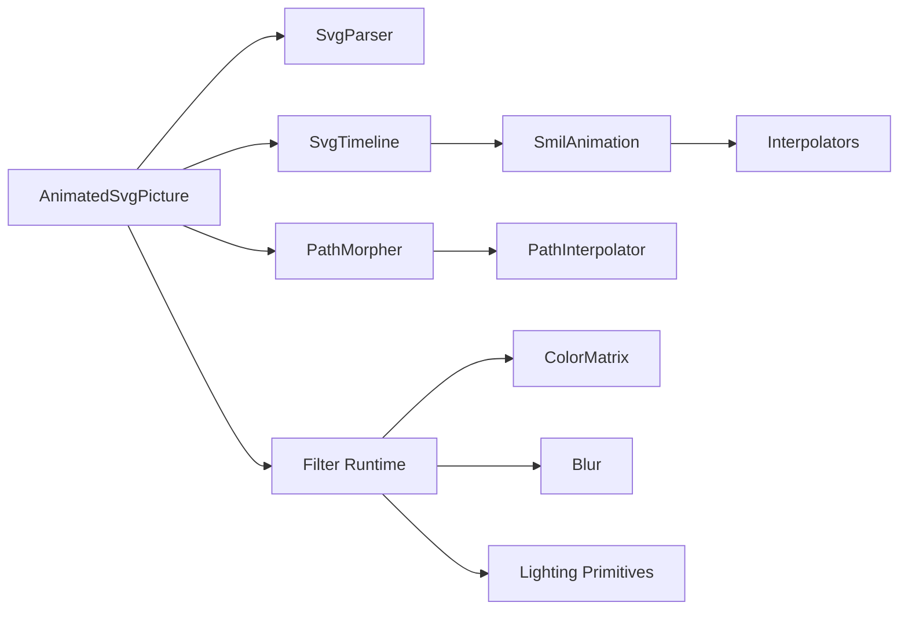

# Advanced Animation Features

<cite>
**Referenced Files in This Document**
- [ANIMATION.md](file://ANIMATION.md)
- [ARCHITECTURE.md](file://ARCHITECTURE.md)
- [lib/src/animation.dart](file://lib/src/animation.dart)
- [lib/src/animation/animated_svg_picture.dart](file://lib/src/animation/animated_svg_picture.dart)
- [lib/src/animation/smil/smil_animation.dart](file://lib/src/animation/smil/smil_animation.dart)
- [lib/src/animation/smil/smil_timeline.dart](file://lib/src/animation/smil/smil_timeline.dart)
- [lib/src/animation/smil/interpolators.dart](file://lib/src/animation/smil/interpolators.dart)
- [lib/src/animation/path_interpolation.dart](file://lib/src/animation/path_interpolation.dart)
- [lib/src/animation/svg_filters_color_matrix.dart](file://lib/src/animation/svg_filters_color_matrix.dart)
- [lib/src/animation/svg_filters_primitives_lighting.dart](file://lib/src/animation/svg_filters_primitives_lighting.dart)
- [example/lib/advanced_path_morphing.dart](file://example/lib/advanced_path_morphing.dart)
- [example/lib/path_morphing_example.dart](file://example/lib/path_morphing_example.dart)
- [test/animation/path_morphing_test.dart](file://test/animation/path_morphing_test.dart)
</cite>

## Table of Contents
1. [Introduction](#introduction)
2. [Project Structure](#project-structure)
3. [Core Components](#core-components)
4. [Architecture Overview](#architecture-overview)
5. [Detailed Component Analysis](#detailed-component-analysis)
6. [Dependency Analysis](#dependency-analysis)
7. [Performance Considerations](#performance-considerations)
8. [Troubleshooting Guide](#troubleshooting-guide)
9. [Conclusion](#conclusion)
10. [Appendices](#appendices)

## Introduction
This document explains advanced animation features implemented in the codebase, focusing on:
- SVG filter animation support and runtime composition
- Color matrix transformations and blur effects
- Lighting primitives and their current baseline behavior
- Path morphing capabilities, shape interpolation, and motion animation techniques
- Advanced animation combinations, performance optimization strategies, and debugging approaches
- Known limitations, workarounds, and best practices

The implementation targets Flutter via a dedicated animated pipeline that preserves DOM structure and supports SMIL/CSS animations, plus a specialized path morphing and filter system.

## Project Structure
The animation system is organized into:
- Public exports and entry points
- SMIL engine for time management, parsing, and interpolation
- Path morphing utilities for shape interpolation
- Filter runtime for color matrix, blur, and lighting primitives
- Example apps and tests demonstrating advanced scenarios

**Diagram sources**
- [lib/src/animation.dart:1-31](file://lib/src/animation.dart#L1-L31)
- [lib/src/animation/animated_svg_picture.dart:1-359](file://lib/src/animation/animated_svg_picture.dart#L1-L359)
- [lib/src/animation/smil/smil_animation.dart:1-453](file://lib/src/animation/smil/smil_animation.dart#L1-L453)
- [lib/src/animation/smil/smil_timeline.dart:1-256](file://lib/src/animation/smil/smil_timeline.dart#L1-L256)
- [lib/src/animation/smil/interpolators.dart:1-148](file://lib/src/animation/smil/interpolators.dart#L1-L148)
- [lib/src/animation/path_interpolation.dart:1-96](file://lib/src/animation/path_interpolation.dart#L1-L96)
- [lib/src/animation/svg_filters_color_matrix.dart:1-202](file://lib/src/animation/svg_filters_color_matrix.dart#L1-L202)
- [lib/src/animation/svg_filters_primitives_lighting.dart:1-125](file://lib/src/animation/svg_filters_primitives_lighting.dart#L1-L125)
- [example/lib/path_morphing_example.dart:1-198](file://example/lib/path_morphing_example.dart#L1-L198)
- [example/lib/advanced_path_morphing.dart:1-317](file://example/lib/advanced_path_morphing.dart#L1-L317)
- [test/animation/path_morphing_test.dart:1-431](file://test/animation/path_morphing_test.dart#L1-L431)

**Section sources**
- [lib/src/animation.dart:1-31](file://lib/src/animation.dart#L1-L31)
- [ARCHITECTURE.md:236-281](file://ARCHITECTURE.md#L236-L281)

## Core Components
- AnimatedSvgPicture: Widget that parses SVG, extracts SMIL animations, manages timelines, and renders via CustomPainter.
- SmilAnimation: Encapsulates SMIL animation semantics (timing, calcMode, values/keyTimes, additive/accumulate).
- SvgTimeline: Manages global time, playback rate, begin/end conditions, and event-driven activation.
- Interpolators: Provides typed interpolation for numbers, colors, transforms, paths, and lists.
- PathInterpolator: Smoothly interpolates between normalized SVG path command sequences.
- Filter runtime: Supports color matrix, blur, and lighting primitives with baseline behavior.

**Section sources**
- [lib/src/animation/animated_svg_picture.dart:108-359](file://lib/src/animation/animated_svg_picture.dart#L108-L359)
- [lib/src/animation/smil/smil_animation.dart:80-453](file://lib/src/animation/smil/smil_animation.dart#L80-L453)
- [lib/src/animation/smil/smil_timeline.dart:21-256](file://lib/src/animation/smil/smil_timeline.dart#L21-L256)
- [lib/src/animation/smil/interpolators.dart:14-148](file://lib/src/animation/smil/interpolators.dart#L14-L148)
- [lib/src/animation/path_interpolation.dart:15-96](file://lib/src/animation/path_interpolation.dart#L15-L96)
- [lib/src/animation/svg_filters_color_matrix.dart:56-202](file://lib/src/animation/svg_filters_color_matrix.dart#L56-L202)
- [lib/src/animation/svg_filters_primitives_lighting.dart:52-125](file://lib/src/animation/svg_filters_primitives_lighting.dart#L52-L125)

## Architecture Overview
The animated pipeline separates concerns across parsing, animation extraction, timeline management, and rendering. It preserves DOM for SMIL support and provides a CustomPainter-based renderer.

**Diagram sources**
- [lib/src/animation/animated_svg_picture.dart:166-295](file://lib/src/animation/animated_svg_picture.dart#L166-L295)
- [lib/src/animation/smil/smil_timeline.dart:79-98](file://lib/src/animation/smil/smil_timeline.dart#L79-L98)
- [lib/src/animation/smil/smil_animation.dart:367-431](file://lib/src/animation/smil/smil_animation.dart#L367-L431)
- [lib/src/animation/smil/interpolators.dart:18-42](file://lib/src/animation/smil/interpolators.dart#L18-L42)

**Section sources**
- [ARCHITECTURE.md:146-193](file://ARCHITECTURE.md#L146-L193)

## Detailed Component Analysis

### SMIL Animation Engine
- Types: animate, animateTransform, animateMotion, set, animateColor
- Timing: begin, end, dur, repeatCount/repeatDur, fill modes
- Interpolation: calcMode (linear, discrete, spline, paced), keySplines/steps
- Playback direction and additive/accumulate semantics
- Event-based activation and syncbase timing resolution

**Diagram sources**
- [lib/src/animation/smil/smil_animation.dart:80-453](file://lib/src/animation/smil/smil_animation.dart#L80-L453)
- [lib/src/animation/smil/smil_timeline.dart:21-256](file://lib/src/animation/smil/smil_timeline.dart#L21-L256)

**Section sources**
- [lib/src/animation/smil/smil_animation.dart:13-77](file://lib/src/animation/smil/smil_animation.dart#L13-L77)
- [lib/src/animation/smil/smil_timeline.dart:13-61](file://lib/src/animation/smil/smil_timeline.dart#L13-L61)

### Interpolation System
- Numbers, colors, transforms, paths, points/lists
- Additive arithmetic for numbers and lists
- Path interpolation via normalized cubic Beziers

**Diagram sources**
- [lib/src/animation/smil/interpolators.dart:18-146](file://lib/src/animation/smil/interpolators.dart#L18-L146)

**Section sources**
- [lib/src/animation/smil/interpolators.dart:14-148](file://lib/src/animation/smil/interpolators.dart#L14-L148)

### Path Morphing
- Normalization converts paths to equivalent cubic Bezier sequences
- Interpolator blends normalized command lists
- Example apps demonstrate shape transitions and real-time sliders

**Diagram sources**
- [example/lib/path_morphing_example.dart:48-67](file://example/lib/path_morphing_example.dart#L48-L67)
- [example/lib/advanced_path_morphing.dart:94-108](file://example/lib/advanced_path_morphing.dart#L94-L108)
- [lib/src/animation/path_interpolation.dart:26-65](file://lib/src/animation/path_interpolation.dart#L26-L65)

**Section sources**
- [lib/src/animation/path_interpolation.dart:15-96](file://lib/src/animation/path_interpolation.dart#L15-L96)
- [example/lib/path_morphing_example.dart:27-168](file://example/lib/path_morphing_example.dart#L27-L168)
- [example/lib/advanced_path_morphing.dart:68-283](file://example/lib/advanced_path_morphing.dart#L68-L283)
- [test/animation/path_morphing_test.dart:1-431](file://test/animation/path_morphing_test.dart#L1-L431)

### Filter Runtime and Effects
- Color Matrix: matrix, saturate, hueRotate, luminanceToAlpha
- Blur: Gaussian blur via ImageFilter
- Lighting: Diffuse/specular primitives store parameters; baseline behavior acts as pass-through

**Diagram sources**
- [lib/src/animation/svg_filters_color_matrix.dart:56-202](file://lib/src/animation/svg_filters_color_matrix.dart#L56-L202)
- [lib/src/animation/svg_filters_primitives_lighting.dart:52-125](file://lib/src/animation/svg_filters_primitives_lighting.dart#L52-L125)

**Section sources**
- [lib/src/animation/svg_filters_color_matrix.dart:56-202](file://lib/src/animation/svg_filters_color_matrix.dart#L56-L202)
- [lib/src/animation/svg_filters_primitives_lighting.dart:52-125](file://lib/src/animation/svg_filters_primitives_lighting.dart#L52-L125)

### Motion Animation Techniques
- animateMotion: path-based movement with optional rotate modes
- KeyPoints and keyTimes enable variable-speed motion along paths
- Integration with SMIL timeline and transform interpolation

**Diagram sources**
- [lib/src/animation/smil/smil_animation.dart:320-365](file://lib/src/animation/smil/smil_animation.dart#L320-L365)
- [lib/src/animation/smil/interpolators.dart:113-116](file://lib/src/animation/smil/interpolators.dart#L113-L116)

**Section sources**
- [lib/src/animation/smil/smil_animation.dart:320-365](file://lib/src/animation/smil/smil_animation.dart#L320-L365)

## Dependency Analysis
- AnimatedSvgPicture depends on SvgParser, SmilParser, SvgTimeline, and AnimatedSvgPainter
- SmilAnimation relies on Interpolators and DistanceCalculator for paced mode
- Path morphing depends on PathParser, PathNormalizer, and PathInterpolator
- Filters depend on Flutter’s ui.ImageFilter and color matrices

**Diagram sources**
- [lib/src/animation/animated_svg_picture.dart:1-359](file://lib/src/animation/animated_svg_picture.dart#L1-L359)
- [lib/src/animation/smil/smil_animation.dart:1-453](file://lib/src/animation/smil/smil_animation.dart#L1-L453)
- [lib/src/animation/smil/interpolators.dart:1-148](file://lib/src/animation/smil/interpolators.dart#L1-L148)
- [lib/src/animation/path_interpolation.dart:1-96](file://lib/src/animation/path_interpolation.dart#L1-L96)
- [lib/src/animation/svg_filters_color_matrix.dart:1-202](file://lib/src/animation/svg_filters_color_matrix.dart#L1-L202)
- [lib/src/animation/svg_filters_primitives_lighting.dart:1-125](file://lib/src/animation/svg_filters_primitives_lighting.dart#L1-L125)

**Section sources**
- [ARCHITECTURE.md:236-281](file://ARCHITECTURE.md#L236-L281)

## Performance Considerations
- Static subtree caching: reuse Picture for nodes without animations
- Dirty tracking: render only changed subtrees
- Path optimization: normalize once, reuse Path objects, reset instead of recreate
- Future optimizations: layer caching, GPU-accelerated morphing, reduced allocations

Practical tips:
- Prefer normalized paths for repeated morphing to avoid repeated normalization
- Use additive/accumulate judiciously; they increase computation per iteration
- Limit simultaneous complex animations on the same subtree
- Use playbackRate to throttle expensive scenes

**Section sources**
- [ARCHITECTURE.md:174-193](file://ARCHITECTURE.md#L174-L193)

## Troubleshooting Guide
Common issues and resolutions:
- Path morphing fails due to incompatible structures
  - Ensure paths are normalized prior to interpolation
  - Verify equal-length normalized command lists
- Invalid SMIL timing or values
  - Confirm keyTimes length matches values for spline/discrete modes
  - For paced mode, ensure values are interpolable; otherwise fallback occurs
- Event-based animations not triggering
  - Verify event keys and element IDs
  - Check resolved begin times and syncbase conditions
- Filter effects not visible
  - Some lighting primitives act as pass-through until full shading is implemented
  - Confirm color matrix dimensions and values validity

Diagnostic utilities:
- AnimatedSvgPicture exposes trace callbacks and frame tick logging for detailed runtime insights
- Use test suites to validate normalization and interpolation correctness

**Section sources**
- [lib/src/animation/animated_svg_picture.dart:52-86](file://lib/src/animation/animated_svg_picture.dart#L52-L86)
- [lib/src/animation/smil/smil_animation.dart:110-130](file://lib/src/animation/smil/smil_animation.dart#L110-L130)
- [test/animation/path_morphing_test.dart:136-184](file://test/animation/path_morphing_test.dart#L136-L184)

## Conclusion
The codebase delivers a robust animated SVG pipeline with:
- Full SMIL/CSS animation support and precise timing
- Advanced interpolation for numbers, colors, transforms, paths, and lists
- Practical path morphing with normalization and morphers
- Filter runtime covering color matrix, blur, and lighting primitives
- Strong performance strategies and extensible architecture

Adopt the examples and tests as references for building complex, performant animations while adhering to normalization and interpolation constraints.

## Appendices

### Feature Summary and Status
- SMIL elements: animate, animateTransform, animateMotion, set, animateColor
- CSS animations: parsing and conversion to SMIL with timing and direction
- Path morphing: normalized cubic Bezier interpolation
- Filters: color matrix, blur, lighting primitives (baseline pass-through)

**Section sources**
- [ANIMATION.md:21-66](file://ANIMATION.md#L21-L66)