# Advanced Animation Features

<cite>
**Referenced Files in This Document**
- [ANIMATION.md](file://ANIMATION.md)
- [ARCHITECTURE.md](file://ARCHITECTURE.md)
- [lib/src/animation.dart](file://lib/src/animation.dart)
- [lib/src/animation/animated_svg_picture.dart](file://lib/src/animation/animated_svg_picture.dart)
- [lib/src/animation/smil/smil_animation.dart](file://lib/src/animation/smil/smil_animation.dart)
- [lib/src/animation/smil/smil_timeline.dart](file://lib/src/animation/smil/smil_timeline.dart)
- [lib/src/animation/smil/interpolators.dart](file://lib/src/animation/smil/interpolators.dart)
- [lib/src/animation/path_interpolation.dart](file://lib/src/animation/path_interpolation.dart)
- [lib/src/animation/svg_filters_color_matrix.dart](file://lib/src/animation/svg_filters_color_matrix.dart)
- [lib/src/animation/svg_filters_primitives_lighting.dart](file://lib/src/animation/svg_filters_primitives_lighting.dart)
- [lib/src/animation/animated_svg_painter.dart](file://lib/src/animation/animated_svg_painter.dart)
- [lib/src/animation/animated_svg_painter_text_style.dart](file://lib/src/animation/animated_svg_painter_text_style.dart)
- [lib/src/animation/animated_svg_painter_text_paint.dart](file://lib/src/animation/animated_svg_painter_text_paint.dart)
- [lib/src/animation/css_cascade.dart](file://lib/src/animation/css_cascade.dart)
- [lib/src/animation/css_selectors.dart](file://lib/src/animation/css_selectors.dart)
- [lib/src/animation/css_variables_calc.dart](file://lib/src/animation/css_variables_calc.dart)
- [lib/src/animation/css_shorthand_expansion.dart](file://lib/src/animation/css_shorthand_expansion.dart)
- [lib/src/animation/css_shorthand_expansion_animation.dart](file://lib/src/animation/css_shorthand_expansion_animation.dart)
- [lib/src/animation/css_shorthand_expansion_font.dart](file://lib/src/animation/css_shorthand_expansion_font.dart)
- [lib/src/animation/css_shorthand_expansion_box.dart](file://lib/src/animation/css_shorthand_expansion_box.dart)
- [lib/src/animation/transform_3d.dart](file://lib/src/animation/transform_3d.dart)
- [lib/src/animation/svg_dom.dart](file://lib/src/animation/svg_dom.dart)
- [lib/src/animation/css_animations.dart](file://lib/src/animation/css_animations.dart)
- [lib/src/animation/css_animations_parser.dart](file://lib/src/animation/css_animations_parser.dart)
- [lib/src/animation/css_to_smil_converter_core.dart](file://lib/src/animation/css_to_smil_converter_core.dart)
- [lib/src/animation/smil/smil_parser_animation_parsing.dart](file://lib/src/animation/smil/smil_parser_animation_parsing.dart)
- [lib/src/animation/svg_parser_constants.dart](file://lib/src/animation/svg_parser_constants.dart)
- [lib/src/animation/animated_svg_painter_gradients.dart](file://lib/src/animation/animated_svg_painter_gradients.dart)
- [lib/src/animation/animated_svg_painter_gradients_resolver.dart](file://lib/src/animation/animated_svg_painter_gradients_resolver.dart)
- [lib/src/animation/animated_svg_painter_gradients_values.dart](file://lib/src/animation/animated_svg_painter_gradients_values.dart)
- [lib/src/animation/animated_svg_painter_clip_mask.dart](file://lib/src/animation/animated_svg_painter_clip_mask.dart)
- [lib/src/animation/animated_svg_painter_clip_mask_advanced.dart](file://lib/src/animation/animated_svg_painter_clip_mask_advanced.dart)
- [lib/src/animation/animated_svg_painter_clip_mask_composition.dart](file://lib/src/animation/animated_svg_painter_clip_mask_composition.dart)
- [lib/src/animation/animated_svg_painter_clip_mask_geometry.dart](file://lib/src/animation/animated_svg_painter_clip_mask_geometry.dart)
- [lib/src/animation/animated_svg_painter_clip_mask_units.dart](file://lib/src/animation/animated_svg_painter_clip_mask_units.dart)
- [example/lib/advanced_path_morphing.dart](file://example/lib/advanced_path_morphing.dart)
- [example/lib/path_morphing_example.dart](file://example/lib/path_morphing_example.dart)
- [test/animation/path_morphing_test.dart](file://test/animation/path_morphing_test.dart)
- [test/animation/css_cascade_specificity_test.dart](file://test/animation/css_cascade_specificity_test.dart)
- [test/animation/css_selectors_combinators_test.dart](file://test/animation/css_selectors_combinators_test.dart)
- [test/animation/css_variables_calc_test.dart](file://test/animation/css_variables_calc_test.dart)
- [test/animation/css_shorthand_expansion_test.dart](file://test/animation/css_shorthand_expansion_test.dart)
- [test/animation/css_3d_transforms_test.dart](file://test/animation/css_3d_transforms_test.dart)
- [test/animation/css_pseudo_classes_view_test.dart](file://test/animation/css_pseudo_classes_view_test.dart)
- [test/animation/font_variant_test.dart](file://test/animation/font_variant_test.dart)
- [test/animation/text_orientation_test.dart](file://test/animation/text_orientation_test.dart)
- [test/animation/text_underline_position_test.dart](file://test/animation/text_underline_position_test.dart)
- [test/animation/text_decoration_thickness_test.dart](file://test/animation/text_decoration_thickness_test.dart)
- [test/animation/text_decoration_style_test.dart](file://test/animation/text_decoration_style_test.dart)
- [test/animation/text_decoration_skip_test.dart](file://test/animation/text_decoration_skip_test.dart)
- [test/animation/text_decoration_skip_ink_test.dart](file://test/animation/text_decoration_skip_ink_test.dart)
- [test/animation/gradient_stop_color_animation_test.dart](file://test/animation/gradient_stop_color_animation_test.dart)
- [test/animation/stop_color_animation_test.dart](file://test/animation/stop_color_animation_test.dart)
- [test/animation/stroke_dash_stop_color_test.dart](file://test/animation/stroke_dash_stop_color_test.dart)
- [test/animation/advanced_clip_mask_test.dart](file://test/animation/advanced_clip_mask_test.dart)
- [test/animation/clip_mask_advanced_composition_test.dart](file://test/animation/clip_mask_advanced_composition_test.dart)
</cite>

## Update Summary
**Changes Made**
- Added comprehensive advanced clipping and masking capabilities with sophisticated composition chain support
- Implemented luminosity-based masking with RGB-to-luminance conversion using precise color matrix formulas
- Added nested composition chains support for clip-path and mask operations
- Integrated edge feathering with anti-aliasing and soft-edge support through Gaussian blur detection
- Enhanced recursive nested clipping/masking support with proper depth limiting
- Added multiple mask composition support with sequential application
- Implemented mask inheritance through group elements
- Enhanced mask bounds computation with stroke width and text decoration considerations
- Added comprehensive testing coverage for advanced clipping and masking scenarios

## Table of Contents
1. [Introduction](#introduction)
2. [Project Structure](#project-structure)
3. [Core Components](#core-components)
4. [Architecture Overview](#architecture-overview)
5. [Detailed Component Analysis](#detailed-component-analysis)
6. [CSS Cascade and Specificity System](#css-cascade-and-specificity-system)
7. [CSS Selector Parsing and Advanced Combinators](#css-selector-parsing-and-advanced-combinators)
8. [CSS Pseudo-Class State Management](#css-pseudo-class-state-management)
9. [Enhanced CSS Shorthand Property Expansion System](#enhanced-css-shorthand-property-expansion-system)
10. [Stop-Color Animation Support for Gradient Elements](#stop-color-animation-support-for-gradient-elements)
11. [Advanced Clipping and Masking System](#advanced-clipping-and-masking-system)
12. [Custom Properties and Calc() Function Support](#custom-properties-and-calcc-function-support)
13. [3D Transform Capabilities](#3d-transform-capabilities)
14. [Performance Optimization Through Rendering Cache](#performance-optimization-through-rendering-cache)
15. [Text Styling and Typography Features](#text-styling-and-typography-features)
16. [Dependency Analysis](#dependency-analysis)
17. [Performance Considerations](#performance-considerations)
18. [Troubleshooting Guide](#troubleshooting-guide)
19. [Conclusion](#conclusion)
20. [Appendices](#appendices)

## Introduction
This document explains advanced animation features implemented in the codebase, focusing on:
- Comprehensive CSS cascade system with specificity calculation and advanced selector parsing
- CSS pseudo-class support system including :hover, :active, :focus, :first-child, :last-child, :only-child, :empty, :root pseudo-classes
- **Enhanced CSS shorthand property expansion system with dedicated modular components**
- **Comprehensive stop-color animation support for gradient elements with SVGator-compatible patterns**
- **Advanced clipping and masking capabilities with sophisticated composition chain support**
- **Luminosity-based masking with RGB-to-luminance conversion using precise color matrix formulas**
- **Nested composition chains support for clip-path and mask operations**
- **Edge feathering with anti-aliasing and soft-edge support through Gaussian blur detection**
- **Recursive nested clipping/masking support with proper depth limiting**
- **Multiple mask composition support with sequential application**
- **Mask inheritance through group elements**
- **Enhanced mask bounds computation with stroke width and text decoration considerations**
- Custom properties with calc() function support for dynamic styling
- Full 3D transform capabilities including Matrix4x4 operations
- Enhanced rendering cache system for performance optimization
- SVG filter animation support and runtime composition
- Color matrix transformations and blur effects
- Lighting primitives and their current baseline behavior
- Path morphing capabilities, shape interpolation, and motion animation techniques
- Advanced text styling and typography features including underline, overline, line-through, writing-mode, font variants, and advanced CSS text properties
- Advanced animation combinations, performance optimization strategies, and debugging approaches
- Known limitations, workarounds, and best practices

The implementation targets Flutter via a dedicated animated pipeline that preserves DOM structure and supports SMIL/CSS animations, plus a specialized path morphing and filter system with comprehensive text styling capabilities, advanced CSS processing, and performance optimizations.

## Project Structure
The animation system is organized into:
- Public exports and entry points
- SMIL engine for time management, parsing, and interpolation
- Path morphing utilities for shape interpolation
- Filter runtime for color matrix, blur, and lighting primitives
- **Enhanced CSS processing pipeline with modular shorthand expansion system and stop-color animation support**
- **Advanced clipping and masking system with sophisticated composition chain support**
- 3D transform system with Matrix4x4 operations
- Rendering cache system for performance optimization
- Advanced text styling and typography system with CSS property support
- **Gradient animation system with animated stop color support**
- Example apps and tests demonstrating advanced scenarios

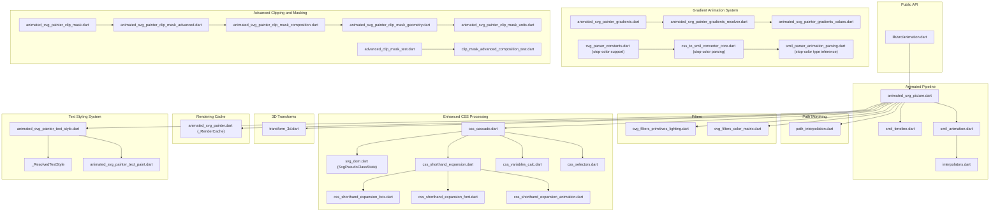

**Diagram sources**
- [lib/src/animation.dart:1-31](file://lib/src/animation.dart#L1-L31)
- [lib/src/animation/animated_svg_picture.dart:1-359](file://lib/src/animation/animated_svg_picture.dart#L1-L359)
- [lib/src/animation/smil/smil_animation.dart:1-453](file://lib/src/animation/smil/smil_animation.dart#L1-L453)
- [lib/src/animation/smil/smil_timeline.dart:1-256](file://lib/src/animation/smil/smil_timeline.dart#L1-L256)
- [lib/src/animation/smil/interpolators.dart:1-148](file://lib/src/animation/smil/interpolators.dart#L1-L148)
- [lib/src/animation/path_interpolation.dart:1-96](file://lib/src/animation/path_interpolation.dart#L1-L96)
- [lib/src/animation/svg_filters_color_matrix.dart:1-202](file://lib/src/animation/svg_filters_color_matrix.dart#L1-L202)
- [lib/src/animation/svg_filters_primitives_lighting.dart:1-125](file://lib/src/animation/svg_filters_primitives_lighting.dart#L1-L125)
- [lib/src/animation/css_cascade.dart:1-663](file://lib/src/animation/css_cascade.dart#L1-L663)
- [lib/src/animation/css_selectors.dart:1-645](file://lib/src/animation/css_selectors.dart#L1-L645)
- [lib/src/animation/css_variables_calc.dart:1-576](file://lib/src/animation/css_variables_calc.dart#L1-L576)
- [lib/src/animation/css_shorthand_expansion.dart:1-95](file://lib/src/animation/css_shorthand_expansion.dart#L1-L95)
- [lib/src/animation/css_shorthand_expansion_animation.dart:1-300](file://lib/src/animation/css_shorthand_expansion_animation.dart#L1-L300)
- [lib/src/animation/css_shorthand_expansion_font.dart:1-206](file://lib/src/animation/css_shorthand_expansion_font.dart#L1-L206)
- [lib/src/animation/css_shorthand_expansion_box.dart:1-404](file://lib/src/animation/css_shorthand_expansion_box.dart#L1-L404)
- [lib/src/animation/transform_3d.dart:1-400](file://lib/src/animation/transform_3d.dart#L1-L400)
- [lib/src/animation/svg_dom.dart:300-369](file://lib/src/animation/svg_dom.dart#L300-L369)
- [lib/src/animation/animated_svg_painter.dart:41-130](file://lib/src/animation/animated_svg_painter.dart#L41-L130)
- [lib/src/animation/animated_svg_painter_text_style.dart:1-1046](file://lib/src/animation/animated_svg_painter_text_style.dart#L1-L1046)
- [lib/src/animation/animated_svg_painter_text_paint.dart:1-594](file://lib/src/animation/animated_svg_painter_text_paint.dart#L1-L594)
- [lib/src/animation/animated_svg_painter.dart:258-460](file://lib/src/animation/animated_svg_painter.dart#L258-L460)
- [lib/src/animation/animated_svg_painter_gradients.dart:1-190](file://lib/src/animation/animated_svg_painter_gradients.dart#L1-L190)
- [lib/src/animation/animated_svg_painter_gradients_resolver.dart:1-157](file://lib/src/animation/animated_svg_painter_gradients_resolver.dart#L1-L157)
- [lib/src/animation/animated_svg_painter_gradients_values.dart:1-313](file://lib/src/animation/animated_svg_painter_gradients_values.dart#L1-L313)
- [lib/src/animation/svg_parser_constants.dart:1-47](file://lib/src/animation/svg_parser_constants.dart#L1-L47)
- [lib/src/animation/css_to_smil_converter_core.dart:1-277](file://lib/src/animation/css_to_smil_converter_core.dart#L1-L277)
- [lib/src/animation/smil/smil_parser_animation_parsing.dart:1-451](file://lib/src/animation/smil/smil_parser_animation_parsing.dart#L1-L451)
- [lib/src/animation/animated_svg_painter_clip_mask.dart:1-279](file://lib/src/animation/animated_svg_painter_clip_mask.dart#L1-L279)
- [lib/src/animation/animated_svg_painter_clip_mask_advanced.dart:1-549](file://lib/src/animation/animated_svg_painter_clip_mask_advanced.dart#L1-L549)
- [lib/src/animation/animated_svg_painter_clip_mask_composition.dart:1-571](file://lib/src/animation/animated_svg_painter_clip_mask_composition.dart#L1-L571)
- [lib/src/animation/animated_svg_painter_clip_mask_geometry.dart:1-175](file://lib/src/animation/animated_svg_painter_clip_mask_geometry.dart#L1-L175)
- [lib/src/animation/animated_svg_painter_clip_mask_units.dart:1-157](file://lib/src/animation/animated_svg_painter_clip_mask_units.dart#L1-L157)
- [test/animation/advanced_clip_mask_test.dart:1-766](file://test/animation/advanced_clip_mask_test.dart#L1-L766)
- [test/animation/clip_mask_advanced_composition_test.dart:1-568](file://test/animation/clip_mask_advanced_composition_test.dart#L1-L568)

**Section sources**
- [lib/src/animation.dart:1-31](file://lib/src/animation.dart#L1-L31)
- [ARCHITECTURE.md:236-281](file://ARCHITECTURE.md#L236-L281)

## Core Components
- AnimatedSvgPicture: Widget that parses SVG, extracts SMIL animations, manages timelines, and renders via CustomPainter.
- SmilAnimation: Encapsulates SMIL animation semantics (timing, calcMode, values/keyTimes, additive/accumulate).
- SvgTimeline: Manages global time, playback rate, begin/end conditions, and event-driven activation.
- Interpolators: Provides typed interpolation for numbers, colors, transforms, paths, and lists.
- PathInterpolator: Smoothly interpolates between normalized SVG path command sequences.
- Filter runtime: Supports color matrix, blur, and lighting primitives with baseline behavior.
- CSS Cascade System: Comprehensive CSS processing with specificity calculation, selector parsing, pseudo-class state tracking, and property resolution.
- CSS Pseudo-Class State Manager: Tracks :hover, :active, :focus states and structural pseudo-classes (:first-child, :last-child, :only-child, :empty, :root).
- **Enhanced CSS Shorthand Expansion System: Modular components for animation, font, and box model shorthand properties**
- **Stop-Color Animation System: Comprehensive support for gradient stop element animations with CSS selector targeting**
- **Advanced Clipping and Masking System: Sophisticated composition chain support with luminosity-based masking, nested operations, and edge feathering**
- 3D Transform System: Full Matrix4x4 support for 3D rotations, translations, scaling, and perspective projections.
- Rendering Cache System: Performance optimization through intelligent caching of computed values.
- Text styling system: Comprehensive CSS text property support including underline, overline, line-through, writing-mode, font variants, and advanced typography features.

**Section sources**
- [lib/src/animation/animated_svg_picture.dart:108-359](file://lib/src/animation/animated_svg_picture.dart#L108-L359)
- [lib/src/animation/smil/smil_animation.dart:80-453](file://lib/src/animation/smil/smil_animation.dart#L80-L453)
- [lib/src/animation/smil/smil_timeline.dart:21-256](file://lib/src/animation/smil/smil_timeline.dart#L21-L256)
- [lib/src/animation/smil/interpolators.dart:14-148](file://lib/src/animation/smil/interpolators.dart#L14-L148)
- [lib/src/animation/path_interpolation.dart:15-96](file://lib/src/animation/path_interpolation.dart#L15-L96)
- [lib/src/animation/svg_filters_color_matrix.dart:56-202](file://lib/src/animation/svg_filters_color_matrix.dart#L56-L202)
- [lib/src/animation/svg_filters_primitives_lighting.dart:52-125](file://lib/src/animation/svg_filters_primitives_lighting.dart#L52-L125)
- [lib/src/animation/css_cascade.dart:18-663](file://lib/src/animation/css_cascade.dart#L18-L663)
- [lib/src/animation/svg_dom.dart:300-369](file://lib/src/animation/svg_dom.dart#L300-L369)
- [lib/src/animation/css_shorthand_expansion.dart:1-95](file://lib/src/animation/css_shorthand_expansion.dart#L1-L95)
- [lib/src/animation/css_shorthand_expansion_animation.dart:1-300](file://lib/src/animation/css_shorthand_expansion_animation.dart#L1-L300)
- [lib/src/animation/css_shorthand_expansion_font.dart:1-206](file://lib/src/animation/css_shorthand_expansion_font.dart#L1-L206)
- [lib/src/animation/css_shorthand_expansion_box.dart:1-404](file://lib/src/animation/css_shorthand_expansion_box.dart#L1-L404)
- [lib/src/animation/transform_3d.dart:22-400](file://lib/src/animation/transform_3d.dart#L22-L400)
- [lib/src/animation/animated_svg_painter.dart:41-130](file://lib/src/animation/animated_svg_painter.dart#L41-L130)
- [lib/src/animation/animated_svg_painter_text_style.dart:1-1046](file://lib/src/animation/animated_svg_painter_text_style.dart#L1-L1046)
- [lib/src/animation/animated_svg_painter_text_paint.dart:1-594](file://lib/src/animation/animated_svg_painter_text_paint.dart#L1-L594)
- [lib/src/animation/animated_svg_painter_gradients.dart:1-190](file://lib/src/animation/animated_svg_painter_gradients.dart#L1-L190)
- [lib/src/animation/animated_svg_painter_gradients_resolver.dart:1-157](file://lib/src/animation/animated_svg_painter_gradients_resolver.dart#L1-L157)
- [lib/src/animation/animated_svg_painter_clip_mask.dart:1-279](file://lib/src/animation/animated_svg_painter_clip_mask.dart#L1-L279)
- [lib/src/animation/animated_svg_painter_clip_mask_advanced.dart:1-549](file://lib/src/animation/animated_svg_painter_clip_mask_advanced.dart#L1-L549)
- [lib/src/animation/animated_svg_painter_clip_mask_composition.dart:1-571](file://lib/src/animation/animated_svg_painter_clip_mask_composition.dart#L1-L571)

## Architecture Overview
The animated pipeline separates concerns across parsing, CSS processing, animation extraction, timeline management, and rendering. It preserves DOM for SMIL support and provides a CustomPainter-based renderer with comprehensive text styling capabilities, advanced CSS processing with modular shorthand expansion, and performance optimizations through intelligent caching.

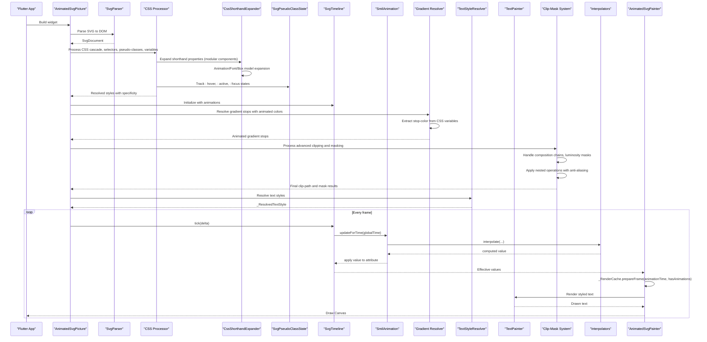

**Diagram sources**
- [lib/src/animation/animated_svg_picture.dart:166-295](file://lib/src/animation/animated_svg_picture.dart#L166-L295)
- [lib/src/animation/smil/smil_timeline.dart:79-98](file://lib/src/animation/smil/smil_timeline.dart#L79-L98)
- [lib/src/animation/smil/smil_animation.dart:367-431](file://lib/src/animation/smil/smil_animation.dart#L367-L431)
- [lib/src/animation/smil/interpolators.dart:18-42](file://lib/src/animation/smil/interpolators.dart#L18-L42)
- [lib/src/animation/animated_svg_painter_text_style.dart:4-171](file://lib/src/animation/animated_svg_painter_text_style.dart#L4-L171)
- [lib/src/animation/animated_svg_painter_text_paint.dart:407-456](file://lib/src/animation/animated_svg_painter_text_paint.dart#L407-L456)
- [lib/src/animation/animated_svg_painter.dart:177-200](file://lib/src/animation/animated_svg_painter.dart#L177-L200)
- [lib/src/animation/animated_svg_painter_gradients_resolver.dart:69-121](file://lib/src/animation/animated_svg_painter_gradients_resolver.dart#L69-L121)
- [lib/src/animation/animated_svg_painter_clip_mask_composition.dart:18-84](file://lib/src/animation/animated_svg_painter_clip_mask_composition.dart#L18-L84)

**Section sources**
- [ARCHITECTURE.md:146-193](file://ARCHITECTURE.md#L146-L193)

## Detailed Component Analysis

### SMIL Animation Engine
- Types: animate, animateTransform, animateMotion, set, animateColor
- Timing: begin, end, dur, repeatCount/repeatDur, fill modes
- Interpolation: calcMode (linear, discrete, spline, paced), keySplines/steps
- Playback direction and additive/accumulate semantics
- Event-based activation and syncbase timing resolution

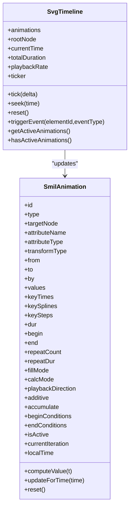

**Diagram sources**
- [lib/src/animation/smil/smil_animation.dart:80-453](file://lib/src/animation/smil/smil_animation.dart#L80-L453)
- [lib/src/animation/smil/smil_timeline.dart:21-256](file://lib/src/animation/smil/smil_timeline.dart#L21-L256)

**Section sources**
- [lib/src/animation/smil/smil_animation.dart:13-77](file://lib/src/animation/smil/smil_animation.dart#L13-L77)
- [lib/src/animation/smil/smil_timeline.dart:13-61](file://lib/src/animation/smil/smil_timeline.dart#L13-L61)

### Interpolation System
- Numbers, colors, transforms, paths, points/lists
- Additive arithmetic for numbers and lists
- Path interpolation via normalized cubic Beziers

**Diagram sources**
- [lib/src/animation/smil/interpolators.dart:18-146](file://lib/src/animation/smil/interpolators.dart#L18-L146)

**Section sources**
- [lib/src/animation/smil/interpolators.dart:14-148](file://lib/src/animation/smil/interpolators.dart#L14-L148)

### Path Morphing
- Normalization converts paths to equivalent cubic Bezier sequences
- Interpolator blends normalized command lists
- Example apps demonstrate shape transitions and real-time sliders

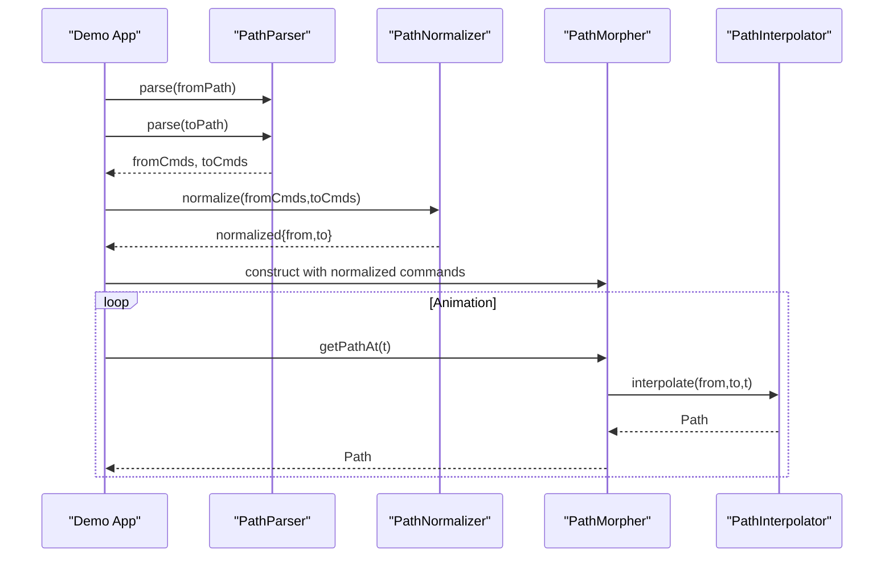

**Diagram sources**
- [example/lib/path_morphing_example.dart:48-67](file://example/lib/path_morphing_example.dart#L48-L67)
- [example/lib/advanced_path_morphing.dart:94-108](file://example/lib/advanced_path_morphing.dart#L94-L108)
- [lib/src/animation/path_interpolation.dart:26-65](file://lib/src/animation/path_interpolation.dart#L26-L65)

**Section sources**
- [lib/src/animation/path_interpolation.dart:15-96](file://lib/src/animation/path_interpolation.dart#L15-L96)
- [example/lib/path_morphing_example.dart:27-168](file://example/lib/path_morphing_example.dart#L27-L168)
- [example/lib/advanced_path_morphing.dart:68-283](file://example/lib/advanced_path_morphing.dart#L68-L283)
- [test/animation/path_morphing_test.dart:1-431](file://test/animation/path_morphing_test.dart#L1-L431)

### Filter Runtime and Effects
- Color Matrix: matrix, saturate, hueRotate, luminanceToAlpha
- Blur: Gaussian blur via ImageFilter
- Lighting: Diffuse/specular primitives store parameters; baseline behavior acts as pass-through

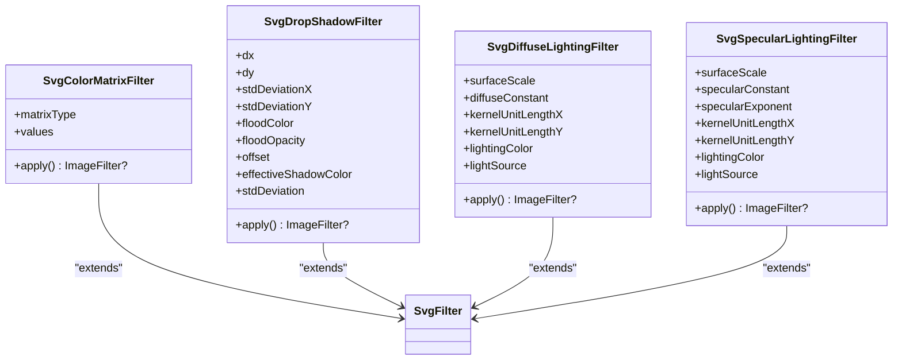

**Diagram sources**
- [lib/src/animation/svg_filters_color_matrix.dart:56-202](file://lib/src/animation/svg_filters_color_matrix.dart#L56-L202)
- [lib/src/animation/svg_filters_primitives_lighting.dart:52-125](file://lib/src/animation/svg_filters_primitives_lighting.dart#L52-L125)

**Section sources**
- [lib/src/animation/svg_filters_color_matrix.dart:56-202](file://lib/src/animation/svg_filters_color_matrix.dart#L56-L202)
- [lib/src/animation/svg_filters_primitives_lighting.dart:52-125](file://lib/src/animation/svg_filters_primitives_lighting.dart#L52-L125)

### Motion Animation Techniques
- animateMotion: path-based movement with optional rotate modes
- KeyPoints and keyTimes enable variable-speed motion along paths
- Integration with SMIL timeline and transform interpolation

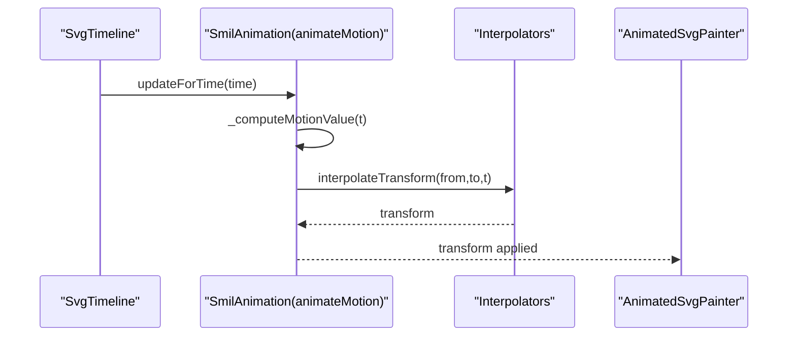

**Diagram sources**
- [lib/src/animation/smil/smil_animation.dart:320-365](file://lib/src/animation/smil/smil_animation.dart#L320-L365)
- [lib/src/animation/smil/interpolators.dart:113-116](file://lib/src/animation/smil/interpolators.dart#L113-L116)

**Section sources**
- [lib/src/animation/smil/smil_animation.dart:320-365](file://lib/src/animation/smil/smil_animation.dart#L320-L365)

## CSS Cascade and Specificity System

### Comprehensive CSS Cascade Implementation
The CSS cascade system implements full CSS cascade rules per the CSS Cascading specification, providing sophisticated property resolution with specificity calculation and inheritance handling.

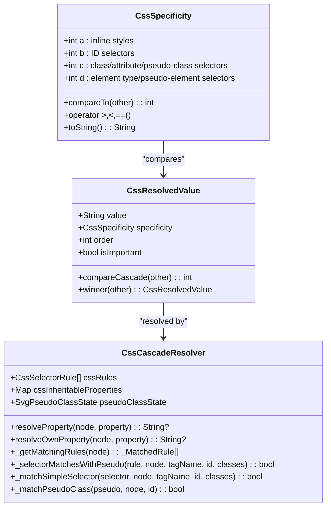

**Diagram sources**
- [lib/src/animation/css_cascade.dart:18-663](file://lib/src/animation/css_cascade.dart#L18-L663)

### Specificity Calculation Algorithm
The specificity calculator follows CSS specifications precisely, calculating specificity as (a, b, c, d) where:
- a: Inline styles (1 if inline, 0 otherwise)
- b: ID selectors count
- c: Class, attribute, pseudo-class selector count
- d: Element type and pseudo-element selector count

**Section sources**
- [lib/src/animation/css_cascade.dart:18-663](file://lib/src/animation/css_cascade.dart#L18-L663)
- [test/animation/css_cascade_specificity_test.dart:47-112](file://test/animation/css_cascade_specificity_test.dart#L47-L112)

## CSS Selector Parsing and Advanced Combinators

### Advanced Selector Parser with Combinators
The CSS selector parser supports all modern CSS selectors including advanced combinators for precise targeting.

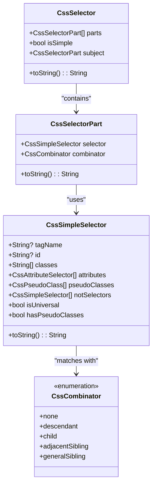

**Diagram sources**
- [lib/src/animation/css_selectors.dart:288-302](file://lib/src/animation/css_selectors.dart#L288-L302)
- [lib/src/animation/css_selectors.dart:264-285](file://lib/src/animation/css_selectors.dart#L264-L285)
- [lib/src/animation/css_selectors.dart:179-236](file://lib/src/animation/css_selectors.dart#L179-L236)
- [lib/src/animation/css_selectors.dart:69-85](file://lib/src/animation/css_selectors.dart#L69-L85)

### Supported Combinators
The system supports all major CSS combinators:
- Descendant combinator (space): `g rect` - matches rect inside g at any depth
- Child combinator (>): `g > rect` - matches direct children only
- Adjacent sibling (+): `rect + circle` - matches circle immediately after rect
- General sibling (~): `rect ~ circle` - matches any circle after rect

**Section sources**
- [lib/src/animation/css_selectors.dart:69-302](file://lib/src/animation/css_selectors.dart#L69-L302)
- [test/animation/css_selectors_combinators_test.dart:170-226](file://test/animation/css_selectors_combinators_test.dart#L170-L226)

## CSS Pseudo-Class State Management

### Comprehensive Pseudo-Class Support System
The CSS pseudo-class system provides full support for interactive and structural pseudo-classes with state tracking and resolution.

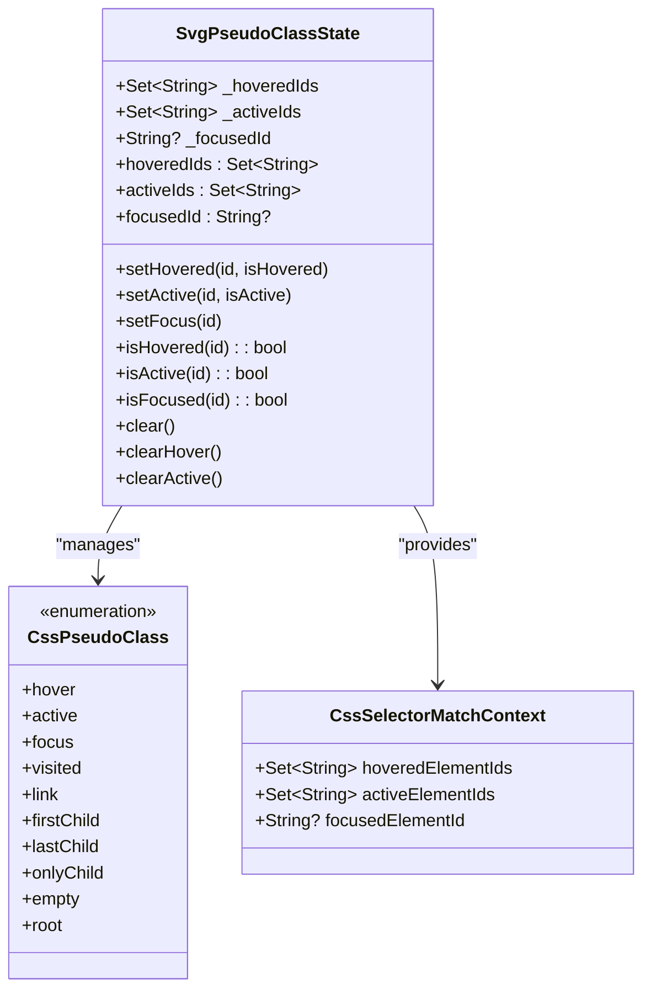

**Diagram sources**
- [lib/src/animation/svg_dom.dart:300-369](file://lib/src/animation/svg_dom.dart#L300-L369)
- [lib/src/animation/css_selectors.dart:3-34](file://lib/src/animation/css_selectors.dart#L3-L34)
- [lib/src/animation/css_selectors.dart:36-51](file://lib/src/animation/css_selectors.dart#L36-L51)

### Supported Pseudo-Classes
The system supports comprehensive pseudo-class functionality:

#### Interactive Pseudo-Classes
- **:hover** - Element is being hovered by pointer
- **:active** - Element is being activated (pressed)
- **:focus** - Element has focus
- **:visited** - Link has been visited (not typically applicable to SVG)
- **:link** - Unvisited link (not typically applicable to SVG)

#### Structural Pseudo-Classes
- **:first-child** - Element is the first child of its parent
- **:last-child** - Element is the last child of its parent
- **:only-child** - Element is the only child of its parent
- **:empty** - Element has no children
- **:root** - Element is the root of the document

#### State Management Features
- **Hover Tracking**: `setHovered(id, true/false)` with automatic cleanup
- **Active State**: `setActive(id, true/false)` for pressed states
- **Focus Management**: `setFocus(id)` with single focus tracking
- **Bulk Operations**: `clear()`, `clearHover()`, `clearActive()` for state cleanup
- **Query Methods**: `isHovered(id)`, `isActive(id)`, `isFocused(id)` for state checking

**Section sources**
- [lib/src/animation/svg_dom.dart:300-369](file://lib/src/animation/svg_dom.dart#L300-L369)
- [lib/src/animation/css_selectors.dart:3-34](file://lib/src/animation/css_selectors.dart#L3-L34)
- [test/animation/css_pseudo_classes_view_test.dart:114-191](file://test/animation/css_pseudo_classes_view_test.dart#L114-L191)

## Enhanced CSS Shorthand Property Expansion System

### Modular Shorthand Expansion Architecture
The CSS shorthand expansion system has been enhanced with dedicated files for different property categories, providing comprehensive CSS property expansion capabilities with improved maintainability and performance.

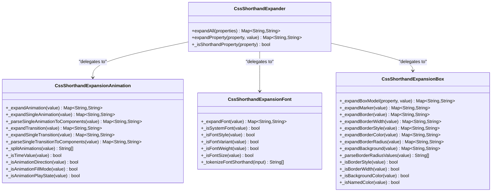

**Diagram sources**
- [lib/src/animation/css_shorthand_expansion.dart:12-94](file://lib/src/animation/css_shorthand_expansion.dart#L12-L94)
- [lib/src/animation/css_shorthand_expansion_animation.dart:19-300](file://lib/src/animation/css_shorthand_expansion_animation.dart#L19-L300)
- [lib/src/animation/css_shorthand_expansion_font.dart:16-206](file://lib/src/animation/css_shorthand_expansion_font.dart#L16-L206)
- [lib/src/animation/css_shorthand_expansion_box.dart:19-404](file://lib/src/animation/css_shorthand_expansion_box.dart#L19-L404)

### Supported Shorthand Properties by Category

#### Animation and Transition Properties
The animation shorthand expansion system provides comprehensive support for CSS animation properties:

**Animation Shorthand Expansion**
- **Format**: `animation: name duration timing-function delay iteration-count direction fill-mode play-state`
- **Multiple Animations**: Proper comma separation with parentheses preservation for timing functions
- **Individual Properties**: Expanded into separate longhand properties for precise control
- **Timing Functions**: Support for cubic-bezier(), steps(), ease, linear, and other standard functions
- **Delay Handling**: Proper parsing of animation-delay values
- **Iteration Count**: Support for numeric values and 'infinite'
- **Direction Control**: 'normal', 'reverse', 'alternate', 'alternate-reverse'
- **Fill Modes**: 'none', 'forwards', 'backwards', 'both'
- **Play States**: 'running', 'paused'

**Transition Shorthand Expansion**
- **Format**: `transition: property duration timing-function delay`
- **Property Names**: Individual property names or 'all'
- **Duration Handling**: Standard CSS time values (ms, s)
- **Timing Functions**: Complete support for all timing functions
- **Delay Support**: Optional transition-delay specification

#### Font Properties
The font shorthand expansion system provides complete CSS font property parsing:

**Font Shorthand Expansion**
- **Format**: `font: [font-style] [font-variant] [font-weight] font-size[/line-height] font-family`
- **System Fonts**: Support for CSS system font keywords (caption, icon, menu, etc.)
- **Font Styles**: 'normal', 'italic', 'oblique' with optional angles
- **Font Variants**: 'normal', 'small-caps'
- **Font Weights**: Numeric weights (100-900) and keywords ('normal', 'bold', 'bolder', 'lighter')
- **Font Sizes**: Absolute sizes (xx-small to xxx-large), relative sizes ('smaller', 'larger'), and unit values
- **Line Heights**: Separate line-height specification with '/' syntax
- **Font Families**: Support for quoted and unquoted font names with comma separation

#### Box Model Properties
The box model shorthand expansion system covers all CSS box properties:

**Margin and Padding Shorthand**
- **Single Value**: Applies to all four sides
- **Two Values**: Vertical | horizontal
- **Three Values**: Top | horizontal | bottom
- **Four Values**: Top | right | bottom | left (with fallback for missing fourth value)

**Border Shorthand Properties**
- **Border**: Expands to border-width, border-style, border-color for all sides
- **Border-width**: Four-value box model expansion
- **Border-style**: Four-value box model expansion with style validation
- **Border-color**: Four-value box model expansion
- **Border-radius**: Support for '/' syntax for horizontal/vertical radii with four-corner expansion

**Background Shorthand**
- **Color Detection**: Automatic recognition of background colors vs images
- **Image Recognition**: Detection of url() patterns for background images
- **Keyword Support**: 'none', 'inherit', 'initial', 'unset' handling
- **Fallback Behavior**: Complex backgrounds fall back to original value for safety

**SVG Marker Properties**
- **Marker Shorthand**: Expands 'marker' to 'marker-start', 'marker-mid', 'marker-end'
- **SVG-Specific**: Tailored for SVG marker properties with URL and 'none' support

**Section sources**
- [lib/src/animation/css_shorthand_expansion.dart:1-95](file://lib/src/animation/css_shorthand_expansion.dart#L1-L95)
- [lib/src/animation/css_shorthand_expansion_animation.dart:1-300](file://lib/src/animation/css_shorthand_expansion_animation.dart#L1-L300)
- [lib/src/animation/css_shorthand_expansion_font.dart:1-206](file://lib/src/animation/css_shorthand_expansion_font.dart#L1-L206)
- [lib/src/animation/css_shorthand_expansion_box.dart:1-404](file://lib/src/animation/css_shorthand_expansion_box.dart#L1-L404)
- [test/animation/css_shorthand_expansion_test.dart:1-619](file://test/animation/css_shorthand_expansion_test.dart#L1-L619)

## Stop-Color Animation Support for Gradient Elements

### Comprehensive Gradient Stop Color Animation System
The codebase now provides comprehensive support for animating gradient stop colors through CSS selectors, enabling sophisticated animation patterns used by popular animation tools like SVGator.

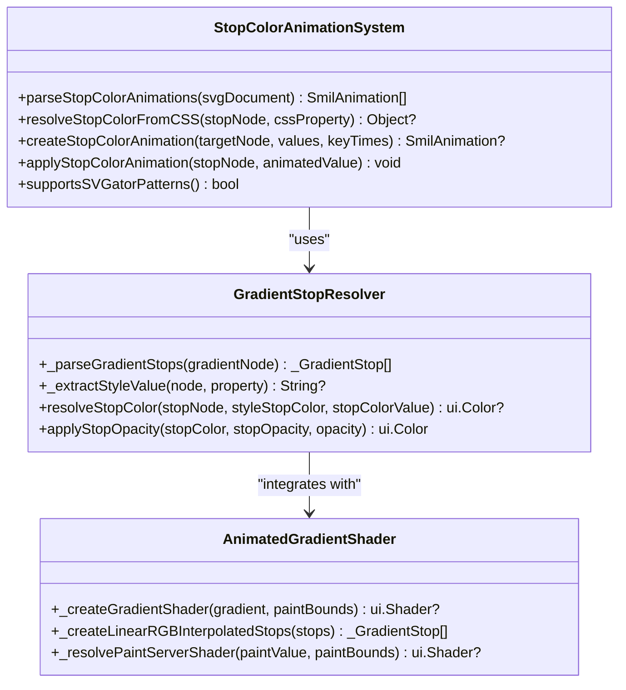

**Diagram sources**
- [lib/src/animation/animated_svg_painter_gradients_resolver.dart:69-121](file://lib/src/animation/animated_svg_painter_gradients_resolver.dart#L69-L121)
- [lib/src/animation/animated_svg_painter_gradients.dart:61-188](file://lib/src/animation/animated_svg_painter_gradients.dart#L61-L188)
- [lib/src/animation/css_to_smil_converter_core.dart:210-250](file://lib/src/animation/css_to_smil_converter_core.dart#L210-L250)

### CSS Attribute Type Inference for Stop-Color
The system automatically recognizes and processes stop-color animations through multiple mechanisms:

**Attribute Type Detection**
- **CSS-to-SMIL Conversion**: CSS stop-color properties are automatically converted to SMIL animations
- **Direct Attribute Parsing**: stop-color attributes are recognized during SMIL parsing
- **Type Inference**: The system infers color attribute type for stop elements

**Supported CSS Patterns**
- **ID Selector Targeting**: `#stop1 { animation: colorAnim 3000ms linear infinite; }`
- **SVGator-Compatible Patterns**: `#eQVNhIKm4qz3-fill-0 { animation: eQVNhIKm4qz3-fill-0__c ... }`
- **Multiple Stop Animations**: Independent animations for each gradient stop element
- **Complex Gradients**: Works with both linear and radial gradients

**Animation Processing Pipeline**
1. **CSS Parsing**: Extract keyframes and animation declarations
2. **Target Resolution**: Identify stop elements via CSS selectors
3. **Value Extraction**: Parse stop-color values from CSS
4. **SMIL Creation**: Convert CSS animations to SMIL format
5. **Interpolation Setup**: Configure color interpolation for gradient stops
6. **Runtime Application**: Apply animated values during rendering

**Section sources**
- [lib/src/animation/css_to_smil_converter_core.dart:210-250](file://lib/src/animation/css_to_smil_converter_core.dart#L210-L250)
- [lib/src/animation/smil/smil_parser_animation_parsing.dart:191-217](file://lib/src/animation/smil/smil_parser_animation_parsing.dart#L191-L217)
- [lib/src/animation/svg_parser_constants.dart:30-36](file://lib/src/animation/svg_parser_constants.dart#L30-L36)
- [lib/src/animation/animated_svg_painter_gradients_resolver.dart:69-121](file://lib/src/animation/animated_svg_painter_gradients_resolver.dart#L69-L121)
- [test/animation/gradient_stop_color_animation_test.dart:14-206](file://test/animation/gradient_stop_color_animation_test.dart#L14-L206)
- [test/animation/stop_color_animation_test.dart:10-433](file://test/animation/stop_color_animation_test.dart#L10-L433)
- [test/animation/stroke_dash_stop_color_test.dart:115-179](file://test/animation/stroke_dash_stop_color_test.dart#L115-L179)

### SVGator-Compatible Animation Patterns
The system fully supports the animation patterns commonly used by SVGator and similar animation tools:

**Pattern Recognition**
- **Hierarchical ID Structure**: `#eQVNhIKm4qz3-fill-0` for gradient stops
- **Keyframe Naming Convention**: `#elementId { animation: elementId__c ... }`
- **Multiple Stop Coordination**: Independent animations for each gradient stop
- **Complex Gradient Support**: Works with userSpaceOnUse gradients and transforms

**Real-World Usage Examples**
The system has been tested with patterns from the astronaut helmet example, supporting:
- Multiple gradient stops with independent animations
- Complex radial gradients with userSpaceOnUse coordinates
- Gradient transforms and focal points
- Real-time color interpolation between animated values

**Section sources**
- [test/animation/gradient_stop_color_animation_test.dart:108-148](file://test/animation/gradient_stop_color_animation_test.dart#L108-L148)
- [test/animation/stop_color_animation_test.dart:357-395](file://test/animation/stop_color_animation_test.dart#L357-L395)
- [test/animation/stroke_dash_stop_color_test.dart:331-365](file://test/animation/stroke_dash_stop_color_test.dart#L331-L365)

### Enhanced Gradient Shader Creation with Animated Stop Colors
The gradient shader system has been enhanced to properly handle animated stop colors during shader creation:

**Animated Stop Color Processing**
- **Stop Color Resolution**: Gradient stops now properly resolve animated stop-color values
- **Shader Caching**: Gradient shaders are cached with animated stop color support
- **Linear RGB Interpolation**: Maintains LinearRGB color interpolation for animated gradients
- **User Space OnUse Coordinates**: Supports animated gradients with userSpaceOnUse coordinates and transforms

**Integration Points**
- **Gradient Resolver**: Enhanced to extract animated stop colors from CSS variables and style properties
- **Shader Creation**: Modified to use animated stop colors when creating gradient shaders
- **Paint Server Resolution**: Updated to handle animated gradient fills in url() references

**Section sources**
- [lib/src/animation/animated_svg_painter_gradients_resolver.dart:69-157](file://lib/src/animation/animated_svg_painter_gradients_resolver.dart#L69-L157)
- [lib/src/animation/animated_svg_painter_gradients.dart:31-190](file://lib/src/animation/animated_svg_painter_gradients.dart#L31-L190)
- [lib/src/animation/animated_svg_painter_gradients_values.dart:1-200](file://lib/src/animation/animated_svg_painter_gradients_values.dart#L1-L200)

## Advanced Clipping and Masking System

### Comprehensive Advanced Clipping and Masking Architecture
The codebase now provides sophisticated clipping and masking capabilities with comprehensive support for advanced composition chains, luminosity-based masking, and edge feathering.

```mermaid
classDiagram
class AnimatedSvgPainterClipMaskCompositionExtension {
+applyCompositionChain(canvas, node, useStack, paintContent)
+applyGroupCompositionChain(canvas, groupNode, useStack, paintChildren)
+computeNestedMaskBounds(node, parentMaskNode, useStack)
+buildNestedClipPath(clippedNode, clipPathNode, useStack, depth)
+buildClipPathWithNestedClips(clippedNode, clipPathNode, useStack)
+applyClipPathAntiAliased(canvas, node, useStack, doAntiAlias)
+getClipMaskFeatherRadius(node)
+findInheritedMaskNode(node)
+findInheritedClipNode(node)
}
class AnimatedSvgPainterClipMaskAdvancedExtension {
+parseMaskType(maskNode, maskedNode)
+applyAdvancedMask(canvas, node, useStack, paintContent)
+applyMultipleMasks(canvas, node, useStack, paintContent)
+parseMultipleMaskReferences(maskValue)
+applySequentialMasks(canvas, node, maskIds, useStack, paintContent)
+applyMaskChain(canvas, node, masks, currentIndex, bounds, useStack, paintContent)
+createLuminanceMaskPaint()
+computeMaskBounds(maskedNode, maskNode)
+renderWithMask(canvas, node, maskNode, maskType, maskBounds, useStack, paintContent)
+renderWithAlphaMask(canvas, node, maskNode, maskBounds, useStack, paintContent)
+renderWithLuminanceMask(canvas, node, maskNode, maskBounds, useStack, paintContent)
+paintMaskContent(canvas, maskNode, maskedNode, useStack)
+hasMask(node)
+hasClipPath(node)
+hasMultipleMasks(node)
}
class AnimatedSvgPainterClipMaskGeometryExtension {
+appendClipGeometry(target, node, currentTransform, useStack)
+isUseViewportReferenceTag(tagName)
+isUseReferenceAllowedTag(tagName)
+resolveUseViewportTransform(useNode, referenceNode)
+computeNodeLocalBounds(node)
}
class AnimatedSvgPainterClipMaskUnitsExtension {
+buildMaskUnitsRegionPath(maskedNode, maskNode)
+resolveMaskUserSpaceLength(maskNode, attributeName, horizontal, isSize, defaultRaw)
+resolveMaskUnitsViewportRect()
+parseObjectBoundingBoxValue(rawValue)
}
```

**Diagram sources**
- [lib/src/animation/animated_svg_painter_clip_mask_composition.dart:18-571](file://lib/src/animation/animated_svg_painter_clip_mask_composition.dart#L18-L571)
- [lib/src/animation/animated_svg_painter_clip_mask_advanced.dart:9-549](file://lib/src/animation/animated_svg_painter_clip_mask_advanced.dart#L9-L549)
- [lib/src/animation/animated_svg_painter_clip_mask_geometry.dart:4-175](file://lib/src/animation/animated_svg_painter_clip_mask_geometry.dart#L4-L175)
- [lib/src/animation/animated_svg_painter_clip_mask_units.dart:4-157](file://lib/src/animation/animated_svg_painter_clip_mask_units.dart#L4-L157)

### Sophisticated Composition Chain Support
The system implements proper nesting order per SVG 2 specification:
- **Transforms are applied first** (handled by `_applyTransform`)
- **Clip-path is applied next** (geometric clipping)
- **Mask is applied last** (alpha/luminance masking)

**Supported Composition Patterns**:
- **clip-path inside mask**: Masked element has clip-path → clip first, then mask
- **mask inside clip-path**: Clipped element has mask → apply both
- **Nested clip-paths**: clip-path on element inside another clipped element
- **Nested masks**: mask on element inside another masked element
- **Mixed nesting**: clip → mask → clip chains
- **Mask inheritance through groups**: masks on group elements affect all children

**Section sources**
- [lib/src/animation/animated_svg_painter_clip_mask_composition.dart:18-84](file://lib/src/animation/animated_svg_painter_clip_mask_composition.dart#L18-L84)

### Luminosity-Based Masking with RGB-to-Luminance Conversion
The system provides comprehensive luminosity masking support using precise color matrix formulas:

**Luminance Formula**: `(0.2126 × R) + (0.7152 × G) + (0.0722 × B)`
- **Alpha Channel Preservation**: Original alpha channel is multiplied with calculated luminance
- **Color Matrix Implementation**: Uses Flutter's `ColorFilter.matrix` with 5x4 matrix
- **Blend Mode**: Applies `dstIn` blend mode for proper masking

**Supported Mask Types**:
- **alpha**: Mask opacity from alpha channel (default)
- **luminance**: Mask opacity from luminance (0.2126×R + 0.7152×G + 0.0722×B) × A

**Implementation Details**:
- **Precision**: Uses exact luminance coefficients from SVG specification
- **Performance**: Optimized color matrix operations for real-time rendering
- **Compatibility**: Full compliance with SVG 2 masking standards

**Section sources**
- [lib/src/animation/animated_svg_painter_clip_mask_advanced.dart:3-37](file://lib/src/animation/animated_svg_painter_clip_mask_advanced.dart#L3-L37)
- [lib/src/animation/animated_svg_painter_clip_mask_advanced.dart:246-265](file://lib/src/animation/animated_svg_painter_clip_mask_advanced.dart#L246-L265)

### Nested Composition Chains and Recursive Support
The system provides comprehensive support for nested composition chains with proper depth limiting:

**Nested Clip-Path Support**:
- **Deep Nesting**: Handles clip-path elements that themselves contain clip-path references
- **Intersection Logic**: Combines nested clip paths using path intersection operations
- **Depth Limiting**: Prevents infinite recursion with maximum depth protection (10 levels)

**Nested Mask Support**:
- **Sequential Application**: Multiple masks are applied in sequence using saveLayer operations
- **Intersection Bounds**: Computes combined mask bounds through intersection operations
- **Proper Compositing**: Each mask uses DST_IN blend mode for correct layering

**Recursive Safety**:
- **Infinite Loop Prevention**: Depth tracking prevents recursive clipping/masking loops
- **Use Stack Management**: Tracks referenced elements to prevent circular references
- **Graceful Degradation**: Falls back to single-level operations when recursion detected

**Section sources**
- [lib/src/animation/animated_svg_painter_clip_mask_composition.dart:199-243](file://lib/src/animation/animated_svg_painter_clip_mask_composition.dart#L199-L243)
- [lib/src/animation/animated_svg_painter_clip_mask_composition.dart:145-243](file://lib/src/animation/animated_svg_painter_clip_mask_composition.dart#L145-L243)

### Edge Feathering with Anti-Aliasing and Soft-Edge Support
The system implements sophisticated edge feathering through multiple mechanisms:

**Anti-Aliasing Support**:
- **Default Anti-Aliasing**: All clip-path and mask operations use anti-aliasing by default
- **Smooth Edges**: Improves visual quality by smoothing clip/mask boundaries
- **Canvas Integration**: Leverages Flutter's native anti-aliasing capabilities

**Soft-Edge Detection**:
- **Gaussian Blur Detection**: Automatically detects feGaussianBlur in filter chains
- **Sigma Radius Extraction**: Parses stdDeviation values to determine feathering intensity
- **Dynamic Feathering**: Applies soft edges based on detected blur parameters

**Edge Quality Enhancement**:
- **Path Operations**: Uses `doAntiAlias: true` in all clipPath operations
- **Filter Integration**: Integrates with existing filter system for advanced edge effects
- **Performance Optimization**: Efficient soft-edge computation without performance degradation

**Section sources**
- [lib/src/animation/animated_svg_painter_clip_mask_composition.dart:468-493](file://lib/src/animation/animated_svg_painter_clip_mask_composition.dart#L468-L493)
- [lib/src/animation/animated_svg_painter_clip_mask_composition.dart:498-525](file://lib/src/animation/animated_svg_painter_clip_mask_composition.dart#L498-L525)

### Multiple Mask Composition and Sequential Application
The system supports advanced multiple mask composition with sequential application:

**Multiple Mask Support**:
- **Comma-Separated Syntax**: Supports `mask: url(#mask1), url(#mask2)` syntax
- **Sequential Processing**: Masks are applied in order specified
- **Combined Bounds**: Computes intersection of all mask regions for final bounds

**Sequential Mask Chain**:
- **Save Layer Management**: Uses nested saveLayer operations for proper compositing
- **DST_IN Blend Mode**: Each mask uses destination-in blending for correct layering
- **Recursive Processing**: Handles arbitrary numbers of masks through recursion

**Bounds Computation**:
- **Intersection Logic**: Combines multiple mask bounds using intersection operations
- **Empty Region Detection**: Handles cases where combined masks produce empty regions
- **Safe Scaling**: Prevents issues with very small or degenerate mask regions

**Section sources**
- [lib/src/animation/animated_svg_painter_clip_mask_advanced.dart:88-193](file://lib/src/animation/animated_svg_painter_clip_mask_advanced.dart#L88-L193)
- [lib/src/animation/animated_svg_painter_clip_mask_advanced.dart:196-243](file://lib/src/animation/animated_svg_painter_clip_mask_advanced.dart#L196-L243)

### Mask Inheritance Through Group Elements
The system implements comprehensive mask inheritance through group elements:

**Group Mask Inheritance**:
- **Parent-to-Child Propagation**: Masks on group elements affect all descendants
- **Nested Inheritance**: Supports multiple levels of group nesting with mask propagation
- **Inheritance Chain**: Walks up parent hierarchy to find applicable masks

**Inheritance Resolution**:
- **Top-Down Processing**: Processes group masks before child elements
- **Mask Intersection**: Combines inherited masks with direct masks using intersection logic
- **Proper Bounds**: Computes effective mask bounds considering inheritance

**Group Composition**:
- **Group-Level Clipping**: Groups can have both clip-path and mask applied
- **Child Element Processing**: Children inherit group masks and clipping
- **Nested Group Support**: Handles arbitrarily deep group hierarchies

**Section sources**
- [lib/src/animation/animated_svg_painter_clip_mask_composition.dart:87-151](file://lib/src/animation/animated_svg_painter_clip_mask_composition.dart#L87-L151)
- [lib/src/animation/animated_svg_painter_clip_mask_composition.dart:527-549](file://lib/src/animation/animated_svg_painter_clip_mask_composition.dart#L527-L549)

### Enhanced Mask Bounds Computation
The system provides comprehensive mask bounds computation with stroke width and text decoration considerations:

**Stroke Width Expansion**:
- **Base Bounds**: Computes initial bounds from element geometry
- **Stroke Inflation**: Expands bounds by half of stroke width for proper mask coverage
- **Inheritance**: Inherits stroke properties from parent elements

**Text Element Special Handling**:
- **Text Bounds**: Uses enhanced text bounds computation for accurate mask regions
- **Decoration Expansion**: Expands bounds for underline, overline, and line-through decorations
- **Emphasis Marks**: Accounts for text-emphasis marks placement above/below text

**Group Bounds Computation**:
- **Union Logic**: Computes combined bounds for group elements by unioning child bounds
- **Stroke Inheritance**: Applies stroke width expansion to group bounds
- **Empty Group Handling**: Gracefully handles groups with no visible children

**Section sources**
- [lib/src/animation/animated_svg_painter_clip_mask.dart:184-277](file://lib/src/animation/animated_svg_painter_clip_mask.dart#L184-L277)
- [lib/src/animation/animated_svg_painter_clip_mask_units.dart:1-157](file://lib/src/animation/animated_svg_painter_clip_mask_units.dart#L1-L157)

## Custom Properties and Calc() Function Support

### CSS Custom Properties and Calc() Integration
The system provides comprehensive support for CSS custom properties (variables) and calc() functions, enabling dynamic and flexible styling.

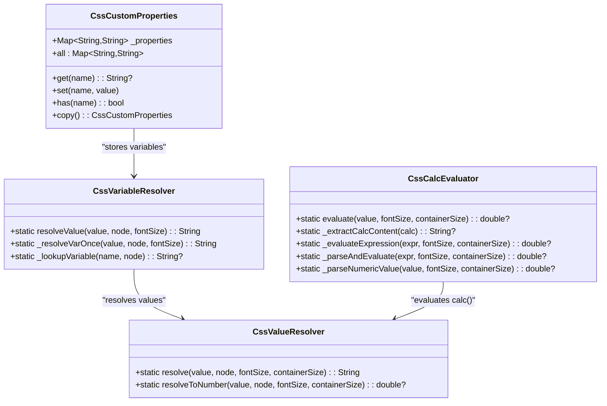

**Diagram sources**
- [lib/src/animation/css_variables_calc.dart:37-154](file://lib/src/animation/css_variables_calc.dart#L37-L154)
- [lib/src/animation/css_variables_calc.dart:156-552](file://lib/src/animation/css_variables_calc.dart#L156-L552)

### Variable Resolution and Calc() Evaluation
The system supports:
- **Variable Resolution**: `var(--color)` with fallback values `var(--color, red)`
- **Inheritance**: Variables inherit through the DOM tree
- **Circular References**: Safe handling with iteration limits
- **Calc() Expressions**: Mathematical expressions with units
- **Unit Conversion**: Automatic conversion between px, em, rem, %, pt, pc, in, cm, mm, q
- **Nested Operations**: Complex nested calc() expressions

**Section sources**
- [lib/src/animation/css_variables_calc.dart:37-576](file://lib/src/animation/css_variables_calc.dart#L37-L576)
- [test/animation/css_variables_calc_test.dart:39-402](file://test/animation/css_variables_calc_test.dart#L39-L402)

## 3D Transform Capabilities

### Full Matrix4x4 Transform System
The 3D transform system provides comprehensive 3D graphics support with Matrix4x4 operations.

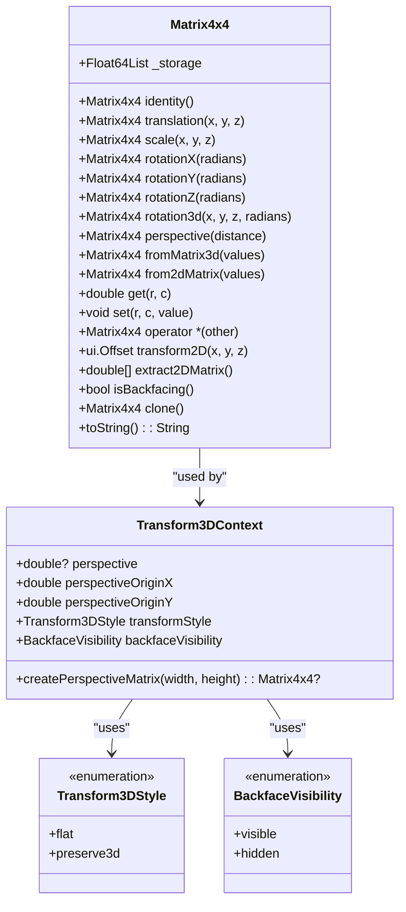

**Diagram sources**
- [lib/src/animation/transform_3d.dart:22-327](file://lib/src/animation/transform_3d.dart#L22-L327)
- [lib/src/animation/transform_3d.dart:333-393](file://lib/src/animation/transform_3d.dart#L333-L393)

### 3D Transform Features
The system supports:
- **Basic Transforms**: Translation, scaling, rotation around X, Y, Z axes
- **Arbitrary Rotation**: `rotate3d(x, y, z, angle)` with normalized axis vectors
- **Perspective Projection**: CSS perspective matrix with configurable distance
- **Matrix Operations**: Full 4x4 matrix multiplication and manipulation
- **2D Extraction**: Automatic extraction of 2D affine transforms from 3D matrices
- **Backface Detection**: `isBackfacing()` for visibility optimization
- **Transform Context**: Complete 3D transform pipeline with perspective and style options

**Section sources**
- [lib/src/animation/transform_3d.dart:22-400](file://lib/src/animation/transform_3d.dart#L22-L400)
- [test/animation/css_3d_transforms_test.dart:48-167](file://test/animation/css_3d_transforms_test.dart#L48-L167)

## Performance Optimization Through Rendering Cache

### Intelligent Rendering Cache System
The rendering cache system provides comprehensive performance optimization through intelligent caching of computed values.

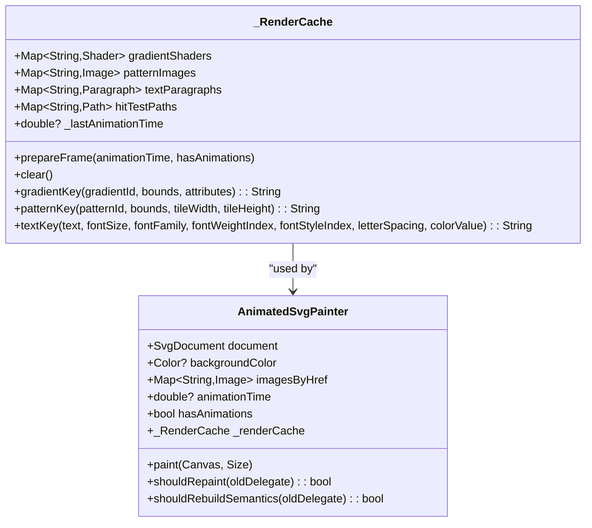

**Diagram sources**
- [lib/src/animation/animated_svg_painter.dart:41-130](file://lib/src/animation/animated_svg_painter.dart#L41-L130)
- [lib/src/animation/animated_svg_painter.dart:139-243](file://lib/src/animation/animated_svg_painter.dart#L139-L243)

### Cache Categories and Invalidation
The system provides four main cache categories with intelligent invalidation:

#### Gradient Shader Cache
- **Purpose**: Cache computed gradient shaders by gradient ID, paint bounds, and attributes
- **Invalidation**: Cleared when animation time changes for animated SVGs
- **Key Generation**: Combines gradient ID, bounds hash, and attribute hash for uniqueness

#### Pattern Image Cache
- **Purpose**: Cache pattern tile images for reuse across frames
- **Invalidation**: Cleared on animation time changes for animated content
- **Key Generation**: Includes pattern ID, bounds, and tile dimensions

#### Text Paragraph Cache
- **Purpose**: Cache Paragraph objects by text content and style properties
- **Invalidation**: Cleared when animation time changes for animated text
- **Key Generation**: Hash-based combination of text content, font properties, and styling

#### Hit-Test Path Cache
- **Purpose**: Cache path geometry for efficient hit-testing operations
- **Invalidation**: Cleared on animation time changes for animated paths
- **Key Generation**: Element ID combined with geometric hash

**Section sources**
- [lib/src/animation/animated_svg_painter.dart:41-130](file://lib/src/animation/animated_svg_painter.dart#L41-L130)
- [CURRENT_STATUS.md:70-77](file://CURRENT_STATUS.md#L70-L77)

## Text Styling and Typography Features

### Comprehensive CSS Text Property Support
The text styling system provides extensive CSS text property support with comprehensive resolution and application capabilities:

#### Core Text Properties
- **Text Decoration**: Underline, overline, and line-through with individual control
- **Writing Mode**: Horizontal and vertical text rendering support
- **Font Variants**: Advanced font feature support including small-caps, titling-caps, and numeric variants
- **Typography Control**: Letter spacing, word spacing, text indentation, and alignment
- **Text Transformation**: Capitalization, uppercase, lowercase, and full-width support
- **Line Breaking**: Advanced line breaking and overflow wrapping control
- **Hyphenation**: Automatic and manual hyphenation support
- **Text Orientation**: Mixed, upright, and sideways text orientation for vertical writing

#### Text Decoration System
The system implements a comprehensive text decoration framework supporting:

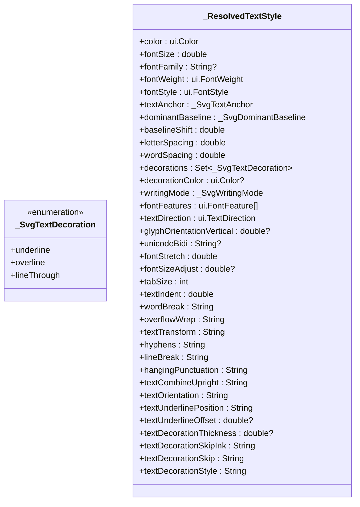

**Diagram sources**
- [lib/src/animation/animated_svg_painter.dart:193-197](file://lib/src/animation/animated_svg_painter.dart#L193-L197)
- [lib/src/animation/animated_svg_painter.dart:258-460](file://lib/src/animation/animated_svg_painter.dart#L258-L460)

#### Advanced Typography Features
- **Font Variant Resolution**: Converts CSS font-variant properties to Flutter FontFeatures
  - Small-caps variants: `small-caps`, `all-small-caps`, `petite-caps`, `all-petite-caps`
  - Stylistic sets: `unicase`, `titling-caps`
  - Numeric formatting: `oldstyle-nums`, `lining-nums`, `tabular-nums`, `proportional-nums`
- **Writing Mode Support**: Comprehensive vertical text rendering with proper glyph orientation
- **Text Decoration Thickness**: Support for custom decoration line thickness with unit handling
- **Text Underline Position**: Advanced underline positioning including multi-value combinations
- **Text Decoration Styles**: Solid, double, dotted, dashed, and wavy decoration line styles
- **Text Decoration Skip**: Control over what elements decorations skip over (objects, spaces, edges)
- **Text Decoration Skip Ink**: Intelligent handling of decorations around glyph ascenders and descenders

#### Text Rendering Architecture
The text rendering system consists of three main components:

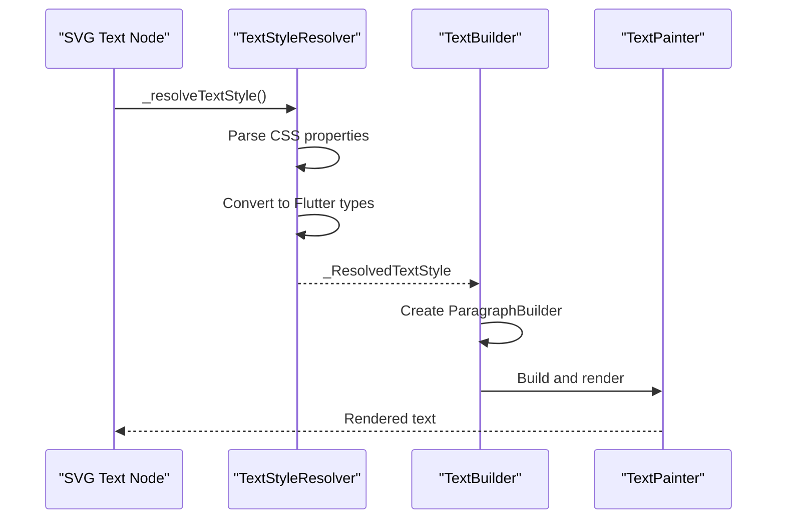

**Diagram sources**
- [lib/src/animation/animated_svg_painter_text_style.dart:4-171](file://lib/src/animation/animated_svg_painter_text_style.dart#L4-L171)
- [lib/src/animation/animated_svg_painter_text_style.dart:769-798](file://lib/src/animation/animated_svg_painter_text_style.dart#L769-L798)
- [lib/src/animation/animated_svg_painter_text_paint.dart:407-456](file://lib/src/animation/animated_svg_painter_text_paint.dart#L407-L456)

**Section sources**
- [lib/src/animation/animated_svg_painter_text_style.dart:1-1046](file://lib/src/animation/animated_svg_painter_text_style.dart#L1-L1046)
- [lib/src/animation/animated_svg_painter_text_paint.dart:400-594](file://lib/src/animation/animated_svg_painter_text_paint.dart#L400-L594)
- [lib/src/animation/animated_svg_painter.dart:193-460](file://lib/src/animation/animated_svg_painter.dart#L193-L460)

## Dependency Analysis
- AnimatedSvgPicture depends on SvgParser, SmilParser, SvgTimeline, CssCascadeResolver, SvgPseudoClassState, and AnimatedSvgPainter
- SmilAnimation relies on Interpolators and DistanceCalculator for paced mode
- Path morphing depends on PathParser, PathNormalizer, and PathInterpolator
- Filters depend on Flutter's ui.ImageFilter and color matrices
- CSS processing depends on CssCascadeResolver, CssSelectorParser, CssVariableResolver, CssCalcEvaluator, and SvgPseudoClassState
- **Enhanced CSS shorthand expansion depends on modular components: CssShorthandExpansionAnimation, CssShorthandExpansionFont, CssShorthandExpansionBox**
- **Stop-color animation system depends on css_to_smil_converter_core, smil_parser_animation_parsing, svg_parser_constants, and animated_svg_painter_gradients**
- **Advanced clipping and masking system depends on animated_svg_painter_clip_mask, animated_svg_painter_clip_mask_advanced, animated_svg_painter_clip_mask_composition, animated_svg_painter_clip_mask_geometry, and animated_svg_painter_clip_mask_units**
- 3D transforms depend on Matrix4x4 and Transform3DContext
- Rendering cache depends on _RenderCache and AnimatedSvgPainter
- Text styling system depends on Flutter's ui.TextDirection, ui.FontFeature, and ui.ParagraphBuilder

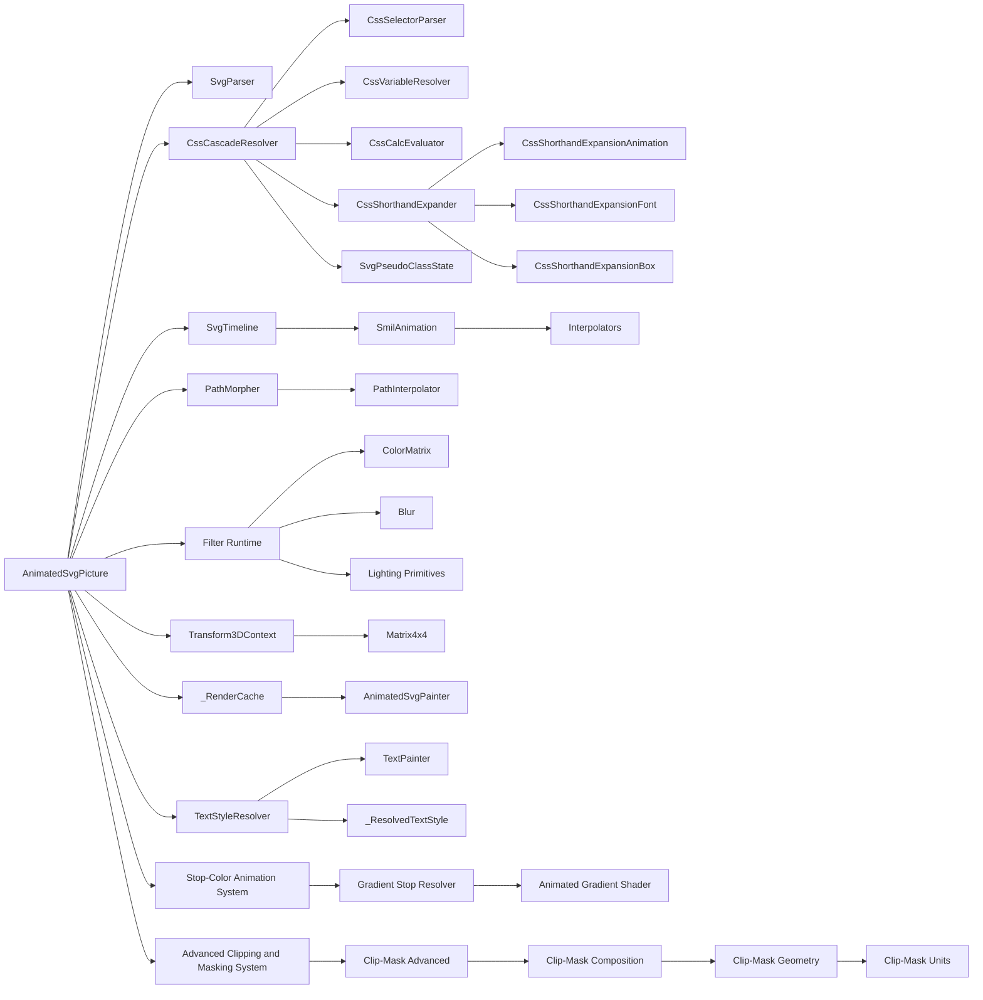

**Diagram sources**
- [lib/src/animation/animated_svg_picture.dart:1-359](file://lib/src/animation/animated_svg_picture.dart#L1-L359)
- [lib/src/animation/smil/smil_animation.dart:1-453](file://lib/src/animation/smil/smil_animation.dart#L1-L453)
- [lib/src/animation/smil/interpolators.dart:1-148](file://lib/src/animation/smil/interpolators.dart#L1-L148)
- [lib/src/animation/path_interpolation.dart:1-96](file://lib/src/animation/path_interpolation.dart#L1-L96)
- [lib/src/animation/svg_filters_color_matrix.dart:1-202](file://lib/src/animation/svg_filters_color_matrix.dart#L1-L202)
- [lib/src/animation/svg_filters_primitives_lighting.dart:1-125](file://lib/src/animation/svg_filters_primitives_lighting.dart#L1-L125)
- [lib/src/animation/css_cascade.dart:1-663](file://lib/src/animation/css_cascade.dart#L1-L663)
- [lib/src/animation/css_selectors.dart:1-645](file://lib/src/animation/css_selectors.dart#L1-L645)
- [lib/src/animation/css_variables_calc.dart:1-576](file://lib/src/animation/css_variables_calc.dart#L1-L576)
- [lib/src/animation/css_shorthand_expansion.dart:1-95](file://lib/src/animation/css_shorthand_expansion.dart#L1-L95)
- [lib/src/animation/css_shorthand_expansion_animation.dart:1-300](file://lib/src/animation/css_shorthand_expansion_animation.dart#L1-L300)
- [lib/src/animation/css_shorthand_expansion_font.dart:1-206](file://lib/src/animation/css_shorthand_expansion_font.dart#L1-L206)
- [lib/src/animation/css_shorthand_expansion_box.dart:1-404](file://lib/src/animation/css_shorthand_expansion_box.dart#L1-L404)
- [lib/src/animation/transform_3d.dart:1-400](file://lib/src/animation/transform_3d.dart#L1-L400)
- [lib/src/animation/svg_dom.dart:300-369](file://lib/src/animation/svg_dom.dart#L300-L369)
- [lib/src/animation/animated_svg_painter.dart:41-130](file://lib/src/animation/animated_svg_painter.dart#L41-L130)
- [lib/src/animation/animated_svg_painter_text_style.dart:1-1046](file://lib/src/animation/animated_svg_painter_text_style.dart#L1-L1046)
- [lib/src/animation/animated_svg_painter_text_paint.dart:1-594](file://lib/src/animation/animated_svg_painter_text_paint.dart#L1-L594)
- [lib/src/animation/animated_svg_painter.dart:258-460](file://lib/src/animation/animated_svg_painter.dart#L258-L460)
- [lib/src/animation/animated_svg_painter_gradients.dart:1-190](file://lib/src/animation/animated_svg_painter_gradients.dart#L1-L190)
- [lib/src/animation/animated_svg_painter_gradients_resolver.dart:1-157](file://lib/src/animation/animated_svg_painter_gradients_resolver.dart#L1-L157)
- [lib/src/animation/animated_svg_painter_clip_mask.dart:1-279](file://lib/src/animation/animated_svg_painter_clip_mask.dart#L1-L279)
- [lib/src/animation/animated_svg_painter_clip_mask_advanced.dart:1-549](file://lib/src/animation/animated_svg_painter_clip_mask_advanced.dart#L1-L549)
- [lib/src/animation/animated_svg_painter_clip_mask_composition.dart:1-571](file://lib/src/animation/animated_svg_painter_clip_mask_composition.dart#L1-L571)
- [lib/src/animation/animated_svg_painter_clip_mask_geometry.dart:1-175](file://lib/src/animation/animated_svg_painter_clip_mask_geometry.dart#L1-L175)
- [lib/src/animation/animated_svg_painter_clip_mask_units.dart:1-157](file://lib/src/animation/animated_svg_painter_clip_mask_units.dart#L1-L157)

**Section sources**
- [ARCHITECTURE.md:236-281](file://ARCHITECTURE.md#L236-L281)

## Performance Considerations
- Static subtree caching: reuse Picture for nodes without animations
- Dirty tracking: render only changed subtrees
- Path optimization: normalize once, reuse Path objects, reset instead of recreate
- Text styling optimization: cache resolved styles, reuse Paragraph objects
- CSS processing optimization: 
  - Rule cache with specificity-based matching
  - Selector parsing with efficient combinator handling
  - Variable resolution with iteration limits
  - **Enhanced shorthand expansion with modular component architecture**
  - Pseudo-class state tracking with minimal overhead
  - **Stop-color animation optimization: efficient CSS-to-SMIL conversion and gradient shader caching**
  - **Advanced clipping and masking optimization: efficient composition chain processing and recursive safety checks**
- 3D transform optimization:
  - Matrix reuse and cloning
  - Perspective matrix caching
  - Backface culling for performance
- **New Rendering Cache Optimization**:
  - Gradient shader caching: Shader objects cached by gradient ID + paint bounds + attributes
  - Pattern image caching: Pattern tile images cached and reused across frames
  - Text paragraph caching: Paragraph objects cached by text content + style properties
  - Hit-test path geometry caching: Path objects cached for repeated hit-testing
  - Smart cache invalidation: Caches cleared when animation time changes for animated SVGs
- Future optimizations: layer caching, GPU-accelerated morphing, reduced allocations

Practical tips:
- Prefer normalized paths for repeated morphing to avoid repeated normalization
- Use additive/accumulate judiciously; they increase computation per iteration
- Limit simultaneous complex animations on the same subtree
- Use playbackRate to throttle expensive scenes
- Cache frequently used text styles to avoid repeated CSS parsing
- Leverage CSS cascade specificity for efficient property resolution
- Use calc() expressions judiciously to avoid excessive recalculation
- Implement proper 3D transform ordering for optimal performance
- **Utilize enhanced shorthand expansion**: Take advantage of modular CSS shorthand components for better performance
- **Leverage rendering cache**: Enable caching for static content, clear caches on animation changes
- **Monitor pseudo-class state**: Efficient state tracking minimizes CSS cascade overhead
- **Optimize stop-color animations**: Use efficient CSS selectors and minimize redundant gradient definitions
- **Cache gradient shaders**: Take advantage of built-in gradient shader caching for complex animated gradients
- **Optimize clipping and masking**: Use efficient composition chains and avoid excessive recursion
- **Use anti-aliasing judiciously**: While beneficial for visual quality, consider performance impact on complex scenes
- **Implement proper bounds computation**: Accurate bounds reduce unnecessary rendering operations

## Troubleshooting Guide
Common issues and resolutions:
- Path morphing fails due to incompatible structures
  - Ensure paths are normalized prior to interpolation
  - Verify equal-length normalized command lists
- Invalid SMIL timing or values
  - Confirm keyTimes length matches values for spline/discrete modes
  - For paced mode, ensure values are interpolable; otherwise fallback occurs
- Event-based animations not triggering
  - Verify event keys and element IDs
  - Check resolved begin times and syncbase conditions
- Filter effects not visible
  - Some lighting primitives act as pass-through until full shading is implemented
  - Confirm color matrix dimensions and values validity
- CSS cascade issues
  - Verify selector specificity calculations
  - Check CSS rule ordering and !important declarations
  - Ensure proper inheritance for inheritable properties
  - **Enhanced shorthand expansion issues**: Verify property names are properly normalized and supported
  - **Modular component conflicts**: Check that shorthand expansion components are properly loaded
- CSS selector matching problems
  - Test selectors with simple patterns first
  - Verify combinator precedence and matching logic
  - **Pseudo-class validation**: Check that pseudo-classes are supported and properly formatted
- Custom property resolution errors
  - Check variable name syntax (--name)
  - Verify fallback values for missing variables
  - Monitor for circular reference detection
- 3D transform issues
  - Verify matrix dimensionality and operations
  - Check perspective distance and origin settings
  - Ensure proper transform order for expected results
- **Enhanced shorthand expansion issues**
  - **Animation shorthand**: Verify comma-separated animation syntax and timing function parentheses
  - **Font shorthand**: Check font property order and system font keyword support
  - **Box model shorthand**: Verify value count and unit compatibility
  - **SVG marker shorthand**: Ensure proper URL format or 'none' keyword usage
  - **Background shorthand**: Check for complex background values that fall back to original
- **Rendering cache issues**
  - Verify cache invalidation on animation changes
  - Check cache key generation for uniqueness
  - Monitor cache hit rates for performance optimization
- Text styling issues
  - Verify CSS property syntax and supported values
  - Check font feature availability in the selected font
  - Ensure proper inheritance from parent elements
  - Validate unit conversions for text-decoration-thickness and similar properties
- **Stop-color animation issues**
  - **CSS selector targeting**: Verify stop elements are properly targeted by CSS selectors
  - **SVGator patterns**: Ensure ID naming conventions match expected patterns
  - **Gradient shader creation**: Check that animated gradient stops are properly resolved
  - **Color interpolation**: Verify stop-color values are correctly parsed and interpolated
  - **CSS variable resolution**: Ensure CSS variables in stop-color values are properly resolved
  - **Animation clearing**: Verify stop-color animations properly clear with remove fill mode
- **Advanced clipping and masking issues**
  - **Composition chain errors**: Verify proper nesting order and avoid infinite recursion
  - **Luminance mask precision**: Check color matrix calculations and blend mode application
  - **Nested operation failures**: Ensure depth limiting prevents stack overflow
  - **Multiple mask conflicts**: Verify sequential application order and intersection bounds
  - **Anti-aliasing artifacts**: Check edge quality and soft-edge feathering implementation
  - **Bounds computation errors**: Verify stroke width expansion and text decoration handling
  - **Group inheritance issues**: Check mask propagation through nested group hierarchies

Diagnostic utilities:
- AnimatedSvgPicture exposes trace callbacks and frame tick logging for detailed runtime insights
- Use test suites to validate normalization and interpolation correctness
- CSS processing tests provide comprehensive coverage of selector parsing, cascade resolution, and pseudo-class matching
- **Enhanced shorthand expansion tests**: Validate all shorthand property expansions with comprehensive test coverage
- **Stop-color animation tests**: Comprehensive validation of gradient stop animation scenarios
- **Advanced clipping and masking tests**: Extensive validation of composition chains, luminosity masking, and edge feathering
- 3D transform tests validate matrix operations and perspective calculations
- **Pseudo-class state tests**: Validate hover, active, and focus state tracking
- **Rendering cache tests**: Monitor cache effectiveness and invalidation behavior
- Text styling tests provide comprehensive coverage of CSS property implementations

**Section sources**
- [lib/src/animation/animated_svg_picture.dart:52-86](file://lib/src/animation/animated_svg_picture.dart#L52-L86)
- [lib/src/animation/smil/smil_animation.dart:110-130](file://lib/src/animation/smil/smil_animation.dart#L110-L130)
- [test/animation/path_morphing_test.dart:136-184](file://test/animation/path_morphing_test.dart#L136-L184)
- [test/animation/css_cascade_specificity_test.dart:222-325](file://test/animation/css_cascade_specificity_test.dart#L222-L325)
- [test/animation/css_selectors_combinators_test.dart:348-510](file://test/animation/css_selectors_combinators_test.dart#L348-L510)
- [test/animation/css_variables_calc_test.dart:344-400](file://test/animation/css_variables_calc_test.dart#L344-L400)
- [test/animation/css_3d_transforms_test.dart:114-126](file://test/animation/css_3d_transforms_test.dart#L114-L126)
- [test/animation/css_pseudo_classes_view_test.dart:193-298](file://test/animation/css_pseudo_classes_view_test.dart#L193-L298)
- [test/animation/css_shorthand_expansion_test.dart:1-619](file://test/animation/css_shorthand_expansion_test.dart#L1-L619)
- [test/animation/font_variant_test.dart:1-196](file://test/animation/font_variant_test.dart#L1-L196)
- [test/animation/text_orientation_test.dart:1-85](file://test/animation/text_orientation_test.dart#L1-L85)
- [test/animation/gradient_stop_color_animation_test.dart:1-412](file://test/animation/gradient_stop_color_animation_test.dart#L1-L412)
- [test/animation/stop_color_animation_test.dart:1-433](file://test/animation/stop_color_animation_test.dart#L1-L433)
- [test/animation/stroke_dash_stop_color_test.dart:1-368](file://test/animation/stroke_dash_stop_color_test.dart#L1-L368)
- [test/animation/advanced_clip_mask_test.dart:1-766](file://test/animation/advanced_clip_mask_test.dart#L1-L766)
- [test/animation/clip_mask_advanced_composition_test.dart:1-568](file://test/animation/clip_mask_advanced_composition_test.dart#L1-L568)

## Conclusion
The codebase delivers a robust animated SVG pipeline with comprehensive advanced features:
- Full SMIL/CSS animation support and precise timing
- Advanced interpolation for numbers, colors, transforms, paths, and lists
- Practical path morphing with normalization and morphers
- Filter runtime covering color matrix, blur, and lighting primitives
- Comprehensive CSS cascade system with specificity calculation, selector parsing, pseudo-class state tracking, and property resolution
- **Enhanced CSS shorthand expansion system with modular components for animation, font, and box model properties**
- **Comprehensive stop-color animation support for gradient elements with SVGator-compatible patterns**
- **Advanced clipping and masking system with sophisticated composition chain support**
- **Luminosity-based masking with precise RGB-to-luminance conversion using color matrix formulas**
- **Nested composition chains support for complex clip-path and mask operations**
- **Edge feathering with anti-aliasing and soft-edge support through Gaussian blur detection**
- **Multiple mask composition with sequential application and proper bounds computation**
- **Mask inheritance through group elements with comprehensive hierarchy support**
- **Enhanced mask bounds computation accounting for stroke width and text decorations**
- Custom properties with calc() function support for dynamic styling
- Full 3D transform capabilities with Matrix4x4 operations
- **Enhanced rendering cache system** for significant performance improvements
- Comprehensive text styling system with extensive CSS property support
- Advanced typography features including underline, overline, line-through, writing-mode, font variants, and text decoration controls
- Strong performance strategies and extensible architecture

The addition of comprehensive advanced clipping and masking capabilities represents a major enhancement to the animation system. The sophisticated composition chain support ensures proper SVG 2 compliance with transforms, clip-path, and mask operations. The luminosity-based masking system provides precise control over mask opacity using industry-standard luminance calculations. The nested composition support enables complex hierarchical clipping and masking scenarios with proper depth limiting and recursion prevention. Edge feathering through anti-aliasing and Gaussian blur integration improves visual quality significantly. The multiple mask composition system allows for sophisticated mask layering with proper sequential application and bounds computation.

**The enhanced CSS shorthand expansion system with dedicated modular components provides comprehensive property expansion capabilities, improving maintainability and performance across animation, font, and box model properties.** The stop-color animation system enables sophisticated gradient animations with precise CSS selector targeting and SVGator compatibility. **The advanced clipping and masking system with luminosity-based masking, nested composition chains, and edge feathering provides professional-grade compositing capabilities for complex SVG animations.** Adopt the examples and tests as references for building complex, performant animations while adhering to normalization and interpolation constraints.

## Appendices

### Feature Summary and Status
- SMIL elements: animate, animateTransform, animateMotion, set, animateColor
- CSS animations: parsing and conversion to SMIL with timing and direction
- CSS cascade system: specificity calculation, selector parsing, pseudo-class state tracking, property resolution
- **CSS pseudo-classes**: :hover, :active, :focus, :first-child, :last-child, :only-child, :empty, :root support
- **Enhanced CSS shorthand expansion**: Modular components for animation, font, and box model properties
- **Stop-color animation support**: Comprehensive gradient stop element animation with CSS selector targeting
- **SVGator compatibility**: Support for SVGator-style ID patterns and naming conventions
- **Advanced clipping and masking**: Sophisticated composition chain support with luminosity-based masking
- **Luminosity masking**: Precise RGB-to-luminance conversion using color matrix formulas
- **Nested composition chains**: Deep nesting support with recursion prevention and proper bounds computation
- **Edge feathering**: Anti-aliasing and soft-edge support through Gaussian blur detection
- **Multiple mask composition**: Sequential mask application with proper layering and bounds intersection
- **Mask inheritance**: Group-level mask propagation with comprehensive hierarchy support
- **Enhanced bounds computation**: Stroke width and text decoration consideration for accurate mask regions
- Custom properties: var() resolution with inheritance and fallback
- Calc() functions: mathematical expression evaluation with unit conversion
- 3D transforms: Matrix4x4 operations, perspective projection, backface culling
- **Rendering cache**: Intelligent caching of gradients, patterns, text, and hit-test geometry
- Path morphing: normalized cubic Bezier interpolation
- Filters: color matrix, blur, lighting primitives (baseline pass-through)
- Text styling: comprehensive CSS text property support including underline, overline, line-through, writing-mode, font variants, and advanced typography features

**Section sources**
- [ANIMATION.md:21-66](file://ANIMATION.md#L21-L66)
- [lib/src/animation/css_cascade.dart:18-663](file://lib/src/animation/css_cascade.dart#L18-L663)
- [lib/src/animation/css_selectors.dart:1-645](file://lib/src/animation/css_selectors.dart#L1-L645)
- [lib/src/animation/css_variables_calc.dart:1-576](file://lib/src/animation/css_variables_calc.dart#L1-L576)
- [lib/src/animation/css_shorthand_expansion.dart:1-95](file://lib/src/animation/css_shorthand_expansion.dart#L1-L95)
- [lib/src/animation/css_shorthand_expansion_animation.dart:1-300](file://lib/src/animation/css_shorthand_expansion_animation.dart#L1-L300)
- [lib/src/animation/css_shorthand_expansion_font.dart:1-206](file://lib/src/animation/css_shorthand_expansion_font.dart#L1-L206)
- [lib/src/animation/css_shorthand_expansion_box.dart:1-404](file://lib/src/animation/css_shorthand_expansion_box.dart#L1-L404)
- [lib/src/animation/transform_3d.dart:1-400](file://lib/src/animation/transform_3d.dart#L1-L400)
- [lib/src/animation/svg_dom.dart:300-369](file://lib/src/animation/svg_dom.dart#L300-L369)
- [lib/src/animation/animated_svg_painter.dart:41-130](file://lib/src/animation/animated_svg_painter.dart#L41-L130)
- [lib/src/animation/animated_svg_painter_text_style.dart:1-1046](file://lib/src/animation/animated_svg_painter_text_style.dart#L1-L1046)
- [lib/src/animation/animated_svg_painter_text_paint.dart:400-594](file://lib/src/animation/animated_svg_painter_text_paint.dart#L400-L594)
- [lib/src/animation/animated_svg_painter.dart:193-460](file://lib/src/animation/animated_svg_painter.dart#L193-L460)
- [CURRENT_STATUS.md:70-77](file://CURRENT_STATUS.md#L70-L77)
- [lib/src/animation/animated_svg_painter_gradients.dart:1-190](file://lib/src/animation/animated_svg_painter_gradients.dart#L1-L190)
- [lib/src/animation/animated_svg_painter_gradients_resolver.dart:1-157](file://lib/src/animation/animated_svg_painter_gradients_resolver.dart#L1-L157)
- [lib/src/animation/css_to_smil_converter_core.dart:210-250](file://lib/src/animation/css_to_smil_converter_core.dart#L210-L250)
- [lib/src/animation/smil/smil_parser_animation_parsing.dart:191-217](file://lib/src/animation/smil/smil_parser_animation_parsing.dart#L191-L217)
- [lib/src/animation/svg_parser_constants.dart:30-36](file://lib/src/animation/svg_parser_constants.dart#L30-L36)
- [test/animation/gradient_stop_color_animation_test.dart:1-412](file://test/animation/gradient_stop_color_animation_test.dart#L1-L412)
- [test/animation/stop_color_animation_test.dart:1-433](file://test/animation/stop_color_animation_test.dart#L1-L433)
- [test/animation/stroke_dash_stop_color_test.dart:1-368](file://test/animation/stroke_dash_stop_color_test.dart#L1-L368)
- [lib/src/animation/animated_svg_painter_clip_mask_composition.dart:18-571](file://lib/src/animation/animated_svg_painter_clip_mask_composition.dart#L18-L571)
- [lib/src/animation/animated_svg_painter_clip_mask_advanced.dart:1-549](file://lib/src/animation/animated_svg_painter_clip_mask_advanced.dart#L1-L549)
- [lib/src/animation/animated_svg_painter_clip_mask_geometry.dart:1-175](file://lib/src/animation/animated_svg_painter_clip_mask_geometry.dart#L1-L175)
- [lib/src/animation/animated_svg_painter_clip_mask_units.dart:1-157](file://lib/src/animation/animated_svg_painter_clip_mask_units.dart#L1-L157)
- [test/animation/advanced_clip_mask_test.dart:1-766](file://test/animation/advanced_clip_mask_test.dart#L1-L766)
- [test/animation/clip_mask_advanced_composition_test.dart:1-568](file://test/animation/clip_mask_advanced_composition_test.dart#L1-L568)