# Advanced Animation Features

<cite>
**Referenced Files in This Document**
- [ANIMATION.md](file://ANIMATION.md)
- [ARCHITECTURE.md](file://ARCHITECTURE.md)
- [lib/src/animation.dart](file://lib/src/animation.dart)
- [lib/src/animation/animated_svg_picture.dart](file://lib/src/animation/animated_svg_picture.dart)
- [lib/src/animation/smil/smil_animation.dart](file://lib/src/animation/smil/smil_animation.dart)
- [lib/src/animation/smil/smil_timeline.dart](file://lib/src/animation/smil/smil_timeline.dart)
- [lib/src/animation/smil/interpolators.dart](file://lib/src/animation/smil/interpolators.dart)
- [lib/src/animation/path_interpolation.dart](file://lib/src/animation/path_interpolation.dart)
- [lib/src/animation/svg_filters_color_matrix.dart](file://lib/src/animation/svg_filters_color_matrix.dart)
- [lib/src/animation/svg_filters_primitives_lighting.dart](file://lib/src/animation/svg_filters_primitives_lighting.dart)
- [lib/src/animation/animated_svg_painter.dart](file://lib/src/animation/animated_svg_painter.dart)
- [lib/src/animation/animated_svg_painter_text_style.dart](file://lib/src/animation/animated_svg_painter_text_style.dart)
- [lib/src/animation/animated_svg_painter_text_paint.dart](file://lib/src/animation/animated_svg_painter_text_paint.dart)
- [lib/src/animation/css_cascade.dart](file://lib/src/animation/css_cascade.dart)
- [lib/src/animation/css_selectors.dart](file://lib/src/animation/css_selectors.dart)
- [lib/src/animation/css_variables_calc.dart](file://lib/src/animation/css_variables_calc.dart)
- [lib/src/animation/css_shorthand_expansion.dart](file://lib/src/animation/css_shorthand_expansion.dart)
- [lib/src/animation/transform_3d.dart](file://lib/src/animation/transform_3d.dart)
- [example/lib/advanced_path_morphing.dart](file://example/lib/advanced_path_morphing.dart)
- [example/lib/path_morphing_example.dart](file://example/lib/path_morphing_example.dart)
- [test/animation/path_morphing_test.dart](file://test/animation/path_morphing_test.dart)
- [test/animation/css_cascade_specificity_test.dart](file://test/animation/css_cascade_specificity_test.dart)
- [test/animation/css_selectors_combinators_test.dart](file://test/animation/css_selectors_combinators_test.dart)
- [test/animation/css_variables_calc_test.dart](file://test/animation/css_variables_calc_test.dart)
- [test/animation/css_shorthand_expansion_test.dart](file://test/animation/css_shorthand_expansion_test.dart)
- [test/animation/css_3d_transforms_test.dart](file://test/animation/css_3d_transforms_test.dart)
- [test/animation/font_variant_test.dart](file://test/animation/font_variant_test.dart)
- [test/animation/text_orientation_test.dart](file://test/animation/text_orientation_test.dart)
- [test/animation/text_underline_position_test.dart](file://test/animation/text_underline_position_test.dart)
- [test/animation/text_decoration_thickness_test.dart](file://test/animation/text_decoration_thickness_test.dart)
- [test/animation/text_decoration_style_test.dart](file://test/animation/text_decoration_style_test.dart)
- [test/animation/text_decoration_skip_test.dart](file://test/animation/text_decoration_skip_test.dart)
- [test/animation/text_decoration_skip_ink_test.dart](file://test/animation/text_decoration_skip_ink_test.dart)
</cite>

## Update Summary
**Changes Made**
- Added comprehensive CSS cascade system documentation with specificity calculation
- Added CSS selector parsing with advanced combinators (descendant, child, sibling)
- Added CSS shorthand property expansion system
- Added custom properties with calc() function support
- Added full 3D transform capabilities including Matrix4x4 operations
- Updated architecture to reflect new CSS processing pipeline
- Enhanced text styling system with advanced typography features
- Added performance considerations for new CSS features

## Table of Contents
1. [Introduction](#introduction)
2. [Project Structure](#project-structure)
3. [Core Components](#core-components)
4. [Architecture Overview](#architecture-overview)
5. [Detailed Component Analysis](#detailed-component-analysis)
6. [CSS Cascade and Specificity System](#css-cascade-and-specificity-system)
7. [CSS Selector Parsing and Advanced Combinators](#css-selector-parsing-and-advanced-combinators)
8. [CSS Shorthand Property Expansion](#css-shorthand-property-expansion)
9. [Custom Properties and Calc() Function Support](#custom-properties-and-calcc-function-support)
10. [3D Transform Capabilities](#3d-transform-capabilities)
11. [Text Styling and Typography Features](#text-styling-and-typography-features)
12. [Dependency Analysis](#dependency-analysis)
13. [Performance Considerations](#performance-considerations)
14. [Troubleshooting Guide](#troubleshooting-guide)
15. [Conclusion](#conclusion)
16. [Appendices](#appendices)

## Introduction
This document explains advanced animation features implemented in the codebase, focusing on:
- Comprehensive CSS cascade system with specificity calculation and advanced selector parsing
- CSS shorthand property expansion for efficient styling
- Custom properties with calc() function support for dynamic styling
- Full 3D transform capabilities including Matrix4x4 operations
- SVG filter animation support and runtime composition
- Color matrix transformations and blur effects
- Lighting primitives and their current baseline behavior
- Path morphing capabilities, shape interpolation, and motion animation techniques
- Advanced text styling and typography features including underline, overline, line-through, writing-mode, font variants, and advanced CSS text properties
- Advanced animation combinations, performance optimization strategies, and debugging approaches
- Known limitations, workarounds, and best practices

The implementation targets Flutter via a dedicated animated pipeline that preserves DOM structure and supports SMIL/CSS animations, plus a specialized path morphing and filter system with comprehensive text styling capabilities and advanced CSS processing.

## Project Structure
The animation system is organized into:
- Public exports and entry points
- SMIL engine for time management, parsing, and interpolation
- Path morphing utilities for shape interpolation
- Filter runtime for color matrix, blur, and lighting primitives
- Advanced CSS processing pipeline with cascade system, selectors, and variables
- 3D transform system with Matrix4x4 operations
- Advanced text styling and typography system with CSS property support
- Example apps and tests demonstrating advanced scenarios

```mermaid
graph TB
subgraph "Public API"
A["lib/src/animation.dart"]
end
subgraph "Animated Pipeline"
B["animated_svg_picture.dart"]
C["smil_animation.dart"]
D["smil_timeline.dart"]
E["interpolators.dart"]
end
subgraph "Path Morphing"
F["path_interpolation.dart"]
end
subgraph "Filters"
G["svg_filters_color_matrix.dart"]
H["svg_filters_primitives_lighting.dart"]
end
subgraph "CSS Processing"
I["css_cascade.dart"]
J["css_selectors.dart"]
K["css_variables_calc.dart"]
L["css_shorthand_expansion.dart"]
end
subgraph "3D Transforms"
M["transform_3d.dart"]
end
subgraph "Text Styling System"
N["animated_svg_painter_text_style.dart"]
O["animated_svg_painter_text_paint.dart"]
P["_ResolvedTextStyle"]
end
subgraph "Examples & Tests"
Q["example/lib/path_morphing_example.dart"]
R["example/lib/advanced_path_morphing.dart"]
S["test/animation/path_morphing_test.dart"]
T["test/animation/css_cascade_specificity_test.dart"]
U["test/animation/css_selectors_combinators_test.dart"]
V["test/animation/css_variables_calc_test.dart"]
W["test/animation/css_shorthand_expansion_test.dart"]
X["test/animation/css_3d_transforms_test.dart"]
Y["test/animation/font_variant_test.dart"]
Z["test/animation/text_orientation_test.dart"]
AA["test/animation/text_underline_position_test.dart"]
BB["test/animation/text_decoration_thickness_test.dart"]
CC["test/animation/text_decoration_style_test.dart"]
DD["test/animation/text_decoration_skip_test.dart"]
EE["test/animation/text_decoration_skip_ink_test.dart"]
end
A --> B
B --> C
B --> D
C --> E
B --> F
B --> G
B --> H
B --> I
I --> J
I --> K
I --> L
B --> M
B --> N
N --> O
N --> P
Q --> F
R --> F
S --> F
T --> I
U --> J
V --> K
W --> L
X --> M
Y --> N
Z --> N
AA --> N
BB --> N
CC --> N
DD --> N
EE --> N
```

**Diagram sources**
- [lib/src/animation.dart:1-31](file://lib/src/animation.dart#L1-L31)
- [lib/src/animation/animated_svg_picture.dart:1-359](file://lib/src/animation/animated_svg_picture.dart#L1-L359)
- [lib/src/animation/smil/smil_animation.dart:1-453](file://lib/src/animation/smil/smil_animation.dart#L1-L453)
- [lib/src/animation/smil/smil_timeline.dart:1-256](file://lib/src/animation/smil/smil_timeline.dart#L1-L256)
- [lib/src/animation/smil/interpolators.dart:1-148](file://lib/src/animation/smil/interpolators.dart#L1-L148)
- [lib/src/animation/path_interpolation.dart:1-96](file://lib/src/animation/path_interpolation.dart#L1-L96)
- [lib/src/animation/svg_filters_color_matrix.dart:1-202](file://lib/src/animation/svg_filters_color_matrix.dart#L1-L202)
- [lib/src/animation/svg_filters_primitives_lighting.dart:1-125](file://lib/src/animation/svg_filters_primitives_lighting.dart#L1-L125)
- [lib/src/animation/css_cascade.dart:1-663](file://lib/src/animation/css_cascade.dart#L1-L663)
- [lib/src/animation/css_selectors.dart:1-645](file://lib/src/animation/css_selectors.dart#L1-L645)
- [lib/src/animation/css_variables_calc.dart:1-576](file://lib/src/animation/css_variables_calc.dart#L1-L576)
- [lib/src/animation/css_shorthand_expansion.dart:1-69](file://lib/src/animation/css_shorthand_expansion.dart#L1-L69)
- [lib/src/animation/transform_3d.dart:1-400](file://lib/src/animation/transform_3d.dart#L1-L400)
- [lib/src/animation/animated_svg_painter_text_style.dart:1-1046](file://lib/src/animation/animated_svg_painter_text_style.dart#L1-L1046)
- [lib/src/animation/animated_svg_painter_text_paint.dart:1-594](file://lib/src/animation/animated_svg_painter_text_paint.dart#L1-L594)
- [lib/src/animation/animated_svg_painter.dart:258-460](file://lib/src/animation/animated_svg_painter.dart#L258-L460)
- [example/lib/path_morphing_example.dart:1-198](file://example/lib/path_morphing_example.dart#L1-L198)
- [example/lib/advanced_path_morphing.dart:1-317](file://example/lib/advanced_path_morphing.dart#L1-L317)
- [test/animation/path_morphing_test.dart:1-431](file://test/animation/path_morphing_test.dart#L1-L431)
- [test/animation/css_cascade_specificity_test.dart:1-583](file://test/animation/css_cascade_specificity_test.dart#L1-L583)
- [test/animation/css_selectors_combinators_test.dart:1-734](file://test/animation/css_selectors_combinators_test.dart#L1-L734)
- [test/animation/css_variables_calc_test.dart:1-402](file://test/animation/css_variables_calc_test.dart#L1-L402)
- [test/animation/css_shorthand_expansion_test.dart:1-619](file://test/animation/css_shorthand_expansion_test.dart#L1-L619)
- [test/animation/css_3d_transforms_test.dart:1-167](file://test/animation/css_3d_transforms_test.dart#L1-L167)
- [test/animation/font_variant_test.dart:1-196](file://test/animation/font_variant_test.dart#L1-L196)
- [test/animation/text_orientation_test.dart:1-85](file://test/animation/text_orientation_test.dart#L1-L85)
- [test/animation/text_underline_position_test.dart:1-100](file://test/animation/text_underline_position_test.dart#L1-L100)
- [test/animation/text_decoration_thickness_test.dart:1-100](file://test/animation/text_decoration_thickness_test.dart#L1-L100)
- [test/animation/text_decoration_style_test.dart:1-87](file://test/animation/text_decoration_style_test.dart#L1-L87)
- [test/animation/text_decoration_skip_test.dart:1-87](file://test/animation/text_decoration_skip_test.dart#L1-L87)
- [test/animation/text_decoration_skip_ink_test.dart:1-87](file://test/animation/text_decoration_skip_ink_test.dart#L1-L87)

**Section sources**
- [lib/src/animation.dart:1-31](file://lib/src/animation.dart#L1-L31)
- [ARCHITECTURE.md:236-281](file://ARCHITECTURE.md#L236-L281)

## Core Components
- AnimatedSvgPicture: Widget that parses SVG, extracts SMIL animations, manages timelines, and renders via CustomPainter.
- SmilAnimation: Encapsulates SMIL animation semantics (timing, calcMode, values/keyTimes, additive/accumulate).
- SvgTimeline: Manages global time, playback rate, begin/end conditions, and event-driven activation.
- Interpolators: Provides typed interpolation for numbers, colors, transforms, paths, and lists.
- PathInterpolator: Smoothly interpolates between normalized SVG path command sequences.
- Filter runtime: Supports color matrix, blur, and lighting primitives with baseline behavior.
- CSS Cascade System: Comprehensive CSS processing with specificity calculation, selector parsing, and property resolution.
- 3D Transform System: Full Matrix4x4 support for 3D rotations, translations, scaling, and perspective projections.
- Text styling system: Comprehensive CSS text property support including underline, overline, line-through, writing-mode, font variants, and advanced typography features.

**Section sources**
- [lib/src/animation/animated_svg_picture.dart:108-359](file://lib/src/animation/animated_svg_picture.dart#L108-L359)
- [lib/src/animation/smil/smil_animation.dart:80-453](file://lib/src/animation/smil/smil_animation.dart#L80-L453)
- [lib/src/animation/smil/smil_timeline.dart:21-256](file://lib/src/animation/smil/smil_timeline.dart#L21-L256)
- [lib/src/animation/smil/interpolators.dart:14-148](file://lib/src/animation/smil/interpolators.dart#L14-L148)
- [lib/src/animation/path_interpolation.dart:15-96](file://lib/src/animation/path_interpolation.dart#L15-L96)
- [lib/src/animation/svg_filters_color_matrix.dart:56-202](file://lib/src/animation/svg_filters_color_matrix.dart#L56-L202)
- [lib/src/animation/svg_filters_primitives_lighting.dart:52-125](file://lib/src/animation/svg_filters_primitives_lighting.dart#L52-L125)
- [lib/src/animation/css_cascade.dart:18-663](file://lib/src/animation/css_cascade.dart#L18-L663)
- [lib/src/animation/transform_3d.dart:22-400](file://lib/src/animation/transform_3d.dart#L22-L400)
- [lib/src/animation/animated_svg_painter_text_style.dart:1-1046](file://lib/src/animation/animated_svg_painter_text_style.dart#L1-L1046)

## Architecture Overview
The animated pipeline separates concerns across parsing, CSS processing, animation extraction, timeline management, and rendering. It preserves DOM for SMIL support and provides a CustomPainter-based renderer with comprehensive text styling capabilities and advanced CSS processing.

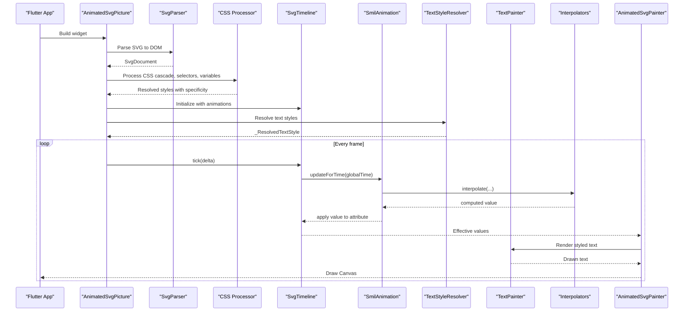

**Diagram sources**
- [lib/src/animation/animated_svg_picture.dart:166-295](file://lib/src/animation/animated_svg_picture.dart#L166-L295)
- [lib/src/animation/smil/smil_timeline.dart:79-98](file://lib/src/animation/smil/smil_timeline.dart#L79-L98)
- [lib/src/animation/smil/smil_animation.dart:367-431](file://lib/src/animation/smil/smil_animation.dart#L367-L431)
- [lib/src/animation/smil/interpolators.dart:18-42](file://lib/src/animation/smil/interpolators.dart#L18-L42)
- [lib/src/animation/animated_svg_painter_text_style.dart:4-171](file://lib/src/animation/animated_svg_painter_text_style.dart#L4-L171)
- [lib/src/animation/animated_svg_painter_text_paint.dart:407-456](file://lib/src/animation/animated_svg_painter_text_paint.dart#L407-L456)

**Section sources**
- [ARCHITECTURE.md:146-193](file://ARCHITECTURE.md#L146-L193)

## Detailed Component Analysis

### SMIL Animation Engine
- Types: animate, animateTransform, animateMotion, set, animateColor
- Timing: begin, end, dur, repeatCount/repeatDur, fill modes
- Interpolation: calcMode (linear, discrete, spline, paced), keySplines/steps
- Playback direction and additive/accumulate semantics
- Event-based activation and syncbase timing resolution

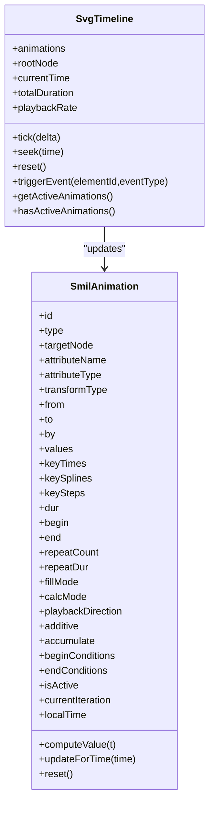

**Diagram sources**
- [lib/src/animation/smil/smil_animation.dart:80-453](file://lib/src/animation/smil/smil_animation.dart#L80-L453)
- [lib/src/animation/smil/smil_timeline.dart:21-256](file://lib/src/animation/smil/smil_timeline.dart#L21-L256)

**Section sources**
- [lib/src/animation/smil/smil_animation.dart:13-77](file://lib/src/animation/smil/smil_animation.dart#L13-L77)
- [lib/src/animation/smil/smil_timeline.dart:13-61](file://lib/src/animation/smil/smil_timeline.dart#L13-L61)

### Interpolation System
- Numbers, colors, transforms, paths, points/lists
- Additive arithmetic for numbers and lists
- Path interpolation via normalized cubic Beziers

**Diagram sources**
- [lib/src/animation/smil/interpolators.dart:18-146](file://lib/src/animation/smil/interpolators.dart#L18-L146)

**Section sources**
- [lib/src/animation/smil/interpolators.dart:14-148](file://lib/src/animation/smil/interpolators.dart#L14-L148)

### Path Morphing
- Normalization converts paths to equivalent cubic Bezier sequences
- Interpolator blends normalized command lists
- Example apps demonstrate shape transitions and real-time sliders

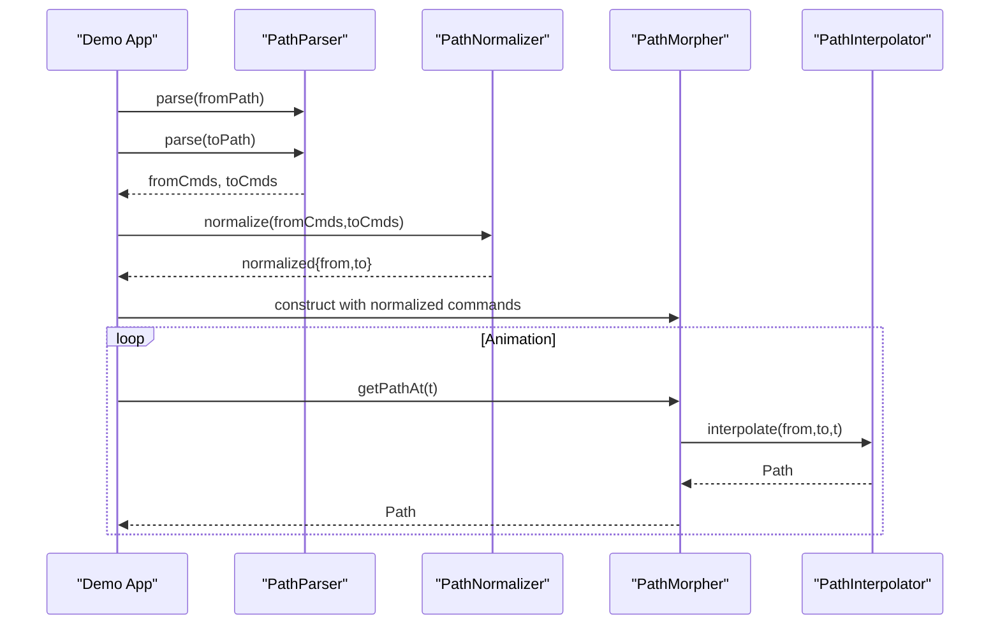

**Diagram sources**
- [example/lib/path_morphing_example.dart:48-67](file://example/lib/path_morphing_example.dart#L48-L67)
- [example/lib/advanced_path_morphing.dart:94-108](file://example/lib/advanced_path_morphing.dart#L94-L108)
- [lib/src/animation/path_interpolation.dart:26-65](file://lib/src/animation/path_interpolation.dart#L26-L65)

**Section sources**
- [lib/src/animation/path_interpolation.dart:15-96](file://lib/src/animation/path_interpolation.dart#L15-L96)
- [example/lib/path_morphing_example.dart:27-168](file://example/lib/path_morphing_example.dart#L27-L168)
- [example/lib/advanced_path_morphing.dart:68-283](file://example/lib/advanced_path_morphing.dart#L68-L283)
- [test/animation/path_morphing_test.dart:1-431](file://test/animation/path_morphing_test.dart#L1-L431)

### Filter Runtime and Effects
- Color Matrix: matrix, saturate, hueRotate, luminanceToAlpha
- Blur: Gaussian blur via ImageFilter
- Lighting: Diffuse/specular primitives store parameters; baseline behavior acts as pass-through

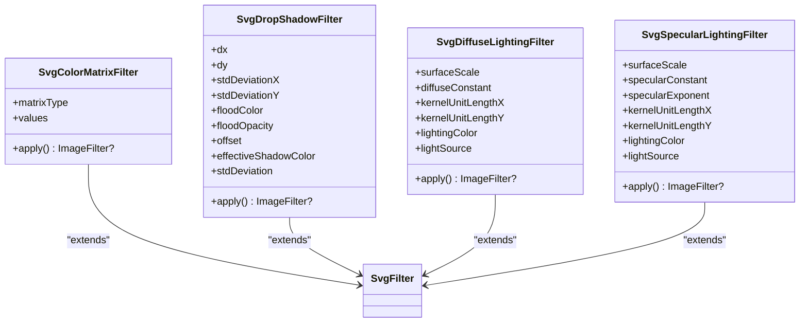

**Diagram sources**
- [lib/src/animation/svg_filters_color_matrix.dart:56-202](file://lib/src/animation/svg_filters_color_matrix.dart#L56-L202)
- [lib/src/animation/svg_filters_primitives_lighting.dart:52-125](file://lib/src/animation/svg_filters_primitives_lighting.dart#L52-L125)

**Section sources**
- [lib/src/animation/svg_filters_color_matrix.dart:56-202](file://lib/src/animation/svg_filters_color_matrix.dart#L56-L202)
- [lib/src/animation/svg_filters_primitives_lighting.dart:52-125](file://lib/src/animation/svg_filters_primitives_lighting.dart#L52-L125)

### Motion Animation Techniques
- animateMotion: path-based movement with optional rotate modes
- KeyPoints and keyTimes enable variable-speed motion along paths
- Integration with SMIL timeline and transform interpolation

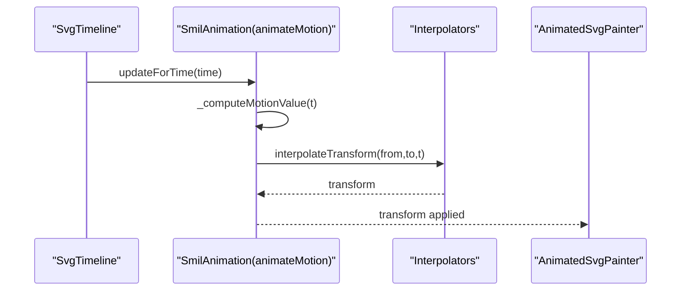

**Diagram sources**
- [lib/src/animation/smil/smil_animation.dart:320-365](file://lib/src/animation/smil/smil_animation.dart#L320-L365)
- [lib/src/animation/smil/interpolators.dart:113-116](file://lib/src/animation/smil/interpolators.dart#L113-L116)

**Section sources**
- [lib/src/animation/smil/smil_animation.dart:320-365](file://lib/src/animation/smil/smil_animation.dart#L320-L365)

## CSS Cascade and Specificity System

### Comprehensive CSS Cascade Implementation
The CSS cascade system implements full CSS cascade rules per the CSS Cascading specification, providing sophisticated property resolution with specificity calculation and inheritance handling.

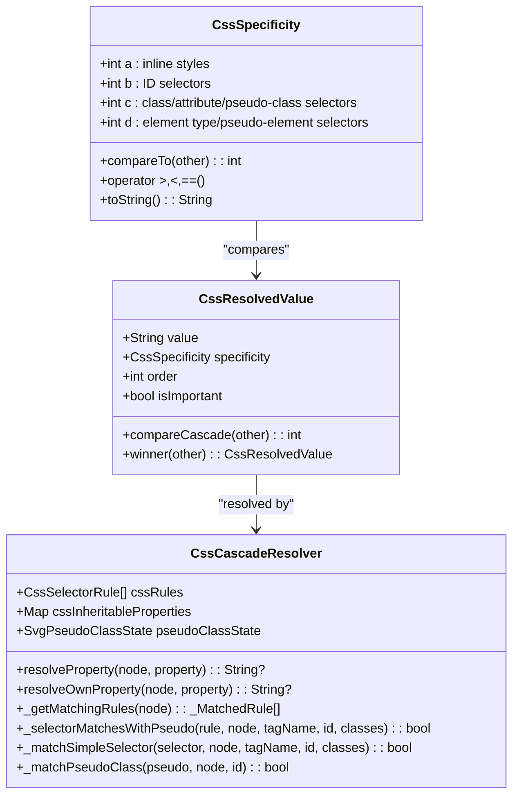

**Diagram sources**
- [lib/src/animation/css_cascade.dart:18-663](file://lib/src/animation/css_cascade.dart#L18-L663)

### Specificity Calculation Algorithm
The specificity calculator follows CSS specifications precisely, calculating specificity as (a, b, c, d) where:
- a: Inline styles (1 if inline, 0 otherwise)
- b: ID selectors count
- c: Class, attribute, pseudo-class selector count
- d: Element type and pseudo-element selector count

**Section sources**
- [lib/src/animation/css_cascade.dart:18-663](file://lib/src/animation/css_cascade.dart#L18-L663)
- [test/animation/css_cascade_specificity_test.dart:47-112](file://test/animation/css_cascade_specificity_test.dart#L47-L112)

## CSS Selector Parsing and Advanced Combinators

### Advanced Selector Parser with Combinators
The CSS selector parser supports all modern CSS selectors including advanced combinators for precise targeting.

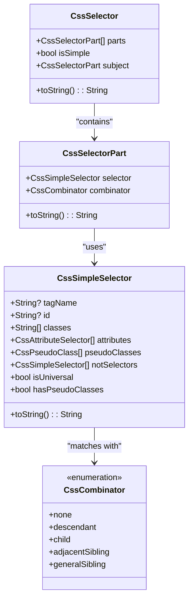

**Diagram sources**
- [lib/src/animation/css_selectors.dart:288-302](file://lib/src/animation/css_selectors.dart#L288-L302)
- [lib/src/animation/css_selectors.dart:264-285](file://lib/src/animation/css_selectors.dart#L264-L285)
- [lib/src/animation/css_selectors.dart:179-236](file://lib/src/animation/css_selectors.dart#L179-L236)
- [lib/src/animation/css_selectors.dart:69-85](file://lib/src/animation/css_selectors.dart#L69-L85)

### Supported Combinators
The system supports all major CSS combinators:
- Descendant combinator (space): `g rect` - matches rect inside g at any depth
- Child combinator (>): `g > rect` - matches direct children only
- Adjacent sibling (+): `rect + circle` - matches circle immediately after rect
- General sibling (~): `rect ~ circle` - matches any circle after rect

**Section sources**
- [lib/src/animation/css_selectors.dart:69-302](file://lib/src/animation/css_selectors.dart#L69-L302)
- [test/animation/css_selectors_combinators_test.dart:170-226](file://test/animation/css_selectors_combinators_test.dart#L170-L226)

## CSS Shorthand Property Expansion

### Comprehensive Shorthand Expansion System
The CSS shorthand expansion system automatically expands CSS shorthand properties into their longhand equivalents, ensuring proper inheritance and animation support.

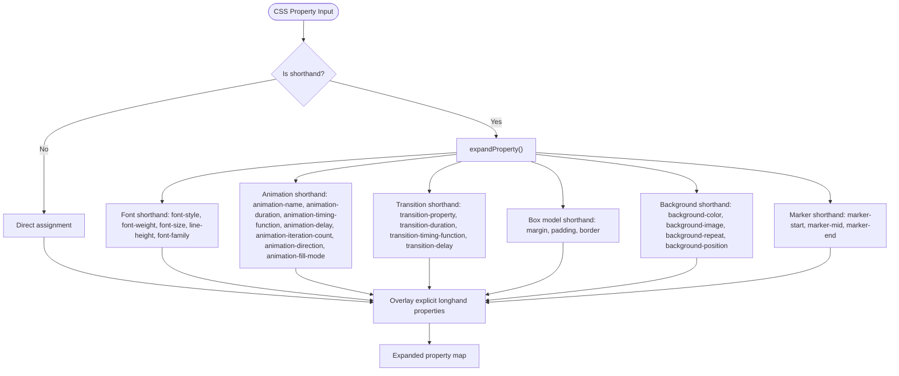

**Diagram sources**
- [lib/src/animation/css_shorthand_expansion.dart:7-69](file://lib/src/animation/css_shorthand_expansion.dart#L7-L69)

### Supported Shorthand Properties
The system handles all major CSS shorthand properties:
- **Font**: `font: italic bold 16px Arial` → expands to individual font properties
- **Animation**: `animation: spin 1s ease-in infinite alternate` → expands to animation-name, duration, timing-function, etc.
- **Transition**: `transition: opacity 0.3s ease-in-out` → expands to transition properties
- **Margin/Padding**: `margin: 10px 20px` → expands to individual side properties
- **Border**: `border: 1px solid black` → expands to width, style, color for all sides
- **Background**: `background: #ff0000 url(image.png)` → expands to background-color and image
- **Marker**: `marker: url(#arrowhead)` → expands to marker-start, -mid, -end

**Section sources**
- [lib/src/animation/css_shorthand_expansion.dart:7-69](file://lib/src/animation/css_shorthand_expansion.dart#L7-L69)
- [test/animation/css_shorthand_expansion_test.dart:5-619](file://test/animation/css_shorthand_expansion_test.dart#L5-L619)

## Custom Properties and Calc() Function Support

### CSS Custom Properties and Calc() Integration
The system provides comprehensive support for CSS custom properties (variables) and calc() functions, enabling dynamic and flexible styling.

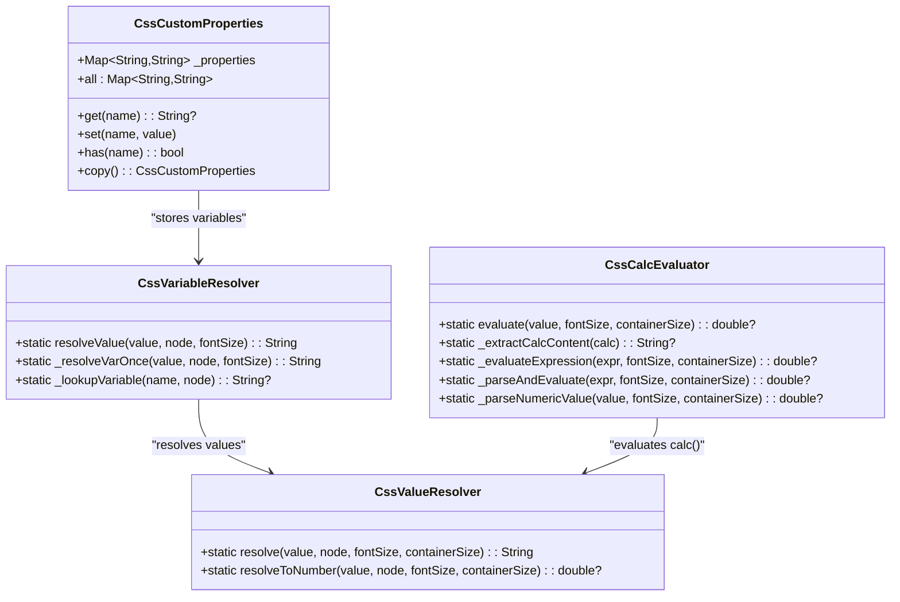

**Diagram sources**
- [lib/src/animation/css_variables_calc.dart:37-154](file://lib/src/animation/css_variables_calc.dart#L37-L154)
- [lib/src/animation/css_variables_calc.dart:156-552](file://lib/src/animation/css_variables_calc.dart#L156-L552)

### Variable Resolution and Calc() Evaluation
The system supports:
- **Variable Resolution**: `var(--color)` with fallback values `var(--color, red)`
- **Inheritance**: Variables inherit through the DOM tree
- **Circular References**: Safe handling with iteration limits
- **Calc() Expressions**: Mathematical expressions with units
- **Unit Conversion**: Automatic conversion between px, em, rem, %, pt, pc, in, cm, mm, q
- **Nested Operations**: Complex nested calc() expressions

**Section sources**
- [lib/src/animation/css_variables_calc.dart:37-576](file://lib/src/animation/css_variables_calc.dart#L37-L576)
- [test/animation/css_variables_calc_test.dart:39-402](file://test/animation/css_variables_calc_test.dart#L39-L402)

## 3D Transform Capabilities

### Full Matrix4x4 Transform System
The 3D transform system provides comprehensive 3D graphics support with Matrix4x4 operations.

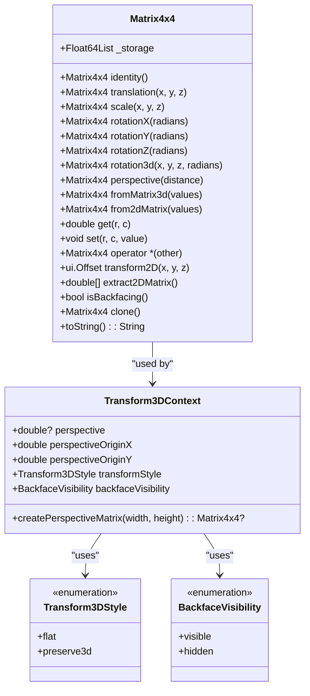

**Diagram sources**
- [lib/src/animation/transform_3d.dart:22-327](file://lib/src/animation/transform_3d.dart#L22-L327)
- [lib/src/animation/transform_3d.dart:333-393](file://lib/src/animation/transform_3d.dart#L333-L393)

### 3D Transform Features
The system supports:
- **Basic Transforms**: Translation, scaling, rotation around X, Y, Z axes
- **Arbitrary Rotation**: `rotate3d(x, y, z, angle)` with normalized axis vectors
- **Perspective Projection**: CSS perspective matrix with configurable distance
- **Matrix Operations**: Full 4x4 matrix multiplication and manipulation
- **2D Extraction**: Automatic extraction of 2D affine transforms from 3D matrices
- **Backface Detection**: `isBackfacing()` for visibility optimization
- **Transform Context**: Complete 3D transform pipeline with perspective and style options

**Section sources**
- [lib/src/animation/transform_3d.dart:22-400](file://lib/src/animation/transform_3d.dart#L22-L400)
- [test/animation/css_3d_transforms_test.dart:48-167](file://test/animation/css_3d_transforms_test.dart#L48-L167)

## Text Styling and Typography Features

### Comprehensive CSS Text Property Support
The text styling system provides extensive CSS text property support with comprehensive resolution and application capabilities:

#### Core Text Properties
- **Text Decoration**: Underline, overline, and line-through with individual control
- **Writing Mode**: Horizontal and vertical text rendering support
- **Font Variants**: Advanced font feature support including small-caps, titling-caps, and numeric variants
- **Typography Control**: Letter spacing, word spacing, text indentation, and alignment
- **Text Transformation**: Capitalization, uppercase, lowercase, and full-width support
- **Line Breaking**: Advanced line breaking and overflow wrapping control
- **Hyphenation**: Automatic and manual hyphenation support
- **Text Orientation**: Mixed, upright, and sideways text orientation for vertical writing

#### Text Decoration System
The system implements a comprehensive text decoration framework supporting:

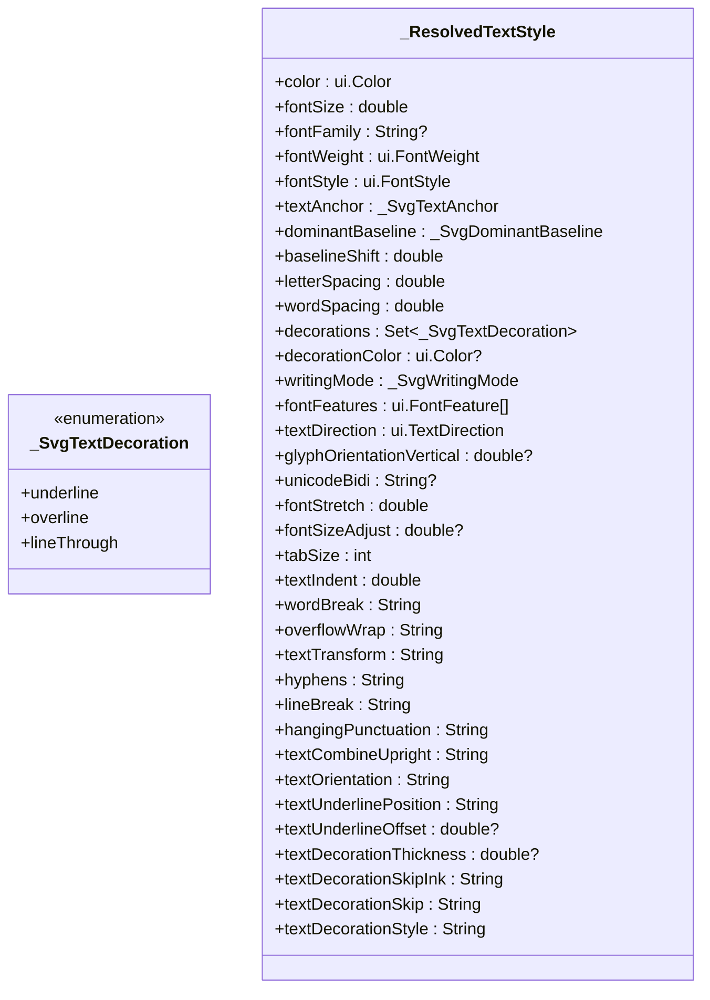

**Diagram sources**
- [lib/src/animation/animated_svg_painter.dart:193-197](file://lib/src/animation/animated_svg_painter.dart#L193-L197)
- [lib/src/animation/animated_svg_painter.dart:258-460](file://lib/src/animation/animated_svg_painter.dart#L258-L460)

#### Advanced Typography Features
- **Font Variant Resolution**: Converts CSS font-variant properties to Flutter FontFeatures
  - Small-caps variants: `small-caps`, `all-small-caps`, `petite-caps`, `all-petite-caps`
  - Stylistic sets: `unicase`, `titling-caps`
  - Numeric formatting: `oldstyle-nums`, `lining-nums`, `tabular-nums`, `proportional-nums`
- **Writing Mode Support**: Comprehensive vertical text rendering with proper glyph orientation
- **Text Decoration Thickness**: Support for custom decoration line thickness with unit handling
- **Text Underline Position**: Advanced underline positioning including multi-value combinations
- **Text Decoration Styles**: Solid, double, dotted, dashed, and wavy decoration line styles
- **Text Decoration Skip**: Control over what elements decorations skip over (objects, spaces, edges)
- **Text Decoration Skip Ink**: Intelligent handling of decorations around glyph ascenders and descenders

#### Text Rendering Architecture
The text rendering system consists of three main components:

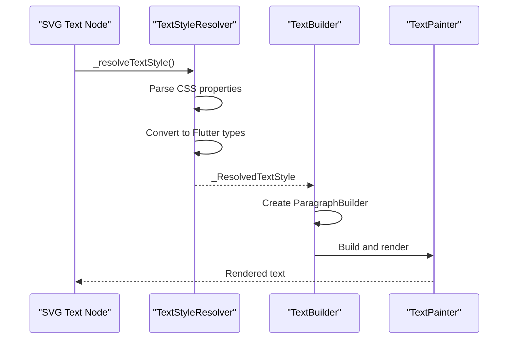

**Diagram sources**
- [lib/src/animation/animated_svg_painter_text_style.dart:4-171](file://lib/src/animation/animated_svg_painter_text_style.dart#L4-L171)
- [lib/src/animation/animated_svg_painter_text_style.dart:769-798](file://lib/src/animation/animated_svg_painter_text_style.dart#L769-L798)
- [lib/src/animation/animated_svg_painter_text_paint.dart:407-456](file://lib/src/animation/animated_svg_painter_text_paint.dart#L407-L456)

**Section sources**
- [lib/src/animation/animated_svg_painter_text_style.dart:1-1046](file://lib/src/animation/animated_svg_painter_text_style.dart#L1-L1046)
- [lib/src/animation/animated_svg_painter_text_paint.dart:400-594](file://lib/src/animation/animated_svg_painter_text_paint.dart#L400-L594)
- [lib/src/animation/animated_svg_painter.dart:193-460](file://lib/src/animation/animated_svg_painter.dart#L193-L460)

## Dependency Analysis
- AnimatedSvgPicture depends on SvgParser, SmilParser, SvgTimeline, CssCascadeResolver, and AnimatedSvgPainter
- SmilAnimation relies on Interpolators and DistanceCalculator for paced mode
- Path morphing depends on PathParser, PathNormalizer, and PathInterpolator
- Filters depend on Flutter's ui.ImageFilter and color matrices
- CSS processing depends on CssCascadeResolver, CssSelectorParser, CssVariableResolver, and CssCalcEvaluator
- 3D transforms depend on Matrix4x4 and Transform3DContext
- Text styling system depends on Flutter's ui.TextDirection, ui.FontFeature, and ui.ParagraphBuilder

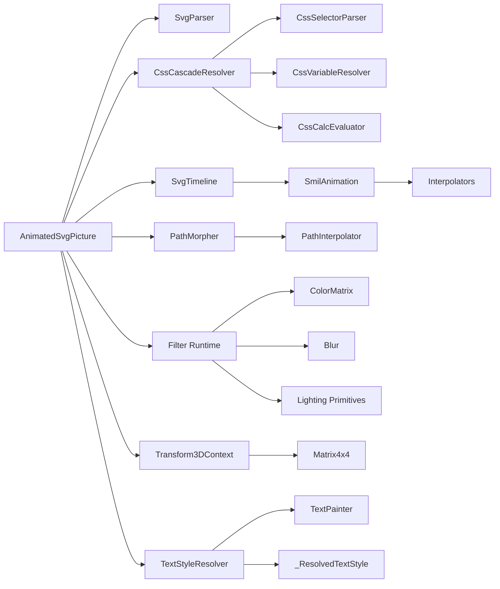

**Diagram sources**
- [lib/src/animation/animated_svg_picture.dart:1-359](file://lib/src/animation/animated_svg_picture.dart#L1-L359)
- [lib/src/animation/smil/smil_animation.dart:1-453](file://lib/src/animation/smil/smil_animation.dart#L1-L453)
- [lib/src/animation/smil/interpolators.dart:1-148](file://lib/src/animation/smil/interpolators.dart#L1-L148)
- [lib/src/animation/path_interpolation.dart:1-96](file://lib/src/animation/path_interpolation.dart#L1-L96)
- [lib/src/animation/svg_filters_color_matrix.dart:1-202](file://lib/src/animation/svg_filters_color_matrix.dart#L1-L202)
- [lib/src/animation/svg_filters_primitives_lighting.dart:1-125](file://lib/src/animation/svg_filters_primitives_lighting.dart#L1-L125)
- [lib/src/animation/css_cascade.dart:1-663](file://lib/src/animation/css_cascade.dart#L1-L663)
- [lib/src/animation/css_selectors.dart:1-645](file://lib/src/animation/css_selectors.dart#L1-L645)
- [lib/src/animation/css_variables_calc.dart:1-576](file://lib/src/animation/css_variables_calc.dart#L1-L576)
- [lib/src/animation/transform_3d.dart:1-400](file://lib/src/animation/transform_3d.dart#L1-L400)
- [lib/src/animation/animated_svg_painter_text_style.dart:1-1046](file://lib/src/animation/animated_svg_painter_text_style.dart#L1-L1046)
- [lib/src/animation/animated_svg_painter_text_paint.dart:1-594](file://lib/src/animation/animated_svg_painter_text_paint.dart#L1-L594)
- [lib/src/animation/animated_svg_painter.dart:258-460](file://lib/src/animation/animated_svg_painter.dart#L258-L460)

**Section sources**
- [ARCHITECTURE.md:236-281](file://ARCHITECTURE.md#L236-L281)

## Performance Considerations
- Static subtree caching: reuse Picture for nodes without animations
- Dirty tracking: render only changed subtrees
- Path optimization: normalize once, reuse Path objects, reset instead of recreate
- Text styling optimization: cache resolved styles, reuse Paragraph objects
- CSS processing optimization: 
  - Rule cache with specificity-based matching
  - Selector parsing with efficient combinator handling
  - Variable resolution with iteration limits
  - Shorthand expansion with lazy evaluation
- 3D transform optimization:
  - Matrix reuse and cloning
  - Perspective matrix caching
  - Backface culling for performance
- Future optimizations: layer caching, GPU-accelerated morphing, reduced allocations

Practical tips:
- Prefer normalized paths for repeated morphing to avoid repeated normalization
- Use additive/accumulate judiciously; they increase computation per iteration
- Limit simultaneous complex animations on the same subtree
- Use playbackRate to throttle expensive scenes
- Cache frequently used text styles to avoid repeated CSS parsing
- Leverage CSS cascade specificity for efficient property resolution
- Use calc() expressions judiciously to avoid excessive recalculation
- Implement proper 3D transform ordering for optimal performance

**Section sources**
- [ARCHITECTURE.md:174-193](file://ARCHITECTURE.md#L174-L193)

## Troubleshooting Guide
Common issues and resolutions:
- Path morphing fails due to incompatible structures
  - Ensure paths are normalized prior to interpolation
  - Verify equal-length normalized command lists
- Invalid SMIL timing or values
  - Confirm keyTimes length matches values for spline/discrete modes
  - For paced mode, ensure values are interpolable; otherwise fallback occurs
- Event-based animations not triggering
  - Verify event keys and element IDs
  - Check resolved begin times and syncbase conditions
- Filter effects not visible
  - Some lighting primitives act as pass-through until full shading is implemented
  - Confirm color matrix dimensions and values validity
- CSS cascade issues
  - Verify selector specificity calculations
  - Check CSS rule ordering and !important declarations
  - Ensure proper inheritance for inheritable properties
- CSS selector matching problems
  - Test selectors with simple patterns first
  - Verify combinator precedence and matching logic
- Custom property resolution errors
  - Check variable name syntax (--name)
  - Verify fallback values for missing variables
  - Monitor for circular reference detection
- 3D transform issues
  - Verify matrix dimensionality and operations
  - Check perspective distance and origin settings
  - Ensure proper transform order for expected results
- Text styling issues
  - Verify CSS property syntax and supported values
  - Check font feature availability in the selected font
  - Ensure proper inheritance from parent elements
  - Validate unit conversions for text-decoration-thickness and similar properties

Diagnostic utilities:
- AnimatedSvgPicture exposes trace callbacks and frame tick logging for detailed runtime insights
- Use test suites to validate normalization and interpolation correctness
- CSS processing tests provide comprehensive coverage of selector parsing and cascade resolution
- 3D transform tests validate matrix operations and perspective calculations
- Text styling tests provide comprehensive coverage of CSS property implementations

**Section sources**
- [lib/src/animation/animated_svg_picture.dart:52-86](file://lib/src/animation/animated_svg_picture.dart#L52-L86)
- [lib/src/animation/smil/smil_animation.dart:110-130](file://lib/src/animation/smil/smil_animation.dart#L110-L130)
- [test/animation/path_morphing_test.dart:136-184](file://test/animation/path_morphing_test.dart#L136-L184)
- [test/animation/css_cascade_specificity_test.dart:222-325](file://test/animation/css_cascade_specificity_test.dart#L222-L325)
- [test/animation/css_selectors_combinators_test.dart:348-510](file://test/animation/css_selectors_combinators_test.dart#L348-L510)
- [test/animation/css_variables_calc_test.dart:344-400](file://test/animation/css_variables_calc_test.dart#L344-L400)
- [test/animation/css_3d_transforms_test.dart:114-126](file://test/animation/css_3d_transforms_test.dart#L114-L126)
- [test/animation/font_variant_test.dart:1-196](file://test/animation/font_variant_test.dart#L1-L196)
- [test/animation/text_orientation_test.dart:1-85](file://test/animation/text_orientation_test.dart#L1-L85)

## Conclusion
The codebase delivers a robust animated SVG pipeline with comprehensive advanced features:
- Full SMIL/CSS animation support and precise timing
- Advanced interpolation for numbers, colors, transforms, paths, and lists
- Practical path morphing with normalization and morphers
- Filter runtime covering color matrix, blur, and lighting primitives
- Comprehensive CSS cascade system with specificity calculation and advanced selector parsing
- CSS shorthand property expansion for efficient styling
- Custom properties with calc() function support for dynamic styling
- Full 3D transform capabilities with Matrix4x4 operations
- Comprehensive text styling system with extensive CSS property support
- Advanced typography features including underline, overline, line-through, writing-mode, font variants, and text decoration controls
- Strong performance strategies and extensible architecture

Adopt the examples and tests as references for building complex, performant animations while adhering to normalization and interpolation constraints. The enhanced CSS processing capabilities provide professional-grade styling support with modern CSS features, while the 3D transform system enables sophisticated 3D animations and effects. The comprehensive text styling capabilities provide professional-grade typography support for international text rendering and advanced text effects.

## Appendices

### Feature Summary and Status
- SMIL elements: animate, animateTransform, animateMotion, set, animateColor
- CSS animations: parsing and conversion to SMIL with timing and direction
- CSS cascade system: specificity calculation, selector parsing, property resolution
- CSS shorthand expansion: comprehensive property expansion support
- Custom properties: var() resolution with inheritance and fallback
- Calc() functions: mathematical expression evaluation with unit conversion
- 3D transforms: Matrix4x4 operations, perspective projection, backface culling
- Path morphing: normalized cubic Bezier interpolation
- Filters: color matrix, blur, lighting primitives (baseline pass-through)
- Text styling: comprehensive CSS text property support including underline, overline, line-through, writing-mode, font variants, and advanced typography features

**Section sources**
- [ANIMATION.md:21-66](file://ANIMATION.md#L21-L66)
- [lib/src/animation/css_cascade.dart:18-663](file://lib/src/animation/css_cascade.dart#L18-L663)
- [lib/src/animation/css_selectors.dart:1-645](file://lib/src/animation/css_selectors.dart#L1-L645)
- [lib/src/animation/css_variables_calc.dart:1-576](file://lib/src/animation/css_variables_calc.dart#L1-L576)
- [lib/src/animation/css_shorthand_expansion.dart:1-69](file://lib/src/animation/css_shorthand_expansion.dart#L1-L69)
- [lib/src/animation/transform_3d.dart:1-400](file://lib/src/animation/transform_3d.dart#L1-L400)
- [lib/src/animation/animated_svg_painter_text_style.dart:1-1046](file://lib/src/animation/animated_svg_painter_text_style.dart#L1-L1046)
- [lib/src/animation/animated_svg_painter_text_paint.dart:400-594](file://lib/src/animation/animated_svg_painter_text_paint.dart#L400-L594)
- [lib/src/animation/animated_svg_painter.dart:193-460](file://lib/src/animation/animated_svg_painter.dart#L193-L460)