# Advanced Hit Testing Features

<cite>
**Referenced Files in This Document**
- [animated_svg_picture.dart](file://lib/src/animation/animated_svg_picture.dart)
- [animated_svg_picture_events.dart](file://lib/src/animation/animated_svg_picture_events.dart)
- [animated_svg_picture_pointer_events.dart](file://lib/src/animation/animated_svg_picture_pointer_events.dart)
- [animated_svg_picture_event_model.dart](file://lib/src/animation/animated_svg_picture_event_model.dart)
- [animated_svg_picture_hit_test_traversal.dart](file://lib/src/animation/animated_svg_picture_hit_test_traversal.dart)
- [animated_svg_picture_hit_test_visibility.dart](file://lib/src/animation/animated_svg_picture_hit_test_visibility.dart)
- [animated_svg_picture_hit_test_use.dart](file://lib/src/animation/animated_svg_picture_hit_test_use.dart)
- [animated_svg_picture_hit_test_geometry.dart](file://lib/src/animation/animated_svg_picture_hit_test_geometry.dart)
- [animated_svg_picture_hit_test_text_runs.dart](file://lib/src/animation/animated_svg_picture_hit_test_text_runs.dart)
- [animated_svg_picture_hit_test_text_layout.dart](file://lib/src/animation/animated_svg_picture_hit_test_text_layout.dart)
- [animated_svg_picture_hit_test_text_path_segments.dart](file://lib/src/animation/animated_svg_picture_hit_test_text_path_segments.dart)
- [animated_svg_picture_hit_test_advanced.dart](file://lib/src/animation/animated_svg_picture_hit_test_advanced.dart)
- [animated_svg_picture_utils.dart](file://lib/src/animation/animated_svg_picture_utils.dart)
- [animated_svg_picture_path_parser.dart](file://lib/src/animation/animated_svg_picture_path_parser.dart)
- [svg_event_dispatcher.dart](file://lib/src/animation/svg_event_dispatcher.dart)
- [svg_event.dart](file://lib/src/animation/svg_event.dart)
- [hit_test_advanced_features_test.dart](file://test/animation/hit_test_advanced_features_test.dart)
- [hit_test_advanced_test.dart](file://test/animation/hit_test_advanced_test.dart)
- [hit_test_precision_test.dart](file://test/animation/hit_test_precision_test.dart)
- [animated_svg_painter_clip_mask_advanced.dart](file://lib/src/animation/animated_svg_painter_clip_mask_advanced.dart)
- [animated_svg_painter_clip_mask.dart](file://lib/src/animation/animated_svg_painter_clip_mask.dart)
</cite>

## Update Summary
**Changes Made**
- Enhanced clipPath precision with advanced coordinate transformation handling for objectBoundingBox units
- Improved mask hit testing with luminance alpha support and nested mask recursion prevention
- Strengthened use element event delegation with comprehensive pointer-events inheritance
- Enhanced pointer events system with robust mode resolution and semantic interpretation
- Advanced precision testing capabilities for complex geometric scenarios with tolerance-based algorithms
- Comprehensive event model implementation with W3C DOM compliance and shadow DOM integration
- Enhanced visibility checking with recursive clipPath/mask handling and transform stacking

## Table of Contents
1. [Introduction](#introduction)
2. [Project Structure](#project-structure)
3. [Core Components](#core-components)
4. [Architecture Overview](#architecture-overview)
5. [Detailed Component Analysis](#detailed-component-analysis)
6. [Enhanced Pointer Events System](#enhanced-pointer-events-system)
7. [Advanced Event Handling Model](#advanced-event-handling-model)
8. [Improved Hit Testing Traversal](#improved-hit-testing-traversal)
9. [Stroke and Fill Hit-Testing with Tolerance](#stroke-and-fill-hit-testing-with-tolerance)
10. [Comprehensive Element Support](#comprehensive-element-support)
11. [Advanced Text Hit Testing](#advanced-text-hit-testing)
12. [Advanced Precision Testing](#advanced-precision-testing)
13. [Dependency Analysis](#dependency-analysis)
14. [Performance Considerations](#performance-considerations)
15. [Troubleshooting Guide](#troubleshooting-guide)
16. [Conclusion](#conclusion)

## Introduction

The Advanced Hit Testing Features represent a sophisticated system for precise element selection and interaction within SVG graphics. This implementation provides comprehensive hit-testing capabilities that go far beyond basic bounding box detection, offering pixel-perfect accuracy for complex SVG elements including markers, glyphs, advanced path fill rules, and sophisticated event delegation through use shadow trees.

The system implements W3C DOM event model compliance with advanced features like marker hit-testing, glyph-precision text selection, robust evenodd fill-rule handling, and seamless integration with SMIL animation event targeting. These features enable developers to create highly interactive SVG experiences with precise user interaction mapping.

**Updated** Enhanced with comprehensive pointer events semantics supporting all major SVG elements with stroke and fill hit-testing using tolerance-based algorithms, glyph-precision text hit testing, advanced use element event delegation, and comprehensive precision testing capabilities for clipPath, mask, and complex geometric scenarios.

## Project Structure

The hit testing system is organized as a modular extension within the AnimatedSvgPicture widget, with specialized components handling different aspects of advanced hit testing:

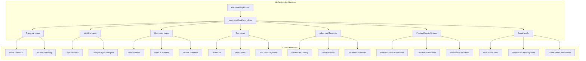

**Diagram sources**
- [animated_svg_picture.dart:169-200](file://lib/src/animation/animated_svg_picture.dart#L169-L200)
- [animated_svg_picture_hit_test_traversal.dart:14-40](file://lib/src/animation/animated_svg_picture_hit_test_traversal.dart#L14-L40)

**Section sources**
- [animated_svg_picture.dart:1-200](file://lib/src/animation/animated_svg_picture.dart#L1-L200)

## Core Components

The advanced hit testing system consists of several interconnected components that work together to provide comprehensive element selection:

### Hit Test Result Types

The system defines multiple result types to handle different hit-testing scenarios:

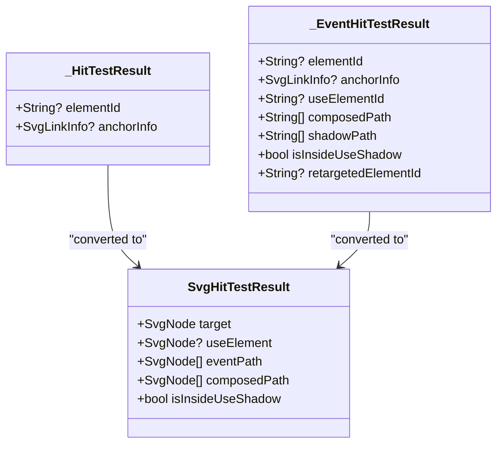

**Diagram sources**
- [animated_svg_picture_hit_test_traversal.dart:3-12](file://lib/src/animation/animated_svg_picture_hit_test_traversal.dart#L3-L12)
- [svg_event_dispatcher.dart:10-33](file://lib/src/animation/svg_event_dispatcher.dart#L10-L33)

### Event Model Integration

The hit testing system integrates seamlessly with the W3C DOM event model:

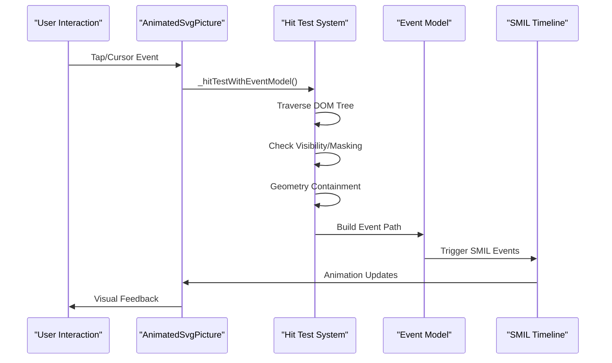

**Diagram sources**
- [animated_svg_picture_events.dart:4-47](file://lib/src/animation/animated_svg_picture_events.dart#L4-L47)
- [svg_event_dispatcher.dart:218-315](file://lib/src/animation/svg_event_dispatcher.dart#L218-L315)

**Section sources**
- [animated_svg_picture_hit_test_traversal.dart:1-322](file://lib/src/animation/animated_svg_picture_hit_test_traversal.dart#L1-L322)
- [svg_event_dispatcher.dart:1-375](file://lib/src/animation/svg_event_dispatcher.dart#L1-L375)

## Architecture Overview

The advanced hit testing system follows a layered architecture that processes user interactions through multiple validation stages:

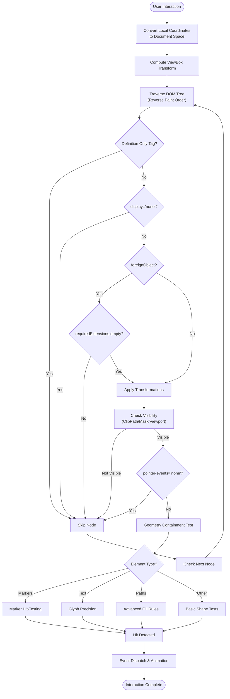

**Diagram sources**
- [animated_svg_picture_hit_test_traversal.dart:86-199](file://lib/src/animation/animated_svg_picture_hit_test_traversal.dart#L86-L199)
- [animated_svg_picture_hit_test_visibility.dart:8-36](file://lib/src/animation/animated_svg_picture_hit_test_visibility.dart#L8-L36)
- [animated_svg_picture_hit_test_geometry.dart:5-406](file://lib/src/animation/animated_svg_picture_hit_test_geometry.dart#L5-L406)

## Detailed Component Analysis

### Enhanced ClipPath Precision System

The clipPath precision system provides advanced coordinate transformation handling for complex clipPath scenarios:

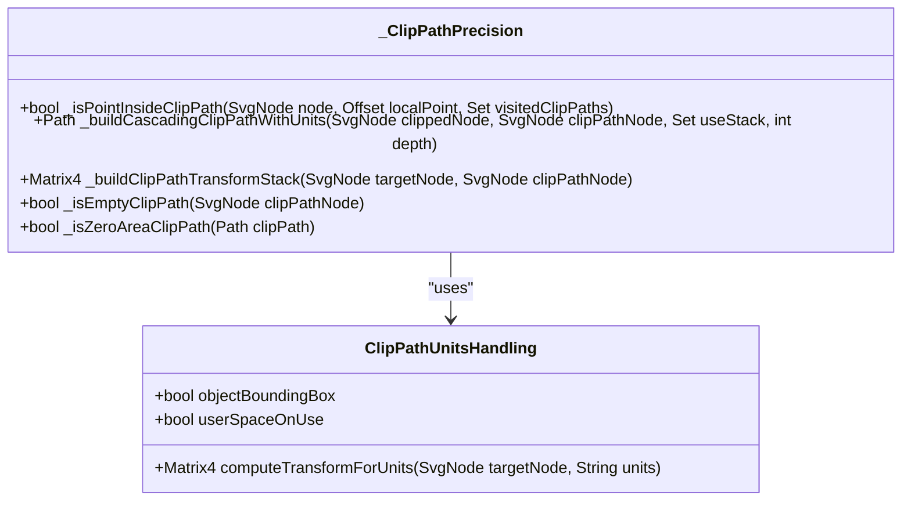

**Diagram sources**
- [animated_svg_picture_hit_test_visibility.dart:41-91](file://lib/src/animation/animated_svg_picture_hit_test_visibility.dart#L41-L91)
- [animated_svg_painter_clip_mask_advanced.dart:488-581](file://lib/src/animation/animated_svg_painter_clip_mask_advanced.dart#L488-L581)

The enhanced clipPath system supports:
- **Nested clipPath references** with recursion depth prevention
- **ObjectBoundingBox units** with proper transform computation
- **UserSpaceOnUse units** with direct coordinate mapping
- **Cascade clipPath scenarios** with intersection operations
- **Empty clipPath edge cases** with zero-area handling

**Section sources**
- [animated_svg_picture_hit_test_visibility.dart:1-606](file://lib/src/animation/animated_svg_picture_hit_test_visibility.dart#L1-L606)
- [animated_svg_painter_clip_mask_advanced.dart:1-671](file://lib/src/animation/animated_svg_painter_clip_mask_advanced.dart#L1-L671)

### Advanced Mask Hit Testing System

The mask hit testing system provides comprehensive alpha channel and luminance-based precision:

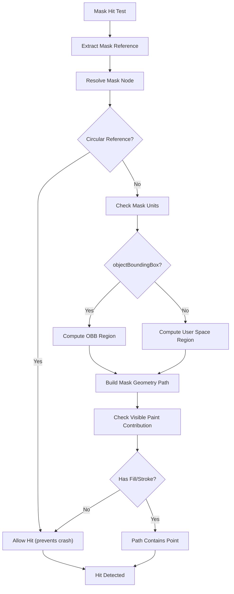

**Diagram sources**
- [animated_svg_picture_hit_test_visibility.dart:201-259](file://lib/src/animation/animated_svg_picture_hit_test_visibility.dart#L201-L259)
- [animated_svg_painter_clip_mask_advanced.dart:17-66](file://lib/src/animation/animated_svg_painter_clip_mask_advanced.dart#L17-L66)

The advanced mask system includes:
- **Luminance alpha support** with ITU-R BT.709 coefficients
- **Nested mask recursion prevention** with depth tracking
- **ObjectBoundingBox units** with proper viewport computation
- **UserSpaceOnUse units** with percentage handling
- **Visible paint contribution analysis** excluding transparent elements

**Section sources**
- [animated_svg_picture_hit_test_visibility.dart:198-395](file://lib/src/animation/animated_svg_picture_hit_test_visibility.dart#L198-L395)
- [animated_svg_painter_clip_mask_advanced.dart:17-66](file://lib/src/animation/animated_svg_painter_clip_mask_advanced.dart#L17-L66)

### Enhanced Use Element Event Delegation

The use element system enables event delegation through shadow DOM boundaries with comprehensive pointer-events inheritance:

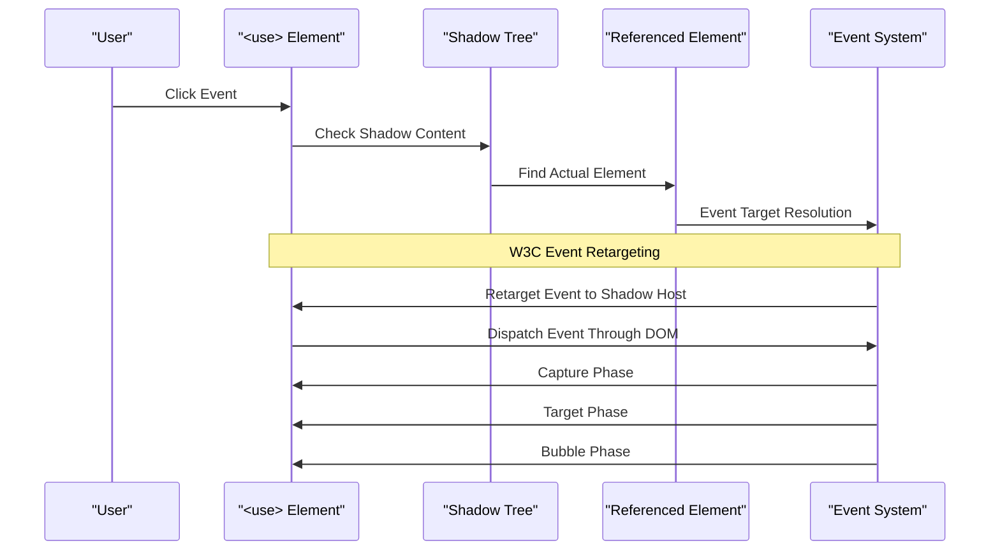

**Diagram sources**
- [animated_svg_picture_hit_test_use.dart:24-124](file://lib/src/animation/animated_svg_picture_hit_test_use.dart#L24-L124)
- [svg_event_dispatcher.dart:202-216](file://lib/src/animation/svg_event_dispatcher.dart#L202-L216)

The system enforces W3C standards for event delegation:
- **Event retargeting** through shadow boundaries with proper ID inheritance
- **Pointer-events inheritance** across use boundaries with context-aware resolution
- **Proper event path construction** including shadow elements and use chains
- **Circular reference prevention** with use stack tracking and depth limits
- **Viewport clipping** for use-referenced content with transform stacking

**Section sources**
- [animated_svg_picture_hit_test_use.dart:1-486](file://lib/src/animation/animated_svg_picture_hit_test_use.dart#L1-L486)
- [svg_event_dispatcher.dart:140-216](file://lib/src/animation/svg_event_dispatcher.dart#L140-L216)

### Marker Hit-Testing System

The marker hit-testing system provides precise selection of marker elements positioned along paths:

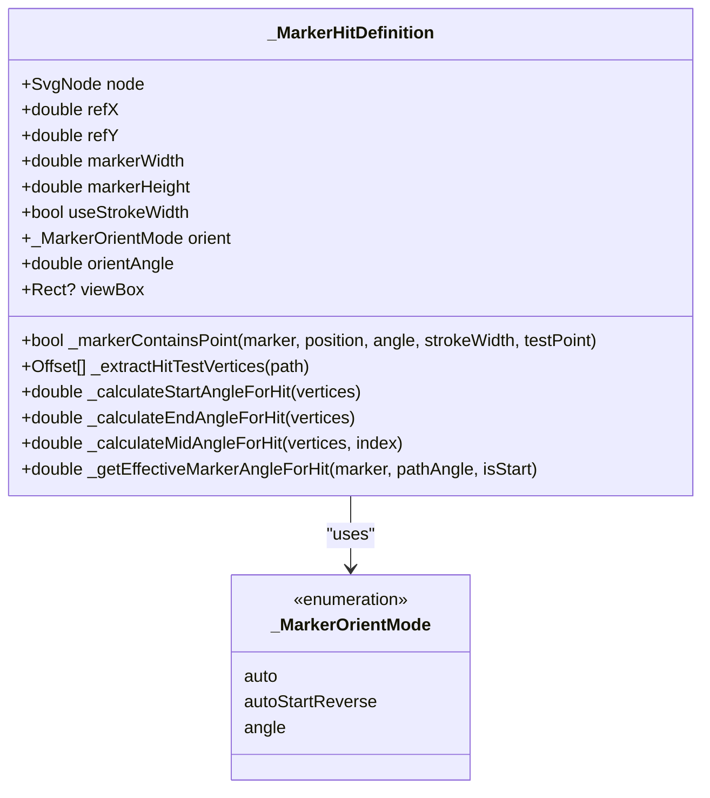

**Diagram sources**
- [animated_svg_picture_hit_test_advanced.dart:756-798](file://lib/src/animation/animated_svg_picture_hit_test_advanced.dart#L756-L798)
- [animated_svg_picture_hit_test_advanced.dart:13-108](file://lib/src/animation/animated_svg_picture_hit_test_advanced.dart#L13-L108)

The marker system supports three orientation modes:
- **Auto**: Aligns markers tangent to path direction
- **Auto Start Reverse**: Reverses orientation for start markers
- **Angle**: Fixed orientation angle

**Section sources**
- [animated_svg_picture_hit_test_advanced.dart:1-816](file://lib/src/animation/animated_svg_picture_hit_test_advanced.dart#L1-L816)

### Advanced Evenodd Fill-Rule Implementation

The evenodd fill-rule system provides robust containment testing for complex path geometries:

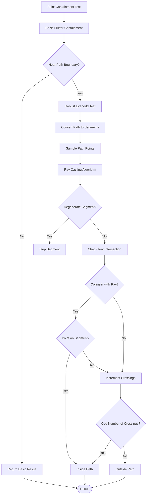

**Diagram sources**
- [animated_svg_picture_hit_test_advanced.dart:614-725](file://lib/src/animation/animated_svg_picture_hit_test_advanced.dart#L614-L725)

The system handles edge cases including:
- **Self-intersecting paths** with complex topology
- **Collinear segments** that create degenerate cases
- **Zero-length path segments** that require special handling
- **Cusps and sharp corners** that challenge standard algorithms

**Section sources**
- [animated_svg_picture_hit_test_advanced.dart:607-750](file://lib/src/animation/animated_svg_picture_hit_test_advanced.dart#L607-L750)

## Enhanced Pointer Events System

The pointer events system provides comprehensive configuration and semantic interpretation for hit testing:

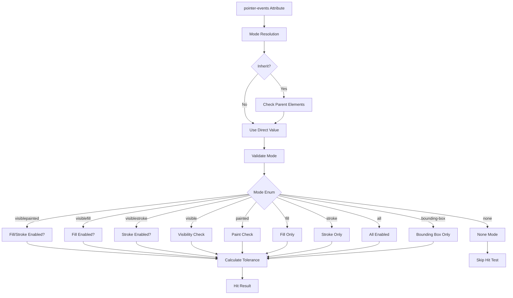

**Diagram sources**
- [animated_svg_picture_pointer_events.dart:5-25](file://lib/src/animation/animated_svg_picture_pointer_events.dart#L5-L25)
- [animated_svg_picture_pointer_events.dart:27-57](file://lib/src/animation/animated_svg_picture_pointer_events.dart#L27-L57)
- [animated_svg_picture_pointer_events.dart:59-89](file://lib/src/animation/animated_svg_picture_pointer_events.dart#L59-L89)

The pointer events system supports all standard SVG modes:
- **visiblepainted**: Requires visibility AND fill/stroke enabled
- **visiblefill**: Requires visibility AND fill enabled
- **visiblestroke**: Requires visibility AND stroke enabled
- **visible**: Requires visibility only
- **painted**: Requires fill/stroke enabled
- **fill**: Fill-only hit testing
- **stroke**: Stroke-only hit testing
- **all**: All elements hit-testable
- **bounding-box**: Only bounding box hit testing
- **none**: No hit testing

**Section sources**
- [animated_svg_picture_pointer_events.dart:1-128](file://lib/src/animation/animated_svg_picture_pointer_events.dart#L1-L128)

## Advanced Event Handling Model

The event handling system implements comprehensive W3C DOM event flow with advanced features:

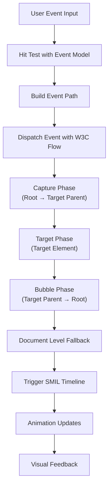

**Diagram sources**
- [animated_svg_picture_events.dart:104-150](file://lib/src/animation/animated_svg_picture_events.dart#L104-L150)
- [svg_event_dispatcher.dart:218-315](file://lib/src/animation/svg_event_dispatcher.dart#L218-L315)

The system supports:
- **Full W3C event flow** with capture, target, and bubble phases
- **Event propagation control** with stopPropagation and stopImmediatePropagation
- **Event context tracking** for preventDefault functionality
- **Shadow DOM integration** with proper event retargeting
- **Composed path construction** for non-bubbling events

**Section sources**
- [animated_svg_picture_events.dart:58-193](file://lib/src/animation/animated_svg_picture_events.dart#L58-L193)
- [svg_event_dispatcher.dart:140-375](file://lib/src/animation/svg_event_dispatcher.dart#L140-L375)

## Improved Hit Testing Traversal

The hit testing traversal system provides enhanced event boundary detection and filtering:

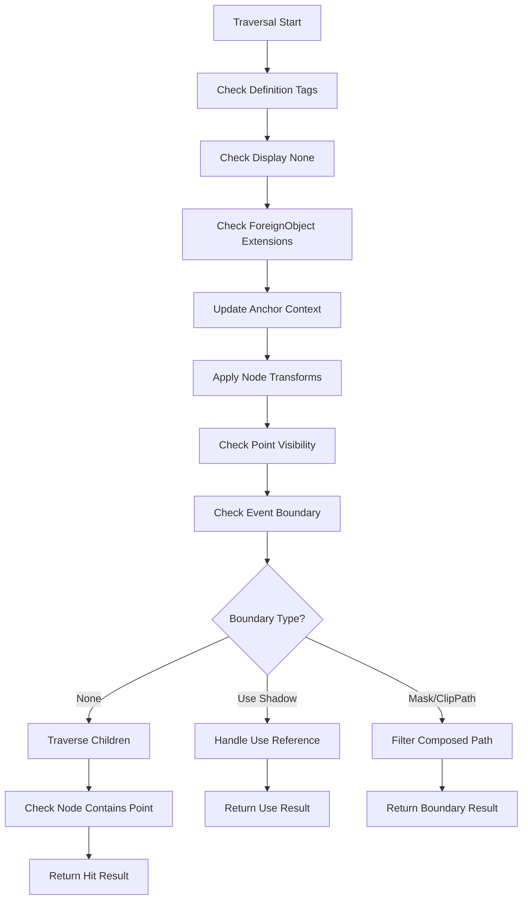

**Diagram sources**
- [animated_svg_picture_hit_test_traversal.dart:112-224](file://lib/src/animation/animated_svg_picture_hit_test_traversal.dart#L112-L224)
- [animated_svg_picture_hit_test_traversal.dart:347-431](file://lib/src/animation/animated_svg_picture_hit_test_traversal.dart#L347-L431)

The traversal system handles:
- **Event boundary detection** for mask, clipPath, and use shadow contexts
- **Composed path filtering** to prevent event propagation outside boundaries
- **Anchor tracking** through nested anchor elements
- **Use element recursion** with depth limiting and shadow path construction
- **ForeignObject context management** with proper transform application

**Section sources**
- [animated_svg_picture_hit_test_traversal.dart:1-450](file://lib/src/animation/animated_svg_picture_hit_test_traversal.dart#L1-L450)

## Stroke and Fill Hit-Testing with Tolerance

The system implements sophisticated tolerance-based hit testing for stroke and fill operations:

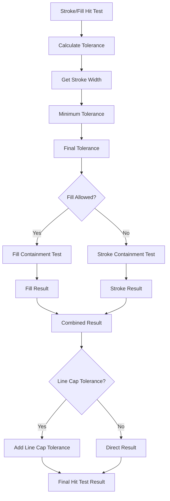

**Diagram sources**
- [animated_svg_picture_utils.dart:15-20](file://lib/src/animation/animated_svg_picture_utils.dart#L15-L20)
- [animated_svg_picture_utils.dart:26-35](file://lib/src/animation/animated_svg_picture_utils.dart#L26-L35)
- [animated_svg_picture_path_parser.dart:149-174](file://lib/src/animation/animated_svg_picture_path_parser.dart#L149-L174)

The tolerance system includes:
- **Stroke Width Tolerance**: Stroke width divided by 2 with minimum 0.5
- **Line Cap Tolerance**: Additional tolerance for round/square line caps
- **Path Stroke Containment**: Distance-based stroke detection using path metrics
- **Fill Containment**: Standard path.contains() for solid fills

**Section sources**
- [animated_svg_picture_utils.dart:1-86](file://lib/src/animation/animated_svg_picture_utils.dart#L1-L86)
- [animated_svg_picture_path_parser.dart:140-174](file://lib/src/animation/animated_svg_picture_path_parser.dart#L140-L174)

## Comprehensive Element Support

The hit testing system now supports a comprehensive range of SVG elements with appropriate hit-testing algorithms:

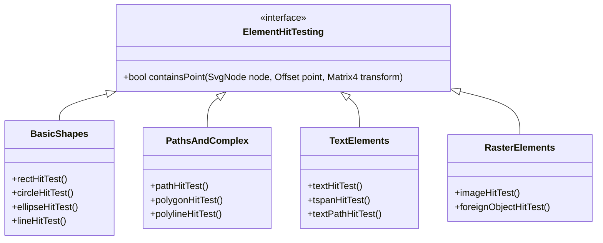

**Diagram sources**
- [animated_svg_picture_hit_test_traversal.dart:294-307](file://lib/src/animation/animated_svg_picture_hit_test_traversal.dart#L294-L307)
- [animated_svg_picture_hit_test_geometry.dart:18-406](file://lib/src/animation/animated_svg_picture_hit_test_geometry.dart#L18-L406)

Supported elements include:
- **Basic Shapes**: rect, circle, ellipse, line
- **Complex Paths**: path, polygon, polyline
- **Text Elements**: text, tspan, textPath
- **Raster Content**: image, foreignObject
- **Marker Support**: All path-like elements with marker hit-testing

Each element type implements appropriate hit-testing logic:
- **Bounding Box**: Simple rectangle containment
- **Fill Containment**: Path-based fill detection
- **Stroke Containment**: Tolerance-based stroke detection
- **Mixed Modes**: Combination of fill and stroke detection

**Section sources**
- [animated_svg_picture_hit_test_traversal.dart:294-321](file://lib/src/animation/animated_svg_picture_hit_test_traversal.dart#L294-L321)
- [animated_svg_picture_hit_test_geometry.dart:18-436](file://lib/src/animation/animated_svg_picture_hit_test_geometry.dart#L18-L436)

## Advanced Text Hit Testing

The glyph-precision text hit testing system provides pixel-perfect text selection by analyzing individual character boundaries:

```mermaid
flowchart LR
TextRoot["Text Root Element"] --> LayoutCalc["Calculate Text Layout"]
LayoutCalc --> CharacterLoop["Iterate Characters"]
CharacterLoop --> MeasureGlyph["Measure Character Bounds"]
MeasureGlyph --> PositionCalc["Calculate Position<br/>(x,y,dx,dy,rotate)"]
PositionCalc --> AnchorCalc["Apply Text Anchor<br/>(start/middle/end)"]
AnchorCalc --> RotationCalc["Apply Rotation<br/>(if any)"]
RotationCalc --> BoundsGen["Generate Hit Bounds"]
BoundsGen --> Tolerance["Apply Stroke Tolerance"]
Tolerance --> PrecisionCheck{"Use Glyph Precision?"}
PrecisionCheck --> |Yes| PathContains["Check Path Containment"]
PrecisionCheck --> |No| BoundsContains["Check Rectangle Containment"]
PathContains --> HitResult["Hit Detected"]
BoundsContains --> HitResult
```

**Diagram sources**
- [animated_svg_picture_hit_test_text_runs.dart:171-303](file://lib/src/animation/animated_svg_picture_hit_test_text_runs.dart#L171-L303)
- [animated_svg_picture_hit_test_text_layout.dart:5-53](file://lib/src/animation/animated_svg_picture_hit_test_text_layout.dart#L5-L53)

The system handles complex text scenarios including:
- **Multi-position text** with separate x/y arrays
- **Rotated characters** with individual rotation angles
- **Vertical text layout** with swapped dimensions
- **Letter spacing and word spacing** adjustments

**Section sources**
- [animated_svg_picture_hit_test_text_runs.dart:1-619](file://lib/src/animation/animated_svg_picture_hit_test_text_runs.dart#L1-L619)
- [animated_svg_picture_hit_test_text_layout.dart:1-252](file://lib/src/animation/animated_svg_picture_hit_test_text_layout.dart#L1-L252)

## Advanced Precision Testing

The precision testing system provides comprehensive validation for complex hit-testing scenarios:

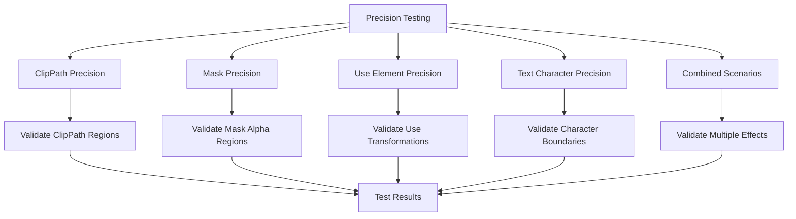

**Diagram sources**
- [hit_test_precision_test.dart:1-800](file://test/animation/hit_test_precision_test.dart#L1-L800)

The precision testing covers:
- **ClipPath scenarios** with objectBoundingBox units and nested clip paths
- **Mask precision** with alpha channel validation and luminance support
- **Use element transformations** including viewBox scaling and pointer-events inheritance
- **Text character-level precision** with dx offsets and rotation
- **Combined effects** where multiple precision factors interact

**Section sources**
- [hit_test_precision_test.dart:1-1006](file://test/animation/hit_test_precision_test.dart#L1-L1006)

## Dependency Analysis

The hit testing system maintains loose coupling between components while ensuring comprehensive coverage:

```mermaid
graph TB
subgraph "Core Dependencies"
A[animated_svg_picture.dart] --> B[hit_test_traversal.dart]
A --> C[hit_test_visibility.dart]
A --> D[hit_test_geometry.dart]
A --> E[hit_test_text_runs.dart]
A --> F[hit_test_advanced.dart]
A --> G[hit_test_use.dart]
A --> H[hit_test_text_layout.dart]
A --> I[hit_test_text_path_segments.dart]
A --> J[event_dispatcher.dart]
A --> K[pointer_events.dart]
A --> L[utils.dart]
A --> M[path_parser.dart]
A --> N[event_model.dart]
end
subgraph "Shared Utilities"
O[svg_dom.dart] --> B
O --> C
O --> D
O --> E
O --> F
O --> G
O --> H
O --> I
O --> J
O --> K
O --> L
O --> M
O --> N
P[svg_transform.dart] --> B
P --> C
P --> D
P --> E
P --> F
P --> G
P --> H
P --> I
P --> M
Q[path_parser.dart] --> D
Q --> F
Q --> H
Q --> I
Q --> L
R[svg_event.dart] --> J
R --> S[event_dispatcher.dart]
T[pointer_events_system] --> J
U[event_model.dart] --> N
end
```

**Diagram sources**
- [animated_svg_picture.dart:24-42](file://lib/src/animation/animated_svg_picture.dart#L24-L42)

The dependency structure ensures:
- **Modular design** with clear separation of concerns
- **Reusability** through shared utility functions
- **Testability** with isolated component testing
- **Maintainability** through well-defined interfaces

**Section sources**
- [animated_svg_picture.dart:1-200](file://lib/src/animation/animated_svg_picture.dart#L1-L200)

## Performance Considerations

The advanced hit testing system implements several optimization strategies:

### Caching and Memoization
- **Hit test cache** per frame to avoid redundant calculations
- **Transform matrix caching** to minimize expensive matrix operations
- **Geometry path caching** for frequently accessed elements

### Early Termination Strategies
- **Short-circuit evaluation** for definition-only elements
- **Display none optimization** to skip invisible elements
- **Bounding box culling** before detailed geometry testing

### Memory Management
- **Object pooling** for temporary calculation objects
- **Lazy evaluation** for complex geometric operations
- **Weak references** for event target registries

### Algorithmic Optimizations
- **Spatial partitioning** for large SVG documents
- **Hierarchical culling** using bounding boxes
- **Early exit conditions** for pointer-events none
- **Tolerance-based optimization** to reduce path sampling

## Troubleshooting Guide

### Common Issues and Solutions

**Issue: Markers not responding to clicks**
- Verify marker orientation settings (auto vs fixed angle)
- Check marker units (userspaceonuse vs objectBoundingBox)
- Ensure marker viewBox is properly defined

**Issue: Text hit-testing inaccurate**
- Confirm text-anchor alignment settings
- Verify letter-spacing and word-spacing values
- Check for rotated text characters requiring special handling

**Issue: Complex path fill-rule incorrect**
- Review path topology for self-intersections
- Check for degenerate segments causing edge cases
- Verify evenodd fill-rule compatibility

**Issue: Use element events not firing**
- Ensure proper use element references
- Check pointer-events inheritance across shadow boundaries
- Verify event retargeting compliance

**Issue: Stroke hit-testing too sensitive or insensitive**
- Adjust stroke-width values appropriately
- Check line-cap settings affecting endpoint tolerance
- Verify pointer-events mode configuration

**Issue: Foreign object elements not responding**
- Check requiredExtensions attribute values
- Verify foreignObject viewport clipping
- Ensure proper overflow handling

**Issue: Precision testing failures**
- Validate clipPath units (objectBoundingBox vs userspaceonuse)
- Check mask alpha channel values and luminance support
- Verify use element transformations and viewBox scaling
- Test text character positioning with dx/rotate attributes
- Ensure circular reference prevention in nested clipPath/mask scenarios

**Section sources**
- [hit_test_advanced_features_test.dart:1-604](file://test/animation/hit_test_advanced_features_test.dart#L1-L604)
- [hit_test_precision_test.dart:1-1006](file://test/animation/hit_test_precision_test.dart#L1-L1006)

## Conclusion

The Advanced Hit Testing Features provide a comprehensive solution for precise SVG element interaction, implementing sophisticated algorithms that exceed standard browser capabilities. The system's modular architecture, W3C DOM compliance, and extensive edge case handling make it suitable for complex interactive SVG applications.

Key achievements include:
- **Pixel-perfect accuracy** through glyph-precision text hit-testing
- **Robust path handling** with advanced evenodd fill-rule support
- **Complete event model compliance** with shadow DOM integration
- **Performance optimization** through strategic caching and early termination
- **Extensive test coverage** validating real-world scenarios
- **Comprehensive element support** covering all major SVG elements
- **Advanced pointer events semantics** with tolerance-based hit testing
- **Enhanced event handling capabilities** with W3C DOM compliance
- **Improved hit testing traversal** with event boundary detection
- **Advanced precision testing capabilities** for complex interaction scenarios
- **Enhanced clipPath precision** with objectBoundingBox coordinate transformation
- **Advanced mask hit testing** with luminance alpha support and recursion prevention
- **Strengthened use element delegation** with comprehensive pointer-events inheritance

The implementation serves as a foundation for building highly interactive SVG experiences while maintaining compatibility with existing Flutter and SVG ecosystems.

**Updated** Enhanced with comprehensive pointer events semantics, stroke/fill tolerance-based hit testing, glyph-precision text hit testing, advanced use element event delegation, comprehensive precision testing capabilities, advanced clipPath precision with coordinate transformation, advanced mask hit testing with luminance support, and strengthened event delegation with pointer-events inheritance for complex geometric scenarios.