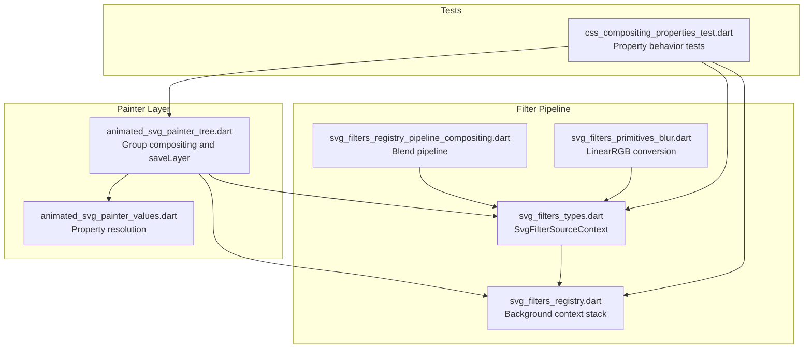
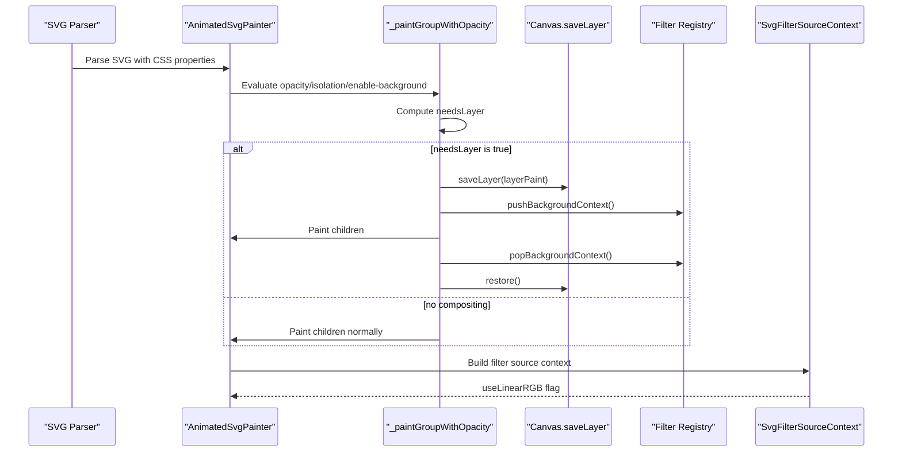
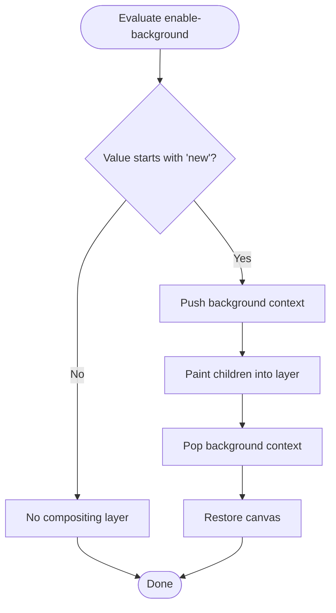
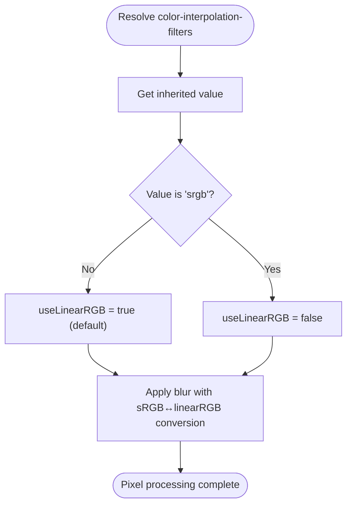
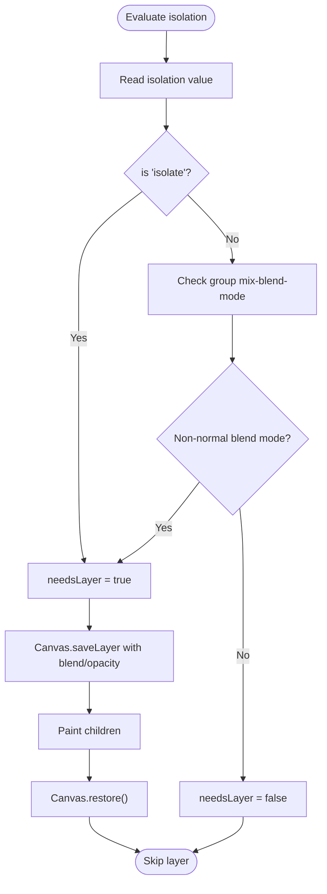
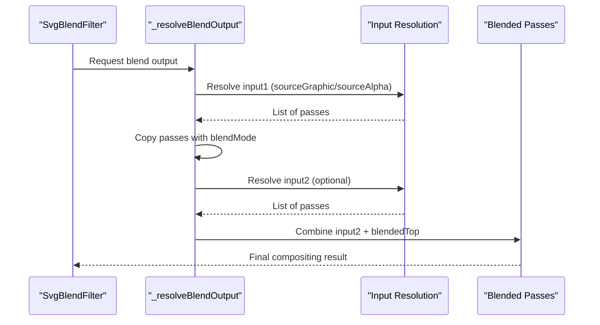
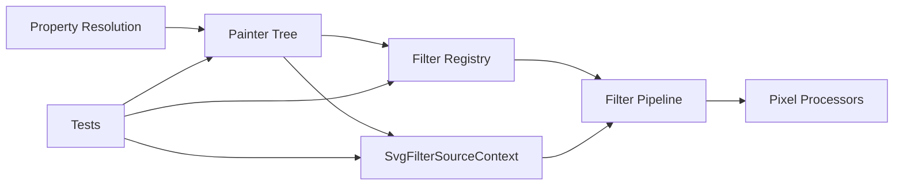

# CSS Compositing Properties

<cite>
**Referenced Files in This Document**
- [css_compositing_properties_test.dart](file://test/animation/css_compositing_properties_test.dart)
- [animated_svg_painter_tree.dart](file://lib/src/animation/animated_svg_painter_tree.dart)
- [svg_filters_types.dart](file://lib/src/animation/svg_filters_types.dart)
- [svg_filters.dart](file://lib/src/animation/svg_filters.dart)
- [svg_filters_registry.dart](file://lib/src/animation/svg_filters_registry.dart)
- [svg_filters_registry_pipeline_compositing.dart](file://lib/src/animation/svg_filters_registry_pipeline_compositing.dart)
- [svg_filters_primitives_blur.dart](file://lib/src/animation/svg_filters_primitives_blur.dart)
- [animated_svg_painter_values.dart](file://lib/src/animation/animated_svg_painter_values.dart)
</cite>

## Table of Contents
1. [Introduction](#introduction)
2. [Project Structure](#project-structure)
3. [Core Components](#core-components)
4. [Architecture Overview](#architecture-overview)
5. [Detailed Component Analysis](#detailed-component-analysis)
6. [Dependency Analysis](#dependency-analysis)
7. [Performance Considerations](#performance-considerations)
8. [Troubleshooting Guide](#troubleshooting-guide)
9. [Conclusion](#conclusion)

## Introduction
This document explains the implementation of CSS Compositing Properties in the Flutter SVG rendering engine. It focuses on three key properties: `enable-background`, `color-interpolation-filters`, and `isolation`. These properties control compositing boundaries, color space handling for filter operations, and blending behavior respectively. The implementation ensures Blink parity and integrates seamlessly with the existing filter pipeline and painter architecture.

## Project Structure
The CSS compositing features are implemented across several modules:
- Painter tree: Determines when compositing layers are needed and manages saveLayer usage.
- Filter registry: Manages background contexts for nested filter applications.
- Filter types and pipeline: Provides context objects and compositing-aware filter processing.
- Tests: Comprehensive coverage validating behavior across various scenarios.

**Diagram sources**
- [animated_svg_painter_tree.dart:324-434](file://lib/src/animation/animated_svg_painter_tree.dart#L324-L434)
- [animated_svg_painter_values.dart:468-480](file://lib/src/animation/animated_svg_painter_values.dart#L468-L480)
- [svg_filters_types.dart:237-257](file://lib/src/animation/svg_filters_types.dart#L237-L257)
- [svg_filters_registry.dart:76-116](file://lib/src/animation/svg_filters_registry.dart#L76-L116)
- [svg_filters_registry_pipeline_compositing.dart:1-43](file://lib/src/animation/svg_filters_registry_pipeline_compositing.dart#L1-L43)
- [svg_filters_primitives_blur.dart:132-164](file://lib/src/animation/svg_filters_primitives_blur.dart#L132-L164)
- [css_compositing_properties_test.dart:1-338](file://test/animation/css_compositing_properties_test.dart#L1-L338)

**Section sources**
- [animated_svg_painter_tree.dart:324-434](file://lib/src/animation/animated_svg_painter_tree.dart#L324-L434)
- [svg_filters_types.dart:237-257](file://lib/src/animation/svg_filters_types.dart#L237-L257)
- [svg_filters_registry.dart:76-116](file://lib/src/animation/svg_filters_registry.dart#L76-L116)
- [css_compositing_properties_test.dart:1-338](file://test/animation/css_compositing_properties_test.dart#L1-L338)

## Core Components
This section outlines the primary components involved in CSS compositing:

- Group compositing and saveLayer management:
  - Determines whether to create a compositing boundary based on opacity, isolation, enable-background, and group-level blend modes.
  - Uses Canvas.saveLayer to establish stacking contexts and background capture areas.

- Filter source context:
  - Encapsulates paint passes for fills/strokes and background inputs.
  - Carries the `useLinearRGB` flag to control color space conversion during filter processing.

- Background context stack:
  - Tracks nested enable-background contexts to ensure BackgroundImage/BackgroundAlpha refer to the correct background state.

- Property resolution:
  - Resolves `color-interpolation-filters` to determine linearRGB vs sRGB processing.
  - Resolves `isolation` and group-level `mix-blend-mode` for implicit isolation.

**Section sources**
- [animated_svg_painter_tree.dart:334-434](file://lib/src/animation/animated_svg_painter_tree.dart#L334-L434)
- [svg_filters_types.dart:237-257](file://lib/src/animation/svg_filters_types.dart#L237-L257)
- [svg_filters_registry.dart:76-116](file://lib/src/animation/svg_filters_registry.dart#L76-L116)
- [animated_svg_painter_values.dart:468-480](file://lib/src/animation/animated_svg_painter_values.dart#L468-L480)

## Architecture Overview
The CSS compositing architecture integrates property resolution, compositing decisions, and filter pipeline context management:

**Diagram sources**
- [animated_svg_painter_tree.dart:334-434](file://lib/src/animation/animated_svg_painter_tree.dart#L334-L434)
- [svg_filters_registry.dart:76-116](file://lib/src/animation/svg_filters_registry.dart#L76-L116)
- [svg_filters_types.dart:237-257](file://lib/src/animation/svg_filters_types.dart#L237-L257)

## Detailed Component Analysis

### Enable-Background Property
The `enable-background` property controls background capture for filter primitives. When set to `new`, it establishes a new background context that child filters can reference via `BackgroundImage` and `BackgroundAlpha`.

Key behaviors validated by tests:
- Rendering without errors for `enable-background: new` on groups.
- Proper resolution of `BackgroundImage` filter input when filters reference it.
- Acceptance of bounds parameters for the new background region.

Implementation highlights:
- Group compositing checks for `enable-background: new` and pushes/pops background context around child painting.
- The filter registry maintains an active background stack to resolve effective background inputs in nested contexts.

**Diagram sources**
- [animated_svg_painter_tree.dart:359-430](file://lib/src/animation/animated_svg_painter_tree.dart#L359-L430)
- [svg_filters_registry.dart:76-116](file://lib/src/animation/svg_filters_registry.dart#L76-L116)

**Section sources**
- [css_compositing_properties_test.dart:13-129](file://test/animation/css_compositing_properties_test.dart#L13-L129)
- [animated_svg_painter_tree.dart:359-430](file://lib/src/animation/animated_svg_painter_tree.dart#L359-L430)
- [svg_filters_registry.dart:76-116](file://lib/src/animation/svg_filters_registry.dart#L76-L116)

### Color-Interpolation-Filters Property
The `color-interpolation-filters` property determines whether filter primitives process pixel data in linearRGB or sRGB. The default is `linearRGB`.

Key behaviors validated by tests:
- Default behavior for filters without explicit setting.
- Explicit `sRGB` handling.
- Round-trip preservation and valid output generation when using linearRGB conversion in blur processing.

Implementation highlights:
- Property resolution returns true when `linearRGB` is used (default unless explicitly `sRGB`).
- Filter processors convert sRGB↔linearRGB around pixel operations when enabled.
- The `SvgFilterSourceContext` carries the `useLinearRGB` flag to downstream processors.

**Diagram sources**
- [animated_svg_painter_values.dart:468-480](file://lib/src/animation/animated_svg_painter_values.dart#L468-L480)
- [svg_filters_types.dart:237-257](file://lib/src/animation/svg_filters_types.dart#L237-L257)
- [svg_filters_primitives_blur.dart:132-164](file://lib/src/animation/svg_filters_primitives_blur.dart#L132-L164)

**Section sources**
- [css_compositing_properties_test.dart:134-247](file://test/animation/css_compositing_properties_test.dart#L134-L247)
- [animated_svg_painter_values.dart:468-480](file://lib/src/animation/animated_svg_painter_values.dart#L468-L480)
- [svg_filters_types.dart:237-257](file://lib/src/animation/svg_filters_types.dart#L237-L257)
- [svg_filters_primitives_blur.dart:132-164](file://lib/src/animation/svg_filters_primitives_blur.dart#L132-L164)

### Isolation Property
The `isolation: isolate` CSS property creates a new stacking context boundary, preventing `mix-blend-mode` from compositing with content behind the isolated group. Groups with non-normal `mix-blend-mode` implicitly create isolation.

Key behaviors validated by tests:
- Isolation creates a compositing boundary and allows internal blend modes to work correctly.
- `auto` does not force an extra layer.
- Implicit isolation occurs when a group has a non-normal `mix-blend-mode`.
- Isolation works correctly in combination with opacity.

Implementation highlights:
- Group compositing detects `isolation: isolate` and `mix-blend-mode` on the group.
- A saveLayer is created with appropriate blend mode and opacity settings.
- Background context is managed when `enable-background: new` is also present.

**Diagram sources**
- [animated_svg_painter_tree.dart:348-434](file://lib/src/animation/animated_svg_painter_tree.dart#L348-L434)

**Section sources**
- [css_compositing_properties_test.dart:252-336](file://test/animation/css_compositing_properties_test.dart#L252-L336)
- [animated_svg_painter_tree.dart:348-434](file://lib/src/animation/animated_svg_painter_tree.dart#L348-L434)

### Filter Pipeline Compositing
The filter pipeline compositing extension demonstrates how blend operations integrate with compositing boundaries. It resolves input passes and applies blend modes per pass, ensuring correct compositing order.

**Diagram sources**
- [svg_filters_registry_pipeline_compositing.dart:4-43](file://lib/src/animation/svg_filters_registry_pipeline_compositing.dart#L4-L43)

**Section sources**
- [svg_filters_registry_pipeline_compositing.dart:4-43](file://lib/src/animation/svg_filters_registry_pipeline_compositing.dart#L4-L43)

## Dependency Analysis
The compositing features depend on coordinated behavior across modules:

- Painter tree depends on property resolution and filter registry state.
- Filter registry provides background context for nested filter scenarios.
- Filter types define the context object consumed by processors.
- Tests validate end-to-end behavior across compositing boundaries.

**Diagram sources**
- [animated_svg_painter_values.dart:468-480](file://lib/src/animation/animated_svg_painter_values.dart#L468-L480)
- [animated_svg_painter_tree.dart:334-434](file://lib/src/animation/animated_svg_painter_tree.dart#L334-L434)
- [svg_filters_registry.dart:76-116](file://lib/src/animation/svg_filters_registry.dart#L76-L116)
- [svg_filters_types.dart:237-257](file://lib/src/animation/svg_filters_types.dart#L237-L257)
- [css_compositing_properties_test.dart:1-338](file://test/animation/css_compositing_properties_test.dart#L1-L338)

**Section sources**
- [animated_svg_painter_values.dart:468-480](file://lib/src/animation/animated_svg_painter_values.dart#L468-L480)
- [animated_svg_painter_tree.dart:334-434](file://lib/src/animation/animated_svg_painter_tree.dart#L334-L434)
- [svg_filters_registry.dart:76-116](file://lib/src/animation/svg_filters_registry.dart#L76-L116)
- [svg_filters_types.dart:237-257](file://lib/src/animation/svg_filters_types.dart#L237-L257)
- [css_compositing_properties_test.dart:1-338](file://test/animation/css_compositing_properties_test.dart#L1-L338)

## Performance Considerations
- Compositing boundaries:
  - Using `saveLayer` introduces overhead; avoid unnecessary layers by ensuring only required nodes trigger compositing.
  - Combine opacity and blend mode into a single layer when possible to reduce draw calls.

- Color space conversion:
  - Converting between sRGB and linearRGB adds computational cost. Only enable `useLinearRGB` when required by filters or properties.

- Nested backgrounds:
  - Background context stack resolution is O(n) in the depth of nested contexts; minimize deep nesting for performance-sensitive content.

- Filter primitives:
  - Large standard deviations trigger box blur approximations to maintain responsiveness. Prefer smaller deviations or adjust filter chains for performance.

[No sources needed since this section provides general guidance]

## Troubleshooting Guide
Common issues and resolutions:

- Unexpected blending with background:
  - Ensure `isolation: isolate` is set on groups that should prevent cross-layer blending.
  - Verify that `mix-blend-mode` on the group creates implicit isolation.

- Filters not respecting color space:
  - Confirm `color-interpolation-filters` is not explicitly set to `sRGB` when expecting linearRGB behavior.
  - Check that `useLinearRGB` is correctly propagated via `SvgFilterSourceContext`.

- BackgroundImage not capturing intended content:
  - Verify `enable-background: new` is placed on the correct container element.
  - Ensure child filters reference `BackgroundImage` after the container with `enable-background: new`.

- Rendering errors with complex compositing:
  - Simplify layered effects and confirm that saveLayer usage aligns with property requirements.
  - Validate that nested filter contexts are properly pushed/popped.

**Section sources**
- [css_compositing_properties_test.dart:13-336](file://test/animation/css_compositing_properties_test.dart#L13-L336)
- [animated_svg_painter_tree.dart:359-430](file://lib/src/animation/animated_svg_painter_tree.dart#L359-L430)
- [svg_filters_types.dart:237-257](file://lib/src/animation/svg_filters_types.dart#L237-L257)

## Conclusion
The CSS Compositing Properties implementation provides robust support for `enable-background`, `color-interpolation-filters`, and `isolation` with Blink parity. The solution integrates cleanly with the painter tree, filter registry, and filter pipeline, ensuring correct compositing boundaries, accurate color space handling, and predictable blending behavior. Thorough testing validates these features across diverse scenarios, enabling reliable production rendering of complex SVG compositions.