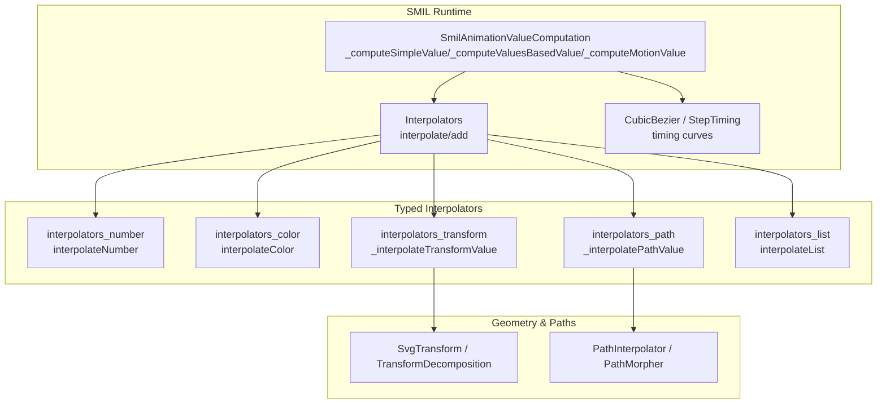
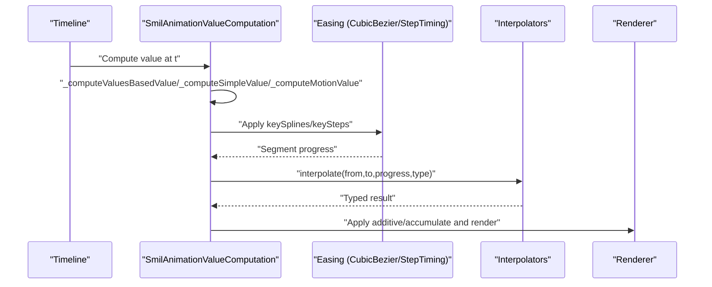
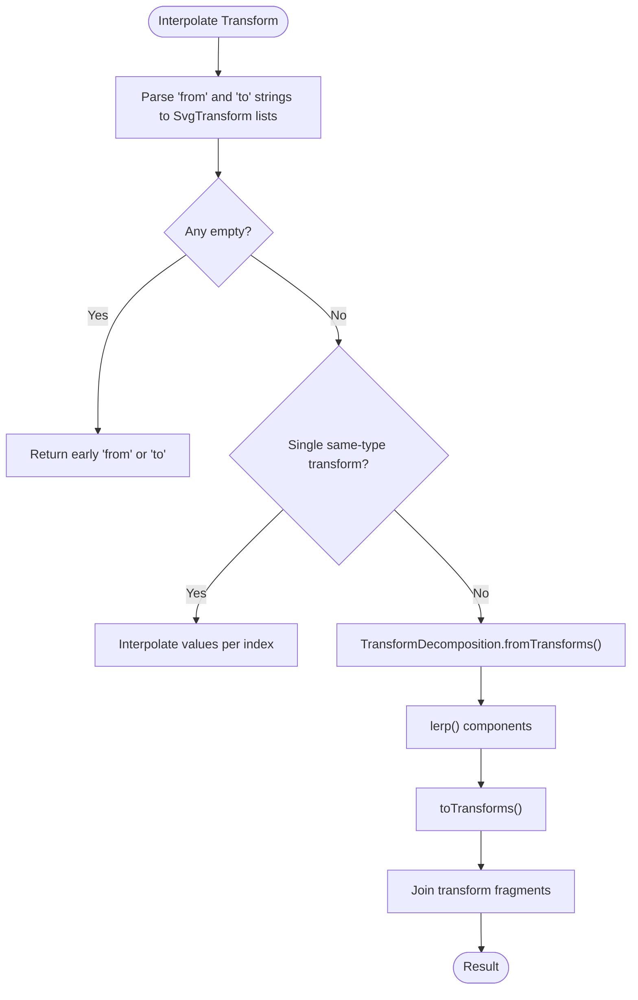
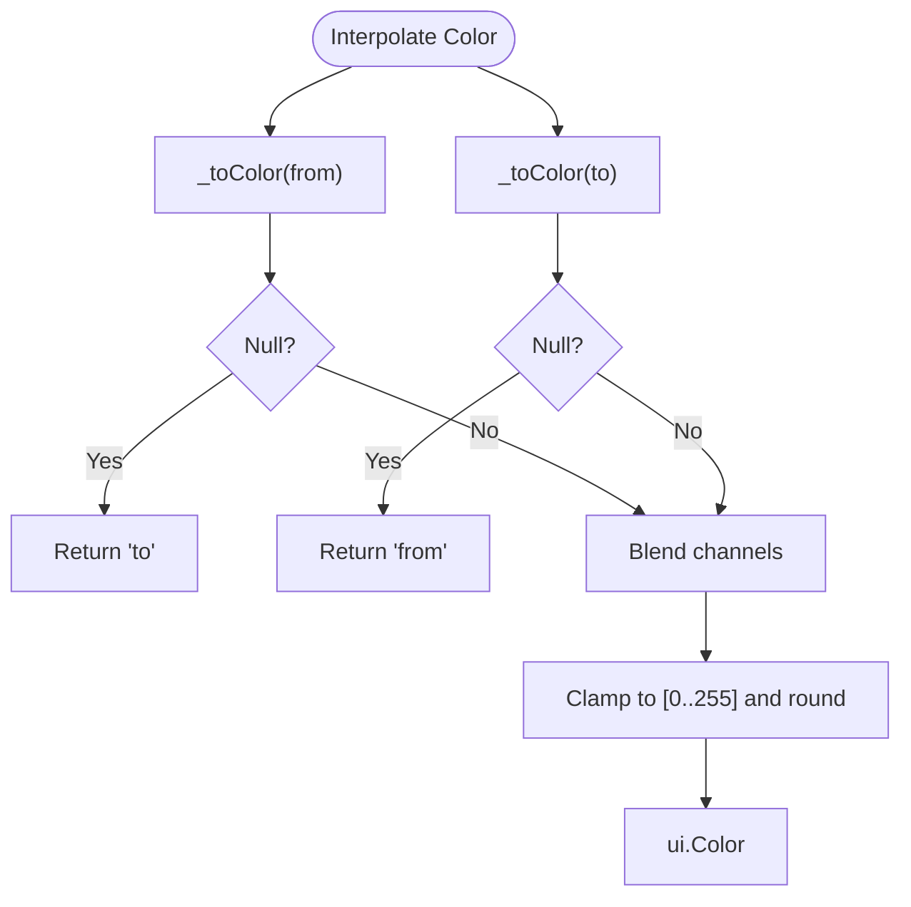
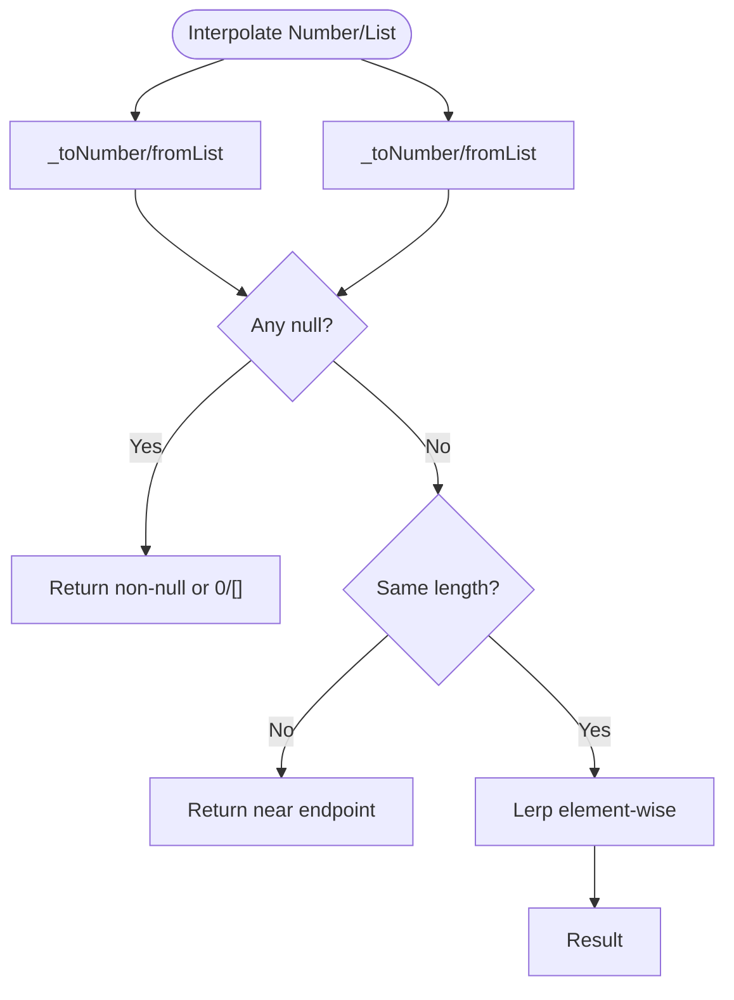
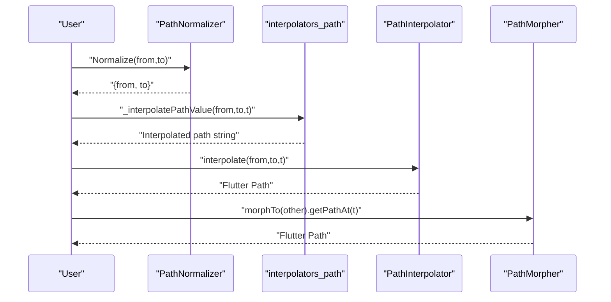
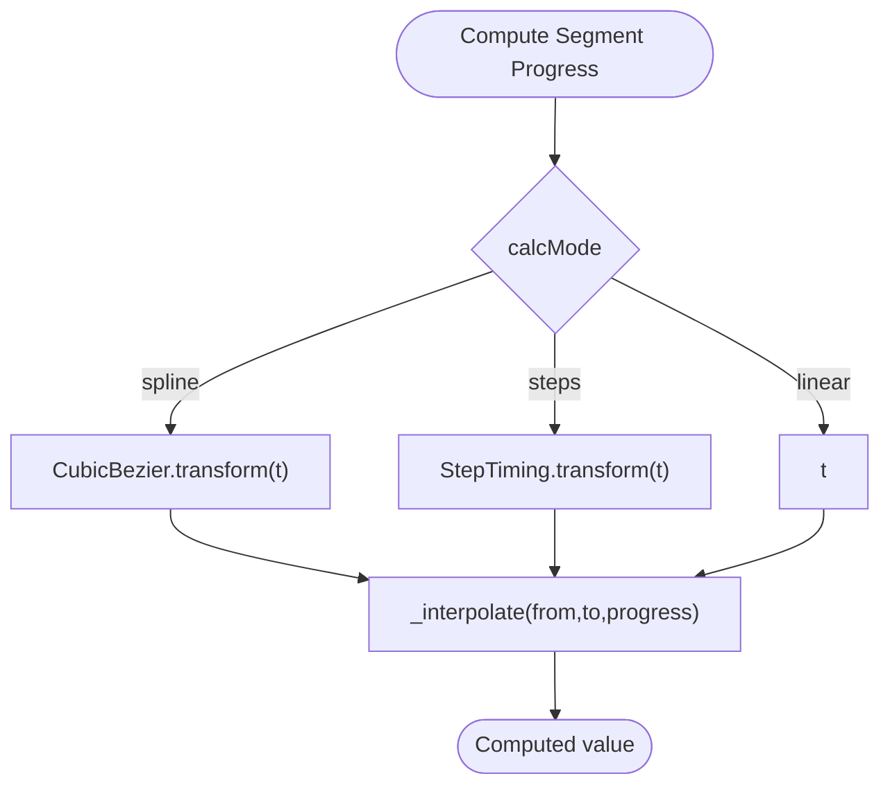
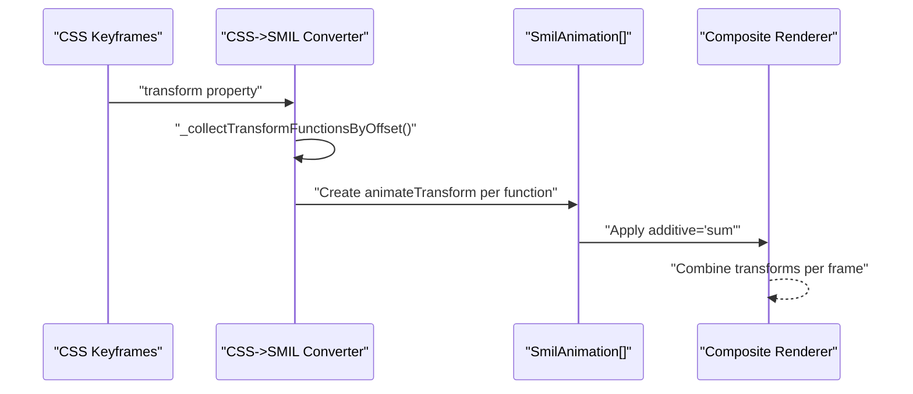
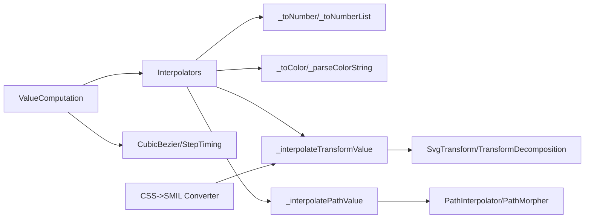

# Complex Interpolation Systems

<cite>
**Referenced Files in This Document**
- [interpolators.dart](file://lib/src/animation/smil/interpolators.dart)
- [interpolators_color_parsing.dart](file://lib/src/animation/smil/interpolators_color_parsing.dart)
- [interpolators_path.dart](file://lib/src/animation/smil/interpolators_path.dart)
- [interpolators_transform.dart](file://lib/src/animation/smil/interpolators_transform.dart)
- [svg_transform.dart](file://lib/src/animation/svg_transform.dart)
- [path_interpolation.dart](file://lib/src/animation/path_interpolation.dart)
- [path_interpolation_morpher.dart](file://lib/src/animation/path_interpolation_morpher.dart)
- [smil_animation_curves.dart](file://lib/src/animation/smil/smil_animation_curves.dart)
- [smil_animation_value_computation.dart](file://lib/src/animation/smil/smil_animation_value_computation.dart)
- [css_to_smil_converter_transforms_decompose.dart](file://lib/src/animation/css_to_smil_converter_transforms_decompose.dart)
- [color_animation_test.dart](file://test/animation/color_animation_test.dart)
- [transform_animation_test.dart](file://test/animation/transform_animation_test.dart)
- [smil_path_interpolation_test.dart](file://test/animation/smil_path_interpolation_test.dart)
- [interpolation_coords_test.dart](file://test/animation/interpolation_coords_test.dart)
</cite>

## Table of Contents
1. [Introduction](#introduction)
2. [Project Structure](#project-structure)
3. [Core Components](#core-components)
4. [Architecture Overview](#architecture-overview)
5. [Detailed Component Analysis](#detailed-component-analysis)
6. [Dependency Analysis](#dependency-analysis)
7. [Performance Considerations](#performance-considerations)
8. [Troubleshooting Guide](#troubleshooting-guide)
9. [Conclusion](#conclusion)
10. [Appendices](#appendices)

## Introduction
This document explains the complex interpolation systems powering advanced animations in the project. It covers:
- Transform interpolators for matrix and composite transformations
- Color interpolators for smooth color transitions
- Number and list interpolators for scalar and dimensional values
- Path interpolators for SVG path morphing
- Easing functions and timing computation
- Combined interpolations, custom strategies, and performance optimizations
- Accuracy, edge cases, and debugging approaches

## Project Structure
The interpolation system is organized around typed interpolators and SMIL-driven value computation. Key modules:
- Typed interpolators for numbers, colors, transforms, paths, and lists
- Path morphing utilities for normalized path interpolation
- Timing curves (Bezier splines and step functions) and value computation
- CSS-to-SMIL transform decomposition for compound transforms

**Diagram sources**
- [smil_animation_value_computation.dart:150-232](file://lib/src/animation/smil/smil_animation_value_computation.dart#L150-L232)
- [interpolators.dart:19-146](file://lib/src/animation/smil/interpolators.dart#L19-L146)
- [interpolators_color_parsing.dart:52-114](file://lib/src/animation/smil/interpolators_color_parsing.dart#L52-L114)
- [interpolators_transform.dart:3-58](file://lib/src/animation/smil/interpolators_transform.dart#L3-L58)
- [interpolators_path.dart:3-87](file://lib/src/animation/smil/interpolators_path.dart#L3-L87)
- [svg_transform.dart:128-331](file://lib/src/animation/svg_transform.dart#L128-L331)
- [path_interpolation.dart:15-95](file://lib/src/animation/path_interpolation.dart#L15-L95)
- [smil_animation_curves.dart:5-108](file://lib/src/animation/smil/smil_animation_curves.dart#L5-L108)

**Section sources**
- [interpolators.dart:1-148](file://lib/src/animation/smil/interpolators.dart#L1-L148)
- [smil_animation_value_computation.dart:1-233](file://lib/src/animation/smil/smil_animation_value_computation.dart#L1-L233)
- [smil_animation_curves.dart:1-109](file://lib/src/animation/smil/smil_animation_curves.dart#L1-L109)
- [svg_transform.dart:1-332](file://lib/src/animation/svg_transform.dart#L1-L332)
- [path_interpolation.dart:1-96](file://lib/src/animation/path_interpolation.dart#L1-L96)

## Core Components
- Interpolators: Central dispatcher for typed interpolation and additive accumulation.
- Color interpolator: Parses and blends ARGB channels with clamping.
- Transform interpolator: Single-transform linear interpolation and multi-transform decomposition-lerp-decomposition reconstruction.
- Path interpolator: Normalized path command interpolation with cubic Bezier and move-to support.
- Timing curves: Cubic Bezier and step-based easing for keySplines and steps.
- Value computation: Computes discrete, values-based, and motion values with easing and additive/accumulate semantics.

**Section sources**
- [interpolators.dart:19-146](file://lib/src/animation/smil/interpolators.dart#L19-L146)
- [interpolators_color_parsing.dart:52-114](file://lib/src/animation/smil/interpolators_color_parsing.dart#L52-L114)
- [interpolators_transform.dart:3-58](file://lib/src/animation/smil/interpolators_transform.dart#L3-L58)
- [interpolators_path.dart:3-87](file://lib/src/animation/smil/interpolators_path.dart#L3-L87)
- [smil_animation_curves.dart:5-108](file://lib/src/animation/smil/smil_animation_curves.dart#L5-L108)
- [smil_animation_value_computation.dart:150-232](file://lib/src/animation/smil/smil_animation_value_computation.dart#L150-L232)

## Architecture Overview
The system composes typed interpolation with SMIL timing and value computation. For each animation frame:
- Time is mapped via easing (keySplines/steps) to a segment progress
- Values are selected (discrete/values-based/simple/motion)
- Interpolators compute the typed result
- Additive/accumulate semantics combine with base values

**Diagram sources**
- [smil_animation_value_computation.dart:26-100](file://lib/src/animation/smil/smil_animation_value_computation.dart#L26-L100)
- [smil_animation_curves.dart:24-44](file://lib/src/animation/smil/smil_animation_curves.dart#L24-L44)
- [interpolators.dart:19-42](file://lib/src/animation/smil/interpolators.dart#L19-L42)

## Detailed Component Analysis

### Transform Interpolators
Transform interpolation supports:
- Single transform: Linearly interpolate numeric values of the same transform type
- Composite transforms: Decompose matrices/transforms into translation, rotation, scale, skew; interpolate components; recompose

**Diagram sources**
- [interpolators_transform.dart:3-35](file://lib/src/animation/smil/interpolators_transform.dart#L3-L35)
- [svg_transform.dart:150-252](file://lib/src/animation/svg_transform.dart#L150-L252)

**Section sources**
- [interpolators_transform.dart:3-58](file://lib/src/animation/smil/interpolators_transform.dart#L3-L58)
- [svg_transform.dart:128-331](file://lib/src/animation/svg_transform.dart#L128-L331)

### Color Interpolators
Color interpolation:
- Parses strings to ui.Color (hex, rgb/rgba, named)
- Blends ARGB channels with integer lerp and clamp to [0..255]
- Handles edge cases for null inputs

**Diagram sources**
- [interpolators_color_parsing.dart:52-114](file://lib/src/animation/smil/interpolators_color_parsing.dart#L52-L114)
- [interpolators.dart:55-86](file://lib/src/animation/smil/interpolators.dart#L55-L86)

**Section sources**
- [interpolators_color_parsing.dart:17-114](file://lib/src/animation/smil/interpolators_color_parsing.dart#L17-L114)
- [interpolators.dart:55-86](file://lib/src/animation/smil/interpolators.dart#L55-L86)

### Number and List Interpolators
- Numbers: Convert to double and lerp
- Lists: Convert to number lists; mismatched lengths fall back to nearest endpoint; equal-length lists lerp element-wise

**Diagram sources**
- [interpolators.dart:44-111](file://lib/src/animation/smil/interpolators.dart#L44-L111)
- [interpolators_color_parsing.dart:3-50](file://lib/src/animation/smil/interpolators_color_parsing.dart#L3-L50)

**Section sources**
- [interpolators.dart:44-111](file://lib/src/animation/smil/interpolators.dart#L44-L111)
- [interpolators_color_parsing.dart:3-50](file://lib/src/animation/smil/interpolators_color_parsing.dart#L3-L50)

### Path Interpolators
Two complementary implementations:
- SMIL path interpolator: Normalizes path commands, interpolates supported command types, and reconstructs path strings
- PathInterpolator/PathMorpher: Operates on normalized command lists, returns Flutter Path objects for rendering

**Diagram sources**
- [interpolators_path.dart:3-33](file://lib/src/animation/smil/interpolators_path.dart#L3-L33)
- [path_interpolation.dart:26-65](file://lib/src/animation/path_interpolation.dart#L26-L65)
- [path_interpolation_morpher.dart:24-38](file://lib/src/animation/path_interpolation_morpher.dart#L24-L38)

**Section sources**
- [interpolators_path.dart:3-87](file://lib/src/animation/smil/interpolators_path.dart#L3-L87)
- [path_interpolation.dart:15-95](file://lib/src/animation/path_interpolation.dart#L15-L95)
- [path_interpolation_morpher.dart:6-52](file://lib/src/animation/path_interpolation_morpher.dart#L6-L52)

### Easing Functions and Timing
- CubicBezier: Solves inverse Bezier via Newton iteration to map linear time to eased progress
- StepTiming: Discrete step function for keySteps
- Value computation applies easing to segment progress and selects values (discrete/values-based/simple/motion)

**Diagram sources**
- [smil_animation_value_computation.dart:66-77](file://lib/src/animation/smil/smil_animation_value_computation.dart#L66-L77)
- [smil_animation_curves.dart:24-44](file://lib/src/animation/smil/smil_animation_curves.dart#L24-L44)
- [smil_animation_curves.dart:97-107](file://lib/src/animation/smil/smil_animation_curves.dart#L97-L107)

**Section sources**
- [smil_animation_curves.dart:5-108](file://lib/src/animation/smil/smil_animation_curves.dart#L5-L108)
- [smil_animation_value_computation.dart:26-77](file://lib/src/animation/smil/smil_animation_value_computation.dart#L26-L77)

### Combined Interpolations and Custom Strategies
- Compound transforms: CSS-to-SMIL converter decomposes compound transforms into atomic SMIL animateTransform instances (translate, rotate, scale, skewX, matrix), each animated independently and summed via additive composition.
- Custom interpolation strategies:
  - Pre-normalize paths and reuse normalized forms for repeated interpolation (PathMorpher)
  - Choose calcMode and keySplines/keySteps to tailor perceived motion
  - Use additive/accumulate to chain or sum repeated animations

**Diagram sources**
- [css_to_smil_converter_transforms_decompose.dart:3-34](file://lib/src/animation/css_to_smil_converter_transforms_decompose.dart#L3-L34)
- [css_to_smil_converter_transforms_decompose.dart:102-183](file://lib/src/animation/css_to_smil_converter_transforms_decompose.dart#L102-L183)

**Section sources**
- [css_to_smil_converter_transforms_decompose.dart:3-183](file://lib/src/animation/css_to_smil_converter_transforms_decompose.dart#L3-L183)

## Dependency Analysis
- Interpolators depend on typed parsers (numbers, colors, lists) and geometry helpers (SvgTransform, TransformDecomposition)
- Path interpolation depends on path parsing and normalization utilities
- Value computation depends on easing curves and Interpolators
- CSS-to-SMIL converter depends on transform parsing and decomposition

**Diagram sources**
- [interpolators.dart:19-146](file://lib/src/animation/smil/interpolators.dart#L19-L146)
- [interpolators_color_parsing.dart:3-114](file://lib/src/animation/smil/interpolators_color_parsing.dart#L3-L114)
- [interpolators_transform.dart:3-35](file://lib/src/animation/smil/interpolators_transform.dart#L3-L35)
- [interpolators_path.dart:3-33](file://lib/src/animation/smil/interpolators_path.dart#L3-L33)
- [svg_transform.dart:128-331](file://lib/src/animation/svg_transform.dart#L128-L331)
- [path_interpolation.dart:15-95](file://lib/src/animation/path_interpolation.dart#L15-L95)
- [smil_animation_curves.dart:5-108](file://lib/src/animation/smil/smil_animation_curves.dart#L5-L108)
- [css_to_smil_converter_transforms_decompose.dart:3-34](file://lib/src/animation/css_to_smil_converter_transforms_decompose.dart#L3-L34)

**Section sources**
- [interpolators.dart:1-148](file://lib/src/animation/smil/interpolators.dart#L1-L148)
- [svg_transform.dart:1-332](file://lib/src/animation/svg_transform.dart#L1-L332)
- [path_interpolation.dart:1-96](file://lib/src/animation/path_interpolation.dart#L1-L96)
- [smil_animation_curves.dart:1-109](file://lib/src/animation/smil/smil_animation_curves.dart#L1-L109)
- [css_to_smil_converter_transforms_decompose.dart:1-184](file://lib/src/animation/css_to_smil_converter_transforms_decompose.dart#L1-L184)

## Performance Considerations
- Pre-normalize paths once and reuse normalized forms for repeated interpolation (PathMorpher)
- Prefer numeric lists for frequent updates; avoid repeated parsing
- Use additive='sum' judiciously to avoid excessive recomposition overhead
- Clamp t to [0,1] early to prevent unnecessary work
- Cache MotionPath instances when animating along the same path
- Minimize color string parsing by passing ui.Color objects where possible

[No sources needed since this section provides general guidance]

## Troubleshooting Guide
Common issues and resolutions:
- Transform interpolation produces unexpected results when mixing different transform types; ensure single-type transforms or rely on decomposition-lerp-recomposition
- Color interpolation fails on malformed strings; validate inputs or pass ui.Color directly
- Path interpolation errors occur when paths are incompatible; ensure both paths are normalized and have matching command counts/types
- Timing artifacts with keySplines/steps; verify control points and step counts
- Additive/accumulate mismatches; confirm base values exist and types align

**Section sources**
- [interpolators_transform.dart:7-9](file://lib/src/animation/smil/interpolators_transform.dart#L7-L9)
- [interpolators_color_parsing.dart:60-114](file://lib/src/animation/smil/interpolators_color_parsing.dart#L60-L114)
- [interpolators_path.dart:30-33](file://lib/src/animation/smil/interpolators_path.dart#L30-L33)
- [smil_animation_value_computation.dart:167-189](file://lib/src/animation/smil/smil_animation_value_computation.dart#L167-L189)
- [transform_animation_test.dart](file://test/animation/transform_animation_test.dart)
- [color_animation_test.dart](file://test/animation/color_animation_test.dart)
- [smil_path_interpolation_test.dart](file://test/animation/smil_path_interpolation_test.dart)
- [interpolation_coords_test.dart](file://test/animation/interpolation_coords_test.dart)

## Conclusion
The interpolation system combines robust typed interpolation, precise geometric decomposition, and flexible timing controls to enable advanced animations. By leveraging pre-normalized paths, component-wise transform decomposition, and carefully tuned easing, developers can achieve smooth, accurate, and performant animations across numbers, colors, transforms, and paths.

[No sources needed since this section summarizes without analyzing specific files]

## Appendices

### Mathematical Foundations
- Linear interpolation: value = a + (b - a) * t
- Color blending: channel = round(a + (b - a) * t), clamped to [0..255]
- Bezier easing: invert x(t)=t to get t for given progress, then compute y(t)
- Transform decomposition: extract translate, rotate, scale, skew from concatenated transforms for stable interpolation

**Section sources**
- [interpolators.dart:44-53](file://lib/src/animation/smil/interpolators.dart#L44-L53)
- [interpolators_color_parsing.dart:52-54](file://lib/src/animation/smil/interpolators_color_parsing.dart#L52-L54)
- [smil_animation_curves.dart:24-44](file://lib/src/animation/smil/smil_animation_curves.dart#L24-L44)
- [svg_transform.dart:263-330](file://lib/src/animation/svg_transform.dart#L263-L330)