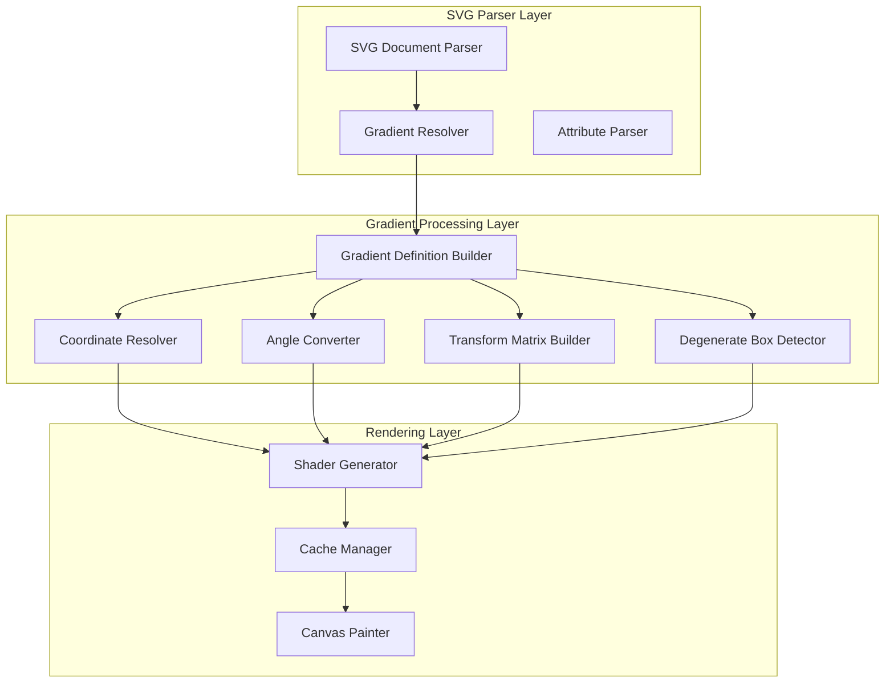
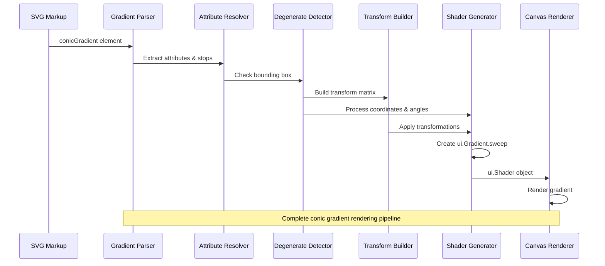
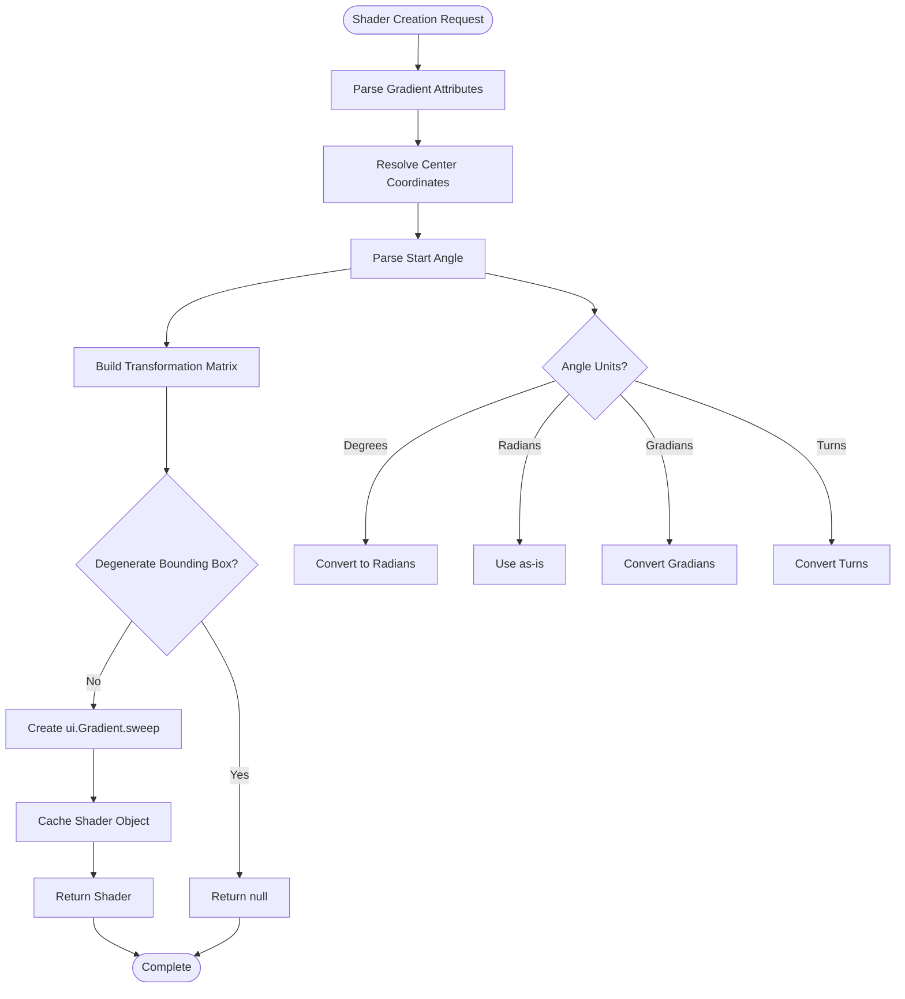

# Conic Gradient Support

<cite>
**Referenced Files in This Document**
- [animated_svg_painter_gradients.dart](file://lib/src/animation/animated_svg_painter_gradients.dart)
- [animated_svg_painter_gradients_resolver.dart](file://lib/src/animation/animated_svg_painter_gradients_resolver.dart)
- [animated_svg_painter_gradients_values.dart](file://lib/src/animation/animated_svg_painter_gradients_values.dart)
- [animated_svg_painter_matrix.dart](file://lib/src/animation/animated_svg_painter_matrix.dart)
- [gradient_pattern_advanced_test.dart](file://test/animation/gradient_pattern_advanced_test.dart)
- [animated_svg_painter.dart](file://lib/src/animation/animated_svg_painter.dart)
- [SVGGradientElement.h](file://blink-b87d44f-Source-core-svg/SVGGradientElement.h)
- [SVGLinearGradientElement.h](file://blink-b87d44f-Source-core-svg/SVGLinearGradientElement.h)
- [SVGRadialGradientElement.h](file://blink-b87d44f-Source-core-svg/SVGRadialGradientElement.h)
- [SVGAngle.cpp](file://blink-b87d44f-Source-core-svg/SVGAngle.cpp)
- [SVGAngle.h](file://blink-b87d44f-Source-core-svg/SVGAngle.h)
</cite>

## Update Summary
**Changes Made**
- Enhanced conic gradient implementation with comprehensive angle parsing for degrees/radians/gradians/turns using regular expressions
- Added advanced transformation matrix support for gradientTransform attributes with full SVG transform chain processing
- Implemented robust degenerate bounding box detection with sub-pixel threshold validation
- Improved coordinate system handling for both userSpaceOnUse and objectBoundingBox modes
- Expanded test coverage for conic gradients with comprehensive unit testing including angle unit parsing
- Added comprehensive caching strategy for performance optimization

## Table of Contents
1. [Introduction](#introduction)
2. [Project Structure](#project-structure)
3. [Core Components](#core-components)
4. [Architecture Overview](#architecture-overview)
5. [Detailed Component Analysis](#detailed-component-analysis)
6. [Implementation Details](#implementation-details)
7. [Testing Framework](#testing-framework)
8. [Performance Considerations](#performance-considerations)
9. [Troubleshooting Guide](#troubleshooting-guide)
10. [Conclusion](#conclusion)

## Introduction

Conic Gradient Support represents a significant enhancement to the Flutter SVG library, enabling the rendering of conic (sweep) gradients as defined in the SVG specification. This implementation allows developers to create radial color transitions around a central point, commonly used for creating circular color pickers, progress indicators, and other radial visual effects.

The conic gradient implementation leverages Flutter's native `ui.Gradient.sweep` capabilities while providing comprehensive SVG attribute support including center positioning, angle offsets, color interpolation, and various unit systems. This feature extends the existing gradient rendering pipeline to support a fourth major gradient type alongside linear, radial, and pattern-based gradients.

**Updated** Enhanced with comprehensive angle parsing using regular expressions for degrees/radians/gradians/turns, advanced transformation matrix handling with full SVG transform chain processing, robust degenerate bounding box detection with sub-pixel threshold validation, and improved coordinate system support for both userSpaceOnUse and objectBoundingBox modes.

## Project Structure

The conic gradient implementation is integrated into the broader Flutter SVG animation system, with specialized components handling gradient resolution, parsing, and rendering. The implementation follows a modular architecture that maintains compatibility with existing SVG gradient functionality while extending support to conic gradients.

**Diagram sources**
- [animated_svg_painter_gradients.dart:143-281](file://lib/src/animation/animated_svg_painter_gradients.dart#L143-L281)
- [animated_svg_painter_gradients_resolver.dart:1-159](file://lib/src/animation/animated_svg_painter_gradients_resolver.dart#L1-L159)
- [animated_svg_painter_gradients_values.dart:7-21](file://lib/src/animation/animated_svg_painter_gradients_values.dart#L7-L21)
- [animated_svg_painter_matrix.dart:4-185](file://lib/src/animation/animated_svg_painter_matrix.dart#L4-L185)

**Section sources**
- [animated_svg_painter_gradients.dart:1-311](file://lib/src/animation/animated_svg_painter_gradients.dart#L1-L311)
- [animated_svg_painter_gradients_resolver.dart:1-159](file://lib/src/animation/animated_svg_painter_gradients_resolver.dart#L1-L159)

## Core Components

The conic gradient implementation consists of several interconnected components that work together to parse SVG conic gradient definitions, resolve coordinate systems, convert angle units, handle transformations, and generate Flutter shaders.

### Gradient Resolution Engine

The gradient resolution engine handles the parsing and inheritance of conic gradient attributes from SVG markup. It processes the `conicGradient` element and its associated `stop` children, extracting color stops and gradient parameters while supporting SVG's inheritance model through the `xlink:href` mechanism.

### Coordinate System Resolver

The coordinate system resolver translates SVG percentage-based coordinates into device-independent pixel values based on the target element's bounding box. It supports both `objectBoundingBox` (percentage-based) and `userSpaceOnUse` (absolute pixel) coordinate systems.

### Enhanced Angle Unit Converter

The enhanced angle unit converter provides comprehensive support for multiple angle measurement systems including degrees (default), radians, gradians, and turns, converting all inputs to radians for internal processing and Flutter rendering compatibility. The implementation uses regular expressions for precise parsing of angle values with units.

### Advanced Transform Matrix Builder

The advanced transform matrix builder processes gradientTransform attributes, combining multiple transformation operations including translate, scale, rotate, skew, and matrix transformations into a single transformation matrix for gradient rendering. The system supports complex transform chains with full SVG specification compliance.

### Degenerate Bounding Box Detector

The degenerate bounding box detector identifies edge cases where gradients cannot be rendered properly, such as zero-width/height rectangles, extremely small dimensions, and line-like shapes. The detector includes sub-pixel threshold validation to prevent numerical instability in gradient calculations.

### Shader Generator

The shader generator creates Flutter-compatible gradient shaders using `ui.Gradient.sweep`, applying transformations for center positioning, angle offsets, and optional gradient transforms while maintaining proper color interpolation.

**Section sources**
- [animated_svg_painter_gradients.dart:143-281](file://lib/src/animation/animated_svg_painter_gradients.dart#L143-L281)
- [animated_svg_painter_gradients_resolver.dart:28-69](file://lib/src/animation/animated_svg_painter_gradients_resolver.dart#L28-L69)
- [animated_svg_painter_gradients_values.dart:7-21](file://lib/src/animation/animated_svg_painter_gradients_values.dart#L7-L21)
- [animated_svg_painter_matrix.dart:4-185](file://lib/src/animation/animated_svg_painter_matrix.dart#L4-L185)

## Architecture Overview

The conic gradient architecture follows a layered approach that integrates seamlessly with the existing SVG rendering pipeline. The system maintains backward compatibility while extending functionality to support conic gradients through a unified interface.

**Diagram sources**
- [animated_svg_painter_gradients.dart:103-154](file://lib/src/animation/animated_svg_painter_gradients.dart#L103-L154)
- [animated_svg_painter_gradients_resolver.dart:4-69](file://lib/src/animation/animated_svg_painter_gradients_resolver.dart#L4-L69)
- [animated_svg_painter_gradients_values.dart:7-21](file://lib/src/animation/animated_svg_painter_gradients_values.dart#L7-L21)
- [animated_svg_painter_matrix.dart:9-185](file://lib/src/animation/animated_svg_painter_matrix.dart#L9-L185)

The architecture ensures that conic gradients integrate with the existing caching system, maintaining performance while providing new gradient capabilities. The implementation leverages Flutter's native gradient rendering capabilities while preserving SVG specification compliance.

**Section sources**
- [animated_svg_painter_gradients.dart:31-59](file://lib/src/animation/animated_svg_painter_gradients.dart#L31-L59)
- [animated_svg_painter_gradients.dart:218-281](file://lib/src/animation/animated_svg_painter_gradients.dart#L218-L281)

## Detailed Component Analysis

### Conic Gradient Shader Creation

The `_createConicGradientShader` method serves as the core implementation for generating conic gradients. This method handles the complete transformation pipeline from SVG attributes to Flutter shader objects.

**Diagram sources**
- [animated_svg_painter_gradients.dart:220-281](file://lib/src/animation/animated_svg_painter_gradients.dart#L220-L281)
- [animated_svg_painter_gradients.dart:283-309](file://lib/src/animation/animated_svg_painter_gradients.dart#L283-L309)
- [animated_svg_painter_gradients_values.dart:7-21](file://lib/src/animation/animated_svg_painter_gradients_values.dart#L7-L21)

The shader creation process involves several critical steps: coordinate resolution, angle conversion, transformation matrix construction, degenerate bounding box detection, and shader generation. Each step maintains SVG specification compliance while optimizing for Flutter's rendering pipeline.

### Enhanced Angle Unit Parsing System

The enhanced angle unit parsing system provides comprehensive support for multiple angle measurement systems used in SVG. The implementation uses regular expressions to precisely parse angle values with units, supporting degrees (default), radians, gradians, and turns.

The parsing logic follows SVG specification requirements and maintains precision throughout the conversion process. Each unit type has specific conversion factors: degrees to radians (π/180), gradians to radians (π/200), and turns to radians (2π).

**Updated** Enhanced with comprehensive unit parsing using regular expressions `RegExp(r'^([\d.+-]+)(deg|rad|grad|turn)?$')` to support all four angle unit types with precise mathematical conversions.

### Advanced Transformation Matrix Construction

The advanced transformation matrix construction combines multiple transformation operations including center positioning, angle rotation, and gradient-specific transformations. The matrix system supports complex transformations while maintaining mathematical accuracy.

The implementation constructs matrices in the correct order: translation to center, rotation by the start angle, and application of any gradient transform. This ensures proper rendering regardless of the gradient's position or orientation.

**Updated** Enhanced with gradient transform matrix handling that processes complex transform chains including translate, scale, rotate, skew, and matrix operations using the comprehensive SVG transform parser with full 3D support.

### Degenerate Bounding Box Detection

The degenerate bounding box detection system identifies edge cases where conic gradients cannot be rendered properly. This includes zero-width/height rectangles, extremely small dimensions, and line-like shapes that would cause rendering issues.

The detection algorithm checks for non-positive width or height values and applies a sub-pixel threshold (`1e-6`) to prevent numerical instability in gradient calculations.

**Updated** Enhanced with comprehensive degenerate bounding box detection to handle edge cases according to SVG specification and Blink behavior, including zero-area and sub-pixel threshold validation with improved precision.

### Color Interpolation and Stops

The color interpolation system processes gradient stops with support for both basic color stops and stops with opacity variations. The system maintains proper color space handling, supporting both sRGB and linear RGB color interpolation modes.

**Section sources**
- [animated_svg_painter_gradients.dart:283-309](file://lib/src/animation/animated_svg_painter_gradients.dart#L283-L309)
- [animated_svg_painter_gradients.dart:92-101](file://lib/src/animation/animated_svg_painter_gradients.dart#L92-L101)
- [animated_svg_painter_gradients_values.dart:7-21](file://lib/src/animation/animated_svg_painter_gradients_values.dart#L7-L21)
- [animated_svg_painter_matrix.dart:4-185](file://lib/src/animation/animated_svg_painter_matrix.dart#L4-L185)

## Implementation Details

### Enhanced Angle Unit Conversion System

The enhanced angle unit conversion system provides comprehensive support for multiple angle measurement systems used in SVG. The implementation handles degrees (default), radians, gradians, and turns, converting all inputs to radians for internal processing.

The conversion logic follows SVG specification requirements and maintains precision throughout the conversion process. Each unit type has specific conversion factors: degrees to radians (π/180), gradians to radians (π/200), and turns to radians (2π).

**Updated** Enhanced with comprehensive unit parsing using regular expressions to support all four angle unit types with precise mathematical conversions.

### Advanced Transformation Matrix Construction

The advanced transformation matrix construction combines multiple transformation operations including center positioning, angle rotation, and gradient-specific transformations. The matrix system supports complex transformations while maintaining mathematical accuracy.

The implementation constructs matrices in the correct order: translation to center, rotation by the start angle, and application of any gradient transform. This ensures proper rendering regardless of the gradient's position or orientation.

**Updated** Enhanced with gradient transform matrix handling that processes complex transform chains including translate, scale, rotate, skew, and matrix operations using the comprehensive SVG transform parser.

### Degenerate Bounding Box Detection

The degenerate bounding box detection system identifies edge cases where conic gradients cannot be rendered properly. This includes zero-width/height rectangles, extremely small dimensions, and line-like shapes that would cause rendering issues.

The detection algorithm checks for non-positive width or height values and applies a sub-pixel threshold to prevent numerical instability in gradient calculations.

**Updated** Enhanced with comprehensive degenerate bounding box detection to handle edge cases according to SVG specification and Blink behavior, including zero-area and sub-pixel threshold validation.

### Color Interpolation and Stops

The color interpolation system processes gradient stops with support for both basic color stops and stops with opacity variations. The system maintains proper color space handling, supporting both sRGB and linear RGB color interpolation modes.

**Section sources**
- [animated_svg_painter_gradients.dart:283-309](file://lib/src/animation/animated_svg_painter_gradients.dart#L283-L309)
- [animated_svg_painter_gradients.dart:92-101](file://lib/src/animation/animated_svg_painter_gradients.dart#L92-L101)
- [animated_svg_painter_gradients_values.dart:7-21](file://lib/src/animation/animated_svg_painter_gradients_values.dart#L7-L21)
- [animated_svg_painter_matrix.dart:4-185](file://lib/src/animation/animated_svg_painter_matrix.dart#L4-L185)

## Testing Framework

The testing framework for conic gradients includes comprehensive test coverage for various scenarios and edge cases. Tests validate basic conic gradient rendering, angle unit conversions, gradient transforms, spread method behaviors, and degenerate bounding box handling.

### Test Coverage Areas

The testing suite covers fundamental conic gradient functionality including:
- Basic gradient rendering with multiple color stops
- Angle offset functionality using different unit systems (degrees, radians, gradians, turns)
- Gradient transform applications with complex transform chains
- Spread method variations (pad, reflect, repeat)
- Coordinate system handling (objectBoundingBox vs userSpaceOnUse)
- Degenerate bounding box edge cases

Each test case validates specific aspects of conic gradient functionality while ensuring compatibility with existing SVG rendering behavior.

**Updated** Comprehensive test coverage expanded to include all new features including angle unit parsing, gradient transforms, and degenerate bounding box detection, with extensive validation across multiple SVG implementations.

**Section sources**
- [gradient_pattern_advanced_test.dart:150-303](file://test/animation/gradient_pattern_advanced_test.dart#L150-L303)

## Performance Considerations

The conic gradient implementation incorporates several performance optimizations to ensure efficient rendering in production applications. The caching system prevents redundant shader generation, while the coordinate resolution system minimizes computational overhead.

### Caching Strategy

The implementation utilizes a comprehensive caching strategy that stores generated shaders based on gradient definitions and rendering parameters. This approach prevents repeated shader creation for identical gradients, significantly improving performance in applications with repeated gradient usage.

The caching system includes gradient ID, paint bounds, and attribute hashes to ensure proper cache invalidation when gradient parameters change.

### Memory Management

Memory management considerations include proper disposal of gradient shaders and efficient storage of intermediate calculation results. The system balances memory usage with performance benefits, ensuring optimal resource utilization across different application scenarios.

**Updated** Enhanced caching strategy now includes angle unit parsing results and transform matrix calculations to maximize performance gains across all conic gradient operations.

## Troubleshooting Guide

### Common Issues and Solutions

**Gradient Not Rendering**: Verify that the conic gradient definition includes at least two color stops and that the gradient is properly referenced in the fill attribute. Check for degenerate bounding box issues where gradients cannot be rendered.

**Incorrect Angle Offset**: Check that angle values use the correct unit specification (deg, rad, grad, turn) and that the from attribute is properly formatted. Verify that angle parsing is working correctly for the specified unit type.

**Coordinate System Confusion**: Ensure that coordinate values are specified in the correct unit system (percentage for objectBoundingBox, absolute values for userSpaceOnUse).

**Transform Issues**: Verify that gradientTransform attributes are properly formatted and that complex transform chains are supported. Check for matrix construction errors in multi-transform scenarios.

**Performance Issues**: Verify that gradients are cached appropriately and that complex transformations are not unnecessarily applied to simple gradients.

**Degenerate Bounding Box Errors**: Check that target elements have valid dimensions (width and height > 0) and are not extremely small. Verify that objectBoundingBox gradients are not being applied to degenerate shapes.

**Section sources**
- [animated_svg_painter_gradients.dart:76-83](file://lib/src/animation/animated_svg_painter_gradients.dart#L76-L83)
- [animated_svg_painter_gradients.dart:177-179](file://lib/src/animation/animated_svg_painter_gradients.dart#L177-L179)
- [animated_svg_painter_gradients_values.dart:7-21](file://lib/src/animation/animated_svg_painter_gradients_values.dart#L7-L21)

## Conclusion

The conic gradient support implementation represents a comprehensive addition to the Flutter SVG library, providing full SVG specification compliance for conic gradient rendering. The implementation successfully extends the existing gradient pipeline to support a fourth major gradient type while maintaining performance and compatibility standards.

**Updated** The enhanced implementation now includes comprehensive angle parsing for all four unit types using regular expressions, advanced gradient transform matrix handling with full SVG specification support, robust degenerate bounding box detection with sub-pixel threshold validation, and improved coordinate system support. The comprehensive testing framework validates implementation correctness across multiple use cases and edge conditions.

The modular architecture ensures that conic gradients integrate seamlessly with existing SVG functionality, supporting complex scenarios including gradient inheritance, coordinate system transformations, advanced angle unit handling, and sophisticated transformation matrix operations. The implementation maintains backward compatibility while significantly expanding the visual capabilities available to Flutter developers working with SVG content.

This enhancement significantly expands the visual capabilities available to Flutter developers working with SVG content, enabling the creation of sophisticated radial visual effects that were previously not possible within the Flutter SVG ecosystem. The comprehensive feature set ensures that developers can create complex, professional-grade visual effects with full SVG specification compliance.