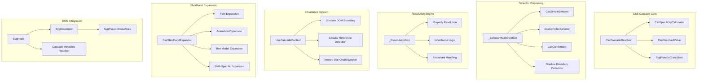
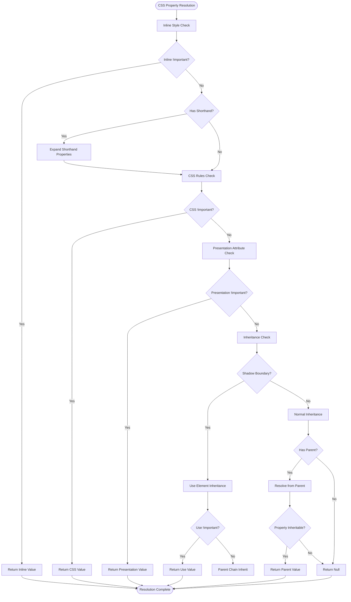
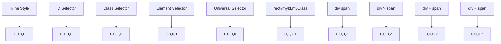
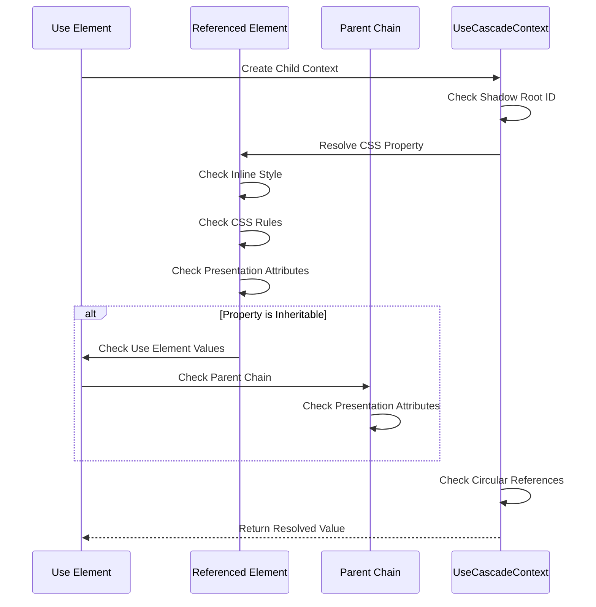
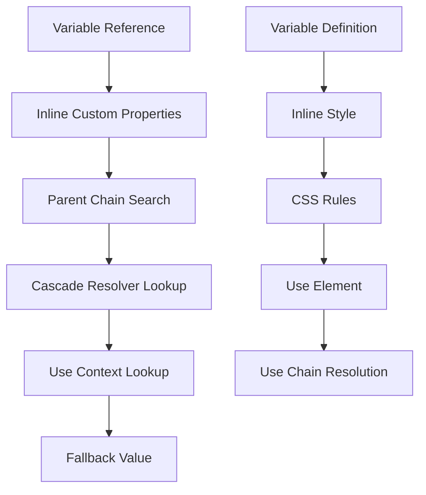
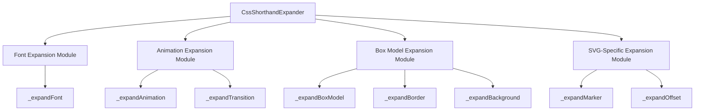
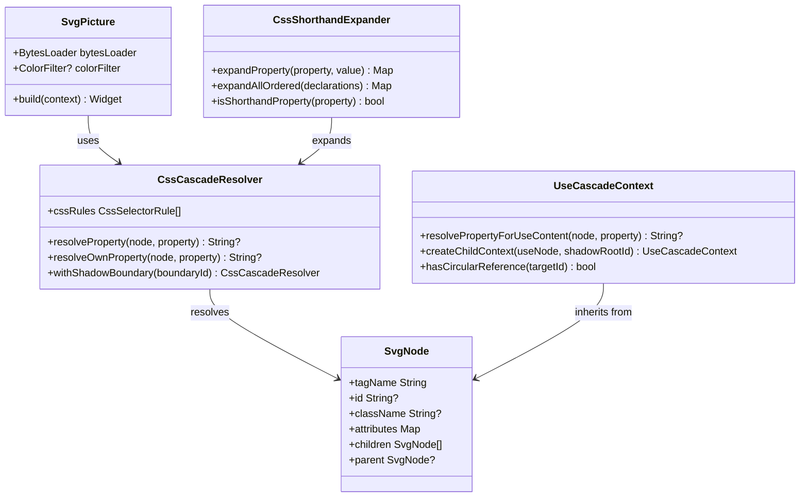

# CSS Cascade System

<cite>
**Referenced Files in This Document**
- [css_cascade.dart](file://lib/src/animation/css_cascade.dart)
- [css_cascade_inheritance.dart](file://lib/src/animation/css_cascade_inheritance.dart)
- [css_cascade_resolution.dart](file://lib/src/animation/css_cascade_resolution.dart)
- [css_cascade_selector_matching.dart](file://lib/src/animation/css_cascade_selector_matching.dart)
- [css_cascade_specificity.dart](file://lib/src/animation/css_cascade_specificity.dart)
- [css_selectors.dart](file://lib/src/animation/css_selectors.dart)
- [svg_dom.dart](file://lib/src/animation/svg_dom.dart)
- [css_variables_calc.dart](file://lib/src/animation/css_variables_calc.dart)
- [animated_svg_painter_values.dart](file://lib/src/animation/animated_svg_painter_values.dart)
- [css_cascade_specificity_test.dart](file://test/animation/css_cascade_specificity_test.dart)
- [use_css_cascade_test.dart](file://test/animation/use_css_cascade_test.dart)
- [css_shorthand_expansion.dart](file://lib/src/animation/css_shorthand_expansion.dart)
- [css_shorthand_expansion_box.dart](file://lib/src/animation/css_shorthand_expansion_box.dart)
- [css_shorthand_expansion_font.dart](file://lib/src/animation/css_shorthand_expansion_font.dart)
- [css_shorthand_expansion_animation.dart](file://lib/src/animation/css_shorthand_expansion_animation.dart)
- [css_animations_parser.dart](file://lib/src/animation/css_animations_parser.dart)
- [svg.dart](file://lib/svg.dart)
- [svg_parser_css.dart](file://lib/src/animation/svg_parser_css.dart)
</cite>

## Update Summary
**Changes Made**
- **Enhanced Shorthand Expansion System**: Complete modularization of CSS shorthand expansion into specialized components for font, animation, box model, and SVG-specific properties
- **Improved Specificity Handling**: Enhanced specificity calculation with better support for complex selectors and compound selectors
- **Advanced Inheritance Resolution**: Enhanced UseCascadeContext with improved shadow DOM boundary handling for `<use>` and `<symbol>` elements
- **Optimized Inline Style Processing**: Enhanced `_extractInlineStyleValue` method with comprehensive shorthand expansion support
- **Better Complex Property Combinations**: Improved handling of complex property combinations through the expanded shorthand system

## Table of Contents
1. [Introduction](#introduction)
2. [System Architecture](#system-architecture)
3. [Core Components](#core-components)
4. [CSS Cascade Engine](#css-cascade-engine)
5. [Selector Matching System](#selector-matching-system)
6. [Specificity Calculation](#specificity-calculation)
7. [Inheritance and Shadow DOM](#inheritance-and-shadow-dom)
8. [CSS Variables and Calculations](#css-variables-and-calculations)
9. [Enhanced Shorthand Expansion System](#enhanced-shorthand-expansion-system)
10. [Performance Optimizations](#performance-optimizations)
11. [Testing Framework](#testing-framework)
12. [Integration Points](#integration-points)
13. [Conclusion](#conclusion)

## Introduction

The CSS Cascade System in Flutter SVG Support provides a comprehensive implementation of CSS cascading rules specifically designed for SVG documents. This system ensures that CSS properties are resolved correctly according to the CSS specification, taking into account selector specificity, inheritance, and the unique characteristics of SVG elements.

The system implements a sophisticated cascade resolution engine that handles inline styles, CSS rules from `<style>` blocks, presentation attributes, and inheritance through SVG's `<use>` elements. It supports advanced CSS selectors including pseudo-classes, nth-child selectors, and complex combinators while maintaining optimal performance through intelligent caching mechanisms.

**Updated** The system has been enhanced with a comprehensive shorthand expansion system that provides modularized support for CSS shorthand properties including font, animation, transition, margin/padding, border, background, and SVG-specific properties like marker and offset. The inheritance system now features improved shadow DOM boundary handling with better support for complex nested use element scenarios.

## System Architecture

The CSS Cascade System is built around five interconnected specialized components that work together to provide robust CSS resolution for SVG documents:



**Diagram sources**
- [css_cascade.dart:227-259](file://lib/src/animation/css_cascade.dart#L227-L259)
- [css_cascade_selector_matching.dart:18-95](file://lib/src/animation/css_cascade_selector_matching.dart#L18-L95)
- [css_cascade_resolution.dart:6-107](file://lib/src/animation/css_cascade_resolution.dart#L6-L107)
- [css_cascade_inheritance.dart:23-62](file://lib/src/animation/css_cascade_inheritance.dart#L23-L62)
- [css_shorthand_expansion.dart:12-169](file://lib/src/animation/css_shorthand_expansion.dart#L12-L169)

**Section sources**
- [css_cascade.dart:1-267](file://lib/src/animation/css_cascade.dart#L1-L267)
- [css_cascade_selector_matching.dart:1-498](file://lib/src/animation/css_cascade_selector_matching.dart#L1-L498)
- [css_cascade_resolution.dart:1-177](file://lib/src/animation/css_cascade_resolution.dart#L1-L177)
- [css_cascade_inheritance.dart:1-342](file://lib/src/animation/css_cascade_inheritance.dart#L1-L342)
- [css_shorthand_expansion.dart:1-169](file://lib/src/animation/css_shorthand_expansion.dart#L1-L169)

## Core Components

### CssCascadeResolver

The central component responsible for resolving CSS properties according to the cascade rules. It now serves as a coordinator for the four specialized mixins and provides the main interface for CSS property resolution.

Key features include:
- **Component Coordination**: Integrates `_SelectorMatchingMixin`, `_ResolutionMixin`, and inheritance logic
- **Shadow Boundary Awareness**: Manages shadow DOM boundaries for `<use>` and `<symbol>` elements
- **Rule Caching**: Maintains intelligent caching for performance optimization
- **Pseudo-Class State Management**: Coordinates with dynamic pseudo-class states

### _SelectorMatchingMixin

Provides comprehensive selector matching functionality with shadow DOM boundary awareness:

- **Complex Selector Support**: Handles descendant, child, sibling, and general sibling combinators
- **Shadow Boundary Detection**: Prevents selector matching from piercing through `<use>` and `<symbol>` boundaries
- **Pseudo-Class Integration**: Supports hover, active, focus, and structural pseudo-classes
- **Performance Optimization**: Implements intelligent caching with pseudo-class state awareness

### _ResolutionMixin

Manages the core cascade resolution algorithm with proper precedence handling:

- **Priority-Based Resolution**: Inline styles → CSS rules → Presentation attributes → Inherited values
- **!Important Declaration Support**: Proper precedence rules for important declarations
- **Source Order Fallback**: Later declarations win when specificity equals
- **Inheritance Logic**: Only applies to inheritable properties
- **Enhanced Inline Style Processing**: Comprehensive shorthand expansion support for inline styles

### UseCascadeContext

Dedicated inheritance system for `<use>` element scenarios:

- **Shadow DOM Boundary Handling**: Properly handles `<use>` and `<symbol>` as shadow DOM boundaries
- **Nested Use Chain Support**: Manages complex nested `<use>` element chains with circular reference detection
- **Inheritance Priority**: Implements correct cascade order for use-referenced elements
- **!Important Override Logic**: Handles `!important` declarations from use elements

**Section sources**
- [css_cascade.dart:227-259](file://lib/src/animation/css_cascade.dart#L227-L259)
- [css_cascade_selector_matching.dart:4-95](file://lib/src/animation/css_cascade_selector_matching.dart#L4-L95)
- [css_cascade_resolution.dart:5-107](file://lib/src/animation/css_cascade_resolution.dart#L5-L107)
- [css_cascade_inheritance.dart:23-62](file://lib/src/animation/css_cascade_inheritance.dart#L23-L62)

## CSS Cascade Engine

The cascade engine implements the complete CSS cascade algorithm with enhanced shadow DOM awareness and improved performance through component specialization:



**Diagram sources**
- [css_cascade_resolution.dart:13-107](file://lib/src/animation/css_cascade_resolution.dart#L13-L107)
- [css_cascade_inheritance.dart:72-162](file://lib/src/animation/css_cascade_inheritance.dart#L72-L162)

The engine handles several critical aspects:
- **Enhanced Shadow DOM Support**: Proper boundary handling for `<use>` and `<symbol>` elements
- **Nested Use Chain Processing**: Circular reference detection and proper inheritance through use chains
- **!Important Precedence**: Correct handling of `!important` declarations in complex scenarios
- **Source Order Fallback**: Later declarations win when specificity equals
- **Inheritance Logic**: Only applies to inheritable properties with proper shadow boundary awareness
- **Shorthand Expansion Integration**: Seamless integration with the enhanced shorthand expansion system

**Section sources**
- [css_cascade_resolution.dart:13-107](file://lib/src/animation/css_cascade_resolution.dart#L13-L107)
- [css_cascade_inheritance.dart:72-162](file://lib/src/animation/css_cascade_inheritance.dart#L72-L162)
- [css_cascade_inheritance.dart:214-219](file://lib/src/animation/css_cascade_inheritance.dart#L214-L219)

## Selector Matching System

The selector matching system has been enhanced with comprehensive shadow DOM boundary awareness and improved performance through component specialization:

### Supported Selectors

| Selector Type | Example | Description |
|---------------|---------|-------------|
| Element Type | `rect`, `circle` | Matches SVG elements by tag name |
| Class | `.highlight` | Matches elements with specified class |
| ID | `#main` | Matches element with specified ID |
| Universal | `*` | Matches all elements |
| Attribute | `[fill]`, `[stroke="red"]` | Matches elements with specific attributes |
| Pseudo-class | `:hover`, `:first-child` | Matches elements in specific states |
| Pseudo-element | `::before` | Matches pseudo-elements |

### Complex Selector Support

The system supports complex selectors with combinators and shadow DOM boundary awareness:

```mermaid
graph LR
A[rect.highlight] --> B[Compound Selector]
C[div > p] --> D[Child Combinator]
E[ul li:nth-child(2n)] --> F[Nth-child Selector]
G[a:not(.hidden)] --> H[Not Selector]
I[div ~ p] --> J[General Sibling]
K[div + p] --> L[Adjacent Sibling]
```

**Diagram sources**
- [css_cascade_selector_matching.dart:100-167](file://lib/src/animation/css_cascade_selector_matching.dart#L100-L167)
- [css_cascade_selector_matching.dart:217-222](file://lib/src/animation/css_cascade_selector_matching.dart#L217-L222)

**Section sources**
- [css_cascade_selector_matching.dart:18-95](file://lib/src/animation/css_cascade_selector_matching.dart#L18-L95)
- [css_cascade_selector_matching.dart:100-167](file://lib/src/animation/css_cascade_selector_matching.dart#L100-L167)
- [css_cascade_selector_matching.dart:217-222](file://lib/src/animation/css_cascade_selector_matching.dart#L217-L222)

## Specificity Calculation

CSS specificity follows the standard CSS specification with enhanced support for complex selectors and compound selectors:

| Part | Name | Description | Example |
|------|------|-------------|---------|
| a | Inline Styles | 1 if inline style present, 0 otherwise | `style="fill: red"` |
| b | ID Selectors | Count of ID selectors | `#main` |
| c | Class, Attribute, Pseudo-class | Count of class, attribute, and pseudo-class selectors | `.highlight`, `[disabled]`, `:hover` |
| d | Element, Pseudo-element | Count of element and pseudo-element selectors | `rect`, `::before` |

### Specificity Examples



**Diagram sources**
- [css_cascade_specificity.dart:18-62](file://lib/src/animation/css_cascade_specificity.dart#L18-L62)

**Section sources**
- [css_cascade_specificity.dart:18-62](file://lib/src/animation/css_cascade_specificity.dart#L18-L62)
- [css_cascade_specificity_test.dart:47-112](file://test/animation/css_cascade_specificity_test.dart#L47-L112)

## Inheritance and Shadow DOM

### Enhanced Inheritance Rules

The system implements comprehensive CSS inheritance for SVG elements with specialized shadow DOM boundary handling:

**Inheritable Properties** include:
- Color properties: `color`, `fill`, `stroke`
- Font properties: `font-family`, `font-size`, `font-weight`
- Text properties: `text-align`, `line-height`, `white-space`
- SVG-specific properties: `stroke-width`, `stroke-linecap`, `paint-order`
- Visibility properties: `visibility`, `display`

### Advanced Shadow DOM Boundary Handling

The system properly handles SVG's `<use>` and `<symbol>` elements as shadow DOM boundaries with enhanced support for complex scenarios:



**Diagram sources**
- [css_cascade_inheritance.dart:50-62](file://lib/src/animation/css_cascade_inheritance.dart#L50-L62)
- [css_cascade_inheritance.dart:214-219](file://lib/src/animation/css_cascade_inheritance.dart#L214-L219)

**Section sources**
- [css_cascade_inheritance.dart:17-22](file://lib/src/animation/css_cascade_inheritance.dart#L17-L22)
- [css_cascade_inheritance.dart:72-162](file://lib/src/animation/css_cascade_inheritance.dart#L72-L162)
- [css_cascade_inheritance.dart:214-219](file://lib/src/animation/css_cascade_inheritance.dart#L214-L219)

## CSS Variables and Calculations

### CSS Custom Properties

The system supports CSS custom properties (variables) with comprehensive resolution through the cascade system:



**Diagram sources**
- [css_cascade_inheritance.dart:271-322](file://lib/src/animation/css_cascade_inheritance.dart#L271-L322)

### calc() Expression Evaluation

Advanced mathematical expressions are supported including:
- Basic arithmetic: `calc(100% - 20px)`
- Nested functions: `calc(min(100%, 500px))`
- CSS math functions: `min()`, `max()`, `clamp()`
- Unit conversions and calculations

**Section sources**
- [css_variables_calc.dart:92-239](file://lib/src/animation/css_variables_calc.dart#L92-L239)
- [css_variables_calc.dart:250-800](file://lib/src/animation/css_variables_calc.dart#L250-L800)

## Enhanced Shorthand Expansion System

### Comprehensive Shorthand Property Support

The system now features a complete modularized shorthand expansion system that provides specialized handling for different categories of CSS properties:

#### Font Shorthand Expansion
- **Format**: `font: [font-style] [font-variant] [font-weight] [font-stretch] font-size[/line-height] font-family`
- **Examples**: `italic small-caps bold 16px/1.5 Arial, sans-serif`
- **System Fonts**: Proper handling of system font keywords like `caption`, `icon`, `menu`
- **Initial Values**: Resets omitted properties to CSS2.1 initial values

#### Animation and Transition Shorthand Expansion
- **Animation**: `animation: name duration timing-function delay iteration-count direction fill-mode play-state`
- **Transition**: `transition: property duration timing-function delay`
- **Multiple Animations**: Supports comma-separated animation lists
- **Timing Functions**: Comprehensive support for cubic-bezier, steps, and other timing functions

#### Box Model Shorthand Expansion
- **Margin/Padding**: `margin: 10px 20px 15px 5px` → individual side properties
- **Border**: `border: 1px solid red` → width, style, color for all sides
- **Border Radius**: Supports `/` syntax for horizontal/vertical radii
- **Background**: Comprehensive background shorthand with color, image, position, repeat, attachment

#### SVG-Specific Shorthand Expansion
- **Marker**: `marker: url(#arrow)` → `marker-start`, `marker-mid`, `marker-end`
- **Offset**: `offset: path("M 0 0 L 100 100") 50% auto` → individual offset properties
- **Motion Properties**: Support for both standard `offset-*` and legacy `motion-*` properties

### Shorthand Expansion Architecture



**Diagram sources**
- [css_shorthand_expansion.dart:12-169](file://lib/src/animation/css_shorthand_expansion.dart#L12-L169)
- [css_shorthand_expansion_font.dart:54-160](file://lib/src/animation/css_shorthand_expansion_font.dart#L54-L160)
- [css_shorthand_expansion_animation.dart:19-75](file://lib/src/animation/css_shorthand_expansion_animation.dart#L19-L75)
- [css_shorthand_expansion_box.dart:19-342](file://lib/src/animation/css_shorthand_expansion_box.dart#L19-L342)

### Integration with Cascade Resolution

The shorthand expansion system integrates seamlessly with the cascade resolution engine:

- **Inline Style Processing**: Shorthand properties in inline styles are expanded before property lookup
- **Declaration Order Preservation**: Later declarations override earlier ones even after expansion
- **Complex Property Combinations**: Proper handling of mixed shorthand and longhand properties
- **Performance Optimization**: Intelligent caching and selective expansion only when needed

**Section sources**
- [css_shorthand_expansion.dart:1-169](file://lib/src/animation/css_shorthand_expansion.dart#L1-L169)
- [css_shorthand_expansion_font.dart:1-279](file://lib/src/animation/css_shorthand_expansion_font.dart#L1-L279)
- [css_shorthand_expansion_animation.dart:1-312](file://lib/src/animation/css_shorthand_expansion_animation.dart#L1-L312)
- [css_shorthand_expansion_box.dart:1-622](file://lib/src/animation/css_shorthand_expansion_box.dart#L1-L622)
- [css_cascade_resolution.dart:114-168](file://lib/src/animation/css_cascade_resolution.dart#L114-L168)

## Performance Optimizations

### Component-Based Caching

The system implements intelligent caching through specialized components:

- **Rule Cache**: Per-node caching with pseudo-class state awareness
- **Selector Cache**: Component-specific caching for performance optimization
- **Shadow Boundary Cache**: Efficient boundary detection and caching
- **Circular Reference Prevention**: Automatic detection and prevention of use chain loops
- **Shorthand Expansion Caching**: Intelligent caching of expanded property sets

### Selector Parsing Optimization

- **Early Exit**: Complex selectors are parsed once and reused across components
- **State Tracking**: Pseudo-class state is tracked centrally to avoid redundant checks
- **Memory Management**: Component-specific memory management for optimal performance
- **Shadow Boundary Optimization**: Efficient boundary detection without repeated DOM traversal
- **Inline Style Fast Path**: Direct property lookup for non-shorthand properties

**Section sources**
- [css_cascade_resolution.dart:24-41](file://lib/src/animation/css_cascade_resolution.dart#L24-L41)
- [css_cascade_selector_matching.dart:21-54](file://lib/src/animation/css_cascade_selector_matching.dart#L21-L54)
- [css_cascade_inheritance.dart:47-48](file://lib/src/animation/css_cascade_inheritance.dart#L47-L48)

## Testing Framework

The system includes comprehensive testing covering all aspects of CSS cascade behavior with enhanced test coverage for the modularized components:

### Test Categories

| Test Category | Coverage | Purpose |
|---------------|----------|---------|
| Specificity Tests | ID vs Class, Element vs Class | Validates specificity calculation accuracy |
| Inheritance Tests | Property inheritance, shadow DOM boundaries | Ensures correct inheritance behavior |
| Selector Tests | Complex selectors, pseudo-classes | Verifies selector matching accuracy |
| Use Element Tests | Nested use chains, circular references | Tests complex inheritance scenarios |
| Shorthand Expansion Tests | Font, animation, box model properties | Validates comprehensive shorthand expansion |
| Edge Cases | Empty selectors, multiple IDs, whitespace | Tests robustness and error handling |

### Key Test Scenarios

The test suite validates critical cascade behaviors:
- **Priority Order**: Inline styles beat CSS rules, which beat presentation attributes
- **Specificity Comparison**: Proper handling of equal specificity with source order
- **Inheritance Logic**: Correct inheritance for inheritable properties
- **Shadow DOM**: Proper boundary handling for `<use>` and `<symbol>` elements
- **!Important Handling**: Correct precedence rules for `!important` declarations
- **Nested Use Chains**: Proper handling of complex nested use element scenarios
- **Circular Reference Detection**: Prevention of infinite loops in use chains
- **Shorthand Expansion**: Accurate expansion of complex shorthand properties
- **Cascade Interactions**: Proper interaction between shorthand and longhand properties

**Section sources**
- [css_cascade_specificity_test.dart:1-679](file://test/animation/css_cascade_specificity_test.dart#L1-L679)
- [use_css_cascade_test.dart:1-1181](file://test/animation/use_css_cascade_test.dart#L1-L1181)

## Integration Points

### Widget Integration

The CSS cascade system integrates seamlessly with Flutter widgets through the specialized component architecture:



**Diagram sources**
- [svg.dart:57-627](file://lib/svg.dart#L57-L627)
- [css_cascade.dart:227-259](file://lib/src/animation/css_cascade.dart#L227-L259)
- [css_cascade_inheritance.dart:23-62](file://lib/src/animation/css_cascade_inheritance.dart#L23-L62)
- [css_shorthand_expansion.dart:12-169](file://lib/src/animation/css_shorthand_expansion.dart#L12-L169)

### Animation Integration

The cascade system works in conjunction with the animation framework through component specialization:

- **Property Interpolation**: CSS values are properly interpolated during animations
- **Inheritance Preservation**: Animated properties maintain inheritance relationships
- **Performance Optimization**: Animation-aware caching for frequently changing properties
- **Shadow DOM Animation**: Proper handling of animations through use element boundaries
- **Shorthand Animation Support**: Full support for animation shorthand properties in keyframe animations

**Section sources**
- [svg.dart:57-627](file://lib/svg.dart#L57-L627)
- [animated_svg_painter_values.dart:75-123](file://lib/src/animation/animated_svg_painter_values.dart#L75-L123)
- [css_animations_parser.dart:84-95](file://lib/src/animation/css_animations_parser.dart#L84-L95)

## Conclusion

The CSS Cascade System provides a robust, standards-compliant implementation of CSS resolution for SVG documents within Flutter applications. The recent enhancements significantly improve functionality through comprehensive shorthand expansion, enhanced inheritance handling, and better specificity calculations.

The system's architecture emphasizes performance through intelligent caching, efficient selector parsing, and optimized memory usage. The extensive test coverage ensures reliability across complex CSS scenarios while maintaining compatibility with the broader Flutter ecosystem.

Key strengths of the implementation include:
- **Standards Compliance**: Full adherence to CSS cascade specification
- **SVG-Specific Features**: Proper handling of SVG elements and `<use>` boundaries with enhanced shadow DOM awareness
- **Comprehensive Shorthand Support**: Complete modularized system for font, animation, box model, and SVG-specific properties
- **Performance Optimization**: Component-based architecture with intelligent caching and efficient selector matching
- **Extensibility**: Modular design supporting future CSS features and complex inheritance scenarios
- **Robust Testing**: Comprehensive test suite covering edge cases, shorthand expansion, and complex use element scenarios
- **Nested Use Chain Support**: Advanced handling of complex nested use element chains with circular reference detection

This system enables developers to create sophisticated SVG-based user interfaces with full CSS styling capabilities while maintaining optimal performance and reliability. The modular architecture ensures that the system can evolve and adapt to new CSS features while maintaining backward compatibility and performance standards.

**Updated** The system now features a completely modularized CSS cascade and inheritance engine with dedicated components for inheritance handling, selector matching with shadow DOM boundary awareness, specificity calculations, cascade resolution, and a comprehensive shorthand expansion system that provides specialized handling for font, animation, box model, and SVG-specific properties, offering a fully standards-compliant and highly optimized solution for SVG CSS processing.