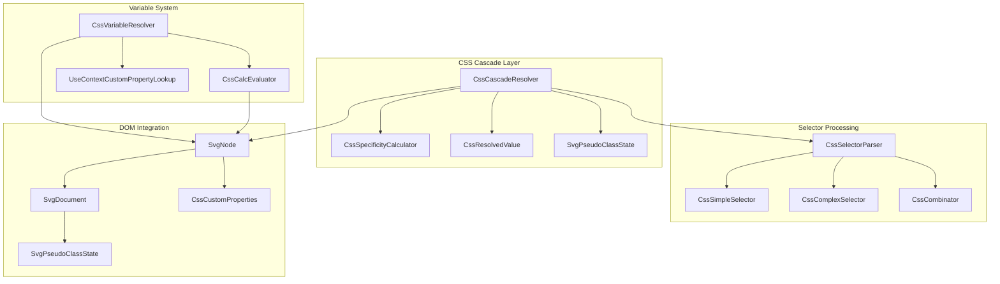
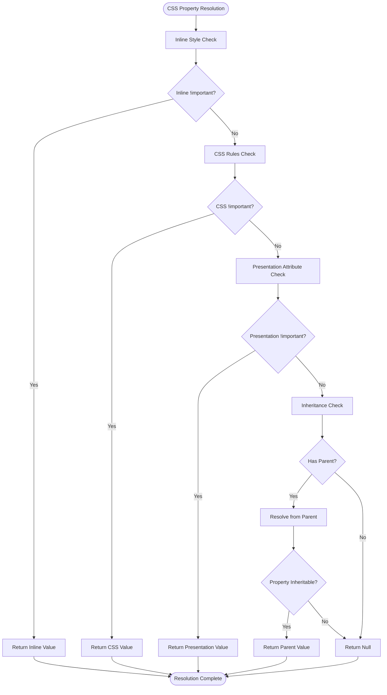
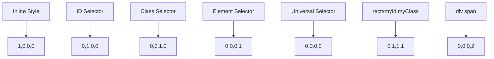
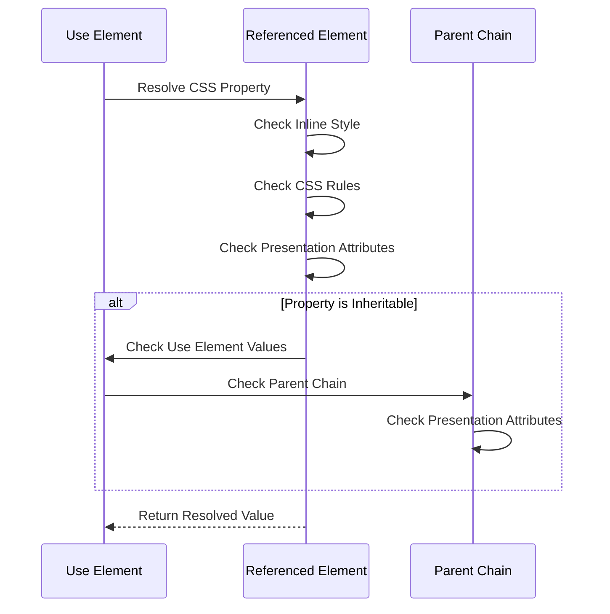
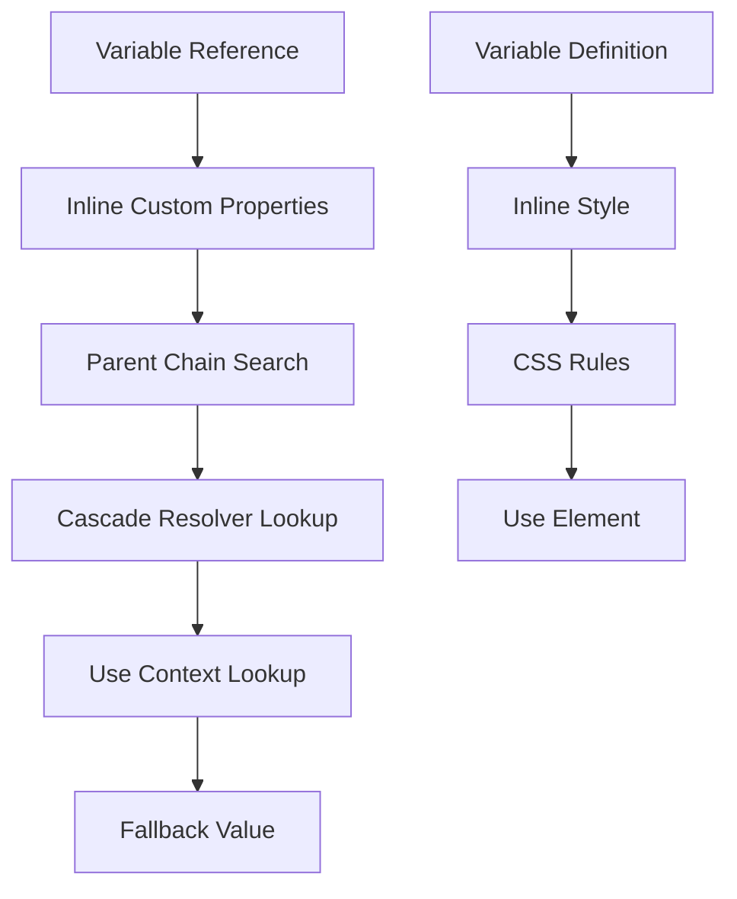
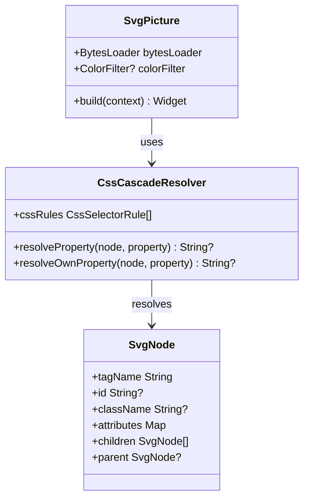

# CSS Cascade System

<cite>
**Referenced Files in This Document**
- [css_cascade.dart](file://lib/src/animation/css_cascade.dart)
- [css_selectors.dart](file://lib/src/animation/css_selectors.dart)
- [svg_dom.dart](file://lib/src/animation/svg_dom.dart)
- [css_variables_calc.dart](file://lib/src/animation/css_variables_calc.dart)
- [animated_svg_painter_values.dart](file://lib/src/animation/animated_svg_painter_values.dart)
- [css_cascade_specificity_test.dart](file://test/animation/css_cascade_specificity_test.dart)
- [css_property_rendering_test.dart](file://test/animation/css_property_rendering_test.dart)
- [css_pseudo_classes_view_test.dart](file://test/animation/css_pseudo_classes_view_test.dart)
- [svg.dart](file://lib/svg.dart)
</cite>

## Table of Contents
1. [Introduction](#introduction)
2. [System Architecture](#system-architecture)
3. [Core Components](#core-components)
4. [CSS Cascade Engine](#css-cascade-engine)
5. [Selector Matching System](#selector-matching-system)
6. [Specificity Calculation](#specificity-calculation)
7. [Inheritance and Shadow DOM](#inheritance-and-shadow-dom)
8. [CSS Variables and Calculations](#css-variables-and-calculations)
9. [Performance Optimizations](#performance-optimizations)
10. [Testing Framework](#testing-framework)
11. [Integration Points](#integration-points)
12. [Conclusion](#conclusion)

## Introduction

The CSS Cascade System in Flutter SVG Support provides a comprehensive implementation of CSS cascading rules specifically designed for SVG documents. This system ensures that CSS properties are resolved correctly according to the CSS specification, taking into account selector specificity, inheritance, and the unique characteristics of SVG elements.

The system implements a sophisticated cascade resolution engine that handles inline styles, CSS rules from `<style>` blocks, presentation attributes, and inheritance through SVG's `<use>` elements. It supports advanced CSS selectors including pseudo-classes, nth-child selectors, and complex combinators while maintaining optimal performance through intelligent caching mechanisms.

## System Architecture

The CSS Cascade System is built around several interconnected components that work together to provide robust CSS resolution for SVG documents:



**Diagram sources**
- [css_cascade.dart:288-303](file://lib/src/animation/css_cascade.dart#L288-L303)
- [css_selectors.dart:57-665](file://lib/src/animation/css_selectors.dart#L57-L665)
- [svg_dom.dart:124-297](file://lib/src/animation/svg_dom.dart#L124-L297)

**Section sources**
- [css_cascade.dart:1-1146](file://lib/src/animation/css_cascade.dart#L1-L1146)
- [svg_dom.dart:1-574](file://lib/src/animation/svg_dom.dart#L1-L574)

## Core Components

### CssCascadeResolver

The central component responsible for resolving CSS properties according to the cascade rules. It implements the complete CSS cascade algorithm including specificity calculation, !important handling, and inheritance resolution.

Key features include:
- Priority-based resolution: Inline styles → CSS rules → Presentation attributes → Inherited values
- Comprehensive selector matching with pseudo-class support
- Shadow DOM boundary awareness for `<use>` and `<symbol>` elements
- Rule caching for performance optimization

### CssSpecificityCalculator

Calculates CSS specificity values for selectors according to the CSS specification. Handles complex selectors including compound selectors, combinators, and pseudo-classes.

### SvgNode and SvgDocument

Provide the DOM structure for SVG elements with specialized methods for CSS property resolution and inheritance traversal.

**Section sources**
- [css_cascade.dart:288-406](file://lib/src/animation/css_cascade.dart#L288-L406)
- [css_cascade.dart:111-179](file://lib/src/animation/css_cascade.dart#L111-L179)
- [svg_dom.dart:124-297](file://lib/src/animation/svg_dom.dart#L124-L297)

## CSS Cascade Engine

The cascade engine implements the complete CSS cascade algorithm with the following priority order:



**Diagram sources**
- [css_cascade.dart:305-406](file://lib/src/animation/css_cascade.dart#L305-L406)

The engine handles several critical aspects:
- **!important precedence**: Overrides normal cascade rules when present
- **Specificity comparison**: Uses 4-part specificity tuples (a,b,c,d)
- **Source order fallback**: Later declarations win when specificity equals
- **Inheritance logic**: Only applies to inheritable properties

**Section sources**
- [css_cascade.dart:305-406](file://lib/src/animation/css_cascade.dart#L305-L406)
- [css_cascade.dart:92-108](file://lib/src/animation/css_cascade.dart#L92-L108)

## Selector Matching System

The selector matching system supports a comprehensive range of CSS selectors with SVG-specific enhancements:

### Supported Selectors

| Selector Type | Example | Description |
|---------------|---------|-------------|
| Element Type | `rect`, `circle` | Matches SVG elements by tag name |
| Class | `.highlight` | Matches elements with specified class |
| ID | `#main` | Matches element with specified ID |
| Universal | `*` | Matches all elements |
| Attribute | `[fill]`, `[stroke="red"]` | Matches elements with specific attributes |
| Pseudo-class | `:hover`, `:first-child` | Matches elements in specific states |
| Pseudo-element | `::before` | Matches pseudo-elements |

### Complex Selector Support

The system supports complex selectors with combinators:

```mermaid
graph LR
A[rect.highlight] --> B[Compound Selector]
C[div > p] --> D[Child Combinator]
E[ul li:nth-child(2n)] --> F[Nth-child Selector]
G[a:not(.hidden)] --> H[Not Selector]
```

**Diagram sources**
- [css_selectors.dart:512-649](file://lib/src/animation/css_selectors.dart#L512-L649)

**Section sources**
- [css_selectors.dart:57-665](file://lib/src/animation/css_selectors.dart#L57-L665)
- [css_cascade.dart:462-562](file://lib/src/animation/css_cascade.dart#L462-L562)

## Specificity Calculation

CSS specificity follows the standard CSS specification with a 4-part tuple system:

| Part | Name | Description | Example |
|------|------|-------------|---------|
| a | Inline Styles | 1 if inline style present, 0 otherwise | `style="fill: red"` |
| b | ID Selectors | Count of ID selectors | `#main` |
| c | Class, Attribute, Pseudo-class | Count of class, attribute, and pseudo-class selectors | `.highlight`, `[disabled]`, `:hover` |
| d | Element, Pseudo-element | Count of element and pseudo-element selectors | `rect`, `::before` |

### Specificity Examples



**Diagram sources**
- [css_cascade.dart:14-67](file://lib/src/animation/css_cascade.dart#L14-L67)

**Section sources**
- [css_cascade.dart:14-67](file://lib/src/animation/css_cascade.dart#L14-L67)
- [css_cascade_specificity_test.dart:47-112](file://test/animation/css_cascade_specificity_test.dart#L47-L112)

## Inheritance and Shadow DOM

### Inheritance Rules

The system implements comprehensive CSS inheritance for SVG elements, supporting both automatic and explicit inheritance:

**Inheritable Properties** include:
- Color properties: `color`, `fill`, `stroke`
- Font properties: `font-family`, `font-size`, `font-weight`
- Text properties: `text-align`, `line-height`, `white-space`
- SVG-specific properties: `stroke-width`, `stroke-linecap`, `paint-order`
- Visibility properties: `visibility`, `display`

### Shadow DOM Boundary Handling

The system properly handles SVG's `<use>` and `<symbol>` elements as shadow DOM boundaries:



**Diagram sources**
- [css_cascade.dart:923-1029](file://lib/src/animation/css_cascade.dart#L923-L1029)

**Section sources**
- [css_cascade.dart:181-276](file://lib/src/animation/css_cascade.dart#L181-L276)
- [css_cascade.dart:923-1029](file://lib/src/animation/css_cascade.dart#L923-L1029)

## CSS Variables and Calculations

### CSS Custom Properties

The system supports CSS custom properties (variables) with comprehensive resolution:



**Diagram sources**
- [css_variables_calc.dart:209-238](file://lib/src/animation/css_variables_calc.dart#L209-L238)

### calc() Expression Evaluation

Advanced mathematical expressions are supported including:
- Basic arithmetic: `calc(100% - 20px)`
- Nested functions: `calc(min(100%, 500px))`
- CSS math functions: `min()`, `max()`, `clamp()`
- Unit conversions and calculations

**Section sources**
- [css_variables_calc.dart:92-239](file://lib/src/animation/css_variables_calc.dart#L92-L239)
- [css_variables_calc.dart:250-800](file://lib/src/animation/css_variables_calc.dart#L250-L800)

## Performance Optimizations

### Rule Caching

The system implements intelligent caching to avoid repeated selector matching:

- **Cache Key**: Combines tag name, ID, class names, and pseudo-class state
- **Cache Scope**: Per-node caching with pseudo-class state awareness
- **Cache Invalidation**: Automatic clearing when pseudo-class state changes

### Selector Parsing Optimization

- **Early Exit**: Complex selectors are parsed once and reused
- **State Tracking**: Pseudo-class state is tracked centrally to avoid redundant checks
- **Memory Management**: Weak references and proper cleanup to prevent memory leaks

**Section sources**
- [css_cascade.dart:294-303](file://lib/src/animation/css_cascade.dart#L294-L303)
- [css_cascade.dart:413-449](file://lib/src/animation/css_cascade.dart#L413-L449)

## Testing Framework

The system includes comprehensive testing covering all aspects of CSS cascade behavior:

### Test Categories

| Test Category | Coverage | Purpose |
|---------------|----------|---------|
| Specificity Tests | ID vs Class, Element vs Class | Validates specificity calculation accuracy |
| Inheritance Tests | Property inheritance, shadow DOM boundaries | Ensures correct inheritance behavior |
| Selector Tests | Complex selectors, pseudo-classes | Verifies selector matching accuracy |
| Edge Cases | Empty selectors, multiple IDs, whitespace | Tests robustness and error handling |

### Key Test Scenarios

The test suite validates critical cascade behaviors:
- **Priority Order**: Inline styles beat CSS rules, which beat presentation attributes
- **Specificity Comparison**: Proper handling of equal specificity with source order
- **Inheritance Logic**: Correct inheritance for inheritable properties
- **Shadow DOM**: Proper boundary handling for `<use>` and `<symbol>` elements

**Section sources**
- [css_cascade_specificity_test.dart:1-583](file://test/animation/css_cascade_specificity_test.dart#L1-L583)
- [css_property_rendering_test.dart:267-293](file://test/animation/css_property_rendering_test.dart#L267-L293)

## Integration Points

### Widget Integration

The CSS cascade system integrates seamlessly with Flutter widgets:



**Diagram sources**
- [svg.dart:57-627](file://lib/svg.dart#L57-L627)
- [css_cascade.dart:288-406](file://lib/src/animation/css_cascade.dart#L288-L406)

### Animation Integration

The cascade system works in conjunction with the animation framework:

- **Property Interpolation**: CSS values are properly interpolated during animations
- **Inheritance Preservation**: Animated properties maintain inheritance relationships
- **Performance Optimization**: Animation-aware caching for frequently changing properties

**Section sources**
- [svg.dart:57-627](file://lib/svg.dart#L57-L627)
- [animated_svg_painter_values.dart:75-123](file://lib/src/animation/animated_svg_painter_values.dart#L75-L123)

## Conclusion

The CSS Cascade System provides a robust, standards-compliant implementation of CSS resolution for SVG documents within Flutter applications. Its comprehensive feature set includes support for advanced selectors, inheritance through shadow DOM boundaries, CSS variables, and mathematical calculations.

The system's architecture emphasizes performance through intelligent caching, efficient selector parsing, and optimized memory usage. The extensive test coverage ensures reliability across complex CSS scenarios while maintaining compatibility with the broader Flutter ecosystem.

Key strengths of the implementation include:
- **Standards Compliance**: Full adherence to CSS cascade specification
- **SVG-Specific Features**: Proper handling of SVG elements and `<use>` boundaries  
- **Performance Optimization**: Intelligent caching and efficient selector matching
- **Extensibility**: Modular design supporting future CSS features
- **Robust Testing**: Comprehensive test suite covering edge cases

This system enables developers to create sophisticated SVG-based user interfaces with full CSS styling capabilities while maintaining optimal performance and reliability.