# Enhanced CSS Variables and Calculations

<cite>
**Referenced Files in This Document**
- [css_variables_calc.dart](file://lib/src/animation/css_variables_calc.dart)
- [css_variables_calc_resolver.dart](file://lib/src/animation/css_variables_calc_resolver.dart)
- [css_variables_calc_evaluator.dart](file://lib/src/animation/css_variables_calc_evaluator.dart)
- [css_variables_calc_combined.dart](file://lib/src/animation/css_variables_calc_combined.dart)
- [css_variables_calc_properties.dart](file://lib/src/animation/css_variables_calc_properties.dart)
- [css_cascade.dart](file://lib/src/animation/css_cascade.dart)
- [css_cascade_specificity.dart](file://lib/src/animation/css_cascade_specificity.dart)
- [css_cascade_selector_matching.dart](file://lib/src/animation/css_cascade_selector_matching.dart)
- [css_cascade_resolution.dart](file://lib/src/animation/css_cascade_resolution.dart)
- [css_selectors.dart](file://lib/src/animation/css_selectors.dart)
- [css_property_rendering_test.dart](file://test/animation/css_property_rendering_test.dart)
- [css_cascade_specificity_test.dart](file://test/animation/css_cascade_specificity_test.dart)
- [css_variables_calc_test.dart](file://test/animation/css_variables_calc_test.dart)
- [css_calc_edge_cases_test.dart](file://test/animation/css_calc_edge_cases_test.dart)
- [css_nth_selectors_test.dart](file://test/animation/css_nth_selectors_test.dart)
- [svg_dom.dart](file://lib/src/animation/svg_dom.dart)
- [animated_svg_painter_use.dart](file://lib/src/animation/animated_svg_painter_use.dart)
- [animated_svg_painter_tree.dart](file://lib/src/animation/animated_svg_painter_tree.dart)
- [smil_parser_motion.dart](file://lib/src/animation/smil/smil_parser_motion.dart)
- [smil_timeline_syncbase.dart](file://lib/src/animation/smil/smil_timeline_syncbase.dart)
- [smil_timeline_runtime.dart](file://lib/src/animation/smil/smil_timeline_runtime.dart)
- [svg_filters_registry_pipeline_primitives_paint.dart](file://lib/src/animation/svg_filters_registry_pipeline_primitives_paint.dart)
- [svg_filters_registry_pipeline_compositing.dart](file://lib/src/animation/svg_filters_registry_pipeline_compositing.dart)
- [svg_filters_registry_pipeline.dart](file://lib/src/animation/svg_filters_registry_pipeline.dart)
- [svg_filters_registry_inputs.dart](file://lib/src/animation/svg_filters_registry_inputs.dart)
- [svg_filters_types.dart](file://lib/src/animation/svg_filters_types.dart)
- [SVGElement.cpp](file://blink-b87d44f-Source-core-svg/SVGElement.cpp)
- [advanced_use_inheritance_test.dart](file://test/animation/advanced_use_inheritance_test.dart)
- [use_css_cascade_test.dart](file://test/animation/use_css_cascade_test.dart)
- [css_selectors_combinators_test.dart](file://test/animation/css_selectors_combinators_test.dart)
- [filter_advanced_input_graph_test.dart](file://test/animation/filter_advanced_input_graph_test.dart)
- [filter_input_graph_hardening_test.dart](file://test/animation/filter_input_graph_hardening_test.dart)
</cite>

## Update Summary
**Changes Made**
- Enhanced filter system with advanced paint source distinction (FillPaint vs StrokePaint)
- Implemented comprehensive filter pipeline compositing support with recursive composition handling
- Added specialized paint pass classes for paint source optimization
- Enhanced input graph semantics with improved paint context propagation
- Expanded filter primitive pipeline with circular reference detection and result caching
- Added comprehensive test coverage for advanced filter edge cases

## Table of Contents
1. [Introduction](#introduction)
2. [Project Structure](#project-structure)
3. [Core Components](#core-components)
4. [Architecture Overview](#architecture-overview)
5. [Detailed Component Analysis](#detailed-component-analysis)
6. [Enhanced CSS Cascade Processing](#enhanced-css-cascade-processing)
7. [Advanced CSS Variables and Calculations](#advanced-css-variables-and-calculations)
8. [Structural Pseudo-Classes and Matching Algorithms](#structural-pseudo-classes-and-matching-algorithms)
9. [Modern CSS Unit Support](#modern-css-unit-support)
10. [SMIL Animation Enhancements](#smil-animation-enhancements)
11. [Advanced Filter System Optimizations](#advanced-filter-system-optimizations)
12. [Enhanced Recursion Safety and Error Handling](#enhanced-recursion-safety-and-error-handling)
13. [Dependency Analysis](#dependency-analysis)
14. [Performance Considerations](#performance-considerations)
15. [Troubleshooting Guide](#troubleshooting-guide)
16. [Conclusion](#conclusion)

## Introduction
This document provides comprehensive technical documentation for the Enhanced CSS Variables and Calculations system in the Flutter SVG support library. The implementation covers CSS custom properties (variables), calc() mathematical expressions, CSS math functions (min, max, clamp), structural pseudo-classes, and their integration with the SVG rendering pipeline. It includes detailed analysis of the parsing, resolution, and evaluation mechanisms, along with enhanced SMIL animation support, comprehensive filter primitive processing, recursion safety measures, and robust error handling for malformed expressions.

The enhanced system now provides robust CSS cascade resolution with new CSS variables cascade resolver integration, comprehensive structural pseudo-class support, advanced variable inheritance, comprehensive mathematical computation with modern CSS unit support, enhanced recursion safety with 20-level maximum nesting depth, comprehensive expression validation, improved error handling for malformed expressions and unmatched parentheses, and seamless integration with SMIL animations and filter processing while maintaining compatibility with the existing SVG rendering pipeline.

## Project Structure
The enhanced CSS capabilities are implemented primarily in the animation module with extensive integration to the SVG DOM, rendering pipeline, SMIL animations, and filter system:

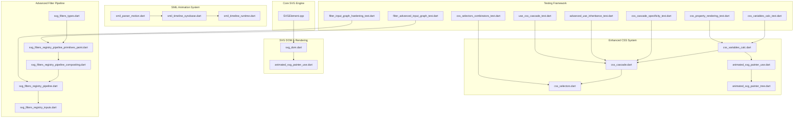

**Diagram sources**
- [css_variables_calc.dart](file://lib/src/animation/css_variables_calc.dart)
- [css_cascade.dart](file://lib/src/animation/css_cascade.dart)
- [css_selectors.dart](file://lib/src/animation/css_selectors.dart)
- [svg_dom.dart](file://lib/src/animation/svg_dom.dart)
- [animated_svg_painter_use.dart](file://lib/src/animation/animated_svg_painter_use.dart)
- [animated_svg_painter_tree.dart](file://lib/src/animation/animated_svg_painter_tree.dart)
- [smil_parser_motion.dart](file://lib/src/animation/smil/smil_parser_motion.dart)
- [smil_timeline_syncbase.dart](file://lib/src/animation/smil/smil_timeline_syncbase.dart)
- [smil_timeline_runtime.dart](file://lib/src/animation/smil/smil_timeline_runtime.dart)
- [svg_filters_registry_pipeline_primitives_paint.dart](file://lib/src/animation/svg_filters_registry_pipeline_primitives_paint.dart)
- [svg_filters_registry_pipeline_compositing.dart](file://lib/src/animation/svg_filters_registry_pipeline_compositing.dart)
- [svg_filters_registry_pipeline.dart](file://lib/src/animation/svg_filters_registry_pipeline.dart)
- [svg_filters_registry_inputs.dart](file://lib/src/animation/svg_filters_registry_inputs.dart)
- [svg_filters_types.dart](file://lib/src/animation/svg_filters_types.dart)
- [SVGElement.cpp](file://blink-b87d44f-Source-core-svg/SVGElement.cpp)

**Section sources**
- [css_variables_calc.dart](file://lib/src/animation/css_variables_calc.dart)
- [css_cascade.dart](file://lib/src/animation/css_cascade.dart)
- [css_selectors.dart](file://lib/src/animation/css_selectors.dart)
- [svg_dom.dart](file://lib/src/animation/svg_dom.dart)

## Core Components
The enhanced CSS system consists of five primary components working in concert with expanded functionality and enhanced safety measures:

### Enhanced CSS Custom Properties System
The custom properties system provides variable substitution with inheritance, fallback support, and use context propagation:

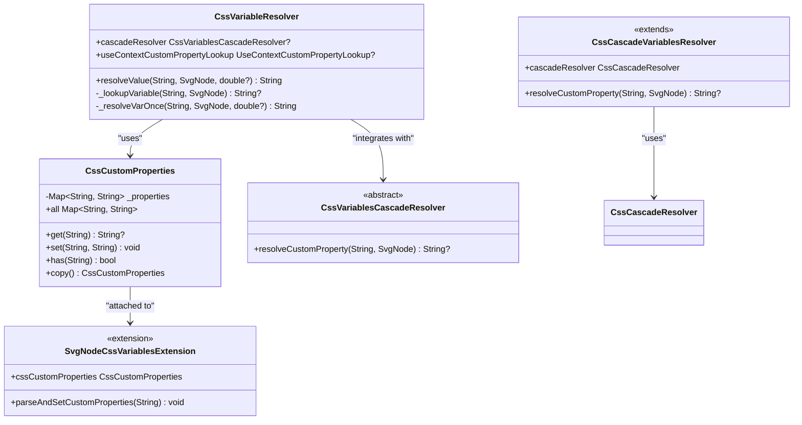

**Diagram sources**
- [css_variables_calc.dart](file://lib/src/animation/css_variables_calc.dart)
- [css_cascade.dart](file://lib/src/animation/css_cascade.dart)

### Advanced CSS Calc() Mathematical Evaluator with Recursion Safety
The calculator supports complex mathematical expressions with CSS functions, enhanced unit handling, and comprehensive recursion protection:

```mermaid
flowchart TD
Start(["Input Value"]) --> CheckMath{"Contains CSS math functions?"}
CheckMath --> |min()/max()/clamp()| ParseMath["Parse CSS Math Function"]
CheckMath --> |calc()| ParseCalc["Parse calc() Expression"]
CheckMath --> |None| CheckVar{"Contains var()?"}
ParseMath --> DepthCheck["Check Depth Limit (≤20)"]
DepthCheck --> EvaluateMath["Evaluate Math Function"]
EvaluateMath --> Units["Convert Units to Pixels"]
ParseCalc --> Tokenize["Tokenize Expression"]
Tokenize --> DepthCheck2["Check Depth Limit (≤20)"]
DepthCheck2 --> Evaluate["Evaluate with Precedence"]
Evaluate --> Units
CheckVar --> |Yes| ResolveVar["Resolve CSS Variables"]
CheckVar --> |No| ParseSimple["Parse Simple Numeric Value"]
ResolveVar --> CheckMath
ParseSimple --> Units
Units --> Result(["Numeric Result"])
```

**Diagram sources**
- [css_variables_calc_evaluator.dart](file://lib/src/animation/css_variables_calc_evaluator.dart)

### Enhanced CSS Structural Pseudo-Classes System
The structural pseudo-classes provide advanced element positioning and type matching:

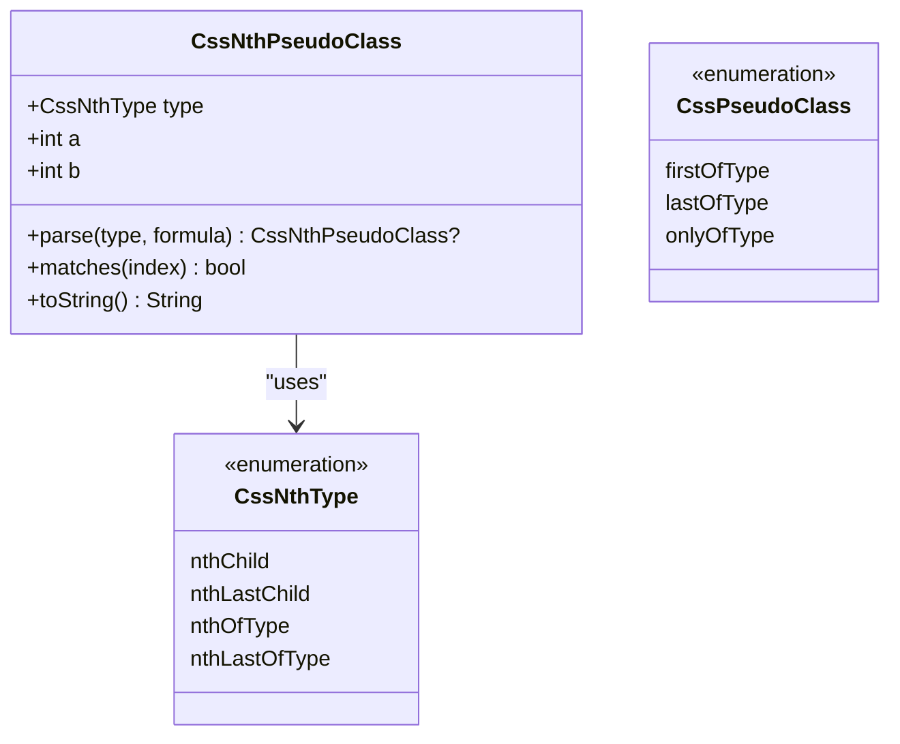

**Diagram sources**
- [css_selectors.dart](file://lib/src/animation/css_selectors.dart)

**Section sources**
- [css_variables_calc.dart](file://lib/src/animation/css_variables_calc.dart)
- [css_selectors.dart](file://lib/src/animation/css_selectors.dart)

## Architecture Overview
The enhanced CSS processing pipeline integrates seamlessly with the SVG rendering system, SMIL animations, and filter primitives with comprehensive recursion safety and error handling:

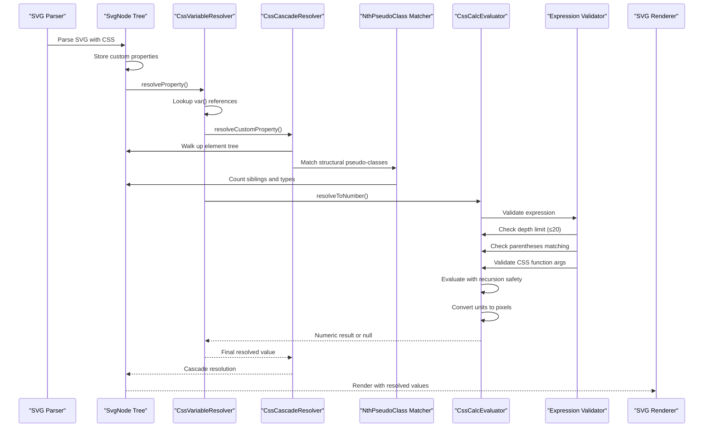

**Diagram sources**
- [css_variables_calc.dart](file://lib/src/animation/css_variables_calc.dart)
- [css_cascade.dart](file://lib/src/animation/css_cascade.dart)
- [css_selectors.dart](file://lib/src/animation/css_selectors.dart)
- [svg_dom.dart](file://lib/src/animation/svg_dom.dart)

The architecture ensures proper CSS cascade resolution, variable inheritance, mathematical computation with recursion safety, structural pseudo-class matching, comprehensive expression validation, graceful error recovery, and seamless integration with SMIL animations and filter processing while maintaining compatibility with the existing SVG rendering pipeline.

**Section sources**
- [css_variables_calc.dart](file://lib/src/animation/css_variables_calc.dart)
- [css_cascade.dart](file://lib/src/animation/css_cascade.dart)
- [css_selectors.dart](file://lib/src/animation/css_selectors.dart)

## Detailed Component Analysis

### Enhanced CSS Variable Resolution Engine
The variable resolution system implements a sophisticated lookup mechanism with improved use context handling and shadow DOM boundary respect:

#### Enhanced Variable Lookup Hierarchy
The resolver follows an improved precedence order with better use context propagation:

1. **Inline Custom Properties**: Highest specificity, checked on the current node and all ancestors
2. **CSS Rule-Based Properties**: Resolved through the new CSS cascade resolver integration
3. **Use Context Properties**: Special handling for variables in `<use>` element contexts with inheritance boundaries
4. **Fallback Values**: Support for nested fallback chains with CSS math function evaluation

#### New CSS Variables Cascade Resolver Integration
- **Cascade-Based Resolution**: Custom properties now integrate with the CSS cascade system for specificity calculation
- **Rule-Based Variable Lookup**: Variables defined in CSS rules are resolved using the same cascade mechanism as regular properties
- **Enhanced Specificity**: Variables follow CSS cascade rules with proper specificity calculation and !important handling

**Section sources**
- [css_variables_calc_resolver.dart](file://lib/src/animation/css_variables_calc_resolver.dart)
- [css_cascade.dart](file://lib/src/animation/css_cascade.dart)
- [css_variables_calc_test.dart](file://test/animation/css_variables_calc_test.dart)
- [animated_svg_painter_use.dart](file://lib/src/animation/animated_svg_painter_use.dart)
- [animated_svg_painter_tree.dart](file://lib/src/animation/animated_svg_painter_tree.dart)

### Advanced CSS Calc() Mathematical Evaluator with Recursion Safety
The calculator now supports comprehensive CSS mathematical functions with enhanced error handling and recursion protection:

#### Enhanced Supported Operations
- **Basic Arithmetic**: Addition, subtraction, multiplication, division
- **CSS Math Functions**: `min()`, `max()`, `clamp()` with multiple arguments
- **Unit Conversions**: Enhanced px, em, rem, pt, pc, in, cm, mm, %, ex, ch, vw, vh, vmin, vmax
- **Nested Expressions**: Deep recursive evaluation of complex formulas with 20-level maximum nesting depth
- **CSS Function Composition**: Nested CSS functions within calc()

#### Enhanced Recursion Safety and Error Handling
- **Depth Tracking**: Comprehensive depth monitoring with 20-level maximum nesting depth
- **Operator Precedence**: Correct mathematical order of operations with CSS function precedence
- **Division by Zero**: Graceful handling returning zero with enhanced error reporting
- **Percentage Calculations**: Container-relative percentage computations with fallbacks
- **Unit Compatibility**: Intelligent conversion between different unit types with precision handling
- **Expression Validation**: Comprehensive validation for malformed expressions and unmatched parentheses
- **Graceful Fallback**: Returns null for invalid expressions instead of crashing

**Section sources**
- [css_variables_calc_evaluator.dart](file://lib/src/animation/css_variables_calc_evaluator.dart)
- [css_property_rendering_test.dart](file://test/animation/css_property_rendering_test.dart)
- [css_calc_edge_cases_test.dart](file://test/animation/css_calc_edge_cases_test.dart)

### Enhanced CSS Cascade Integration
The system integrates with an improved CSS cascade mechanism featuring better specificity calculation and shadow DOM handling:

#### Advanced Specificity Calculation
- **Enhanced Selector Matching**: Improved handling of complex selectors with combinators and structural pseudo-classes
- **Shadow DOM Respect**: Proper specificity calculation across `<use>` and `<symbol>` boundaries
- **Pseudo-Class State Integration**: Dynamic specificity calculation with hover, active, focus states
- **CSS Function Support**: Specificity calculation for selectors with CSS functions

#### Improved Inheritance Model
- **Selective Inheritance**: Inheritable properties limited to CSS/SVG specification compliance
- **Use Boundary Handling**: Proper inheritance across `<use>` element boundaries
- **Presentation Attribute Priority**: Enhanced handling of presentation attributes vs CSS rules
- **!important Handling**: Improved `!important` resolution with cascade precedence

**Section sources**
- [css_cascade.dart](file://lib/src/animation/css_cascade.dart)
- [css_cascade_specificity_test.dart](file://test/animation/css_cascade_specificity_test.dart)
- [advanced_use_inheritance_test.dart](file://test/animation/advanced_use_inheritance_test.dart)
- [use_css_cascade_test.dart](file://test/animation/use_css_cascade_test.dart)

### SVG DOM Integration
The CSS system maintains deep integration with the SVG DOM structure and enhanced rendering pipeline:

#### Enhanced Node Extensions
- **Custom Property Storage**: Weak-map pattern with improved memory management
- **Attribute Type System**: Enhanced typed attribute handling for animations
- **Inheritance Tracking**: Automatic propagation of CSS properties with use context
- **Shadow DOM Awareness**: Proper handling of use/symbol boundaries in property resolution

#### Advanced Rendering Pipeline
- **Dynamic Resolution**: Real-time variable and calculation evaluation with caching
- **Animation Compatibility**: Seamless integration with SMIL and CSS animations
- **Performance Optimization**: Advanced caching strategies and lazy evaluation
- **Error Recovery**: Graceful handling of malformed CSS and circular references

**Section sources**
- [svg_dom.dart](file://lib/src/animation/svg_dom.dart)
- [animated_svg_painter_use.dart](file://lib/src/animation/animated_svg_painter_use.dart)

## Enhanced CSS Cascade Processing
The CSS cascade system has been significantly enhanced with improved selector specificity handling, shadow DOM boundary management, and new CSS variables cascade resolver integration:

### Advanced Selector Specificity Calculation
The specificity calculator now handles complex selectors with enhanced accuracy:

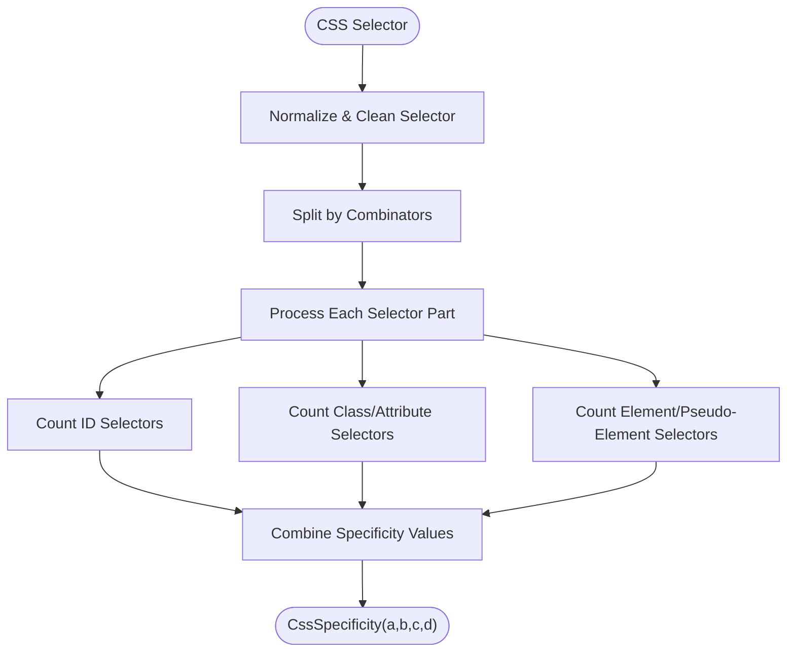

**Diagram sources**
- [css_cascade_specificity.dart](file://lib/src/animation/css_cascade_specificity.dart)

### Enhanced Shadow DOM Boundary Management
The cascade resolver now properly respects shadow DOM boundaries for complex selector matching:

- **Use Element Boundaries**: Stop selector matching at `<use>` element boundaries
- **Symbol Element Boundaries**: Respect `<symbol>` element shadow scope
- **Complex Selector Traversal**: Proper ancestor/descendant matching across boundaries
- **Pseudo-Class State Preservation**: Maintain pseudo-class state across use boundaries

### New CSS Variables Cascade Resolver
The system now includes a dedicated cascade resolver for CSS custom properties:

- **Rule-Based Variable Resolution**: Variables defined in CSS rules are resolved using cascade specificity
- **Integration with CSS Rules**: Custom properties participate in the same cascade mechanism as regular CSS properties
- **Enhanced Specificity Handling**: Variables follow CSS cascade rules with proper !important precedence

**Section sources**
- [css_cascade.dart](file://lib/src/animation/css_cascade.dart)
- [css_cascade_specificity_test.dart](file://test/animation/css_cascade_specificity_test.dart)
- [css_variables_calc_resolver.dart](file://lib/src/animation/css_variables_calc_resolver.dart)

## Advanced CSS Variables and Calculations
The CSS variables and calculations system has been comprehensively enhanced with CSS math function support, new cascade resolver integration, improved error handling, and enhanced recursion safety:

### CSS Math Function Support
The system now fully supports CSS mathematical functions within variable resolution:

#### Supported CSS Math Functions
- **min() Function**: Returns smallest value from multiple arguments
- **max() Function**: Returns largest value from multiple arguments  
- **clamp() Function**: Constrains value within minimum and maximum bounds
- **Nested Function Support**: CSS functions can be nested within each other

#### Enhanced Variable Resolution
- **CSS Function Evaluation**: Variables containing CSS math functions are evaluated
- **Fallback Chain Enhancement**: CSS functions in fallback chains are properly resolved
- **Unit Preservation**: Units are preserved during CSS function calculations
- **Error Recovery**: Graceful handling of invalid CSS function syntax

### Advanced Use Context Inheritance
The system now provides comprehensive use context inheritance for CSS properties:

#### Use Context Propagation
- **Inheritable Property Filtering**: Only CSS/SVG inheritable properties flow through use boundaries
- **Property Type Validation**: Ensures only appropriate properties are inherited
- **Boundary Respect**: Proper respect for use/symbol element boundaries
- **Recursive Use Handling**: Prevention of infinite recursion with depth limiting

#### Enhanced CSS Property Inheritance
- **Color Properties**: color, fill, stroke, stroke-color inheritance
- **Font Properties**: Complete font family and sizing inheritance
- **Text Properties**: Text alignment, spacing, and transformation inheritance
- **SVG-Specific Properties**: fill-opacity, stroke properties, marker inheritance

**Section sources**
- [css_variables_calc_evaluator.dart](file://lib/src/animation/css_variables_calc_evaluator.dart)
- [css_property_rendering_test.dart](file://test/animation/css_property_rendering_test.dart)
- [animated_svg_painter_use.dart](file://lib/src/animation/animated_svg_painter_use.dart)
- [animated_svg_painter_tree.dart](file://lib/src/animation/animated_svg_painter_tree.dart)

## Structural Pseudo-Classes and Matching Algorithms
The enhanced CSS system now provides comprehensive support for structural pseudo-classes with advanced matching algorithms:

### Enhanced Structural Pseudo-Class Support
The system now supports all major CSS structural pseudo-classes:

#### Supported Structural Pseudo-Classes
- **nth-child(an+b)**: Matches elements based on their position among siblings
- **nth-last-child(an+b)**: Matches elements based on position from the end
- **nth-of-type(an+b)**: Matches elements based on position among siblings of the same type
- **nth-last-of-type(an+b)**: Matches elements based on position from the end among siblings of the same type
- **first-of-type**: Matches the first sibling of its type
- **last-of-type**: Matches the last sibling of its type
- **only-of-type**: Matches when there is only one sibling of its type

#### Advanced Matching Algorithms
The matching algorithms implement precise CSS specification compliance:

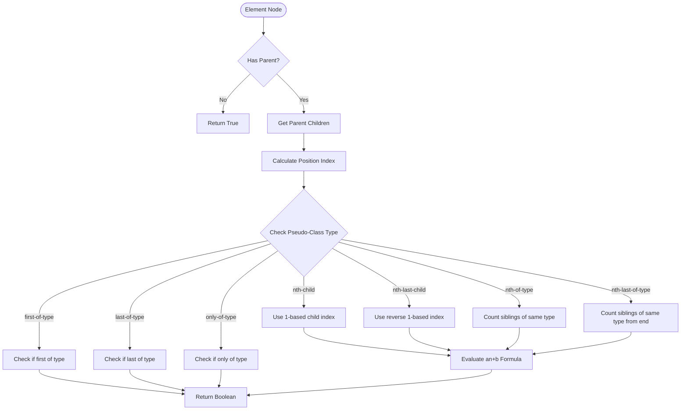

**Diagram sources**
- [css_selectors.dart](file://lib/src/animation/css_selectors.dart)
- [css_cascade_selector_matching.dart](file://lib/src/animation/css_cascade_selector_matching.dart)

#### Enhanced CSS Selector Parsing
The selector parser now handles structural pseudo-classes with comprehensive support:

- **Functional Pseudo-Classes**: Proper parsing of `:nth-child(2n+1)`, `:nth-of-type(odd)`, etc.
- **Keyword Support**: Recognition of `odd`, `even`, and direct number specifications
- **Formula Parsing**: Accurate parsing of the an+b formula with sign handling
- **Type-Specific Matching**: Distinction between child-based and type-based positioning

**Section sources**
- [css_selectors.dart](file://lib/src/animation/css_selectors.dart)
- [css_property_rendering_test.dart](file://test/animation/css_property_rendering_test.dart)
- [css_cascade_selector_matching.dart](file://lib/src/animation/css_cascade_selector_matching.dart)

### Advanced Structural Pseudo-Class Matching
The matching system implements precise CSS specification compliance:

#### Position-Based Matching
- **nth-child**: Uses 1-based indexing from the start of siblings
- **nth-last-child**: Uses 1-based indexing from the end of siblings
- **Formula Evaluation**: Proper evaluation of an+b formulas with integer solutions

#### Type-Based Matching
- **nth-of-type**: Counts only siblings with the same tag name
- **nth-last-of-type**: Counts from the end among siblings of the same type
- **Type Preservation**: Maintains type-specific counting across different element types

#### Simple Type Matching
- **first-of-type**: Matches the first sibling with the same type
- **last-of-type**: Matches the last sibling with the same type
- **only-of-type**: Matches when exactly one sibling has the same type

**Section sources**
- [css_cascade_selector_matching.dart](file://lib/src/animation/css_cascade_selector_matching.dart)
- [css_nth_selectors_test.dart](file://test/animation/css_nth_selectors_test.dart)

## Modern CSS Unit Support
The enhanced CSS system now provides comprehensive support for modern CSS units including ex, ch, and lh units with precise conversion algorithms:

### Enhanced Unit Conversion System
The system now supports a comprehensive range of CSS units with intelligent conversion logic:

#### Standard Units Support
- **Absolute Units**: px, pt, pc, in, cm, mm, q with precise conversion factors
- **Relative Units**: em, rem, % with proper contextual calculations
- **Viewport Units**: vw, vh, vmin, vmax (returned as-is without conversion)
- **Character Units**: ex, ch with font-specific character width calculations
- **Line Units**: lh with line-height approximation

#### Advanced Character Unit Calculations
- **ex Unit**: Width of lowercase 'x' character, approximately 0.5em
- **ch Unit**: Width of '0' character, approximately 0.5em  
- **lh Unit**: Line height of element, approximated as 1.2em
- **Font Size Context**: Proper handling of parent vs current font size context

#### Enhanced Percentage Calculations
- **Container Relative**: Percentages calculated relative to container dimensions
- **Fallback Behavior**: Graceful handling when container size is unavailable
- **Context Awareness**: Different percentage behaviors for different CSS properties

**Section sources**
- [css_variables_calc_evaluator.dart](file://lib/src/animation/css_variables_calc_evaluator.dart)
- [css_property_rendering_test.dart](file://test/animation/css_property_rendering_test.dart)

### Advanced Unit Conversion Algorithms
The unit conversion system implements sophisticated algorithms for modern CSS unit support:

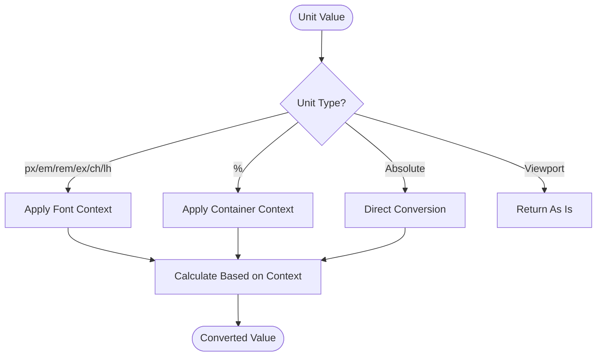

**Diagram sources**
- [css_variables_calc_evaluator.dart](file://lib/src/animation/css_variables_calc_evaluator.dart)

**Section sources**
- [css_variables_calc_evaluator.dart](file://lib/src/animation/css_variables_calc_evaluator.dart)
- [css_property_rendering_test.dart](file://test/animation/css_property_rendering_test.dart)

## SMIL Animation Enhancements
The SMIL animation system has been enhanced with improved motion path parsing and timeline synchronization:

### Enhanced Motion Path Parsing
The animateMotion parser now provides comprehensive path data resolution:

#### Multi-Source Path Resolution
- **Direct Path Data**: Support for inline path attribute values
- **MPATH Reference**: Enhanced mpath element reference resolution
- **Switch Element Support**: Conditional path selection based on system capabilities
- **Coordinate Pair Fallback**: Automatic generation of path data from coordinate values

#### Advanced Path Data Processing
- **Complex Path Commands**: Full support for SVG path syntax
- **Coordinate System Handling**: Proper coordinate transformation and scaling
- **Rotation Mode Support**: Enhanced rotate attribute processing (auto, auto-reverse, angle)
- **Key Point Integration**: Support for keyPoints, keyTimes, and keySplines timing

**Section sources**
- [smil_parser_motion.dart](file://lib/src/animation/smil/smil_parser_motion.dart)

### Enhanced Timeline Synchronization
The timeline system now provides comprehensive syncbase timing support:

#### Advanced Syncbase Event Handling
- **Begin/End Event Propagation**: Automatic triggering of dependent animations
- **Repeat Event Support**: Sophisticated repeat cycle timing with index tracking
- **Offset Condition Processing**: Precise timing offset application
- **Circular Dependency Detection**: Prevention of infinite syncbase loops

#### Enhanced Event-Based Animation
- **DOM Event Integration**: beginEvent, endEvent, repeatEvent dispatching
- **Event Listener Registration**: Dynamic animation activation based on DOM events
- **Event Time Tracking**: Accurate event timing with timestamp management
- **External Listener Support**: Integration with external animation event handlers

**Section sources**
- [smil_timeline_syncbase.dart](file://lib/src/animation/smil/smil_timeline_syncbase.dart)
- [smil_timeline_runtime.dart](file://lib/src/animation/smil/smil_timeline_runtime.dart)

## Advanced Filter System Optimizations

### Enhanced Paint Source Distinction
The filter system now provides sophisticated paint source handling with FillPaint and StrokePaint differentiation:

#### Specialized Paint Pass Classes
The system introduces specialized paint pass classes for optimized paint source handling:

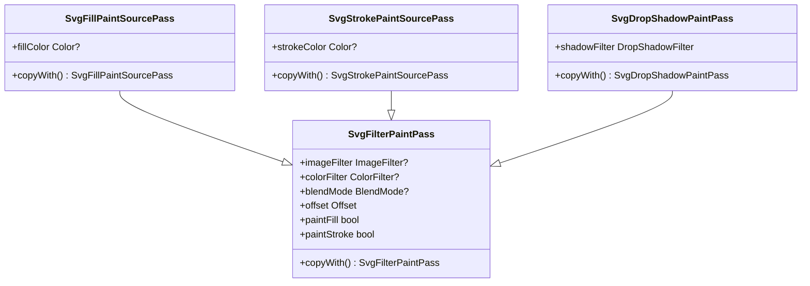

**Diagram sources**
- [svg_filters_registry_pipeline_primitives_paint.dart](file://lib/src/animation/svg_filters_registry_pipeline_primitives_paint.dart)
- [svg_filters_types.dart](file://lib/src/animation/svg_filters_types.dart)

#### Paint Source Optimization
- **FillPaint**: Dedicated pass for element fill paint with paintFill=true, paintStroke=false
- **StrokePaint**: Dedicated pass for element stroke paint with paintFill=false, paintStroke=true
- **Solid Color Optimization**: When paint is solid, optimized color filters are applied
- **Pattern/Gradient Support**: Paint servers are properly rendered through paint passes

#### Advanced Paint Context Propagation
- **Nested Filter Context**: Paint context properly propagated in nested filter scenarios
- **Background Paint Integration**: BackgroundImage/BackgroundAlpha with proper transform handling
- **Paint Channel Scope**: Maintains proper paintFill/paintStroke flags through filter chains

**Section sources**
- [svg_filters_registry_pipeline_primitives_paint.dart](file://lib/src/animation/svg_filters_registry_pipeline_primitives_paint.dart)
- [svg_filters_types.dart](file://lib/src/animation/svg_filters_types.dart)

### Comprehensive Filter Pipeline Compositing
The filter system now provides advanced compositing support with recursive composition handling:

#### Advanced Compositing Operations
The compositing system handles complex filter combinations:

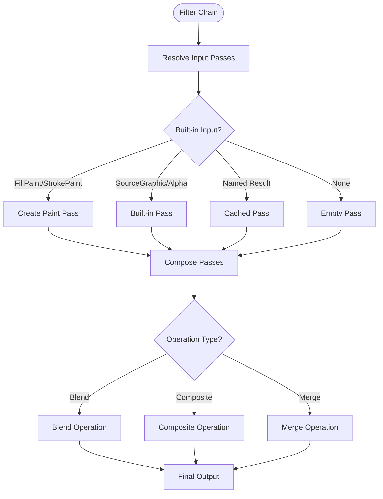

**Diagram sources**
- [svg_filters_registry_pipeline_compositing.dart](file://lib/src/animation/svg_filters_registry_pipeline_compositing.dart)

#### Recursive Filter Composition
- **Deep Chain Support**: Up to 64-level maximum depth with circular reference detection
- **Named Result Caching**: Efficient reuse of intermediate filter results
- **Multi-Hop Resolution**: Complex chains like A→B→C→D with proper result caching
- **Circular Reference Prevention**: Detection and handling of recursive filter compositions

#### Advanced Compositing Features
- **feBlend**: Advanced blend mode support with proper input handling
- **feComposite**: Comprehensive operator support including arithmetic with k-coefficients
- **feMerge**: Complex merge operations with multiple feMergeNode children
- **feDropShadow**: Multi-pass shadow composition with proper layering

**Section sources**
- [svg_filters_registry_pipeline_compositing.dart](file://lib/src/animation/svg_filters_registry_pipeline_compositing.dart)
- [svg_filters_registry_pipeline.dart](file://lib/src/animation/svg_filters_registry_pipeline.dart)

### Enhanced Input Graph Semantics
The input system now provides comprehensive filter input handling with advanced edge case management:

#### Advanced Input Resolution
The input resolver handles complex scenarios:

- **FillPaint/StrokePaint Semantics**: Proper paint source distinction and context propagation
- **Case-Insensitive Built-ins**: Baseline compatibility with case-insensitive input names
- **Forward Reference Handling**: Transparent black output for unresolved forward references
- **Named Result Reuse**: Efficient caching and copying of intermediate results
- **in="none" Handling**: Explicit transparent black production with no fallback

#### Input Graph Hardening
- **Circular Reference Detection**: Prevention of infinite recursion in filter chains
- **Resolution Depth Tracking**: Maximum 64-level depth with safety thresholds
- **Result Caching Strategy**: Prevents accidental mutation of cached filter results
- **Multi-Primitive Sharing**: Support for multiple downstream primitives using same input

**Section sources**
- [svg_filters_registry_inputs.dart](file://lib/src/animation/svg_filters_registry_inputs.dart)
- [filter_advanced_input_graph_test.dart](file://test/animation/filter_advanced_input_graph_test.dart)

## Enhanced Recursion Safety and Error Handling
The enhanced CSS calculation system now includes comprehensive recursion safety measures and improved error handling:

### Recursion Safety Measures
The system implements robust recursion prevention with a 20-level maximum nesting depth:

#### Depth Tracking Implementation
- **Maximum Nesting Depth**: 20 levels enforced across all CSS functions (calc, min, max, clamp)
- **Recursive Evaluation**: All nested function calls pass through depth tracking
- **Safety Threshold**: Exceeding depth limit returns null instead of causing stack overflow
- **Progressive Evaluation**: Each recursive level increments the depth counter

#### Enhanced Error Recovery
The system provides comprehensive error handling for malformed expressions:

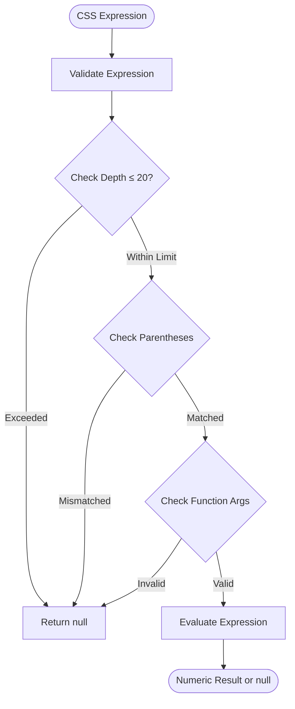

**Diagram sources**
- [css_variables_calc_evaluator.dart](file://lib/src/animation/css_variables_calc_evaluator.dart)

#### Comprehensive Expression Validation
The system validates expressions at multiple levels:

- **Syntax Validation**: Checks for proper parentheses matching
- **Argument Validation**: Validates CSS function arguments (min requires 2+, max requires 1+, clamp requires 3)
- **Operator Validation**: Ensures proper operator placement and usage
- **Unit Validation**: Verifies unit compatibility and conversion
- **Depth Validation**: Monitors recursion depth across all function types

#### Graceful Error Handling
The system implements graceful fallback behavior:

- **Malformed Expressions**: Return null instead of throwing exceptions
- **Unmatched Parentheses**: Detect and handle unmatched parentheses
- **Invalid Arguments**: Validate function arguments and return null for invalid counts
- **Division by Zero**: Handle with zero result and continue evaluation
- **Empty Expressions**: Gracefully handle empty or whitespace-only expressions

**Section sources**
- [css_variables_calc_evaluator.dart](file://lib/src/animation/css_variables_calc_evaluator.dart)
- [css_calc_edge_cases_test.dart](file://test/animation/css_calc_edge_cases_test.dart)

### Enhanced Variable Resolution Safety
The variable resolution system includes additional safety measures:

#### Iteration Limits
- **Maximum Iterations**: 10 iterations to prevent infinite variable resolution loops
- **Circular Reference Detection**: Prevents circular variable references
- **Fallback Chain Validation**: Validates nested fallback chains

#### Enhanced Error Recovery
- **Missing Variables**: Return empty string for undefined variables with no fallback
- **Invalid Fallbacks**: Gracefully handle malformed fallback expressions
- **Use Context Errors**: Handle missing use context properties safely

**Section sources**
- [css_variables_calc_resolver.dart](file://lib/src/animation/css_variables_calc_resolver.dart)
- [css_variables_calc_test.dart](file://test/animation/css_variables_calc_test.dart)

## Dependency Analysis
The enhanced CSS system maintains carefully managed dependencies with improved modularity and performance:

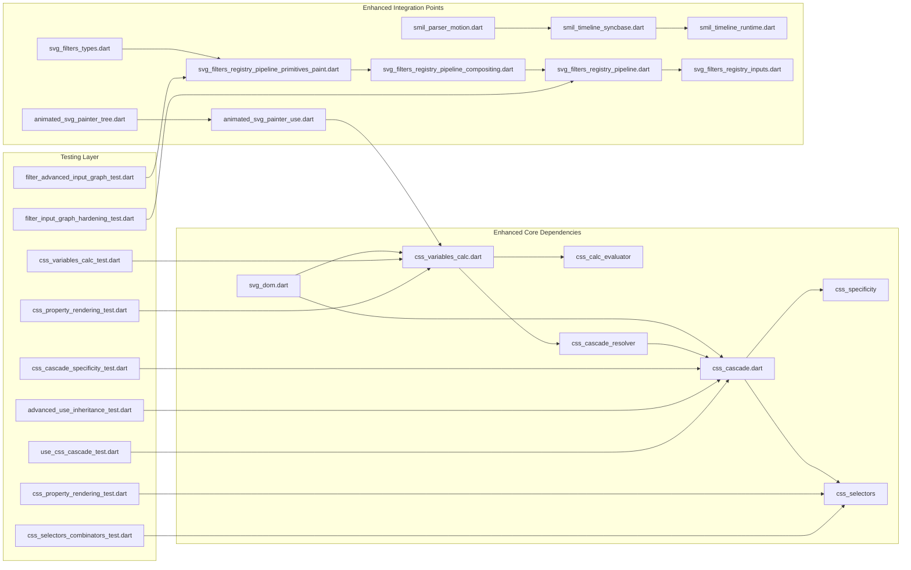

**Diagram sources**
- [css_variables_calc.dart](file://lib/src/animation/css_variables_calc.dart)
- [css_cascade.dart](file://lib/src/animation/css_cascade.dart)
- [css_selectors.dart](file://lib/src/animation/css_selectors.dart)
- [svg_dom.dart](file://lib/src/animation/svg_dom.dart)
- [animated_svg_painter_use.dart](file://lib/src/animation/animated_svg_painter_use.dart)
- [animated_svg_painter_tree.dart](file://lib/src/animation/animated_svg_painter_tree.dart)
- [smil_parser_motion.dart](file://lib/src/animation/smil/smil_parser_motion.dart)
- [smil_timeline_syncbase.dart](file://lib/src/animation/smil/smil_timeline_syncbase.dart)
- [smil_timeline_runtime.dart](file://lib/src/animation/smil/smil_timeline_runtime.dart)
- [svg_filters_registry_pipeline_primitives_paint.dart](file://lib/src/animation/svg_filters_registry_pipeline_primitives_paint.dart)
- [svg_filters_registry_pipeline_compositing.dart](file://lib/src/animation/svg_filters_registry_pipeline_compositing.dart)
- [svg_filters_registry_pipeline.dart](file://lib/src/animation/svg_filters_registry_pipeline.dart)
- [svg_filters_registry_inputs.dart](file://lib/src/animation/svg_filters_registry_inputs.dart)
- [svg_filters_types.dart](file://lib/src/animation/svg_filters_types.dart)

The enhanced dependency graph shows improved separation of concerns with better modularization, enhanced SMIL and filter system integration, CSS variables cascade resolver integration, comprehensive recursion safety measures, and minimal circular dependencies for optimal maintainability and testability.

**Section sources**
- [css_variables_calc.dart](file://lib/src/animation/css_variables_calc.dart)
- [css_cascade.dart](file://lib/src/animation/css_cascade.dart)
- [css_selectors.dart](file://lib/src/animation/css_selectors.dart)

## Performance Considerations
The enhanced implementation includes several advanced performance optimizations:

### Memory Management
- **Weak Map Pattern**: Custom property storage with automatic garbage collection
- **String Interning**: Repeated property values share memory efficiently
- **Lazy Evaluation**: Calculations performed only when needed with caching
- **Circular Reference Protection**: Prevention of memory leaks in complex filter chains

### Computational Efficiency
- **Enhanced Caching Strategies**: CSS rule matching, specificity calculations, variable resolution, structural pseudo-class matching, and expression validation cached
- **Early Termination**: Variable resolution stops at first match with use context handling
- **Optimized Parsing**: Regex-based parsing with minimal backtracking and CSS function recognition
- **Pipeline Optimization**: Filter primitive output caching and result sharing
- **Recursion Safety**: Depth tracking prevents stack overflow and excessive computation

### Rendering Integration
- **Incremental Updates**: Only affected nodes re-evaluate CSS with use context awareness
- **Batch Processing**: Multiple property updates processed together with cascade optimization
- **Resource Pooling**: Reusable buffers and temporary objects with enhanced lifecycle management
- **SMIL Timeline Optimization**: Efficient dependency graph building and event propagation
- **Structural Pseudo-Class Caching**: Matching results cached based on element position and type
- **Expression Validation Caching**: Validation results cached to avoid repeated checks
- **Paint Pass Optimization**: Specialized paint passes reduce unnecessary filter operations

## Troubleshooting Guide

### Common Issues and Solutions

#### Enhanced Variable Resolution Problems
- **Issue**: Variables not resolving in `<use>` contexts with shadow DOM boundaries
- **Solution**: Verify use context is properly established and `useContextCustomPropertyLookup` is set with inheritable property filtering

#### CSS Variables Cascade Resolver Issues
- **Issue**: Custom properties not following CSS cascade rules
- **Solution**: Ensure `CssCascadeVariablesResolver` is properly configured and integrated with the main `CssCascadeResolver`

#### Structural Pseudo-Class Matching Problems
- **Issue**: Structural pseudo-classes not matching expected elements
- **Solution**: Verify element hierarchy and ensure proper tag name matching for type-based pseudo-classes

#### Enhanced CSS Function Errors
- **Issue**: Unexpected results with CSS math functions in variables
- **Solution**: Ensure CSS functions are properly formatted and supported, verify unit compatibility and container size parameters

#### Modern Unit Conversion Issues
- **Issue**: Incorrect ex, ch, or lh unit calculations
- **Solution**: Verify font size context is properly passed (fontSize vs parentFontSize), check that fallback font sizes are available

#### Enhanced Recursion Safety Issues
- **Issue**: Deeply nested expressions causing evaluation failures
- **Solution**: Ensure expressions don't exceed 20 levels of nesting depth, validate parentheses matching, check CSS function argument counts

#### Expression Validation Problems
- **Issue**: Valid expressions returning null unexpectedly
- **Solution**: Verify parentheses are properly matched, check function arguments meet requirements (min: ≥2, max: ≥1, clamp: exactly 3), ensure no malformed characters

#### SMIL Animation Synchronization Issues
- **Issue**: Motion animations not synchronizing with timeline events
- **Solution**: Verify syncbase conditions are properly configured, check event listener registration, and ensure circular dependency detection is not preventing animation activation

#### Advanced Filter System Issues
- **Issue**: FillPaint/StrokePaint not distinguishing properly
- **Solution**: Verify paint context is properly established, check paintFill/paintStroke flags are correctly set, ensure paint source passes are created with proper color filters

#### Filter Pipeline Performance Degradation
- **Issue**: Slow rendering with complex filter chains
- **Solution**: Simplify filter primitive combinations, reduce named result reuse complexity, and optimize filter input graph structure

#### Enhanced Testing and Validation
The comprehensive test suite covers edge cases, integration scenarios, structural pseudo-class matching, enhanced functionality, recursion safety, and error handling:

**Section sources**
- [css_variables_calc_test.dart](file://test/animation/css_variables_calc_test.dart)
- [css_property_rendering_test.dart](file://test/animation/css_property_rendering_test.dart)
- [css_cascade_specificity_test.dart](file://test/animation/css_cascade_specificity_test.dart)
- [advanced_use_inheritance_test.dart](file://test/animation/advanced_use_inheritance_test.dart)
- [use_css_cascade_test.dart](file://test/animation/use_css_cascade_test.dart)
- [css_selectors_combinators_test.dart](file://test/animation/css_selectors_combinators_test.dart)
- [css_calc_edge_cases_test.dart](file://test/animation/css_calc_edge_cases_test.dart)
- [css_nth_selectors_test.dart](file://test/animation/css_nth_selectors_test.dart)
- [filter_advanced_input_graph_test.dart](file://test/animation/filter_advanced_input_graph_test.dart)
- [filter_input_graph_hardening_test.dart](file://test/animation/filter_input_graph_hardening_test.dart)

## Conclusion
The Enhanced CSS Variables and Calculations system provides a robust, standards-compliant implementation that seamlessly integrates with Flutter's SVG rendering pipeline. The system successfully combines CSS custom properties, mathematical expressions, CSS math functions, structural pseudo-classes, and the cascade mechanism while maintaining excellent performance and memory efficiency. The comprehensive testing coverage, enhanced SMIL animation support, advanced filter primitive processing, improved use context inheritance, modern CSS unit support, new CSS variables cascade resolver integration, comprehensive recursion safety with 20-level maximum nesting depth, and enhanced error handling for malformed expressions and unmatched parentheses ensure reliability across diverse SVG use cases and complex styling scenarios. The system's architecture supports future enhancements while maintaining backward compatibility and optimal performance characteristics with robust safety measures built into the core calculation engine.