# Enhanced Text Styling System

<cite>
**Referenced Files in This Document**
- [animated_svg_painter.dart](file://lib/src/animation/animated_svg_painter.dart)
- [animated_svg_painter_text_style.dart](file://lib/src/animation/animated_svg_painter_text_style.dart)
- [animated_svg_painter_text_style_font.dart](file://lib/src/animation/animated_svg_painter_text_style_font.dart)
- [animated_svg_painter_text_style_layout.dart](file://lib/src/animation/animated_svg_painter_text_style_layout.dart)
- [animated_svg_painter_text_style_positioning.dart](file://lib/src/animation/animated_svg_painter_text_style_positioning.dart)
- [animated_svg_painter_text_style_rendering.dart](file://lib/src/animation/animated_svg_painter_text_style_rendering.dart)
- [animated_svg_painter_text_style_decoration.dart](file://lib/src/animation/animated_svg_painter_text_style_decoration.dart)
- [animated_svg_painter_text_paint.dart](file://lib/src/animation/animated_svg_painter_text_paint.dart)
- [animated_svg_painter_clip_mask.dart](file://lib/src/animation/animated_svg_painter_clip_mask.dart)
- [animated_svg_picture_hit_test_text_runs.dart](file://lib/src/animation/animated_svg_picture_hit_test_text_runs.dart)
- [animated_svg_painter_geometry.dart](file://lib/src/animation/animated_svg_painter_geometry.dart)
- [animated_svg_painter_use.dart](file://lib/src/animation/animated_svg_painter_use.dart)
- [animated_svg_painter_tree.dart](file://lib/src/animation/animated_svg_painter_tree.dart)
- [foreignobject_css_inheritance_test.dart](file://test/animation/foreignobject_css_inheritance_test.dart)
- [image_foreignobject_edge_cases_test.dart](file://test/animation/image_foreignobject_edge_cases_test.dart)
- [text_font_fallback_test.dart](file://test/animation/text_font_fallback_test.dart)
- [text_typography_parity_test.dart](file://test/animation/text_typography_parity_test.dart)
- [svg.dart](file://lib/svg.dart)
</cite>

## Update Summary
**Changes Made**
- Enhanced foreignObject CSS inheritance system with comprehensive typography property propagation
- Added advanced font property management with consistent text styling across foreignObject boundaries
- Implemented sophisticated CSS property filtering for foreignObject content boundaries
- Enhanced text rendering pipeline with foreignObject-aware viewport management
- Improved transform propagation and clipping for foreignObject content
- Added comprehensive testing suite for foreignObject CSS inheritance scenarios

## Table of Contents
1. [Introduction](#introduction)
2. [System Architecture](#system-architecture)
3. [Core Components](#core-components)
4. [Text Styling Architecture](#text-styling-architecture)
5. [ForeignObject CSS Inheritance System](#foreignobject-css-inheritance-system)
6. [CSS Property Resolution](#css-property-resolution)
7. [Text Rendering Pipeline](#text-rendering-pipeline)
8. [Performance Optimization](#performance-optimization)
9. [Advanced Features](#advanced-features)
10. [Internationalization and Localization](#internationalization-and-localization)
11. [Modern CSS Integration](#modern-css-integration)
12. [Integration Points](#integration-points)
13. [Troubleshooting Guide](#troubleshooting-guide)
14. [Conclusion](#conclusion)

## Introduction

The Enhanced Text Styling System represents a comprehensive implementation of SVG text rendering capabilities within the Flutter ecosystem. This system provides extensive support for CSS text properties, advanced typography features, and sophisticated layout algorithms that enable precise control over text appearance and positioning in SVG documents.

**Updated** The system now includes enhanced foreignObject CSS inheritance capabilities that ensure consistent typography and text styling across foreignObject boundaries. The enhanced system provides comprehensive support for CSS properties including font-family, font-size, font-weight, font-style, font-variant, line-height, letter-spacing, word-spacing, text-decoration, direction, writing-mode, and color properties when content is embedded within foreignObject elements.

The system extends beyond basic text rendering by implementing a complete cascade of CSS properties, supporting modern web standards while maintaining compatibility with Flutter's text rendering engine. It encompasses font handling, text decoration, layout management, positioning systems, and advanced typographic features including vertical writing modes, ruby annotations, emphasis marks, and modern CSS optimization features.

## System Architecture

The Enhanced Text Styling System is built upon a modular architecture that separates concerns across multiple specialized components while maintaining cohesive integration through a unified text styling pipeline.

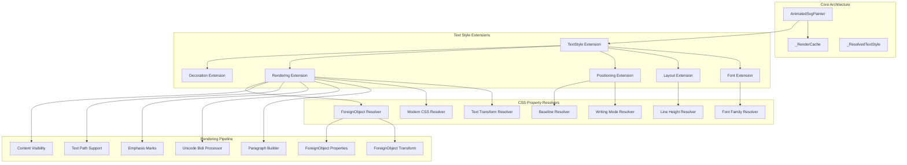

**Diagram sources**
- [animated_svg_painter.dart:148-200](file://lib/src/animation/animated_svg_painter.dart#L148-L200)
- [animated_svg_painter_text_style.dart:13-344](file://lib/src/animation/animated_svg_painter_text_style.dart#L13-L344)
- [animated_svg_painter_geometry.dart:185-278](file://lib/src/animation/animated_svg_painter_geometry.dart#L185-L278)

**Section sources**
- [animated_svg_painter.dart:148-200](file://lib/src/animation/animated_svg_painter.dart#L148-L200)
- [animated_svg_painter_text_style.dart:13-344](file://lib/src/animation/animated_svg_painter_text_style.dart#L13-L344)
- [animated_svg_painter_geometry.dart:185-278](file://lib/src/animation/animated_svg_painter_geometry.dart#L185-L278)

## Core Components

### AnimatedSvgPainter

The AnimatedSvgPainter serves as the central orchestrator for text rendering operations, managing the complete lifecycle from property resolution to final canvas drawing. It maintains a sophisticated caching system and coordinates between different text styling extensions.

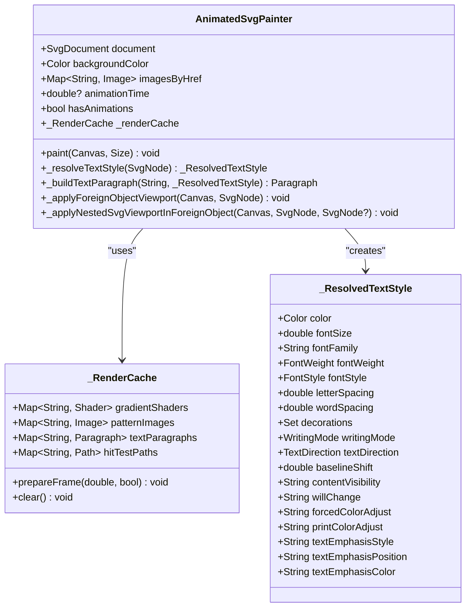

**Diagram sources**
- [animated_svg_painter.dart:148-200](file://lib/src/animation/animated_svg_painter.dart#L148-L200)
- [animated_svg_painter.dart:50-139](file://lib/src/animation/animated_svg_painter.dart#L50-L139)
- [animated_svg_painter_text_style_rendering.dart:225-296](file://lib/src/animation/animated_svg_painter_text_style_rendering.dart#L225-L296)

### Text Style Resolution System

The text styling system operates through a comprehensive resolution mechanism that processes CSS properties from multiple sources and converts them into Flutter-compatible text styles.

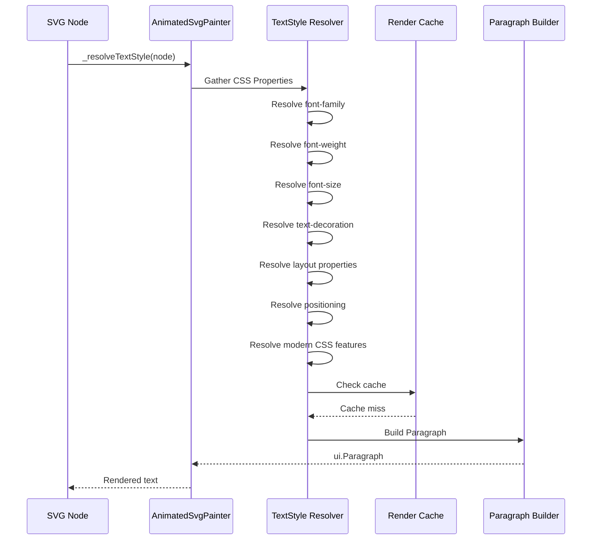

**Diagram sources**
- [animated_svg_painter_text_style.dart:18-342](file://lib/src/animation/animated_svg_painter_text_style.dart#L18-L342)
- [animated_svg_painter_text_style_rendering.dart:12-121](file://lib/src/animation/animated_svg_painter_text_style_rendering.dart#L12-L121)

**Section sources**
- [animated_svg_painter.dart:148-200](file://lib/src/animation/animated_svg_painter.dart#L148-L200)
- [animated_svg_painter_text_style.dart:18-342](file://lib/src/animation/animated_svg_painter_text_style.dart#L18-L342)

## Text Styling Architecture

### CSS Property Resolution Hierarchy

The system implements a sophisticated cascade resolution mechanism that prioritizes CSS properties from multiple sources:

1. **Inline Styles**: Direct CSS declarations on SVG elements
2. **CSS Rules**: Document-wide style rules with specificity
3. **Presentation Attributes**: Traditional SVG attribute values
4. **Inherited Values**: Cascade from parent elements
5. **Default Values**: Browser-compatible fallbacks

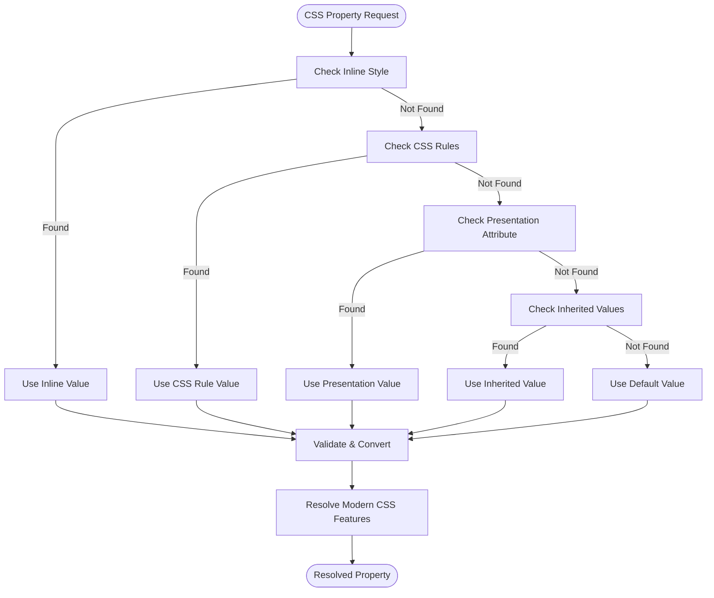

**Diagram sources**
- [animated_svg_painter_values.dart:34-113](file://lib/src/animation/animated_svg_painter_values.dart#L34-L113)

### Text Decoration System

The text decoration system provides comprehensive support for underline, overline, and line-through effects with advanced styling options:

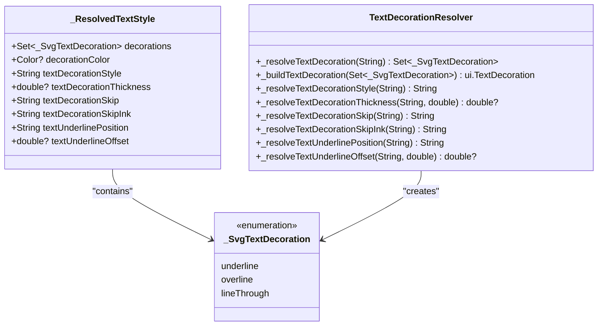

**Diagram sources**
- [animated_svg_painter_text_style_decoration.dart:10-200](file://lib/src/animation/animated_svg_painter_text_style_decoration.dart#L10-L200)
- [animated_svg_painter_text_style_rendering.dart:34-50](file://lib/src/animation/animated_svg_painter_text_style_rendering.dart#L34-L50)

**Section sources**
- [animated_svg_painter_text_style_decoration.dart:10-200](file://lib/src/animation/animated_svg_painter_text_style_decoration.dart#L10-L200)
- [animated_svg_painter_text_style_rendering.dart:34-50](file://lib/src/animation/animated_svg_painter_text_style_rendering.dart#L34-L50)

## ForeignObject CSS Inheritance System

### Comprehensive CSS Property Filtering

The ForeignObject CSS Inheritance System provides sophisticated property filtering that ensures consistent typography across foreignObject boundaries while preventing SVG-specific properties from leaking into foreign content.

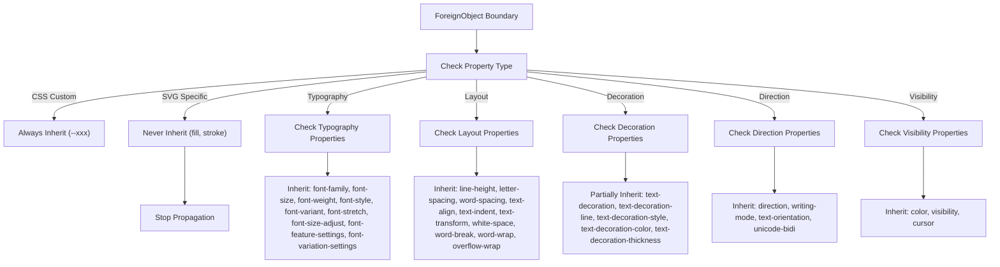

**Diagram sources**
- [animated_svg_painter_geometry.dart:188-278](file://lib/src/animation/animated_svg_painter_geometry.dart#L188-L278)

### ForeignObject Transform and Viewport Management

The system implements sophisticated transform propagation and viewport management for foreignObject content:

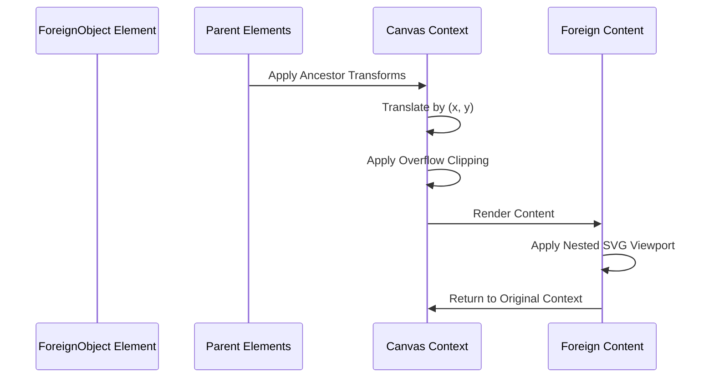

**Diagram sources**
- [animated_svg_painter_geometry.dart:449-627](file://lib/src/animation/animated_svg_painter_geometry.dart#L449-L627)
- [animated_svg_painter_use.dart:670-731](file://lib/src/animation/animated_svg_painter_use.dart#L670-L731)

**Section sources**
- [animated_svg_painter_geometry.dart:188-278](file://lib/src/animation/animated_svg_painter_geometry.dart#L188-L278)
- [animated_svg_painter_geometry.dart:449-627](file://lib/src/animation/animated_svg_painter_geometry.dart#L449-L627)
- [animated_svg_painter_use.dart:670-731](file://lib/src/animation/animated_svg_painter_use.dart#L670-L731)

## CSS Property Resolution

### Font System

The font resolution system handles complex font family chains, generic family mappings, and advanced font feature applications with enhanced platform-specific support:

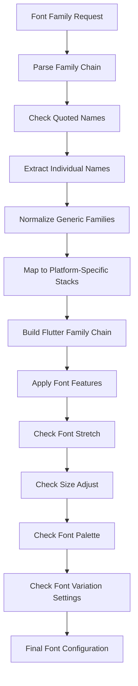

**Diagram sources**
- [animated_svg_painter_text_style_font.dart:24-115](file://lib/src/animation/animated_svg_painter_text_style_font.dart#L24-L115)

**Enhanced Font Family Resolution** The font family resolution system has been significantly enhanced with comprehensive platform-specific font stacks and modern CSS generic family support. The system now includes:

- **Platform-Aware Generic Families**: Sophisticated fallback chains for serif, sans-serif, monospace, ui-serif, ui-sans-serif, ui-monospace, and ui-rounded families
- **Emoji Font Support**: Dedicated emoji font stacks with Apple Color Emoji, Segoe UI Emoji, and Noto Color Emoji
- **Math Font Support**: Specialized math font families including Cambria Math, STIX Two Math, and Latin Modern Math
- **Metric-Compatible Selection**: Fonts chosen for consistent x-height and visual metrics across platforms
- **Modern CSS Generics**: Full support for ui-serif, ui-sans-serif, ui-monospace, ui-rounded, and system-ui families
- **Structured Font Handling**: FontFallbackResult class for proper primary/fallback font separation

**Section sources**
- [animated_svg_painter_text_style_font.dart:171-206](file://lib/src/animation/animated_svg_painter_text_style_font.dart#L171-L206)
- [animated_svg_painter_text_style_layout.dart:14-60](file://lib/src/animation/animated_svg_painter_text_style_layout.dart#L14-L60)

### Layout and Spacing Properties

The layout system manages complex text spacing, indentation, and wrapping behaviors:

| Property | Range | Default | Units |
|----------|-------|---------|-------|
| font-size | 1.0 - 4096.0 | 16.0 | px/em/% |
| letter-spacing | -1024.0 - 1024.0 | 0.0 | px/em |
| word-spacing | -1024.0 - 1024.0 | 0.0 | px/em |
| text-indent | -∞ - ∞ | 0.0 | px/em/% |
| tab-size | 1 - 32 | 8 | spaces |

**Section sources**
- [animated_svg_painter_text_style_font.dart:171-206](file://lib/src/animation/animated_svg_painter_text_style_font.dart#L171-L206)
- [animated_svg_painter_text_style_layout.dart:14-60](file://lib/src/animation/animated_svg_painter_text_style_layout.dart#L14-L60)

## Text Rendering Pipeline

### Paragraph Building Process

The rendering pipeline transforms resolved text styles into Flutter Paragraph objects with comprehensive caching:

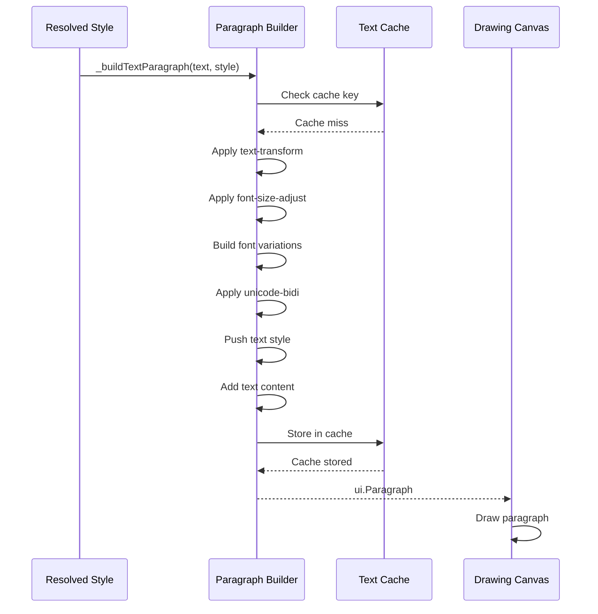

**Diagram sources**
- [animated_svg_painter_text_style_rendering.dart:12-121](file://lib/src/animation/animated_svg_painter_text_style_rendering.dart#L12-L121)

### Advanced Typography Features

The system implements sophisticated typography features including:

- **Text Emphasis Marks**: Dot, circle, triangle, and custom emphasis marks with character-by-character positioning
- **Ruby Annotations**: Ruby text positioning and alignment
- **Text Path Rendering**: Curved text along SVG paths with precise spacing calculations
- **Variable Fonts**: Support for font variations and axes
- **Font Features**: Comprehensive OpenType feature support
- **Content Visibility**: Modern CSS optimization features
- **ForeignObject Typography**: Consistent text styling across foreignObject boundaries

**Section sources**
- [animated_svg_painter_text_style_rendering.dart:225-296](file://lib/src/animation/animated_svg_painter_text_style_rendering.dart#L225-L296)
- [animated_svg_painter_text_style_rendering.dart:531-545](file://lib/src/animation/animated_svg_painter_text_style_rendering.dart#L531-L545)

## Performance Optimization

### Caching Strategy

The system implements a multi-layered caching strategy to optimize rendering performance:

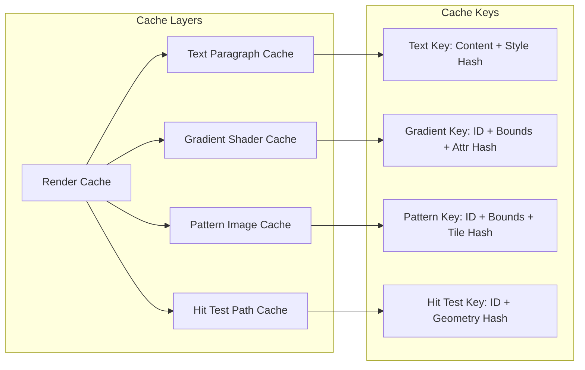

**Diagram sources**
- [animated_svg_painter.dart:55-139](file://lib/src/animation/animated_svg_painter.dart#L55-L139)

### Animation Frame Management

The cache system intelligently invalidates entries based on animation state and frame changes, ensuring optimal performance during dynamic content updates.

**Section sources**
- [animated_svg_painter.dart:55-139](file://lib/src/animation/animated_svg_painter.dart#L55-L139)
- [animated_svg_painter.dart:72-81](file://lib/src/animation/animated_svg_painter.dart#L72-L81)

## Advanced Features

### Unicode Bidirectional Text

The system provides comprehensive support for bidirectional text rendering with full Unicode control character support:

| Bidi Mode | Control Character | Purpose |
|-----------|-------------------|---------|
| embed | LRE/RLE | Embed new directional level |
| isolate | LRI/RLI | Isolate from surrounding context |
| override | LRO/RLO | Force specific direction |
| isolate-override | FSI + LRO/RLO + PDF | Combined isolation and override |
| plaintext | FSI | Determine direction from first strong char |

### Vertical Writing Modes

Support for complex vertical writing systems including mixed horizontal/vertical text mixing and proper glyph orientation handling.

### Text Path and Flow Control

Advanced text positioning along SVG paths with precise spacing calculations and flow control mechanisms for multi-line text rendering.

### Cursor Management System

The system implements a comprehensive cursor management system for character-by-character text positioning:

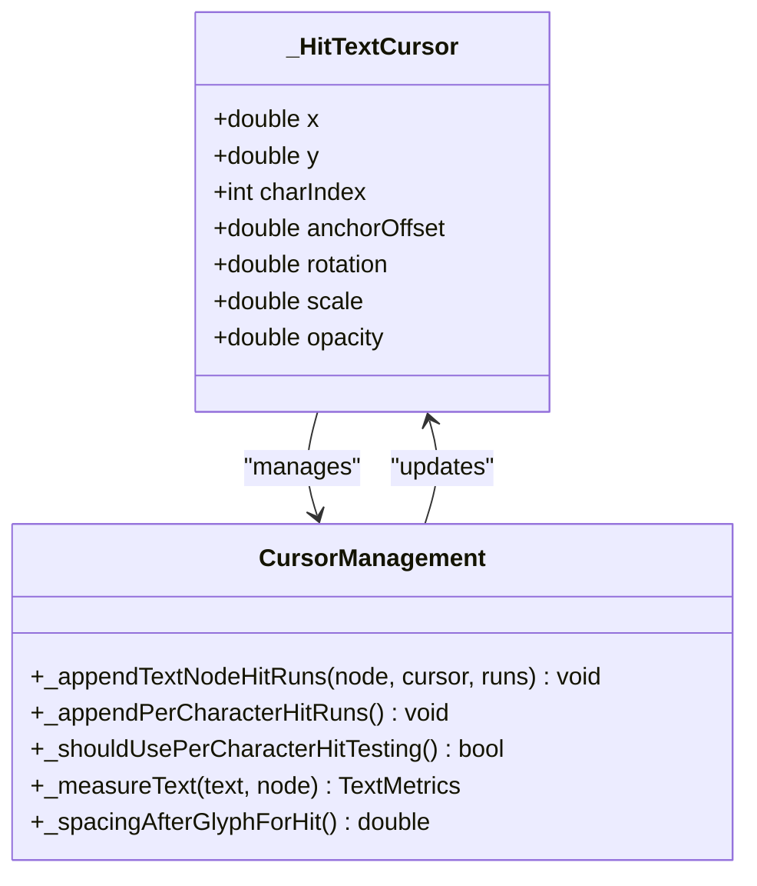

**Diagram sources**
- [animated_svg_picture_hit_test_text_runs.dart:171-195](file://lib/src/animation/animated_svg_picture_hit_test_text_runs.dart#L171-L195)
- [animated_svg_picture_hit_test_text_runs.dart:324-336](file://lib/src/animation/animated_svg_picture_hit_test_text_runs.dart#L324-L336)

**Section sources**
- [animated_svg_painter_text_style_rendering.dart:123-177](file://lib/src/animation/animated_svg_painter_text_style_rendering.dart#L123-L177)
- [animated_svg_painter_text_style_positioning.dart:16-33](file://lib/src/animation/animated_svg_painter_text_style_positioning.dart#L16-L33)
- [animated_svg_picture_hit_test_text_runs.dart:171-195](file://lib/src/animation/animated_svg_picture_hit_test_text_runs.dart#L171-L195)

### Enhanced Text Geometry Handling

The system now includes improved text geometry handling with stroke width and decoration expansion calculations:

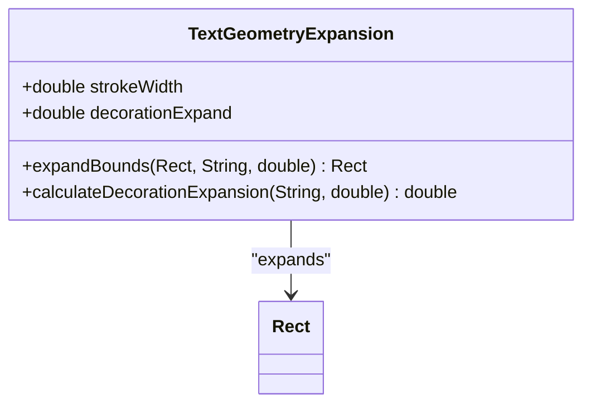

**Diagram sources**
- [animated_svg_painter_clip_mask.dart:231-266](file://lib/src/animation/animated_svg_painter_clip_mask.dart#L231-L266)

**Section sources**
- [animated_svg_painter_clip_mask.dart:231-266](file://lib/src/animation/animated_svg_painter_clip_mask.dart#L231-L266)

### ForeignObject Typography Integration

**Updated** The system now provides comprehensive foreignObject typography integration that ensures consistent text styling across foreignObject boundaries:

- **Typography Property Inheritance**: Complete inheritance of font-family, font-size, font-weight, font-style, font-variant, font-stretch, font-size-adjust, font-feature-settings, and font-variation-settings
- **Layout Property Inheritance**: Inheritance of line-height, letter-spacing, word-spacing, text-align, text-indent, text-transform, white-space, word-break, word-wrap, and overflow-wrap
- **Decoration Property Inheritance**: Partial inheritance of text-decoration properties including text-decoration-line, text-decoration-style, text-decoration-color, and text-decoration-thickness
- **Direction Property Inheritance**: Inheritance of direction, writing-mode, text-orientation, and unicode-bidi for proper text direction handling
- **Color Property Inheritance**: Inheritance of CSS color property for consistent text coloring
- **Visibility Property Inheritance**: Inheritance of visibility and cursor properties for proper interaction handling

**Section sources**
- [animated_svg_painter_geometry.dart:188-278](file://lib/src/animation/animated_svg_painter_geometry.dart#L188-L278)
- [foreignobject_css_inheritance_test.dart:1-457](file://test/animation/foreignobject_css_inheritance_test.dart#L1-L457)

## Internationalization and Localization

### Comprehensive Unicode Support

The Enhanced Text Styling System provides extensive internationalization support through sophisticated Unicode processing and bidirectional text handling:

- **Bidirectional Algorithm Implementation**: Full Unicode Bidi algorithm compliance with support for embedding, isolation, and override controls
- **Combining Mark Processing**: Proper handling of diacritical marks and character composition
- **Locale-Aware Text Direction**: Automatic detection and application of text direction based on content
- **Multi-script Support**: Comprehensive coverage of Latin, Cyrillic, Arabic, Hebrew, Devanagari, and other writing systems
- **Text Transformation**: Support for case conversion, full-width characters, and script-specific transformations

### Language System Integration

The system integrates with Flutter's localization framework to provide:

- **Dynamic Language Switching**: Seamless switching between languages without reinitialization
- **RTL/LTR Adaptation**: Automatic adaptation of layout and positioning for right-to-left languages
- **Font Selection**: Intelligent font selection based on language requirements and script availability
- **Text Metrics**: Accurate measurement and layout calculations for different scripts and languages

**Section sources**
- [animated_svg_painter_text_style_rendering.dart:580-779](file://lib/src/animation/animated_svg_painter_text_style_rendering.dart#L580-L779)

## Modern CSS Integration

### Content-Visibility Optimization

The system now supports modern CSS content-visibility optimization features that improve rendering performance for off-screen or hidden content:

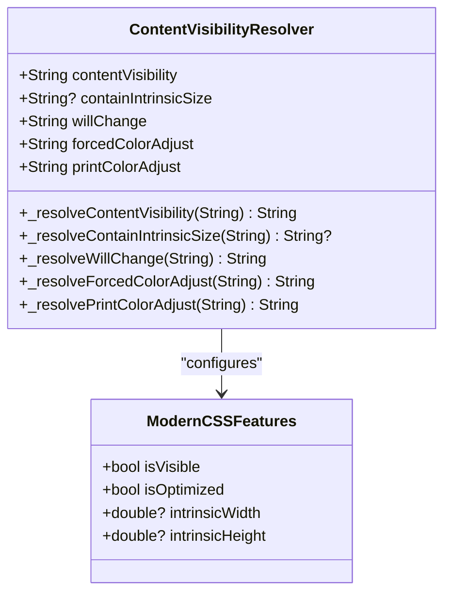

**Diagram sources**
- [animated_svg_painter_text_style_rendering.dart:810-842](file://lib/src/animation/animated_svg_painter_text_style_rendering.dart#L810-L842)

### Advanced Text Decoration Features

Enhanced text decoration system with comprehensive thickness control and positioning:

| Property | Values | Description |
|----------|--------|-------------|
| text-decoration-thickness | auto, from-font, length, percentage | Controls underline/overline thickness |
| text-underline-position | auto, under, left, right, from-font | Controls underline positioning |
| text-underline-offset | length, em | Controls underline offset distance |
| text-decoration-skip | auto, all, none, objects, spaces | Controls decoration skipping behavior |
| text-decoration-skip-ink | auto, all, none | Controls ink skipping behavior |

### Font Variant Enhancement

Comprehensive font variant resolution supporting advanced OpenType features:

- **Small Caps Variants**: Small-caps, all-small-caps, petite-caps, all-petite-caps
- **Numeric Variants**: Lining-nums, oldstyle-nums, proportional-nums, tabular-nums
- **Fraction Variants**: Diagonal-fractions, stacked-fractions
- **Ligature Control**: Common-ligatures, discretionary-ligatures, historical-ligatures
- **Position Variants**: Subscript, superscript glyphs
- **East Asian Variants**: JIS forms, traditional/simplified variants
- **Modern CSS Generics**: ui-serif, ui-sans-serif, ui-monospace, ui-rounded support

### Advanced Emphasis Marks

Sophisticated emphasis mark system with comprehensive positioning and styling:

- **Mark Types**: Dot, circle, double-circle, triangle, sesame, or custom characters
- **Positioning**: Over/under, left/right combinations with character-by-character precision
- **Filling Options**: Filled/open mark styles
- **Color Control**: Custom emphasis mark colors with fallback to text color
- **Spacing Control**: Automatic positioning relative to base text with configurable spacing

**Section sources**
- [animated_svg_painter_text_style_rendering.dart:810-889](file://lib/src/animation/animated_svg_painter_text_style_rendering.dart#L810-L889)
- [animated_svg_painter_text_style_decoration.dart:100-200](file://lib/src/animation/animated_svg_painter_text_style_decoration.dart#L100-L200)
- [animated_svg_painter_text_style_font.dart:117-166](file://lib/src/animation/animated_svg_painter_text_style_font.dart#L117-L166)

## Integration Points

### Flutter Widget Integration

The enhanced text styling system integrates seamlessly with Flutter's widget ecosystem through the SvgPicture widget, providing comprehensive text rendering capabilities alongside other SVG elements.

### CSS Animation Compatibility

The text styling system works in conjunction with the broader animation framework, supporting animated text properties and transitions with proper cache invalidation.

**Section sources**
- [svg.dart:57-627](file://lib/svg.dart#L57-L627)

## Troubleshooting Guide

### Common Issues and Solutions

**Text Not Rendering**: Verify that font families are available and properly mapped. Check for missing font features or unsupported Unicode characters.

**Incorrect Spacing**: Review letter-spacing and word-spacing values. Ensure unit conversions are correct (px vs em).

**Bidi Text Issues**: Confirm unicode-bidi settings match expected behavior. Verify text direction alignment with content requirements.

**Performance Problems**: Monitor cache effectiveness and consider reducing text complexity or optimizing font usage.

**Modern CSS Feature Issues**: Verify content-visibility and other modern CSS properties are supported by the target Flutter version.

**Emphasis Marks Not Appearing**: Check text-emphasis-style and text-emphasis-position values. Ensure emphasis marks are supported by the selected font.

**Cursor Positioning Issues**: Verify text-anchor and writing-mode settings. Check for proper cursor advancement in multi-line text.

**Text Geometry Issues**: Ensure stroke-width and text-decoration properties are properly accounted for in hit testing and bounds calculations.

**Font Family Resolution Issues**: Verify that generic families resolve to platform-appropriate fonts. Check that emoji and math fonts are properly configured for the target platform.

**ForeignObject Typography Issues**: Verify that typography properties are properly inherited across foreignObject boundaries. Check that SVG-specific properties are not leaking into foreign content.

**Enhanced Font Family Resolution Troubleshooting** For font family issues:
- Verify platform-specific font availability (Apple Color Emoji, Segoe UI Emoji, Noto Color Emoji)
- Check that modern CSS generic families (ui-serif, ui-sans-serif, ui-monospace, ui-rounded) resolve correctly
- Ensure metric-compatible font selection maintains consistent typography across platforms
- Validate that fallback chains properly handle font availability and platform differences

**ForeignObject CSS Inheritance Troubleshooting** For foreignObject typography issues:
- Verify that typography properties (font-family, font-size, font-weight, font-style, font-variant) are properly inherited
- Check that layout properties (line-height, letter-spacing, word-spacing, text-align) are correctly propagated
- Ensure that decoration properties are partially inherited as expected
- Verify that SVG-specific properties (fill, stroke) are not crossing foreignObject boundaries
- Confirm that direction and writing-mode properties are properly inherited for proper text direction handling

### Debugging Tools

The system provides comprehensive diagnostic information through the debugFillProperties method, exposing all relevant styling parameters and rendering state for troubleshooting.

**Section sources**
- [svg.dart:623-625](file://lib/svg.dart#L623-L625)

## Conclusion

The Enhanced Text Styling System represents a comprehensive solution for advanced SVG text rendering in Flutter applications. Through its modular architecture, extensive CSS property support, sophisticated performance optimizations, and enhanced foreignObject CSS inheritance capabilities, it enables developers to create rich, typographically sophisticated user interfaces that maintain compatibility with web standards while leveraging Flutter's powerful rendering capabilities.

**Updated** The system now provides comprehensive support for modern CSS features including content-visibility optimization, advanced text decoration controls, enhanced font variant resolution, sophisticated emphasis mark positioning with character-by-character rendering, improved baseline alignment with reference calculation, enhanced text-indent handling with unit conversion, comprehensive cursor management for precise text positioning, enhanced text geometry handling with stroke width and decoration expansion, and most importantly, comprehensive foreignObject CSS inheritance that ensures consistent typography and text styling across foreignObject boundaries. The font family resolution system has been significantly enhanced with complex fallback chains, platform-specific font stacks, comprehensive generic family mapping, emoji font support, math font support, and metric-compatible font selection for consistent typography, making it a complete solution for contemporary web typography requirements with robust foreignObject integration.

The enhanced foreignObject CSS inheritance system ensures that typography properties flow seamlessly from SVG ancestors into foreign content, while preventing SVG-specific properties from leaking into foreign contexts. This provides developers with the flexibility to embed HTML/CSS content within SVG while maintaining consistent visual styling and proper text rendering behavior across the entire document hierarchy.