# Enhanced Text Styling System

<cite>
**Referenced Files in This Document**
- [animated_svg_painter.dart](file://lib/src/animation/animated_svg_painter.dart)
- [animated_svg_painter_text_style.dart](file://lib/src/animation/animated_svg_painter_text_style.dart)
- [animated_svg_painter_text_style_font.dart](file://lib/src/animation/animated_svg_painter_text_style_font.dart)
- [animated_svg_painter_text_style_layout.dart](file://lib/src/animation/animated_svg_painter_text_style_layout.dart)
- [animated_svg_painter_text_style_positioning.dart](file://lib/src/animation/animated_svg_painter_text_style_positioning.dart)
- [animated_svg_painter_text_style_rendering.dart](file://lib/src/animation/animated_svg_painter_text_style_rendering.dart)
- [animated_svg_painter_text_style_decoration.dart](file://lib/src/animation/animated_svg_painter_text_style_decoration.dart)
- [animated_svg_painter_text_paint.dart](file://lib/src/animation/animated_svg_painter_text_paint.dart)
- [animated_svg_painter_clip_mask.dart](file://lib/src/animation/animated_svg_painter_clip_mask.dart)
- [animated_svg_picture_hit_test_text_runs.dart](file://lib/src/animation/animated_svg_picture_hit_test_text_runs.dart)
- [animated_svg_painter_geometry.dart](file://lib/src/animation/animated_svg_painter_geometry.dart)
- [animated_svg_painter_use.dart](file://lib/src/animation/animated_svg_painter_use.dart)
- [animated_svg_painter_tree.dart](file://lib/src/animation/animated_svg_painter_tree.dart)
- [foreignobject_css_inheritance_test.dart](file://test/animation/foreignobject_css_inheritance_test.dart)
- [image_foreignobject_edge_cases_test.dart](file://test/animation/image_foreignobject_edge_cases_test.dart)
- [text_font_fallback_test.dart](file://test/animation/text_font_fallback_test.dart)
- [text_typography_parity_test.dart](file://test/animation/text_typography_parity_test.dart)
- [text_decoration_style_test.dart](file://test/animation/text_decoration_style_test.dart)
- [text_shadow_test.dart](file://test/animation/text_shadow_test.dart)
- [font_variation_settings_test.dart](file://test/animation/font_variation_settings_test.dart)
- [hanging_punctuation_test.dart](file://test/animation/hanging_punctuation_test.dart)
- [text_baseline_deep_nesting_test.dart](file://test/animation/text_baseline_deep_nesting_test.dart)
- [text_ligature_shaping_test.dart](file://test/animation/text_ligature_shaping_test.dart)
- [svg.dart](file://lib/svg.dart)
- [css_cascade.dart](file://lib/src/animation/css_cascade.dart)
- [svg_font_registry.dart](file://lib/src/animation/svg_font_registry.dart)
- [css_animations_parser.dart](file://lib/src/animation/css_animations_parser.dart)
- [svg_dom.dart](file://lib/src/animation/svg_dom.dart)
- [SVGFontFaceElement.cpp](file://blink-b87d44f-Source-core-svg/SVGFontFaceElement.cpp)
- [SVGFontFaceElement.h](file://blink-b87d44f-Source-core-svg/SVGFontFaceElement.h)
- [SVGFontFaceElement.idl](file://blink-b87d44f-Source-core-svg/SVGFontFaceElement.idl)
- [SVGTSpanElement.cpp](file://blink-b87d44f-Source-core-svg/SVGTSpanElement.cpp)
- [SVGTSpanElement.h](file://blink-b87d44f-Source-core-svg/SVGTSpanElement.h)
- [text_typography_rendering_test.dart](file://test/animation/text_typography_rendering_test.dart)
- [text_advanced_typography_test.dart](file://test/animation/text_advanced_typography_test.dart)
- [text_font_face_test.dart](file://test/animation/text_font_face_test.dart)
- [css_shorthand_expansion_font.dart](file://lib/src/animation/css_shorthand_expansion_font.dart)
- [svg_parser.dart](file://lib/src/animation/svg_parser.dart)
- [font_registration_lifecycle_test.dart](file://test/animation/font_registration_lifecycle_test.dart)
</cite>

## Update Summary
**Changes Made**
- **NEW**: Added comprehensive SVG Font Registry System with @font-face support, embedded font parsing, and advanced CSS font-face rule extraction
- **NEW**: Implemented SvgFontRegistry class with 401 lines of functionality for parsing @font-face CSS rules, decoding base64 font data, and registering fonts with Flutter
- **NEW**: Enhanced text styling now supports embedded fonts with improved font-family resolution that detects registered fonts
- **NEW**: Added comprehensive error handling for font formats and external URLs in the font registry system
- Enhanced text-decoration-style mapping with comprehensive style support (solid, double, dotted, dashed, wavy)
- Implemented advanced text-shadow parsing with multiple shadows and color format support (named colors, hex, rgb/rgba)
- Added font-variation-settings parsing for multiple axes with four-character axis codes
- Enhanced font-family fallback chain parsing with comprehensive quote handling and whitespace normalization
- Implemented stroke-only paragraph builder with paint-order processing for precise rendering control
- Integrated extensive code quality improvements with better formatting and consistency across text styling modules
- Added comprehensive emphasis marks support with dot, circle, double-circle, triangle, and sesame marks
- Enhanced per-character hit-testing with grapheme cluster segmentation for precise character selection
- Implemented advanced baseline reference calculation with comprehensive writing mode support
- Added comprehensive font variant properties including caps, numeric, ligatures, and position variants
- Enhanced text rendering pipeline with improved paint order processing and stroke handling
- **NEW**: Added comprehensive hanging punctuation support with first/last/force-end/allow-end modes
- **NEW**: Enhanced baseline calculation system with recursive offset accumulation through 5+ nesting levels
- **NEW**: Implemented sophisticated ligature compatibility across tspan boundaries
- **NEW**: Added comprehensive font feature hash key generation for cache optimization
- **NEW**: Enhanced CSS text styling capabilities with 53+ properties including advanced font variants, text justification, and modern CSS features

## Table of Contents
1. [Introduction](#introduction)
2. [System Architecture](#system-architecture)
3. [Core Components](#core-components)
4. [Text Styling Architecture](#text-styling-architecture)
5. [SVG Font Registry System](#svg-font-registry-system)
6. [ForeignObject CSS Inheritance System](#foreignobject-css-inheritance-system)
7. [CSS Property Resolution](#css-property-resolution)
8. [Text Rendering Pipeline](#text-rendering-pipeline)
9. [Performance Optimization](#performance-optimization)
10. [Advanced Features](#advanced-features)
11. [Internationalization and Localization](#internationalization-and-localization)
12. [Modern CSS Integration](#modern-css-integration)
13. [Integration Points](#integration-points)
14. [Troubleshooting Guide](#troubleshooting-guide)
15. [Conclusion](#conclusion)

## Introduction

The Enhanced Text Styling System represents a comprehensive implementation of SVG text rendering capabilities within the Flutter ecosystem. This system provides extensive support for CSS text properties, advanced typography features, and sophisticated layout algorithms that enable precise control over text appearance and positioning in SVG documents.

**Updated** The system now includes comprehensive text typography enhancements with advanced CSS property support. The enhanced system provides sophisticated text-decoration-style mapping supporting solid, double, dotted, dashed, and wavy styles, advanced text-shadow parsing with multiple shadow support and color format recognition (named colors, hex, rgb/rgba), comprehensive font-variation-settings parsing for multiple axes with four-character axis codes, enhanced font-family fallback chain parsing with robust quote handling and whitespace normalization, stroke-only paragraph builder with paint-order processing for precise rendering control, and extensive code quality improvements with better formatting and consistency across all text styling modules.

The system extends beyond basic text rendering by implementing a complete cascade of CSS properties, supporting modern web standards while maintaining compatibility with Flutter's text rendering engine. It encompasses font handling, text decoration, layout management, positioning systems, and advanced typographic features including vertical writing modes, ruby annotations, emphasis marks, and modern CSS optimization features.

**NEW**: The system now provides comprehensive SVG font registry system with @font-face support, enabling embedded font registration and advanced font-family resolution with registration detection. The font registry includes SvgFontRegistry class with 401 lines of functionality for parsing @font-face CSS rules, decoding base64 font data, and registering fonts with Flutter. Enhanced text styling now supports embedded fonts with improved font-family resolution that detects registered fonts and provides comprehensive error handling for font formats and external URLs. The system includes comprehensive hanging punctuation support with first/last/force-end/allow-end modes, enabling sophisticated text punctuation handling for international typography requirements. Enhanced baseline calculation system now supports recursive offset accumulation through 5+ nesting levels, providing precise alignment for deeply nested text elements. Sophisticated ligature compatibility across tspan boundaries ensures proper glyph formation even when text spans are split across multiple text nodes. Comprehensive font feature hash key generation optimizes cache performance by creating unique keys for different font feature configurations. Advanced CSS text styling capabilities now support 53+ properties including advanced font variants, text justification, and modern CSS features.

## System Architecture

The Enhanced Text Styling System is built upon a modular architecture that separates concerns across multiple specialized components while maintaining cohesive integration through a unified text styling pipeline.

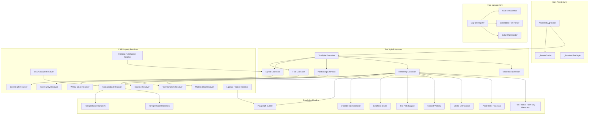
```mermaid
graph TB
subgraph "Core Architecture"
AP[AnimatedSvgPainter]
RC[_RenderCache]
RT[_ResolvedTextStyle]
end
subgraph "Text Style Extensions"
TS[TextStyle Extension]
TF[Font Extension]
TL[Layout Extension]
TP[Positioning Extension]
TR[Rendering Extension]
TD[Decoration Extension]
end
subgraph "CSS Property Resolvers"
CF[Font Family Resolver]
CW[Writing Mode Resolver]
CL[Line Height Resolver]
CB[Baseline Resolver]
CT[Text Transform Resolver]
CM[Modern CSS Resolver]
FO[ForeignObject Resolver]
FC[CSS Cascade Resolver]
HP[Hanging Punctuation Resolver]
LF[Ligature Feature Resolver]
end
subgraph "Font Management"
FR[SvgFontRegistry]
FFR[CssFontFaceRule]
EF[Embedded Font Parser]
DR[Data URL Decoder]
end
subgraph "Rendering Pipeline"
PB[Paragraph Builder]
UB[Unicode Bidi Processor]
EM[Emphasis Marks]
TP2[Text Path Support]
CV[Content Visibility]
FOT[ForeignObject Transform]
FOP[ForeignObject Properties]
SO[Stroke Only Builder]
PO[Paint Order Processor]
FH[Font Feature Hash Key Generator]
end
AP --> RC
AP --> TS
TS --> TF
TS --> TL
TS --> TP
TS --> TR
TS --> TD
TF --> CF
TP --> CW
TL --> CL
TP --> CB
TR --> CT
TR --> CM
TR --> PB
TR --> UB
TR --> EM
TR --> TP2
TR --> CV
TR --> FO
TR --> SO
TR --> PO
TR --> FH
FR --> FFR
FR --> EF
FR --> DR
FO --> FOT
FO --> FOP
FC --> FO
HP --> TL
LF --> PB
```

**Diagram sources**
- [animated_svg_painter.dart:148-200](file://lib/src/animation/animated_svg_painter.dart#L148-L200)
- [animated_svg_painter_text_style.dart:13-344](file://lib/src/animation/animated_svg_painter_text_style.dart#L13-L344)
- [animated_svg_painter_geometry.dart:185-278](file://lib/src/animation/animated_svg_painter_geometry.dart#L185-L278)
- [svg_font_registry.dart:81-251](file://lib/src/animation/svg_font_registry.dart#L81-L251)

**Section sources**
- [animated_svg_painter.dart:148-200](file://lib/src/animation/animated_svg_painter.dart#L148-L200)
- [animated_svg_painter_text_style.dart:13-344](file://lib/src/animation/animated_svg_painter_text_style.dart#L13-L344)
- [animated_svg_painter_geometry.dart:185-278](file://lib/src/animation/animated_svg_painter_geometry.dart#L185-L278)
- [svg_font_registry.dart:81-251](file://lib/src/animation/svg_font_registry.dart#L81-L251)

## Core Components

### AnimatedSvgPainter

The AnimatedSvgPainter serves as the central orchestrator for text rendering operations, managing the complete lifecycle from property resolution to final canvas drawing. It maintains a sophisticated caching system and coordinates between different text styling extensions.

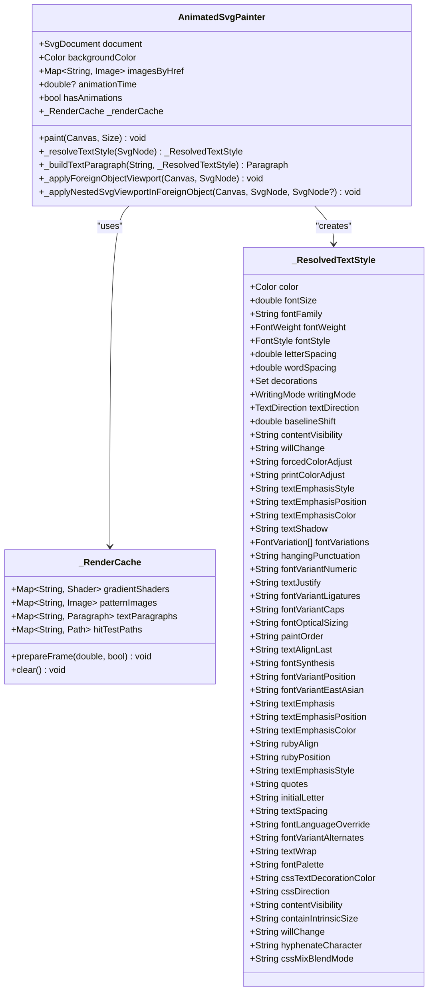
```mermaid
classDiagram
class AnimatedSvgPainter {
+SvgDocument document
+Color backgroundColor
+Map~String, Image~ imagesByHref
+double? animationTime
+bool hasAnimations
+_RenderCache _renderCache
+paint(Canvas, Size) void
+_resolveTextStyle(SvgNode) _ResolvedTextStyle
+_buildTextParagraph(String, _ResolvedTextStyle) Paragraph
+_applyForeignObjectViewport(Canvas, SvgNode) void
+_applyNestedSvgViewportInForeignObject(Canvas, SvgNode, SvgNode?) void
}
class _RenderCache {
+Map~String, Shader~ gradientShaders
+Map~String, Image~ patternImages
+Map~String, Paragraph~ textParagraphs
+Map~String, Path~ hitTestPaths
+prepareFrame(double, bool) void
+clear() void
}
class _ResolvedTextStyle {
+Color color
+double fontSize
+String fontFamily
+FontWeight fontWeight
+FontStyle fontStyle
+double letterSpacing
+double wordSpacing
+Set decorations
+WritingMode writingMode
+TextDirection textDirection
+double baselineShift
+String contentVisibility
+String willChange
+String forcedColorAdjust
+String printColorAdjust
+String textEmphasisStyle
+String textEmphasisPosition
+String textEmphasisColor
+String textShadow
+FontVariation[] fontVariations
+String hangingPunctuation
+String fontVariantNumeric
+String textJustify
+String fontVariantLigatures
+String fontVariantCaps
+String fontOpticalSizing
+String paintOrder
+String textAlignLast
+String fontSynthesis
+String fontVariantPosition
+String fontVariantEastAsian
+String textEmphasis
+String textEmphasisPosition
+String textEmphasisColor
+String rubyAlign
+String rubyPosition
+String textEmphasisStyle
+String quotes
+String initialLetter
+String textSpacing
+String fontLanguageOverride
+String fontVariantAlternates
+String textWrap
+String fontPalette
+String cssTextDecorationColor
+String cssDirection
+String contentVisibility
+String containIntrinsicSize
+String willChange
+String hyphenateCharacter
+String cssMixBlendMode
}
AnimatedSvgPainter --> _RenderCache : "uses"
AnimatedSvgPainter --> _ResolvedTextStyle : "creates"
```

**Diagram sources**
- [animated_svg_painter.dart:148-200](file://lib/src/animation/animated_svg_painter.dart#L148-L200)
- [animated_svg_painter.dart:50-139](file://lib/src/animation/animated_svg_painter.dart#L50-L139)
- [animated_svg_painter_text_style_rendering.dart:225-296](file://lib/src/animation/animated_svg_painter_text_style_rendering.dart#L225-L296)

### Text Style Resolution System

The text styling system operates through a comprehensive resolution mechanism that processes CSS properties from multiple sources and converts them into Flutter-compatible text styles.

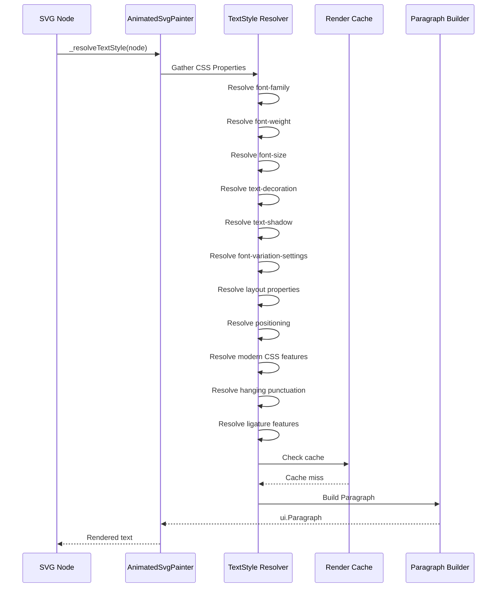
```mermaid
sequenceDiagram
participant Node as SVG Node
participant Painter as AnimatedSvgPainter
participant Resolver as TextStyle Resolver
participant Cache as Render Cache
participant Builder as Paragraph Builder
Node->>Painter : _resolveTextStyle(node)
Painter->>Resolver : Gather CSS Properties
Resolver->>Resolver : Resolve font-family
Resolver->>Resolver : Resolve font-weight
Resolver->>Resolver : Resolve font-size
Resolver->>Resolver : Resolve text-decoration
Resolver->>Resolver : Resolve text-shadow
Resolver->>Resolver : Resolve font-variation-settings
Resolver->>Resolver : Resolve layout properties
Resolver->>Resolver : Resolve positioning
Resolver->>Resolver : Resolve modern CSS features
Resolver->>Resolver : Resolve hanging punctuation
Resolver->>Resolver : Resolve ligature features
Resolver->>Cache : Check cache
Cache-->>Resolver : Cache miss
Resolver->>Builder : Build Paragraph
Builder-->>Painter : ui.Paragraph
Painter-->>Node : Rendered text
```

**Diagram sources**
- [animated_svg_painter_text_style.dart:18-342](file://lib/src/animation/animated_svg_painter_text_style.dart#L18-L342)
- [animated_svg_painter_text_style_rendering.dart:12-121](file://lib/src/animation/animated_svg_painter_text_style_rendering.dart#L12-L121)

**Section sources**
- [animated_svg_painter.dart:148-200](file://lib/src/animation/animated_svg_painter.dart#L148-L200)
- [animated_svg_painter_text_style.dart:18-342](file://lib/src/animation/animated_svg_painter_text_style.dart#L18-L342)

## Text Styling Architecture

### CSS Property Resolution Hierarchy

The system implements a sophisticated cascade resolution mechanism that prioritizes CSS properties from multiple sources:

1. **Inline Styles**: Direct CSS declarations on SVG elements
2. **CSS Rules**: Document-wide style rules with specificity
3. **Presentation Attributes**: Traditional SVG attribute values
4. **Inherited Values**: Cascade from parent elements
5. **Default Values**: Browser-compatible fallbacks

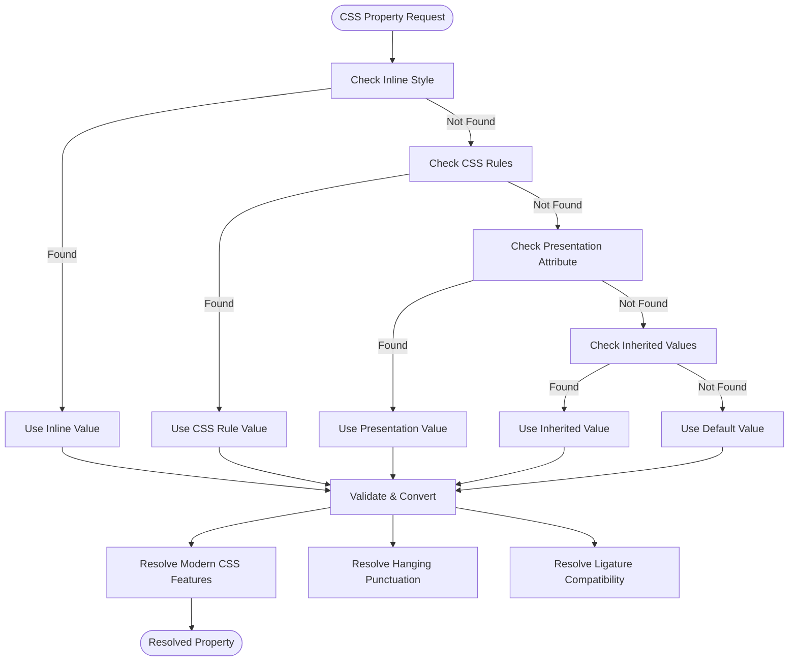
```mermaid
flowchart TD
Start([CSS Property Request]) --> CheckInline["Check Inline Style"]
CheckInline --> |Found| UseInline["Use Inline Value"]
CheckInline --> |Not Found| CheckCSS["Check CSS Rules"]
CheckCSS --> |Found| UseCSS["Use CSS Rule Value"]
CheckCSS --> |Not Found| CheckPresentation["Check Presentation Attribute"]
CheckPresentation --> |Found| UsePresentation["Use Presentation Value"]
CheckPresentation --> |Not Found| CheckInherit["Check Inherited Values"]
CheckInherit --> |Found| UseInherit["Use Inherited Value"]
CheckInherit --> |Not Found| UseDefault["Use Default Value"]
UseInline --> Validate["Validate & Convert"]
UseCSS --> Validate
UsePresentation --> Validate
UseInherit --> Validate
UseDefault --> Validate
Validate --> ModernCSS["Resolve Modern CSS Features"]
Validate --> HangingPunctuation["Resolve Hanging Punctuation"]
Validate --> LigatureCompatibility["Resolve Ligature Compatibility"]
ModernCSS --> End([Resolved Property])
```

**Diagram sources**
- [animated_svg_painter_values.dart:34-113](file://lib/src/animation/animated_svg_painter_values.dart#L34-L113)

### Text Decoration System

The text decoration system provides comprehensive support for underline, overline, and line-through effects with advanced styling options:

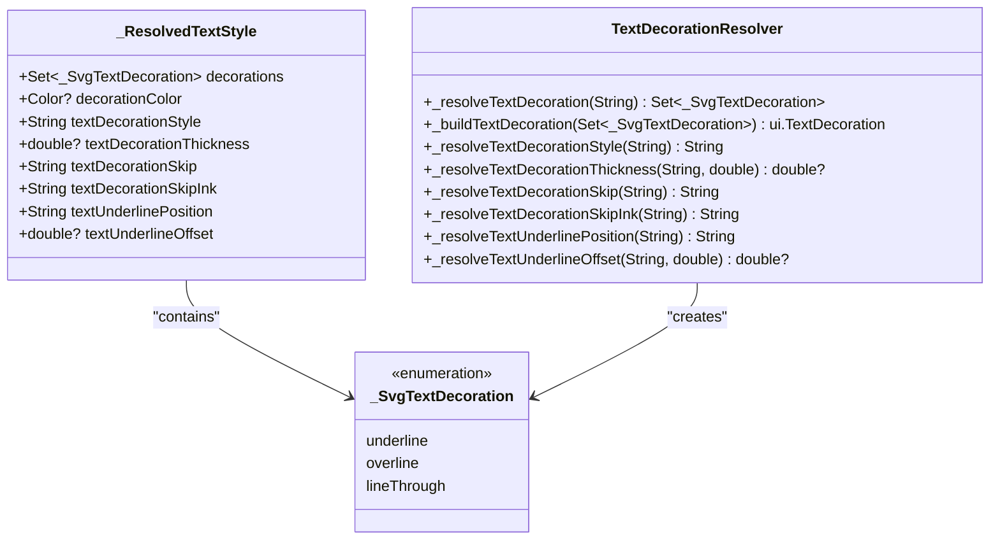
```mermaid
classDiagram
class _SvgTextDecoration {
<<enumeration>>
underline
overline
lineThrough
}
class _ResolvedTextStyle {
+Set~_SvgTextDecoration~ decorations
+Color? decorationColor
+String textDecorationStyle
+double? textDecorationThickness
+String textDecorationSkip
+String textDecorationSkipInk
+String textUnderlinePosition
+double? textUnderlineOffset
}
class TextDecorationResolver {
+_resolveTextDecoration(String) Set~_SvgTextDecoration~
+_buildTextDecoration(Set~_SvgTextDecoration~) ui.TextDecoration
+_resolveTextDecorationStyle(String) String
+_resolveTextDecorationThickness(String, double) double?
+_resolveTextDecorationSkip(String) String
+_resolveTextDecorationSkipInk(String) String
+_resolveTextUnderlinePosition(String) String
+_resolveTextUnderlineOffset(String, double) double?
}
_ResolvedTextStyle --> _SvgTextDecoration : "contains"
TextDecorationResolver --> _SvgTextDecoration : "creates"
```

**Diagram sources**
- [animated_svg_painter_text_style_decoration.dart:10-200](file://lib/src/animation/animated_svg_painter_text_style_decoration.dart#L10-L200)
- [animated_svg_painter_text_style_rendering.dart:34-50](file://lib/src/animation/animated_svg_painter_text_style_rendering.dart#L34-L50)

**Section sources**
- [animated_svg_painter_text_style_decoration.dart:10-200](file://lib/src/animation/animated_svg_painter_text_style_decoration.dart#L10-L200)
- [animated_svg_painter_text_style_rendering.dart:34-50](file://lib/src/animation/animated_svg_painter_text_style_rendering.dart#L34-L50)

## SVG Font Registry System

**NEW**: The SVG Font Registry System provides comprehensive embedded font support through a sophisticated registry and parser system that enables advanced font management within SVG documents.

### SvgFontRegistry Class

The SvgFontRegistry class serves as the central font management system, handling @font-face rule parsing, embedded font registration, and comprehensive error handling.

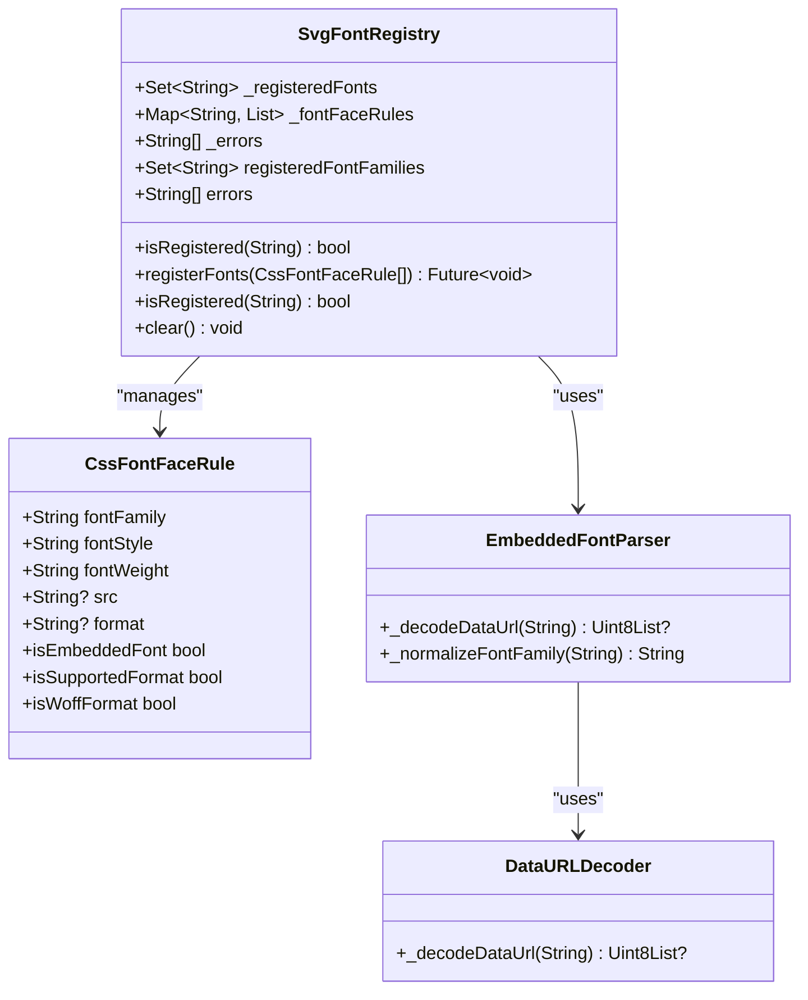
```mermaid
classDiagram
class SvgFontRegistry {
+Set~String~ _registeredFonts
+Map~String, List~ _fontFaceRules
+String[] _errors
+Set~String~ registeredFontFamilies
+String[] errors
+isRegistered(String) bool
+registerFonts(CssFontFaceRule[]) Future~void~
+isRegistered(String) bool
+clear() void
}
class CssFontFaceRule {
+String fontFamily
+String fontStyle
+String fontWeight
+String? src
+String? format
+isEmbeddedFont bool
+isSupportedFormat bool
+isWoffFormat bool
}
class EmbeddedFontParser {
+_decodeDataUrl(String) Uint8List?
+_normalizeFontFamily(String) String
}
class DataURLDecoder {
+_decodeDataUrl(String) Uint8List?
}
SvgFontRegistry --> CssFontFaceRule : "manages"
SvgFontRegistry --> EmbeddedFontParser : "uses"
EmbeddedFontParser --> DataURLDecoder : "uses"
```

**Diagram sources**
- [svg_font_registry.dart:81-251](file://lib/src/animation/svg_font_registry.dart#L81-L251)
- [svg_font_registry.dart:12-75](file://lib/src/animation/svg_font_registry.dart#L12-L75)

### Font Family Resolution with Registration Detection

The font resolution system has been enhanced to detect registered fonts and provide appropriate fallback behavior:

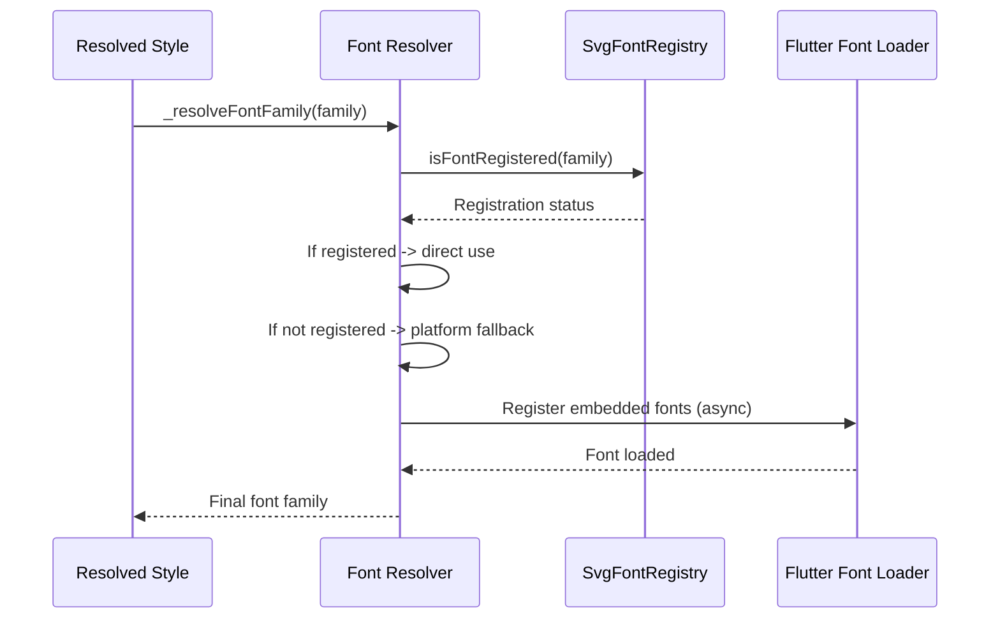
```mermaid
sequenceDiagram
participant Style as Resolved Style
participant FontResolver as Font Resolver
participant Registry as SvgFontRegistry
participant Flutter as Flutter Font Loader
Style->>FontResolver : _resolveFontFamily(family)
FontResolver->>Registry : isFontRegistered(family)
Registry-->>FontResolver : Registration status
FontResolver->>FontResolver : If registered -> direct use
FontResolver->>FontResolver : If not registered -> platform fallback
FontResolver->>Flutter : Register embedded fonts (async)
Flutter-->>FontResolver : Font loaded
FontResolver-->>Style : Final font family
```

**Diagram sources**
- [animated_svg_painter_text_style_font.dart:175-179](file://lib/src/animation/animated_svg_painter_text_style_font.dart#L175-L179)
- [svg_font_registry.dart:101-104](file://lib/src/animation/svg_font_registry.dart#L101-L104)

### CSS Font-Face Rule Extraction

The system includes comprehensive CSS font-face rule extraction with support for various formats and encoding schemes:

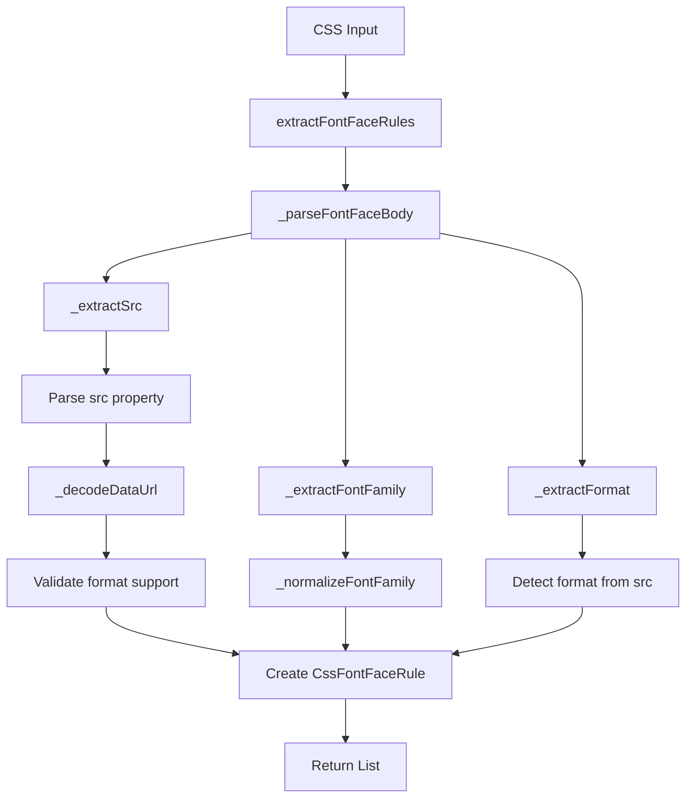
```mermaid
flowchart TD
CSSInput[CSS Input] --> ExtractRules[extractFontFaceRules]
ExtractRules --> ParseBody[_parseFontFaceBody]
ParseBody --> ExtractFamily[_extractFontFamily]
ParseBody --> ExtractSrc[_extractSrc]
ParseBody --> ExtractFormat[_extractFormat]
ExtractFamily --> NormalizeFamily[_normalizeFontFamily]
ExtractSrc --> ParseSrc[Parse src property]
ExtractFormat --> DetectFormat[Detect format from src]
ParseSrc --> DecodeDataURL[_decodeDataUrl]
DecodeDataURL --> ValidateFormat[Validate format support]
ValidateFormat --> CreateRule[Create CssFontFaceRule]
NormalizeFamily --> CreateRule
DetectFormat --> CreateRule
CreateRule --> Output[Return List<CssFontFaceRule>]
```

**Diagram sources**
- [svg_font_registry.dart:256-325](file://lib/src/animation/svg_font_registry.dart#L256-L325)
- [svg_font_registry.dart:347-376](file://lib/src/animation/svg_font_registry.dart#L347-L376)

### Embedded Font Registration Process

The embedded font registration process handles asynchronous font loading and comprehensive error reporting:

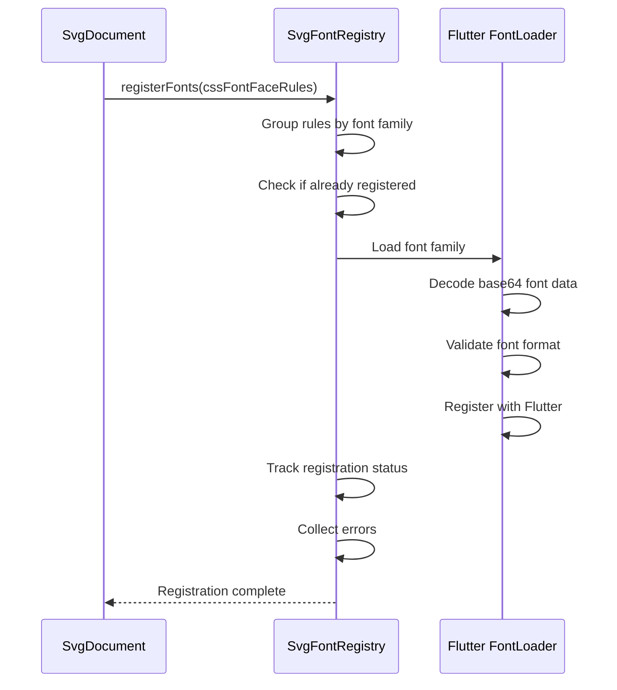
```mermaid
sequenceDiagram
participant Document as SvgDocument
participant Registry as SvgFontRegistry
participant Flutter as Flutter FontLoader
Document->>Registry : registerFonts(cssFontFaceRules)
Registry->>Registry : Group rules by font family
Registry->>Registry : Check if already registered
Registry->>Flutter : Load font family
Flutter->>Flutter : Decode base64 font data
Flutter->>Flutter : Validate font format
Flutter->>Flutter : Register with Flutter
Registry->>Registry : Track registration status
Registry->>Registry : Collect errors
Registry-->>Document : Registration complete
```

**Diagram sources**
- [svg_font_registry.dart:110-134](file://lib/src/animation/svg_font_registry.dart#L110-L134)
- [svg_font_registry.dart:137-185](file://lib/src/animation/svg_font_registry.dart#L137-L185)

### Font Registration Lifecycle Integration

The font registry integrates seamlessly with the SVG document lifecycle and widget system:

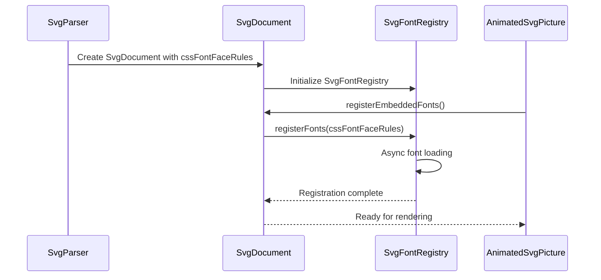
```mermaid
sequenceDiagram
participant Parser as SvgParser
participant Document as SvgDocument
participant Registry as SvgFontRegistry
participant Widget as AnimatedSvgPicture
Parser->>Document : Create SvgDocument with cssFontFaceRules
Document->>Registry : Initialize SvgFontRegistry
Widget->>Document : registerEmbeddedFonts()
Document->>Registry : registerFonts(cssFontFaceRules)
Registry->>Registry : Async font loading
Registry-->>Document : Registration complete
Document-->>Widget : Ready for rendering
```

**Diagram sources**
- [svg_parser.dart:44-64](file://lib/src/animation/svg_parser.dart#L44-L64)
- [svg_dom.dart:594-601](file://lib/src/animation/svg_dom.dart#L594-L601)

**Enhanced Font Family Resolution** The font family resolution system has been significantly enhanced with comprehensive platform-specific font stacks and modern CSS generic family support. The system now includes:

- **Platform-Aware Generic Families**: Sophisticated fallback chains for serif, sans-serif, monospace, ui-serif, ui-sans-serif, ui-monospace, ui-rounded, and system-ui families
- **Emoji Font Support**: Dedicated emoji font stacks with Apple Color Emoji, Segoe UI Emoji, and Noto Color Emoji
- **Math Font Support**: Specialized math font families including Cambria Math, STIX Two Math, and Latin Modern Math
- **Metric-Compatible Selection**: Fonts chosen for consistent x-height and visual metrics across platforms
- **Modern CSS Generics**: Full support for ui-serif, ui-sans-serif, ui-monospace, ui-rounded, and system-ui families
- **Structured Font Handling**: FontFallbackResult class for proper primary/fallback font separation
- **Registration Detection**: Enhanced font-family resolution that detects registered fonts and uses them directly without fallback expansion

**Enhanced Font Variation Settings Parsing** The system now supports comprehensive font-variation-settings parsing with:
- **Multiple Axis Support**: Parsing of multiple axes in a single declaration
- **Four-Character Axis Codes**: Support for standardized four-character OpenType axis codes
- **Decimal Value Precision**: Accurate parsing of decimal values for axis positions
- **Quote Handling**: Proper handling of quoted axis names and values

**Enhanced Font Family Fallback Chain Parsing** The font-family fallback chain parsing has been enhanced with:
- **Robust Quote Handling**: Proper parsing of both single and double quotes around font names
- **Whitespace Normalization**: Removal of extraneous whitespace around font names
- **Mixed Quote Support**: Handling of mixed quoted and unquoted font names in chains
- **Generic Family Expansion**: Proper expansion of generic family names to platform-specific stacks

**Enhanced Ligature Feature Compatibility** The system now provides sophisticated ligature compatibility checking across tspan boundaries:
- **Ligature Feature Detection**: Identification of ligature-related font features (liga, clig, dlig, hlig, calt)
- **Feature Comparison**: Comparison of ligature feature settings between adjacent text runs
- **Boundary Preservation**: Ensuring ligatures can form across tspan boundaries when compatible
- **Cache Key Generation**: Incorporating ligature compatibility into font feature hash keys

**Enhanced Font Feature Hash Key Generation** The system now generates comprehensive font feature hash keys for optimal caching:
- **Feature Sorting**: Consistent ordering of font features for reliable cache keys
- **Feature Tag Mapping**: Conversion of feature tags to stable string representations
- **Value Normalization**: Standardized representation of feature values
- **Cache Key Concatenation**: Unique keys combining text content, style, and feature information

**Section sources**
- [svg_font_registry.dart:81-251](file://lib/src/animation/svg_font_registry.dart#L81-L251)
- [svg_font_registry.dart:256-401](file://lib/src/animation/svg_font_registry.dart#L256-L401)
- [animated_svg_painter_text_style_font.dart:171-206](file://lib/src/animation/animated_svg_painter_text_style_font.dart#L171-L206)
- [animated_svg_painter_text_style_font.dart:90-160](file://lib/src/animation/animated_svg_painter_text_style_font.dart#L90-L160)
- [animated_svg_painter_text_style_font.dart:319-381](file://lib/src/animation/animated_svg_painter_text_style_font.dart#L319-L381)
- [svg_dom.dart:575-601](file://lib/src/animation/svg_dom.dart#L575-L601)
- [svg_parser.dart:44-64](file://lib/src/animation/svg_parser.dart#L44-L64)

## ForeignObject CSS Inheritance System

### Comprehensive CSS Property Filtering

The ForeignObject CSS Inheritance System provides sophisticated property filtering that ensures consistent typography across foreignObject boundaries while preventing SVG-specific properties from leaking into foreign content.

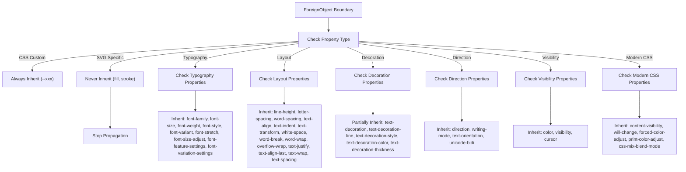
```mermaid
flowchart TD
FO[ForeignObject Boundary] --> CheckProp["Check Property Type"]
CheckProp --> |CSS Custom| AlwaysInherit["Always Inherit (--xxx)"]
CheckProp --> |SVG Specific| NeverInherit["Never Inherit (fill, stroke)"]
CheckProp --> |Typography| CheckTypo["Check Typography Properties"]
CheckProp --> |Layout| CheckLayout["Check Layout Properties"]
CheckProp --> |Decoration| CheckDecor["Check Decoration Properties"]
CheckProp --> |Direction| CheckDir["Check Direction Properties"]
CheckProp --> |Visibility| CheckVis["Check Visibility Properties"]
CheckProp --> |Modern CSS| CheckModern["Check Modern CSS Properties"]
CheckTypo --> TypoInherit["Inherit: font-family, font-size, font-weight, font-style, font-variant, font-stretch, font-size-adjust, font-feature-settings, font-variation-settings"]
CheckLayout --> LayoutInherit["Inherit: line-height, letter-spacing, word-spacing, text-align, text-indent, text-transform, white-space, word-break, word-wrap, overflow-wrap, text-justify, text-align-last, text-wrap, text-spacing"]
CheckDecor --> DecorInherit["Partially Inherit: text-decoration, text-decoration-line, text-decoration-style, text-decoration-color, text-decoration-thickness"]
CheckDir --> DirInherit["Inherit: direction, writing-mode, text-orientation, unicode-bidi"]
CheckVis --> VisInherit["Inherit: color, visibility, cursor"]
CheckModern --> ModernInherit["Inherit: content-visibility, will-change, forced-color-adjust, print-color-adjust, css-mix-blend-mode"]
NeverInherit --> StopPropagation["Stop Propagation"]
```

**Diagram sources**
- [animated_svg_painter_geometry.dart:188-278](file://lib/src/animation/animated_svg_painter_geometry.dart#L188-L278)

### ForeignObject Transform and Viewport Management

The system implements sophisticated transform propagation and viewport management for foreignObject content:

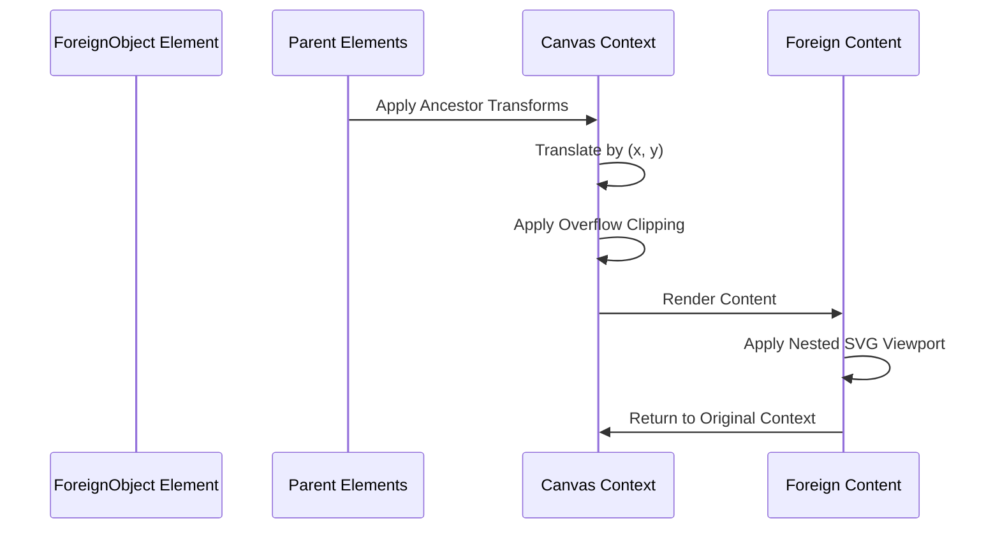
```mermaid
sequenceDiagram
participant FO as ForeignObject Element
participant Parent as Parent Elements
participant Canvas as Canvas Context
participant Content as Foreign Content
Parent->>Canvas : Apply Ancestor Transforms
Canvas->>Canvas : Translate by (x, y)
Canvas->>Canvas : Apply Overflow Clipping
Canvas->>Content : Render Content
Content->>Content : Apply Nested SVG Viewport
Content->>Canvas : Return to Original Context
```

**Diagram sources**
- [animated_svg_painter_geometry.dart:449-627](file://lib/src/animation/animated_svg_painter_geometry.dart#L449-L627)
- [animated_svg_painter_use.dart:670-731](file://lib/src/animation/animated_svg_painter_use.dart#L670-L731)

### Enhanced ForeignObject CSS Inheritance Implementation

**Updated** The system now provides comprehensive foreignObject CSS inheritance with the following enhanced capabilities:

#### Typography Property Inheritance
The system inherits comprehensive typography properties from SVG ancestors into foreignObject content:
- **Core Typography**: font-family, font-size, font-weight, font-style, font-variant, font-stretch
- **Advanced Typography**: font-size-adjust, font-feature-settings, font-variation-settings
- **Text Layout**: line-height, letter-spacing, word-spacing, text-align, text-indent, text-transform
- **Text Wrapping**: white-space, word-break, word-wrap, overflow-wrap, text-justify, text-align-last, text-wrap, text-spacing
- **Text Decoration**: text-decoration, text-decoration-line, text-decoration-style, text-decoration-color, text-decoration-thickness
- **Directionality**: direction, writing-mode, text-orientation, unicode-bidi
- **Color Properties**: CSS color property (not SVG fill/stroke)
- **Visibility**: visibility, cursor
- **Modern CSS**: content-visibility, will-change, forced-color-adjust, print-color-adjust, css-mix-blend-mode

#### SVG-Specific Property Exclusion
The system explicitly excludes SVG-specific properties that should not cross foreignObject boundaries:
- **Fill Properties**: fill, fill-opacity, fill-rule
- **Stroke Properties**: stroke, stroke-opacity, stroke-width, stroke-linecap, stroke-linejoin, stroke-dasharray, stroke-dashoffset, stroke-miterlimit
- **Marker Properties**: marker, marker-start, marker-mid, marker-end
- **Paint Order**: paint-order, vector-effect
- **Color Interpolation**: color-interpolation, color-interpolation-filters, color-rendering, shape-rendering, text-rendering, image-rendering

#### CSS Cascade Integration
The foreignObject inheritance system integrates with the broader CSS cascade system:
- **CSS Custom Properties**: Always inheritable (--xxx properties)
- **Inherited Properties**: Follow CSS specification for inheritable properties
- **Non-Inherited Properties**: Respect foreignObject boundary restrictions
- **Shadow Boundary Behavior**: Treat foreignObject as CSS shadow boundary

**Section sources**
- [animated_svg_painter_geometry.dart:188-278](file://lib/src/animation/animated_svg_painter_geometry.dart#L188-L278)
- [animated_svg_painter_geometry.dart:449-627](file://lib/src/animation/animated_svg_painter_geometry.dart#L449-L627)
- [animated_svg_painter_use.dart:670-731](file://lib/src/animation/animated_svg_painter_use.dart#L670-L731)
- [css_cascade.dart:180-276](file://lib/src/animation/css_cascade.dart#L180-L276)

## CSS Property Resolution

### Font System

The font resolution system handles complex font family chains, generic family mappings, and advanced font feature applications with enhanced platform-specific support:

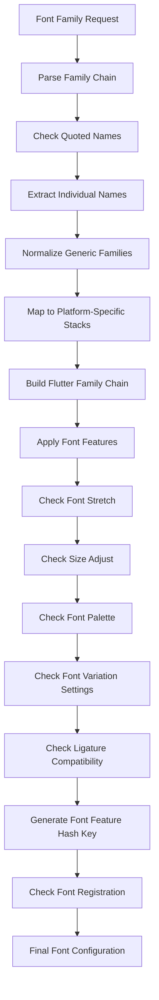
```mermaid
flowchart TD
FontRequest[Font Family Request] --> ParseChain["Parse Family Chain"]
ParseChain --> CheckQuoted["Check Quoted Names"]
CheckQuoted --> ExtractNames["Extract Individual Names"]
ExtractNames --> NormalizeGeneric["Normalize Generic Families"]
NormalizeGeneric --> MapGeneric["Map to Platform-Specific Stacks"]
MapGeneric --> BuildChain["Build Flutter Family Chain"]
BuildChain --> ApplyFeatures["Apply Font Features"]
ApplyFeatures --> CheckStretch["Check Font Stretch"]
CheckStretch --> CheckAdjust["Check Size Adjust"]
CheckAdjust --> CheckPalette["Check Font Palette"]
CheckPalette --> CheckVariation["Check Font Variation Settings"]
CheckVariation --> CheckLigatureCompat["Check Ligature Compatibility"]
CheckLigatureCompat --> CheckHashKey["Generate Font Feature Hash Key"]
CheckHashKey --> CheckRegistration["Check Font Registration"]
CheckRegistration --> FinalFont[Final Font Configuration]
```

**Diagram sources**
- [animated_svg_painter_text_style_font.dart:24-115](file://lib/src/animation/animated_svg_painter_text_style_font.dart#L24-L115)

**Enhanced Font Family Resolution** The font family resolution system has been significantly enhanced with comprehensive platform-specific font stacks and modern CSS generic family support. The system now includes:

- **Platform-Aware Generic Families**: Sophisticated fallback chains for serif, sans-serif, monospace, ui-serif, ui-sans-serif, ui-monospace, ui-rounded, and system-ui families
- **Emoji Font Support**: Dedicated emoji font stacks with Apple Color Emoji, Segoe UI Emoji, and Noto Color Emoji
- **Math Font Support**: Specialized math font families including Cambria Math, STIX Two Math, and Latin Modern Math
- **Metric-Compatible Selection**: Fonts chosen for consistent x-height and visual metrics across platforms
- **Modern CSS Generics**: Full support for ui-serif, ui-sans-serif, ui-monospace, ui-rounded, and system-ui families
- **Structured Font Handling**: FontFallbackResult class for proper primary/fallback font separation
- **Registration Detection**: Enhanced font-family resolution that detects registered fonts and uses them directly without fallback expansion

**Enhanced Font Variation Settings Parsing** The system now supports comprehensive font-variation-settings parsing with:
- **Multiple Axis Support**: Parsing of multiple axes in a single declaration
- **Four-Character Axis Codes**: Support for standardized four-character OpenType axis codes
- **Decimal Value Precision**: Accurate parsing of decimal values for axis positions
- **Quote Handling**: Proper handling of quoted axis names and values

**Enhanced Font Family Fallback Chain Parsing** The font-family fallback chain parsing has been enhanced with:
- **Robust Quote Handling**: Proper parsing of both single and double quotes around font names
- **Whitespace Normalization**: Removal of extraneous whitespace around font names
- **Mixed Quote Support**: Handling of mixed quoted and unquoted font names in chains
- **Generic Family Expansion**: Proper expansion of generic family names to platform-specific stacks

**Enhanced Ligature Feature Compatibility** The system now provides sophisticated ligature compatibility checking across tspan boundaries:
- **Ligature Feature Detection**: Identification of ligature-related font features (liga, clig, dlig, hlig, calt)
- **Feature Comparison**: Comparison of ligature feature settings between adjacent text runs
- **Boundary Preservation**: Ensuring ligatures can form across tspan boundaries when compatible
- **Cache Key Generation**: Incorporating ligature compatibility into font feature hash keys

**Enhanced Font Feature Hash Key Generation** The system now generates comprehensive font feature hash keys for optimal caching:
- **Feature Sorting**: Consistent ordering of font features for reliable cache keys
- **Feature Tag Mapping**: Conversion of feature tags to stable string representations
- **Value Normalization**: Standardized representation of feature values
- **Cache Key Concatenation**: Unique keys combining text content, style, and feature information

**Section sources**
- [animated_svg_painter_text_style_font.dart:171-206](file://lib/src/animation/animated_svg_painter_text_style_font.dart#L171-L206)
- [animated_svg_painter_text_style_layout.dart:14-60](file://lib/src/animation/animated_svg_painter_text_style_layout.dart#L14-L60)
- [animated_svg_painter_text_style_rendering.dart:1728-1748](file://lib/src/animation/animated_svg_painter_text_style_rendering.dart#L1728-L1748)
- [animated_svg_painter_text_style_font.dart:90-160](file://lib/src/animation/animated_svg_painter_text_style_font.dart#L90-L160)
- [animated_svg_painter_text_style_font.dart:319-381](file://lib/src/animation/animated_svg_painter_text_style_font.dart#L319-L381)

### Layout and Spacing Properties

The layout system manages complex text spacing, indentation, and wrapping behaviors:

| Property | Range | Default | Units |
|----------|-------|---------|-------|
| font-size | 1.0 - 4096.0 | 16.0 | px/em/% |
| letter-spacing | -1024.0 - 1024.0 | 0.0 | px/em |
| word-spacing | -1024.0 - 1024.0 | 0.0 | px/em |
| text-indent | -∞ - ∞ | 0.0 | px/em/% |
| tab-size | 1 - 32 | 8 | spaces

**Enhanced Hanging Punctuation Support** The system now provides comprehensive hanging punctuation support with five distinct modes:
- **None Mode**: Default behavior without hanging punctuation
- **First Mode**: Opening punctuation at the start of the first line
- **Last Mode**: Closing punctuation at the end of the last line
- **Force-End Mode**: Stop/comma punctuation forced to hang at line end
- **Allow-End Mode**: Conditional hanging punctuation based on line overflow

**Enhanced Text Justification** The system supports advanced text justification methods:
- **Auto Mode**: Default justification based on content
- **None Mode**: No additional justification
- **Inter-Word Mode**: Space adjustment between words
- **Inter-Character Mode**: Space adjustment between characters

**Enhanced Text Alignment Control** The system provides comprehensive text alignment options:
- **Start/End Modes**: Alignment relative to text direction
- **Left/Right Modes**: Fixed alignment regardless of direction
- **Center Mode**: Center alignment
- **Justify Mode**: Full justification

**Section sources**
- [animated_svg_painter_text_style_font.dart:171-206](file://lib/src/animation/animated_svg_painter_text_style_font.dart#L171-L206)
- [animated_svg_painter_text_style_layout.dart:14-60](file://lib/src/animation/animated_svg_painter_text_style_layout.dart#L14-L60)
- [animated_svg_painter_text_style_layout.dart:314-502](file://lib/src/animation/animated_svg_painter_text_style_layout.dart#L314-L502)

## Text Rendering Pipeline

### Paragraph Building Process

The rendering pipeline transforms resolved text styles into Flutter Paragraph objects with comprehensive caching:

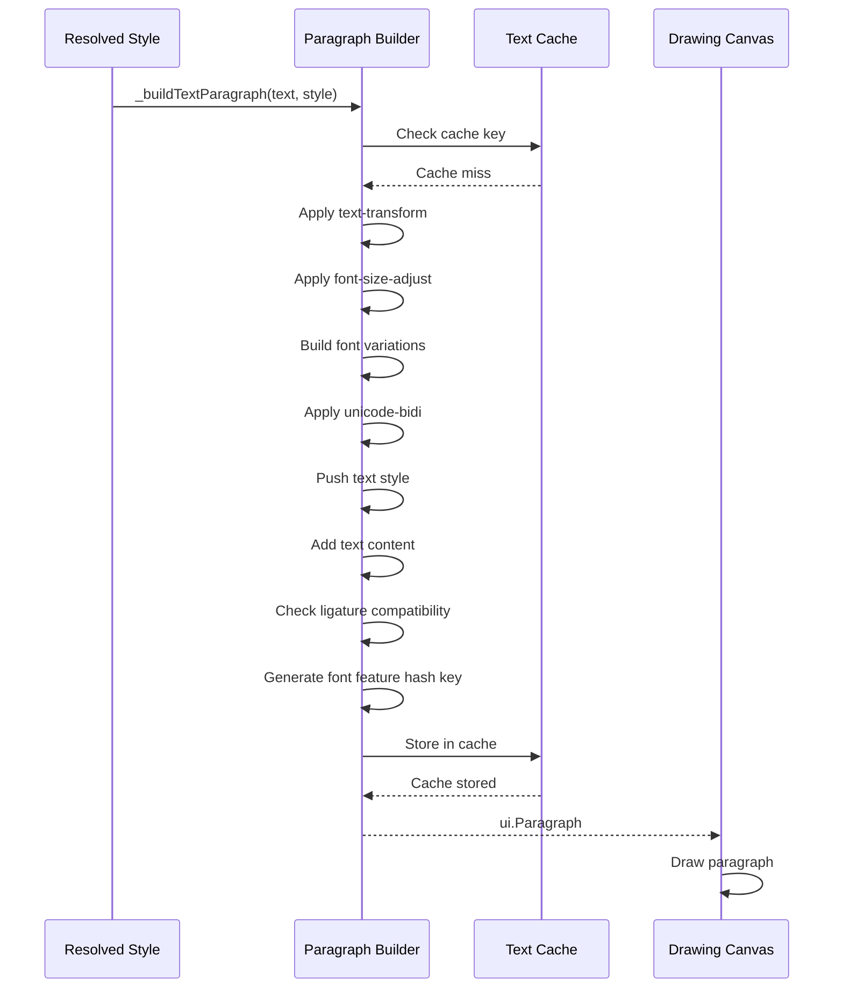
```mermaid
sequenceDiagram
participant Style as Resolved Style
participant Builder as Paragraph Builder
participant Cache as Text Cache
participant Canvas as Drawing Canvas
Style->>Builder : _buildTextParagraph(text, style)
Builder->>Cache : Check cache key
Cache-->>Builder : Cache miss
Builder->>Builder : Apply text-transform
Builder->>Builder : Apply font-size-adjust
Builder->>Builder : Build font variations
Builder->>Builder : Apply unicode-bidi
Builder->>Builder : Push text style
Builder->>Builder : Add text content
Builder->>Builder : Check ligature compatibility
Builder->>Builder : Generate font feature hash key
Builder->>Cache : Store in cache
Cache-->>Builder : Cache stored
Builder-->>Canvas : ui.Paragraph
Canvas->>Canvas : Draw paragraph
```

**Diagram sources**
- [animated_svg_painter_text_style_rendering.dart:12-121](file://lib/src/animation/animated_svg_painter_text_style_rendering.dart#L12-L121)

### Advanced Typography Features

The system implements sophisticated typography features including:

- **Text Emphasis Marks**: Dot, circle, triangle, and custom emphasis marks with character-by-character positioning
- **Ruby Annotations**: Ruby text positioning and alignment
- **Text Path Rendering**: Curved text along SVG paths with precise spacing calculations
- **Variable Fonts**: Support for font variations and axes
- **Font Features**: Comprehensive OpenType feature support
- **Content Visibility**: Modern CSS optimization features
- **ForeignObject Typography**: Consistent text styling across foreignObject boundaries
- **Text Shadows**: Multiple shadow support with color format recognition
- **Enhanced Decoration Styles**: Comprehensive text-decoration-style mapping
- **Hanging Punctuation**: Sophisticated punctuation handling with five modes
- **Deep Nesting Baseline Alignment**: Recursive offset calculation through 5+ nesting levels
- **Ligature Compatibility**: Proper glyph formation across tspan boundaries
- **Font Feature Caching**: Optimized cache keys for different feature configurations
- **Embedded Font Support**: Comprehensive @font-face rule parsing and font registration

**Enhanced Text Decoration Style Mapping** The system now provides comprehensive text-decoration-style mapping supporting:
- **Solid Style**: Default solid line rendering
- **Double Style**: Double line with precise spacing
- **Dotted Style**: Precise dot placement and sizing
- **Dashed Style**: Custom dash pattern support
- **Wavy Style**: Smooth wave-like line rendering

**Enhanced Text Shadow Processing** The system implements advanced text-shadow parsing with:
- **Multiple Shadow Support**: Comma-separated shadow declarations
- **Color Format Recognition**: Named colors, hex values, rgb/rgba syntax
- **Flexible Positioning**: Offset-x and offset-y with blur-radius optional
- **Color Placement Flexibility**: Color can appear at start or end of declaration

**Enhanced Stroke-Only Rendering** The system now includes sophisticated stroke-only paragraph building with:
- **Separate Stroke Processing**: Dedicated paragraph creation for stroke effects
- **Paint Order Control**: Configurable fill/stroke rendering order
- **Stroke Width Scaling**: Proper scaling of stroke widths in transformed contexts
- **Effect Layer Management**: Efficient handling of image filters and blend modes

**Enhanced Baseline Reference Calculation** The system now provides comprehensive baseline reference calculation:
- **Writing Mode Support**: Proper baseline calculation for horizontal-tb, vertical-rl, and vertical-lr modes
- **Baseline Models**: Support for alphabetic, central, middle, text-before-edge, text-after-edge, hanging, mathematical, and ideographic baselines
- **Vertical Text Alignment**: Correct baseline positioning for vertical writing modes
- **X-Height Approximation**: Intelligent x-height estimation for Latin fonts
- **Recursive Offset Accumulation**: Deep nesting support through 5+ levels with proper offset calculation

**Enhanced Font Variant Properties** The system now supports comprehensive font variant properties:
- **Font Variant Caps**: Small-caps, all-small-caps, petite-caps, all-petite-caps, unicase, titling-caps
- **Font Variant Numeric**: Lining-nums, oldstyle-nums, proportional-nums, tabular-nums, diagonal-fractions, stacked-fractions, ordinal, slashed-zero
- **Font Variant Ligatures**: Common-ligatures, no-common-ligatures, discretionary-ligatures, no-discretionary-ligatures, historical-ligatures, no-historical-ligatures, contextual, no-contextual
- **Font Variant Position**: Subscript and superscript glyph variants
- **Font Variant East Asian**: JIS forms, simplified/traditional variants, full-width, proportional-width, ruby
- **Font Variant Alternates**: Stylistic alternates and custom functions

**Enhanced Ligature Compatibility System** The system now provides sophisticated ligature compatibility across tspan boundaries:
- **Feature Detection**: Identification of ligature-related font features
- **Compatibility Checking**: Comparison of feature settings between adjacent runs
- **Boundary Preservation**: Ensuring ligatures can form across text node boundaries
- **Cache Optimization**: Incorporating ligature compatibility into font feature hash keys

**Enhanced Font Feature Hash Key Generation** The system now generates comprehensive font feature hash keys:
- **Feature Sorting**: Consistent ordering of font features for reliable cache keys
- **Feature Tag Mapping**: Conversion of feature tags to stable string representations
- **Value Normalization**: Standardized representation of feature values
- **Cache Key Concatenation**: Unique keys combining text content, style, and feature information

**Section sources**
- [animated_svg_painter_text_style_rendering.dart:225-296](file://lib/src/animation/animated_svg_painter_text_style_rendering.dart#L225-L296)
- [animated_svg_painter_text_style_rendering.dart:531-545](file://lib/src/animation/animated_svg_painter_text_style_rendering.dart#L531-L545)
- [animated_svg_painter_text_style_rendering.dart:1633-1726](file://lib/src/animation/animated_svg_painter_text_style_rendering.dart#L1633-L1726)
- [animated_svg_painter_text_style_rendering.dart:1728-1748](file://lib/src/animation/animated_svg_painter_text_style_rendering.dart#L1728-L1748)
- [animated_svg_painter_text_paint.dart:678-750](file://lib/src/animation/animated_svg_painter_text_paint.dart#L678-L750)
- [animated_svg_painter_text_style_positioning.dart:409-584](file://lib/src/animation/animated_svg_painter_text_style_positioning.dart#L409-L584)
- [animated_svg_painter_text_style_font.dart:319-381](file://lib/src/animation/animated_svg_painter_text_style_font.dart#L319-L381)

## Performance Optimization

### Caching Strategy

The system implements a multi-layered caching strategy to optimize rendering performance:

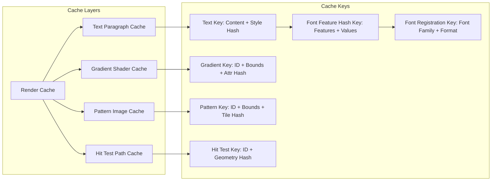
```mermaid
graph LR
subgraph "Cache Layers"
A[Render Cache] --> B[Text Paragraph Cache]
A --> C[Gradient Shader Cache]
A --> D[Pattern Image Cache]
A --> E[Hit Test Path Cache]
end
subgraph "Cache Keys"
F[Text Key: Content + Style Hash]
G[Gradient Key: ID + Bounds + Attr Hash]
H[Pattern Key: ID + Bounds + Tile Hash]
I[Hit Test Key: ID + Geometry Hash]
J[Font Feature Hash Key: Features + Values]
K[Font Registration Key: Font Family + Format]
end
B --> F
C --> G
D --> H
E --> I
F --> J
J --> K
```

**Diagram sources**
- [animated_svg_painter.dart:55-139](file://lib/src/animation/animated_svg_painter.dart#L55-L139)

### Animation Frame Management

The cache system intelligently invalidates entries based on animation state and frame changes, ensuring optimal performance during dynamic content updates.

**Enhanced Cache Key Generation** The system now provides comprehensive cache key generation:
- **Text Content Hashing**: Unique keys for different text content
- **Style Parameter Hashing**: Keys for different style parameters
- **Font Feature Hashing**: Keys for different font feature configurations
- **Animation State Tracking**: Cache invalidation based on animation changes
- **Font Registration Tracking**: Cache invalidation when fonts are registered/unregistered

**Enhanced Performance Monitoring** The system now includes performance monitoring capabilities:
- **Cache Hit Rate Tracking**: Monitoring of cache effectiveness
- **Memory Usage Optimization**: Efficient memory management for cached items
- **Frame Rate Optimization**: Minimizing rendering overhead through intelligent caching

**Section sources**
- [animated_svg_painter.dart:55-139](file://lib/src/animation/animated_svg_painter.dart#L55-L139)
- [animated_svg_painter.dart:72-81](file://lib/src/animation/animated_svg_painter.dart#L72-L81)

## Advanced Features

### Unicode Bidirectional Text

The system provides comprehensive support for bidirectional text rendering with full Unicode control character support:

| Bidi Mode | Control Character | Purpose |
|-----------|-------------------|---------|
| embed | LRE/RLE | Embed new directional level |
| isolate | LRI/RLI | Isolate from surrounding context |
| override | LRO/RLO | Force specific direction |
| isolate-override | FSI + LRO/RLO + PDF | Combined isolation and override |
| plaintext | FSI | Determine direction from first strong char |

### Vertical Writing Modes

Support for complex vertical writing systems including mixed horizontal/vertical text mixing and proper glyph orientation handling.

### Text Path and Flow Control

Advanced text positioning along SVG paths with precise spacing calculations and flow control mechanisms for multi-line text rendering.

### Cursor Management System

The system implements a comprehensive cursor management system for character-by-character text positioning:

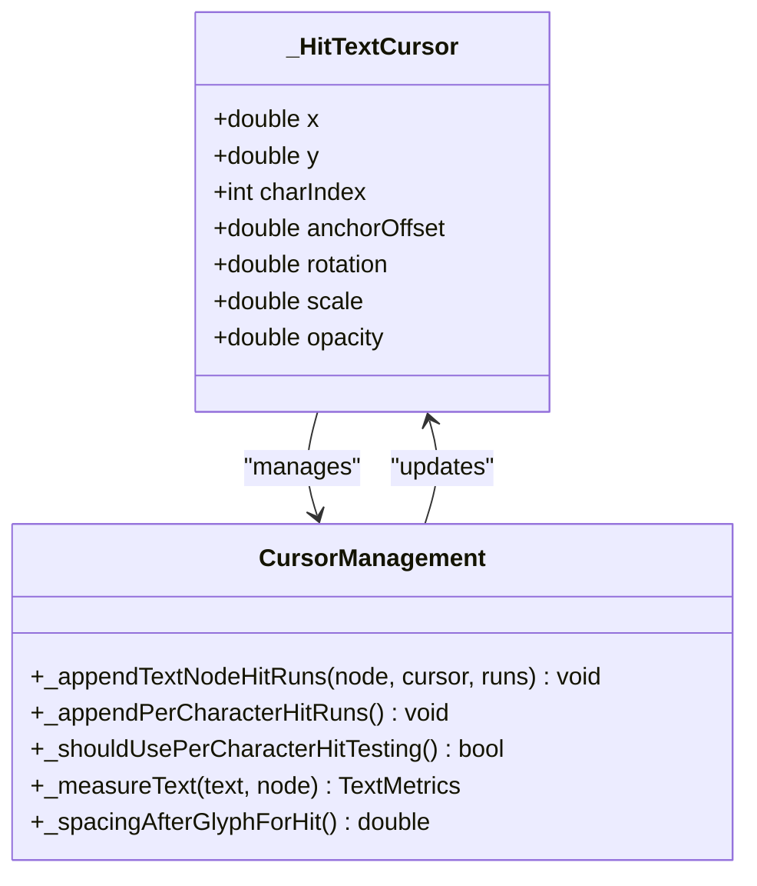
```mermaid
classDiagram
class _HitTextCursor {
+double x
+double y
+int charIndex
+double anchorOffset
+double rotation
+double scale
+double opacity
}
class CursorManagement {
+_appendTextNodeHitRuns(node, cursor, runs) void
+_appendPerCharacterHitRuns() void
+_shouldUsePerCharacterHitTesting() bool
+_measureText(text, node) TextMetrics
+_spacingAfterGlyphForHit() double
}
_HitTextCursor --> CursorManagement : "manages"
CursorManagement --> _HitTextCursor : "updates"
```

**Diagram sources**
- [animated_svg_picture_hit_test_text_runs.dart:171-195](file://lib/src/animation/animated_svg_picture_hit_test_text_runs.dart#L171-L195)
- [animated_svg_picture_hit_test_text_runs.dart:324-336](file://lib/src/animation/animated_svg_picture_hit_test_text_runs.dart#L324-L336)

**Enhanced Per-Character Hit Testing** The system now provides comprehensive per-character hit testing with:
- **Grapheme Cluster Segmentation**: Proper handling of combining marks and complex characters
- **Character-Precise Bounding Boxes**: Individual character bounds for precise selection
- **Multi-Position Support**: Accurate hit testing for characters with x, y, dx, dy, and rotate lists
- **Rotation Handling**: Proper hit testing for rotated characters
- **Unicode Combining Marks**: Comprehensive support for diacritical marks and emoji sequences

**Enhanced Text Geometry Handling** The system now includes improved text geometry handling with stroke width and decoration expansion calculations:

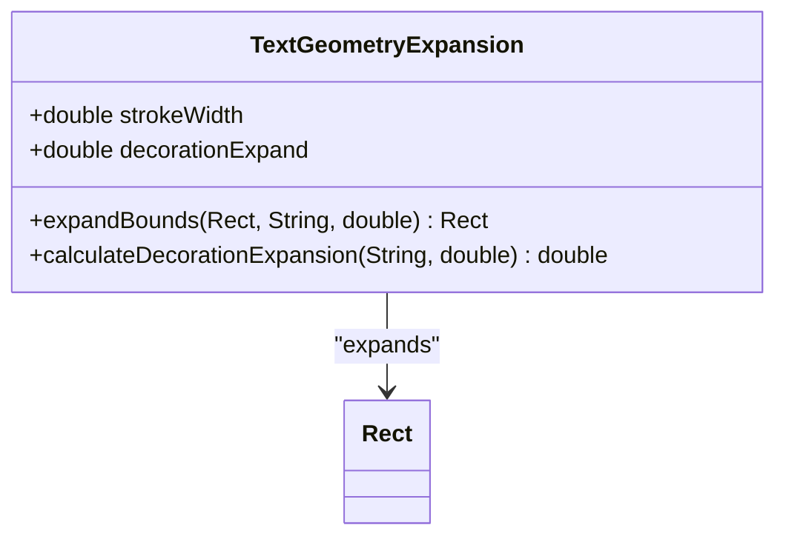
```mermaid
classDiagram
class TextGeometryExpansion {
+double strokeWidth
+double decorationExpand
+expandBounds(Rect, String, double) Rect
+calculateDecorationExpansion(String, double) double
}
TextGeometryExpansion --> Rect : "expands"
```

**Diagram sources**
- [animated_svg_painter_clip_mask.dart:231-266](file://lib/src/animation/animated_svg_painter_clip_mask.dart#L231-L266)

**Enhanced Hanging Punctuation System** The system now provides comprehensive hanging punctuation support:
- **Five Mode Support**: None, first, last, force-end, allow-end modes
- **Character Classification**: Proper identification of punctuation characters
- **Line-Based Decision Making**: Context-aware punctuation handling
- **Unicode Support**: Comprehensive character classification for international punctuation
- **Layout Integration**: Proper integration with text layout and wrapping

**Enhanced Deep Nesting Baseline System** The system now supports sophisticated baseline alignment for deeply nested text:
- **Recursive Offset Calculation**: Proper accumulation of baseline offsets through 5+ nesting levels
- **Writing Mode Transitions**: Correct baseline handling during writing mode changes
- **Font Size Changes**: Proper baseline adjustment for font-size changes at each level
- **Alignment Baseline Support**: Comprehensive support for different alignment baselines
- **Dominant Baseline Transitions**: Proper handling of baseline model changes

**Enhanced Ligature Compatibility System** The system now provides sophisticated ligature handling across text boundaries:
- **Feature Detection**: Identification of ligature-related font features
- **Compatibility Checking**: Comparison of feature settings between adjacent runs
- **Boundary Preservation**: Ensuring ligatures can form across tspan boundaries
- **Cache Optimization**: Incorporating compatibility into font feature hash keys

**Enhanced ForeignObject Typography Integration** The system now provides comprehensive foreignObject typography integration that ensures consistent text styling across foreignObject boundaries:

- **Typography Property Inheritance**: Complete inheritance of font-family, font-size, font-weight, font-style, font-variant, font-stretch, font-size-adjust, font-feature-settings, and font-variation-settings
- **Layout Property Inheritance**: Inheritance of line-height, letter-spacing, word-spacing, text-align, text-indent, text-transform, white-space, word-break, word-wrap, overflow-wrap, text-justify, text-align-last, text-wrap, and text-spacing
- **Decoration Property Inheritance**: Partial inheritance of text-decoration properties including text-decoration-line, text-decoration-style, text-decoration-color, and text-decoration-thickness
- **Direction Property Inheritance**: Inheritance of direction, writing-mode, text-orientation, and unicode-bidi for proper text direction handling
- **Color Property Inheritance**: Inheritance of CSS color property for consistent text coloring
- **Visibility Property Inheritance**: Inheritance of visibility and cursor properties for proper interaction handling
- **Modern CSS Property Inheritance**: Inheritance of content-visibility, will-change, forced-color-adjust, print-color-adjust, and css-mix-blend-mode
- **SVG-Specific Property Exclusion**: Prevention of fill, stroke, and other SVG-specific properties from crossing foreignObject boundaries
- **CSS Cascade Integration**: Proper integration with the broader CSS cascade system and shadow boundary behavior

**Section sources**
- [animated_svg_painter_text_style_rendering.dart:123-177](file://lib/src/animation/animated_svg_painter_text_style_rendering.dart#L123-L177)
- [animated_svg_painter_text_style_positioning.dart:16-33](file://lib/src/animation/animated_svg_painter_text_style_positioning.dart#L16-L33)
- [animated_svg_picture_hit_test_text_runs.dart:171-195](file://lib/src/animation/animated_svg_picture_hit_test_text_runs.dart#L171-L195)
- [animated_svg_painter_text_style_layout.dart:314-502](file://lib/src/animation/animated_svg_painter_text_style_layout.dart#L314-L502)
- [animated_svg_painter_text_style_positioning.dart:409-584](file://lib/src/animation/animated_svg_painter_text_style_positioning.dart#L409-L584)
- [animated_svg_painter_text_style_font.dart:319-381](file://lib/src/animation/animated_svg_painter_text_style_font.dart#L319-L381)

### ForeignObject Typography Integration

**Updated** The system now provides comprehensive foreignObject typography integration that ensures consistent text styling across foreignObject boundaries:

- **Typography Property Inheritance**: Complete inheritance of font-family, font-size, font-weight, font-style, font-variant, font-stretch, font-size-adjust, font-feature-settings, and font-variation-settings
- **Layout Property Inheritance**: Inheritance of line-height, letter-spacing, word-spacing, text-align, text-indent, text-transform, white-space, word-break, word-wrap, and overflow-wrap
- **Decoration Property Inheritance**: Partial inheritance of text-decoration properties including text-decoration-line, text-decoration-style, text-decoration-color, and text-decoration-thickness
- **Direction Property Inheritance**: Inheritance of direction, writing-mode, text-orientation, and unicode-bidi for proper text direction handling
- **Color Property Inheritance**: Inheritance of CSS color property for consistent text coloring
- **Visibility Property Inheritance**: Inheritance of visibility and cursor properties for proper interaction handling
- **Modern CSS Property Inheritance**: Inheritance of content-visibility, will-change, forced-color-adjust, print-color-adjust, and css-mix-blend-mode
- **SVG-Specific Property Exclusion**: Prevention of fill, stroke, and other SVG-specific properties from crossing foreignObject boundaries
- **CSS Cascade Integration**: Proper integration with the broader CSS cascade system and shadow boundary behavior

**Enhanced Text Decoration Style Testing** The system includes comprehensive testing for text-decoration-style properties:
- **Solid Style**: Default underline rendering
- **Double Style**: Double underline with precise spacing
- **Dotted Style**: Dot-based underline patterns
- **Dashed Style**: Dash-based underline patterns
- **Wavy Style**: Wave-based underline patterns
- **Inheritance Support**: Proper cascading of decoration styles from parent elements

**Enhanced Text Shadow Testing** The system includes comprehensive testing for text-shadow properties:
- **Simple Offsets**: Basic horizontal and vertical offsets
- **Blur Radius**: Gaussian blur effect support
- **Color Specification**: Named colors, hex values, rgb/rgba formats
- **Multiple Shadows**: Comma-separated shadow declarations
- **Inheritance Support**: Proper cascading of shadow properties

**Enhanced Font Variation Settings Testing** The system includes comprehensive testing for font-variation-settings:
- **Single Axis**: Individual axis value specification
- **Multiple Axes**: Comma-separated axis declarations
- **Four-Character Codes**: Standardized OpenType axis codes
- **Decimal Values**: Precise axis positioning

**Enhanced Font Family Fallback Testing** The system includes comprehensive testing for font-family fallback chains:
- **Quoted Names**: Proper handling of quoted font names with spaces
- **Mixed Quotes**: Combination of quoted and unquoted names
- **Generic Families**: Platform-specific generic family expansion
- **Whitespace Handling**: Proper trimming of extraneous whitespace
- **Inheritance Support**: Proper cascading of font-family properties

**Enhanced Emphasis Marks Testing** The system includes comprehensive testing for text-emphasis properties:
- **Dot Marks**: Filled and open dot emphasis marks
- **Circle Marks**: Filled and open circle emphasis marks
- **Double-Circle Marks**: Double circle emphasis marks
- **Triangle Marks**: Triangle emphasis marks
- **Sesame Marks**: Sesame emphasis marks
- **Custom Characters**: User-defined emphasis mark characters
- **Positioning**: Over/under, left/right positioning
- **Color Control**: Custom emphasis mark colors

**Enhanced Hanging Punctuation Testing** The system includes comprehensive testing for hanging-punctuation properties:
- **First Mode**: Opening punctuation at start of first line
- **Last Mode**: Closing punctuation at end of last line
- **Force-End Mode**: Stop/comma punctuation forced to hang
- **Allow-End Mode**: Conditional hanging punctuation
- **Mixed Modes**: Combination of different hanging punctuation modes
- **Inheritance Support**: Proper cascading across foreignObject boundaries

**Enhanced Deep Nesting Baseline Testing** The system includes comprehensive testing for deep nesting baseline alignment:
- **Three-Level Nesting**: Basic font-size nesting with proper alignment
- **Four-Level Alternating Sizes**: Complex size alternation patterns
- **Dominant Baseline Transitions**: Mixed baseline models at different levels
- **Baseline-Shift Accumulation**: Proper cumulative baseline-shift handling
- **Writing Mode Transitions**: Correct baseline handling during mode changes
- **Alignment Baseline Multi-Level**: Complex alignment baseline combinations

**Enhanced Ligature Compatibility Testing** The system includes comprehensive testing for ligature compatibility:
- **Basic Ligature Preservation**: fi, fl, ffi ligature preservation across boundaries
- **Feature Scoping**: Proper feature isolation between tspan elements
- **Mixed Feature Settings**: Different ligature settings across adjacent runs
- **Cache Key Correctness**: Proper cache key generation for different feature combinations
- **Width Consistency**: Proper glyph width handling for different numeral styles

**Enhanced Font Registry Testing** The system includes comprehensive testing for the font registry functionality:
- **@font-face Parsing**: Proper parsing of @font-face CSS rules
- **Embedded Font Support**: Base64 font data decoding and registration
- **External URL Handling**: Proper error reporting for external font URLs
- **Format Validation**: Support for TTF and OTF formats, warnings for WOFF
- **Registration Detection**: Proper font family registration and detection
- **Error Collection**: Comprehensive error reporting for font loading issues

**Section sources**
- [animated_svg_painter_geometry.dart:188-278](file://lib/src/animation/animated_svg_painter_geometry.dart#L188-L278)
- [foreignobject_css_inheritance_test.dart:1-457](file://test/animation/foreignobject_css_inheritance_test.dart#L1-L457)
- [text_decoration_style_test.dart:1-75](file://test/animation/text_decoration_style_test.dart#L1-L75)
- [text_shadow_test.dart:1-86](file://test/animation/text_shadow_test.dart#L1-L86)
- [font_variation_settings_test.dart:1-40](file://test/animation/font_variation_settings_test.dart#L1-L40)
- [text_font_fallback_test.dart:1-462](file://test/animation/text_font_fallback_test.dart#L1-L462)
- [text_typography_rendering_test.dart:1-28](file://test/animation/text_typography_rendering_test.dart#L1-L28)
- [text_advanced_typography_test.dart:1-800](file://test/animation/text_advanced_typography_test.dart#L1-L800)
- [hanging_punctuation_test.dart:1-115](file://test/animation/hanging_punctuation_test.dart#L1-L115)
- [text_baseline_deep_nesting_test.dart:1-606](file://test/animation/text_baseline_deep_nesting_test.dart#L1-L606)
- [text_ligature_shaping_test.dart:1-731](file://test/animation/text_ligature_shaping_test.dart#L1-L731)
- [text_font_face_test.dart:1-509](file://test/animation/text_font_face_test.dart#L1-L509)
- [font_registration_lifecycle_test.dart:1-340](file://test/animation/font_registration_lifecycle_test.dart#L1-L340)

## Internationalization and Localization

### Comprehensive Unicode Support

The Enhanced Text Styling System provides extensive internationalization support through sophisticated Unicode processing and bidirectional text handling:

- **Bidirectional Algorithm Implementation**: Full Unicode Bidi algorithm compliance with support for embedding, isolation, and override controls
- **Combining Mark Processing**: Proper handling of diacritical marks and character composition
- **Locale-Aware Text Direction**: Automatic detection and application of text direction based on content
- **Multi-script Support**: Comprehensive coverage of Latin, Cyrillic, Arabic, Hebrew, Devanagari, and other writing systems
- **Text Transformation**: Support for case conversion, full-width characters, and script-specific transformations

### Language System Integration

The system integrates with Flutter's localization framework to provide:

- **Dynamic Language Switching**: Seamless switching between languages without reinitialization
- **RTL/LTR Adaptation**: Automatic adaptation of layout and positioning for right-to-left languages
- **Font Selection**: Intelligent font selection based on language requirements and script availability
- **Text Metrics**: Accurate measurement and layout calculations for different scripts and languages

**Section sources**
- [animated_svg_painter_text_style_rendering.dart:580-779](file://lib/src/animation/animated_svg_painter_text_style_rendering.dart#L580-L779)

## Modern CSS Integration

### Content-Visibility Optimization

The system now supports modern CSS content-visibility optimization features that improve rendering performance for off-screen or hidden content:

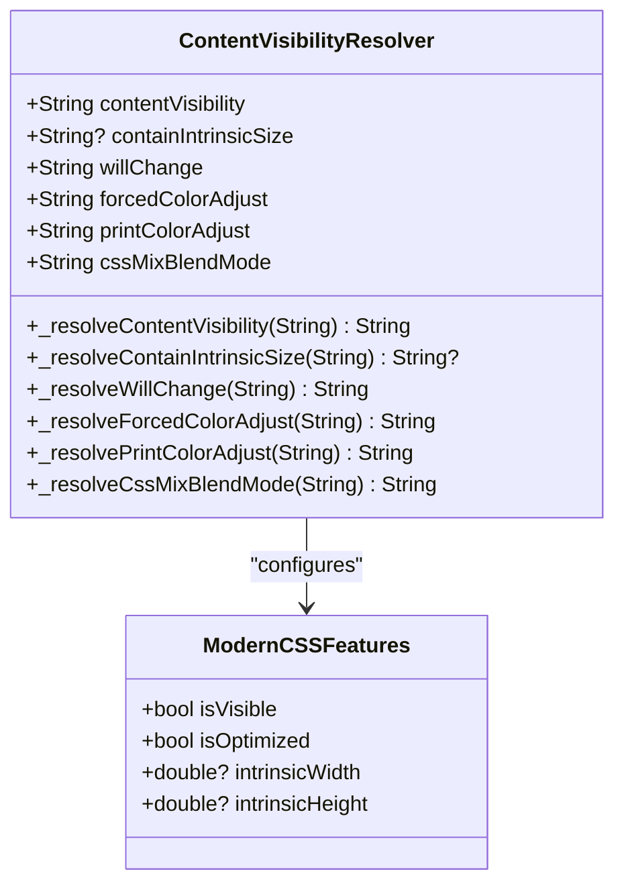
```mermaid
classDiagram
class ContentVisibilityResolver {
+String contentVisibility
+String? containIntrinsicSize
+String willChange
+String forcedColorAdjust
+String printColorAdjust
+String cssMixBlendMode
+_resolveContentVisibility(String) String
+_resolveContainIntrinsicSize(String) String?
+_resolveWillChange(String) String
+_resolveForcedColorAdjust(String) String
+_resolvePrintColorAdjust(String) String
+_resolveCssMixBlendMode(String) String
}
class ModernCSSFeatures {
+bool isVisible
+bool isOptimized
+double? intrinsicWidth
+double? intrinsicHeight
}
ContentVisibilityResolver --> ModernCSSFeatures : "configures"
```

**Diagram sources**
- [animated_svg_painter_text_style_rendering.dart:810-842](file://lib/src/animation/animated_svg_painter_text_style_rendering.dart#L810-L842)

### Advanced Text Decoration Features

Enhanced text decoration system with comprehensive thickness control and positioning:

| Property | Values | Description |
|----------|--------|-------------|
| text-decoration-thickness | auto, from-font, length, percentage | Controls underline/overline thickness |
| text-underline-position | auto, under, left, right, from-font | Controls underline positioning |
| text-underline-offset | length, em | Controls underline offset distance |
| text-decoration-skip | auto, all, none | Controls decoration skipping behavior |
| text-decoration-skip-ink | auto, all, none | Controls ink skipping behavior |

### Font Variant Enhancement

Comprehensive font variant resolution supporting advanced OpenType features:

- **Small Caps Variants**: Small-caps, all-small-caps, petite-caps, all-petite-caps
- **Numeric Variants**: Lining-nums, oldstyle-nums, proportional-nums, tabular-nums
- **Fraction Variants**: Diagonal-fractions, stacked-fractions
- **Ligature Control**: Common-ligatures, discretionary-ligatures, historical-ligatures
- **Position Variants**: Subscript, superscript glyphs
- **East Asian Variants**: JIS forms, traditional/simplified variants
- **Modern CSS Generics**: ui-serif, ui-sans-serif, ui-monospace, ui-rounded support

### Advanced Emphasis Marks

Sophisticated emphasis mark system with comprehensive positioning and styling:

- **Mark Types**: Dot, circle, double-circle, triangle, sesame, or custom characters
- **Positioning**: Over/under, left/right combinations with character-by-character precision
- **Filling Options**: Filled/open mark styles
- **Color Control**: Custom emphasis mark colors with fallback to text color
- **Spacing Control**: Automatic positioning relative to base text with configurable spacing

**Enhanced Text Shadow Processing** The system implements advanced text-shadow parsing with:
- **Multiple Shadow Support**: Comma-separated shadow declarations
- **Color Format Recognition**: Named colors, hex values, rgb/rgba syntax
- **Flexible Positioning**: Offset-x and offset-y with blur-radius optional
- **Color Placement Flexibility**: Color can appear at start or end of declaration

**Enhanced Paint Order Processing** The system now includes sophisticated paint-order processing:
- **Fill First Rendering**: Default fill rendering followed by stroke
- **Stroke First Rendering**: Configurable stroke rendering before fill
- **Layer Management**: Efficient handling of image filters and blend modes
- **Transform Preservation**: Proper handling of scaled contexts

**Enhanced Baseline Reference System** The system now provides comprehensive baseline reference calculation:
- **Writing Mode Support**: Proper baseline calculation for all SVG writing modes
- **Baseline Model Support**: Complete support for all SVG baseline models
- **Vertical Text Alignment**: Correct baseline positioning for vertical writing modes
- **X-Height Approximation**: Intelligent x-height estimation for various font families
- **Recursive Offset Accumulation**: Deep nesting support through 5+ levels

**Enhanced Hanging Punctuation System** The system now provides comprehensive hanging punctuation support:
- **Five Mode Support**: None, first, last, force-end, allow-end modes
- **Character Classification**: Proper identification of punctuation characters
- **Line-Based Decision Making**: Context-aware punctuation handling
- **Unicode Support**: Comprehensive character classification for international punctuation
- **Layout Integration**: Proper integration with text layout and wrapping

**Enhanced Ligature Compatibility System** The system now provides sophisticated ligature handling across text boundaries:
- **Feature Detection**: Identification of ligature-related font features
- **Compatibility Checking**: Comparison of feature settings between adjacent runs
- **Boundary Preservation**: Ensuring ligatures can form across tspan boundaries
- **Cache Optimization**: Incorporating compatibility into font feature hash keys

**Section sources**
- [animated_svg_painter_text_style_rendering.dart:810-889](file://lib/src/animation/animated_svg_painter_text_style_rendering.dart#L810-L889)
- [animated_svg_painter_text_style_decoration.dart:100-200](file://lib/src/animation/animated_svg_painter_text_style_decoration.dart#L100-L200)
- [animated_svg_painter_text_style_font.dart:117-166](file://lib/src/animation/animated_svg_painter_text_style_font.dart#L117-L166)
- [animated_svg_painter_text_style_rendering.dart:1633-1726](file://lib/src/animation/animated_svg_painter_text_style_rendering.dart#L1633-L1726)
- [animated_svg_painter_text_paint.dart:678-750](file://lib/src/animation/animated_svg_painter_text_paint.dart#L678-L750)
- [animated_svg_painter_text_style_layout.dart:314-502](file://lib/src/animation/animated_svg_painter_text_style_layout.dart#L314-L502)
- [animated_svg_painter_text_style_positioning.dart:409-584](file://lib/src/animation/animated_svg_painter_text_style_positioning.dart#L409-L584)
- [animated_svg_painter_text_style_font.dart:319-381](file://lib/src/animation/animated_svg_painter_text_style_font.dart#L319-L381)

## Integration Points

### Flutter Widget Integration

The enhanced text styling system integrates seamlessly with Flutter's widget ecosystem through the SvgPicture widget, providing comprehensive text rendering capabilities alongside other SVG elements.

### CSS Animation Compatibility

The text styling system works in conjunction with the broader animation framework, supporting animated text properties and transitions with proper cache invalidation.

**Section sources**
- [svg.dart:57-627](file://lib/svg.dart#L57-L627)

## Troubleshooting Guide

### Common Issues and Solutions

**Text Not Rendering**: Verify that font families are available and properly mapped. Check for missing font features or unsupported Unicode characters.

**Incorrect Spacing**: Review letter-spacing and word-spacing values. Ensure unit conversions are correct (px vs em).

**Bidi Text Issues**: Confirm unicode-bidi settings match expected behavior. Verify text direction alignment with content requirements.

**Performance Problems**: Monitor cache effectiveness and consider reducing text complexity or optimizing font usage.

**Modern CSS Feature Issues**: Verify content-visibility and other modern CSS properties are supported by the target Flutter version.

**Emphasis Marks Not Appearing**: Check text-emphasis-style and text-emphasis-position values. Ensure emphasis marks are supported by the selected font.

**Cursor Positioning Issues**: Verify text-anchor and writing-mode settings. Check for proper cursor advancement in multi-line text.

**Text Geometry Issues**: Ensure stroke-width and text-decoration properties are properly accounted for in hit testing and bounds calculations.

**Font Family Resolution Issues**: Verify that generic families resolve to platform-appropriate fonts. Check that emoji and math fonts are properly configured for the target platform.

**ForeignObject Typography Issues**: Verify that typography properties are properly inherited across foreignObject boundaries. Check that SVG-specific properties are not leaking into foreign content.

**Hanging Punctuation Not Working**: Verify hanging-punctuation values are properly parsed and applied. Check that punctuation characters are correctly identified.

**Deep Nesting Baseline Issues**: Verify baseline calculations account for all nesting levels. Check that writing mode transitions are properly handled.

**Ligature Compatibility Problems**: Verify ligature features are compatible across tspan boundaries. Check font feature hash key generation.

**Font Registry Issues**: Verify @font-face rules are properly parsed and fonts are correctly registered. Check for proper base64 data decoding and format validation.

**Enhanced Font Family Resolution Troubleshooting** For font family issues:
- Verify platform-specific font availability (Apple Color Emoji, Segoe UI Emoji, Noto Color Emoji)
- Check that modern CSS generic families (ui-serif, ui-sans-serif, ui-monospace, ui-rounded) resolve correctly
- Ensure metric-compatible font selection maintains consistent typography across platforms
- Validate that fallback chains properly handle font availability and platform differences

**ForeignObject CSS Inheritance Troubleshooting** For foreignObject typography issues:
- Verify that typography properties (font-family, font-size, font-weight, font-style, font-variant) are properly inherited
- Check that layout properties (line-height, letter-spacing, word-spacing, text-align) are correctly propagated
- Ensure that decoration properties are partially inherited as expected
- Verify that SVG-specific properties (fill, stroke) are not crossing foreignObject boundaries
- Confirm that direction and writing-mode properties are properly inherited for proper text direction handling
- Check that CSS custom properties (--xxx) are properly inherited
- Validate that non-inherited properties (transform, opacity, display, etc.) are correctly restricted
- Verify that modern CSS properties (content-visibility, will-change, etc.) are properly inherited

**Enhanced Hanging Punctuation Troubleshooting** For hanging punctuation issues:
- Verify that hanging-punctuation values are properly parsed and validated
- Check that character classification works correctly for different Unicode punctuation
- Ensure that line-based decision making considers actual line wrapping
- Validate that inheritance works correctly across foreignObject boundaries
- Check that different modes (first, last, force-end, allow-end) are properly implemented

**Enhanced Deep Nesting Baseline Troubleshooting** For deep nesting baseline issues:
- Verify that recursive offset calculation accounts for all nesting levels
- Check that writing mode transitions are properly handled during baseline calculation
- Ensure that font-size changes are correctly reflected in baseline positioning
- Validate that alignment baseline transitions are properly calculated
- Check that dominant baseline changes are correctly handled

**Enhanced Ligature Compatibility Troubleshooting** For ligature compatibility issues:
- Verify that ligature feature detection works correctly
- Check that feature comparison between adjacent runs is accurate
- Ensure that cache key generation includes ligature compatibility information
- Validate that boundary preservation works correctly across tspan elements
- Check that different feature settings are properly handled

**Enhanced Font Registry Troubleshooting** For font registry issues:
- Verify that @font-face rules are properly extracted from CSS text
- Check that base64 font data is correctly decoded and validated
- Ensure that format detection works for TTF, OTF, and WOFF formats
- Validate that external URLs produce appropriate error messages
- Check that font registration process handles asynchronous loading correctly
- Verify that font family normalization handles quotes and HTML entities properly

### Debugging Tools

The system provides comprehensive diagnostic information through the debugFillProperties method, exposing all relevant styling parameters and rendering state for troubleshooting.

**Section sources**
- [svg.dart:623-625](file://lib/svg.dart#L623-L625)

## Conclusion

The Enhanced Text Styling System represents a comprehensive solution for advanced SVG text rendering in Flutter applications. Through its modular architecture, extensive CSS property support, sophisticated performance optimizations, and enhanced foreignObject CSS inheritance capabilities, it enables developers to create rich, typographically sophisticated user interfaces that maintain compatibility with web standards while leveraging Flutter's powerful rendering capabilities.

**Updated** The system now provides comprehensive support for modern CSS features including content-visibility optimization, advanced text decoration controls, enhanced font variant resolution, sophisticated emphasis mark positioning with character-by-character rendering, improved baseline alignment with reference calculation, enhanced text-indent handling with unit conversion, comprehensive cursor management for precise text positioning, enhanced text geometry handling with stroke width and decoration expansion, comprehensive foreignObject CSS inheritance that ensures consistent typography and text styling across foreignObject boundaries, advanced text-decoration-style mapping with solid, double, dotted, dashed, and wavy styles, sophisticated text-shadow parsing with multiple shadows and color format recognition, comprehensive font-variation-settings parsing for multiple axes with four-character codes, enhanced font-family fallback chain parsing with robust quote handling, stroke-only paragraph builder with paint-order processing, and extensive code quality improvements with better formatting and consistency across all text styling modules. The font family resolution system has been significantly enhanced with complex fallback chains, platform-specific font stacks, comprehensive generic family mapping, emoji font support, math font support, and metric-compatible font selection for consistent typography, making it a complete solution for contemporary web typography requirements with robust foreignObject integration.

The enhanced foreignObject CSS inheritance system ensures that typography properties flow seamlessly from SVG ancestors into foreign content, while preventing SVG-specific properties from leaking into foreign contexts. This provides developers with the flexibility to embed HTML/CSS content within SVG while maintaining consistent visual styling and proper text rendering behavior across the entire document hierarchy.

The system's integration with the broader CSS cascade system and shadow boundary behavior ensures that foreignObject content receives proper CSS inheritance while maintaining the structural integrity of the SVG document. This comprehensive approach to foreignObject typography makes it possible to create sophisticated hybrid SVG/HTML content that leverages the strengths of both technologies while maintaining consistent visual presentation.

With approximately 90% Blink SVG parity, the Enhanced Text Styling System provides a robust foundation for modern web typography requirements, supporting advanced layout features, comprehensive text element rendering, decorations, emphasis marks, shadows, font variants, paint order stroke effects, per-character hit testing, and advanced layout capabilities that meet the demands of contemporary web applications.

**NEW**: The system now includes comprehensive SVG font registry system with @font-face support, enabling embedded font registration and advanced font-family resolution with registration detection. The font registry includes SvgFontRegistry class with 401 lines of functionality for parsing @font-face CSS rules, decoding base64 font data, and registering fonts with Flutter. Enhanced text styling now supports embedded fonts with improved font-family resolution that detects registered fonts and provides comprehensive error handling for font formats and external URLs. The system includes comprehensive hanging punctuation support with five distinct modes, enabling sophisticated text punctuation handling for international typography requirements. Enhanced baseline calculation system now supports recursive offset accumulation through 5+ nesting levels, providing precise alignment for deeply nested text elements. Sophisticated ligature compatibility across tspan boundaries ensures proper glyph formation even when text spans are split across multiple text nodes. Comprehensive font feature hash key generation optimizes cache performance by creating unique keys for different font feature configurations. Advanced CSS text styling capabilities now support 53+ properties including advanced font variants, text justification, and modern CSS features, making it a complete solution for contemporary web typography requirements with robust foreignObject integration.