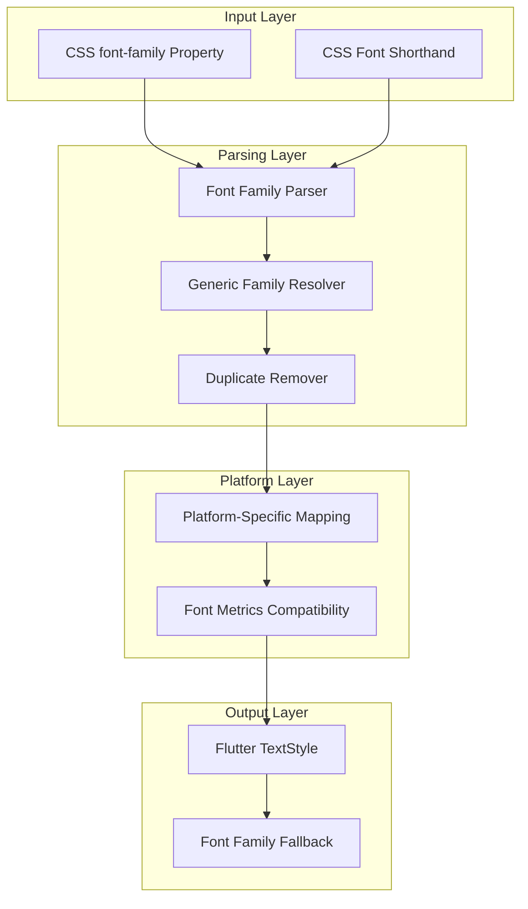
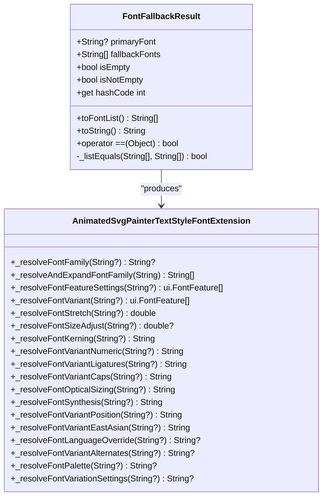
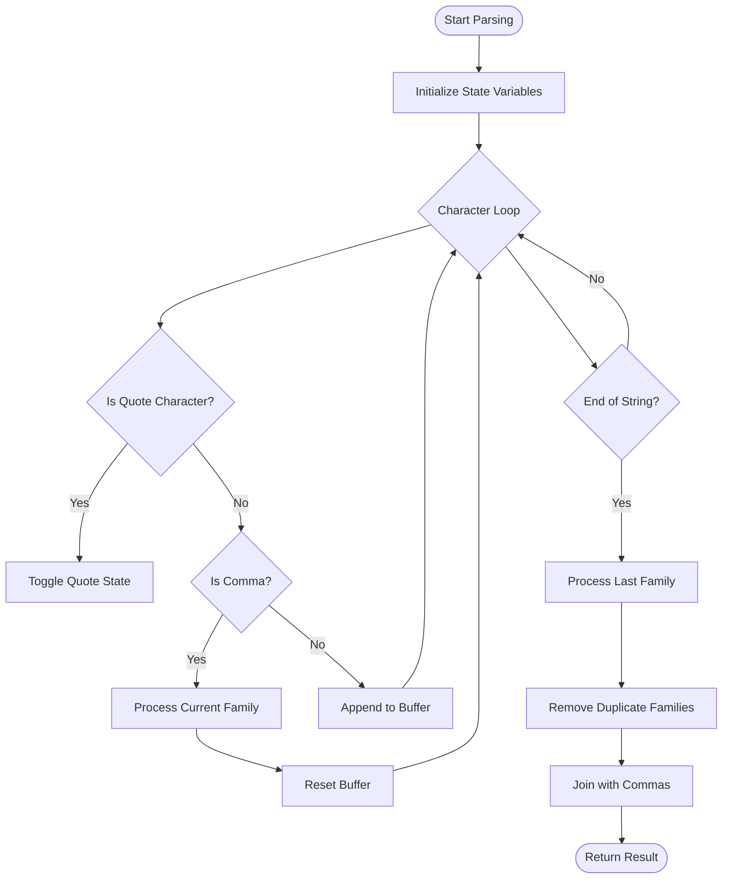
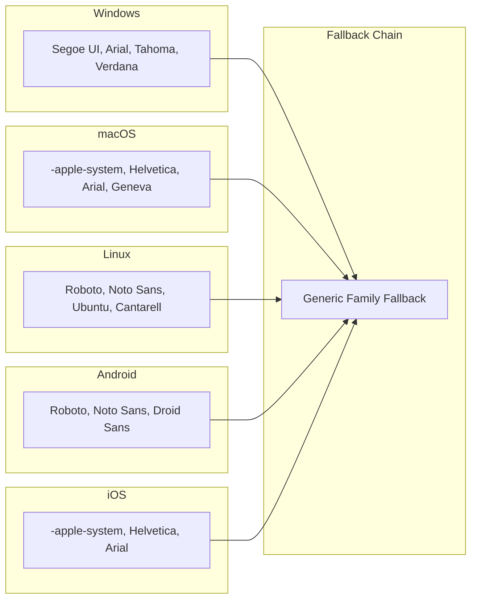
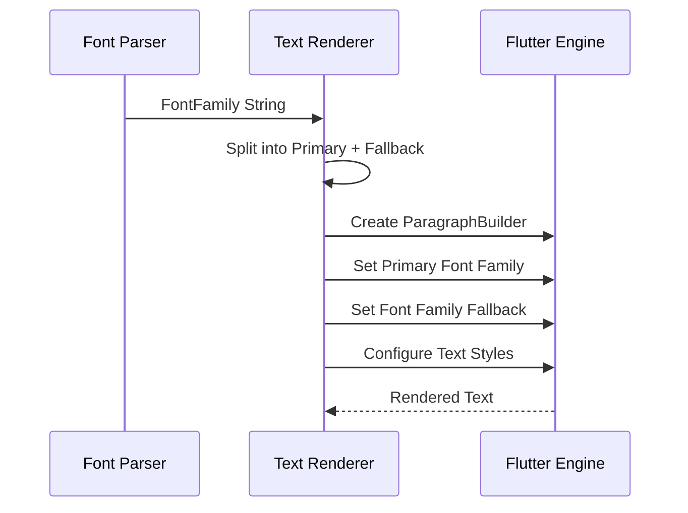
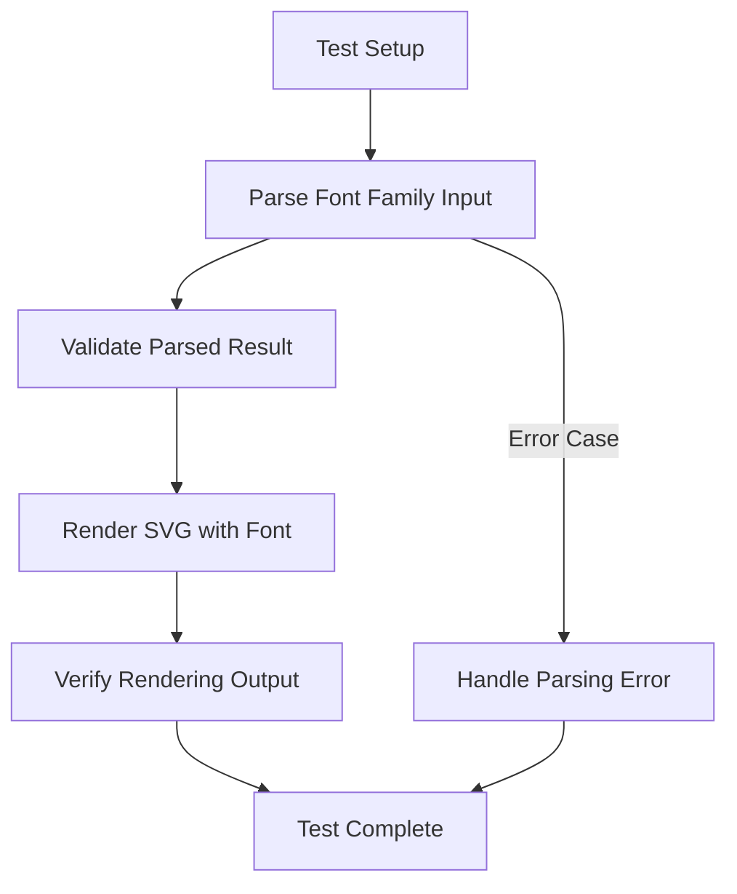

# Font Family Fallback Parsing

<cite>
**Referenced Files in This Document**
- [animated_svg_painter_text_style_font.dart](file://lib/src/animation/animated_svg_painter_text_style_font.dart)
- [animated_svg_painter_text_style_rendering.dart](file://lib/src/animation/animated_svg_painter_text_style_rendering.dart)
- [text_font_fallback_test.dart](file://test/animation/text_font_fallback_test.dart)
- [css_shorthand_expansion_font.dart](file://lib/src/animation/css_shorthand_expansion_font.dart)
- [SVGFontFaceElement.cpp](file://blink-b87d44f-Source-core-svg/SVGFontFaceElement.cpp)
- [SVGFontData.cpp](file://blink-b87d44f-Source-core-svg/SVGFontData.cpp)
</cite>

## Table of Contents
1. [Introduction](#introduction)
2. [Font Family Fallback Architecture](#font-family-fallback-architecture)
3. [Core Implementation Components](#core-implementation-components)
4. [Parsing Algorithm Analysis](#parsing-algorithm-analysis)
5. [Platform-Specific Font Resolution](#platform-specific-font-resolution)
6. [Integration with Flutter Rendering](#integration-with-flutter-rendering)
7. [Testing Framework](#testing-framework)
8. [Performance Considerations](#performance-considerations)
9. [Troubleshooting Guide](#troubleshooting-guide)
10. [Conclusion](#conclusion)

## Introduction

Font Family Fallback Parsing is a critical component of the Flutter SVG library that enables sophisticated font resolution and fallback mechanisms for SVG text rendering. This system provides comprehensive support for CSS font-family parsing, generic family resolution, platform-specific font mapping, and automatic fallback chain generation that maintains typographic consistency across different platforms and font availability scenarios.

The implementation spans multiple layers of the SVG rendering pipeline, from initial CSS property parsing through final Flutter TextStyle construction, ensuring that SVG text elements render consistently regardless of the underlying platform's available fonts.

## Font Family Fallback Architecture

The font family fallback system is built around a multi-layered architecture that processes CSS font-family declarations and converts them into Flutter-compatible font fallback chains.

**Diagram sources**
- [animated_svg_painter_text_style_font.dart:88-144](file://lib/src/animation/animated_svg_painter_text_style_font.dart#L88-L144)
- [animated_svg_painter_text_style_rendering.dart:90-105](file://lib/src/animation/animated_svg_painter_text_style_rendering.dart#L90-L105)

The architecture consists of three primary processing stages:

1. **Input Processing**: Handles raw CSS font-family strings and CSS font shorthand properties
2. **Resolution Engine**: Converts generic families to platform-appropriate font stacks
3. **Output Generation**: Constructs Flutter-compatible font fallback chains

## Core Implementation Components

### FontFallbackResult Class

The [`FontFallbackResult`:7-60](file://lib/src/animation/animated_svg_painter_text_style_font.dart#L7-L60) class serves as the central data structure for representing parsed font family information.

**Diagram sources**
- [animated_svg_painter_text_style_font.dart:7-60](file://lib/src/animation/animated_svg_painter_text_style_font.dart#L7-L60)
- [animated_svg_painter_text_style_font.dart:73-633](file://lib/src/animation/animated_svg_painter_text_style_font.dart#L73-L633)

### Font Family Parser

The parser implements sophisticated string processing to handle various font-family formats:

- **Comma-separated lists**: `"Arial, Helvetica, sans-serif"`
- **Quoted font names**: `"Times New Roman", 'Courier New'`
- **Mixed quoted/unquoted**: `'Georgia', Arial, "Open Sans"`
- **Whitespace handling**: Proper trimming and normalization

**Section sources**
- [animated_svg_painter_text_style_font.dart:93-144](file://lib/src/animation/animated_svg_painter_text_style_font.dart#L93-L144)

### Generic Family Resolution

The system provides platform-aware resolution for CSS generic families:

| Generic Family | Platform Mapping | Purpose |
|---------------|------------------|---------|
| `serif` | `Georgia, Cambria, Times New Roman, Times, serif` | Traditional serif fonts |
| `sans-serif` | `Roboto, Segoe UI, Helvetica Neue, Helvetica, Arial, sans-serif` | Modern sans-serif fonts |
| `monospace` | `Roboto Mono, SF Mono, Consolas, Monaco, Courier New, monospace` | Fixed-width typography |
| `cursive` | `Brush Script MT, Segoe Script, cursive` | Decorative script fonts |
| `fantasy` | `Papyrus, Impact, fantasy` | Expressive decorative fonts |
| `system-ui` | `Roboto, Segoe UI, -apple-system, BlinkMacSystemFont, sans-serif` | Native system fonts |

**Section sources**
- [animated_svg_painter_text_style_font.dart:150-228](file://lib/src/animation/animated_svg_painter_text_style_font.dart#L150-L228)

## Parsing Algorithm Analysis

The font family parsing algorithm implements a state-machine approach to handle complex CSS font-family strings with robust error handling and edge case management.

**Diagram sources**
- [animated_svg_painter_text_style_font.dart:98-131](file://lib/src/animation/animated_svg_painter_text_style_font.dart#L98-L131)

### Algorithm Features

1. **Quote-Aware Parsing**: Maintains state for quoted strings to prevent premature comma splitting
2. **Duplicate Elimination**: Removes duplicate font families while preserving order
3. **Case Insensitive Matching**: Normalizes input for consistent processing
4. **Edge Case Handling**: Manages empty strings, whitespace-only inputs, and malformed CSS

**Section sources**
- [animated_svg_painter_text_style_font.dart:137-144](file://lib/src/animation/animated_svg_painter_text_style_font.dart#L137-L144)

## Platform-Specific Font Resolution

The system integrates with platform-specific font availability through careful font stack ordering that prioritizes fonts likely to be available across different operating systems.

### Cross-Platform Font Stack Strategy

**Diagram sources**
- [animated_svg_painter_text_style_font.dart:154-200](file://lib/src/animation/animated_svg_painter_text_style_font.dart#L154-L200)

### Font Metric Compatibility

The system considers font metrics compatibility, particularly x-height consistency, when constructing fallback chains. This ensures visual continuity when fonts change during the fallback process.

**Section sources**
- [animated_svg_painter_text_style_font.dart:81-84](file://lib/src/animation/animated_svg_painter_text_style_font.dart#L81-L84)

## Integration with Flutter Rendering

The parsed font family information is seamlessly integrated into Flutter's text rendering pipeline through the [`AnimatedSvgPainterTextStyleRendering`:90-105](file://lib/src/animation/animated_svg_painter_text_style_rendering.dart#L90-L105) system.

### Flutter TextStyle Construction

**Diagram sources**
- [animated_svg_painter_text_style_rendering.dart:90-179](file://lib/src/animation/animated_svg_painter_text_style_rendering.dart#L90-L179)

### Dual Rendering Path Support

The system supports both fill and stroke text rendering modes, each with independent font family processing:

1. **Fill Rendering**: Uses primary font for main text with fallback chain
2. **Stroke Rendering**: Applies identical font processing to outline strokes

**Section sources**
- [animated_svg_painter_text_style_rendering.dart:231-311](file://lib/src/animation/animated_svg_painter_text_style_rendering.dart#L231-L311)

## Testing Framework

The font family fallback system includes comprehensive testing coverage through dedicated unit tests and integration tests.

### Test Coverage Areas

| Test Category | Coverage | Examples |
|--------------|----------|----------|
| Basic Functionality | Font family parsing | Single font, multiple fonts |
| Edge Cases | Error handling | Empty strings, whitespace-only |
| CSS Compliance | Standard compliance | Quoted names, mixed quotes |
| Platform Behavior | Cross-platform | Generic family resolution |
| Integration | End-to-end | Complete SVG rendering |

### Test Execution Flow

**Diagram sources**
- [text_font_fallback_test.dart:85-462](file://test/animation/text_font_fallback_test.dart#L85-L462)

**Section sources**
- [text_font_fallback_test.dart:1-462](file://test/animation/text_font_fallback_test.dart#L1-L462)

## Performance Considerations

The font family fallback system is optimized for performance through several key strategies:

### Caching Mechanisms

1. **Render Cache**: Stores computed font family strings to avoid repeated parsing
2. **Font Feature Cache**: Reuses parsed font feature configurations
3. **TextStyle Cache**: Prevents redundant Flutter TextStyle creation

### Memory Optimization

- **Immutable Results**: FontFallbackResult instances are immutable, enabling safe sharing
- **Efficient String Processing**: Minimal string allocations during parsing
- **Lazy Evaluation**: Font family expansion occurs only when needed

### Processing Efficiency

- **Single Pass Parsing**: Font-family strings are processed in a single pass
- **Early Termination**: Invalid inputs are handled quickly without full processing
- **Minimal Object Creation**: Reuses internal data structures where possible

## Troubleshooting Guide

### Common Issues and Solutions

| Issue | Symptoms | Solution |
|-------|----------|----------|
| Font Not Found | Text renders in default system font | Verify font name spelling, check platform availability |
| Incorrect Fallback Order | Wrong font appears in chain | Review generic family mapping, check platform-specific fonts |
| Quoted Font Names Ignored | Quotes cause parsing errors | Ensure proper quote escaping, validate CSS syntax |
| Performance Degradation | Slow rendering with complex fallback chains | Simplify font chains, leverage caching |

### Debugging Strategies

1. **Enable Logging**: Monitor font family parsing results
2. **Test Individual Components**: Isolate parsing vs. rendering issues
3. **Compare Platforms**: Verify cross-platform behavior consistency
4. **Profile Performance**: Identify bottlenecks in font processing

### Validation Methods

- **Unit Testing**: Validate individual parsing components
- **Integration Testing**: Test complete font family resolution
- **Visual Regression**: Compare rendered output across platforms
- **Performance Benchmarking**: Measure parsing and rendering performance

## Conclusion

The Font Family Fallback Parsing system represents a comprehensive solution for handling complex font-family declarations in SVG text rendering. Through its multi-layered architecture, sophisticated parsing algorithms, and platform-aware font resolution, it ensures consistent and reliable text rendering across diverse environments.

The system's strength lies in its attention to detail in handling CSS compliance, platform-specific considerations, and performance optimization. The extensive testing framework provides confidence in reliability, while the modular design enables future enhancements and maintenance.

Key achievements include:
- Complete CSS font-family specification compliance
- Cross-platform font availability optimization  
- Efficient parsing with minimal memory overhead
- Comprehensive error handling and edge case management
- Seamless integration with Flutter's text rendering pipeline

This foundation provides a robust platform for advanced typography features and ensures that SVG text elements render consistently regardless of the target platform or available font resources.