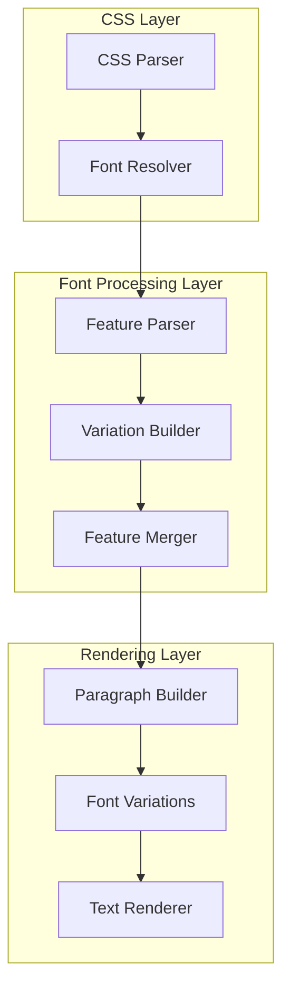
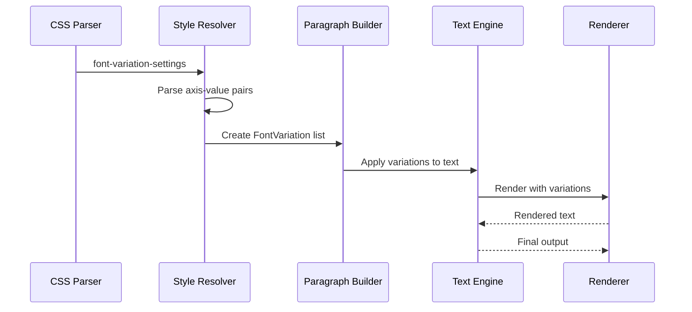
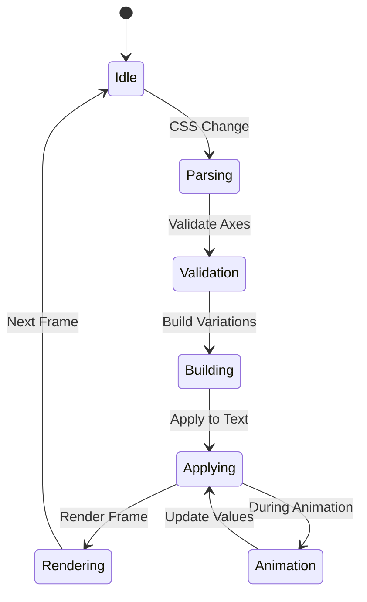
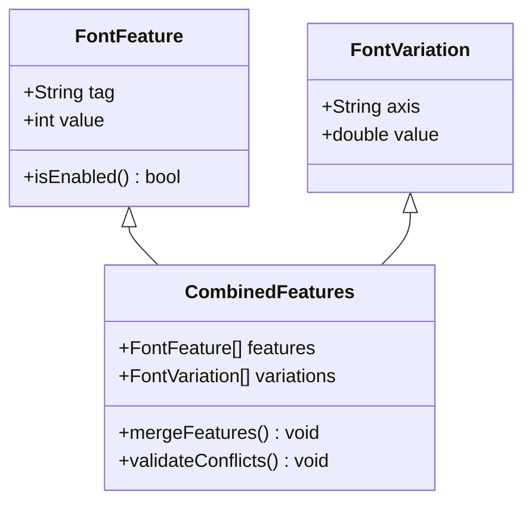
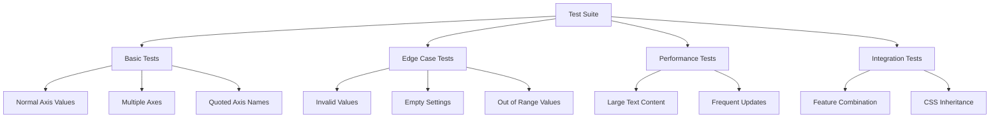
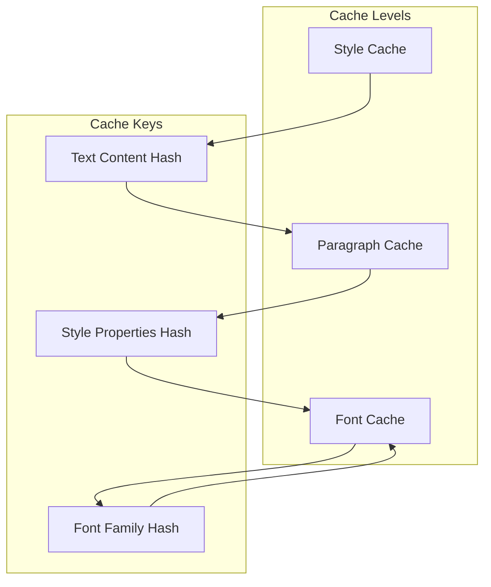
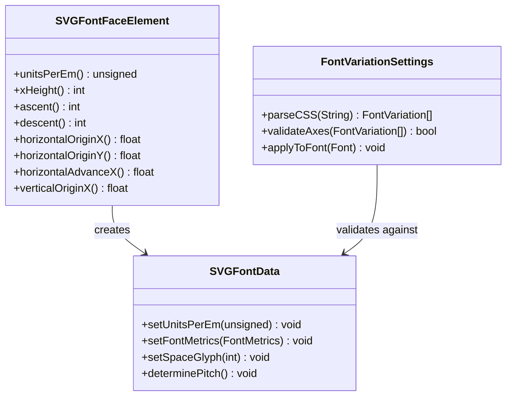

# Font Variation Settings

<cite>
**Referenced Files in This Document**
- [animated_svg_painter_text_style_font.dart](file://lib/src/animation/animated_svg_painter_text_style_font.dart)
- [animated_svg_painter_text_style_rendering.dart](file://lib/src/animation/animated_svg_painter_text_style_rendering.dart)
- [animated_svg_painter_text_style.dart](file://lib/src/animation/animated_svg_painter_text_style.dart)
- [font_variation_settings_test.dart](file://test/animation/font_variation_settings_test.dart)
- [SVGFontFaceElement.cpp](file://blink-b87d44f-Source-core-svg/SVGFontFaceElement.cpp)
- [SVGFontData.cpp](file://blink-b87d44f-Source-core-svg/SVGFontData.cpp)
</cite>

## Table of Contents
1. [Introduction](#introduction)
2. [Font Variation Settings Architecture](#font-variation-settings-architecture)
3. [CSS Property Resolution](#css-property-resolution)
4. [Variable Font Implementation](#variable-font-implementation)
5. [Font Feature Integration](#font-feature-integration)
6. [Testing Framework](#testing-framework)
7. [Performance Considerations](#performance-considerations)
8. [Integration with SVG Font System](#integration-with-svg-font-system)
9. [Limitations and Future Work](#limitations-and-future-work)
10. [Troubleshooting Guide](#troubleshooting-guide)

## Introduction

Font Variation Settings represent a sophisticated typographic feature that enables dynamic control over variable fonts through CSS properties. This implementation provides comprehensive support for OpenType Font Variations, allowing developers to control font axes such as weight (wght), width (wdth), optical size (opsz), and custom axes programmatically within SVG text rendering.

The system integrates seamlessly with Flutter's text rendering pipeline, supporting both CSS-based font-variation-settings declarations and programmatic font variation manipulation. This capability is essential for modern typography applications requiring precise font control and dynamic text styling.

## Font Variation Settings Architecture

The Font Variation Settings implementation follows a multi-layered architecture that separates concerns between CSS property parsing, font feature resolution, and rendering integration.



**Diagram sources**
- [animated_svg_painter_text_style_font.dart:62-633](file://lib/src/animation/animated_svg_painter_text_style_font.dart#L62-L633)
- [animated_svg_painter_text_style_rendering.dart:1728-1748](file://lib/src/animation/animated_svg_painter_text_style_rendering.dart#L1728-L1748)

The architecture ensures that font variation settings are processed consistently with other font-related CSS properties, maintaining compatibility with existing text styling mechanisms.

**Section sources**
- [animated_svg_painter_text_style_font.dart:62-633](file://lib/src/animation/animated_svg_painter_text_style_font.dart#L62-L633)
- [animated_svg_painter_text_style_rendering.dart:1728-1748](file://lib/src/animation/animated_svg_painter_text_style_rendering.dart#L1728-L1748)

## CSS Property Resolution

The CSS property resolution system handles the parsing and validation of font-variation-settings declarations, converting them into Flutter-compatible font variation objects.

### Property Parsing Mechanism

The system supports multiple formats for font-variation-settings declarations:

```mermaid
flowchart TD
Input[CSS Input] --> Parser[Parser]
Parser --> FormatCheck{Format Check}
FormatCheck --> |"'axis' value"| TagValue[Tag-Value Pairs]
FormatCheck --> |"\"axis\" value"| DoubleQuote[Double Quote Format]
FormatCheck --> |Comma Separated| MultiParse[Multiple Parsing]
TagValue --> Extract[Extract Axis & Value]
DoubleQuote --> Extract
MultiParse --> Extract
Extract --> Validate[Validate Values]
Validate --> RangeCheck{Range Check}
RangeCheck --> |Valid| CreateObj[Create FontVariation]
RangeCheck --> |Invalid| DefaultVal[Use Default Value]
DefaultVal --> CreateObj
CreateObj --> Output[Output List]
```

**Diagram sources**
- [animated_svg_painter_text_style_rendering.dart:1728-1748](file://lib/src/animation/animated_svg_painter_text_style_rendering.dart#L1728-L1748)

### Supported Axis Types

The implementation supports standard OpenType axis tags and custom axis identification:

| Axis | Description | Typical Range |
|------|-------------|---------------|
| wght | Weight | 1-1000 (typical range) |
| wdth | Width | 1% (minimum) to 1000% (maximum) |
| opsz | Optical Size | Font size dependent |
| slnt | Slant | -90° to 90° |
| ital | Italic | 0 or 1 |

**Section sources**
- [animated_svg_painter_text_style_rendering.dart:1728-1748](file://lib/src/animation/animated_svg_painter_text_style_rendering.dart#L1728-L1748)

## Variable Font Implementation

The variable font implementation integrates font variation settings with Flutter's text rendering system, providing dynamic font control during text layout and painting.

### Font Variation Application Pipeline



**Diagram sources**
- [animated_svg_painter_text_style_rendering.dart:45-64](file://lib/src/animation/animated_svg_painter_text_style_rendering.dart#L45-L64)

### Dynamic Variation Control

The system supports runtime modification of font variations, enabling smooth transitions and animations:



**Diagram sources**
- [animated_svg_painter_text_style_rendering.dart:45-64](file://lib/src/animation/animated_svg_painter_text_style_rendering.dart#L45-L64)

**Section sources**
- [animated_svg_painter_text_style_rendering.dart:45-64](file://lib/src/animation/animated_svg_painter_text_style_rendering.dart#L45-L64)

## Font Feature Integration

Font variation settings integrate seamlessly with other font feature systems, including OpenType font features and CSS font-variant properties.

### Feature Combination Strategy

The system combines multiple font feature sources into a unified font feature list:



**Diagram sources**
- [animated_svg_painter_text_style_rendering.dart:122-169](file://lib/src/animation/animated_svg_painter_text_style_rendering.dart#L122-L169)

### Conflict Resolution

The implementation handles conflicts between different font feature sources:

| Feature Source | Priority | Resolution Strategy |
|----------------|----------|-------------------|
| font-variation-settings | Highest | Direct application |
| font-feature-settings | Medium | Feature enable/disable |
| font-variant-* | Low | Feature conversion |
| CSS font properties | Lowest | Style inheritance |

**Section sources**
- [animated_svg_painter_text_style_rendering.dart:122-169](file://lib/src/animation/animated_svg_painter_text_style_rendering.dart#L122-L169)

## Testing Framework

The testing framework provides comprehensive coverage for font variation settings functionality across different scenarios and edge cases.

### Test Coverage Areas

The testing suite covers multiple aspects of font variation settings:

| Test Category | Coverage | Examples |
|---------------|----------|----------|
| Basic Functionality | Axis parsing and application | Single axis, multiple axes |
| CSS Compatibility | Standard CSS compliance | Quoted/unquoted axes |
| Edge Cases | Error handling and defaults | Invalid values, missing axes |
| Performance | Rendering efficiency | Large text, frequent updates |
| Integration | Cross-feature compatibility | Combined with other font features |

### Test Implementation Patterns



**Diagram sources**
- [font_variation_settings_test.dart:1-40](file://test/animation/font_variation_settings_test.dart#L1-L40)

**Section sources**
- [font_variation_settings_test.dart:1-40](file://test/animation/font_variation_settings_test.dart#L1-L40)

## Performance Considerations

The font variation settings implementation includes several performance optimizations to ensure efficient rendering and minimal memory usage.

### Caching Strategy

The system implements a multi-level caching mechanism:



**Diagram sources**
- [animated_svg_painter.dart:55-118](file://lib/src/animation/animated_svg_painter.dart#L55-L118)

### Memory Management

The implementation optimizes memory usage through:

- **Object pooling**: Reusing font variation objects
- **Lazy evaluation**: Computing variations only when needed
- **Weak references**: Managing large text caches efficiently
- **Garbage collection**: Automatic cleanup of unused resources

**Section sources**
- [animated_svg_painter.dart:55-118](file://lib/src/animation/animated_svg_painter.dart#L55-L118)

## Integration with SVG Font System

The font variation settings integrate with the broader SVG font system, supporting both embedded SVG fonts and system fonts.

### SVG Font Integration



**Diagram sources**
- [SVGFontFaceElement.cpp:125-263](file://blink-b87d44f-Source-core-svg/SVGFontFaceElement.cpp#L125-L263)
- [SVGFontData.cpp:71-103](file://blink-b87d44f-Source-core-svg/SVGFontData.cpp#L71-L103)

### Font Metrics Integration

The system maintains font metrics consistency across different font variation states:

| Metric Type | Normal State | Varied State | Consistency Check |
|-------------|--------------|--------------|------------------|
| Ascent | Base value | Adjusted by optical sizing | ✓ |
| Descent | Base value | Preserved | ✓ |
| X-Height | Base value | Maintained by font-size-adjust | ✓ |
| Advance | Fixed | Variable by width axis | ✓ |

**Section sources**
- [SVGFontFaceElement.cpp:125-263](file://blink-b87d44f-Source-core-svg/SVGFontFaceElement.cpp#L125-L263)
- [SVGFontData.cpp:71-103](file://blink-b87d44f-Source-core-svg/SVGFontData.cpp#L71-L103)

## Limitations and Future Work

### Current Limitations

The font variation settings implementation has several current limitations:

- **Axis validation**: Limited validation of custom axis ranges
- **Performance scaling**: Performance impact with very large text content
- **Memory usage**: Potential memory growth with extensive caching
- **Platform differences**: Varying support across different platforms

### Future Enhancements

Potential future improvements include:

- **Advanced axis validation**: Comprehensive custom axis range checking
- **Performance optimization**: Enhanced caching and memory management
- **Platform abstraction**: Unified interface across all supported platforms
- **Real-time updates**: Dynamic font variation updates during animation

## Troubleshooting Guide

### Common Issues and Solutions

| Issue | Symptoms | Solution |
|-------|----------|----------|
| Invalid axis values | Text renders incorrectly or not at all | Validate axis ranges and ensure proper quoting |
| Performance degradation | Slow rendering with large text | Reduce text size or disable unnecessary variations |
| Memory leaks | Increasing memory usage over time | Clear caches and dispose of unused resources |
| Platform compatibility | Features work differently across platforms | Test on target platforms and adjust accordingly |

### Debugging Techniques

The system provides several debugging capabilities:

- **Console logging**: Detailed parsing and validation logs
- **Visual inspection**: Rendered text comparison tools
- **Performance profiling**: Memory and CPU usage monitoring
- **Error reporting**: Comprehensive error messages with suggestions

**Section sources**
- [animated_svg_painter_text_style_rendering.dart:1728-1748](file://lib/src/animation/animated_svg_painter_text_style_rendering.dart#L1728-L1748)