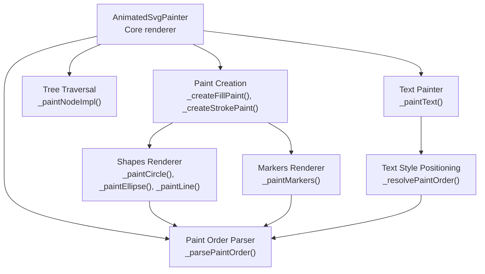
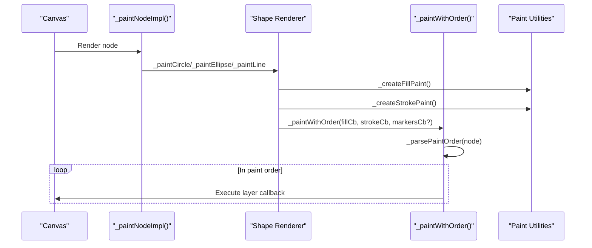
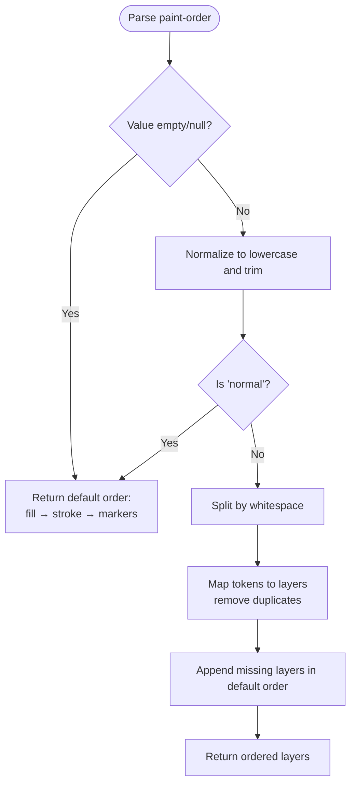
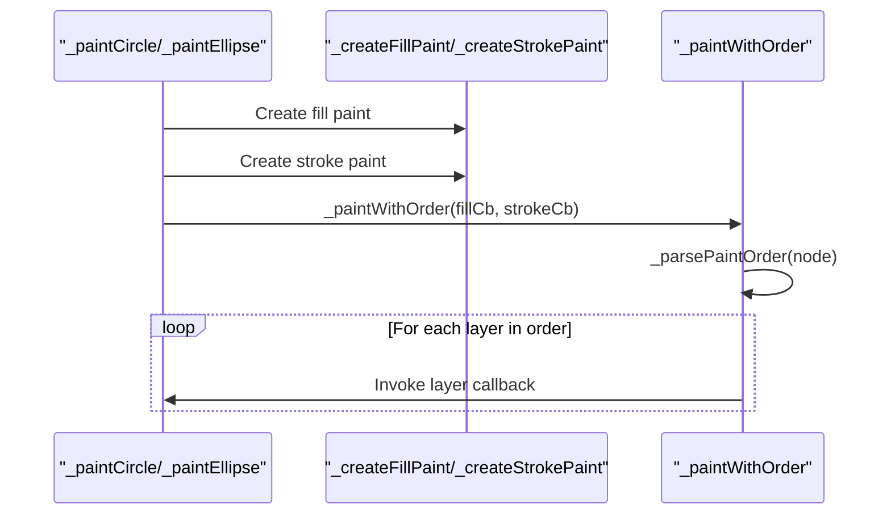
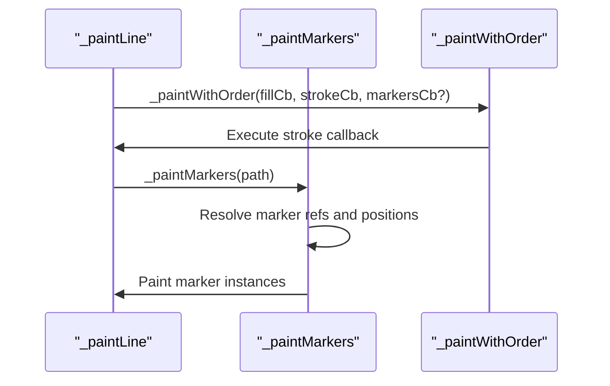
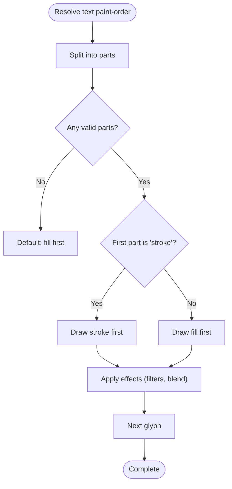
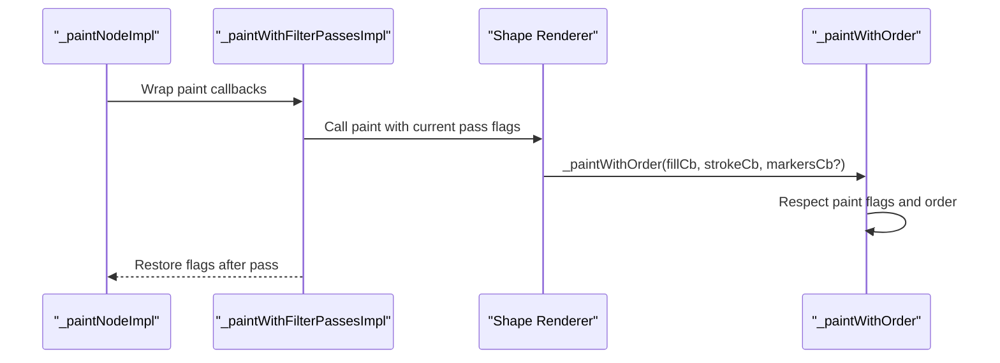
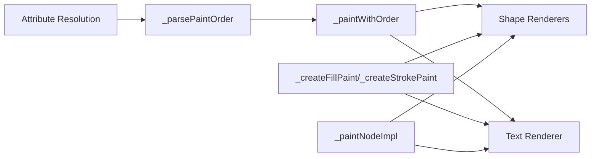

# Paint Order Processing

<cite>
**Referenced Files in This Document**
- [animated_svg_painter_paint_order.dart](file://lib/src/animation/animated_svg_painter_paint_order.dart)
- [animated_svg_painter.dart](file://lib/src/animation/animated_svg_painter.dart)
- [animated_svg_painter_shapes.dart](file://lib/src/animation/animated_svg_painter_shapes.dart)
- [animated_svg_painter_markers.dart](file://lib/src/animation/animated_svg_painter_markers.dart)
- [animated_svg_painter_paints.dart](file://lib/src/animation/animated_svg_painter_paints.dart)
- [animated_svg_painter_tree.dart](file://lib/src/animation/animated_svg_painter_tree.dart)
- [animated_svg_painter_text_paint.dart](file://lib/src/animation/animated_svg_painter_text_paint.dart)
- [animated_svg_painter_text_style.dart](file://lib/src/animation/animated_svg_painter_text_style.dart)
- [animated_svg_painter_text_style_positioning.dart](file://lib/src/animation/animated_svg_painter_text_style_positioning.dart)
- [paint_order_test.dart](file://test/animation/paint_order_test.dart)
</cite>

## Table of Contents
1. [Introduction](#introduction)
2. [Project Structure](#project-structure)
3. [Core Components](#core-components)
4. [Architecture Overview](#architecture-overview)
5. [Detailed Component Analysis](#detailed-component-analysis)
6. [Dependency Analysis](#dependency-analysis)
7. [Performance Considerations](#performance-considerations)
8. [Troubleshooting Guide](#troubleshooting-guide)
9. [Conclusion](#conclusion)

## Introduction
This document explains how the Flutter SVG animation system implements paint order processing for both vector shapes and text elements. Paint order controls the sequence in which fill, stroke, and markers are drawn, ensuring visual parity with browser SVG behavior. The implementation spans several core modules that handle attribute parsing, rendering order enforcement, and integration with the broader animation pipeline.

## Project Structure
The paint order functionality is distributed across multiple modules within the animation subsystem:
- Core paint order parsing and enforcement
- Shape-specific rendering with paint order
- Marker rendering integrated into stroke drawing
- Text rendering with paint order for fill/stroke
- Tree traversal and filter composition integration

**Diagram sources**
- [animated_svg_painter.dart:187-305](file://lib/src/animation/animated_svg_painter.dart#L187-L305)
- [animated_svg_painter_paint_order.dart:6-90](file://lib/src/animation/animated_svg_painter_paint_order.dart#L6-L90)
- [animated_svg_painter_shapes.dart:3-156](file://lib/src/animation/animated_svg_painter_shapes.dart#L3-L156)
- [animated_svg_painter_markers.dart:138-217](file://lib/src/animation/animated_svg_painter_markers.dart#L138-L217)
- [animated_svg_painter_paints.dart:3-153](file://lib/src/animation/animated_svg_painter_paints.dart#L3-L153)
- [animated_svg_painter_text_paint.dart:490-585](file://lib/src/animation/animated_svg_painter_text_paint.dart#L490-L585)
- [animated_svg_painter_text_style_positioning.dart:275-291](file://lib/src/animation/animated_svg_painter_text_style_positioning.dart#L275-L291)

**Section sources**
- [animated_svg_painter.dart:187-305](file://lib/src/animation/animated_svg_painter.dart#L187-L305)
- [animated_svg_painter_paint_order.dart:6-90](file://lib/src/animation/animated_svg_painter_paint_order.dart#L6-L90)

## Core Components
- Paint order parser: Converts the `paint-order` attribute into a deterministic layer sequence, defaulting to fill → stroke → markers.
- Paint creation utilities: Generate fill and stroke paints with opacity, filters, and blend modes.
- Shape renderers: Draw circles, ellipses, and lines with paint order enforcement.
- Marker renderer: Places markers along strokes according to parsed paint order.
- Text painter: Applies paint order to text fill and stroke rendering.
- Tree traversal: Integrates paint order with filter passes and group opacity.

**Section sources**
- [animated_svg_painter_paint_order.dart:6-90](file://lib/src/animation/animated_svg_painter_paint_order.dart#L6-L90)
- [animated_svg_painter_paints.dart:3-153](file://lib/src/animation/animated_svg_painter_paints.dart#L3-L153)
- [animated_svg_painter_shapes.dart:3-156](file://lib/src/animation/animated_svg_painter_shapes.dart#L3-L156)
- [animated_svg_painter_markers.dart:138-217](file://lib/src/animation/animated_svg_painter_markers.dart#L138-L217)
- [animated_svg_painter_text_paint.dart:490-585](file://lib/src/animation/animated_svg_painter_text_paint.dart#L490-L585)
- [animated_svg_painter_tree.dart:7-281](file://lib/src/animation/animated_svg_painter_tree.dart#L7-L281)

## Architecture Overview
The paint order architecture follows a layered approach:
- Attribute resolution: The `paint-order` attribute is resolved from the DOM node and CSS cascade.
- Layer ordering: The parser produces a sequence of layers (fill, stroke, markers) respecting user-defined order and defaults.
- Rendering integration: Each shape and text renderer invokes a unified paint-with-order mechanism that executes callbacks in the computed sequence.
- Filter and opacity integration: Paint order is applied within filter passes and group opacity layers.

**Diagram sources**
- [animated_svg_painter_tree.dart:7-281](file://lib/src/animation/animated_svg_painter_tree.dart#L7-L281)
- [animated_svg_painter_shapes.dart:35-101](file://lib/src/animation/animated_svg_painter_shapes.dart#L35-L101)
- [animated_svg_painter_paint_order.dart:66-90](file://lib/src/animation/animated_svg_painter_paint_order.dart#L66-L90)
- [animated_svg_painter_paints.dart:3-153](file://lib/src/animation/animated_svg_painter_paints.dart#L3-L153)

## Detailed Component Analysis

### Paint Order Parser and Enforcer
The parser resolves the `paint-order` attribute and returns a list of layers in the order they should be drawn. It supports:
- Empty or missing values: defaults to fill → stroke → markers.
- `normal`: explicit default order.
- Space-separated tokens: `fill`, `stroke`, and `markers` in any order, with duplicates removed and missing layers appended in default order.

The enforcer (`_paintWithOrder`) iterates through the computed order and invokes the appropriate drawing callbacks.

**Diagram sources**
- [animated_svg_painter_paint_order.dart:9-64](file://lib/src/animation/animated_svg_painter_paint_order.dart#L9-L64)

**Section sources**
- [animated_svg_painter_paint_order.dart:6-90](file://lib/src/animation/animated_svg_painter_paint_order.dart#L6-L90)

### Shape Rendering with Paint Order
Vector shapes (circle, ellipse, line) compute fill and stroke paints and then render using the paint order enforcer:
- Circle and ellipse: Draw fill first, then stroke, optionally with markers.
- Line: No fill; stroke is drawn first if configured, with markers placed at endpoints.

**Diagram sources**
- [animated_svg_painter_shapes.dart:35-101](file://lib/src/animation/animated_svg_painter_shapes.dart#L35-L101)
- [animated_svg_painter_paints.dart:3-153](file://lib/src/animation/animated_svg_painter_paints.dart#L3-L153)
- [animated_svg_painter_paint_order.dart:66-90](file://lib/src/animation/animated_svg_painter_paint_order.dart#L66-L90)

**Section sources**
- [animated_svg_painter_shapes.dart:3-156](file://lib/src/animation/animated_svg_painter_shapes.dart#L3-L156)
- [animated_svg_painter_paints.dart:3-153](file://lib/src/animation/animated_svg_painter_paints.dart#L3-L153)

### Marker Rendering Integration
Markers are painted as part of the stroke pass when requested by the shape. The marker renderer resolves marker references and places them at calculated positions along the path, respecting the paint order sequence.

**Diagram sources**
- [animated_svg_painter_shapes.dart:129-153](file://lib/src/animation/animated_svg_painter_shapes.dart#L129-L153)
- [animated_svg_painter_markers.dart:138-217](file://lib/src/animation/animated_svg_painter_markers.dart#L138-L217)

**Section sources**
- [animated_svg_painter_markers.dart:138-217](file://lib/src/animation/animated_svg_painter_markers.dart#L138-L217)

### Text Paint Order Processing
Text rendering applies paint order differently:
- The `paint-order` attribute is resolved during text style computation.
- For each glyph, the renderer decides whether to draw stroke first or fill first based on the computed order.
- Effects like filters and blend modes are applied consistently within the chosen order.

**Diagram sources**
- [animated_svg_painter_text_style_positioning.dart:275-291](file://lib/src/animation/animated_svg_painter_text_style_positioning.dart#L275-L291)
- [animated_svg_painter_text_paint.dart:490-585](file://lib/src/animation/animated_svg_painter_text_paint.dart#L490-L585)

**Section sources**
- [animated_svg_painter_text_style_positioning.dart:275-291](file://lib/src/animation/animated_svg_painter_text_style_positioning.dart#L275-L291)
- [animated_svg_painter_text_paint.dart:490-585](file://lib/src/animation/animated_svg_painter_text_paint.dart#L490-L585)

### Tree Traversal and Filter Integration
Paint order is applied within the broader rendering pipeline:
- Tree traversal determines which renderer to call for each node.
- Filter passes and group opacity are applied before invoking the paint order enforcer.
- The `_paintWithFilterPassesImpl` temporarily toggles paint flags to ensure fill/stroke are only applied when permitted by the current filter pass.

**Diagram sources**
- [animated_svg_painter_tree.dart:431-457](file://lib/src/animation/animated_svg_painter_tree.dart#L431-L457)
- [animated_svg_painter_shapes.dart:35-101](file://lib/src/animation/animated_svg_painter_shapes.dart#L35-L101)
- [animated_svg_painter_paint_order.dart:66-90](file://lib/src/animation/animated_svg_painter_paint_order.dart#L66-L90)

**Section sources**
- [animated_svg_painter_tree.dart:431-457](file://lib/src/animation/animated_svg_painter_tree.dart#L431-L457)

## Dependency Analysis
Paint order depends on:
- Attribute resolution: The `paint-order` attribute is resolved via the shared attribute resolution utilities.
- Paint creation: Fill and stroke paints are created with opacity, filters, and blend modes.
- Shape and text renderers: Both integrate paint order through the shared enforcer.
- Tree traversal: Ensures paint order is applied consistently across nodes and filter passes.

**Diagram sources**
- [animated_svg_painter_paint_order.dart:6-90](file://lib/src/animation/animated_svg_painter_paint_order.dart#L6-L90)
- [animated_svg_painter_paints.dart:3-153](file://lib/src/animation/animated_svg_painter_paints.dart#L3-L153)
- [animated_svg_painter_shapes.dart:3-156](file://lib/src/animation/animated_svg_painter_shapes.dart#L3-L156)
- [animated_svg_painter_text_paint.dart:490-585](file://lib/src/animation/animated_svg_painter_text_paint.dart#L490-L585)
- [animated_svg_painter_tree.dart:7-281](file://lib/src/animation/animated_svg_painter_tree.dart#L7-L281)

**Section sources**
- [animated_svg_painter_paint_order.dart:6-90](file://lib/src/animation/animated_svg_painter_paint_order.dart#L6-L90)
- [animated_svg_painter_paints.dart:3-153](file://lib/src/animation/animated_svg_painter_paints.dart#L3-L153)
- [animated_svg_painter_shapes.dart:3-156](file://lib/src/animation/animated_svg_painter_shapes.dart#L3-L156)
- [animated_svg_painter_text_paint.dart:490-585](file://lib/src/animation/animated_svg_painter_text_paint.dart#L490-L585)
- [animated_svg_painter_tree.dart:7-281](file://lib/src/animation/animated_svg_painter_tree.dart#L7-L281)

## Performance Considerations
- Paint order computation is O(n) in the number of layers, with minimal overhead.
- Paint creation utilities reuse cached values where possible (e.g., gradient shaders) to reduce repeated work.
- Filter passes and group opacity are applied before paint order, avoiding redundant rendering steps.
- Markers are only computed and drawn when marker references are present, minimizing unnecessary work.

## Troubleshooting Guide
Common issues and resolutions:
- Unexpected paint order: Verify the `paint-order` attribute is correctly specified and normalized. The parser ignores invalid tokens and fills missing layers with the default order.
- Markers not appearing: Ensure marker references (`marker-start`, `marker-mid`, `marker-end`) are valid and the shape supports markers (lines and polylines).
- Text paint order anomalies: Confirm the text style's `paintOrder` field is resolved correctly and that the renderer respects the computed order for each glyph.
- Filter interactions: When filters are applied, ensure the filter pass configuration allows the intended paint layers (fill/stroke) to render in the correct order.

**Section sources**
- [animated_svg_painter_paint_order.dart:9-64](file://lib/src/animation/animated_svg_painter_paint_order.dart#L9-L64)
- [animated_svg_painter_markers.dart:138-217](file://lib/src/animation/animated_svg_painter_markers.dart#L138-L217)
- [animated_svg_painter_text_style_positioning.dart:275-291](file://lib/src/animation/animated_svg_painter_text_style_positioning.dart#L275-L291)
- [animated_svg_painter_tree.dart:431-457](file://lib/src/animation/animated_svg_painter_tree.dart#L431-L457)

## Conclusion
The paint order processing system provides robust, standards-aligned control over rendering sequence for both vector shapes and text. By centralizing order parsing and enforcement, the implementation ensures consistent visual results across diverse SVG content while integrating seamlessly with filters, opacity, and marker rendering.