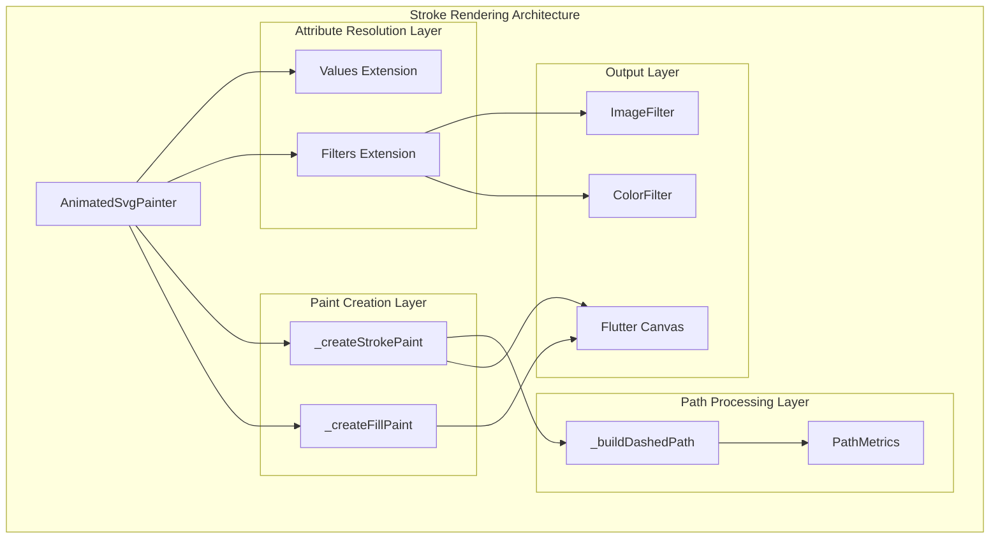
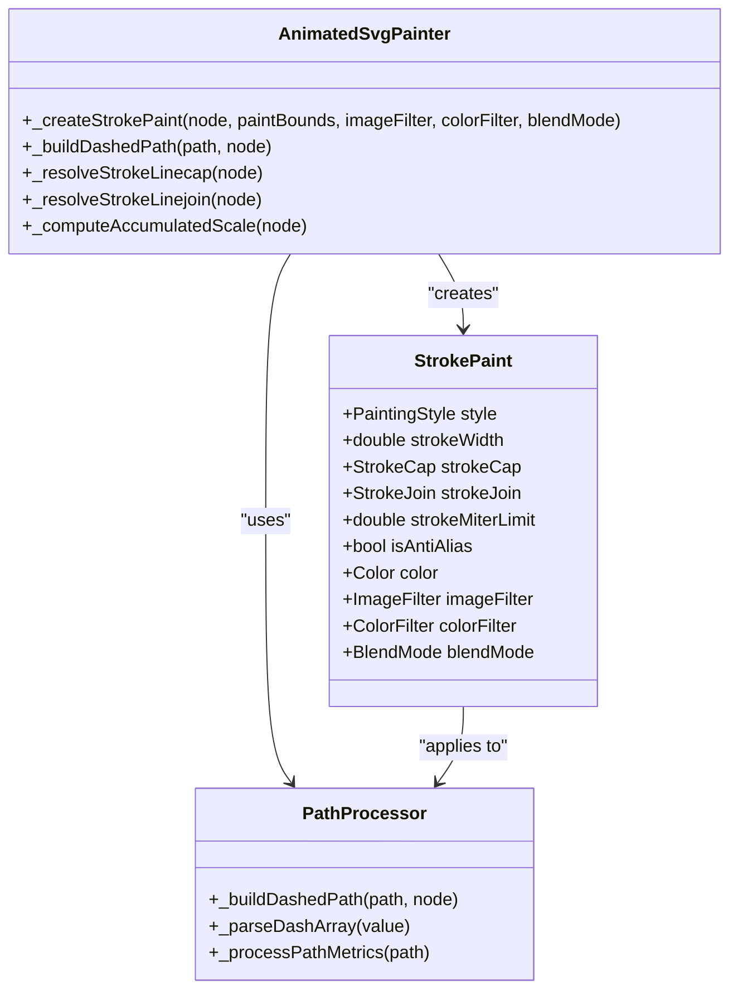
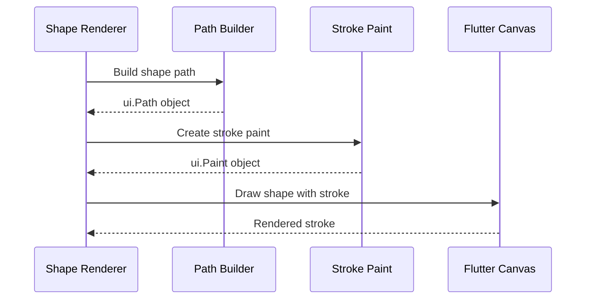
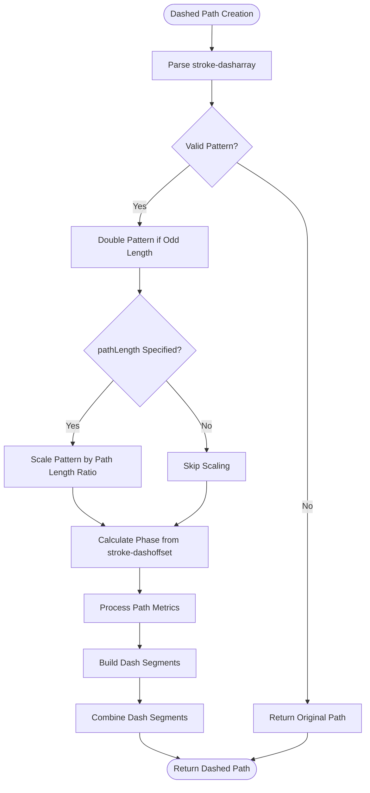
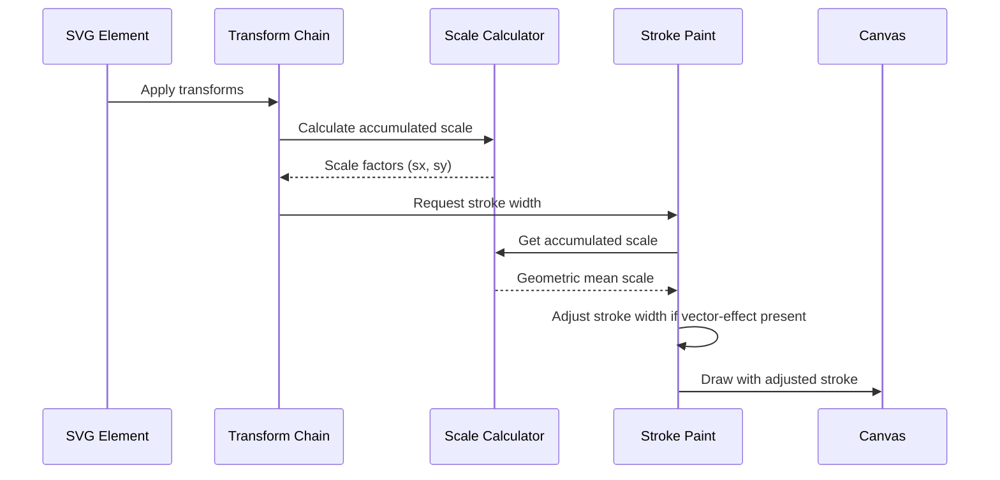
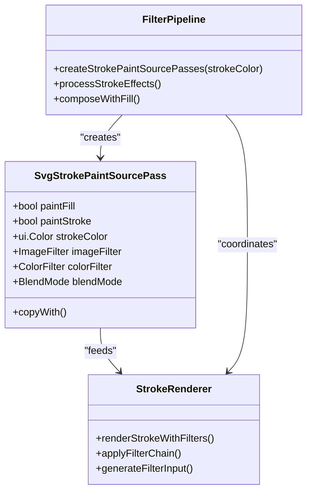

# Stroke Rendering System

<cite>
**Referenced Files in This Document**
- [animated_svg_painter_paints.dart](file://lib/src/animation/animated_svg_painter_paints.dart)
- [animated_svg_painter_shapes_paths.dart](file://lib/src/animation/animated_svg_painter_shapes_paths.dart)
- [animated_svg_painter_shapes.dart](file://lib/src/animation/animated_svg_painter_shapes.dart)
- [animated_svg_painter_values.dart](file://lib/src/animation/animated_svg_painter_values.dart)
- [stroke_styling_test.dart](file://test/animation/stroke_styling_test.dart)
- [vector_effect_test.dart](file://test/animation/vector_effect_test.dart)
- [svg_filters_registry_pipeline_primitives_paint.dart](file://lib/src/animation/svg_filters_registry_pipeline_primitives_paint.dart)
</cite>

## Table of Contents
1. [Introduction](#introduction)
2. [System Architecture](#system-architecture)
3. [Core Stroke Rendering Components](#core-stroke-rendering-components)
4. [Stroke Attribute Resolution](#stroke-attribute-resolution)
5. [Dashed Path Implementation](#dashed-path-implementation)
6. [Vector Effect Processing](#vector-effect-processing)
7. [Filter Integration](#filter-integration)
8. [Performance Considerations](#performance-considerations)
9. [Testing and Validation](#testing-and-validation)
10. [Troubleshooting Guide](#troubleshooting-guide)

## Introduction

The Stroke Rendering System is a comprehensive framework within the Flutter SVG support library that handles the creation, styling, and rendering of stroke attributes for SVG elements. This system provides complete SVG stroke specification compliance, including support for stroke-dasharray patterns, stroke-dashoffset positioning, vector-effect transformations, and integration with the broader SVG filter pipeline.

The system operates as part of the AnimatedSvgPainter architecture, which processes SVG nodes and converts them into Flutter Canvas operations. The stroke rendering system specifically focuses on the visual attributes that define how SVG shapes are outlined, including line caps, joins, miter limits, and various stroke styling options.

## System Architecture

The stroke rendering system is built around several key architectural components that work together to provide comprehensive stroke functionality:

**Diagram sources**
- [animated_svg_painter_paints.dart:85-153](file://lib/src/animation/animated_svg_painter_paints.dart#L85-L153)
- [animated_svg_painter_values.dart:355-383](file://lib/src/animation/animated_svg_painter_values.dart#L355-L383)

The architecture follows a layered approach where attribute resolution occurs first, followed by paint creation, path processing, and finally rendering to the canvas. This separation ensures maintainability and allows for extension of individual components.

**Section sources**
- [animated_svg_painter_paints.dart:1-273](file://lib/src/animation/animated_svg_painter_paints.dart#L1-L273)
- [animated_svg_painter_values.dart:1-468](file://lib/src/animation/animated_svg_painter_values.dart#L1-L468)

## Core Stroke Rendering Components

### Paint Creation System

The stroke paint creation system is responsible for generating Flutter Paint objects with appropriate stroke properties. The `_createStrokePaint` method serves as the central factory for stroke paints, handling all stroke-related attributes and configurations.

**Diagram sources**
- [animated_svg_painter_paints.dart:85-153](file://lib/src/animation/animated_svg_painter_paints.dart#L85-L153)
- [animated_svg_painter_paints.dart:155-272](file://lib/src/animation/animated_svg_painter_paints.dart#L155-L272)

The stroke paint creation process involves several key steps:
1. Attribute inheritance resolution from the SVG node hierarchy
2. Stroke width calculation considering vector-effect transformations
3. Paint server resolution for gradient and pattern strokes
4. Opacity combination between element and stroke opacity
5. Anti-aliasing and blending mode configuration

**Section sources**
- [animated_svg_painter_paints.dart:85-153](file://lib/src/animation/animated_svg_painter_paints.dart#L85-L153)

### Shape-Specific Stroke Rendering

Different SVG shapes require specialized stroke rendering approaches to ensure proper visual representation:

**Diagram sources**
- [animated_svg_painter_shapes_paths.dart:4-65](file://lib/src/animation/animated_svg_painter_shapes_paths.dart#L4-L65)
- [animated_svg_painter_shapes.dart:4-50](file://lib/src/animation/animated_svg_painter_shapes.dart#L4-L50)

Each shape type (paths, circles, ellipses, lines, polygons, polylines) implements its own stroke rendering logic while sharing common attribute resolution and paint creation capabilities.

**Section sources**
- [animated_svg_painter_shapes_paths.dart:1-190](file://lib/src/animation/animated_svg_painter_shapes_paths.dart#L1-L190)
- [animated_svg_painter_shapes.dart:1-156](file://lib/src/animation/animated_svg_painter_shapes.dart#L1-L156)

## Stroke Attribute Resolution

### Line Cap and Join Resolution

The stroke rendering system supports three line cap styles and three line join styles, each with specific visual characteristics:

| Attribute | Values | Description |
|-----------|--------|-------------|
| stroke-linecap | butt, round, square | End cap style for open paths |
| stroke-linejoin | miter, round, bevel | Corner join style for paths |
| stroke-miterlimit | number | Maximum miter length before bevel |

The resolution process follows SVG specifications with appropriate defaults and inheritance behavior.

**Section sources**
- [animated_svg_painter_values.dart:355-383](file://lib/src/animation/animated_svg_painter_values.dart#L355-L383)
- [animated_svg_painter_text_style_rendering.dart:254-282](file://lib/src/animation/animated_svg_painter_text_style_rendering.dart#L254-L282)

### Opacity and Blending

Stroke opacity combines element opacity with stroke-specific opacity settings, providing fine-grained control over transparency effects. The system supports both direct color specification and paint server references for complex stroke patterns.

**Section sources**
- [animated_svg_painter_paints.dart:101-104](file://lib/src/animation/animated_svg_painter_paints.dart#L101-L104)
- [animated_svg_painter_paints.dart:124-135](file://lib/src/animation/animated_svg_painter_paints.dart#L124-L135)

## Dashed Path Implementation

The dashed path system provides comprehensive support for SVG stroke-dasharray patterns, including automatic pattern doubling for odd-length arrays and pathLength attribute scaling.

**Diagram sources**
- [animated_svg_painter_paints.dart:155-272](file://lib/src/animation/animated_svg_painter_paints.dart#L155-L272)

### Pattern Processing Algorithm

The dashed path algorithm processes each path segment through a sophisticated pattern matching system:

1. **Pattern Normalization**: Converts stroke-dasharray strings to numeric arrays
2. **Pattern Doubling**: Automatically duplicates odd-length patterns per SVG specification
3. **Path Length Scaling**: Adjusts pattern sizes based on pathLength attribute
4. **Phase Calculation**: Determines starting position using stroke-dashoffset
5. **Segment Extraction**: Builds visible segments by extracting path portions
6. **Pattern Cycling**: Alternates between dash and gap segments

**Section sources**
- [animated_svg_painter_paints.dart:155-272](file://lib/src/animation/animated_svg_painter_paints.dart#L155-L272)

## Vector Effect Processing

The vector-effect attribute system provides advanced stroke scaling control, particularly the `non-scaling-stroke` feature that maintains constant stroke width regardless of element transformations.

**Diagram sources**
- [animated_svg_painter_values.dart:304-353](file://lib/src/animation/animated_svg_painter_values.dart#L304-L353)
- [animated_svg_painter_paints.dart:106-114](file://lib/src/animation/animated_svg_painter_paints.dart#L106-L114)

The vector effect processing calculates the geometric mean of horizontal and vertical scale factors to maintain consistent stroke appearance across non-uniform transformations.

**Section sources**
- [animated_svg_painter_values.dart:304-353](file://lib/src/animation/animated_svg_painter_values.dart#L304-L353)
- [vector_effect_test.dart:1-227](file://test/animation/vector_effect_test.dart#L1-L227)

## Filter Integration

The stroke rendering system integrates seamlessly with the SVG filter pipeline, allowing strokes to participate in complex visual effects and compositing operations.

**Diagram sources**
- [svg_filters_registry_pipeline_primitives_paint.dart:46-364](file://lib/src/animation/svg_filters_registry_pipeline_primitives_paint.dart#L46-L364)

The filter integration supports both solid color strokes and gradient/pattern strokes, with optimized paths for different stroke types to minimize computational overhead.

**Section sources**
- [svg_filters_registry_pipeline_primitives_paint.dart:46-364](file://lib/src/animation/svg_filters_registry_pipeline_primitives_paint.dart#L46-L364)

## Performance Considerations

### Path Metric Computation

The stroke rendering system performs efficient path metric computations to support dashed patterns and accurate stroke positioning. The system optimizes for:

- **Single path length calculation**: Reuses computed path lengths when multiple metrics are processed
- **Pattern caching**: Maintains pattern state across path segments to minimize redundant calculations
- **Early termination**: Quickly returns original paths when no stroke styling is applied

### Memory Management

The system employs several memory optimization strategies:

- **Path reuse**: Reuses Path objects where possible to reduce allocation overhead
- **Float precision**: Uses double precision for calculations while maintaining efficient storage
- **Filter chaining**: Optimizes filter pipeline execution to minimize intermediate image creation

## Testing and Validation

### Comprehensive Test Coverage

The stroke rendering system includes extensive test coverage validating:

- **Line cap and join attributes**: Testing all supported values and inheritance behavior
- **Vector effect functionality**: Verifying non-scaling-stroke behavior across different transforms
- **Dashed pattern rendering**: Validating complex pattern combinations and pathLength scaling
- **Opacity and blending**: Testing color filter integration and mix-blend-mode effects

**Section sources**
- [stroke_styling_test.dart:1-295](file://test/animation/stroke_styling_test.dart#L1-L295)
- [vector_effect_test.dart:1-227](file://test/animation/vector_effect_test.dart#L1-L227)

### Edge Case Handling

The system includes robust handling for edge cases:

- **Empty dash arrays**: Gracefully falls back to solid strokes
- **Invalid path data**: Safely handles malformed SVG path commands
- **Inheritance conflicts**: Resolves CSS specificity and presentation attribute precedence
- **Transform anomalies**: Handles degenerate transformation matrices

## Troubleshooting Guide

### Common Issues and Solutions

**Issue**: Strokes appear thicker than expected after scaling
- **Cause**: Missing `vector-effect="non-scaling-stroke"` attribute
- **Solution**: Add the vector-effect attribute to maintain constant stroke width

**Issue**: Dashed patterns not rendering correctly
- **Cause**: Invalid stroke-dasharray syntax or unsupported units
- **Solution**: Ensure dash array values use supported units (px, em, %) and proper formatting

**Issue**: Stroke opacity not working as expected
- **Cause**: Conflicting opacity settings between element and stroke-opacity
- **Solution**: Verify opacity calculation combines both element and stroke opacity correctly

**Issue**: Line caps not appearing rounded
- **Cause**: Incorrect stroke-linecap attribute value
- **Solution**: Ensure stroke-linecap is set to "round", "square", or "butt"

### Debug Strategies

1. **Attribute verification**: Check that stroke attributes are properly inherited from parent elements
2. **Transform inspection**: Verify transformation matrices don't interfere with stroke rendering
3. **Path validation**: Ensure SVG path data is well-formed and contains valid coordinates
4. **Filter isolation**: Test stroke rendering without filters to identify filter-related issues