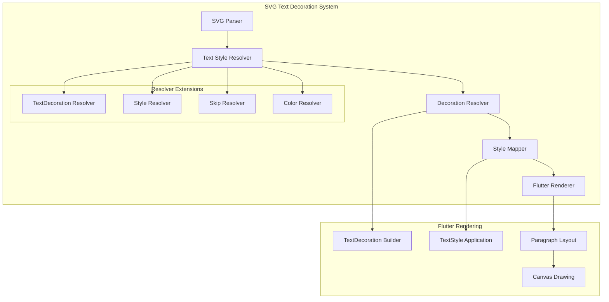
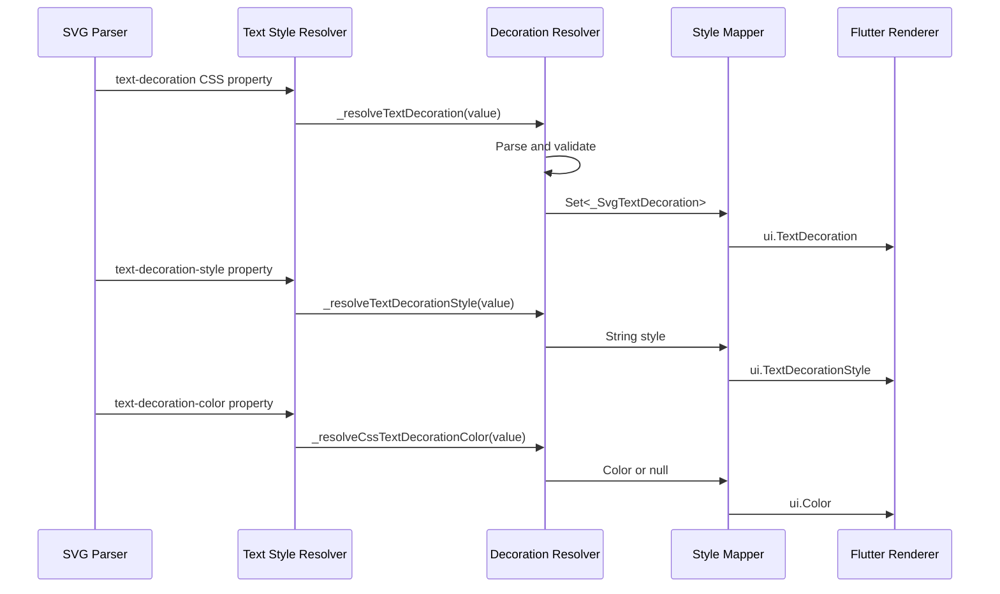
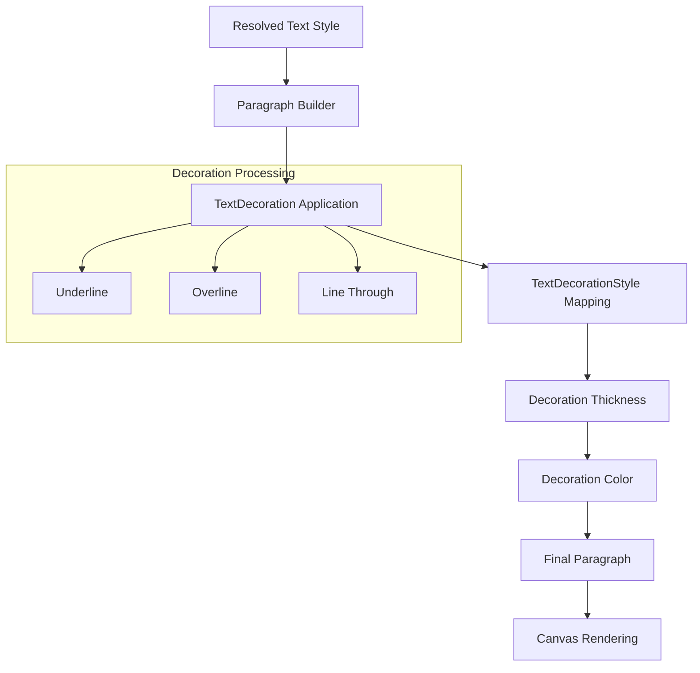

# Text Decoration Style Mapping

<cite>
**Referenced Files in This Document**
- [animated_svg_painter_text_style_decoration.dart](file://lib/src/animation/animated_svg_painter_text_style_decoration.dart)
- [animated_svg_painter_text_style.dart](file://lib/src/animation/animated_svg_painter_text_style.dart)
- [animated_svg_painter_text_style_rendering.dart](file://lib/src/animation/animated_svg_painter_text_style_rendering.dart)
- [animated_svg_painter.dart](file://lib/src/animation/animated_svg_painter.dart)
- [text_decoration_style_test.dart](file://test/animation/text_decoration_style_test.dart)
- [text_decoration_line_test.dart](file://test/animation/text_decoration_line_test.dart)
- [text_decoration_thickness_test.dart](file://test/animation/text_decoration_thickness_test.dart)
- [text_decoration_skip_ink_test.dart](file://test/animation/text_decoration_skip_ink_test.dart)
- [text_decoration_skip_test.dart](file://test/animation/text_decoration_skip_test.dart)
</cite>

## Table of Contents
1. [Introduction](#introduction)
2. [Architecture Overview](#architecture-overview)
3. [Core Components](#core-components)
4. [Text Decoration Resolution System](#text-decoration-resolution-system)
5. [Style Mapping Implementation](#style-mapping-implementation)
6. [CSS Property Processing](#css-property-processing)
7. [Rendering Pipeline](#rendering-pipeline)
8. [Testing Framework](#testing-framework)
9. [Performance Considerations](#performance-considerations)
10. [Troubleshooting Guide](#troubleshooting-guide)
11. [Conclusion](#conclusion)

## Introduction

The Flutter SVG support library provides comprehensive text decoration style mapping capabilities that enable SVG text elements to render with accurate CSS text decoration properties. This documentation focuses specifically on the text decoration style mapping system, which handles the conversion of SVG/CSS text decoration properties to Flutter's native text decoration rendering system.

The system supports a wide range of text decoration styles including solid, double, dotted, dashed, and wavy line styles, along with comprehensive property resolution for text-decoration-color, text-decoration-thickness, text-decoration-skip, and text-decoration-skip-ink. The implementation ensures parity with web standards while leveraging Flutter's efficient text rendering pipeline.

## Architecture Overview

The text decoration style mapping system is built as a modular extension to the main AnimatedSvgPainter class. The architecture follows a layered approach where individual CSS properties are resolved and combined into a unified text decoration representation.



**Diagram sources**
- [animated_svg_painter_text_style_decoration.dart:1-315](file://lib/src/animation/animated_svg_painter_text_style_decoration.dart#L1-L315)
- [animated_svg_painter_text_style_rendering.dart:120-179](file://lib/src/animation/animated_svg_painter_text_style_rendering.dart#L120-L179)

## Core Components

The text decoration system consists of several key components that work together to provide comprehensive text decoration support:

### Text Decoration Resolver Extension

The core functionality is implemented as an extension to AnimatedSvgPainter, providing specialized methods for resolving various text decoration CSS properties. The resolver handles property parsing, validation, and conversion to appropriate internal representations.

### Resolved Text Style Container

The `_ResolvedTextStyle` class serves as the central container for all resolved text properties, including decoration-specific attributes. It maintains both the raw CSS property values and their processed equivalents suitable for Flutter rendering.

### Decoration Type System

The system defines a comprehensive enumeration of text decoration types (`_SvgTextDecoration`) that includes underline, overline, and line-through variants. These types are combined using Flutter's `TextDecoration.combine` method for multi-line decorations.

**Section sources**
- [animated_svg_painter_text_style_decoration.dart:10-323](file://lib/src/animation/animated_svg_painter_text_style_decoration.dart#L10-L323)
- [animated_svg_painter.dart:399-559](file://lib/src/animation/animated_svg_painter.dart#L399-L559)

## Text Decoration Resolution System

The resolution system processes multiple CSS text decoration properties through a coordinated workflow that ensures proper inheritance, validation, and conversion to Flutter-compatible formats.

### Property Resolution Workflow



**Diagram sources**
- [animated_svg_painter_text_style_decoration.dart:12-237](file://lib/src/animation/animated_svg_painter_text_style_decoration.dart#L12-L237)
- [animated_svg_painter_text_style_rendering.dart:158-160](file://lib/src/animation/animated_svg_painter_text_style_rendering.dart#L158-L160)

### Multi-Line Decoration Support

The system supports multiple simultaneous text decorations through a set-based approach. Each decoration type (underline, overline, line-through) is represented as a separate bit in the decoration mask, allowing for complex combinations like `text-decoration: underline overline line-through`.

**Section sources**
- [animated_svg_painter_text_style_decoration.dart:35-50](file://lib/src/animation/animated_svg_painter_text_style_decoration.dart#L35-L50)
- [animated_svg_painter_text_style_decoration.dart:205-223](file://lib/src/animation/animated_svg_painter_text_style_decoration.dart#L205-L223)

## Style Mapping Implementation

The style mapping implementation converts resolved CSS values to Flutter's native text decoration style system through a sophisticated mapping mechanism.

### Text Decoration Style Mapping

The `_mapDecorationStyle` method provides the bridge between CSS text-decoration-style values and Flutter's `TextDecorationStyle` enum:

| CSS Value | Flutter Equivalent | Description |
|-----------|-------------------|-------------|
| `solid` | `TextDecorationStyle.solid` | Single continuous line |
| `double` | `TextDecorationStyle.double` | Double line style |
| `dotted` | `TextDecorationStyle.dotted` | Dotted line pattern |
| `dashed` | `TextDecorationStyle.dashed` | Dashed line pattern |
| `wavy` | `TextDecorationStyle.wavy` | Wavy line pattern |

### Unit Conversion System

The system implements comprehensive unit conversion for text decoration measurements, supporting multiple unit types:

- **Absolute Units**: `px` (pixels) - directly converted to Flutter units
- **Relative Units**: `em` (relative to font size) - scaled by current font size
- **Percentage Values**: `%` (percentage of 1em) - converted to absolute pixels
- **Auto Values**: `auto`, `from-font` - converted to null for automatic sizing

**Section sources**
- [animated_svg_painter_text_style_decoration.dart:182-200](file://lib/src/animation/animated_svg_painter_text_style_decoration.dart#L182-L200)
- [animated_svg_painter_text_style_decoration.dart:102-131](file://lib/src/animation/animated_svg_painter_text_style_decoration.dart#L102-L131)

## CSS Property Processing

The CSS property processing system handles the complete lifecycle of text decoration properties from SVG parsing to final rendering.

### Property Validation and Normalization

Each CSS property undergoes strict validation and normalization:

1. **Null Safety**: All properties accept null values gracefully
2. **Case Insensitive**: Values are normalized to lowercase for comparison
3. **Whitespace Handling**: Multiple values are split and validated individually
4. **Keyword Validation**: Only valid CSS keywords are accepted

### Inheritance Support

The system respects CSS inheritance patterns for text decoration properties, allowing parent elements to define default values that child elements can override or inherit.

### Property Combination Rules

Multiple text decoration properties combine according to CSS specification:

- **text-decoration**: Controls which lines are drawn
- **text-decoration-style**: Controls the visual appearance of lines  
- **text-decoration-color**: Controls line color
- **text-decoration-thickness**: Controls line thickness
- **text-decoration-skip**: Controls line skipping behavior
- **text-decoration-skip-ink**: Controls ink coverage behavior

**Section sources**
- [animated_svg_painter_text_style_decoration.dart:13-32](file://lib/src/animation/animated_svg_painter_text_style_decoration.dart#L13-L32)
- [animated_svg_painter_text_style_decoration.dart:156-177](file://lib/src/animation/animated_svg_painter_text_style_decoration.dart#L156-L177)

## Rendering Pipeline

The rendering pipeline transforms resolved text decoration properties into visual text decorations through Flutter's paragraph system.

### Paragraph Building Process



**Diagram sources**
- [animated_svg_painter_text_style_rendering.dart:120-179](file://lib/src/animation/animated_svg_painter_text_style_rendering.dart#L120-L179)

### TextDecoration Construction

The `_buildTextDecoration` method converts the internal decoration set to Flutter's `TextDecoration` enum:

```dart
// Example conversion logic
if (decorations.contains(_SvgTextDecoration.underline)) {
    list.add(ui.TextDecoration.underline);
}
if (decorations.contains(_SvgTextDecoration.overline)) {
    list.add(ui.TextDecoration.overline);
}
if (decorations.contains(_SvgTextDecoration.lineThrough)) {
    list.add(ui.TextDecoration.lineThrough);
}
return ui.TextDecoration.combine(list);
```

### Rendering Optimization

The system implements caching mechanisms to optimize repeated text decoration rendering, storing processed paragraphs in memory for quick retrieval.

**Section sources**
- [animated_svg_painter_text_style_rendering.dart:147-170](file://lib/src/animation/animated_svg_painter_text_style_rendering.dart#L147-L170)

## Testing Framework

The testing framework provides comprehensive coverage for text decoration style mapping functionality through targeted unit tests.

### Style Property Tests

Individual style properties are tested in isolation to ensure proper resolution and rendering:

- **Solid Style**: Default underline rendering
- **Double Style**: Double line underline
- **Dotted Style**: Dotted line pattern
- **Dashed Style**: Dashed line pattern  
- **Wavy Style**: Wavy line pattern

### Inheritance Testing

The system validates proper CSS inheritance behavior where parent elements can define default text decoration styles that are inherited by child elements.

### Multi-Line Decoration Testing

Complex scenarios involving multiple simultaneous decorations are thoroughly tested to ensure proper rendering combinations.

**Section sources**
- [text_decoration_style_test.dart:1-75](file://test/animation/text_decoration_style_test.dart#L1-L75)
- [text_decoration_line_test.dart:1-51](file://test/animation/text_decoration_line_test.dart#L1-L51)

## Performance Considerations

The text decoration style mapping system is optimized for performance through several key strategies:

### Caching Mechanisms

- **Paragraph Caching**: Resolved text paragraphs are cached based on property combinations
- **Color Resolution**: Color values are cached to avoid repeated parsing
- **Unit Conversion**: Converted values are cached for reuse

### Memory Management

- **Weak References**: Cache entries use weak references to prevent memory leaks
- **Size Limits**: Cache sizes are monitored and pruned when exceeding limits
- **Garbage Collection**: Automatic cleanup of unused cache entries

### Rendering Efficiency

- **Batch Processing**: Multiple text decorations are processed in single operations
- **Lazy Evaluation**: Properties are only resolved when needed
- **Minimal Object Creation**: Reusable objects minimize garbage collection pressure

## Troubleshooting Guide

Common issues and their solutions when working with text decoration style mapping:

### Style Not Applying

**Symptoms**: Text decorations appear but with incorrect style or missing entirely

**Causes**:
- Invalid CSS property values
- Unsupported text-decoration-style values
- Incorrect unit specifications

**Solutions**:
- Verify CSS property syntax follows standard format
- Ensure text-decoration-style uses supported values (solid, double, dotted, dashed, wavy)
- Check unit specifications match supported formats (px, em, %)

### Inheritance Issues

**Symptoms**: Child elements don't inherit expected text decoration styles

**Causes**:
- Conflicting parent styles overriding child definitions
- CSS specificity conflicts
- Property precedence issues

**Solutions**:
- Verify parent element has proper text-decoration-style definition
- Check for CSS specificity conflicts in inherited styles
- Ensure child elements aren't overriding inherited properties unintentionally

### Performance Problems

**Symptoms**: Slow rendering or memory usage increases with complex text decorations

**Causes**:
- Excessive paragraph recreation
- Large cache sizes
- Complex text decoration combinations

**Solutions**:
- Monitor cache usage and prune when necessary
- Simplify complex text decoration combinations
- Use consistent text decoration styles across similar elements

**Section sources**
- [animated_svg_painter_text_style_decoration.dart:182-200](file://lib/src/animation/animated_svg_painter_text_style_decoration.dart#L182-L200)
- [animated_svg_painter_text_style_rendering.dart:84-88](file://lib/src/animation/animated_svg_painter_text_style_rendering.dart#L84-L88)

## Conclusion

The text decoration style mapping system provides comprehensive SVG text decoration support through a sophisticated pipeline that bridges CSS properties with Flutter's native rendering capabilities. The system's modular architecture, extensive testing coverage, and performance optimizations ensure reliable and efficient text decoration rendering across diverse use cases.

The implementation successfully handles the full spectrum of CSS text decoration properties while maintaining compatibility with existing Flutter text rendering systems. Through careful property resolution, intelligent caching, and robust error handling, the system delivers both accuracy and performance for production applications.

Future enhancements could include additional text decoration style support, improved inheritance mechanisms, and expanded unit conversion capabilities to further enhance the system's flexibility and compatibility.