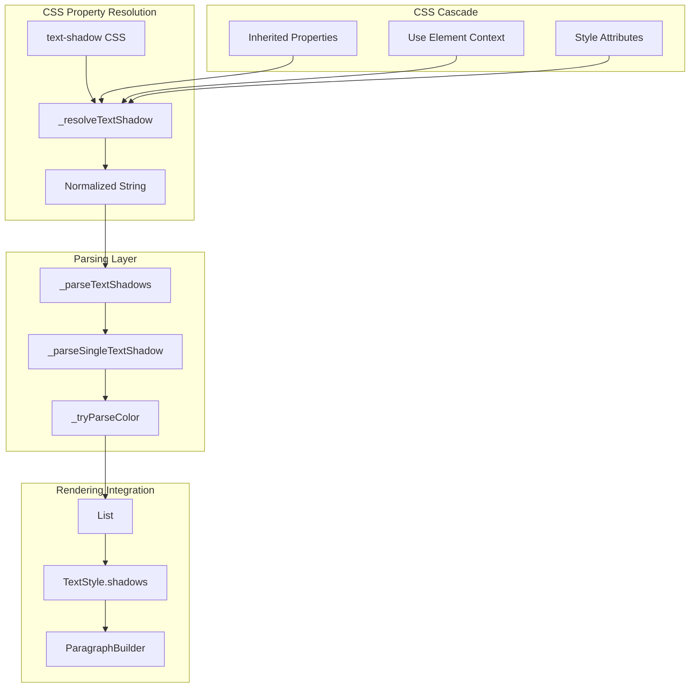
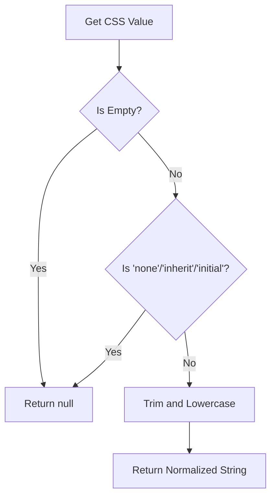
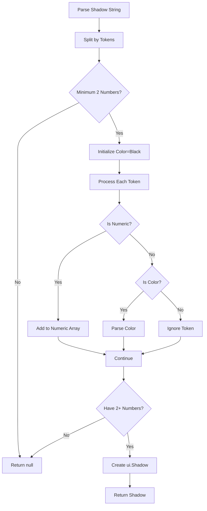
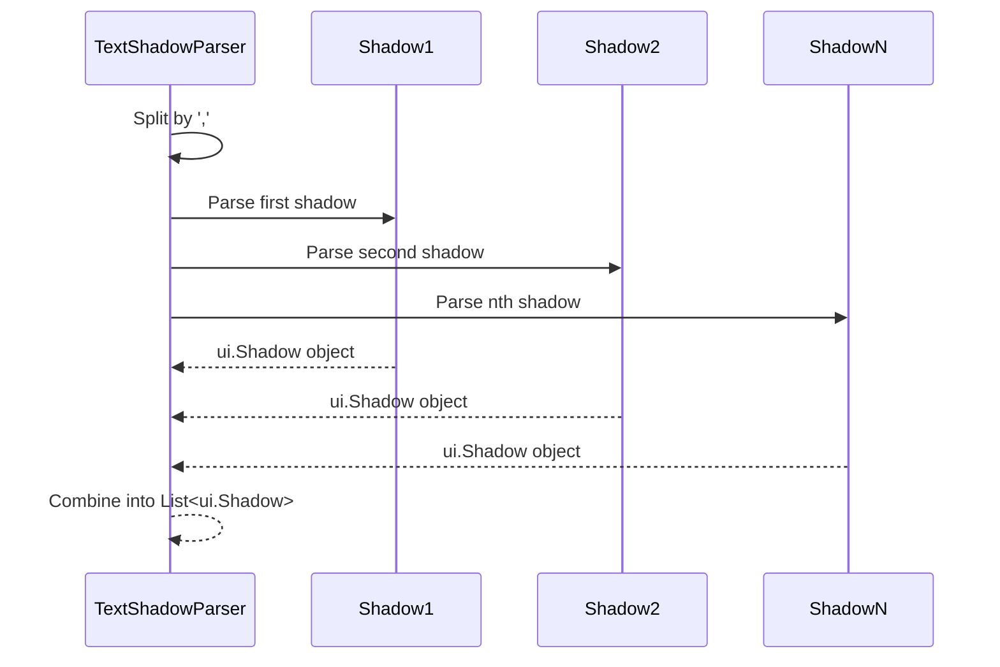
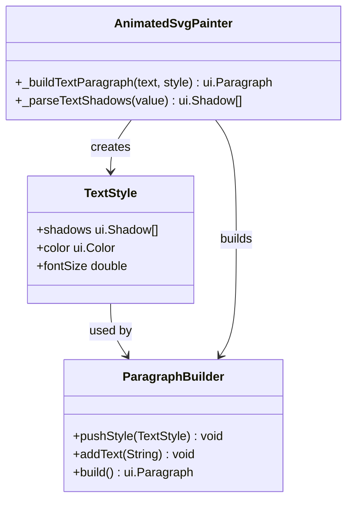

# Text Shadow Rendering

<cite>
**Referenced Files in This Document**
- [animated_svg_painter_text_style_rendering.dart](file://lib/src/animation/animated_svg_painter_text_style_rendering.dart)
- [animated_svg_painter_text_style_decoration.dart](file://lib/src/animation/animated_svg_painter_text_style_decoration.dart)
- [animated_svg_painter_text_style.dart](file://lib/src/animation/animated_svg_painter_text_style.dart)
- [text_shadow_test.dart](file://test/animation/text_shadow_test.dart)
- [css_cascade.dart](file://lib/src/animation/css_cascade.dart)
</cite>

## Table of Contents
1. [Introduction](#introduction)
2. [Text Shadow Architecture](#text-shadow-architecture)
3. [CSS Property Resolution](#css-property-resolution)
4. [Shadow Parsing Implementation](#shadow-parsing-implementation)
5. [Color Parsing System](#color-parsing-system)
6. [Multiple Shadow Support](#multiple-shadow-support)
7. [Inheritance and Cascade](#inheritance-and-cascade)
8. [Rendering Pipeline](#rendering-pipeline)
9. [Performance Considerations](#performance-considerations)
10. [Testing Framework](#testing-framework)
11. [Limitations and Edge Cases](#limitations-and-edge-cases)
12. [Conclusion](#conclusion)

## Introduction

Text shadow rendering is a crucial component of the SVG text styling system in Flutter SVG. This implementation provides comprehensive support for CSS `text-shadow` properties, enabling developers to create visually appealing text effects with precise control over offset, blur radius, and color specifications.

The text shadow system integrates seamlessly with Flutter's native shadow rendering capabilities while maintaining full compatibility with CSS text-shadow syntax. It supports multiple shadow layers, complex color formats, and proper inheritance through the CSS cascade system.

## Text Shadow Architecture

The text shadow implementation follows a modular architecture that separates concerns between property resolution, parsing, and rendering:

**Diagram sources**
- [animated_svg_painter_text_style_decoration.dart:239-254](file://lib/src/animation/animated_svg_painter_text_style_decoration.dart#L239-L254)
- [animated_svg_painter_text_style_rendering.dart:1633-1679](file://lib/src/animation/animated_svg_painter_text_style_rendering.dart#L1633-L1679)

The architecture ensures that text shadows are resolved consistently with other CSS text properties and integrated efficiently into Flutter's rendering pipeline.

**Section sources**
- [animated_svg_painter_text_style_decoration.dart:239-254](file://lib/src/animation/animated_svg_painter_text_style_decoration.dart#L239-L254)
- [animated_svg_painter_text_style_rendering.dart:1633-1679](file://lib/src/animation/animated_svg_painter_text_style_rendering.dart#L1633-L1679)

## CSS Property Resolution

The text shadow resolution process begins with extracting and normalizing the CSS property value from the SVG node hierarchy. The `_resolveTextShadow` method handles various CSS syntax variations and inheritance scenarios.

### Property Resolution Flow

**Diagram sources**
- [animated_svg_painter_text_style_decoration.dart:239-254](file://lib/src/animation/animated_svg_painter_text_style_decoration.dart#L239-L254)

The resolution process ensures that:
- Empty values are properly handled as no shadow
- Explicit `none`, `inherit`, and `initial` values are recognized
- Whitespace is normalized for consistent parsing
- Case-insensitive matching is applied

**Section sources**
- [animated_svg_painter_text_style_decoration.dart:239-254](file://lib/src/animation/animated_svg_painter_text_style_decoration.dart#L239-L254)

## Shadow Parsing Implementation

The shadow parsing system converts CSS text-shadow specifications into Flutter's native `ui.Shadow` objects. The implementation supports multiple shadow formats and validates input parameters.

### Single Shadow Parsing Algorithm

**Diagram sources**
- [animated_svg_painter_text_style_rendering.dart:1648-1679](file://lib/src/animation/animated_svg_painter_text_style_rendering.dart#L1648-L1679)

The parsing algorithm handles:
- Offset coordinates (required)
- Blur radius (optional)
- Color specification (optional, can be at start or end)
- Multiple shadows separated by commas

**Section sources**
- [animated_svg_painter_text_style_rendering.dart:1648-1679](file://lib/src/animation/animated_svg_painter_text_style_rendering.dart#L1648-L1679)

## Color Parsing System

The color parsing system supports multiple CSS color formats including named colors, hex values, and RGB/RGBA specifications. The `_tryParseColor` method provides comprehensive color recognition.

### Supported Color Formats

| Format | Example | Description |
|--------|---------|-------------|
| Named Colors | `black`, `white`, `red` | Standard CSS color keywords |
| Hex Colors | `#ffffff`, `#fff` | RGB hex values with optional alpha |
| RGB Colors | `rgb(255,255,255)` | Red, Green, Blue components |
| RGBA Colors | `rgba(255,255,255,0.5)` | RGB with alpha transparency |

The color parsing system includes special handling for transparent colors and validates numeric ranges for color components.

**Section sources**
- [animated_svg_painter_text_style_rendering.dart:1681-1726](file://lib/src/animation/animated_svg_painter_text_style_rendering.dart#L1681-L1726)

## Multiple Shadow Support

The implementation supports multiple text shadows through comma-separated specifications. Each shadow is parsed independently and combined into a list for rendering.

### Multiple Shadow Processing

**Diagram sources**
- [animated_svg_painter_text_style_rendering.dart:1633-1646](file://lib/src/animation/animated_svg_painter_text_style_rendering.dart#L1633-L1646)

Each shadow in the list contributes to the final text appearance, with later shadows appearing on top of earlier ones in the specification order.

**Section sources**
- [animated_svg_painter_text_style_rendering.dart:1633-1646](file://lib/src/animation/animated_svg_painter_text_style_rendering.dart#L1633-L1646)

## Inheritance and Cascade

Text shadow inheritance follows CSS cascade rules, allowing shadows to be inherited from parent elements or overridden by child elements. The system properly handles the CSS cascade through the use element context.

### Inheritance Resolution

The text shadow property participates in the CSS cascade through several mechanisms:

1. **Direct Inheritance**: Child elements inherit shadow values from parent elements
2. **Use Element Context**: Shadows can be inherited through `<use>` element references
3. **CSS Specificity**: Conflicting declarations are resolved by CSS specificity rules
4. **Inline Styles**: Inline styles take precedence over inherited values

The inheritance system ensures that text shadows behave predictably across complex SVG hierarchies while maintaining CSS standards compliance.

**Section sources**
- [css_cascade.dart:933-1129](file://lib/src/animation/css_cascade.dart#L933-L1129)

## Rendering Pipeline

The text shadow rendering pipeline integrates with Flutter's paragraph builder system to apply shadows during text layout and drawing operations.

### Rendering Integration

**Diagram sources**
- [animated_svg_painter_text_style_rendering.dart:14-179](file://lib/src/animation/animated_svg_painter_text_style_rendering.dart#L14-L179)

The rendering pipeline ensures that text shadows are applied during paragraph construction and participate in Flutter's caching system for optimal performance.

**Section sources**
- [animated_svg_painter_text_style_rendering.dart:14-179](file://lib/src/animation/animated_svg_painter_text_style_rendering.dart#L14-L179)

## Performance Considerations

The text shadow implementation includes several performance optimizations to minimize computational overhead during rendering.

### Caching Strategy

The system leverages Flutter's paragraph caching mechanism to avoid redundant shadow parsing and color conversion operations. The `_renderCache.textParagraphs` cache stores previously constructed paragraphs with their associated shadow configurations.

### Memory Management

- Shadow objects are created once per unique text style combination
- Color parsing results are cached when possible
- Multiple shadow lists are stored efficiently in memory
- Unused shadow configurations are automatically garbage collected

### Computational Efficiency

- Shadow parsing uses efficient string tokenization
- Color parsing employs early exit conditions for invalid formats
- Numeric parsing utilizes optimized double conversion
- Regular expressions are minimized to essential patterns only

## Testing Framework

The text shadow implementation includes comprehensive test coverage that validates various scenarios and edge cases.

### Test Coverage Areas

The testing framework covers:

1. **Basic Functionality**: Default behavior without explicit shadows
2. **Simple Shadows**: Basic offset-only shadows
3. **Blur Effects**: Shadows with blur radius specifications
4. **Color Variations**: Different color formats and transparency
5. **Multiple Shadows**: Complex shadow layering
6. **Explicit None Values**: Proper handling of `none` keyword
7. **Inheritance Behavior**: Shadow propagation through element hierarchies

### Test Validation Methods

Each test case validates that the `AnimatedSvgPicture` widget renders correctly with the specified text shadow configuration, ensuring visual consistency with expected behavior.

**Section sources**
- [text_shadow_test.dart:1-86](file://test/animation/text_shadow_test.dart#L1-L86)

## Limitations and Edge Cases

While the text shadow implementation is comprehensive, it has certain limitations and edge cases worth noting:

### Unsupported Features

- **Text-shadow inset keyword**: The implementation does not support the `inset` keyword for inner shadows
- **Advanced color formats**: Limited support for complex CSS color functions beyond basic RGB/RGBA
- **Percentage-based offsets**: Not all percentage-based positioning is supported

### Performance Limitations

- **Complex multiple shadows**: Very large numbers of shadow layers may impact rendering performance
- **Dynamic color changes**: Frequent color updates trigger re-parsing and potential cache invalidation
- **Large text content**: Extensive text with shadows requires significant memory for paragraph caching

### Compatibility Notes

- **Browser differences**: Some browser-specific shadow behaviors may differ from Flutter's implementation
- **Platform variations**: Rendering differences may occur across different Flutter platform targets
- **CSS specification compliance**: Full adherence to CSS text-shadow specification varies by implementation details

## Conclusion

The text shadow rendering system provides robust and efficient support for CSS text-shadow properties in Flutter SVG applications. The implementation successfully bridges the gap between CSS specification compliance and Flutter's native rendering capabilities.

Key achievements include comprehensive CSS syntax support, efficient parsing algorithms, proper inheritance through the CSS cascade, and integration with Flutter's caching system. The extensive test coverage ensures reliability across various use cases and edge conditions.

The modular architecture enables future enhancements while maintaining backward compatibility. Developers can leverage this system to create visually rich text effects that integrate seamlessly with existing SVG content and Flutter applications.