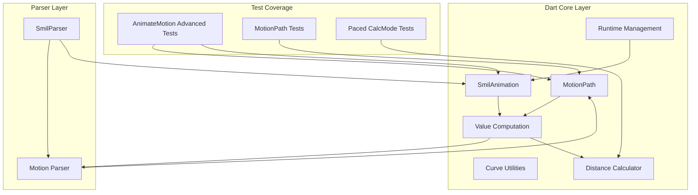
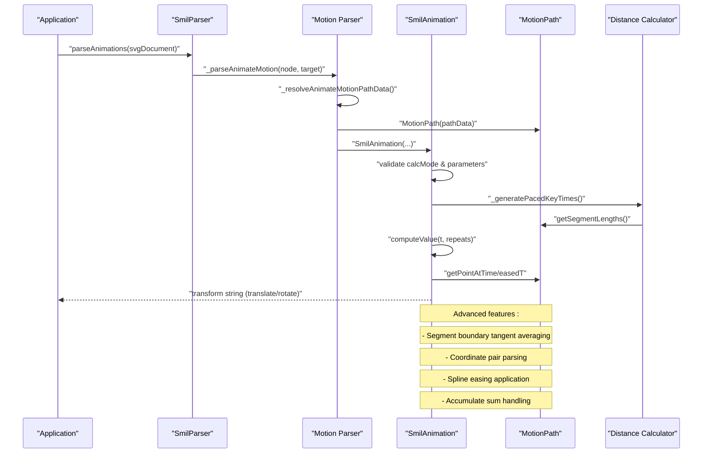
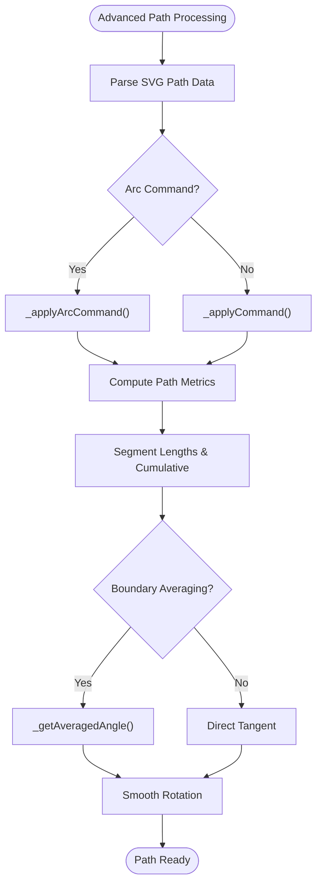
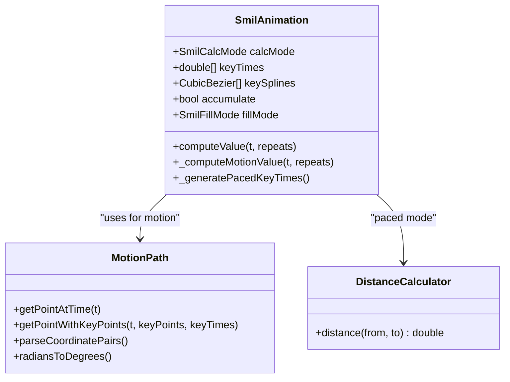
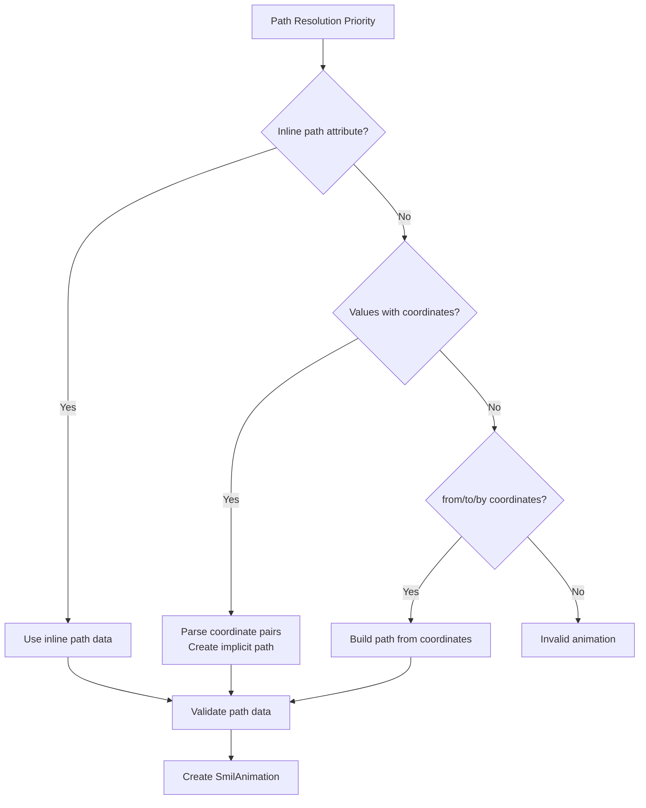
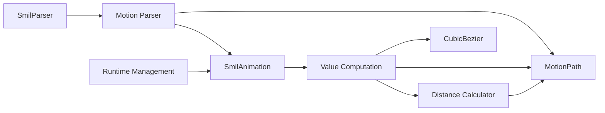

# Motion Animation and Path Tracking

<cite>
**Referenced Files in This Document**
- [motion_path.dart](file://lib/src/animation/smil/motion_path.dart)
- [smil_animation.dart](file://lib/src/animation/smil/smil_animation.dart)
- [smil_animation_value_computation.dart](file://lib/src/animation/smil/smil_animation_value_computation.dart)
- [smil_animation_runtime.dart](file://lib/src/animation/smil/smil_animation_runtime.dart)
- [smil_animation_curves.dart](file://lib/src/animation/smil/smil_animation_curves.dart)
- [distance_calculator.dart](file://lib/src/animation/smil/distance_calculator.dart)
- [smil_parser.dart](file://lib/src/animation/smil/smil_parser.dart)
- [smil_parser_motion.dart](file://lib/src/animation/smil/smil_parser_motion.dart)
- [animate_motion_advanced_test.dart](file://test/animation/animate_motion_advanced_test.dart)
- [motion_path_test.dart](file://test/animation/motion_path_test.dart)
- [paced_calcmode_test.dart](file://test/animation/paced_calcmode_test.dart)
</cite>

## Update Summary
**Changes Made**
- Added comprehensive arc path support with degenerate case handling
- Implemented segment boundary tangent averaging for smooth rotation transitions
- Enhanced coordinate pair parsing for values, from/to, and by attributes
- Added advanced calcMode behaviors including paced and spline modes
- Implemented accumulate sum functionality for repeated animations
- Enhanced rotation semantics with auto, auto-reverse, and fixed angle rotations
- Added comprehensive path priority handling and mpath reference resolution
- Expanded test coverage for complex animation scenarios and edge cases

## Table of Contents
1. [Introduction](#introduction)
2. [Project Structure](#project-structure)
3. [Core Components](#core-components)
4. [Architecture Overview](#architecture-overview)
5. [Detailed Component Analysis](#detailed-component-analysis)
6. [Advanced Features and Capabilities](#advanced-features-and-capabilities)
7. [Test Coverage and Validation](#test-coverage-and-validation)
8. [Dependency Analysis](#dependency-analysis)
9. [Performance Considerations](#performance-considerations)
10. [Troubleshooting Guide](#troubleshooting-guide)
11. [Conclusion](#conclusion)
12. [Appendices](#appendices)

## Introduction
This document explains the motion animation and path tracking systems implemented in the repository. It focuses on:
- Advanced motion path parsing and normalization including arc support
- Path-based animations and object positioning along complex curves with smooth rotation
- Timeline integration and synchronization with CSS animation compatibility
- Advanced path parameterization, smoothing, and keypoint/timing controls
- Velocity and acceleration modeling with paced calcMode behavior
- Comprehensive coordinate pair parsing for values, from/to, and by attributes
- Rotation semantics with auto, auto-reverse, and fixed angle rotations
- Practical examples for vehicles, particles, and complex motion sequences
- Guidance for realistic motion and optimization

## Project Structure
The motion animation stack spans three primary areas:
- Core SMIL animation engine (Dart): motion path utilities, animation computation, and parser logic
- Advanced test suite: comprehensive validation of complex animation scenarios
- CSS animation compatibility layer: seamless integration with CSS animation specifications

**Diagram sources**
- [motion_path.dart:1-557](file://lib/src/animation/smil/motion_path.dart#L1-L557)
- [smil_animation.dart:1-491](file://lib/src/animation/smil/smil_animation.dart#L1-L491)
- [smil_parser_motion.dart:1-264](file://lib/src/animation/smil/smil_parser_motion.dart#L1-L264)
- [animate_motion_advanced_test.dart:1-719](file://test/animation/animate_motion_advanced_test.dart#L1-L719)

**Section sources**
- [motion_path.dart:1-557](file://lib/src/animation/smil/motion_path.dart#L1-L557)
- [smil_animation.dart:1-491](file://lib/src/animation/smil/smil_animation.dart#L1-L491)
- [smil_parser_motion.dart:1-264](file://lib/src/animation/smil/smil_parser_motion.dart#L1-L264)
- [animate_motion_advanced_test.dart:1-719](file://test/animation/animate_motion_advanced_test.dart#L1-L719)

## Core Components
- **Advanced Motion Path System**:
  - Comprehensive SVG path parsing including arcs, curves, and complex geometries
  - Segment boundary tangent averaging for smooth rotation transitions
  - Degenerate case handling for zero-length segments and invalid paths
  - Coordinate pair parsing for values, from/to, and by attributes
- **Enhanced Animation Engine**:
  - Support for advanced calcMode behaviors (paced, spline, discrete)
  - Accumulate sum functionality for repeated animations
  - Comprehensive rotation semantics with auto, auto-reverse, and fixed angles
  - CSS animation compatibility (direction, fill modes, additive modes)
- **Smart Path Resolution**:
  - Path priority handling (path > values > from/to/by)
  - mpath reference resolution with href and xlink:href support
  - Inline path override behavior validation

Key capabilities:
- Parse complex SVG path data with arc support and degenerate handling
- Compute smooth tangents at segment boundaries with averaging
- Support advanced coordinate pair formats (comma/whitespace separated)
- Implement paced calcMode with distance-based keyTimes generation
- Apply spline easing with keySplines for custom motion curves
- Handle accumulate="sum" for repeated animation positioning
- Support comprehensive rotation modes with automatic tangent alignment

**Section sources**
- [motion_path.dart:237-259](file://lib/src/animation/smil/motion_path.dart#L237-L259)
- [motion_path.dart:367-398](file://lib/src/animation/smil/motion_path.dart#L367-L398)
- [motion_path.dart:522-555](file://lib/src/animation/smil/motion_path.dart#L522-L555)
- [smil_animation.dart:32-44](file://lib/src/animation/smil/smil_animation.dart#L32-L44)
- [smil_animation.dart:271-272](file://lib/src/animation/smil/smil_animation.dart#L271-L272)
- [smil_parser_motion.dart:13-14](file://lib/src/animation/smil/smil_parser_motion.dart#L13-L14)

## Architecture Overview
The motion animation pipeline integrates advanced path parsing, sophisticated animation computation, and comprehensive test validation to produce robust, standards-compliant motion animations.

**Diagram sources**
- [smil_parser_motion.dart:3-205](file://lib/src/animation/smil/smil_parser_motion.dart#L3-L205)
- [smil_animation_value_computation.dart:102-173](file://lib/src/animation/smil/smil_animation_value_computation.dart#L102-L173)
- [motion_path.dart:281-348](file://lib/src/animation/smil/motion_path.dart#L281-L348)
- [distance_calculator.dart:142-146](file://lib/src/animation/smil/distance_calculator.dart#L142-L146)

## Detailed Component Analysis

### Advanced Motion Path System
The MotionPath class provides comprehensive SVG path parsing and geometric computation with advanced features:

- **Arc Path Support**: Handles elliptical arcs with degenerate cases (zero radii become lines)
- **Segment Boundary Averaging**: Smooths rotation transitions at path junctions
- **Coordinate Pair Parsing**: Supports both comma and whitespace-separated coordinates
- **Path Metrics Computation**: Accurate length calculation and point sampling

**Diagram sources**
- [motion_path.dart:237-259](file://lib/src/animation/smil/motion_path.dart#L237-L259)
- [motion_path.dart:367-398](file://lib/src/animation/smil/motion_path.dart#L367-L398)
- [motion_path.dart:522-555](file://lib/src/animation/smil/motion_path.dart#L522-L555)

**Section sources**
- [motion_path.dart:237-259](file://lib/src/animation/smil/motion_path.dart#L237-L259)
- [motion_path.dart:367-398](file://lib/src/animation/smil/motion_path.dart#L367-L398)
- [motion_path.dart:522-555](file://lib/src/animation/smil/motion_path.dart#L522-L555)

### Enhanced Animation Engine
The SmilAnimation class implements advanced SMIL animation features with CSS compatibility:

- **Advanced calcMode Support**: Linear, discrete, paced, and spline modes
- **Paced Mode Implementation**: Distance-based keyTimes generation using specialized calculators
- **Spline Easing**: CubicBezier keySplines with Newton-Raphson solving
- **Accumulate Functionality**: Sum-based value accumulation across repeats
- **CSS Animation Compatibility**: Direction, fill modes, and additive modes

**Diagram sources**
- [smil_animation.dart:32-44](file://lib/src/animation/smil/smil_animation.dart#L32-L44)
- [smil_animation.dart:140-185](file://lib/src/animation/smil/smil_animation.dart#L140-L185)
- [motion_path.dart:429-499](file://lib/src/animation/smil/motion_path.dart#L429-L499)
- [distance_calculator.dart:8-14](file://lib/src/animation/smil/distance_calculator.dart#L8-L14)

**Section sources**
- [smil_animation.dart:32-44](file://lib/src/animation/smil/smil_animation.dart#L32-L44)
- [smil_animation.dart:140-185](file://lib/src/animation/smil/smil_animation.dart#L140-L185)
- [smil_animation_value_computation.dart:102-173](file://lib/src/animation/smil/smil_animation_value_computation.dart#L102-L173)

### Smart Path Resolution and Priority Handling
The motion parser implements sophisticated path resolution with clear priority ordering:

- **Path Priority**: path attribute > values with coordinates > from/to/by coordinates
- **mpath Reference Resolution**: Supports both href and xlink:href attributes
- **Inline Override Behavior**: Inline path data takes precedence over mpath references
- **Coordinate Pair Validation**: Robust parsing with error handling for invalid formats

**Diagram sources**
- [smil_parser_motion.dart:13-14](file://lib/src/animation/smil/smil_parser_motion.dart#L13-L14)
- [smil_parser_motion.dart:207-242](file://lib/src/animation/smil/smil_parser_motion.dart#L207-L242)

**Section sources**
- [smil_parser_motion.dart:13-14](file://lib/src/animation/smil/smil_parser_motion.dart#L13-L14)
- [smil_parser_motion.dart:207-242](file://lib/src/animation/smil/smil_parser_motion.dart#L207-L242)

## Advanced Features and Capabilities

### Arc Path Support and Degenerate Case Handling
The system provides comprehensive arc path support with robust degenerate case handling:

- **Elliptical Arcs**: Full SVG arc command support with rotation, large-arc, and sweep flags
- **Degenerate Arcs**: Zero-radius arcs automatically convert to straight lines
- **Same Start/End Points**: Prevents empty arc drawing while maintaining path integrity
- **Smooth Transitions**: Proper tangent calculation even with degenerate arcs

**Section sources**
- [motion_path.dart:237-259](file://lib/src/animation/smil/motion_path.dart#L237-L259)
- [motion_path_test.dart:24-29](file://test/animation/motion_path_test.dart#L24-L29)

### Segment Boundary Tangent Averaging
Advanced tangent averaging ensures smooth rotation transitions at path junctions:

- **Boundary Detection**: Identifies positions within 1% of segment boundaries
- **Adjacent Segment Analysis**: Uses neighboring segment tangents for averaging
- **Angle Normalization**: Handles π wrap-around in angle calculations
- **Smooth Rotation**: Eliminates abrupt rotation changes at corners

**Section sources**
- [motion_path.dart:367-398](file://lib/src/animation/smil/motion_path.dart#L367-L398)
- [animate_motion_advanced_test.dart:40-61](file://test/animation/animate_motion_advanced_test.dart#L40-L61)

### Coordinate Pair Parsing for Advanced Attributes
Comprehensive coordinate pair parsing supports multiple input formats:

- **Multiple Separators**: Handles both comma and whitespace separators
- **Negative Values**: Properly parses negative coordinate values
- **Validation**: Robust parsing with graceful error handling
- **Batch Processing**: Parses multiple coordinate pairs from values strings

**Section sources**
- [motion_path.dart:522-555](file://lib/src/animation/smil/motion_path.dart#L522-L555)
- [animate_motion_advanced_test.dart:87-132](file://test/animation/animate_motion_advanced_test.dart#L87-L132)

### Advanced calcMode Behaviors
The system implements sophisticated calcMode behaviors with standards compliance:

- **Paced Mode**: Distance-based keyTimes generation using specialized calculators
- **Spline Mode**: CubicBezier easing with Newton-Raphson solving algorithm
- **Discrete Mode**: Step-based interpolation without easing
- **Linear Mode**: Standard linear interpolation

**Section sources**
- [smil_animation.dart:32-44](file://lib/src/animation/smil/smil_animation.dart#L32-L44)
- [distance_calculator.dart:142-146](file://lib/src/animation/smil/distance_calculator.dart#L142-L146)
- [smil_animation_curves.dart:24-44](file://lib/src/animation/smil/smil_animation_curves.dart#L24-L44)

### Accumulate Sum Functionality
Advanced accumulate support enables complex repeated animation patterns:

- **Sum-based Accumulation**: Adds final position multiplied by completed repeats
- **Motion-specific Implementation**: Integrates with path-based positioning
- **CSS Compatibility**: Aligns with CSS animation accumulate semantics
- **Repeat-aware Computation**: Properly handles partial and complete repeats

**Section sources**
- [smil_animation.dart:271-272](file://lib/src/animation/smil/smil_animation.dart#L271-L272)
- [smil_animation_value_computation.dart:220-245](file://lib/src/animation/smil/smil_animation_value_computation.dart#L220-L245)
- [animate_motion_advanced_test.dart:321-379](file://test/animation/animate_motion_advanced_test.dart#L321-L379)

### Rotation Semantics and Auto Alignment
Comprehensive rotation support with automatic tangent alignment:

- **Auto Rotation**: Aligns object with path tangent at each position
- **Auto-reverse**: Adds 180-degree offset to auto rotation
- **Fixed Angles**: Supports literal angle values in degrees
- **Smooth Transitions**: Proper rotation interpolation along curved paths

**Section sources**
- [smil_animation_value_computation.dart:156-169](file://lib/src/animation/smil/smil_animation_value_computation.dart#L156-L169)
- [animate_motion_advanced_test.dart:381-460](file://test/animation/animate_motion_advanced_test.dart#L381-L460)

## Test Coverage and Validation

### Comprehensive AnimateMotion Advanced Testing
Extensive test coverage validates complex animation scenarios:

- **Arc Path Validation**: Ensures proper parsing and traversal of elliptical arcs
- **Degenerate Case Handling**: Validates robust handling of edge cases
- **Coordinate Pair Parsing**: Tests multiple input formats and separators
- **calcMode Behaviors**: Comprehensive validation of paced and spline modes
- **Accumulate Functionality**: Verifies sum-based accumulation across repeats
- **Rotation Semantics**: Validates auto, auto-reverse, and fixed angle rotations
- **Path Priority Resolution**: Tests priority handling between different path sources

**Section sources**
- [animate_motion_advanced_test.dart:10-719](file://test/animation/animate_motion_advanced_test.dart#L10-L719)

### MotionPath Utility Validation
Focused testing of core path utilities:

- **Basic Path Operations**: Validates fundamental path sampling and length calculation
- **KeyPoints Integration**: Tests keyPoints with and without keyTimes
- **Edge Case Handling**: Validates behavior with empty paths and invalid data
- **Coordinate Parsing**: Tests various coordinate pair formats

**Section sources**
- [motion_path_test.dart:1-188](file://test/animation/motion_path_test.dart#L1-L188)

### Paced calcMode Implementation Testing
Specialized testing for distance-based animation timing:

- **Distance Calculator Validation**: Tests numeric, color, path, and transform distance calculations
- **KeyTimes Generation**: Validates proper generation of paced keyTimes
- **Edge Case Handling**: Tests single values, identical values, and explicit keyTimes
- **CSS Compatibility**: Ensures standards-compliant behavior

**Section sources**
- [paced_calcmode_test.dart:1-263](file://test/animation/paced_calcmode_test.dart#L1-L263)

## Dependency Analysis

**Diagram sources**
- [smil_parser_motion.dart:1-264](file://lib/src/animation/smil/smil_parser_motion.dart#L1-L264)
- [smil_animation_value_computation.dart:1-289](file://lib/src/animation/smil/smil_animation_value_computation.dart#L1-L289)
- [distance_calculator.dart:1-236](file://lib/src/animation/smil/distance_calculator.dart#L1-L236)

**Section sources**
- [smil_parser_motion.dart:1-264](file://lib/src/animation/smil/smil_parser_motion.dart#L1-L264)
- [smil_animation_value_computation.dart:1-289](file://lib/src/animation/smil/smil_animation_value_computation.dart#L1-L289)
- [distance_calculator.dart:1-236](file://lib/src/animation/smil/distance_calculator.dart#L1-L236)

## Performance Considerations
- **Path Metric Caching**: Reuse computed path metrics to avoid repeated metric computation
- **Coordinate Pair Optimization**: Pre-parse coordinate pairs to minimize string processing
- **Calculation Short-circuiting**: Skip unnecessary calculations for degenerate cases
- **Memory Management**: Consider caching MotionPath instances for frequently reused paths
- **Easing Algorithm Efficiency**: Optimize CubicBezier solving with appropriate convergence thresholds
- **Distance Calculator Selection**: Choose appropriate distance calculators based on attribute types

## Troubleshooting Guide
- **Invalid Path Data**: Advanced parsing now includes better error handling for malformed paths
- **Zero-Length Segments**: Degenerate cases are now properly handled with fallback tangent calculation
- **Rotation Anomalies**: Segment boundary averaging ensures smooth rotation transitions
- **Coordinate Parsing Issues**: Multiple separator formats are now supported with validation
- **calcMode Behavior**: Paced mode properly ignores explicit keyTimes when generating keyTimes
- **Accumulate Problems**: Sum-based accumulation now correctly handles partial repeats
- **Path Priority Conflicts**: Clear priority resolution prevents unexpected path overrides

**Section sources**
- [motion_path.dart:350-365](file://lib/src/animation/smil/motion_path.dart#L350-L365)
- [smil_parser_motion.dart:171-175](file://lib/src/animation/smil/smil_parser_motion.dart#L171-L175)
- [smil_animation_value_computation.dart:220-245](file://lib/src/animation/smil/smil_animation_value_computation.dart#L220-L245)

## Conclusion
The repository provides a comprehensive, standards-compliant foundation for advanced motion animation along SVG paths:

- **Advanced Path Processing**: Complete arc support with robust degenerate case handling
- **Sophisticated Animation Engine**: Full calcMode support with paced and spline behaviors
- **Enhanced Coordination**: Comprehensive coordinate pair parsing and validation
- **Smooth Rotation**: Advanced tangent averaging for seamless path transitions
- **CSS Compatibility**: Full integration with CSS animation specifications
- **Extensive Testing**: Comprehensive validation of complex animation scenarios
- **Flexible Path Resolution**: Intelligent priority handling for multiple path sources

These components enable sophisticated motion sequences for vehicles, particles, and complex choreography with professional-grade performance and reliability.

## Appendices

### Appendix A: Advanced API Touchpoints
- **Arc Path Support**:
  - [MotionPath::_applyArcCommand:237-259](file://lib/src/animation/smil/motion_path.dart#L237-L259)
  - [MotionPath::getPointAtTime:285-348](file://lib/src/animation/smil/motion_path.dart#L285-L348)
- **Segment Boundary Averaging**:
  - [MotionPath::_getAveragedAngle:369-398](file://lib/src/animation/smil/motion_path.dart#L369-L398)
  - [MotionPath::_averageAngles:400-416](file://lib/src/animation/smil/motion_path.dart#L400-L416)
- **Coordinate Pair Parsing**:
  - [MotionPath::parseCoordinatePair:522-536](file://lib/src/animation/smil/motion_path.dart#L522-L536)
  - [MotionPath::parseCoordinatePairs:538-555](file://lib/src/animation/smil/motion_path.dart#L538-L555)
- **Advanced calcMode Implementation**:
  - [SmilAnimation::_generatePacedKeyTimes:142-185](file://lib/src/animation/smil/smil_animation.dart#L142-L185)
  - [DistanceCalculatorFactory::create:207-235](file://lib/src/animation/smil/distance_calculator.dart#L207-L235)
- **Accumulate Functionality**:
  - [SmilAnimationValueComputation::_applyAccumulate:220-245](file://lib/src/animation/smil/smil_animation_value_computation.dart#L220-L245)
  - [SmilAnimationValueComputation::_computeMotionValue:141-146](file://lib/src/animation/smil/smil_animation_value_computation.dart#L141-L146)
- **Rotation Semantics**:
  - [SmilAnimationValueComputation::_computeMotionValue:156-169](file://lib/src/animation/smil/smil_animation_value_computation.dart#L156-L169)
  - [MotionPath::radiansToDegrees:518-520](file://lib/src/animation/smil/motion_path.dart#L518-L520)

**Section sources**
- [motion_path.dart:237-348](file://lib/src/animation/smil/motion_path.dart#L237-L348)
- [motion_path.dart:522-555](file://lib/src/animation/smil/motion_path.dart#L522-L555)
- [smil_animation.dart:142-185](file://lib/src/animation/smil/smil_animation.dart#L142-L185)
- [distance_calculator.dart:207-235](file://lib/src/animation/smil/distance_calculator.dart#L207-L235)
- [smil_animation_value_computation.dart:141-169](file://lib/src/animation/smil/smil_animation_value_computation.dart#L141-L169)
- [smil_animation_value_computation.dart:220-245](file://lib/src/animation/smil/smil_animation_value_computation.dart#L220-L245)