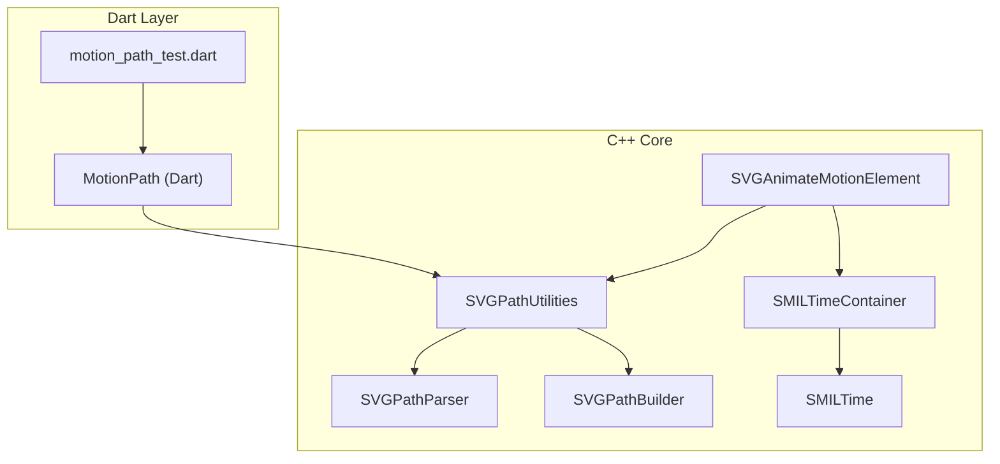
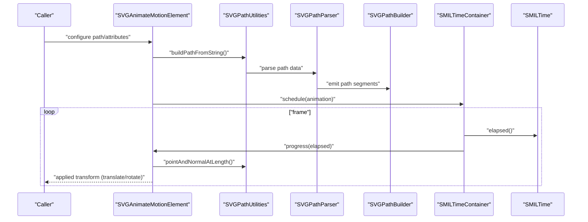
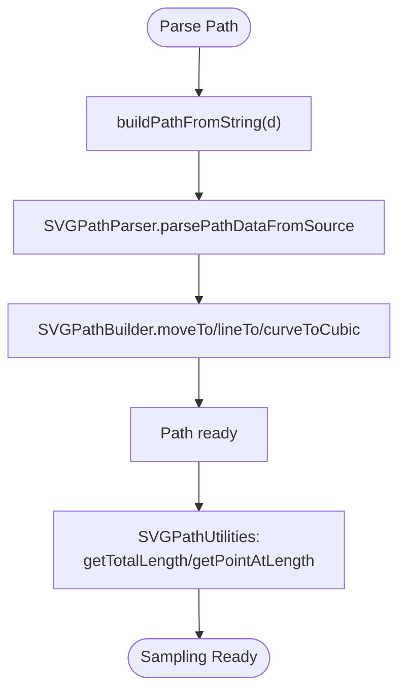
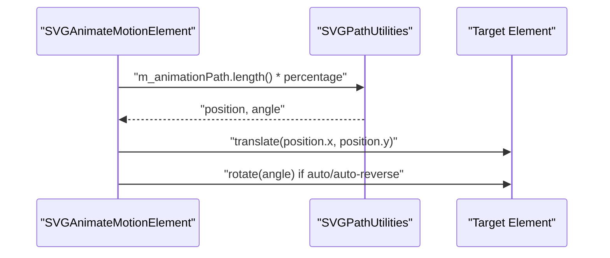
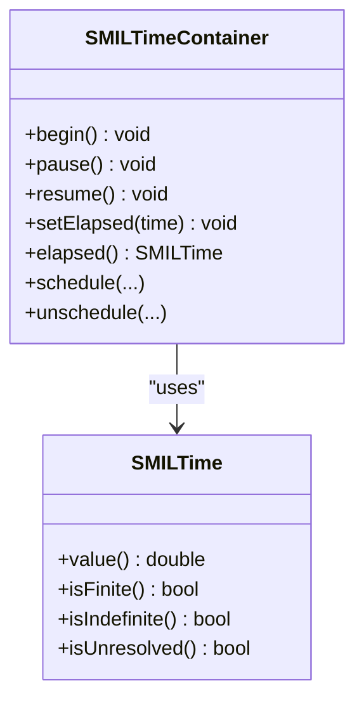
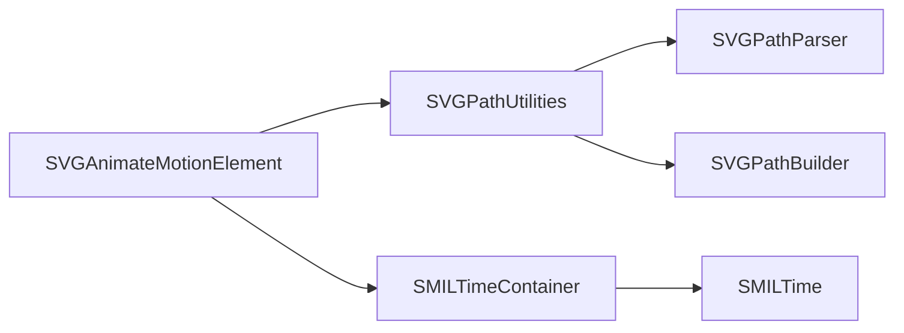

# Motion Animation and Path Tracking

<cite>
**Referenced Files in This Document**
- [SVGAnimateMotionElement.cpp](file://blink-b87d44f-Source-core-svg/SVGAnimateMotionElement.cpp)
- [SVGAnimateMotionElement.h](file://blink-b87d44f-Source-core-svg/SVGAnimateMotionElement.h)
- [SVGPathUtilities.cpp](file://blink-b87d44f-Source-core-svg/SVGPathUtilities.cpp)
- [SVGPathUtilities.h](file://blink-b87d44f-Source-core-svg/SVGPathUtilities.h)
- [SVGPathParser.cpp](file://blink-b87d44f-Source-core-svg/SVGPathParser.cpp)
- [SVGPathParser.h](file://blink-b87d44f-Source-core-svg/SVGPathParser.h)
- [SVGPathBuilder.cpp](file://blink-b87d44f-Source-core-svg/SVGPathBuilder.cpp)
- [SVGPathBuilder.h](file://blink-b87d44f-Source-core-svg/SVGPathBuilder.h)
- [SMILTime.cpp](file://blink-b87d44f-Source-core-svg/animation/SMILTime.cpp)
- [SMILTime.h](file://blink-b87d44f-Source-core-svg/animation/SMILTime.h)
- [SMILTimeContainer.cpp](file://blink-b87d44f-Source-core-svg/animation/SMILTimeContainer.cpp)
- [SMILTimeContainer.h](file://blink-b87d44f-Source-core-svg/animation/SMILTimeContainer.h)
- [motion_path_test.dart](file://test/animation/motion_path_test.dart)
</cite>

## Table of Contents
1. [Introduction](#introduction)
2. [Project Structure](#project-structure)
3. [Core Components](#core-components)
4. [Architecture Overview](#architecture-overview)
5. [Detailed Component Analysis](#detailed-component-analysis)
6. [Dependency Analysis](#dependency-analysis)
7. [Performance Considerations](#performance-considerations)
8. [Troubleshooting Guide](#troubleshooting-guide)
9. [Conclusion](#conclusion)
10. [Appendices](#appendices)

## Introduction
This document explains the motion animation and path tracking systems implemented in the repository. It focuses on:
- Motion path parsing and normalization
- Path-based animations and object positioning along complex curves
- Timeline integration and synchronization
- Path parameterization, smoothing, and keypoint/timing controls
- Velocity and acceleration modeling
- Practical examples for vehicles, particles, and complex motion sequences
- Guidance for realistic motion and optimization

## Project Structure
The motion animation stack spans two primary areas:
- Core SVG engine (C++): path parsing, path utilities, and SMIL time containers
- Dart test layer: motion path model and tests validating path sampling, angles, keypoints, and timing

**Diagram sources**
- [SVGAnimateMotionElement.cpp:1-351](file://blink-b87d44f-Source-core-svg/SVGAnimateMotionElement.cpp#L1-L351)
- [SVGPathUtilities.cpp:1-333](file://blink-b87d44f-Source-core-svg/SVGPathUtilities.cpp#L1-L333)
- [SVGPathParser.cpp:1-496](file://blink-b87d44f-Source-core-svg/SVGPathParser.cpp#L1-L496)
- [SVGPathBuilder.cpp:1-71](file://blink-b87d44f-Source-core-svg/SVGPathBuilder.cpp#L1-L71)
- [SMILTime.cpp:1-66](file://blink-b87d44f-Source-core-svg/animation/SMILTime.cpp#L1-L66)
- [SMILTimeContainer.cpp:1-332](file://blink-b87d44f-Source-core-svg/animation/SMILTimeContainer.cpp#L1-L332)
- [motion_path_test.dart:1-189](file://test/animation/motion_path_test.dart#L1-L189)

**Section sources**
- [SVGAnimateMotionElement.cpp:1-351](file://blink-b87d44f-Source-core-svg/SVGAnimateMotionElement.cpp#L1-L351)
- [SVGPathUtilities.cpp:1-333](file://blink-b87d44f-Source-core-svg/SVGPathUtilities.cpp#L1-L333)
- [SVGPathParser.cpp:1-496](file://blink-b87d44f-Source-core-svg/SVGPathParser.cpp#L1-L496)
- [SVGPathBuilder.cpp:1-71](file://blink-b87d44f-Source-core-svg/SVGPathBuilder.cpp#L1-L71)
- [SMILTime.cpp:1-66](file://blink-b87d44f-Source-core-svg/animation/SMILTime.cpp#L1-L66)
- [SMILTimeContainer.cpp:1-332](file://blink-b87d44f-Source-core-svg/animation/SMILTimeContainer.cpp#L1-L332)
- [motion_path_test.dart:1-189](file://test/animation/motion_path_test.dart#L1-L189)

## Core Components
- Motion path parsing and utilities:
  - Path parsing from SVG path strings into a normalized representation
  - Length computation, point-at-length sampling, and segment indexing
- Motion animation element:
  - Applies translation and optional rotation along a path
  - Supports “auto” and “auto-reverse” rotation modes
- Timeline and synchronization:
  - SMIL time container manages scheduling, pausing, resuming, and seeking
  - Provides per-frame updates and priority sorting of animations

Key capabilities:
- Parse SVG path data (moveto, lineto, curveto, arcto, closepath)
- Normalize coordinates and convert arcs to cubic Beziers
- Compute total length and sample positions/angles along the path
- Drive object transforms for motion animation with rotation

**Section sources**
- [SVGPathUtilities.cpp:110-333](file://blink-b87d44f-Source-core-svg/SVGPathUtilities.cpp#L110-L333)
- [SVGPathParser.cpp:284-496](file://blink-b87d44f-Source-core-svg/SVGPathParser.cpp#L284-L496)
- [SVGPathBuilder.cpp:36-71](file://blink-b87d44f-Source-core-svg/SVGPathBuilder.cpp#L36-L71)
- [SVGAnimateMotionElement.cpp:121-351](file://blink-b87d44f-Source-core-svg/SVGAnimateMotionElement.cpp#L121-L351)
- [SMILTimeContainer.cpp:107-332](file://blink-b87d44f-Source-core-svg/animation/SMILTimeContainer.cpp#L107-L332)
- [SMILTime.cpp:34-66](file://blink-b87d44f-Source-core-svg/animation/SMILTime.cpp#L34-L66)

## Architecture Overview
The motion animation pipeline integrates path parsing, path utilities, and SMIL timing to produce smooth, synchronized motion.

**Diagram sources**
- [SVGAnimateMotionElement.cpp:104-351](file://blink-b87d44f-Source-core-svg/SVGAnimateMotionElement.cpp#L104-L351)
- [SVGPathUtilities.cpp:110-333](file://blink-b87d44f-Source-core-svg/SVGPathUtilities.cpp#L110-L333)
- [SVGPathParser.cpp:284-496](file://blink-b87d44f-Source-core-svg/SVGPathParser.cpp#L284-L496)
- [SVGPathBuilder.cpp:36-71](file://blink-b87d44f-Source-core-svg/SVGPathBuilder.cpp#L36-L71)
- [SMILTimeContainer.cpp:262-332](file://blink-b87d44f-Source-core-svg/animation/SMILTimeContainer.cpp#L262-L332)
- [SMILTime.cpp:34-66](file://blink-b87d44f-Source-core-svg/animation/SMILTime.cpp#L34-L66)

## Detailed Component Analysis

### Motion Path Parsing and Utilities
- Path parsing:
  - Converts SVG path strings into a normalized Path representation
  - Handles absolute vs relative coordinates and normalizes arcs to cubic Beziers
- Path utilities:
  - Build from string/byte-stream, serialize, blend, add, and compute metrics
  - Provide total length, point-at-length, and segment-at-length queries

**Diagram sources**
- [SVGPathUtilities.cpp:110-122](file://blink-b87d44f-Source-core-svg/SVGPathUtilities.cpp#L110-L122)
- [SVGPathParser.cpp:284-397](file://blink-b87d44f-Source-core-svg/SVGPathParser.cpp#L284-L397)
- [SVGPathBuilder.cpp:36-62](file://blink-b87d44f-Source-core-svg/SVGPathBuilder.cpp#L36-L62)
- [SVGPathUtilities.cpp:298-330](file://blink-b87d44f-Source-core-svg/SVGPathUtilities.cpp#L298-L330)

**Section sources**
- [SVGPathParser.cpp:284-496](file://blink-b87d44f-Source-core-svg/SVGPathParser.cpp#L284-L496)
- [SVGPathBuilder.cpp:36-71](file://blink-b87d44f-Source-core-svg/SVGPathBuilder.cpp#L36-L71)
- [SVGPathUtilities.cpp:110-333](file://blink-b87d44f-Source-core-svg/SVGPathUtilities.cpp#L110-L333)

### Path-Based Motion Animation
- Animation element:
  - Supports path-based motion with “auto/auto-reverse” rotation modes
  - Computes position and tangent angle at a given path length
  - Applies translation and optional rotation to the target element’s transform
- Path parameterization:
  - Percentage mapped to path length
  - Accumulation across repeats supported

**Diagram sources**
- [SVGAnimateMotionElement.cpp:243-297](file://blink-b87d44f-Source-core-svg/SVGAnimateMotionElement.cpp#L243-L297)
- [SVGPathUtilities.cpp:298-330](file://blink-b87d44f-Source-core-svg/SVGPathUtilities.cpp#L298-L330)

**Section sources**
- [SVGAnimateMotionElement.cpp:121-351](file://blink-b87d44f-Source-core-svg/SVGAnimateMotionElement.cpp#L121-L351)

### Timeline Integration and Synchronization
- SMIL time container:
  - Tracks begin/pause/resume/seek and schedules per-frame updates
  - Sorts animations by priority and notifies timers
- Time arithmetic:
  - Specialized time values for unresolved/indefinite
  - Operators for addition/subtraction/multiplication

**Diagram sources**
- [SMILTime.cpp:34-66](file://blink-b87d44f-Source-core-svg/animation/SMILTime.cpp#L34-L66)
- [SMILTimeContainer.cpp:107-332](file://blink-b87d44f-Source-core-svg/animation/SMILTimeContainer.cpp#L107-L332)

**Section sources**
- [SMILTime.cpp:34-66](file://blink-b87d44f-Source-core-svg/animation/SMILTime.cpp#L34-L66)
- [SMILTimeContainer.cpp:107-332](file://blink-b87d44f-Source-core-svg/animation/SMILTimeContainer.cpp#L107-L332)

### Path Smoothing, Velocity, and Acceleration
- Smoothing:
  - Arcs are decomposed into cubic Beziers for consistent curvature
  - Path normalization ensures predictable sampling
- Velocity:
  - Uniform parameterization by arc length yields constant-speed motion along the path
- Acceleration/deceleration:
  - Not directly exposed in the core; achieved via keypoint/timing mapping in higher-level APIs (see Dart MotionPath tests)

**Section sources**
- [SVGPathParser.cpp:412-493](file://blink-b87d44f-Source-core-svg/SVGPathParser.cpp#L412-L493)
- [SVGPathUtilities.cpp:298-330](file://blink-b87d44f-Source-core-svg/SVGPathUtilities.cpp#L298-L330)
- [motion_path_test.dart:113-168](file://test/animation/motion_path_test.dart#L113-L168)

### Examples and Use Cases
- Vehicle animation:
  - Define a path (straight, curved, or complex) and animate a vehicle shape along it
  - Use “auto” rotation to align the vehicle with the path tangent
- Particle systems:
  - Emit particles at varying key times along a shared path
  - Control spawn rates and offsets via keypoint/timing arrays
- Complex motion sequences:
  - Chain multiple paths and rotations
  - Combine with other SMIL animations (translation, scaling, opacity)

[No sources needed since this section provides general guidance]

## Dependency Analysis

**Diagram sources**
- [SVGAnimateMotionElement.cpp:104-351](file://blink-b87d44f-Source-core-svg/SVGAnimateMotionElement.cpp#L104-L351)
- [SVGPathUtilities.cpp:110-333](file://blink-b87d44f-Source-core-svg/SVGPathUtilities.cpp#L110-L333)
- [SVGPathParser.cpp:284-496](file://blink-b87d44f-Source-core-svg/SVGPathParser.cpp#L284-L496)
- [SVGPathBuilder.cpp:36-71](file://blink-b87d44f-Source-core-svg/SVGPathBuilder.cpp#L36-L71)
- [SMILTimeContainer.cpp:262-332](file://blink-b87d44f-Source-core-svg/animation/SMILTimeContainer.cpp#L262-L332)
- [SMILTime.cpp:34-66](file://blink-b87d44f-Source-core-svg/animation/SMILTime.cpp#L34-L66)

**Section sources**
- [SVGAnimateMotionElement.cpp:104-351](file://blink-b87d44f-Source-core-svg/SVGAnimateMotionElement.cpp#L104-L351)
- [SVGPathUtilities.cpp:110-333](file://blink-b87d44f-Source-core-svg/SVGPathUtilities.cpp#L110-L333)
- [SVGPathParser.cpp:284-496](file://blink-b87d44f-Source-core-svg/SVGPathParser.cpp#L284-L496)
- [SVGPathBuilder.cpp:36-71](file://blink-b87d44f-Source-core-svg/SVGPathBuilder.cpp#L36-L71)
- [SMILTimeContainer.cpp:262-332](file://blink-b87d44f-Source-core-svg/animation/SMILTimeContainer.cpp#L262-L332)
- [SMILTime.cpp:34-66](file://blink-b87d44f-Source-core-svg/animation/SMILTime.cpp#L34-L66)

## Performance Considerations
- Prefer normalized paths for consistent sampling and reduced recomputation
- Cache path metrics (length, point samples) when repeatedly queried
- Minimize repeated parsing by reusing parsed Path objects
- Use keypoint/timing mapping to avoid expensive per-frame computations for non-uniform motion
- Batch animation updates via the SMIL time container to reduce overhead

[No sources needed since this section provides general guidance]

## Troubleshooting Guide
- Invalid path data:
  - Parsing failures return safe defaults; verify path strings and ensure proper SVG syntax
- Zero-length paths:
  - Sampling returns neutral positions/angles; confirm path construction
- Rotation anomalies:
  - “auto-reverse” flips the angle by 180 degrees; ensure intended orientation
- Timing inconsistencies:
  - Confirm begin/pause/resume/seek operations and elapsed time calculations

**Section sources**
- [SVGPathUtilities.cpp:110-122](file://blink-b87d44f-Source-core-svg/SVGPathUtilities.cpp#L110-L122)
- [SVGAnimateMotionElement.cpp:291-297](file://blink-b87d44f-Source-core-svg/SVGAnimateMotionElement.cpp#L291-L297)
- [SMILTimeContainer.cpp:171-207](file://blink-b87d44f-Source-core-svg/animation/SMILTimeContainer.cpp#L171-L207)

## Conclusion
The repository provides a robust foundation for motion animation along SVG paths:
- A complete path parsing and normalization pipeline
- A motion animation element supporting translation and rotation
- A SMIL time container enabling precise timeline integration and synchronization
- Test coverage validating path sampling, angles, and keypoint/timing mapping

These components enable realistic motion sequences for vehicles, particles, and complex choreography, with clear paths for optimization and extension.

[No sources needed since this section summarizes without analyzing specific files]

## Appendices

### Appendix A: Key Concepts and API Touchpoints
- Path parsing and normalization:
  - [buildPathFromString:110-122](file://blink-b87d44f-Source-core-svg/SVGPathUtilities.cpp#L110-L122)
  - [SVGPathParser::parsePathDataFromSource:284-397](file://blink-b87d44f-Source-core-svg/SVGPathParser.cpp#L284-L397)
  - [SVGPathBuilder:36-71](file://blink-b87d44f-Source-core-svg/SVGPathBuilder.cpp#L36-L71)
- Path metrics and sampling:
  - [getTotalLengthOfSVGPathByteStream:298-313](file://blink-b87d44f-Source-core-svg/SVGPathUtilities.cpp#L298-L313)
  - [getPointAtLengthOfSVGPathByteStream:315-330](file://blink-b87d44f-Source-core-svg/SVGPathUtilities.cpp#L315-L330)
- Motion animation:
  - [SVGAnimateMotionElement::calculateAnimatedValue:243-297](file://blink-b87d44f-Source-core-svg/SVGAnimateMotionElement.cpp#L243-L297)
  - [SVGAnimateMotionElement::updateAnimationPath:133-154](file://blink-b87d44f-Source-core-svg/SVGAnimateMotionElement.cpp#L133-L154)
- Timeline:
  - [SMILTimeContainer::updateAnimations:262-329](file://blink-b87d44f-Source-core-svg/animation/SMILTimeContainer.cpp#L262-L329)
  - [SMILTime:34-66](file://blink-b87d44f-Source-core-svg/animation/SMILTime.cpp#L34-L66)

**Section sources**
- [SVGPathUtilities.cpp:110-333](file://blink-b87d44f-Source-core-svg/SVGPathUtilities.cpp#L110-L333)
- [SVGPathParser.cpp:284-496](file://blink-b87d44f-Source-core-svg/SVGPathParser.cpp#L284-L496)
- [SVGPathBuilder.cpp:36-71](file://blink-b87d44f-Source-core-svg/SVGPathBuilder.cpp#L36-L71)
- [SVGAnimateMotionElement.cpp:133-297](file://blink-b87d44f-Source-core-svg/SVGAnimateMotionElement.cpp#L133-L297)
- [SMILTimeContainer.cpp:262-329](file://blink-b87d44f-Source-core-svg/animation/SMILTimeContainer.cpp#L262-L329)
- [SMILTime.cpp:34-66](file://blink-b87d44f-Source-core-svg/animation/SMILTime.cpp#L34-L66)