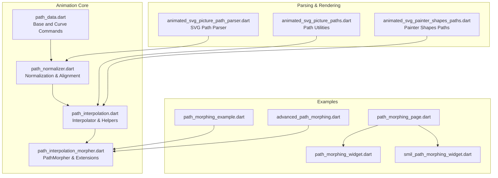
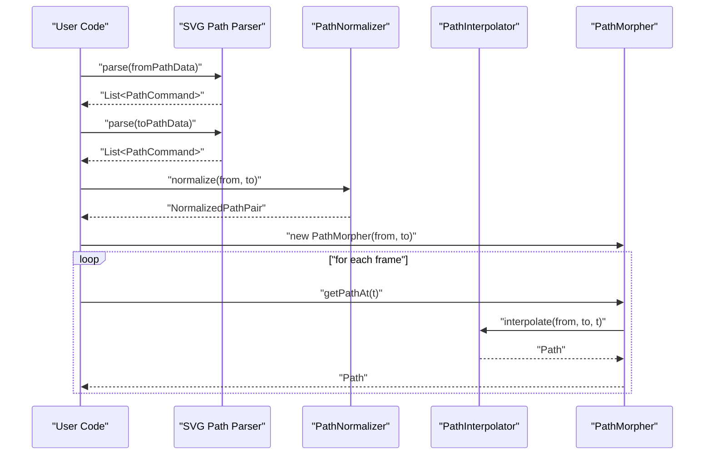
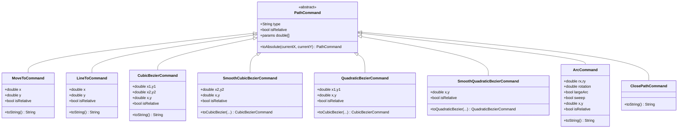
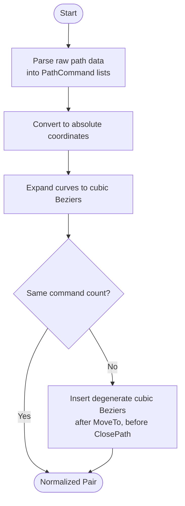
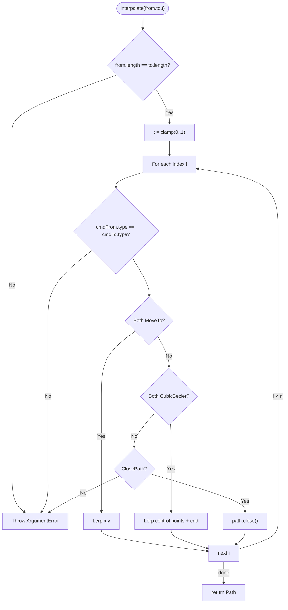
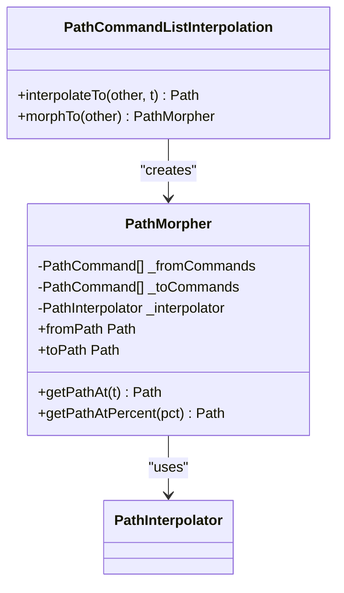
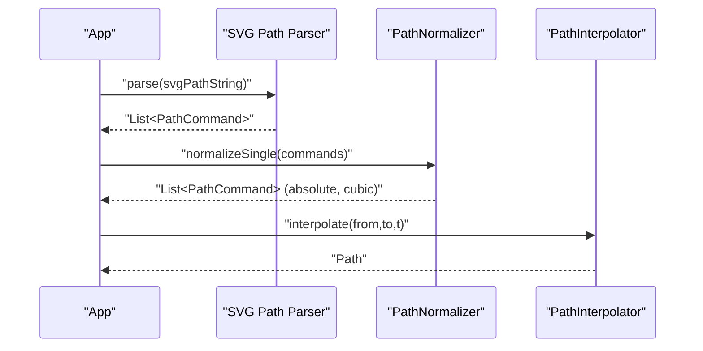
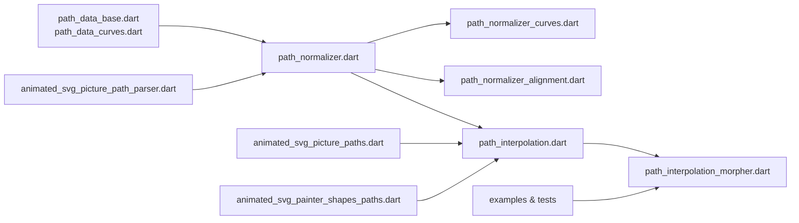

# Path Morphing and Shape Interpolation

<cite>
**Referenced Files in This Document**
- [svg.dart](file://lib/svg.dart)
- [path_interpolation.dart](file://lib/src/animation/path_interpolation.dart)
- [path_interpolation_morpher.dart](file://lib/src/animation/path_interpolation_morpher.dart)
- [path_normalizer.dart](file://lib/src/animation/path_normalizer.dart)
- [path_normalizer_alignment.dart](file://lib/src/animation/path_normalizer_alignment.dart)
- [path_normalizer_curves.dart](file://lib/src/animation/path_normalizer_curves.dart)
- [path_data.dart](file://lib/src/animation/path_data.dart)
- [path_data_base.dart](file://lib/src/animation/path_data_base.dart)
- [path_data_curves.dart](file://lib/src/animation/path_data_curves.dart)
- [animated_svg_picture_paths.dart](file://lib/src/animation/animated_svg_picture_paths.dart)
- [animated_svg_picture_path_parser.dart](file://lib/src/animation/animated_svg_picture_path_parser.dart)
- [animated_svg_painter_shapes_paths.dart](file://lib/src/animation/animated_svg_painter_shapes_paths.dart)
- [path_morphing_example.dart](file://example/lib/path_morphing_example.dart)
- [advanced_path_morphing.dart](file://example/lib/advanced_path_morphing.dart)
- [path_morphing_page.dart](file://example/lib/pages/path_morphing_page.dart)
- [path_morphing_widget.dart](file://example/lib/widgets/path_morphing_widget.dart)
- [smil_path_morphing_widget.dart](file://example/lib/widgets/smil_path_morphing_widget.dart)
- [path_morphing_test.dart](file://test/animation/path_morphing_test.dart)
- [path_morphing_correctness_test.dart](file://test/animation/path_morphing_correctness_test.dart)
- [smil_path_morphing_integration_test.dart](file://test/animation/smil_path_morphing_integration_test.dart)
</cite>

## Table of Contents
1. [Introduction](#introduction)
2. [Project Structure](#project-structure)
3. [Core Components](#core-components)
4. [Architecture Overview](#architecture-overview)
5. [Detailed Component Analysis](#detailed-component-analysis)
6. [Dependency Analysis](#dependency-analysis)
7. [Performance Considerations](#performance-considerations)
8. [Troubleshooting Guide](#troubleshooting-guide)
9. [Conclusion](#conclusion)
10. [Appendices](#appendices)

## Introduction
This document explains the path morphing and shape interpolation capabilities implemented in the project. It covers the path data model, SVG path parsing pipeline, normalization and alignment strategies, curve interpolation techniques, and the animation pipeline that produces smooth transitions between arbitrary SVG shapes. Practical guidance is provided for creating fluid animations, optimizing interpolation calculations, and understanding the mathematical foundations and limitations of the morphing system.

## Project Structure
The path morphing system is primarily implemented under the animation module. Key areas include:
- Path data representation and command abstractions
- Path normalization and alignment
- Curve conversion utilities
- Interpolation engine and morpher helpers
- Example widgets and tests demonstrating morphing

**Diagram sources**
- [path_data.dart:1-9](file://lib/src/animation/path_data.dart#L1-L9)
- [path_normalizer.dart:1-56](file://lib/src/animation/path_normalizer.dart#L1-L56)
- [path_interpolation.dart:1-96](file://lib/src/animation/path_interpolation.dart#L1-L96)
- [path_interpolation_morpher.dart:1-53](file://lib/src/animation/path_interpolation_morpher.dart#L1-L53)
- [animated_svg_picture_path_parser.dart](file://lib/src/animation/animated_svg_picture_path_parser.dart)
- [animated_svg_picture_paths.dart](file://lib/src/animation/animated_svg_picture_paths.dart)
- [animated_svg_painter_shapes_paths.dart](file://lib/src/animation/animated_svg_painter_shapes_paths.dart)
- [path_morphing_example.dart](file://example/lib/path_morphing_example.dart)
- [advanced_path_morphing.dart](file://example/lib/advanced_path_morphing.dart)
- [path_morphing_page.dart](file://example/lib/pages/path_morphing_page.dart)
- [path_morphing_widget.dart](file://example/lib/widgets/path_morphing_widget.dart)
- [smil_path_morphing_widget.dart](file://example/lib/widgets/smil_path_morphing_widget.dart)

**Section sources**
- [path_data.dart:1-9](file://lib/src/animation/path_data.dart#L1-L9)
- [path_normalizer.dart:1-56](file://lib/src/animation/path_normalizer.dart#L1-L56)
- [path_interpolation.dart:1-96](file://lib/src/animation/path_interpolation.dart#L1-L96)
- [path_interpolation_morpher.dart:1-53](file://lib/src/animation/path_interpolation_morpher.dart#L1-L53)
- [animated_svg_picture_path_parser.dart](file://lib/src/animation/animated_svg_picture_path_parser.dart)
- [animated_svg_picture_paths.dart](file://lib/src/animation/animated_svg_picture_paths.dart)
- [animated_svg_painter_shapes_paths.dart](file://lib/src/animation/animated_svg_painter_shapes_paths.dart)
- [path_morphing_example.dart](file://example/lib/path_morphing_example.dart)
- [advanced_path_morphing.dart](file://example/lib/advanced_path_morphing.dart)
- [path_morphing_page.dart](file://example/lib/pages/path_morphing_page.dart)
- [path_morphing_widget.dart](file://example/lib/widgets/path_morphing_widget.dart)
- [smil_path_morphing_widget.dart](file://example/lib/widgets/smil_path_morphing_widget.dart)

## Core Components
- PathCommand hierarchy: Base abstraction for SVG path commands (MoveTo, LineTo, Cubic/Quadratic Bezier, Arc, ClosePath) with absolute/relative support and parameter extraction.
- PathNormalizer: Converts paths to absolute coordinates, expands curves to cubic Beziers, and aligns command counts via padding with degenerate curves.
- PathInterpolator: Performs per-command interpolation between normalized paths, supporting MoveTo and CubicBezier with strict type matching.
- PathMorpher: A convenience wrapper that caches normalized commands and exposes time-based path retrieval.
- Examples and tests: Demonstrate morphing between shapes, integration with SMIL-style animations, and correctness validation.

**Section sources**
- [path_data_base.dart:1-281](file://lib/src/animation/path_data_base.dart#L1-L281)
- [path_data_curves.dart:1-285](file://lib/src/animation/path_data_curves.dart#L1-L285)
- [path_normalizer.dart:1-56](file://lib/src/animation/path_normalizer.dart#L1-L56)
- [path_normalizer_alignment.dart:1-68](file://lib/src/animation/path_normalizer_alignment.dart#L1-L68)
- [path_normalizer_curves.dart:1-156](file://lib/src/animation/path_normalizer_curves.dart#L1-L156)
- [path_interpolation.dart:1-96](file://lib/src/animation/path_interpolation.dart#L1-L96)
- [path_interpolation_morpher.dart:1-53](file://lib/src/animation/path_interpolation_morpher.dart#L1-L53)
- [path_morphing_example.dart](file://example/lib/path_morphing_example.dart)
- [advanced_path_morphing.dart](file://example/lib/advanced_path_morphing.dart)
- [path_morphing_test.dart](file://test/animation/path_morphing_test.dart)
- [path_morphing_correctness_test.dart](file://test/animation/path_morphing_correctness_test.dart)

## Architecture Overview
The morphing pipeline follows a clear separation of concerns:
- Parsing: Extracts raw SVG path data into structured PathCommand lists.
- Normalization: Ensures both paths share the same command types and lengths.
- Interpolation: Computes intermediate paths at time t by interpolating corresponding commands.
- Rendering: Produces Flutter Path objects suitable for painting and animation.

**Diagram sources**
- [animated_svg_picture_path_parser.dart](file://lib/src/animation/animated_svg_picture_path_parser.dart)
- [path_normalizer.dart:41-54](file://lib/src/animation/path_normalizer.dart#L41-L54)
- [path_interpolation.dart:26-65](file://lib/src/animation/path_interpolation.dart#L26-L65)
- [path_interpolation_morpher.dart:24-38](file://lib/src/animation/path_interpolation_morpher.dart#L24-L38)

## Detailed Component Analysis

### Path Data Model
The path data model defines a unified command abstraction for SVG path segments. Each command exposes:
- Type identifier (uppercase/lowercase for absolute/relative)
- Parameter list for interpolation
- Absolute conversion routine
- Equality and hashing for safe comparisons

**Diagram sources**
- [path_data_base.dart:3-281](file://lib/src/animation/path_data_base.dart#L3-L281)
- [path_data_curves.dart:3-285](file://lib/src/animation/path_data_curves.dart#L3-L285)

**Section sources**
- [path_data_base.dart:1-281](file://lib/src/animation/path_data_base.dart#L1-L281)
- [path_data_curves.dart:1-285](file://lib/src/animation/path_data_curves.dart#L1-L285)

### Path Normalization and Alignment
Normalization converts paths to a canonical form:
- All commands become absolute
- Curves are expanded to cubic Beziers (including arcs via subdivision)
- Command counts are aligned by inserting degenerate cubic Beziers at strategic positions

**Diagram sources**
- [path_normalizer_curves.dart:3-156](file://lib/src/animation/path_normalizer_curves.dart#L3-L156)
- [path_normalizer_alignment.dart:3-68](file://lib/src/animation/path_normalizer_alignment.dart#L3-L68)

**Section sources**
- [path_normalizer.dart:16-55](file://lib/src/animation/path_normalizer.dart#L16-L55)
- [path_normalizer_curves.dart:1-156](file://lib/src/animation/path_normalizer_curves.dart#L1-L156)
- [path_normalizer_alignment.dart:1-68](file://lib/src/animation/path_normalizer_alignment.dart#L1-L68)

### Interpolation Engine
The interpolator:
- Validates equal length and matching command types
- Clamps t to [0, 1]
- Applies per-command interpolation:
  - MoveTo: linear interpolation of coordinates
  - CubicBezier: linear interpolation of control points and end point
  - ClosePath: preserved without modification

**Diagram sources**
- [path_interpolation.dart:26-65](file://lib/src/animation/path_interpolation.dart#L26-L65)

**Section sources**
- [path_interpolation.dart:1-96](file://lib/src/animation/path_interpolation.dart#L1-L96)

### Morphing Helper and Extensions
- PathMorpher validates normalized command lists and delegates interpolation to PathInterpolator.
- Extension methods simplify interpolation and morpher creation for lists of PathCommand.

**Diagram sources**
- [path_interpolation_morpher.dart:6-52](file://lib/src/animation/path_interpolation_morpher.dart#L6-L52)

**Section sources**
- [path_interpolation_morpher.dart:1-53](file://lib/src/animation/path_interpolation_morpher.dart#L1-L53)

### SVG Path Parsing Pipeline
The parsing utilities convert raw SVG path strings into structured PathCommand lists, enabling downstream normalization and interpolation.

**Diagram sources**
- [animated_svg_picture_path_parser.dart](file://lib/src/animation/animated_svg_picture_path_parser.dart)
- [path_normalizer.dart:31-33](file://lib/src/animation/path_normalizer.dart#L31-L33)
- [path_interpolation.dart:26-65](file://lib/src/animation/path_interpolation.dart#L26-L65)

**Section sources**
- [animated_svg_picture_path_parser.dart](file://lib/src/animation/animated_svg_picture_path_parser.dart)
- [animated_svg_picture_paths.dart](file://lib/src/animation/animated_svg_picture_paths.dart)
- [animated_svg_painter_shapes_paths.dart](file://lib/src/animation/animated_svg_painter_shapes_paths.dart)

### Examples and Integration
- Basic morphing example demonstrates creating a morpher and sampling interpolated paths.
- Advanced example showcases complex animations and performance tips.
- Widgets integrate morphing into UI flows.
- Tests validate correctness and edge cases.

**Section sources**
- [path_morphing_example.dart](file://example/lib/path_morphing_example.dart)
- [advanced_path_morphing.dart](file://example/lib/advanced_path_morphing.dart)
- [path_morphing_page.dart](file://example/lib/pages/path_morphing_page.dart)
- [path_morphing_widget.dart](file://example/lib/widgets/path_morphing_widget.dart)
- [smil_path_morphing_widget.dart](file://example/lib/widgets/smil_path_morphing_widget.dart)
- [path_morphing_test.dart](file://test/animation/path_morphing_test.dart)
- [path_morphing_correctness_test.dart](file://test/animation/path_morphing_correctness_test.dart)
- [smil_path_morphing_integration_test.dart](file://test/animation/smil_path_morphing_integration_test.dart)

## Dependency Analysis
The morphing system exhibits low coupling and high cohesion:
- PathCommand is the central abstraction enabling polymorphic interpolation.
- Normalizer depends on curve conversion utilities and alignment logic.
- Interpolator depends only on normalized command semantics.
- Examples and tests depend on public APIs without touching internal details.

**Diagram sources**
- [path_data_base.dart:1-281](file://lib/src/animation/path_data_base.dart#L1-L281)
- [path_data_curves.dart:1-285](file://lib/src/animation/path_data_curves.dart#L1-L285)
- [path_normalizer.dart:1-56](file://lib/src/animation/path_normalizer.dart#L1-L56)
- [path_normalizer_curves.dart:1-156](file://lib/src/animation/path_normalizer_curves.dart#L1-L156)
- [path_normalizer_alignment.dart:1-68](file://lib/src/animation/path_normalizer_alignment.dart#L1-L68)
- [path_interpolation.dart:1-96](file://lib/src/animation/path_interpolation.dart#L1-L96)
- [path_interpolation_morpher.dart:1-53](file://lib/src/animation/path_interpolation_morpher.dart#L1-L53)
- [animated_svg_picture_path_parser.dart](file://lib/src/animation/animated_svg_picture_path_parser.dart)
- [animated_svg_picture_paths.dart](file://lib/src/animation/animated_svg_picture_paths.dart)
- [animated_svg_painter_shapes_paths.dart](file://lib/src/animation/animated_svg_painter_shapes_paths.dart)
- [path_morphing_example.dart](file://example/lib/path_morphing_example.dart)
- [advanced_path_morphing.dart](file://example/lib/advanced_path_morphing.dart)
- [path_morphing_test.dart](file://test/animation/path_morphing_test.dart)
- [path_morphing_correctness_test.dart](file://test/animation/path_morphing_correctness_test.dart)

**Section sources**
- [path_data_base.dart:1-281](file://lib/src/animation/path_data_base.dart#L1-L281)
- [path_data_curves.dart:1-285](file://lib/src/animation/path_data_curves.dart#L1-L285)
- [path_normalizer.dart:1-56](file://lib/src/animation/path_normalizer.dart#L1-L56)
- [path_interpolation.dart:1-96](file://lib/src/animation/path_interpolation.dart#L1-L96)
- [path_interpolation_morpher.dart:1-53](file://lib/src/animation/path_interpolation_morpher.dart#L1-L53)
- [animated_svg_picture_path_parser.dart](file://lib/src/animation/animated_svg_picture_path_parser.dart)
- [animated_svg_picture_paths.dart](file://lib/src/animation/animated_svg_picture_paths.dart)
- [animated_svg_painter_shapes_paths.dart](file://lib/src/animation/animated_svg_painter_shapes_paths.dart)
- [path_morphing_example.dart](file://example/lib/path_morphing_example.dart)
- [advanced_path_morphing.dart](file://example/lib/advanced_path_morphing.dart)
- [path_morphing_test.dart](file://test/animation/path_morphing_test.dart)
- [path_morphing_correctness_test.dart](file://test/animation/path_morphing_correctness_test.dart)

## Performance Considerations
- Pre-normalize paths: Use PathNormalizer.normalize() once and reuse normalized commands to avoid repeated parsing and alignment work.
- Prefer interpolate() over interpolateStrings(): Direct interpolation avoids repeated parsing and normalization overhead.
- Minimize command count: Reduce the number of path segments to improve interpolation speed; consider simplifying source paths.
- Use PathMorpher caching: Reuse the same morpher instance across frames to leverage internal caching and reduce allocations.
- Avoid frequent re-parsing: Keep parsed PathCommand lists in memory during animations.
- Limit expensive curve conversions: Arcs are subdivided into multiple cubic Beziers; fewer arcs yield better performance.

[No sources needed since this section provides general guidance]

## Troubleshooting Guide
Common issues and resolutions:
- Incompatible path structures: Ensure both paths are normalized before interpolation; mismatched command types cause errors.
- Unequal command counts: Use PathNormalizer.normalize() to align paths; manual padding is unsupported.
- Relative vs absolute coordinates: All commands must be absolute post-normalization; relative commands are converted automatically.
- Degenerate curves: Insertion of zero-length cubic Beziers preserves structure; verify alignment logic if unexpected artifacts appear.
- Edge cases in arcs: Very small or degenerate arcs are handled by fallback to straight-line interpolation.

**Section sources**
- [path_interpolation.dart:26-65](file://lib/src/animation/path_interpolation.dart#L26-L65)
- [path_normalizer_alignment.dart:3-68](file://lib/src/animation/path_normalizer_alignment.dart#L3-L68)
- [path_normalizer_curves.dart:33-42](file://lib/src/animation/path_normalizer_curves.dart#L33-L42)

## Conclusion
The path morphing system provides a robust foundation for smooth SVG shape transitions. By structuring paths into a unified command model, normalizing them into a canonical form, and interpolating per-command, it enables complex animations with predictable performance. Following the guidance on preprocessing, caching, and minimizing segment counts yields fluid, efficient morphs suitable for interactive UIs.

[No sources needed since this section summarizes without analyzing specific files]

## Appendices

### Mathematical Foundations
- Linear interpolation: Used for MoveTo and CubicBezier control points/end points.
- Arc subdivision: Elliptical arcs are approximated by up to four cubic Beziers using standard techniques.
- Coordinate transformations: Absolute conversion ensures consistent interpolation across paths.

**Section sources**
- [path_interpolation.dart:26-65](file://lib/src/animation/path_interpolation.dart#L26-L65)
- [path_normalizer_curves.dart:27-155](file://lib/src/animation/path_normalizer_curves.dart#L27-L155)

### Practical Guidance
- Start with simple shapes: Begin with basic forms (e.g., circle-to-square) to validate the pipeline.
- Use examples as templates: Adapt path_morphing_example.dart and advanced_path_morphing.dart for custom animations.
- Profile and optimize: Measure frame times and reduce path complexity or interpolation frequency as needed.
- Test edge cases: Validate with degenerate arcs, very short paths, and paths with different winding orders.

**Section sources**
- [path_morphing_example.dart](file://example/lib/path_morphing_example.dart)
- [advanced_path_morphing.dart](file://example/lib/advanced_path_morphing.dart)
- [path_morphing_test.dart](file://test/animation/path_morphing_test.dart)
- [path_morphing_correctness_test.dart](file://test/animation/path_morphing_correctness_test.dart)