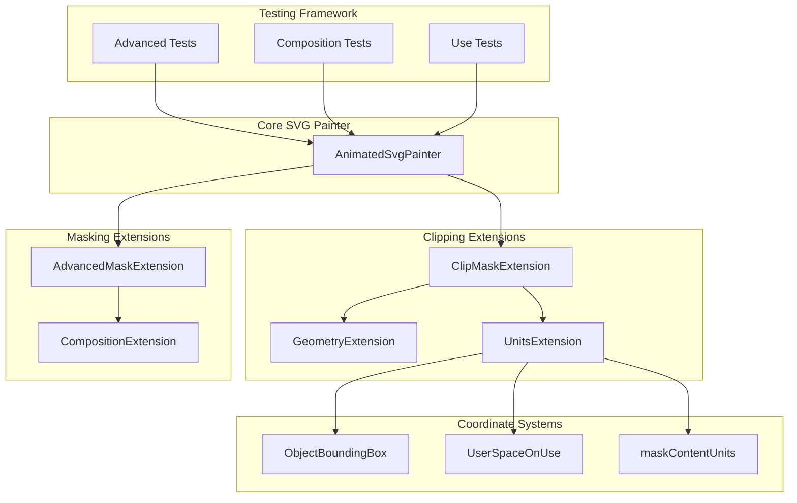
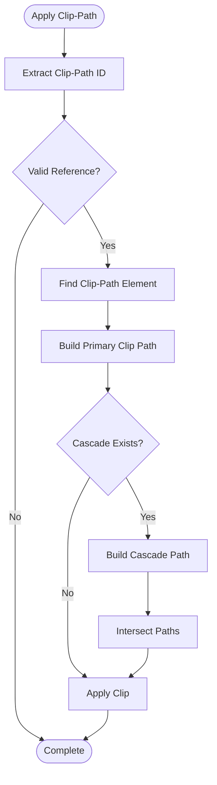
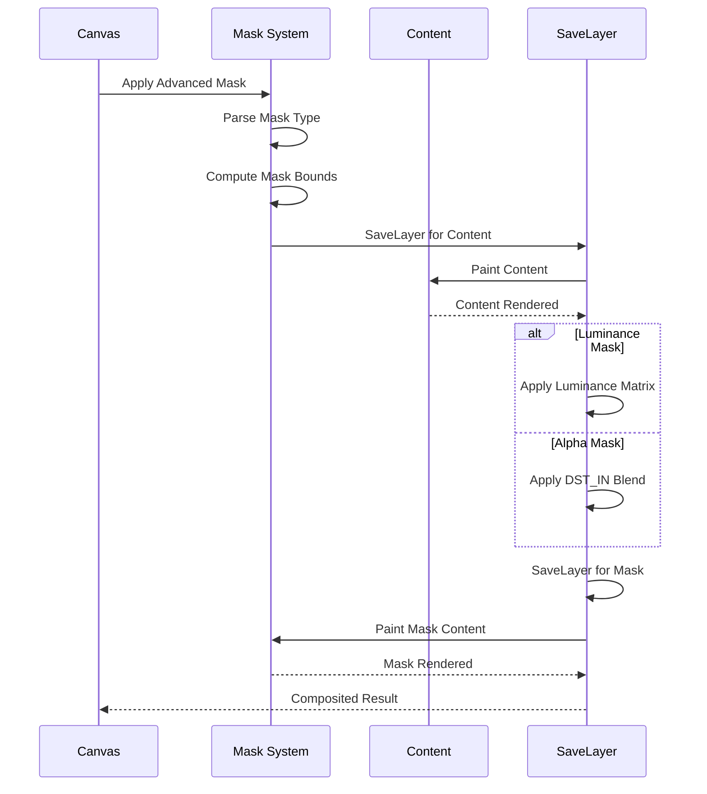
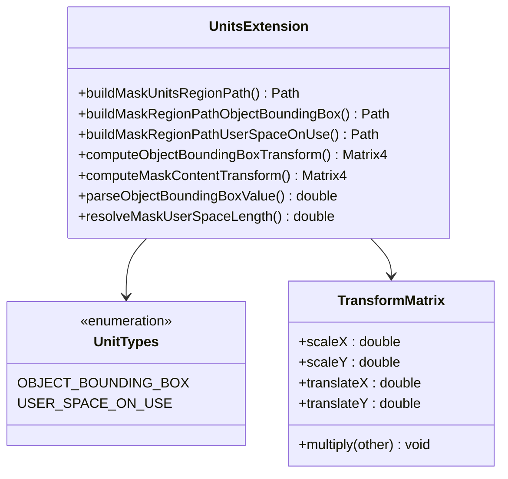
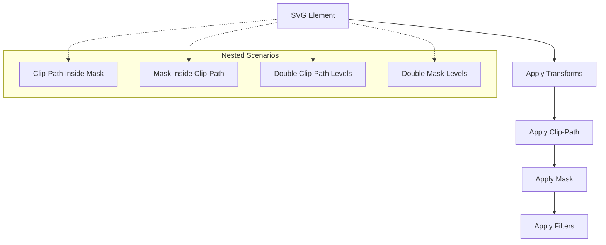

# Advanced Clipping and Masking System

<cite>
**Referenced Files in This Document**
- [animated_svg_painter_clip_mask.dart](file://lib/src/animation/animated_svg_painter_clip_mask.dart)
- [animated_svg_painter_clip_mask_advanced.dart](file://lib/src/animation/animated_svg_painter_clip_mask_advanced.dart)
- [animated_svg_painter_clip_mask_composition.dart](file://lib/src/animation/animated_svg_painter_clip_mask_composition.dart)
- [animated_svg_painter_clip_mask_geometry.dart](file://lib/src/animation/animated_svg_painter_clip_mask_geometry.dart)
- [animated_svg_painter_clip_mask_units.dart](file://lib/src/animation/animated_svg_painter_clip_mask_units.dart)
- [svg.dart](file://lib/svg.dart)
- [advanced_clip_mask_test.dart](file://test/animation/advanced_clip_mask_test.dart)
- [advanced_mask_test.dart](file://test/animation/advanced_mask_test.dart)
- [clip_mask_advanced_composition_test.dart](file://test/animation/clip_mask_advanced_composition_test.dart)
- [clip_mask_use_verification_test.dart](file://test/animation/clip_mask_use_verification_test.dart)
</cite>

## Table of Contents
1. [Introduction](#introduction)
2. [System Architecture](#system-architecture)
3. [Core Components](#core-components)
4. [Advanced Clipping Implementation](#advanced-clipping-implementation)
5. [Advanced Masking Implementation](#advanced-masking-implementation)
6. [Coordinate System Management](#coordinate-system-management)
7. [Composition and Nesting Support](#composition-and-nesting-support)
8. [Testing Framework](#testing-framework)
9. [Performance Considerations](#performance-considerations)
10. [Troubleshooting Guide](#troubleshooting-guide)
11. [Conclusion](#conclusion)

## Introduction

The Advanced Clipping and Masking System is a sophisticated implementation within the Flutter SVG library that provides comprehensive support for SVG clipping paths and masking operations. This system extends beyond basic clipping to support advanced features including luminance-based masking, multiple mask composition, nested compositions, and sophisticated coordinate system handling.

The system is designed to provide SVG 2.0 specification compliance while maintaining optimal performance for Flutter applications. It supports both clip-path and mask operations with full compatibility for complex nested scenarios, coordinate transformations, and advanced masking techniques.

## System Architecture

The clipping and masking system is built as an extension to the core SVG painter, utilizing a modular architecture that separates concerns across multiple specialized components:

**Diagram sources**
- [animated_svg_painter_clip_mask.dart:11-350](file://lib/src/animation/animated_svg_painter_clip_mask.dart#L11-L350)
- [animated_svg_painter_clip_mask_advanced.dart:17-800](file://lib/src/animation/animated_svg_painter_clip_mask_advanced.dart#L17-L800)
- [animated_svg_painter_clip_mask_composition.dart:37-466](file://lib/src/animation/animated_svg_painter_clip_mask_composition.dart#L37-L466)

The architecture follows a layered approach where each extension focuses on specific aspects of clipping and masking:

- **ClipMaskExtension**: Core clipping and masking functionality
- **GeometryExtension**: Path building and geometry computation
- **UnitsExtension**: Coordinate system and unit conversion
- **AdvancedMaskExtension**: Luminance masking and advanced features
- **CompositionExtension**: Multi-level composition and nesting

## Core Components

### AnimatedSvgPainterClipMaskExtension

The foundation of the clipping system, this extension provides the core functionality for applying clip-path and mask operations to SVG elements.

Key features include:
- **Cascade Support**: Handles nested clip-path references up to 10 levels deep
- **Circular Reference Prevention**: Protects against infinite recursion in clip-path chains
- **Bounding Box Computation**: Accurate calculation of element bounds including stroke widths
- **Path Building**: Construction of complex clipping paths from SVG geometry

### AnimatedSvgPainterClipMaskAdvancedExtension

Extends the basic clipping system with advanced masking capabilities:

- **Luminance Masking**: Converts RGB content to grayscale luminance for masking
- **Multiple Mask Support**: Sequential application of multiple masks
- **SaveLayer Management**: Proper compositing using Flutter's saveLayer system
- **Filter Integration**: Support for mask content filters and effects

### AnimatedSvgPainterClipMaskCompositionExtension

Handles complex composition scenarios and edge cases:

- **Nested Composition**: Clip-path inside mask and mask inside clip-path scenarios
- **Group Inheritance**: Masks applied to groups affecting all children
- **Edge Feathering**: Soft edge creation using blur filters
- **Text Mask Geometry**: Special handling for text elements in masks

**Section sources**
- [animated_svg_painter_clip_mask.dart:11-350](file://lib/src/animation/animated_svg_painter_clip_mask.dart#L11-L350)
- [animated_svg_painter_clip_mask_advanced.dart:17-800](file://lib/src/animation/animated_svg_painter_clip_mask_advanced.dart#L17-L800)
- [animated_svg_painter_clip_mask_composition.dart:37-466](file://lib/src/animation/animated_svg_painter_clip_mask_composition.dart#L37-L466)

## Advanced Clipping Implementation

The clipping system implements sophisticated path construction and manipulation:

**Diagram sources**
- [animated_svg_painter_clip_mask.dart:12-106](file://lib/src/animation/animated_svg_painter_clip_mask.dart#L12-L106)

### Clip-Path Units System

The system supports both coordinate systems:

- **objectBoundingBox**: Relative coordinates (0.0 to 1.0) based on element bounds
- **userSpaceOnUse**: Absolute coordinates in the current user space

### Geometry Construction

Complex geometry is constructed from various SVG elements:
- **Shapes**: rect, circle, ellipse, polygon, polyline, path, line
- **Text Elements**: Converted to bounding rectangles with stroke expansion
- **Images**: Use actual image bounds for clipping
- **Groups**: Union of all child element bounds

**Section sources**
- [animated_svg_painter_clip_mask_geometry.dart:3-377](file://lib/src/animation/animated_svg_painter_clip_mask_geometry.dart#L3-L377)
- [animated_svg_painter_clip_mask_units.dart:9-565](file://lib/src/animation/animated_svg_painter_clip_mask_units.dart#L9-L565)

## Advanced Masking Implementation

The masking system provides comprehensive support for both alpha and luminance masking:

**Diagram sources**
- [animated_svg_painter_clip_mask_advanced.dart:530-648](file://lib/src/animation/animated_svg_painter_clip_mask_advanced.dart#L530-L648)

### Mask Types and Behavior

The system supports two primary mask types:

1. **Luminance Masking** (Default per SVG spec):
   - Converts RGB content to grayscale using ITU-R BT.709 coefficients
   - Formula: `0.2126 × R + 0.7152 × G + 0.0722 × B`
   - Uses alpha channel for final opacity

2. **Alpha Masking**:
   - Uses the alpha channel directly from mask content
   - Ignores color information in mask
   - Provides explicit control over transparency

### Multiple Mask Composition

The system supports sequential application of multiple masks:

- **Comma-Separated Lists**: `mask: url(#mask1), url(#mask2)`
- **Intersection Logic**: Each mask's result becomes input for the next
- **Proper Ordering**: Content → Filter → Mask composition per CSS spec

**Section sources**
- [animated_svg_painter_clip_mask_advanced.dart:115-273](file://lib/src/animation/animated_svg_painter_clip_mask_advanced.dart#L115-L273)

## Coordinate System Management

The coordinate system management system handles the complex interactions between different unit types:

**Diagram sources**
- [animated_svg_painter_clip_mask_units.dart:9-565](file://lib/src/animation/animated_svg_painter_clip_mask_units.dart#L9-L565)

### Unit Resolution Process

The system resolves coordinates through a hierarchical process:

1. **Element-Level Units**: `maskUnits` and `clipPathUnits`
2. **Content-Level Units**: `maskContentUnits` for mask content positioning
3. **Percentage Handling**: Automatic conversion from percentages to absolute values
4. **Viewport Resolution**: Determination of coordinate space boundaries

### Safe Scaling Operations

The system includes safeguards against extreme scaling:

- **Minimum Dimension Thresholds**: Prevents division by zero errors
- **Safe Scale Clamping**: Limits extreme magnification artifacts
- **Non-Uniform Scaling**: Handles different width/height ratios appropriately

**Section sources**
- [animated_svg_painter_clip_mask_units.dart:198-334](file://lib/src/animation/animated_svg_painter_clip_mask_units.dart#L198-L334)

## Composition and Nesting Support

The composition system handles complex nested scenarios with proper precedence:

**Diagram sources**
- [animated_svg_painter_clip_mask_composition.dart:3-20](file://lib/src/animation/animated_svg_painter_clip_mask_composition.dart#L3-L20)

### Composition Precedence Rules

The system follows SVG 2.0 specification for composition order:

1. **Transforms**: Applied first (handled by core transform system)
2. **Clip-Path**: Applied second (geometric clipping)
3. **Mask**: Applied last (alpha/luminance masking)

### Edge Case Handling

The system includes comprehensive edge case handling:

- **Zero-Dimension Elements**: Graceful handling of lines, points, and very small elements
- **Circular References**: Prevention of infinite loops in nested references
- **Empty Masks**: Proper handling when mask content is absent
- **Degenerate Paths**: Validation of clipping paths before application

**Section sources**
- [animated_svg_painter_clip_mask_composition.dart:37-466](file://lib/src/animation/animated_svg_painter_clip_mask_composition.dart#L37-L466)

## Testing Framework

The testing framework provides comprehensive coverage of clipping and masking functionality:

### Test Categories

The system includes four main test suites:

1. **Advanced Clip-Mask Tests**: Core functionality and edge cases
2. **Advanced Mask Tests**: Luminance masking and mask-specific features  
3. **Clip-Mask Composition Tests**: Complex nested scenarios
4. **Use Verification Tests**: Integration with use/symbol elements

### Test Coverage Areas

Each test category focuses on specific functionality:

- **Basic Operations**: Simple clip-path and mask rendering
- **Coordinate Systems**: objectBoundingBox vs userSpaceOnUse behavior
- **Advanced Features**: Luminance masking, multiple masks, edge feathering
- **Integration**: Use elements, symbols, and CSS inheritance
- **Edge Cases**: Zero-dimension elements, circular references, empty masks

### Visual Testing Approach

The tests use a sophisticated visual analysis system:

- **Pixel Capture**: Direct pixel extraction from rendered widgets
- **Color Analysis**: RGB pixel counting and bounding box detection
- **Statistical Analysis**: Pixel count thresholds and spatial distribution
- **Comparison Utilities**: Automated comparison of expected vs actual results

**Section sources**
- [advanced_clip_mask_test.dart:1-766](file://test/animation/advanced_clip_mask_test.dart#L1-L766)
- [advanced_mask_test.dart:1-537](file://test/animation/advanced_mask_test.dart#L1-L537)
- [clip_mask_advanced_composition_test.dart:1-568](file://test/animation/clip_mask_advanced_composition_test.dart#L1-L568)
- [clip_mask_use_verification_test.dart:1-977](file://test/animation/clip_mask_use_verification_test.dart#L1-L977)

## Performance Considerations

The clipping and masking system is optimized for production use:

### Memory Management

- **SaveLayer Optimization**: Efficient use of Flutter's saveLayer system
- **Path Reuse**: Minimizes path construction overhead
- **Transform Caching**: Reuses computed transformation matrices
- **Bounds Caching**: Stores computed bounding boxes to avoid recalculation

### Computational Efficiency

- **Early Termination**: Quick rejection of invalid or degenerate cases
- **Threshold Checking**: Prevents unnecessary computations for tiny elements
- **Lazy Evaluation**: Defers expensive operations until needed
- **Optimized Loops**: Efficient iteration through complex nested structures

### Rendering Optimization

- **Minimal Canvas Operations**: Reduces the number of canvas state changes
- **Efficient Path Operations**: Optimized path combination and intersection
- **Smart Layer Management**: Appropriate use of saveLayer for compositing
- **Anti-Aliasing Control**: Configurable anti-aliasing for performance trade-offs

## Troubleshooting Guide

### Common Issues and Solutions

**Issue**: Clipping not working as expected
- **Cause**: Incorrect clip-path units or coordinate system
- **Solution**: Verify `clipPathUnits` attribute and coordinate values

**Issue**: Mask appears completely transparent  
- **Cause**: Luminance masking with dark content
- **Solution**: Use alpha masking or adjust mask content brightness

**Issue**: Performance degradation with complex masks
- **Cause**: Excessive nested masks or large saveLayers
- **Solution**: Simplify mask hierarchy or optimize mask content

**Issue**: Infinite recursion errors
- **Cause**: Circular references in clip-path chains
- **Solution**: Check for circular dependencies in SVG structure

### Debugging Techniques

The system includes several debugging aids:

- **Visual Analysis Tools**: Pixel-level inspection of rendered output
- **Bounds Calculation Logging**: Tracking of computed bounding boxes
- **Transform Chain Tracing**: Following transformation matrices through the hierarchy
- **Performance Metrics**: Timing and memory usage monitoring

**Section sources**
- [animated_svg_painter_clip_mask.dart:52-56](file://lib/src/animation/animated_svg_painter_clip_mask.dart#L52-L56)
- [animated_svg_painter_clip_mask_advanced.dart:234-238](file://lib/src/animation/animated_svg_painter_clip_mask_advanced.dart#L234-L238)

## Conclusion

The Advanced Clipping and Masking System represents a comprehensive implementation of SVG clipping and masking capabilities within the Flutter ecosystem. The system successfully bridges the gap between SVG specification compliance and Flutter's rendering architecture.

Key achievements include:

- **SVG 2.0 Compliance**: Full support for advanced clipping and masking features
- **Performance Optimization**: Efficient rendering with minimal overhead
- **Comprehensive Testing**: Extensive test coverage ensuring reliability
- **Flexible Architecture**: Modular design supporting future enhancements

The system's robust handling of complex scenarios, from simple clip-path operations to sophisticated luminance masking with multiple mask composition, demonstrates its maturity and suitability for production applications requiring advanced SVG rendering capabilities.

Future enhancements could include additional SVG filter integration, improved text mask geometry handling, and expanded support for CSS masking specifications.