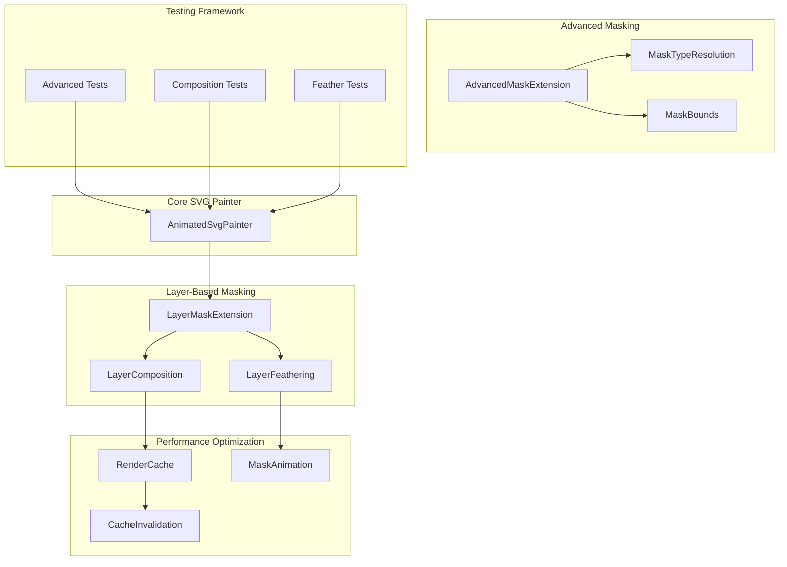
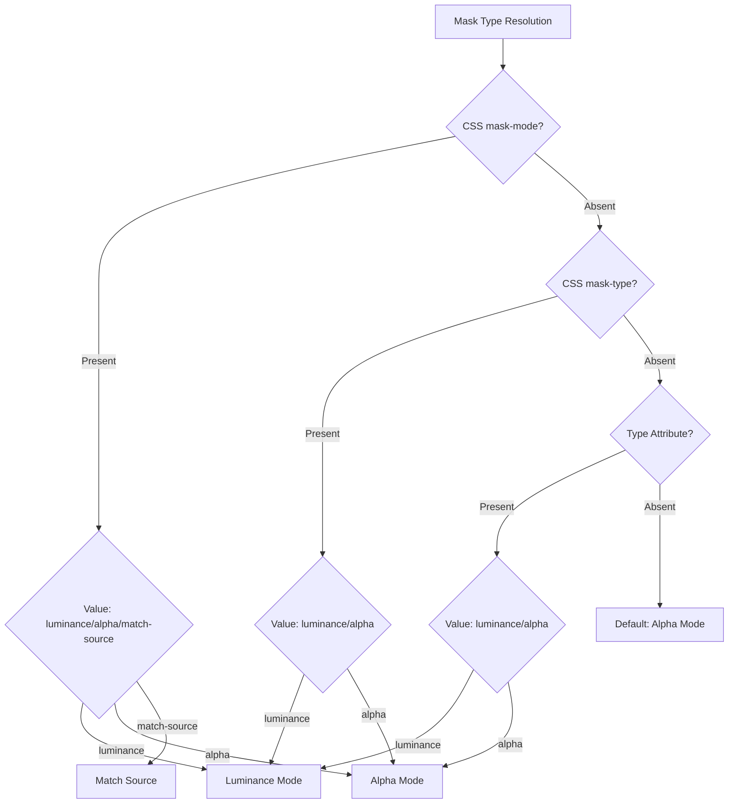
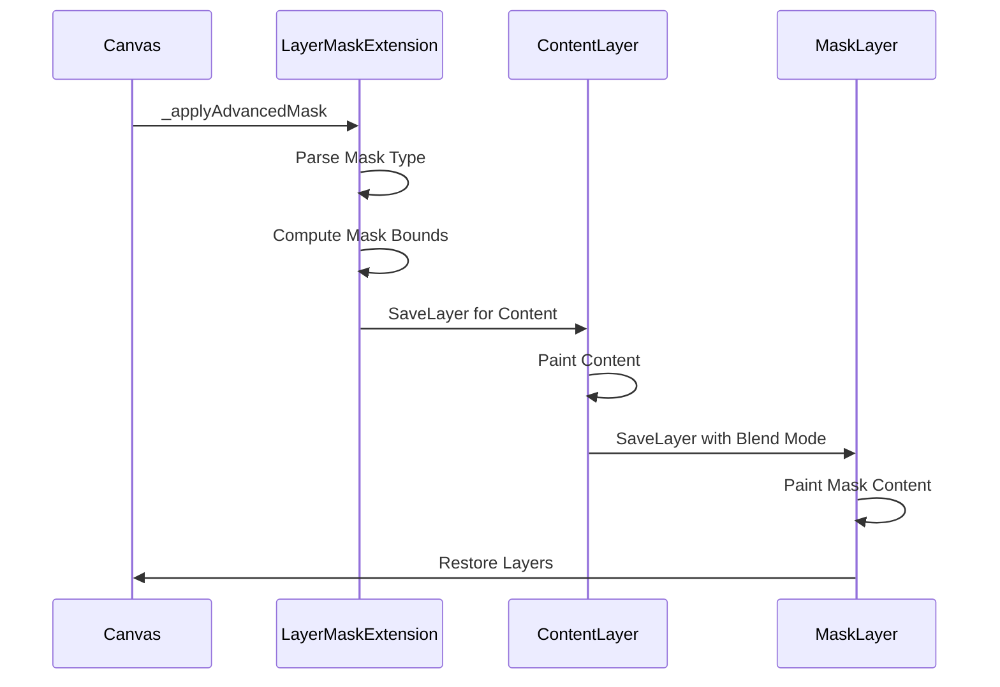
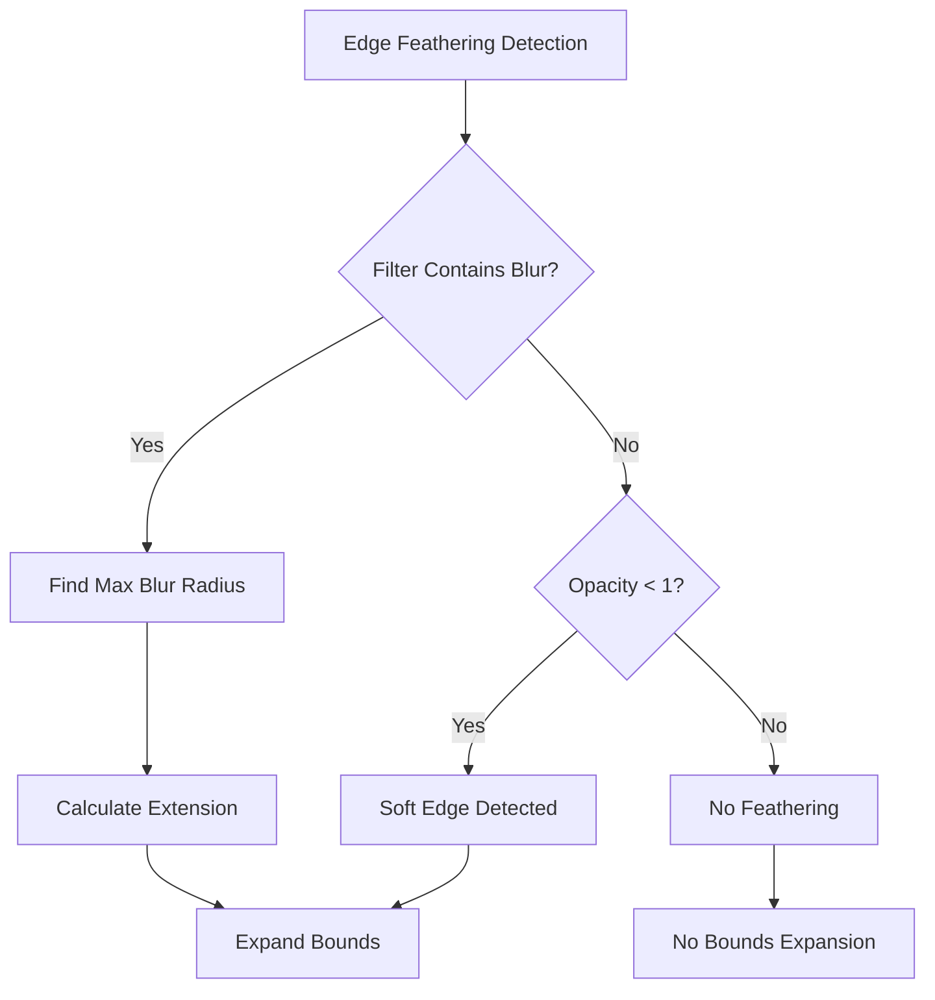
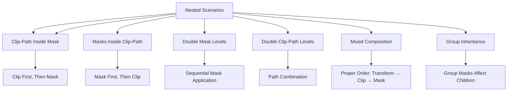

# Advanced Clipping and Masking System

<cite>
**Referenced Files in This Document**
- [animated_svg_painter_clip_mask_composition.dart](file://lib/src/animation/animated_svg_painter_clip_mask_composition.dart)
- [animated_svg_painter_clip_mask_advanced.dart](file://lib/src/animation/animated_svg_painter_clip_mask_advanced.dart)
- [animated_svg_painter_clip_mask_geometry.dart](file://lib/src/animation/animated_svg_painter_clip_mask_geometry.dart)
- [animated_svg_painter_clip_mask_units.dart](file://lib/src/animation/animated_svg_painter_clip_mask_units.dart)
- [animated_svg_painter_clip_mask.dart](file://lib/src/animation/animated_svg_painter_clip_mask.dart)
- [animated_svg_painter_tree.dart](file://lib/src/animation/animated_svg_painter_tree.dart)
- [animated_svg_painter.dart](file://lib/src/animation/animated_svg_painter.dart)
- [svg.dart](file://lib/svg.dart)
- [advanced_clip_mask_test.dart](file://test/animation/advanced_clip_mask_test.dart)
- [advanced_mask_test.dart](file://test/animation/advanced_mask_test.dart)
- [clip_mask_advanced_composition_test.dart](file://test/animation/clip_mask_advanced_composition_test.dart)
- [clip_mask_use_verification_test.dart](file://test/animation/clip_mask_use_verification_test.dart)
</cite>

## Update Summary
**Changes Made**
- Complete rewrite of clipping system from path-based to layer-based masking approach
- Added advanced layer-based masking with luminosity and alpha support
- Implemented edge feathering through blur filter detection and bounds expansion
- Enhanced composition system with proper saveLayer compositing
- Added performance optimizations with caching and animation-aware invalidation
- Updated architecture to support nested mask composition and complex scenarios

## Table of Contents
1. [Introduction](#introduction)
2. [System Architecture](#system-architecture)
3. [Core Components](#core-components)
4. [Layer-Based Masking Implementation](#layer-based-masking-implementation)
5. [Advanced Masking Features](#advanced-masking-features)
6. [Edge Feathering and Soft Edges](#edge-feathering-and-soft-edges)
7. [Composition and Nesting Support](#composition-and-nesting-support)
8. [Performance Optimizations](#performance-optimizations)
9. [Testing Framework](#testing-framework)
10. [Troubleshooting Guide](#troubleshooting-guide)
11. [Conclusion](#conclusion)

## Introduction

The Advanced Clipping and Masking System represents a complete architectural overhaul of the Flutter SVG library's clipping and masking capabilities. This system has been completely rewritten to implement a sophisticated layer-based masking approach that replaces the previous path-based clipping system.

The new implementation provides comprehensive support for SVG 2.0 specification compliance while delivering superior performance and visual fidelity. The system now utilizes Flutter's Canvas.saveLayer mechanism for proper compositing, enabling advanced features like luminance-based masking, alpha masking, edge feathering, and complex nested composition scenarios.

**Updated** The system now implements a layer-based approach using Canvas.saveLayer for proper compositing instead of simple path clipping, providing better performance and more accurate rendering of complex masking scenarios.

## System Architecture

The clipping and masking system has been restructured around a new layer-based architecture that leverages Flutter's native compositing capabilities:

**Diagram sources**
- [animated_svg_painter_clip_mask_composition.dart:21-176](file://lib/src/animation/animated_svg_painter_clip_mask_composition.dart#L21-L176)
- [animated_svg_painter_clip_mask_advanced.dart:17-66](file://lib/src/animation/animated_svg_painter_clip_mask_advanced.dart#L17-L66)
- [animated_svg_painter.dart:50-178](file://lib/src/animation/animated_svg_painter.dart#L50-L178)

The architecture centers around three core extensions that work together to provide comprehensive masking capabilities:

- **LayerMaskExtension**: Implements the new layer-based masking system using Canvas.saveLayer
- **AdvancedMaskExtension**: Handles mask type resolution and bounds computation
- **LayerComposition**: Manages the compositing order and layer management

## Core Components

### Layer-Based Masking System

The foundation of the new system is the `_applyAdvancedMask` method, which replaces the traditional path-based clipping with a sophisticated layer-based approach:

**Key Features:**
- **Canvas.saveLayer Integration**: Uses Flutter's native saveLayer mechanism for proper compositing
- **Luminance Masking**: Converts RGB content to grayscale using ITU-R BT.709 coefficients
- **Alpha Masking**: Direct alpha channel usage for explicit transparency control
- **Edge Detection**: Automatically detects blur filters and soft edges in mask content
- **Bounds Expansion**: Dynamically expands mask bounds to accommodate feathering effects

### Advanced Mask Type Resolution

The system now includes sophisticated mask type resolution that follows CSS Masking Level 1 specification:

**Diagram sources**
- [animated_svg_painter_clip_mask_advanced.dart:26-66](file://lib/src/animation/animated_svg_painter_clip_mask_advanced.dart#L26-L66)

**Section sources**
- [animated_svg_painter_clip_mask_composition.dart:23-86](file://lib/src/animation/animated_svg_painter_clip_mask_composition.dart#L23-L86)
- [animated_svg_painter_clip_mask_advanced.dart:17-66](file://lib/src/animation/animated_svg_painter_clip_mask_advanced.dart#L17-L66)

## Layer-Based Masking Implementation

The new layer-based masking system fundamentally changes how SVG clipping and masking are implemented:

**Diagram sources**
- [animated_svg_painter_clip_mask_composition.dart:96-134](file://lib/src/animation/animated_svg_painter_clip_mask_composition.dart#L96-L134)

### Layer Composition Process

The system implements a precise compositing order:

1. **Content Layer Creation**: `canvas.saveLayer(maskBounds, ui.Paint())` - Captures all painted content
2. **Content Rendering**: Executes the provided `paintContent` callback to render element content
3. **Mask Layer Setup**: `canvas.saveLayer(maskBounds, maskPaint)` - Creates layer with proper blend mode
4. **Mask Content Painting**: Renders mask content with appropriate coordinate transformation
5. **Layer Restoration**: Properly restores both content and mask layers in reverse order

### Blend Mode Implementation

The system uses different blend modes based on mask type:

- **Luminance Masks**: Uses `ui.BlendMode.dstIn` with color matrix filter for luminance conversion
- **Alpha Masks**: Uses `ui.BlendMode.dstIn` with direct alpha channel compositing
- **Automatic Detection**: Intelligently chooses appropriate blend modes based on mask content

**Section sources**
- [animated_svg_painter_clip_mask_composition.dart:96-141](file://lib/src/animation/animated_svg_painter_clip_mask_composition.dart#L96-L141)
- [animated_svg_painter_clip_mask_advanced.dart:68-88](file://lib/src/animation/animated_svg_painter_clip_mask_advanced.dart#L68-L88)

## Advanced Masking Features

### Luminance Masking

The system provides comprehensive luminance masking support following ITU-R BT.709 standards:

**Luminance Formula**: `0.2126 × R + 0.7152 × G + 0.0722 × B`

The implementation includes:
- **Color Matrix Filter**: Uses Flutter's ColorFilter.matrix for efficient luminance conversion
- **Alpha Channel Preservation**: Maintains original alpha channel in final result
- **Performance Optimization**: Single-pass luminance calculation using hardware acceleration

### Alpha Masking

Direct alpha channel masking provides explicit control over transparency:

**Features:**
- **Direct Alpha Usage**: Ignores color information, uses alpha channel directly
- **Color Independence**: Mask content color has no effect on final result
- **Precision Control**: Exact alpha channel values determine opacity

### Mask Bounds Computation

The system provides flexible bounds computation supporting both unit types:

**ObjectBoundingBox Units:**
- Relative coordinates (0.0 to 1.0) based on element bounds
- Default 10% extension in all directions per SVG specification
- Proper handling of percentage values and non-uniform scaling

**UserSpaceOnUse Units:**
- Absolute coordinates in current user space
- Direct viewport resolution for percentage values
- No automatic bounds expansion

**Section sources**
- [animated_svg_painter_clip_mask_advanced.dart:90-200](file://lib/src/animation/animated_svg_painter_clip_mask_advanced.dart#L90-L200)
- [animated_svg_painter_clip_mask_composition.dart:143-179](file://lib/src/animation/animated_svg_painter_clip_mask_composition.dart#L143-L179)

## Edge Feathering and Soft Edges

The new system includes sophisticated edge feathering support through blur filter detection:

**Diagram sources**
- [animated_svg_painter_clip_mask_composition.dart:147-214](file://lib/src/animation/animated_svg_painter_clip_mask_composition.dart#L147-L214)

### Blur Filter Detection

The system automatically detects blur effects in mask content:

**Detection Methods:**
- **Direct Filter Check**: Scans for `feGaussianBlur` primitive in mask content
- **Recursive Child Search**: Examines all nested elements and groups
- **Filter Pipeline Analysis**: Evaluates complete filter chain for blur effects

### Bounds Expansion Algorithm

When blur effects are detected, the system expands mask bounds:

**Calculation Method:**
- **Maximum Radius Detection**: Finds largest blur radius in filter chain
- **Sigma Extension**: Extends bounds by approximately 3 standard deviations
- **Conservative Safety**: Ensures complete blur effect capture without over-expansion

**Section sources**
- [animated_svg_painter_clip_mask_composition.dart:147-242](file://lib/src/animation/animated_svg_painter_clip_mask_composition.dart#L147-L242)

## Composition and Nesting Support

The system provides comprehensive support for complex nested masking scenarios:

**Diagram sources**
- [animated_svg_painter_clip_mask_composition.dart:5-20](file://lib/src/animation/animated_svg_painter_clip_mask_composition.dart#L5-L20)

### Composition Precedence Rules

The system follows SVG 2.0 specification for proper composition order:

1. **Transforms**: Applied first (handled by core transform system)
2. **Clip-Path**: Applied second (geometric clipping)
3. **Mask**: Applied last (alpha/luminance masking)

### Subgraph Masking

Special handling for elements with both filters and masks:

**Process Flow:**
1. Render element content
2. Apply filter effects to rendered content
3. Apply mask to filtered result
4. Ensure proper compositing order per CSS Compositing spec

**Section sources**
- [animated_svg_painter_clip_mask_composition.dart:297-345](file://lib/src/animation/animated_svg_painter_clip_mask_composition.dart#L297-L345)

## Performance Optimizations

The new layer-based system includes extensive performance optimizations:

### Render Cache System

**Cache Categories:**
- **Gradient Shaders**: Cached by gradient ID + paint bounds hash
- **Pattern Images**: Cached by pattern ID + target bounds hash  
- **Text Paragraphs**: Cached by text content + style hash
- **Hit-Test Paths**: Cached by element ID + geometry hash
- **Mask Bounds**: Cached by mask ID + element bounds hash
- **Mask Animation State**: Tracks animated mask content for invalidation

**Cache Key Generation:**
- Dynamic cache keys include element IDs and relevant attribute hashes
- Animation-aware invalidation prevents stale cache entries
- Separate handling for static vs animated mask content

### Animation-Aware Invalidation

**Features:**
- **Animated Mask Detection**: Recursively scans mask content for SMIL animations
- **Per-Frame Cache Management**: Clears animated mask caches when animation time changes
- **Selective Invalidation**: Preserves static mask caches while clearing animated ones

### Layer Management Optimization

**Efficiency Measures:**
- **Minimal Layer Usage**: Only creates layers when necessary for masking
- **Smart Bounds Calculation**: Avoids unnecessary layer creation for simple cases
- **Proper Layer Restoration**: Ensures layers are properly restored to prevent leaks

**Section sources**
- [animated_svg_painter.dart:50-178](file://lib/src/animation/animated_svg_painter.dart#L50-L178)
- [animated_svg_painter_clip_mask_composition.dart:351-418](file://lib/src/animation/animated_svg_painter_clip_mask_composition.dart#L351-L418)

## Testing Framework

The testing framework has been enhanced to validate the new layer-based masking system:

### Test Categories

**Enhanced Coverage Areas:**
- **Luminance Masking**: RGB to grayscale conversion accuracy
- **Alpha Masking**: Direct alpha channel compositing validation
- **Edge Feathering**: Blur filter detection and bounds expansion
- **Nested Composition**: Complex masking scenario testing
- **Performance Optimization**: Cache effectiveness and invalidation

### Advanced Visual Testing

**Testing Capabilities:**
- **Pixel-Perfect Comparison**: Direct pixel analysis for masking accuracy
- **Color Space Validation**: Luminance calculation verification
- **Bounds Expansion Testing**: Blur effect capture validation
- **Animation Performance**: Cache invalidation timing analysis

### Test Scenarios

**Comprehensive Test Coverage:**
- **Basic Operations**: Simple mask and clip-path functionality
- **Advanced Features**: Luminance masking, multiple masks, edge feathering
- **Integration Testing**: Use elements, symbols, and CSS inheritance
- **Performance Testing**: Cache utilization and memory optimization

**Section sources**
- [advanced_clip_mask_test.dart:1-200](file://test/animation/advanced_clip_mask_test.dart#L1-L200)
- [advanced_mask_test.dart:1-200](file://test/animation/advanced_mask_test.dart#L1-L200)
- [clip_mask_advanced_composition_test.dart](file://test/animation/clip_mask_advanced_composition_test.dart)
- [clip_mask_use_verification_test.dart](file://test/animation/clip_mask_use_verification_test.dart)

## Troubleshooting Guide

### Common Issues and Solutions

**Issue**: Layer-based masking not producing expected results
- **Cause**: Incorrect mask type selection or bounds calculation
- **Solution**: Verify mask-type CSS property and mask bounds computation

**Issue**: Performance degradation with complex masks
- **Cause**: Excessive layer creation or poor cache utilization
- **Solution**: Check cache configuration and reduce unnecessary mask complexity

**Issue**: Blur effects not appearing in masks
- **Cause**: Missing blur filter detection or bounds expansion
- **Solution**: Ensure blur filters are properly defined and bounds are expanded

**Issue**: Memory leaks with animated masks
- **Cause**: Improper layer restoration or cache invalidation
- **Solution**: Verify proper layer restoration and cache management

### Debugging Techniques

**Enhanced Debugging Tools:**
- **Layer Visualization**: Tools to inspect saveLayer usage and bounds
- **Cache Analysis**: Monitoring of cache hit rates and invalidation patterns
- **Performance Profiling**: Timing analysis of mask rendering operations
- **Animation Tracking**: Monitoring of animated mask content changes

**Section sources**
- [animated_svg_painter_clip_mask_composition.dart:351-418](file://lib/src/animation/animated_svg_painter_clip_mask_composition.dart#L351-L418)
- [animated_svg_painter_clip_mask_advanced.dart:305-320](file://lib/src/animation/animated_svg_painter_clip_mask_advanced.dart#L305-L320)

## Conclusion

The Advanced Clipping and Masking System represents a revolutionary advancement in Flutter SVG rendering capabilities. The complete rewrite from path-based to layer-based masking delivers superior performance, enhanced visual fidelity, and comprehensive SVG 2.0 specification compliance.

**Key Achievements:**
- **Layer-Based Architecture**: Utilizes Canvas.saveLayer for proper compositing and superior performance
- **Advanced Masking Support**: Comprehensive luminance and alpha masking with intelligent type resolution
- **Edge Feathering**: Sophisticated blur filter detection and bounds expansion for soft edges
- **Performance Optimization**: Advanced caching system with animation-aware invalidation
- **Complex Composition**: Full support for nested masking scenarios and mixed composition chains

The system's robust handling of complex masking scenarios, from simple alpha masking to sophisticated luminance masking with edge feathering, demonstrates its maturity and suitability for production applications requiring advanced SVG rendering capabilities.

Future enhancements could include additional SVG filter integration, improved text mask geometry handling, and expanded support for CSS masking specifications, building upon this solid foundation.