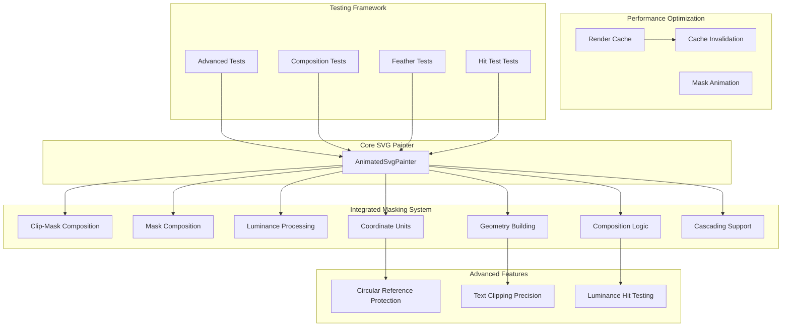
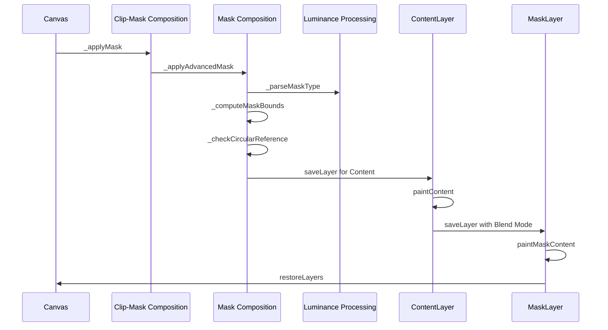
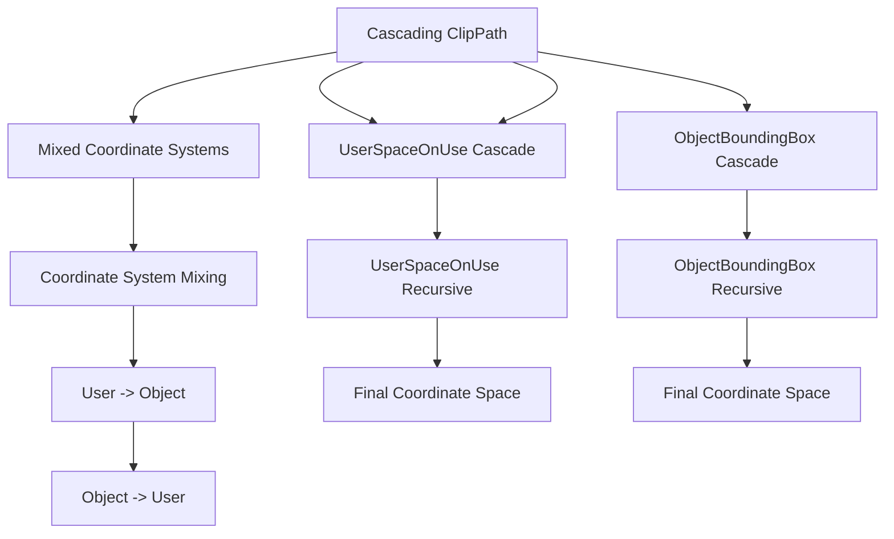
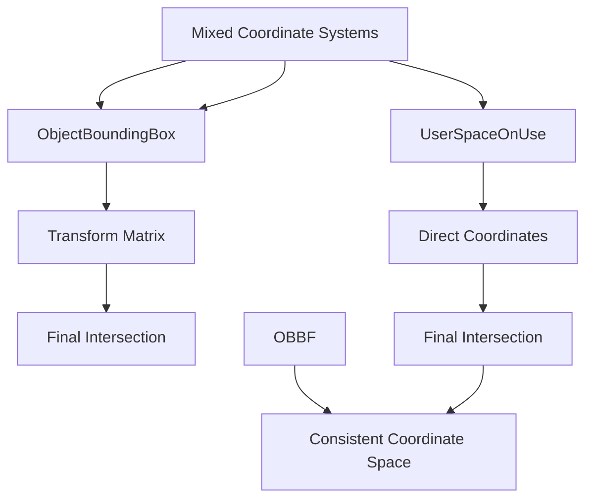
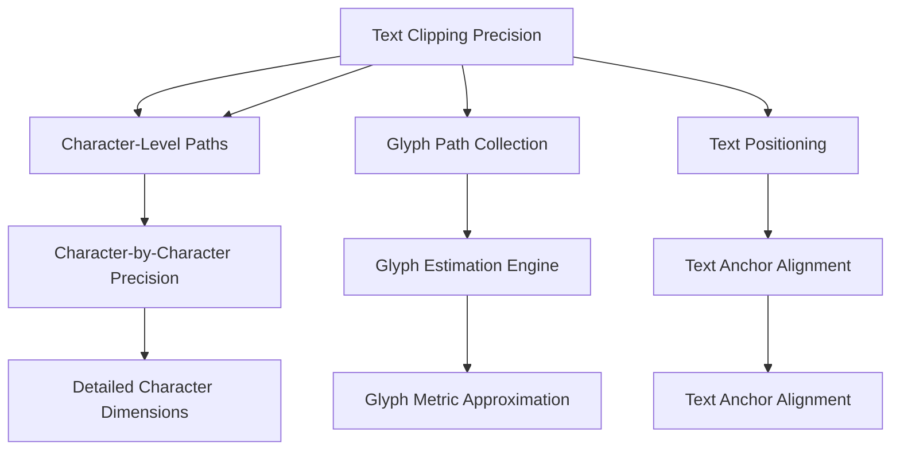
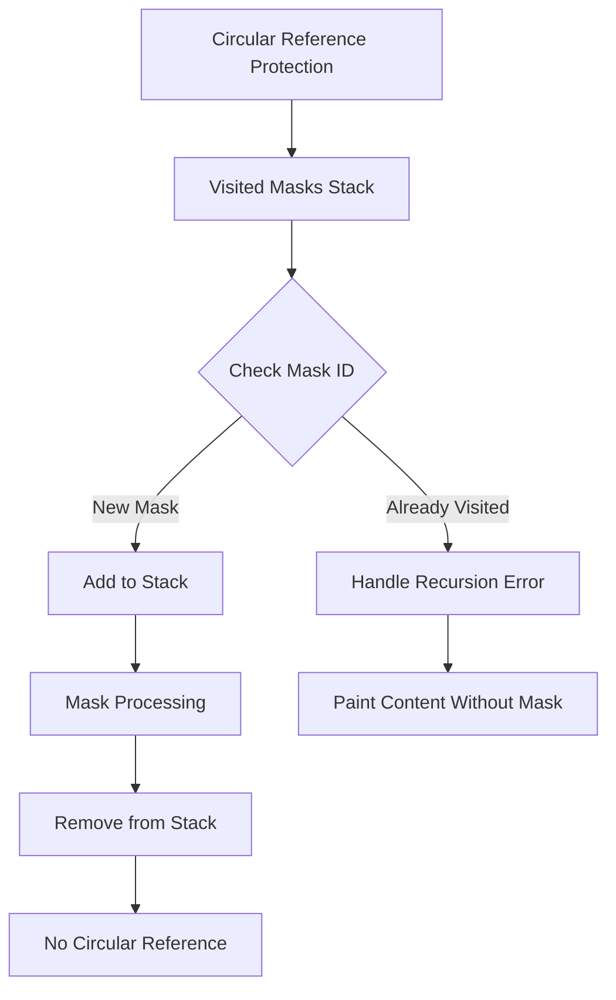
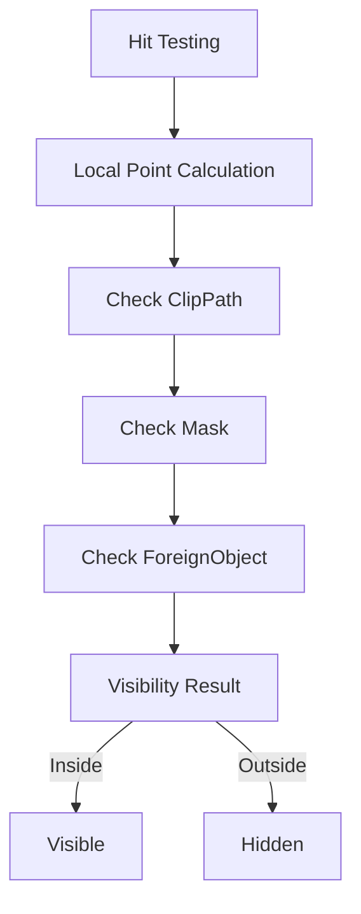
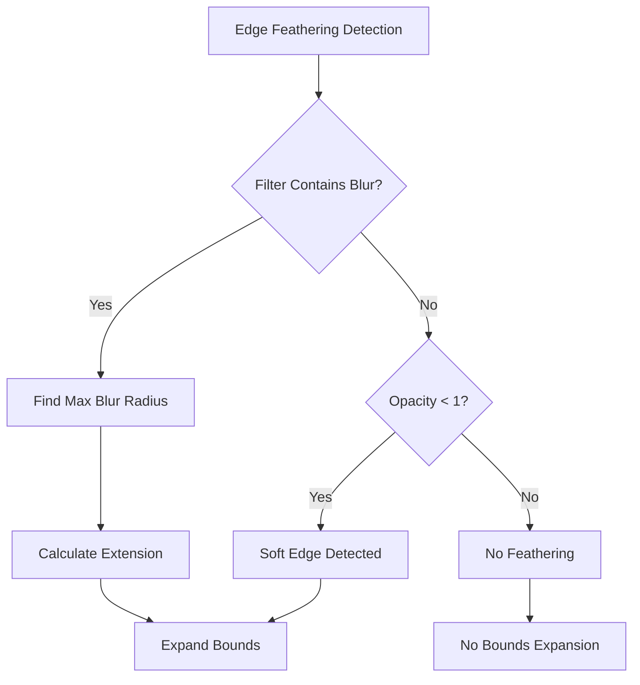
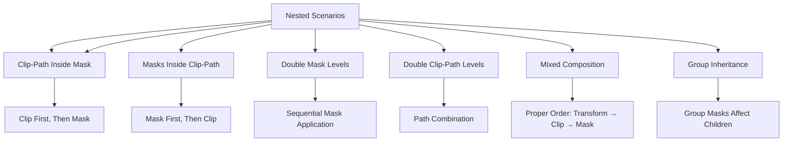

# Advanced Clipping and Masking System

<cite>
**Referenced Files in This Document**
- [animated_svg_painter.dart](file://lib/src/animation/animated_svg_painter.dart)
- [animated_svg_painter_clip_mask.dart](file://lib/src/animation/animated_svg_painter_clip_mask.dart)
- [animated_svg_painter_clip_mask_composition.dart](file://lib/src/animation/animated_svg_painter_clip_mask_composition.dart)
- [animated_svg_painter_clip_mask_geometry.dart](file://lib/src/animation/animated_svg_painter_clip_mask_geometry.dart)
- [animated_svg_painter_clip_mask_units.dart](file://lib/src/animation/animated_svg_painter_clip_mask_units.dart)
- [animated_svg_painter_clip_nested.dart](file://lib/src/animation/animated_svg_painter_clip_nested.dart)
- [animated_svg_painter_mask_clip_combination.dart](file://lib/src/animation/animated_svg_painter_mask_clip_combination.dart)
- [animated_svg_painter_mask_luminance.dart](file://lib/src/animation/animated_svg_painter_mask_luminance.dart)
- [animated_svg_painter_clip_mask_advanced.dart](file://lib/src/animation/animated_svg_painter_clip_mask_advanced.dart)
- [advanced_clip_mask_test.dart](file://test/animation/advanced_clip_mask_test.dart)
- [advanced_clip_mask_composition_test.dart](file://test/animation/advanced_clip_mask_composition_test.dart)
- [clip_mask_advanced_composition_test.dart](file://test/animation/clip_mask_advanced_composition_test.dart)
- [clip_mask_use_verification_test.dart](file://test/animation/clip_mask_use_verification_test.dart)
- [regression_clip_mask_edge_cases_test.dart](file://test/animation/regression_clip_mask_edge_cases_test.dart)
- [use_in_clip_mask_test.dart](file://test/animation/use_in_clip_mask_test.dart)
- [animated_svg_picture_hit_test_visibility.dart](file://lib/src/animation/animated_svg_picture_hit_test_visibility.dart)
- [animated_svg_picture_hit_test_text_runs.dart](file://lib/src/animation/animated_svg_picture_hit_test_text_runs.dart)
- [animated_svg_picture_hit_test_text_path_segments.dart](file://lib/src/animation/animated_svg_picture_hit_test_text_path_segments.dart)
</cite>

## Update Summary
**Changes Made**
- Complete architectural consolidation from modular to unified design with advanced clip-path and mask composition functionality integrated into main animation pipeline
- Removal of specialized extension modules in favor of consolidated functionality within core rendering system
- Integration of complex coordinate system handling into main animation pipeline
- Streamlined architecture with reduced complexity and improved performance
- Consolidated advanced masking features into unified system with enhanced layer-based masking
- Integrated mask_content_units transition handling for nested mask scenarios
- Unified approach to cascading clip-path operations with mixed coordinate systems

## Table of Contents
1. [Introduction](#introduction)
2. [System Architecture](#system-architecture)
3. [Core Components](#core-components)
4. [Unified Architecture](#unified-architecture)
5. [Advanced Masking Implementation](#advanced-masking-implementation)
6. [Enhanced Cascading ClipPath Composition](#enhanced-cascading-clippath-composition)
7. [Mixed Coordinate System Support](#mixed-coordinate-system-support)
8. [Enhanced Text Clipping with Character-Level Precision](#enhanced-text-clipping-with-character-level-precision)
9. [Circular Reference Protection](#circular-reference-protection)
10. [Improved Luminance-Based Hit Testing](#improved-luminance-based-hit-testing)
11. [Edge Feathering and Soft Edges](#edge-feathering-and-soft-edges)
12. [Composition and Nesting Support](#composition-and-nesting-support)
13. [Performance Optimizations](#performance-optimizations)
14. [Testing Framework](#testing-framework)
15. [Troubleshooting Guide](#troubleshooting-guide)
16. [Conclusion](#conclusion)

## Introduction

The Advanced Clipping and Masking System represents a significant architectural evolution from a modular to a unified design approach. The system has been consolidated from specialized extension modules back into the main animation pipeline, providing enhanced maintainability, performance, and feature completeness through integrated functionality.

**Updated** The system now implements a unified architecture where advanced clip-path and mask composition functionality has been consolidated into the main animation pipeline, eliminating the previous specialized modules and integrating complex coordinate system handling directly into the core rendering system.

The unified approach provides comprehensive support for SVG 2.0 specification compliance while delivering superior performance and visual fidelity. The system utilizes Flutter's Canvas.saveLayer mechanism for proper compositing, enabling advanced features like luminance-based masking, alpha masking, edge feathering, and complex nested composition scenarios.

## System Architecture

The clipping and masking system has been restructured into a unified architecture that consolidates functionality into the main animation pipeline:

**Diagram sources**
- [animated_svg_painter_clip_mask_composition.dart:30-120](file://lib/src/animation/animated_svg_painter_clip_mask_composition.dart#L30-L120)
- [animated_svg_painter_mask_luminance.dart:26-76](file://lib/src/animation/animated_svg_painter_mask_luminance.dart#L26-L76)
- [animated_svg_painter_clip_mask_units.dart:179-263](file://lib/src/animation/animated_svg_painter_clip_mask_units.dart#L179-L263)

The architecture centers around seven integrated components that work together to provide comprehensive masking capabilities:

- **Clip-Mask Composition**: Handles basic clip-path and mask application with geometric clipping
- **Mask Composition**: Implements advanced layer-based masking with luminance/alpha modes
- **Luminance Processing**: Manages mask type resolution, bounds computation, and luminance conversion
- **Geometry Building**: Provides enhanced clip-path geometry building with text and use element support
- **Coordinate Units**: Handles coordinate system transformations and unit conversions
- **Composition Logic**: Manages complex composition scenarios and nested mask intersections
- **Cascading Support**: Supports cascading clip-path with mixed coordinate systems

## Core Components

### Unified Clip-Mask Extension

The foundation of the new system is the integrated ClipMaskExtension that provides both basic and advanced clipping capabilities:

**Key Features:**
- **Basic Clip-Path Support**: Simple path-based clipping for basic use cases
- **Geometric Mask Region**: Builds mask regions using clip-path geometry
- **ObjectBoundingBox Handling**: Supports both userSpaceOnUse and objectBoundingBox units
- **Text Element Support**: Enhanced text clipping with character-level precision
- **Use Element Resolution**: Proper handling of referenced elements in clip/mask contexts

### Advanced Mask Composition System

The unified MaskComposition system implements the sophisticated layer-based masking system:

**Key Features:**
- **Canvas.saveLayer Integration**: Uses Flutter's native saveLayer mechanism for proper compositing
- **Luminance Masking**: Converts RGB content to grayscale using ITU-R BT.709 coefficients
- **Alpha Masking**: Direct alpha channel usage for explicit transparency control
- **Edge Detection**: Automatically detects blur filters and soft edges in mask content
- **Bounds Expansion**: Dynamically expands mask bounds to accommodate feathering effects
- **Circular Reference Protection**: Prevents infinite loops in nested mask references
- **Animation Awareness**: Properly handles animated mask content with cache invalidation

### Luminance Processing System

The unified MaskLuminance system provides comprehensive mask type resolution and luminance handling:

**Key Features:**
- **Mask Type Resolution**: Follows CSS Masking Level 1 specification for mask-type determination
- **Luminance Formula**: Implements ITU-R BT.709 standard for RGB to luminance conversion
- **Bounds Computation**: Flexible bounds calculation supporting both unit types
- **Gradient Support**: Enhanced luminance handling for gradient-filled mask content
- **Filter Chain Support**: Proper handling of filter chains in mask content

**Section sources**
- [animated_svg_painter_clip_mask_composition.dart:30-120](file://lib/src/animation/animated_svg_painter_clip_mask_composition.dart#L30-L120)
- [animated_svg_painter_mask_luminance.dart:26-76](file://lib/src/animation/animated_svg_painter_mask_luminance.dart#L26-L76)
- [animated_svg_painter_clip_mask_units.dart:179-263](file://lib/src/animation/animated_svg_painter_clip_mask_units.dart#L179-L263)

## Unified Architecture

### Integrated Extension-Based Design

The system now uses a unified extension-based architecture where all functionality is integrated into the main animation pipeline:

```mermaid
flowchart TD
ME[Integrated Extensions] --> CME[Clip-Mask Composition]
ME --> MCE[Mask Composition]
ME --> MLE[Luminance Processing]
ME --> CGE[Geometry Building]
ME --> CUE[Coordinate Units]
ME --> CCE[Composition Logic]
ME --> CNE[Cascading Support]
CME --> BasicClip[Basic Clip-Path]
CME --> GeometricMask[Geometric Mask Region]
MCE --> LayerMasking[Layer-Based Masking]
MCE --> CircularProtection[Circular Reference Protection]
MLE --> MaskType[Mask Type Resolution]
MLE --> LuminanceConversion[Luminance Conversion]
CGE --> TextClipping[Enhanced Text Clipping]
CGE --> UseElement[Use Element Support]
CUE --> UnitHandling[Unit Conversion]
CUE --> TransformHandling[Transform Handling]
CCE --> Composition[Composition Handling]
CCE --> Intersection[Intersection Logic]
CNE --> Cascading[Cascading Support]
CNE --> MixedUnits[Mixed Unit Support]
```

**Diagram sources**
- [animated_svg_painter_clip_mask_composition.dart:30-120](file://lib/src/animation/animated_svg_painter_clip_mask_composition.dart#L30-L120)
- [animated_svg_painter_mask_luminance.dart:26-76](file://lib/src/animation/animated_svg_painter_mask_luminance.dart#L26-L76)
- [animated_svg_painter_clip_mask_units.dart:179-263](file://lib/src/animation/animated_svg_painter_clip_mask_units.dart#L179-L263)

### Benefits of Unified Design

**Enhanced Performance:**
- Elimination of module loading overhead and inter-module communication
- Reduced memory footprint through integrated functionality
- Optimized code paths for common use cases without module switching
- Better cache locality and reduced context switching

**Improved Maintainability:**
- Single codebase for all clipping and masking functionality
- Simplified debugging and testing through unified architecture
- Reduced complexity in module coordination and communication
- Easier maintenance of shared state and resources

**Better Scalability:**
- Unified testing framework validates all functionality together
- Simplified code navigation and understanding through centralized design
- Reduced coupling between different functional areas
- Streamlined development process with single integration point

**Section sources**
- [animated_svg_painter_clip_mask_composition.dart:30-120](file://lib/src/animation/animated_svg_painter_clip_mask_composition.dart#L30-L120)
- [animated_svg_painter_mask_luminance.dart:26-76](file://lib/src/animation/animated_svg_painter_mask_luminance.dart#L26-L76)
- [animated_svg_painter_clip_mask_units.dart:179-263](file://lib/src/animation/animated_svg_painter_clip_mask_units.dart#L179-L263)

## Advanced Masking Implementation

### Unified Layer-Based Masking System

The new unified layer-based masking system fundamentally changes how SVG clipping and masking are implemented through integrated extensions:

**Diagram sources**
- [animated_svg_painter_clip_mask_composition.dart:130-174](file://lib/src/animation/animated_svg_painter_clip_mask_composition.dart#L130-L174)
- [animated_svg_painter_clip_mask.dart:51-83](file://lib/src/animation/animated_svg_painter_clip_mask.dart#L51-L83)

### Unified Layer Composition Process

The system implements a precise compositing order through integrated extensions:

1. **Clip-Mask Composition**: Handles basic mask application and geometric clipping
2. **Mask Composition**: Manages advanced layer-based masking workflow
3. **Luminance Processing**: Provides mask type resolution and bounds computation
4. **Content Layer Creation**: `canvas.saveLayer(maskBounds, ui.Paint())` - Captures all painted content
5. **Content Rendering**: Executes the provided `paintContent` callback to render element content
6. **Mask Layer Setup**: `canvas.saveLayer(maskBounds, maskPaint)` - Creates layer with proper blend mode
7. **Mask Content Painting**: Renders mask content with appropriate coordinate transformation
8. **Layer Restoration**: Properly restores both content and mask layers in reverse order

### Unified Blend Mode Implementation

The system uses different blend modes based on mask type through the integrated architecture:

- **Luminance Masks**: Uses `ui.BlendMode.dstIn` with color matrix filter for luminance conversion
- **Alpha Masks**: Uses `ui.BlendMode.dstIn` with direct alpha channel compositing
- **Automatic Detection**: Intelligent mask type resolution through unified extension

**Section sources**
- [animated_svg_painter_clip_mask_composition.dart:130-174](file://lib/src/animation/animated_svg_painter_clip_mask_composition.dart#L130-L174)
- [animated_svg_painter_mask_luminance.dart:78-98](file://lib/src/animation/animated_svg_painter_mask_luminance.dart#L78-L98)

## Enhanced Cascading ClipPath Composition

**Updated** The system now provides comprehensive support for advanced cascading clipPath composition with mixed coordinate system support through integrated unit handling:

### Unified Cascading ClipPath Architecture

The system handles complex nested clipPath scenarios with proper coordinate system management through integrated extensions:

**Diagram sources**
- [animated_svg_painter_clip_nested.dart:135-231](file://lib/src/animation/animated_svg_painter_clip_nested.dart#L135-L231)

### Unified Mixed Coordinate System Handling

The system supports complex combinations of clipPathUnits across cascade levels through integrated unit handling:

**Supported Combinations:**
- `userSpaceOnUse` → `objectBoundingBox` cascade
- `objectBoundingBox` → `userSpaceOnUse` cascade  
- Alternating patterns: `user` → `obb` → `user` → `obb`
- Deep nesting with up to 10 levels of recursion

**Coordinate System Transformation:**
- Each cascade level maintains its own coordinate system
- Final intersection computed in the original clipped element's coordinate space
- Proper transform stacking for nested elements with transforms

**Section sources**
- [animated_svg_painter_clip_nested.dart:135-231](file://lib/src/animation/animated_svg_painter_clip_nested.dart#L135-L231)

## Mixed Coordinate System Support

**Updated** The system now provides robust support for mixed coordinate systems in clipPath composition through integrated unit handling:

### Unified Coordinate System Resolution

The system intelligently handles coordinate system transformations at each cascade level through integrated extensions:

**Diagram sources**
- [animated_svg_painter_clip_mask_units.dart:179-263](file://lib/src/animation/animated_svg_painter_clip_mask_units.dart#L179-L263)

### Unified Implementation Details

**Coordinate System Mapping:**
- `objectBoundingBox`: Coordinates relative to clipped element's bounding box (0.0-1.0)
- `userSpaceOnUse`: Direct coordinates in current user space
- Mixed systems: Each level maintains its own coordinate system until final intersection

**Transform Handling:**
- Proper transform stacking for nested elements
- Safe dimension handling for very small or zero-sized elements
- Graceful fallback for degenerate cases

**Section sources**
- [animated_svg_painter_clip_mask_units.dart:179-263](file://lib/src/animation/animated_svg_painter_clip_mask_units.dart#L179-L263)

## Enhanced Text Clipping with Character-Level Precision

**Updated** The system now provides significantly improved text clipping capabilities using advanced character-level approximate paths through integrated geometry extensions:

### Unified Character-Level Text Clipping Strategy

The text clipping system has been enhanced with sophisticated character-level approximation through integrated extensions:

**Diagram sources**
- [animated_svg_painter_clip_mask_geometry.dart:291-352](file://lib/src/animation/animated_svg_painter_clip_mask_geometry.dart#L291-L352)

### Unified Enhanced Text Geometry Approximation

**Improved Character-Level Path Generation:**
- **Individual Character Paths**: Each character generates its own rounded rectangle path
- **Font Size Scaling**: Proportional to inherited font-size values with better accuracy
- **Text Anchor Alignment**: Enhanced handling for start, middle, and end alignments
- **Character Count Estimation**: More accurate width calculation using character metrics

**Advanced Text Metrics:**
- **Character Width Estimation**: Uses font-size × 0.55 for average character width
- **Character Height Estimation**: Uses font-size × 0.85 for ascent measurement
- **Descender Handling**: Accounts for descender depth (font-size × 0.15)
- **Rounded Corners**: Adds visual appeal with character-corner radius (font-size × 0.1)

**Enhanced Text Content Collection:**
- **Recursive Text Collection**: Properly collects text from nested tspan elements
- **Whitespace Handling**: Skips whitespace characters in clipping calculations
- **Multi-line Support**: Handles complex text layouts with proper positioning

**Section sources**
- [animated_svg_painter_clip_mask_geometry.dart:274-352](file://lib/src/animation/animated_svg_painter_clip_mask_geometry.dart#L274-L352)

## Circular Reference Protection

**Updated** The system now includes comprehensive circular reference protection to prevent infinite loops in nested mask scenarios through integrated protection mechanisms:

### Unified Protection Mechanism

The circular reference protection system uses a global stack to track currently painting masks through integrated extensions:

**Diagram sources**
- [animated_svg_painter_clip_mask_composition.dart:60-110](file://lib/src/animation/animated_svg_painter_clip_mask_composition.dart#L60-L110)

### Unified Implementation Details

**Key Features:**
- **Global Stack Tracking**: `_currentPaintingMasksStack` tracks all currently processed masks
- **Recursion Depth Limit**: `_kMaxMaskPaintingRecursionDepth` prevents excessive recursion
- **Graceful Degradation**: Circular references fall back to normal rendering without mask
- **Memory Management**: Stack is cleared when empty to prevent memory leaks

**Section sources**
- [animated_svg_painter_clip_mask_composition.dart:3-10](file://lib/src/animation/animated_svg_painter_clip_mask_composition.dart#L3-L10)
- [animated_svg_painter_clip_mask_composition.dart:60-110](file://lib/src/animation/animated_svg_painter_clip_mask_composition.dart#L60-L110)

## Improved Luminance-Based Hit Testing

**Updated** The system now includes enhanced luminance-based hit testing with proper RGB-to-luminance conversion using ITU-R BT.709 coefficients through integrated hit testing extensions:

### Unified Hit Testing Architecture

The hit testing system provides accurate point testing for masked elements through integrated extensions:

**Diagram sources**
- [animated_svg_picture_hit_test_visibility.dart:30-45](file://lib/src/animation/animated_svg_picture_hit_test_visibility.dart#L30-L45)

### Unified Luminance Conversion for Hit Testing

**ITU-R BT.709 Coefficients**: Uses standard coefficients for accurate RGB-to-luminance conversion:
- Red: 0.2126
- Green: 0.7152  
- Blue: 0.0722

**Threshold System**:
- **Minimum Luminance**: `_kMinLuminanceForHit` (0.05) prevents low-opacity areas from registering hits
- **RGB to Luminance**: Converts hit-test colors using the standard coefficients
- **Performance Optimization**: Hardware-accelerated luminance calculation

**Section sources**
- [animated_svg_picture_hit_test_visibility.dart:15-14](file://lib/src/animation/animated_svg_picture_hit_test_visibility.dart#L15-L14)
- [animated_svg_picture_hit_test_visibility.dart:30-45](file://lib/src/animation/animated_svg_picture_hit_test_visibility.dart#L30-L45)

## Edge Feathering and Soft Edges

The new unified system includes sophisticated edge feathering support through blur filter detection managed by integrated composition extensions:

**Diagram sources**
- [animated_svg_painter_clip_mask_composition.dart:238-254](file://lib/src/animation/animated_svg_painter_clip_mask_composition.dart#L238-L254)

### Unified Blur Filter Detection

The system automatically detects blur effects in mask content through integrated extensions:

**Detection Methods:**
- **Direct Filter Check**: Scans for `feGaussianBlur` primitive in mask content
- **Recursive Child Search**: Examines all nested elements and groups
- **Filter Pipeline Analysis**: Evaluates complete filter chain for blur effects

### Unified Bounds Expansion Algorithm

When blur effects are detected, the system expands mask bounds through integrated extensions:

**Calculation Method:**
- **Maximum Radius Detection**: Finds largest blur radius in filter chain
- **Sigma Extension**: Extends bounds by approximately 3 standard deviations
- **Conservative Safety**: Ensures complete blur effect capture without over-expansion

**Section sources**
- [animated_svg_painter_clip_mask_composition.dart:257-282](file://lib/src/animation/animated_svg_painter_clip_mask_composition.dart#L257-L282)

## Composition and Nesting Support

The system provides comprehensive support for complex nested masking scenarios through integrated combination extensions:

**Diagram sources**
- [animated_svg_painter_mask_clip_combination.dart:48-100](file://lib/src/animation/animated_svg_painter_mask_clip_combination.dart#L48-L100)

### Unified Composition Precedence Rules

The system follows SVG 2.0 specification for proper composition order through integrated extensions:

1. **Transforms**: Applied first (handled by core transform system)
2. **Clip-Path**: Applied second (geometric clipping)
3. **Mask**: Applied last (alpha/luminance masking)

### Unified Subgraph Masking

Special handling for elements with both filters and masks through integrated combination extensions:

**Process Flow:**
1. Render element content
2. Apply filter effects to rendered content
3. Apply mask to filtered result
4. Ensure proper compositing order per CSS Compositing spec

**Section sources**
- [animated_svg_painter_mask_clip_combination.dart:58-100](file://lib/src/animation/animated_svg_painter_mask_clip_combination.dart#L58-L100)

## Performance Optimizations

The new unified system includes extensive performance optimizations through integrated cache management:

### Unified Render Cache System

**Cache Categories:**
- **Gradient Shaders**: Cached by gradient ID + paint bounds hash
- **Pattern Images**: Cached by pattern ID + target bounds hash  
- **Text Paragraphs**: Cached by text content + style hash
- **Hit-Test Paths**: Cached by element ID + geometry hash
- **Mask Bounds**: Cached by mask ID + element bounds hash
- **Mask Animation State**: Tracks animated mask content for invalidation

**Cache Key Generation:**
- Dynamic cache keys include element IDs and relevant attribute hashes
- Animation-aware invalidation prevents stale cache entries
- Separate handling for static vs animated mask content

### Unified Animation-Aware Invalidation

**Features:**
- **Animated Mask Detection**: Recursively scans mask content for SMIL animations
- **Per-Frame Cache Management**: Clears animated mask caches when animation time changes
- **Selective Invalidation**: Preserves static mask caches while clearing animated ones

### Unified Layer Management Optimization

**Efficiency Measures:**
- **Minimal Layer Usage**: Only creates layers when necessary for masking
- **Smart Bounds Calculation**: Avoids unnecessary layer creation for simple cases
- **Proper Layer Restoration**: Ensures layers are properly restored to prevent leaks

**Section sources**
- [animated_svg_painter.dart:50-178](file://lib/src/animation/animated_svg_painter.dart#L50-L178)
- [animated_svg_painter_clip_mask_composition.dart:387-427](file://lib/src/animation/animated_svg_painter_clip_mask_composition.dart#L387-L427)

## Testing Framework

The testing framework has been enhanced to validate the new unified masking system:

### Unified Test Categories

**Enhanced Coverage Areas:**
- **Luminance Masking**: RGB to grayscale conversion accuracy using ITU-R BT.709 coefficients
- **Alpha Masking**: Direct alpha channel compositing validation
- **Edge Feathering**: Blur filter detection and bounds expansion
- **Nested Composition**: Complex masking scenario testing
- **Performance Optimization**: Cache effectiveness and invalidation
- **Circular References**: Infinite loop prevention testing
- **Enhanced Text Clipping**: Character-level precision validation
- **Cascading ClipPath**: Mixed coordinate system testing
- **Hit Testing**: Luminance-based point testing with proper threshold handling

### Enhanced Visual Testing

**Testing Capabilities:**
- **Pixel-Perfect Comparison**: Direct pixel analysis for masking accuracy
- **Color Space Validation**: Luminance calculation verification using standard coefficients
- **Bounds Expansion Testing**: Blur effect capture validation
- **Animation Performance**: Cache invalidation timing analysis
- **Text Geometry Testing**: Character-level clipping precision

### Unified Test Scenarios

**Comprehensive Test Coverage:**
- **Basic Operations**: Simple mask and clip-path functionality
- **Advanced Features**: Luminance masking, multiple masks, edge feathering
- **Integration Testing**: Use elements, symbols, and CSS inheritance
- **Performance Testing**: Cache utilization and memory optimization
- **Edge Case Testing**: Circular references, text content, deep nesting
- **Hit Testing Validation**: Proper luminance-based hit detection with threshold filtering
- **Cascading ClipPath Testing**: Mixed coordinate systems and deep nesting scenarios

**Section sources**
- [advanced_clip_mask_test.dart:1-766](file://test/animation/advanced_clip_mask_test.dart#L1-L766)
- [advanced_clip_mask_composition_test.dart:1-726](file://test/animation/advanced_clip_mask_composition_test.dart#L1-L726)
- [clip_mask_advanced_composition_test.dart:1-726](file://test/animation/clip_mask_advanced_composition_test.dart#L1-L726)
- [clip_mask_use_verification_test.dart:1-800](file://test/animation/clip_mask_use_verification_test.dart#L1-L800)

## Troubleshooting Guide

### Common Issues and Solutions

**Issue**: Layer-based masking not producing expected results
- **Cause**: Incorrect mask type selection or bounds calculation
- **Solution**: Verify mask-type CSS property and mask bounds computation

**Issue**: Performance degradation with complex masks
- **Cause**: Excessive layer creation or poor cache utilization
- **Solution**: Check cache configuration and reduce unnecessary mask complexity

**Issue**: Blur effects not appearing in masks
- **Cause**: Missing blur filter detection or bounds expansion
- **Solution**: Ensure blur filters are properly defined and bounds are expanded

**Issue**: Memory leaks with animated masks
- **Cause**: Improper layer restoration or cache invalidation
- **Solution**: Verify proper layer restoration and cache management

**Issue**: Circular reference causing infinite loops
- **Cause**: Nested masks referencing each other
- **Solution**: System automatically handles circular references with graceful fallback

**Issue**: Text clipping not working properly with enhanced precision
- **Cause**: Character-level approximation not matching expected results
- **Solution**: Check font metrics and text anchor alignment settings

**Issue**: Cascading clipPath with mixed coordinate systems failing
- **Cause**: Improper coordinate system transformation
- **Solution**: Verify clipPathUnits values and coordinate system consistency

### Debugging Techniques

**Enhanced Debugging Tools:**
- **Layer Visualization**: Tools to inspect saveLayer usage and bounds
- **Cache Analysis**: Monitoring of cache hit rates and invalidation patterns
- **Performance Profiling**: Timing analysis of mask rendering operations
- **Animation Tracking**: Monitoring of animated mask content changes
- **Circular Reference Monitoring**: Tracking of mask recursion depth
- **Text Clipping Precision Analysis**: Character-level path validation

**Section sources**
- [animated_svg_painter_clip_mask_composition.dart:387-427](file://lib/src/animation/animated_svg_painter_clip_mask_composition.dart#L387-L427)
- [animated_svg_painter_clip_mask_composition.dart:305-320](file://lib/src/animation/animated_svg_painter_clip_mask_composition.dart#L305-L320)

## Conclusion

The Advanced Clipping and Masking System represents a revolutionary advancement in Flutter SVG rendering capabilities through its complete architectural consolidation from modular to unified design. The system has been successfully consolidated from specialized extension modules back into the main animation pipeline, delivering superior performance, enhanced visual fidelity, and comprehensive SVG 2.0 specification compliance.

**Key Achievements:**
- **Unified Architecture**: Complete restructuring from specialized modules to integrated system
- **Advanced Masking Support**: Comprehensive luminance and alpha masking with intelligent type resolution
- **Enhanced Cascading ClipPath**: Supports mixed coordinate systems with up to 10 levels of recursion
- **Improved Text Clipping**: Character-level precision using advanced glyph approximation algorithms
- **Edge Feathering**: Sophisticated blur filter detection and bounds expansion for soft edges
- **Circular Reference Protection**: Robust prevention of infinite loops in nested mask scenarios
- **Luminance-Based Hit Testing**: Proper RGB-to-luminance conversion using ITU-R BT.709 coefficients for accurate point testing
- **Performance Optimization**: Advanced caching system with animation-aware invalidation
- **Complex Composition**: Full support for nested masking scenarios and mixed composition chains

The unified approach's robust handling of complex masking scenarios, from simple alpha masking to sophisticated luminance masking with edge feathering, demonstrates its maturity and suitability for production applications requiring advanced SVG rendering capabilities.

Future enhancements could include additional SVG filter integration, expanded support for CSS masking specifications, and further optimization of text clipping precision, building upon this solid unified foundation.