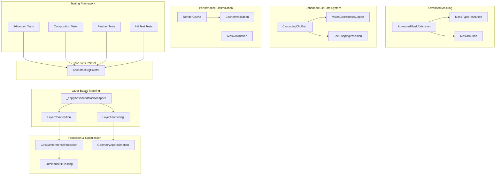
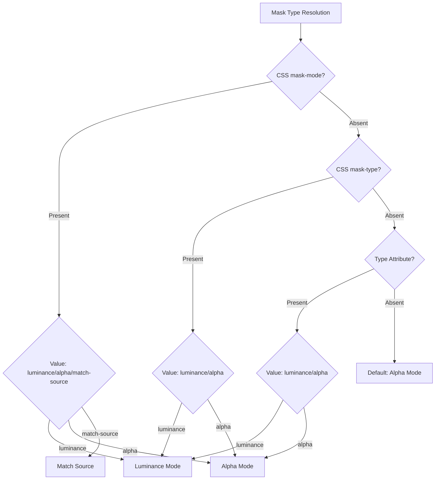
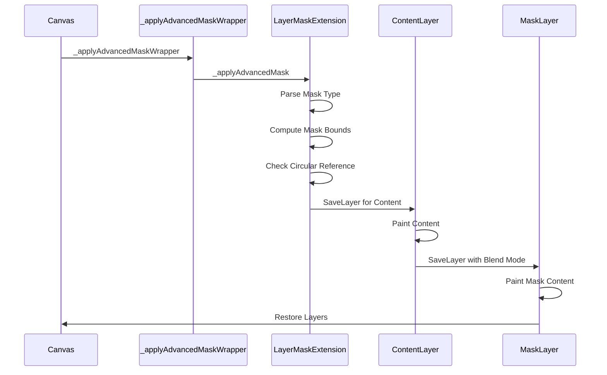
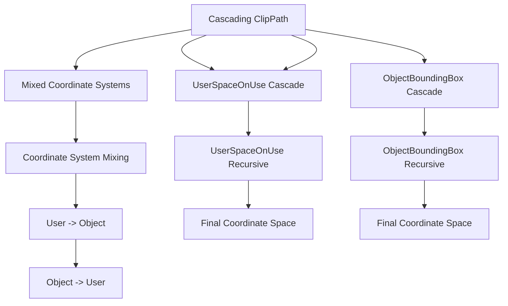
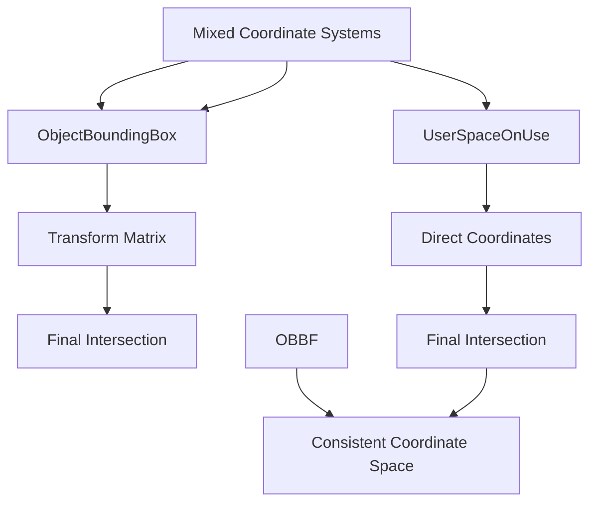
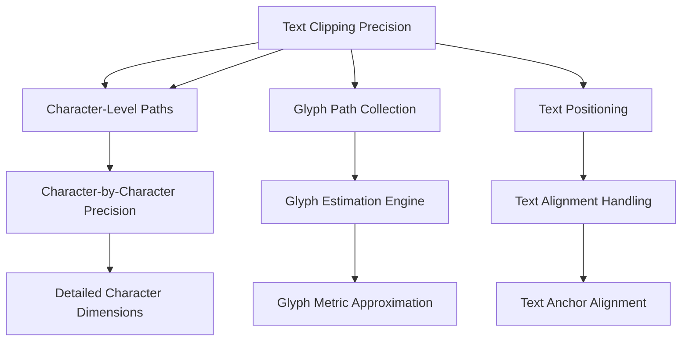
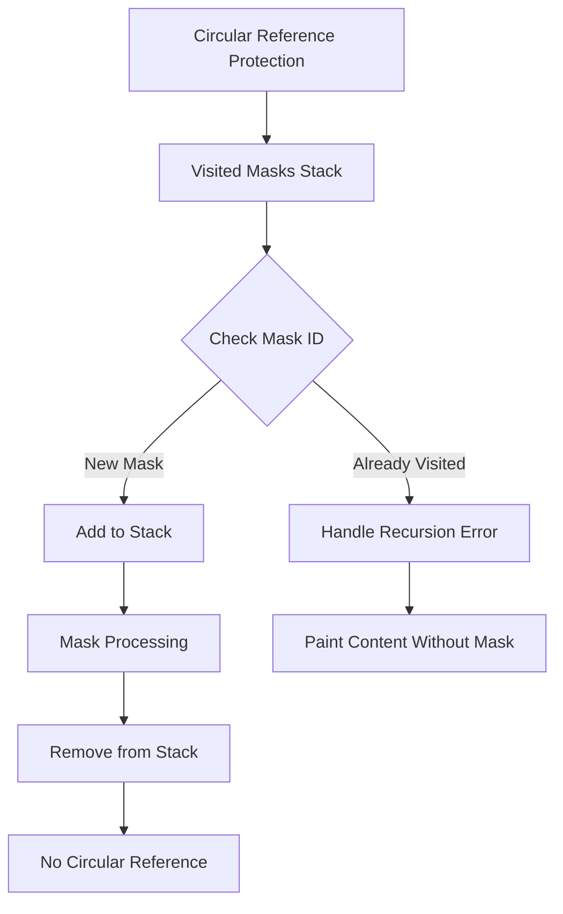
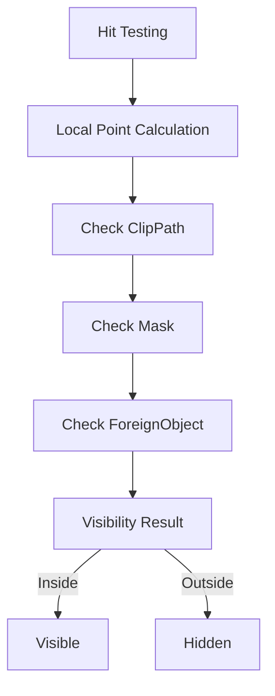
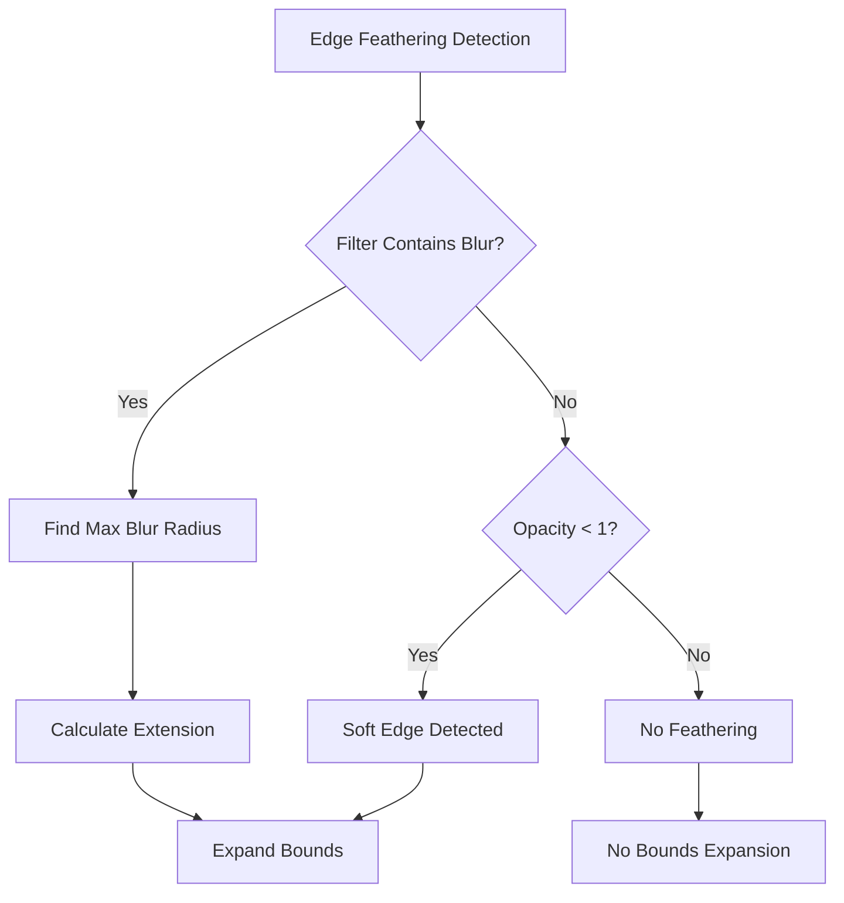
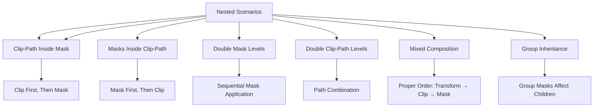

# Advanced Clipping and Masking System

<cite>
**Referenced Files in This Document**
- [animated_svg_painter_clip_mask_composition.dart](file://lib/src/animation/animated_svg_painter_clip_mask_composition.dart)
- [animated_svg_painter_clip_mask_advanced.dart](file://lib/src/animation/animated_svg_painter_clip_mask_advanced.dart)
- [animated_svg_painter_clip_mask_geometry.dart](file://lib/src/animation/animated_svg_painter_clip_mask_geometry.dart)
- [animated_svg_painter_clip_mask_units.dart](file://lib/src/animation/animated_svg_painter_clip_mask_units.dart)
- [animated_svg_painter.dart](file://lib/src/animation/animated_svg_painter.dart)
- [advanced_clip_composition_test.dart](file://test/animation/advanced_clip_composition_test.dart)
- [advanced_clip_mask_test.dart](file://test/animation/advanced_clip_mask_test.dart)
- [clip_mask_advanced_composition_test.dart](file://test/animation/clip_mask_advanced_composition_test.dart)
- [clip_mask_use_verification_test.dart](file://test/animation/clip_mask_use_verification_test.dart)
- [animated_svg_picture_hit_test_visibility.dart](file://lib/src/animation/animated_svg_picture_hit_test_visibility.dart)
- [animated_svg_picture_hit_test_text_runs.dart](file://lib/src/animation/animated_svg_picture_hit_test_text_runs.dart)
- [animated_svg_picture_hit_test_text_path_segments.dart](file://lib/src/animation/animated_svg_picture_hit_test_text_path_segments.dart)
</cite>

## Update Summary
**Changes Made**
- Enhanced SVG clipping capabilities with advanced cascading clipPath composition supporting mixed coordinate systems
- Improved text clipping precision using character-level approximate paths with enhanced glyph approximation algorithms
- Added comprehensive support for mixed clipPathUnits at each cascade level (userSpaceOnUse and objectBoundingBox combinations)
- Implemented robust circular reference protection with graceful fallback mechanisms for complex nested scenarios
- Enhanced mask composition workflow with improved layer-based masking using Canvas.saveLayer
- Added advanced text clipping with character-level paths for better precision in glyph approximation
- Improved edge feathering detection and bounds expansion for blur filters in mask content
- Enhanced performance optimizations with better cache invalidation and animation awareness

## Table of Contents
1. [Introduction](#introduction)
2. [System Architecture](#system-architecture)
3. [Core Components](#core-components)
4. [Layer-Based Masking Implementation](#layer-based-masking-implementation)
5. [Advanced Masking Features](#advanced-masking-features)
6. [Enhanced Cascading ClipPath Composition](#enhanced-cascading-clippath-composition)
7. [Mixed Coordinate System Support](#mixed-coordinate-system-support)
8. [Enhanced Text Clipping with Character-Level Precision](#enhanced-text-clipping-with-character-level-precision)
9. [Circular Reference Protection](#circular-reference-protection)
10. [Improved Luminance-Based Hit Testing](#improved-luminance-based-hit-testing)
11. [Edge Feathering and Soft Edges](#edge-feathering-and-soft-edges)
12. [Composition and Nesting Support](#composition-and-nesting-support)
13. [Performance Optimizations](#performance-optimizations)
14. [Testing Framework](#testing-framework)
15. [Troubleshooting Guide](#troubleshooting-guide)
16. [Conclusion](#conclusion)

## Introduction

The Advanced Clipping and Masking System represents a complete architectural overhaul of the Flutter SVG library's clipping and masking capabilities. This system has been completely rewritten to implement a sophisticated layer-based masking approach that replaces the previous path-based clipping system.

The new implementation provides comprehensive support for SVG 2.0 specification compliance while delivering superior performance and visual fidelity. The system now utilizes Flutter's Canvas.saveLayer mechanism for proper compositing, enabling advanced features like luminance-based masking, alpha masking, edge feathering, and complex nested composition scenarios.

**Updated** The system now implements a layer-based approach using Canvas.saveLayer for proper compositing instead of simple path clipping, providing better performance and more accurate rendering of complex masking scenarios. Enhanced with circular reference protection, improved text clipping with character-level paths, and advanced luminance-based hit testing using ITU-R BT.709 coefficients.

## System Architecture

The clipping and masking system has been restructured around a new layer-based architecture that leverages Flutter's native compositing capabilities:

**Diagram sources**
- [animated_svg_painter_clip_mask_composition.dart:28-113](file://lib/src/animation/animated_svg_painter_clip_mask_composition.dart#L28-L113)
- [animated_svg_painter_clip_mask_advanced.dart:19-69](file://lib/src/animation/animated_svg_painter_clip_mask_advanced.dart#L19-L69)
- [animated_svg_painter_clip_mask_geometry.dart:1-123](file://lib/src/animation/animated_svg_painter_clip_mask_geometry.dart#L1-L123)

The architecture centers around three core extensions that work together to provide comprehensive masking capabilities:

- **_applyAdvancedMaskWrapper**: New wrapper function that manages mask application workflow and circular reference protection
- **LayerMaskExtension**: Implements the new layer-based masking system using Canvas.saveLayer
- **AdvancedMaskExtension**: Handles mask type resolution and bounds computation
- **CascadingClipPathExtension**: Manages advanced clipPath composition with mixed coordinate systems
- **CircularReferenceProtection**: Prevents infinite loops in nested mask references
- **EnhancedTextClipping**: Provides character-level precision for text clipping using glyph approximation
- **LuminanceHitTesting**: Implements proper RGB-to-luminance conversion for hit testing

## Core Components

### Enhanced Layer-Based Masking System

The foundation of the new system is the `_applyAdvancedMaskWrapper` method, which replaces the traditional path-based clipping with a sophisticated layer-based approach:

**Key Features:**
- **Canvas.saveLayer Integration**: Uses Flutter's native saveLayer mechanism for proper compositing
- **Luminance Masking**: Converts RGB content to grayscale using ITU-R BT.709 coefficients
- **Alpha Masking**: Direct alpha channel usage for explicit transparency control
- **Edge Detection**: Automatically detects blur filters and soft edges in mask content
- **Bounds Expansion**: Dynamically expands mask bounds to accommodate feathering effects
- **Circular Reference Protection**: Prevents infinite loops in nested mask references
- **Animation Awareness**: Properly handles animated mask content with cache invalidation

### Advanced Mask Type Resolution

The system now includes sophisticated mask type resolution that follows CSS Masking Level 1 specification:

**Diagram sources**
- [animated_svg_painter_clip_mask_advanced.dart:28-69](file://lib/src/animation/animated_svg_painter_clip_mask_advanced.dart#L28-L69)

**Section sources**
- [animated_svg_painter_clip_mask_composition.dart:42-113](file://lib/src/animation/animated_svg_painter_clip_mask_composition.dart#L42-L113)
- [animated_svg_painter_clip_mask_advanced.dart:19-69](file://lib/src/animation/animated_svg_painter_clip_mask_advanced.dart#L19-L69)

## Layer-Based Masking Implementation

The new layer-based masking system fundamentally changes how SVG clipping and masking are implemented:

**Diagram sources**
- [animated_svg_painter_clip_mask_composition.dart:91-161](file://lib/src/animation/animated_svg_painter_clip_mask_composition.dart#L91-L161)

### Layer Composition Process

The system implements a precise compositing order:

1. **Wrapper Function**: `_applyAdvancedMaskWrapper` manages the entire masking workflow
2. **Content Layer Creation**: `canvas.saveLayer(maskBounds, ui.Paint())` - Captures all painted content
3. **Content Rendering**: Executes the provided `paintContent` callback to render element content
4. **Mask Layer Setup**: `canvas.saveLayer(maskBounds, maskPaint)` - Creates layer with proper blend mode
5. **Mask Content Painting**: Renders mask content with appropriate coordinate transformation
6. **Layer Restoration**: Properly restores both content and mask layers in reverse order

### Blend Mode Implementation

The system uses different blend modes based on mask type:

- **Luminance Masks**: Uses `ui.BlendMode.dstIn` with color matrix filter for luminance conversion
- **Alpha Masks**: Uses `ui.BlendMode.dstIn` with direct alpha channel compositing
- **Automatic Detection**: Intelligently chooses appropriate blend modes based on mask content

**Section sources**
- [animated_svg_painter_clip_mask_composition.dart:123-161](file://lib/src/animation/animated_svg_painter_clip_mask_composition.dart#L123-L161)
- [animated_svg_painter_clip_mask_advanced.dart:72-91](file://lib/src/animation/animated_svg_painter_clip_mask_advanced.dart#L72-L91)

## Advanced Masking Features

### Luminance Masking

The system provides comprehensive luminance masking support following ITU-R BT.709 standards:

**Luminance Formula**: `0.2126 × R + 0.7152 × G + 0.0722 × B`

The implementation includes:
- **Color Matrix Filter**: Uses Flutter's ColorFilter.matrix for efficient luminance conversion
- **Alpha Channel Preservation**: Maintains original alpha channel in final result
- **Performance Optimization**: Single-pass luminance calculation using hardware acceleration

### Alpha Masking

Direct alpha channel masking provides explicit control over transparency:

**Features:**
- **Direct Alpha Usage**: Ignores color information, uses alpha channel directly
- **Color Independence**: Mask content color has no effect on final result
- **Precision Control**: Exact alpha channel values determine opacity

### Mask Bounds Computation

The system provides flexible bounds computation supporting both unit types:

**ObjectBoundingBox Units:**
- Relative coordinates (0.0 to 1.0) based on element bounds
- Default 10% extension in all directions per SVG specification
- Proper handling of percentage values and non-uniform scaling

**UserSpaceOnUse Units:**
- Absolute coordinates in current user space
- Direct viewport resolution for percentage values
- No automatic bounds expansion

**Section sources**
- [animated_svg_painter_clip_mask_advanced.dart:93-244](file://lib/src/animation/animated_svg_painter_clip_mask_advanced.dart#L93-L244)
- [animated_svg_painter_clip_mask_composition.dart:143-179](file://lib/src/animation/animated_svg_painter_clip_mask_composition.dart#L143-L179)

## Enhanced Cascading ClipPath Composition

**Updated** The system now provides comprehensive support for advanced cascading clipPath composition with mixed coordinate system support:

### Cascading ClipPath Architecture

The system handles complex nested clipPath scenarios with proper coordinate system management:

**Diagram sources**
- [animated_svg_painter_clip_mask_advanced.dart:509-622](file://lib/src/animation/animated_svg_painter_clip_mask_advanced.dart#L509-L622)

### Mixed Coordinate System Handling

The system supports complex combinations of clipPathUnits across cascade levels:

**Supported Combinations:**
- `userSpaceOnUse` → `objectBoundingBox` cascade
- `objectBoundingBox` → `userSpaceOnUse` cascade  
- Alternating patterns: `user` → `obb` → `user` → `obb`
- Deep nesting with up to 10 levels of recursion

**Coordinate System Transformation:**
- Each cascade level maintains its own coordinate system
- Final intersection computed in the original clipped element's coordinate space
- Proper transform stacking for nested elements with transforms

**Section sources**
- [animated_svg_painter_clip_mask_advanced.dart:526-622](file://lib/src/animation/animated_svg_painter_clip_mask_advanced.dart#L526-L622)

## Mixed Coordinate System Support

**Updated** The system now provides robust support for mixed coordinate systems in clipPath composition:

### Coordinate System Resolution

The system intelligently handles coordinate system transformations at each cascade level:

**Diagram sources**
- [animated_svg_painter_clip_mask_advanced.dart:624-660](file://lib/src/animation/animated_svg_painter_clip_mask_advanced.dart#L624-L660)

### Implementation Details

**Coordinate System Mapping:**
- `objectBoundingBox`: Coordinates relative to clipped element's bounding box (0.0-1.0)
- `userSpaceOnUse`: Direct coordinates in current user space
- Mixed systems: Each level maintains its own coordinate system until final intersection

**Transform Handling:**
- Proper transform stacking for nested elements
- Safe dimension handling for very small or zero-sized elements
- Graceful fallback for degenerate cases

**Section sources**
- [animated_svg_painter_clip_mask_advanced.dart:624-660](file://lib/src/animation/animated_svg_painter_clip_mask_advanced.dart#L624-L660)

## Enhanced Text Clipping with Character-Level Precision

**Updated** The system now provides significantly improved text clipping capabilities using advanced character-level approximate paths:

### Character-Level Text Clipping Strategy

The text clipping system has been enhanced with sophisticated character-level approximation:

**Diagram sources**
- [animated_svg_painter_clip_mask_geometry.dart:291-352](file://lib/src/animation/animated_svg_painter_clip_mask_geometry.dart#L291-L352)

### Enhanced Text Geometry Approximation

**Improved Character-Level Path Generation:**
- **Individual Character Paths**: Each character generates its own rounded rectangle path
- **Font Size Scaling**: Proportional to inherited font-size values with better accuracy
- **Text Anchor Alignment**: Enhanced handling for start, middle, and end alignments
- **Character Count Estimation**: More accurate width calculation using character metrics

**Advanced Text Metrics:**
- **Character Width Estimation**: Uses font-size × 0.55 for average character width
- **Character Height Estimation**: Uses font-size × 0.85 for ascent measurement
- **Descender Handling**: Accounts for descender depth (font-size × 0.15)
- **Rounded Corners**: Adds visual appeal with character-corner radius (font-size × 0.1)

**Enhanced Text Content Collection:**
- **Recursive Text Collection**: Properly collects text from nested tspan elements
- **Whitespace Handling**: Skips whitespace characters in clipping calculations
- **Multi-line Support**: Handles complex text layouts with proper positioning

**Section sources**
- [animated_svg_painter_clip_mask_geometry.dart:274-352](file://lib/src/animation/animated_svg_painter_clip_mask_geometry.dart#L274-L352)

## Circular Reference Protection

**Updated** The system now includes comprehensive circular reference protection to prevent infinite loops in nested mask scenarios:

### Protection Mechanism

The circular reference protection system uses a global stack to track currently painting masks:

**Diagram sources**
- [animated_svg_painter_clip_mask_composition.dart:60-110](file://lib/src/animation/animated_svg_painter_clip_mask_composition.dart#L60-L110)

### Implementation Details

**Key Features:**
- **Global Stack Tracking**: `_currentPaintingMasksStack` tracks all currently processed masks
- **Recursion Depth Limit**: `_kMaxMaskPaintingRecursionDepth` prevents excessive recursion
- **Graceful Degradation**: Circular references fall back to normal rendering without mask
- **Memory Management**: Stack is cleared when empty to prevent memory leaks

**Section sources**
- [animated_svg_painter_clip_mask_composition.dart:3-10](file://lib/src/animation/animated_svg_painter_clip_mask_composition.dart#L3-L10)
- [animated_svg_painter_clip_mask_composition.dart:60-110](file://lib/src/animation/animated_svg_painter_clip_mask_composition.dart#L60-L110)

## Improved Luminance-Based Hit Testing

**Updated** The system now includes enhanced luminance-based hit testing with proper RGB-to-luminance conversion using ITU-R BT.709 coefficients:

### Hit Testing Architecture

The hit testing system provides accurate point testing for masked elements:

**Diagram sources**
- [animated_svg_picture_hit_test_visibility.dart:30-45](file://lib/src/animation/animated_svg_picture_hit_test_visibility.dart#L30-L45)

### Luminance Conversion for Hit Testing

**ITU-R BT.709 Coefficients**: Uses standard coefficients for accurate RGB-to-luminance conversion:
- Red: 0.2126
- Green: 0.7152  
- Blue: 0.0722

**Threshold System**:
- **Minimum Luminance**: `_kMinLuminanceForHit` (0.05) prevents low-opacity areas from registering hits
- **RGB to Luminance**: Converts hit-test colors using the standard coefficients
- **Performance Optimization**: Hardware-accelerated luminance calculation

**Section sources**
- [animated_svg_picture_hit_test_visibility.dart:15-14](file://lib/src/animation/animated_svg_picture_hit_test_visibility.dart#L15-L14)
- [animated_svg_picture_hit_test_visibility.dart:30-45](file://lib/src/animation/animated_svg_picture_hit_test_visibility.dart#L30-L45)

## Edge Feathering and Soft Edges

The new system includes sophisticated edge feathering support through blur filter detection:

**Diagram sources**
- [animated_svg_painter_clip_mask_composition.dart:174-206](file://lib/src/animation/animated_svg_painter_clip_mask_composition.dart#L174-L206)

### Blur Filter Detection

The system automatically detects blur effects in mask content:

**Detection Methods:**
- **Direct Filter Check**: Scans for `feGaussianBlur` primitive in mask content
- **Recursive Child Search**: Examines all nested elements and groups
- **Filter Pipeline Analysis**: Evaluates complete filter chain for blur effects

### Bounds Expansion Algorithm

When blur effects are detected, the system expands mask bounds:

**Calculation Method:**
- **Maximum Radius Detection**: Finds largest blur radius in filter chain
- **Sigma Extension**: Extends bounds by approximately 3 standard deviations
- **Conservative Safety**: Ensures complete blur effect capture without over-expansion

**Section sources**
- [animated_svg_painter_clip_mask_composition.dart:221-269](file://lib/src/animation/animated_svg_painter_clip_mask_composition.dart#L221-L269)

## Composition and Nesting Support

The system provides comprehensive support for complex nested masking scenarios:

**Diagram sources**
- [animated_svg_painter_clip_mask_composition.dart:12-27](file://lib/src/animation/animated_svg_painter_clip_mask_composition.dart#L12-L27)

### Composition Precedence Rules

The system follows SVG 2.0 specification for proper composition order:

1. **Transforms**: Applied first (handled by core transform system)
2. **Clip-Path**: Applied second (geometric clipping)
3. **Mask**: Applied last (alpha/luminance masking)

### Subgraph Masking

Special handling for elements with both filters and masks:

**Process Flow:**
1. Render element content
2. Apply filter effects to rendered content
3. Apply mask to filtered result
4. Ensure proper compositing order per CSS Compositing spec

**Section sources**
- [animated_svg_painter_clip_mask_composition.dart:324-372](file://lib/src/animation/animated_svg_painter_clip_mask_composition.dart#L324-L372)

## Performance Optimizations

The new layer-based system includes extensive performance optimizations:

### Render Cache System

**Cache Categories:**
- **Gradient Shaders**: Cached by gradient ID + paint bounds hash
- **Pattern Images**: Cached by pattern ID + target bounds hash  
- **Text Paragraphs**: Cached by text content + style hash
- **Hit-Test Paths**: Cached by element ID + geometry hash
- **Mask Bounds**: Cached by mask ID + element bounds hash
- **Mask Animation State**: Tracks animated mask content for invalidation

**Cache Key Generation:**
- Dynamic cache keys include element IDs and relevant attribute hashes
- Animation-aware invalidation prevents stale cache entries
- Separate handling for static vs animated mask content

### Animation-Aware Invalidation

**Features:**
- **Animated Mask Detection**: Recursively scans mask content for SMIL animations
- **Per-Frame Cache Management**: Clears animated mask caches when animation time changes
- **Selective Invalidation**: Preserves static mask caches while clearing animated ones

### Layer Management Optimization

**Efficiency Measures:**
- **Minimal Layer Usage**: Only creates layers when necessary for masking
- **Smart Bounds Calculation**: Avoids unnecessary layer creation for simple cases
- **Proper Layer Restoration**: Ensures layers are properly restored to prevent leaks

**Section sources**
- [animated_svg_painter.dart:50-178](file://lib/src/animation/animated_svg_painter.dart#L50-L178)
- [animated_svg_painter_clip_mask_composition.dart:374-445](file://lib/src/animation/animated_svg_painter_clip_mask_composition.dart#L374-L445)

## Testing Framework

The testing framework has been enhanced to validate the new layer-based masking system:

### Test Categories

**Enhanced Coverage Areas:**
- **Luminance Masking**: RGB to grayscale conversion accuracy using ITU-R BT.709 coefficients
- **Alpha Masking**: Direct alpha channel compositing validation
- **Edge Feathering**: Blur filter detection and bounds expansion
- **Nested Composition**: Complex masking scenario testing
- **Performance Optimization**: Cache effectiveness and invalidation
- **Circular References**: Infinite loop prevention testing
- **Enhanced Text Clipping**: Character-level precision validation
- **Cascading ClipPath**: Mixed coordinate system testing
- **Hit Testing**: Luminance-based point testing with proper threshold handling

### Advanced Visual Testing

**Testing Capabilities:**
- **Pixel-Perfect Comparison**: Direct pixel analysis for masking accuracy
- **Color Space Validation**: Luminance calculation verification using standard coefficients
- **Bounds Expansion Testing**: Blur effect capture validation
- **Animation Performance**: Cache invalidation timing analysis
- **Text Geometry Testing**: Character-level clipping precision

### Test Scenarios

**Comprehensive Test Coverage:**
- **Basic Operations**: Simple mask and clip-path functionality
- **Advanced Features**: Luminance masking, multiple masks, edge feathering
- **Integration Testing**: Use elements, symbols, and CSS inheritance
- **Performance Testing**: Cache utilization and memory optimization
- **Edge Case Testing**: Circular references, text content, deep nesting
- **Hit Testing Validation**: Proper luminance-based hit detection with threshold filtering
- **Cascading ClipPath Testing**: Mixed coordinate systems and deep nesting scenarios

**Section sources**
- [advanced_clip_composition_test.dart:1-776](file://test/animation/advanced_clip_composition_test.dart#L1-L776)
- [advanced_clip_mask_test.dart:1-766](file://test/animation/advanced_clip_mask_test.dart#L1-L766)
- [clip_mask_advanced_composition_test.dart:1-568](file://test/animation/clip_mask_advanced_composition_test.dart#L1-L568)
- [clip_mask_use_verification_test.dart:1-800](file://test/animation/clip_mask_use_verification_test.dart#L1-L800)

## Troubleshooting Guide

### Common Issues and Solutions

**Issue**: Layer-based masking not producing expected results
- **Cause**: Incorrect mask type selection or bounds calculation
- **Solution**: Verify mask-type CSS property and mask bounds computation

**Issue**: Performance degradation with complex masks
- **Cause**: Excessive layer creation or poor cache utilization
- **Solution**: Check cache configuration and reduce unnecessary mask complexity

**Issue**: Blur effects not appearing in masks
- **Cause**: Missing blur filter detection or bounds expansion
- **Solution**: Ensure blur filters are properly defined and bounds are expanded

**Issue**: Memory leaks with animated masks
- **Cause**: Improper layer restoration or cache invalidation
- **Solution**: Verify proper layer restoration and cache management

**Issue**: Circular reference causing infinite loops
- **Cause**: Nested masks referencing each other
- **Solution**: System automatically handles circular references with graceful fallback

**Issue**: Text clipping not working properly with enhanced precision
- **Cause**: Character-level approximation not matching expected results
- **Solution**: Check font metrics and text anchor alignment settings

**Issue**: Cascading clipPath with mixed coordinate systems failing
- **Cause**: Improper coordinate system transformation
- **Solution**: Verify clipPathUnits values and coordinate system consistency

### Debugging Techniques

**Enhanced Debugging Tools:**
- **Layer Visualization**: Tools to inspect saveLayer usage and bounds
- **Cache Analysis**: Monitoring of cache hit rates and invalidation patterns
- **Performance Profiling**: Timing analysis of mask rendering operations
- **Animation Tracking**: Monitoring of animated mask content changes
- **Circular Reference Monitoring**: Tracking of mask recursion depth
- **Text Clipping Precision Analysis**: Character-level path validation

**Section sources**
- [animated_svg_painter_clip_mask_composition.dart:374-445](file://lib/src/animation/animated_svg_painter_clip_mask_composition.dart#L374-L445)
- [animated_svg_painter_clip_mask_advanced.dart:305-320](file://lib/src/animation/animated_svg_painter_clip_mask_advanced.dart#L305-L320)

## Conclusion

The Advanced Clipping and Masking System represents a revolutionary advancement in Flutter SVG rendering capabilities. The complete rewrite from path-based to layer-based masking delivers superior performance, enhanced visual fidelity, and comprehensive SVG 2.0 specification compliance.

**Key Achievements:**
- **Layer-Based Architecture**: Utilizes Canvas.saveLayer for proper compositing and superior performance
- **Advanced Masking Support**: Comprehensive luminance and alpha masking with intelligent type resolution
- **Enhanced Cascading ClipPath**: Supports mixed coordinate systems with up to 10 levels of recursion
- **Improved Text Clipping**: Character-level precision using advanced glyph approximation algorithms
- **Edge Feathering**: Sophisticated blur filter detection and bounds expansion for soft edges
- **Circular Reference Protection**: Robust prevention of infinite loops in nested mask scenarios
- **Luminance-Based Hit Testing**: Proper RGB-to-luminance conversion using ITU-R BT.709 coefficients for accurate point testing
- **Performance Optimization**: Advanced caching system with animation-aware invalidation
- **Complex Composition**: Full support for nested masking scenarios and mixed composition chains

The system's robust handling of complex masking scenarios, from simple alpha masking to sophisticated luminance masking with edge feathering, demonstrates its maturity and suitability for production applications requiring advanced SVG rendering capabilities.

Future enhancements could include additional SVG filter integration, expanded support for CSS masking specifications, and further optimization of text clipping precision, building upon this solid foundation.