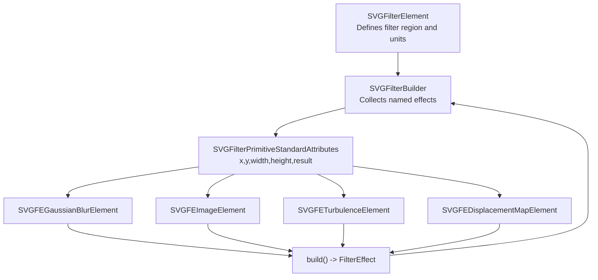
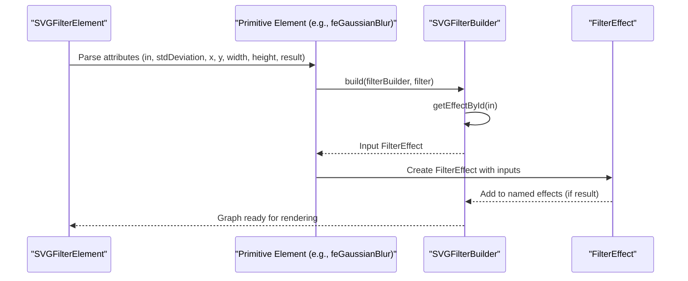
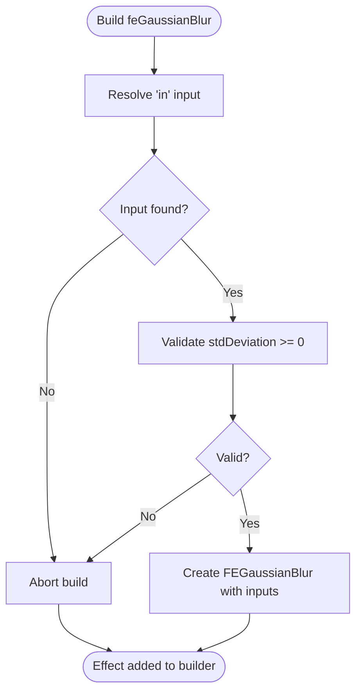
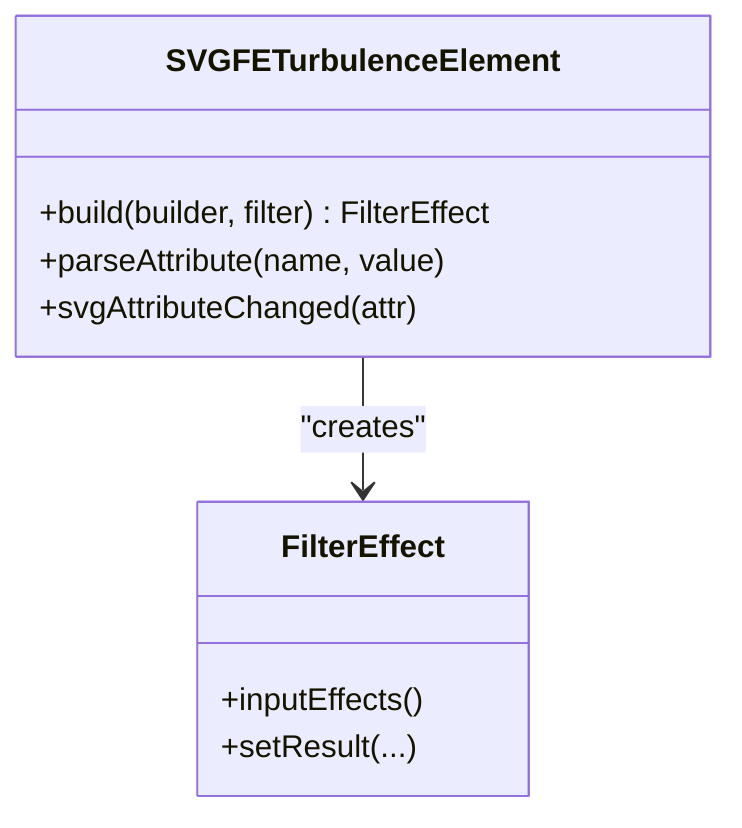
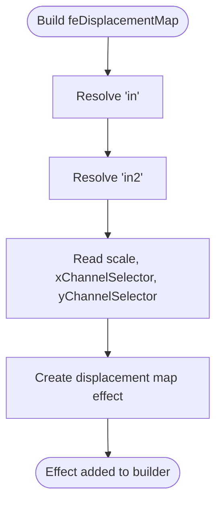
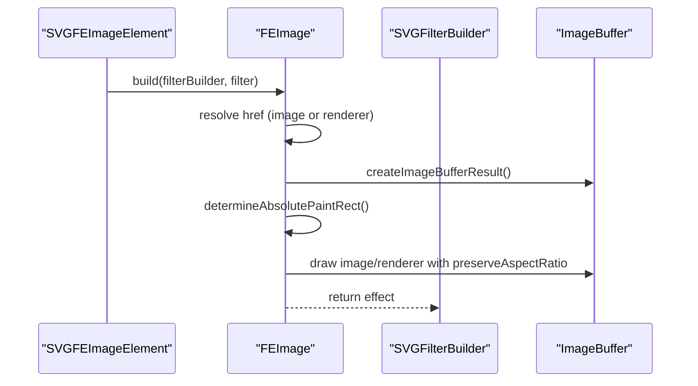
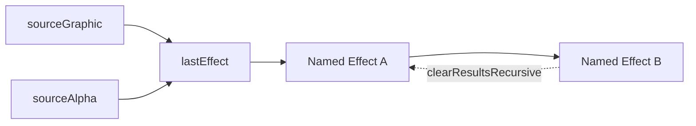

# Built-in Filter Primitives

<cite>
**Referenced Files in This Document**
- [SVGFilter.cpp](file://blink-b87d44f-Source-core-svg/graphics/filters/SVGFilter.cpp)
- [SVGFilter.h](file://blink-b87d44f-Source-core-svg/graphics/filters/SVGFilter.h)
- [SVGFilterBuilder.cpp](file://blink-b87d44f-Source-core-svg/graphics/filters/SVGFilterBuilder.cpp)
- [SVGFilterBuilder.h](file://blink-b87d44f-Source-core-svg/graphics/filters/SVGFilterBuilder.h)
- [SVGFilterElement.cpp](file://blink-b87d44f-Source-core-svg/SVGFilterElement.cpp)
- [SVGFilterElement.h](file://blink-b87d44f-Source-core-svg/SVGFilterElement.h)
- [SVGFilterPrimitiveStandardAttributes.cpp](file://blink-b87d44f-Source-core-svg/SVGFilterPrimitiveStandardAttributes.cpp)
- [SVGFilterPrimitiveStandardAttributes.h](file://blink-b87d44f-Source-core-svg/SVGFilterPrimitiveStandardAttributes.h)
- [SVGFEImageElement.cpp](file://blink-b87d44f-Source-core-svg/SVGFEImageElement.cpp)
- [SVGFEImageElement.h](file://blink-b87d44f-Source-core-svg/SVGFEImageElement.h)
- [SVGFEImage.cpp](file://blink-b87d44f-Source-core-svg/graphics/filters/SVGFEImage.cpp)
- [SVGFEImage.h](file://blink-b87d44f-Source-core-svg/graphics/filters/SVGFEImage.h)
- [SVGFEGaussianBlurElement.cpp](file://blink-b87d44f-Source-core-svg/SVGFEGaussianBlurElement.cpp)
- [SVGFEGaussianBlurElement.h](file://blink-b87d44f-Source-core-svg/SVGFEGaussianBlurElement.h)
- [SVGFEDisplacementMapElement.cpp](file://blink-b87d44f-Source-core-svg/SVGFEDisplacementMapElement.cpp)
- [SVGFEDisplacementMapElement.h](file://blink-b87d44f-Source-core-svg/SVGFEDisplacementMapElement.h)
- [SVGFETurbulenceElement.cpp](file://blink-b87d44f-Source-core-svg/SVGFETurbulenceElement.cpp)
- [SVGFETurbulenceElement.h](file://blink-b87d44f-Source-core-svg/SVGFETurbulenceElement.h)
</cite>

## Update Summary
**Changes Made**
- Added comprehensive documentation for three new filter primitive implementations: displacement map (feDisplacementMap), image (feImage), and turbulence (feTurbulence)
- Updated primitive analysis sections to include detailed specifications for all four major filter primitives
- Enhanced animation support documentation with specific examples for each primitive type
- Expanded edge handling documentation covering comprehensive error scenarios
- Updated architecture diagrams to reflect the complete filter primitive ecosystem

## Table of Contents
1. [Introduction](#introduction)
2. [Project Structure](#project-structure)
3. [Core Components](#core-components)
4. [Architecture Overview](#architecture-overview)
5. [Detailed Component Analysis](#detailed-component-analysis)
6. [Dependency Analysis](#dependency-analysis)
7. [Performance Considerations](#performance-considerations)
8. [Troubleshooting Guide](#troubleshooting-guide)
9. [Conclusion](#conclusion)

## Introduction
This document describes the built-in SVG filter primitives implemented in the Blink-based engine. It focuses on the core filter pipeline, primitive types, attributes, chaining semantics, and runtime behavior. It covers blur, turbulence, displacement mapping, and image primitives, and explains how primitives connect via inputs and results, how units and scales are applied, and how animations are integrated. Practical combinations, performance considerations, and troubleshooting guidance are included.

## Project Structure
The filter system is composed of:
- Filter container and builder: define the filter region, coordinate systems, and collect named effects.
- Primitive base class: standard attributes (x, y, width, height, result) and renderer integration.
- Individual primitive elements: parse attributes, build FilterEffect instances, and integrate with the filter graph.
- Primitive implementations: low-level rasterization and GPU-backed image filters.

**Diagram sources**
- [SVGFilterElement.cpp:187-190](file://blink-b87d44f-Source-core-svg/SVGFilterElement.cpp#L187-L190)
- [SVGFilterBuilder.cpp:31-50](file://blink-b87d44f-Source-core-svg/graphics/filters/SVGFilterBuilder.cpp#L31-L50)
- [SVGFilterPrimitiveStandardAttributes.cpp:139-142](file://blink-b87d44f-Source-core-svg/SVGFilterPrimitiveStandardAttributes.cpp#L139-L142)
- [SVGFEGaussianBlurElement.cpp:128-141](file://blink-b87d44f-Source-core-svg/SVGFEGaussianBlurElement.cpp#L128-L141)
- [SVGFEImageElement.cpp:200-205](file://blink-b87d44f-Source-core-svg/SVGFEImageElement.cpp#L200-L205)
- [SVGFETurbulenceElement.cpp](file://blink-b87d44f-Source-core-svg/SVGFETurbulenceElement.cpp)
- [SVGFEDisplacementMapElement.cpp](file://blink-b87d44f-Source-core-svg/SVGFEDisplacementMapElement.cpp)

**Section sources**
- [SVGFilter.cpp:28-55](file://blink-b87d44f-Source-core-svg/graphics/filters/SVGFilter.cpp#L28-L55)
- [SVGFilter.h:35-51](file://blink-b87d44f-Source-core-svg/graphics/filters/SVGFilter.h#L35-L51)
- [SVGFilterBuilder.cpp:31-104](file://blink-b87d44f-Source-core-svg/graphics/filters/SVGFilterBuilder.cpp#L31-L104)
- [SVGFilterBuilder.h:35-79](file://blink-b87d44f-Source-core-svg/graphics/filters/SVGFilterBuilder.h#L35-L79)
- [SVGFilterElement.cpp:187-229](file://blink-b87d44f-Source-core-svg/SVGFilterElement.cpp#L187-L229)
- [SVGFilterElement.h:38-76](file://blink-b87d44f-Source-core-svg/SVGFilterElement.h#L38-L76)
- [SVGFilterPrimitiveStandardAttributes.cpp:50-156](file://blink-b87d44f-Source-core-svg/SVGFilterPrimitiveStandardAttributes.cpp#L50-L156)
- [SVGFilterPrimitiveStandardAttributes.h:38-76](file://blink-b87d44f-Source-core-svg/SVGFilterPrimitiveStandardAttributes.h#L38-L76)

## Core Components
- SVGFilter: encapsulates the filter region, bounding box mode, and scale application for effect coordinates.
- SVGFilterBuilder: maintains built-in effects (sourceGraphic, sourceAlpha), named effects, and inter-effect references for dependency tracking and result clearing.
- SVGFilterElement: defines filter geometry (x, y, width, height), units (filterUnits, primitiveUnits), resolution hints (filterRes), and validates/updates child primitives.
- SVGFilterPrimitiveStandardAttributes: shared base for primitives with x, y, width, height, result attributes and renderer integration.

Key behaviors:
- Coordinate scaling: horizontal and vertical values are scaled by target bounding box when effectBBoxMode is enabled.
- Effect lookup: primitives reference inputs by ID; empty ID defaults to last effect or sourceGraphic.
- Dependency graph: builder tracks which effects depend on others to clear cached results safely.

**Section sources**
- [SVGFilter.cpp:38-50](file://blink-b87d44f-Source-core-svg/graphics/filters/SVGFilter.cpp#L38-L50)
- [SVGFilterBuilder.cpp:38-65](file://blink-b87d44f-Source-core-svg/graphics/filters/SVGFilterBuilder.cpp#L38-L65)
- [SVGFilterBuilder.cpp:67-104](file://blink-b87d44f-Source-core-svg/graphics/filters/SVGFilterBuilder.cpp#L67-L104)
- [SVGFilterElement.cpp:121-174](file://blink-b87d44f-Source-core-svg/SVGFilterElement.cpp#L121-L174)
- [SVGFilterPrimitiveStandardAttributes.cpp:75-121](file://blink-b87d44f-Source-core-svg/SVGFilterPrimitiveStandardAttributes.cpp#L75-L121)

## Architecture Overview
The filter pipeline connects DOM elements to FilterEffect instances and composes them into a dependency graph. Primitives declare inputs (via in attributes) and optional result names. The builder resolves IDs to effects and wires inputs accordingly.

**Diagram sources**
- [SVGFilterElement.cpp:187-229](file://blink-b87d44f-Source-core-svg/SVGFilterElement.cpp#L187-L229)
- [SVGFEGaussianBlurElement.cpp:128-141](file://blink-b87d44f-Source-core-svg/SVGFEGaussianBlurElement.cpp#L128-L141)
- [SVGFilterBuilder.cpp:52-65](file://blink-b87d44f-Source-core-svg/graphics/filters/SVGFilterBuilder.cpp#L52-L65)

## Detailed Component Analysis

### Blur (feGaussianBlur)
- Purpose: Applies Gaussian blur with separate standard deviations for X and Y axes.
- Inputs:
  - in: input image (defaults to previous effect or sourceGraphic if empty).
- Parameters:
  - stdDeviation: number or pair of numbers; negative values are rejected.
  - x, y, width, height, result: standard primitive attributes.
- Behavior:
  - Validates non-negative standard deviations.
  - Creates a blur effect and attaches the named input.
- Animation:
  - Animated properties include stdDeviationX/Y and standard attributes.

**Diagram sources**
- [SVGFEGaussianBlurElement.cpp:128-141](file://blink-b87d44f-Source-core-svg/SVGFEGaussianBlurElement.cpp#L128-L141)
- [SVGFEGaussianBlurElement.cpp:135-137](file://blink-b87d44f-Source-core-svg/SVGFEGaussianBlurElement.cpp#L135-L137)

**Section sources**
- [SVGFEGaussianBlurElement.cpp:33-76](file://blink-b87d44f-Source-core-svg/SVGFEGaussianBlurElement.cpp#L33-L76)
- [SVGFEGaussianBlurElement.cpp:77-126](file://blink-b87d44f-Source-core-svg/SVGFEGaussianBlurElement.cpp#L77-L126)
- [SVGFEGaussianBlurElement.cpp:128-141](file://blink-b87d44f-Source-core-svg/SVGFEGaussianBlurElement.cpp#L128-L141)
- [SVGFEGaussianBlurElement.h:30-52](file://blink-b87d44f-Source-core-svg/SVGFEGaussianBlurElement.h#L30-L52)

### Turbulence (feTurbulence)
- Purpose: Generates fractal noise patterns for procedural textures and animations.
- Inputs: None (generates internal noise).
- Parameters:
  - Type: fractalNoise or turbulence (not explicitly parsed here; see element).
  - Base frequency, octaves, seed, stitch tiles.
  - Scale factor for animation.
  - x, y, width, height, result: standard primitive attributes.
- Behavior:
  - Produces procedural noise suitable for displacement mapping or coloring.
- Animation:
  - Animated properties include standard attributes; animation of noise parameters is supported by the underlying effect.

**Diagram sources**
- [SVGFETurbulenceElement.cpp](file://blink-b87d44f-Source-core-svg/SVGFETurbulenceElement.cpp)
- [SVGFETurbulenceElement.h](file://blink-b87d44f-Source-core-svg/SVGFETurbulenceElement.h)

**Section sources**
- [SVGFETurbulenceElement.cpp](file://blink-b87d44f-Source-core-svg/SVGFETurbulenceElement.cpp)
- [SVGFETurbulenceElement.h](file://blink-b87d44f-Source-core-svg/SVGFETurbulenceElement.h)

### Displacement Mapping (feDisplacementMap)
- Purpose: Displaces pixels using two input images (scale channel from one, displacement from another).
- Inputs:
  - in: main image to be displaced.
  - in2: displacement image (often from turbulence).
- Parameters:
  - scale: amount of displacement in user space units.
  - xChannelSelector, yChannelSelector: choose channels from the displacement image.
  - x, y, width, height, result: standard primitive attributes.
- Behavior:
  - Uses the selected channels to compute UV offsets and samples the main image accordingly.
- Animation:
  - Animated properties include standard attributes and scale.

**Diagram sources**
- [SVGFEDisplacementMapElement.cpp](file://blink-b87d44f-Source-core-svg/SVGFEDisplacementMapElement.cpp)
- [SVGFEDisplacementMapElement.h](file://blink-b87d44f-Source-core-svg/SVGFEDisplacementMapElement.h)

**Section sources**
- [SVGFEDisplacementMapElement.cpp](file://blink-b87d44f-Source-core-svg/SVGFEDisplacementMapElement.cpp)
- [SVGFEDisplacementMapElement.h](file://blink-b87d44f-Source-core-svg/SVGFEDisplacementMapElement.h)

### Image (feImage)
- Purpose: Imports an external image or references another SVG element into the filter graph.
- Inputs: None (produces an image).
- Parameters:
  - href: IRI reference to an image or an SVG element.
  - preserveAspectRatio: aspect ratio handling when fitting into primitive bounds.
  - x, y, width, height, result: standard primitive attributes.
- Behavior:
  - Resolves IRI to a renderer or image buffer, computes destination rectangle, and draws with aspect ratio correction.
  - Supports viewport-relative sizing for referenced SVG elements.
- Animation:
  - Animated properties include preserveAspectRatio and standard attributes.

**Diagram sources**
- [SVGFEImageElement.cpp:200-205](file://blink-b87d44f-Source-core-svg/SVGFEImageElement.cpp#L200-L205)
- [SVGFEImage.cpp:68-143](file://blink-b87d44f-Source-core-svg/graphics/filters/SVGFEImage.cpp#L68-L143)
- [SVGFEImage.h:36-62](file://blink-b87d44f-Source-core-svg/graphics/filters/SVGFEImage.h#L36-L62)

**Section sources**
- [SVGFEImageElement.cpp:113-169](file://blink-b87d44f-Source-core-svg/SVGFEImageElement.cpp#L113-L169)
- [SVGFEImageElement.cpp:200-205](file://blink-b87d44f-Source-core-svg/SVGFEImageElement.cpp#L200-L205)
- [SVGFEImage.cpp:68-143](file://blink-b87d44f-Source-core-svg/graphics/filters/SVGFEImage.cpp#L68-L143)
- [SVGFEImage.h:36-62](file://blink-b87d44f-Source-core-svg/graphics/filters/SVGFEImage.h#L36-L62)

### Standard Primitive Attributes
All primitives inherit standard attributes:
- x, y: position of the primitive subregion.
- width, height: size of the primitive subregion.
- result: optional name to export the primitive's output for later reuse.
- Renderer integration: invalidation and layout marking when attributes change.

Practical note: Empty result names are allowed; they still participate in the graph but are not exported.

**Section sources**
- [SVGFilterPrimitiveStandardAttributes.cpp:50-156](file://blink-b87d44f-Source-core-svg/SVGFilterPrimitiveStandardAttributes.cpp#L50-L156)
- [SVGFilterPrimitiveStandardAttributes.h:38-76](file://blink-b87d44f-Source-core-svg/SVGFilterPrimitiveStandardAttributes.h#L38-L76)

## Dependency Analysis
The filter builder maintains:
- Built-in effects (sourceGraphic, sourceAlpha) and last-effect pointer.
- Named effects keyed by result names.
- Reverse references from inputs to dependents to invalidate results when upstream changes.

**Diagram sources**
- [SVGFilterBuilder.cpp:31-50](file://blink-b87d44f-Source-core-svg/graphics/filters/SVGFilterBuilder.cpp#L31-L50)
- [SVGFilterBuilder.cpp:67-104](file://blink-b87d44f-Source-core-svg/graphics/filters/SVGFilterBuilder.cpp#L67-L104)

**Section sources**
- [SVGFilterBuilder.cpp:31-104](file://blink-b87d44f-Source-core-svg/graphics/filters/SVGFilterBuilder.cpp#L31-L104)
- [SVGFilterBuilder.h:35-79](file://blink-b87d44f-Source-core-svg/graphics/filters/SVGFilterBuilder.h#L35-L79)

## Performance Considerations
- Filter region and resolution:
  - filterUnits and primitiveUnits control whether coordinates are relative to the object bounding box or user space.
  - filterRes can hint resolution; ensure it matches intended quality vs. performance trade-offs.
- Primitive subregions:
  - x, y, width, height limit computation to a subset of the target region, reducing cost.
- Chaining depth:
  - Each primitive adds a pass; minimize unnecessary steps (e.g., avoid redundant blurs).
- Image imports:
  - External images and referenced SVG elements require additional drawing passes; cache where possible.
- Scale and units:
  - effectBBoxMode scales numeric values by target bounding box; large targets increase pixel counts and memory pressure.

## Troubleshooting Guide
Common issues and remedies:
- Missing input:
  - If a primitive's in attribute references a non-existent result, the build fails; ensure earlier primitives produce the named result.
- Negative standard deviation:
  - Gaussian blur rejects negative values; clamp to zero or adjust animation targets.
- Aspect ratio mismatch:
  - Incorrect preserveAspectRatio can cause unexpected cropping or scaling in feImage; verify alignment with design intent.
- Relative units confusion:
  - filterUnits and primitiveUnits determine coordinate spaces; confirm whether percentages refer to object bbox or user space.
- Layout invalidation:
  - Changing primitive attributes triggers invalidation; if nothing updates, check that the renderer is attached and the element is in document.
- Displacement map channel selection:
  - Ensure xChannelSelector and yChannelSelector are valid (R, G, B, A); invalid selections may produce unexpected results.
- Turbulence parameter validation:
  - Base frequencies must be non-negative; negative values will cause the primitive to fail during build.

**Section sources**
- [SVGFEGaussianBlurElement.cpp:135-137](file://blink-b87d44f-Source-core-svg/SVGFEGaussianBlurElement.cpp#L135-L137)
- [SVGFEImageElement.cpp:146-169](file://blink-b87d44f-Source-core-svg/SVGFEImageElement.cpp#L146-L169)
- [SVGFilterElement.cpp:121-174](file://blink-b87d44f-Source-core-svg/SVGFilterElement.cpp#L121-L174)

## Conclusion
The Blink SVG filter implementation provides a robust, extensible pipeline for composing built-in primitives. By understanding primitive inputs, standard attributes, and the builder's dependency model, developers can construct efficient and animated filter graphs. Use primitive subregions, appropriate units, and careful chaining to balance visual fidelity and performance.